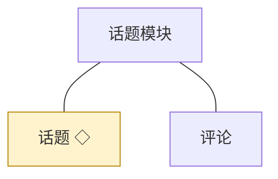
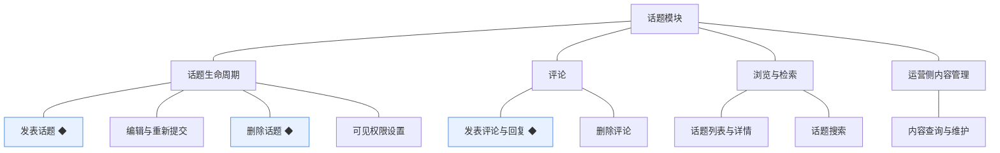
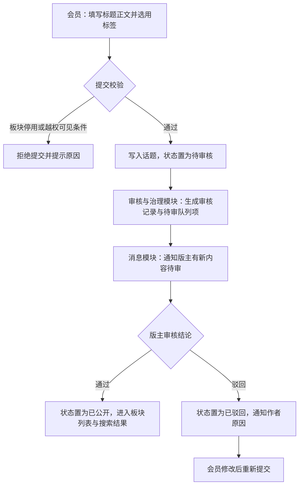
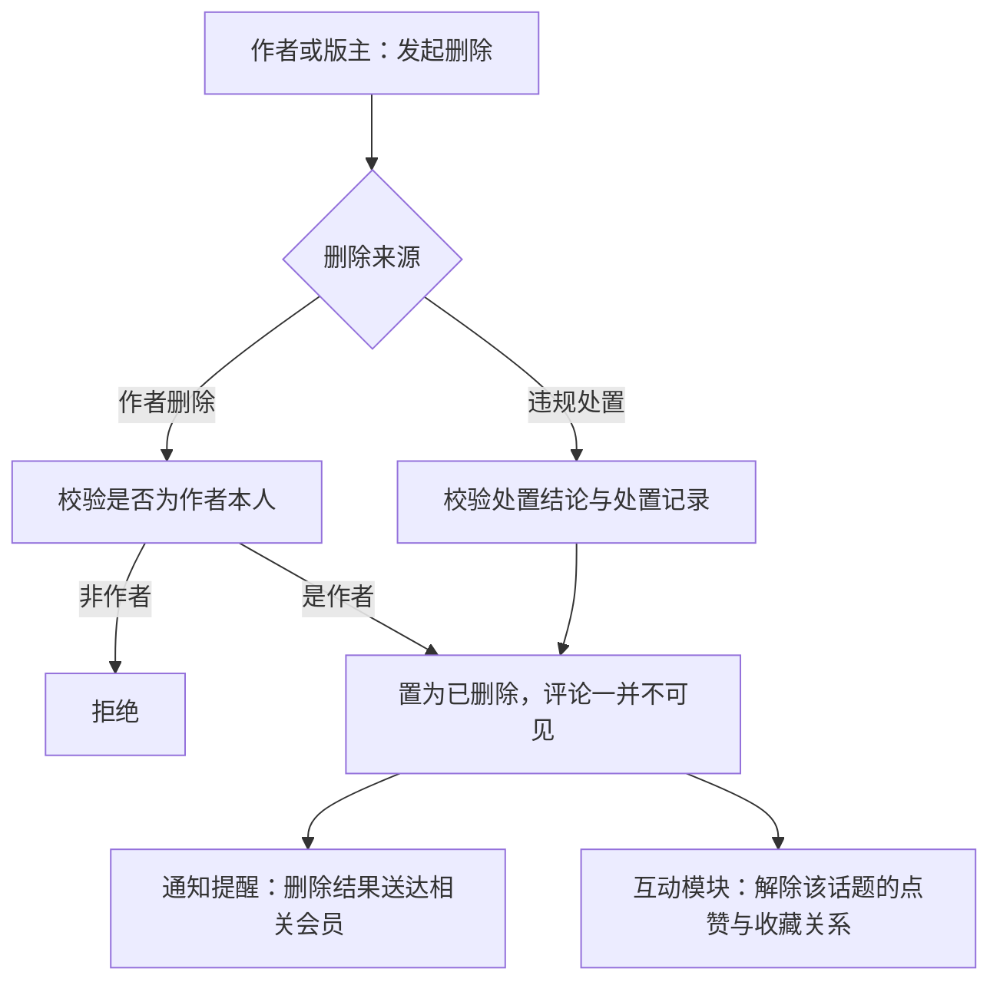
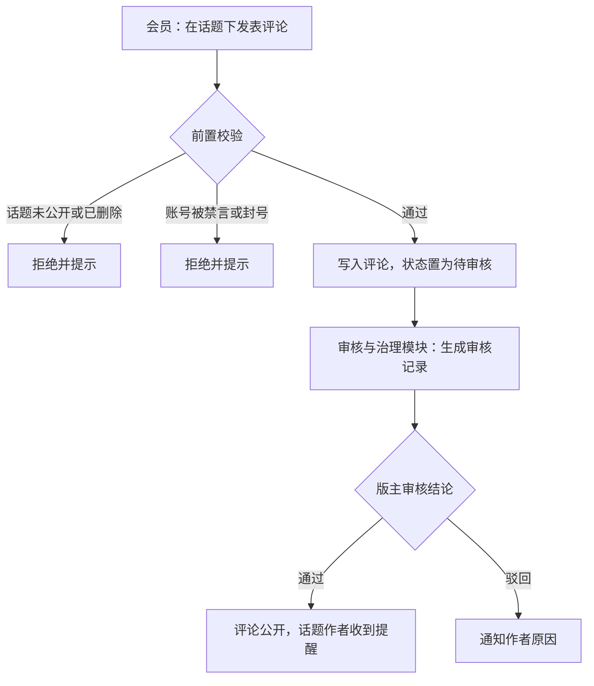
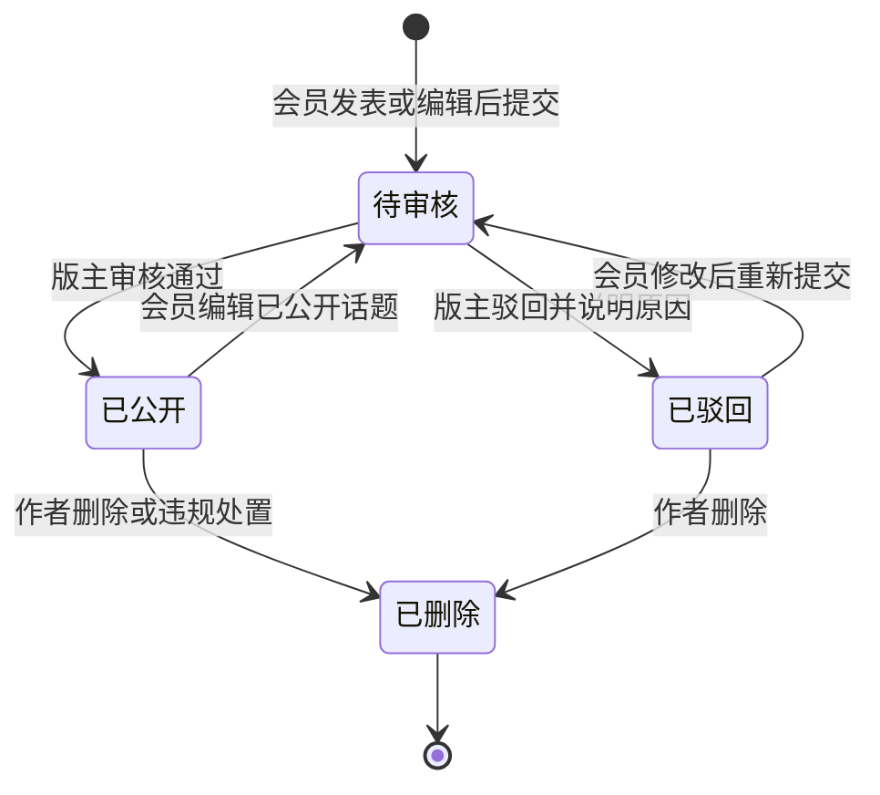
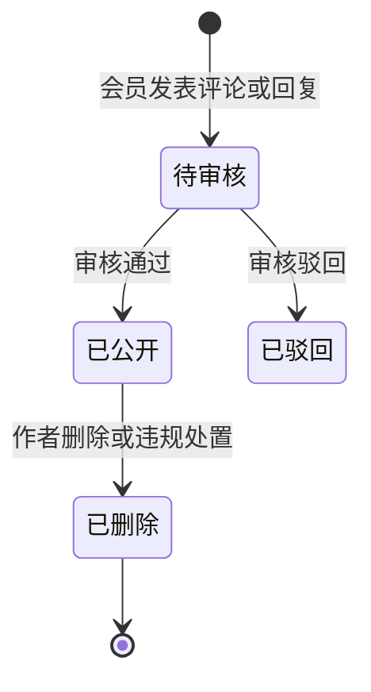

# 模块设计：话题模块

> 定位：对应技术文档《系统构成》中的「话题模块」，是总览第 2.3 节小节的同构放大。规则句末括注来源：D 为 PRD 关键设计决策编号、K 为技术文档关键技术决策、开发规范为 04A 条目、本轮建议为本模块拍板。

## 1. 职责与边界

**管**：论坛讨论线——话题的发表、编辑与重新提交、删除、可见权限，评论的发表与删除，以及话题与评论的列表、详情与搜索。

**不管**：审核结论、驳回与违规处置归审核与治理模块；点赞、收藏归互动模块；浏览量累计归运营与设置模块；板块与标签本身归板块与标签模块；站内消息的送达归消息模块。

**边界一句话**：本模块负责"讨论内容怎么写、给谁看"，公开与否一律由审核与治理模块的结论决定。

## 2. 对象

### 2.1 对象结构

### 2.2 对象说明

**话题**

- 定位：论坛讨论的主帖，讨论闭环的载体，也是搜索与浏览的主要对象。
- 关键组成：编号、标题、正文、所属板块、标签集合、作者、可见条件、审核状态、发布时间。
- 关系与约束：状态为待审核、已公开、已驳回、已删除，已删除为终态（术语表）；只有已公开话题可被评论、点赞、收藏与举报；可见条件不改变审核结论，只在已公开内容上进一步限定可见范围（D3、本轮建议）。

**评论**

- 定位：话题下的互动回复，讨论深度的来源。
- 关键组成：编号、所属话题、作者、正文、审核状态、发布时间。
- 关系与约束：依附于话题，话题不可见或已删除时评论一并不可见（本轮建议）；评论不单独设置可见条件。

### 2.3 共享对象

| 对象 | 共享方式 | 使用方 | 使用契约 |
|---|---|---|---|
| 话题 | 标识引用，统一由本模块写入 | 互动、审核与治理、运营与设置 | 互动方按标识建立与解除关系；治理方作出结论后由本模块回写状态；统计方按标识累计浏览量 |

## 3. 功能

### 3.1 功能结构

### 3.2 话题生命周期

| 功能 | 使用方 | 说明 |
|---|---|---|
| 发表话题 | 会员 | 在板块内填写标题与正文、选用标签后提交，进入待审核 |
| 编辑话题 | 会员 | 修改自己的话题；已公开话题修改后重新进入待审核 |
| 重新提交 | 会员 | 被驳回的话题修改后再次提交审核 |
| 删除话题 | 会员、审核与治理模块 | 作者可删除自己的话题；治理侧删除由违规处置发起 |
| 可见权限设置 | 会员 | 按等级、积分、回复可见等条件限定自己话题的可见范围 |

### 3.3 评论

| 功能 | 使用方 | 说明 |
|---|---|---|
| 发表评论与回复 | 会员 | 在已公开话题下评论；对评论的回复按层级呈现 |
| 删除评论 | 会员、审核与治理模块 | 作者可删除自己的评论；治理侧删除由违规处置发起 |
| 查看评论 | 访客、会员 | 按话题查看评论列表 |

### 3.4 浏览与检索

| 功能 | 使用方 | 说明 |
|---|---|---|
| 话题列表与详情 | 访客、会员 | 按板块、标签浏览话题，查看详情与评论 |
| 话题搜索 | 访客、会员 | 按关键词检索已公开话题 |
| 可见判定 | 访客、会员 | 按可见条件判定当前身份能否查看内容 |

### 3.5 运营侧内容管理

| 功能 | 使用方 | 说明 |
|---|---|---|
| 内容查询与维护 | 运营人员 | 检索并维护站内话题与评论（本模块对象范围；PRD 功能全景·会员与内容管理） |

### 3.6 复杂功能详述

**◆ 发表话题**（谁、入口、做什么、结果）：会员在前台板块内发表话题，提交后生成待审核话题并进入审核队列，同时通知版主；审核通过后公开可见。

- (1) 话题状态与审核记录必须同事务写入，公开以审核通过为唯一条件（D3、总览协作约束表）。
- (2) 提交时校验板块启停与可见条件合法性，停用板块一律拒绝新增（板块与标签模块契约）。
- (3) 敏感词命中只作为审核线索，不直接驳回（K·敏感词校验与处置口径）。
- (4) 审核结论落地后由本模块回写话题状态，治理模块不直接改内容表（总览协作约束表）。
- (5) 待审队列与通知写入失败时整体回滚，不出现"已提交但无人可审"的中间状态（开发规范·事务与一致性）。

**◆ 删除话题**（谁、入口、做什么、结果）：作者在话题详情删除自己的话题，或版主经违规处置删除；删除后话题及其评论不可见。

- (1) 话题删除为终态，不因后续操作恢复（术语表）。
- (2) 违规处置路径的删除必须与处置记录同事务（D6、总览协作约束表）。
- (3) 删除后其点赞、收藏关系一并失效，不残留可见的悬空关系（本轮建议）。
- (4) 作者删除自己的话题不得绕过审核与治理的处置结论（本轮建议）。

**◆ 发表评论与回复**（谁、入口、做什么、结果）：会员在已公开话题下评论或回复他人评论，评论进入待审核，通过后展示。

- (1) 只有已公开话题可被评论，未公开内容不进入互动面（D3）。
- (2) 禁言与封号的账号不能发表评论，校验取自会员与权限模块（会员与权限模块契约·校验可否发言）。
- (3) 评论与审核记录同事务写入（D3）。
- (4) 评论审核通过后向话题作者写入提醒（消息模块契约）。

## 4. 状态

**话题**（有状态）：

| 流转 | 触发条件 | 伴随动作与约束 |
|---|---|---|
| 待审核 → 已公开 | 审核通过 | 写入审核记录；进入列表与搜索；通知作者 |
| 待审核 → 已驳回 | 审核驳回 | 写入驳回原因；通知作者 |
| 已公开 → 待审核 | 作者编辑 | 编辑后重新审核，审核期间按原可见性保留还是下架由本轮建议定：按原状态保留可见，但标记为审核中（本轮建议） |
| 已公开 → 已删除 | 作者删除或违规处置 | 评论一并不可见；解除互动关系；终态 |

**评论**（有状态）：待审核、已公开、已驳回、已删除，删除为终态；评论不单独设置可见条件，随话题可见性变化。

| 流转 | 触发条件 | 伴随动作与约束 |
|---|---|---|
| 待审核 → 已公开 | 审核通过 | 写入审核记录；进入话题详情的评论列表；通知话题作者 |
| 待审核 → 已驳回 | 审核驳回 | 写入驳回原因；通知作者 |
| 已公开 → 已删除 | 作者删除或违规处置 | 不再可见；终态 |

## 5. 对外契约

| 操作 | 语义 | 调用方 | 关键约束 |
|---|---|---|---|
| 回写话题状态 | 审核结论落地后变更话题状态 | 审核与治理模块 | 只接受审核结论驱动的状态变更，与审核记录同事务 |
| 回写评论状态 | 同上 | 审核与治理模块 | 同上 |
| 提交处置删除 | 违规处置触发删除 | 审核与治理模块 | 与处置记录同事务，删除为终态 |
| 读取话题摘要 | 展示标题与摘要 | 互动、运营与设置 | 只读 |
| 校验内容可见 | 判定当前身份能否查看 | 前台页面 | 可见条件与审核状态同时成立才可见 |
| 累计浏览量 | 内容被查看时计数 | 运营与设置模块 | 由统计方按标识累计，本模块不改计数 |
| 内容查询与维护 | 运营侧检索并维护话题与评论 | 管理后台（运营人员） | 维护动作留痕；删除仍走违规处置或作者删除 |

## 6. 待议与版本级事项

- **本轮建议**：已公开话题编辑后按原可见性保留并标记审核中；话题删除连带解除互动关系；作者删除不绕过治理结论；评论不设独立可见条件。
- **待业务确认**：可见条件的组合方式与判定优先级（等级、积分、回复可见并存时的口径）留版本级细化；话题被驳回后的可修改次数是否设限。
- **留版本级**：发帖页与详情页的字段与交互、评论的层级与分页口径、搜索的排序口径、编辑器形态。
- **明确不做**：话题置顶与加精等运营位标记（输入未出现，本轮不纳入）；多级子话题与引用转发。
- **关联评审**：若引入富文本编辑器，需同步评审内容净化与模板输出转义规则（开发规范·模板输出）。
