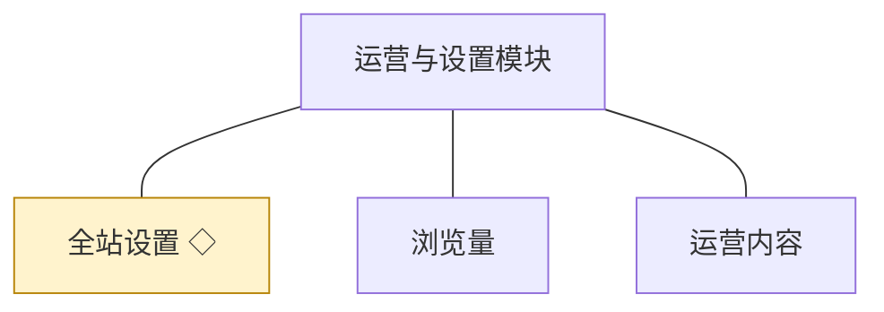
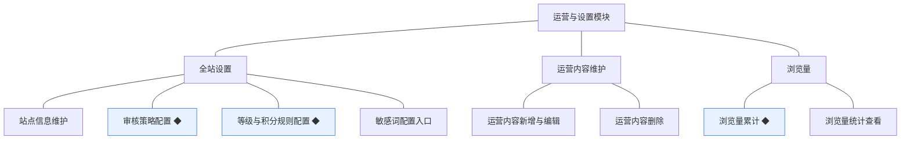
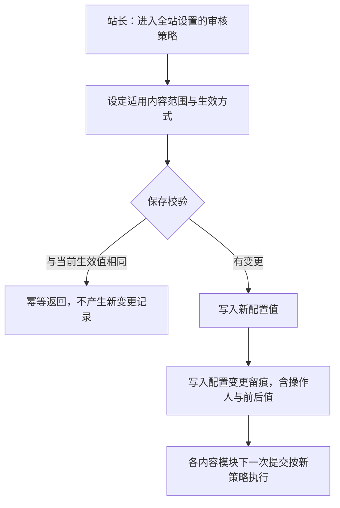
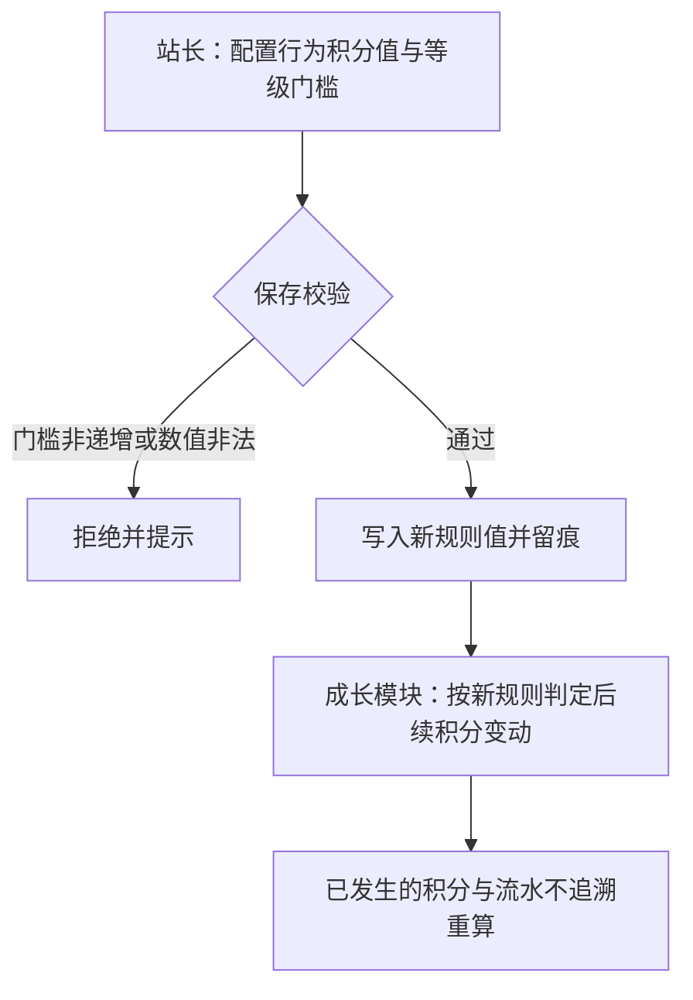
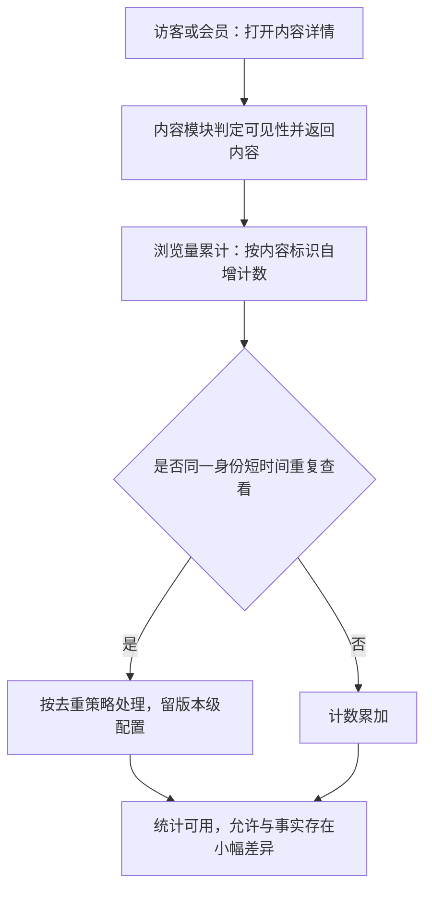

# 模块设计：运营与设置模块

> 定位：对应技术文档《系统构成》中的「运营与设置模块」，是总览第 2.9 节小节的同构放大。规则句末括注来源：D 为 PRD 关键设计决策编号、K 为技术文档关键技术决策、开发规范为 04A 条目、本轮建议为本模块拍板。

## 1. 职责与边界

**管**：站点级参数与运营数据——全站设置的查看与修改、审核策略与等级积分规则等配置入口、运营内容维护、浏览量的累计与统计查看。

**不管**：审核与处置动作本身归审核与治理模块；等级的判定与账本归成长模块；内容本身归话题模块与问答与悬赏模块；板块与标签归板块与标签模块。

**边界一句话**：本模块管"规则与参数放在哪里、由谁改"，不代替各模块执行规则。

## 2. 对象

### 2.1 对象结构

### 2.2 对象说明

**全站设置**

- 定位：站点级参数与开关的集中存放处，规则变更的落点。
- 关键组成：站点信息、审核策略、等级与积分规则、敏感词配置入口。
- 关系与约束：被会员与权限、话题、问答与悬赏、审核与治理、成长等模块统一读取（总览协作约束表·规则读取）；变更后对全站即时生效；变更必须留痕（开发规范·留痕机制）。

**浏览量**

- 定位：内容被查看次数的统计记录，经营方判断内容热度的基础数据。
- 关键组成：内容标识、内容类型、累计次数、最近累计时间。
- 关系与约束：记录型对象；允许冗余存储作为查询加速值，可由事实记录校正（开发规范·全局数据共识）；不参与内容可见性判定。

**运营内容**

- 定位：运营人员维护的推荐与引导性内容（如公告、推荐位），在站点前台运营位展示。
- 关键组成：编号、标题、正文、展示位置、启停状态、发布时间。
- 关系与约束：由本模块持有与维护；新增、编辑与删除均为软删除语义（被引用不可删）；具体形态（推荐位、公告或专题）留版本级（PRD 备忘·待业务确认）。

### 2.3 共享对象

| 对象 | 共享方式 | 使用方 | 使用契约 |
|---|---|---|---|
| 全站设置 | 统一读取接口，配置变更由本模块写入 | 会员与权限、话题、问答与悬赏、审核与治理、成长 | 他方只读取配置值，不缓存写死；变更后按最新值生效 |

## 3. 功能

### 3.1 功能结构

### 3.2 全站设置

| 功能 | 使用方 | 说明 |
|---|---|---|
| 站点信息维护 | 站长 | 维护站点名称、说明等基础信息 |
| 审核策略配置 | 站长 | 设定先审后发的适用范围 |
| 等级与积分规则配置 | 站长 | 设定行为积分值与等级门槛，供成长模块读取 |
| 敏感词配置入口 | 站长 | 进入审核与治理模块的词表维护 |
| 设置查看 | 站长、运营人员 | 查看当前生效的全部配置 |

### 3.3 运营内容

| 功能 | 使用方 | 说明 |
|---|---|---|
| 运营内容新增 | 运营人员 | 新增推荐与引导性内容 |
| 运营内容编辑 | 运营人员 | 修改已发布的运营内容 |
| 运营内容删除 | 运营人员 | 下架不再需要的运营内容 |

### 3.4 浏览量

| 功能 | 使用方 | 说明 |
|---|---|---|
| 浏览量累计 | 系统（内容被查看时） | 累计内容被查看次数 |
| 浏览量统计查看 | 站长、运营人员 | 查看内容热度，支撑运营调整 |

### 3.5 复杂功能详述

**◆ 审核策略配置**（谁、入口、做什么、结果）：站长在管理后台配置先审后发的适用范围，保存后全站即时生效，配置变更留痕。

- (1) 配置变更必须留痕：记录操作人、时间与前后值（开发规范·留痕机制）。
- (2) 各模块一律从本模块读取策略，不在模块内写死（总览协作约束表·规则读取）。
- (3) 策略变更只影响变更之后的内容提交，已产生的内容状态不追溯（本轮建议）。
- (4) 相同值重复保存幂等处理，不产生重复变更记录（开发规范·幂等）。

**◆ 等级与积分规则配置**（谁、入口、做什么、结果）：站长配置行为奖励的积分值与等级门槛，保存后由成长模块按新规则判定，配置变更留痕。

- (1) 等级门槛必须递增且不重复，校验不通过一律拒绝（本轮建议）。
- (2) 规则变更不追溯重算历史积分与等级，只作用于后续变动（本轮建议）。
- (3) 规则值与变更留痕一并保存（开发规范·留痕机制）。

**◆ 浏览量累计**（谁、入口、做什么、结果）：内容被查看时累计浏览量，作为热度数据供经营方查看。

- (1) 浏览量不参与内容可见性与排序的强判定，仅作参考数据（本轮建议）。
- (2) 计数允许冗余存储，可由事实记录校正（开发规范·全局数据共识）。
- (3) 累计失败不阻断内容展示（开发规范·事务外交互口径的延伸）。
- (4) 去重口径留版本级配置，机制上支持开关（本轮建议）。

## 4. 状态

**全站设置**（无状态）：设置是键值与配置集合，变更以留痕记录表达，不承载生命周期；同一配置项始终只有一个生效值。

**浏览量**（无状态）：浏览量是持续累加的记录型数据，不需要状态流转；校正与去重策略由机制表达。

**运营内容**（无状态）：运营内容以启停表达上下架事实，删除为软删除语义，不承载生命周期状态机。

## 5. 对外契约

| 操作 | 语义 | 调用方 | 关键约束 |
|---|---|---|---|
| 读取配置值 | 供各模块读取生效规则 | 会员与权限、话题、问答与悬赏、审核与治理、成长 | 只读；不得在调用方缓存写死 |
| 变更配置值 | 站长修改站点参数与规则 | 管理后台 | 与变更留痕同事务；相同值幂等 |
| 累计浏览量 | 内容被查看时计数 | 话题、问答与悬赏 | 不阻断内容展示；允许冗余并可校正 |
| 读取浏览量统计 | 经营方查看内容热度 | 管理后台 | 只读 |
| 维护运营内容 | 运营内容的新增、编辑与删除 | 运营人员 | 删除为软删除语义，被引用不可删 |
| 读取运营内容 | 前台运营位展示运营内容 | 前台页面 | 只读，按展示位置与启停状态取用 |

## 6. 待议与版本级事项

- **本轮建议**：配置变更不追溯已发生内容与积分；等级门槛必须递增；浏览量不参与排序强判定；累计失败不阻断展示。
- **待业务确认**：浏览量的去重口径（同一身份短时间内重复查看是否计数）；运营内容的具体形态（推荐位、公告或专题）。
- **留版本级**：全站设置的配置项分组与页面、运营内容的编辑形态与展示位置、统计查看的维度与粒度。
- **明确不做**：无真实依据的性能指标与容量规划（PRD 备忘）；埋点体系与第三方统计接入。
- **关联评审**：若引入统计报表或埋点体系，需评审数据来源与口径，并同步技术文档的数据使用决策。
