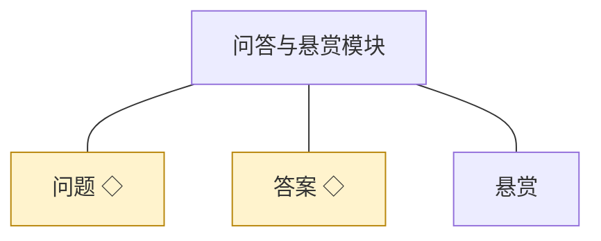
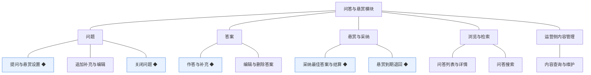
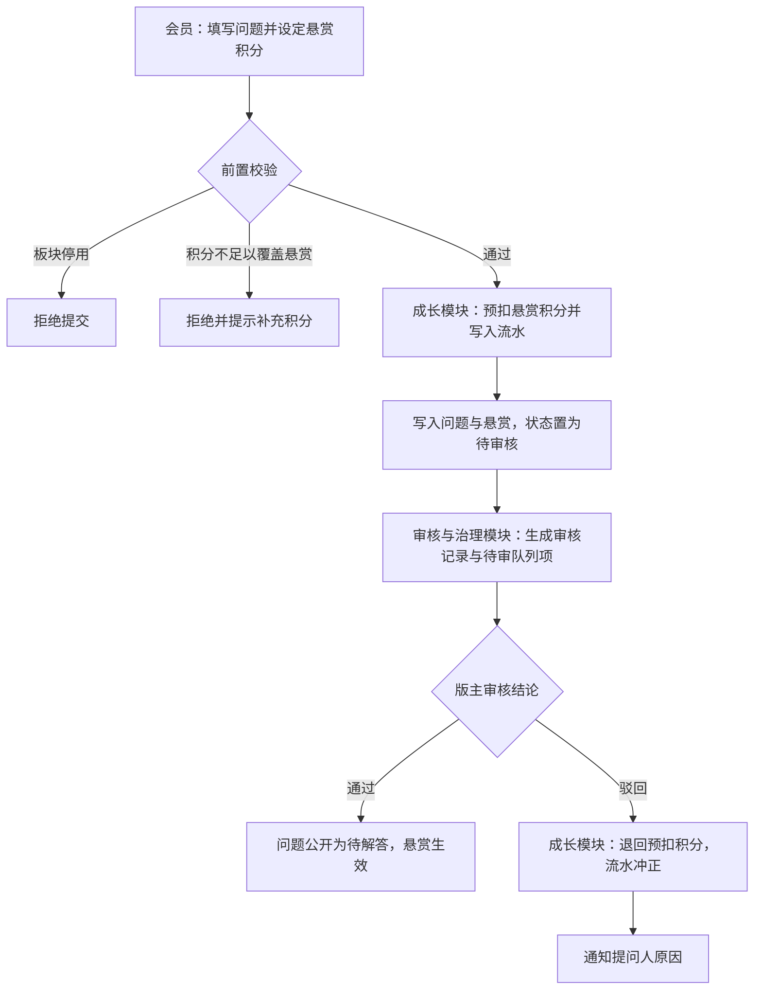
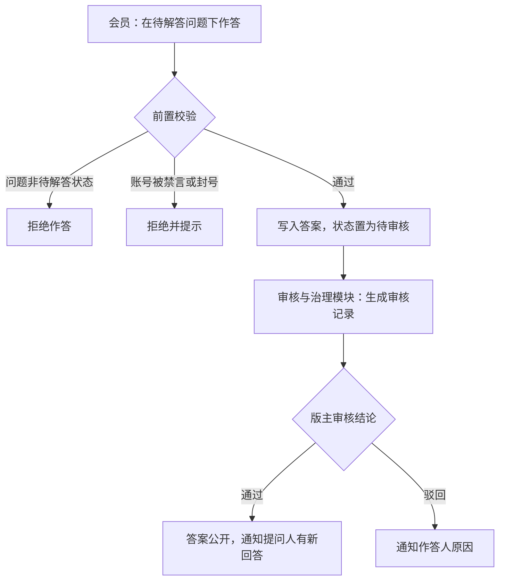
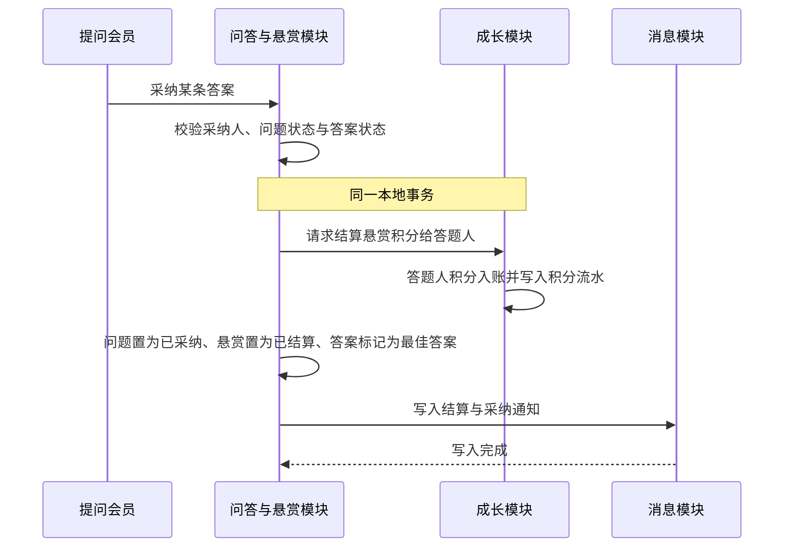
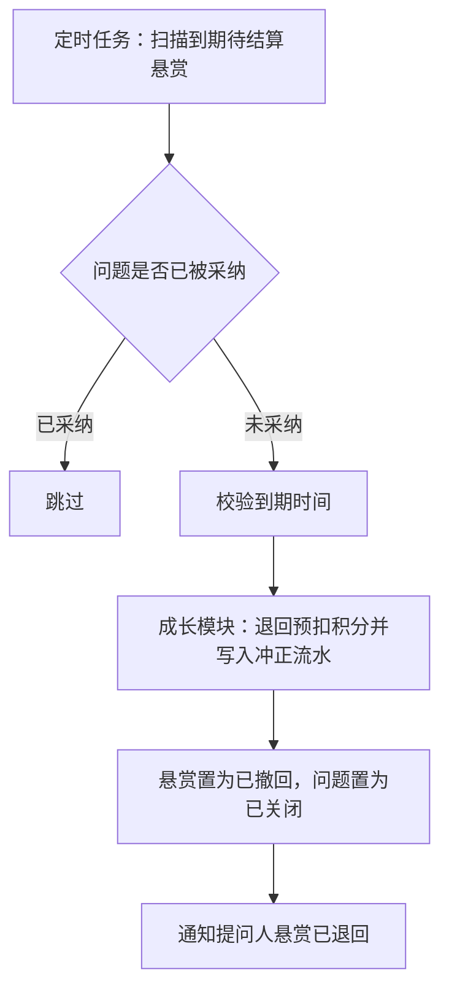
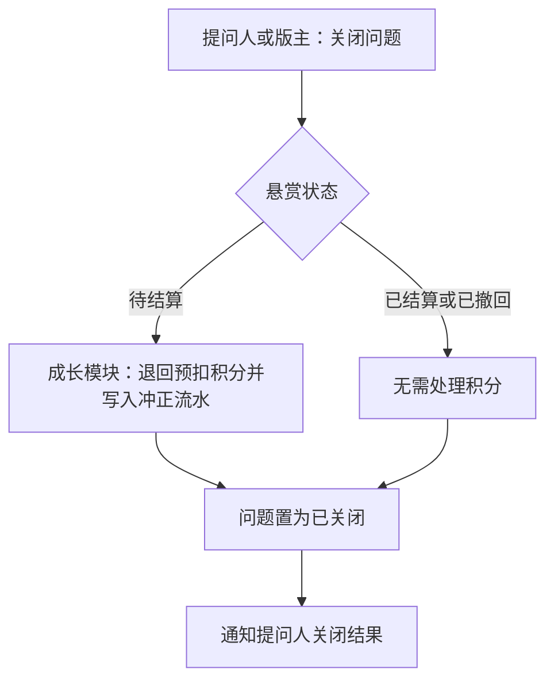
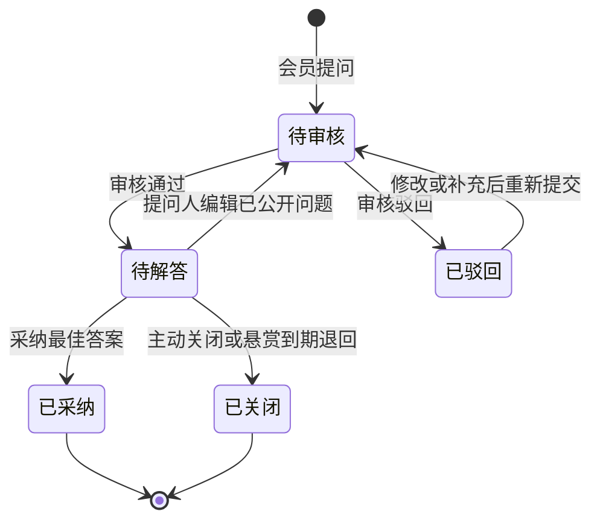
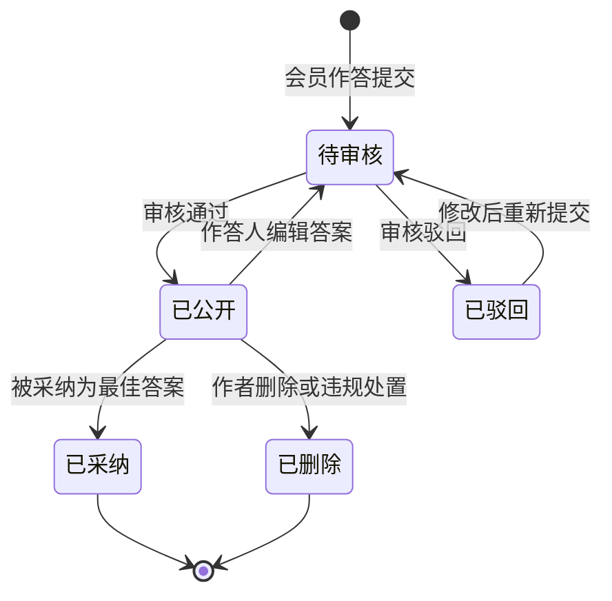
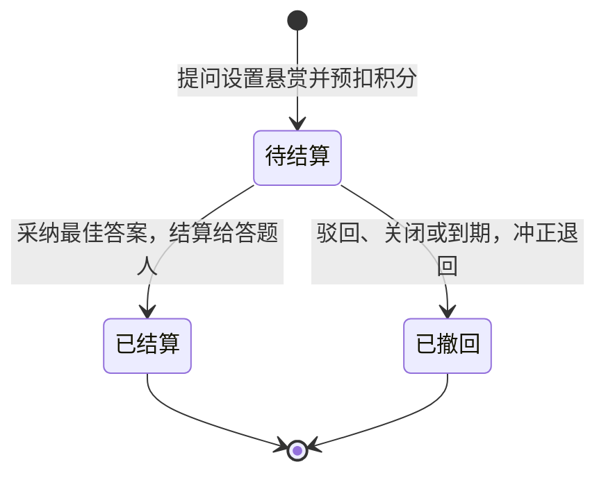

# 模块设计：问答与悬赏模块

> 定位：对应技术文档《系统构成》中的「问答与悬赏模块」，是总览第 2.4 节小节的同构放大。规则句末括注来源：D 为 PRD 关键设计决策编号、K 为技术文档关键技术决策、开发规范为 04A 条目、本轮建议为本模块拍板。

## 1. 职责与边界

**管**：问答线——问题的发表、追加补充与关闭，答案的作答与删除，悬赏的设置、结算与退回，最佳答案的采纳，以及问答的列表、详情与搜索。

**不管**：积分的记账与余额归成长模块；审核结论与举报处置归审核与治理模块；点赞、收藏归互动模块；浏览量与规则配置归运营与设置模块。

**边界一句话**：本模块决定"答得好的标准与悬赏的归属"，积分的实际进出账一律记账在成长模块。

## 2. 对象

### 2.1 对象结构

### 2.2 对象说明

**问题**

- 定位：悬赏问答的提问主体，问答闭环的起点。
- 关键组成：编号、标题、正文、追加补充、所属板块、提问人、悬赏关联、审核状态、发布时间。
- 关系与约束：状态为待审核、待解答、已驳回、已采纳、已关闭，已采纳与已关闭为终态（术语表）；追加补充不改变悬赏金额（本轮建议）；只有待解答问题可被作答。

**答案**

- 定位：对问题的作答，被采纳者成为最佳答案。
- 关键组成：编号、所属问题、作答人、正文、补充、审核状态、是否被采纳。
- 关系与约束：一个答案只属于一个问题；被采纳的答案不能被删除（本轮建议）；作答人不能采纳自己的答案（本轮建议）。

**悬赏**

- 定位：提问人为问题设置的积分回报，是问答闭环的价值凭证。
- 关键组成：悬赏积分、状态、结算对象、结算时间。
- 关系与约束：与问题一对一；状态为待结算、已结算、已撤回，均为明确终态（术语表）；悬赏积分在问题发表时从提问人积分账户冻结或预扣，由成长模块记账（K·积分结算用事务保证）。

### 2.3 共享对象

| 对象 | 共享方式 | 使用方 | 使用契约 |
|---|---|---|---|
| 问题 | 标识引用，统一由本模块写入 | 互动、审核与治理、运营与设置 | 治理方作出结论后由本模块回写状态；统计方按标识累计浏览量 |
| 答案 | 标识引用，统一由本模块写入 | 互动、审核与治理 | 同上；被采纳状态只由本模块变更 |

## 3. 功能

### 3.1 功能结构

### 3.2 问题

| 功能 | 使用方 | 说明 |
|---|---|---|
| 提问 | 会员 | 填写标题与正文、设定悬赏积分后提交，进入待审核 |
| 追加补充 | 会员 | 在问题下追加条件与背景，不改变悬赏金额 |
| 编辑问题 | 会员 | 修改标题与正文，已公开问题修改后重新进入待审核 |
| 关闭问题 | 提问人、审核与治理模块 | 提问人可主动关闭不再需要解答的问题；治理侧关闭由违规处置发起 |
| 查看问题 | 访客、会员 | 查看问题详情、答案列表与悬赏状态 |

### 3.3 答案

| 功能 | 使用方 | 说明 |
|---|---|---|
| 作答 | 会员 | 在待解答问题下作答，提交后进入待审核 |
| 补充答案 | 会员 | 对自己的答案追加补充 |
| 编辑答案 | 会员 | 修改自己的答案，修改后重新进入待审核 |
| 删除答案 | 会员、审核与治理模块 | 作者可删除自己的答案；被采纳的答案不可删除 |
| 查看答案 | 访客、会员 | 按问题查看答案，最佳答案优先展示 |

### 3.4 悬赏与采纳

| 功能 | 使用方 | 说明 |
|---|---|---|
| 设置悬赏 | 会员 | 提问时设定悬赏积分 |
| 采纳最佳答案 | 提问人 | 从答案中选择一个采纳，悬赏随之结算 |
| 悬赏到期退回 | 系统（定时任务） | 悬赏到期仍无人被采纳时，积分退回提问人 |
| 查看悬赏 | 访客、会员 | 展示悬赏积分与状态 |

### 3.5 浏览与检索

| 功能 | 使用方 | 说明 |
|---|---|---|
| 问答列表与详情 | 访客、会员 | 按板块浏览问答列表，查看问题详情与答案列表 |
| 问答搜索 | 访客、会员 | 按关键词检索已公开的问题与答案（PRD 功能全景·站内搜索） |

### 3.6 运营侧内容管理

| 功能 | 使用方 | 说明 |
|---|---|---|
| 内容查询与维护 | 运营人员 | 检索并维护站内问题与答案（本模块对象范围；PRD 功能全景·会员与内容管理） |

### 3.7 复杂功能详述

**◆ 提问与悬赏设置**（谁、入口、做什么、结果）：会员在前台发表问题并设定悬赏积分，提交后问题进入待审核，悬赏随之建立并预扣积分；审核通过后公开为待解答。

- (1) 悬赏积分在提交时预扣，驳回或到期时退回，全程记账在成长模块（K·积分结算用事务保证）。
- (2) 预扣与问题创建必须同事务，不出现"扣了积分没有悬赏"的中间状态（开发规范·事务与一致性）。
- (3) 悬赏金额不得高于提问人可用积分（本轮建议）。
- (4) 问题与审核记录同事务写入（D3）。
- (5) 驳回时的退回必须以冲正流水的形式记录，不删除原流水（开发规范·变动类数据留流水）。

**◆ 作答与补充**（谁、入口、做什么、结果）：会员对待解答问题作答，提交后进入待审核；通过后公开并通知提问人。

- (1) 只有待解答问题可被作答（D3、状态机约束）。
- (2) 作答人不能是被禁言或封号的账号（会员与权限模块契约）。
- (3) 答案与审核记录同事务写入（D3）。
- (4) 通知提问人由消息模块在同一事务内写入（总览协作约束表·通知送达）。

**◆ 采纳最佳答案与结算**（谁、入口、做什么、结果）：提问人在自己的问题下采纳一个答案，悬赏积分结算给答题人，问题进入已采纳终态。

- (1) 采纳人为提问人本人，且问题处于待解答状态、答案处于已公开状态（本轮建议）。
- (2) 悬赏状态变更、积分入账与积分流水必须同一事务完成（D4、K·积分结算用事务保证）。
- (3) 同一问题只能采纳一次，重复采纳必须被唯一约束或条件更新拒绝（开发规范·幂等）。
- (4) 结算与采纳通知同事务写入，通知双方（总览协作约束表）。
- (5) 已采纳为终态，不可撤回与换人（术语表）。

**◆ 悬赏到期退回**（谁、入口、做什么、结果）：系统定时扫描到期待结算悬赏，把预扣积分退回提问人，问题关闭。

- (1) 任务必须可重入：同一悬赏重复扫描不产生重复退回（开发规范·定时任务可重入）。
- (2) 退回以冲正流水表达，保留原预扣记录（开发规范·变动类数据留流水）。
- (3) 到期的具体时限留版本级配置，机制按"可配置的到期时限"实现（PRD 备忘·建议默认）。
- (4) 关闭为终态，退回后问题不再接受新答案（术语表）。

**◆ 关闭问题**（谁、入口、做什么、结果）：提问人主动关闭不再需要解答的问题，或治理侧经违规处置关闭；关闭时按规则处理悬赏。

- (1) 关闭为终态，关闭后不再接受作答（术语表）。
- (2) 治理侧关闭与处置记录同事务（D6）。
- (3) 关闭时悬赏的退回规则与到期退回一致（本轮建议）。

## 4. 状态

**问题**（有状态）：

| 流转 | 触发条件 | 伴随动作与约束 |
|---|---|---|
| 待审核 → 待解答 | 审核通过 | 悬赏生效；进入列表与搜索 |
| 待审核 → 已驳回 | 审核驳回 | 退回预扣积分并写冲正流水；通知提问人 |
| 待解答 → 待审核 | 提问人编辑已公开问题 | 重新进入审核；审核期间原文保留可见并标注审核中（与话题模块编辑同口径） |
| 待解答 → 已采纳 | 采纳最佳答案 | 结算积分；通知双方；终态 |
| 待解答 → 已关闭 | 主动关闭或到期退回 | 退回或保留积分；通知提问人；终态 |

**答案**（有状态）：待审核、已公开、已驳回、已采纳、已删除；已采纳与已删除为终态，被采纳的答案不得删除。

| 流转 | 触发条件 | 伴随动作与约束 |
|---|---|---|
| 待审核 → 已公开 | 审核通过 | 写入审核记录；进入答案列表与搜索；通知提问人 |
| 待审核 → 已驳回 | 审核驳回 | 写入驳回原因；通知作答人 |
| 已驳回 → 待审核 | 作答人修改后重新提交 | 生成新的审核记录 |
| 已公开 → 待审核 | 作答人编辑答案 | 重新进入审核，审核期间原文保留可见并标注审核中（与话题编辑同口径，本轮建议） |
| 已公开 → 已采纳 | 提问人采纳为最佳答案 | 与悬赏结算、积分入账、双方流水同一事务；标记最佳；终态 |
| 已公开 → 已删除 | 作者删除或违规处置 | 不再可见；终态；被采纳的答案不得删除，治理处置改为标记（本轮建议） |

**悬赏**（有状态）：待结算、已结算、已撤回；已结算与已撤回为终态，与问题的状态流转一一对应。

| 流转 | 触发条件 | 伴随动作与约束 |
|---|---|---|
| 待结算 → 已结算 | 提问人采纳最佳答案 | 答题人积分入账与双方流水同一事务（D4、K·积分结算用事务保证）；通知双方；终态 |
| 待结算 → 已撤回 | 审核驳回、提问人关闭或悬赏到期 | 冲正流水退回预扣积分；通知提问人；终态；同一悬赏不重复退回（开发规范·定时任务可重入） |

## 5. 对外契约

| 操作 | 语义 | 调用方 | 关键约束 |
|---|---|---|---|
| 回写问题状态 | 审核结论落地后变更问题状态 | 审核与治理模块 | 与审核记录同事务；驳回同时触发积分退回 |
| 回写答案状态 | 同上 | 审核与治理模块 | 同上 |
| 提交处置删除 | 违规处置触发删除或关闭 | 审核与治理模块 | 被采纳答案不删除，改为标记处置（本轮建议） |
| 读取问题与答案摘要 | 展示标题、摘要与悬赏状态 | 互动、运营与设置 | 只读 |
| 请求积分结算 | 采纳或退回时请求成长模块记账 | 本模块调用成长模块 | 同一事务内完成，失败整体回滚 |
| 校验悬赏状态 | 供外部判断是否可互动 | 互动、审核与治理 | 只读 |
| 内容查询与维护 | 运营侧检索并维护问题与答案 | 管理后台（运营人员） | 维护动作留痕；删除仍走违规处置或作者删除 |

## 6. 待议与版本级事项

- **本轮建议**：悬赏提交时预扣、驳回或关闭时冲正退回；作答人不能自采纳；同一问题只能采纳一次；关闭与到期退回规则一致；被采纳答案不可删除。
- **待业务确认**：悬赏到期时限的具体数值（PRD 备忘·建议默认按可配置实现）；悬赏是否允许提问人中途调整金额。
- **留版本级**：提问与作答页的字段与交互、答案排序口径、到期时限配置项、通知文案。
- **明确不做**：真实资金悬赏与平台分成（D4、K·明确不采用）；悬赏撮合、专家推荐与付费围观。
- **关联评审**：若后续引入资金悬赏，需重新评审悬赏的预扣与结算机制、支付通道与冻结策略，并同步技术文档与开发规范。
