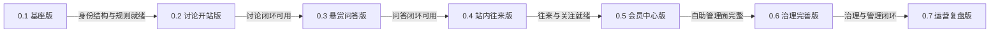
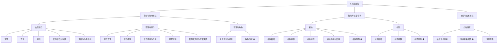
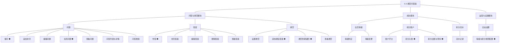
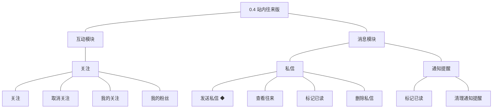
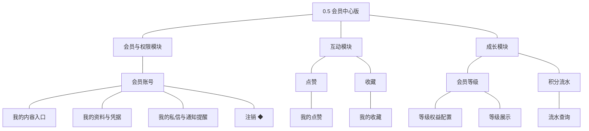
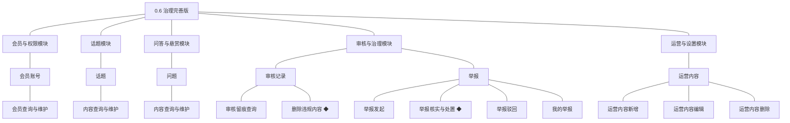
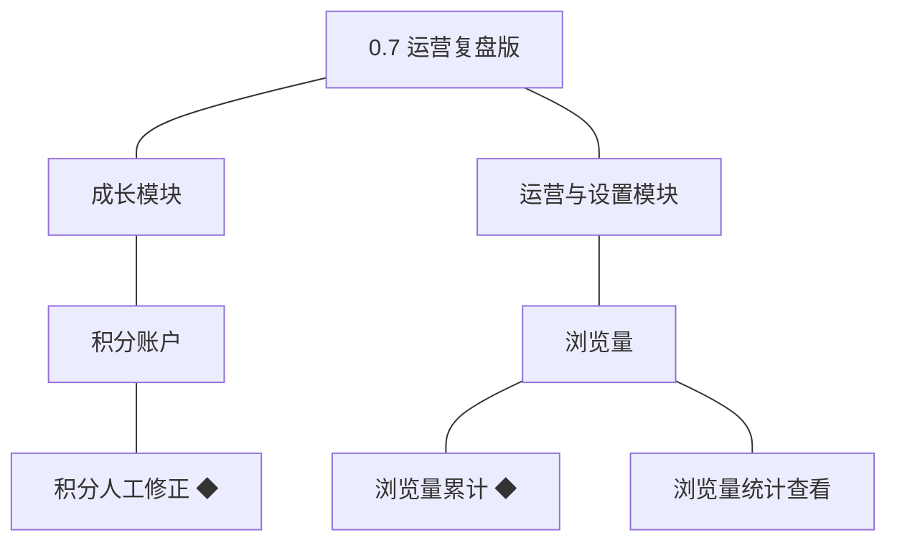

# 产品路线图（项目）：巡云轻论坛

> 定位：项目开发的步骤说明书＋大版本母版；活文档（每版复盘后修订后续步骤）。承接 PRD（项目）、技术文档（项目）与模块设计（项目）的既有结论，只拆分不新增；规则与判断句末括注来源（D／K／模块名／本轮拍板）；只写顺序与相对步幅，不写日历日期与工时。上游为模拟案例材料，模拟性质予以保留。

## 1. 拆分思路

按"先内部准备、再开站、后逐条点亮闭环主题"推进：0.1 交付内部可用的身份、权限、结构与规则基座，0.2 即交付可真实开张的最小经营闭环，此后每版点亮一个主题——悬赏问答、站内往来、会员自助面、治理与运营管理、运营复盘。

- **MVP 先行**：0.1 为内部准备版（账号权限与站点结构一体交付），0.2 为开张版（只放讨论闭环的必要功能），开张后逐主题增量（本轮拍板）。
- **目的与归属**：每版目的明确且能力不漏不散；功能归属以其所属模块的主题为准——运营与设置模块随 0.1 点亮（站点与规则配置），审核与治理模块随 0.2 点亮，会员账号状态处置随开站版交付（开站即需治理手段）（本轮拍板）。
- **每步一个主题**：按闭环或能力主题纵向拆（讨论 → 问答 → 往来 → 自助面 → 治理与管理 → 复盘），不横向切功能层（本轮拍板）。
- **步幅均衡**：共七个版本、体量大体均衡；零散功能组并入主题最近的相邻版本（积分人工修正归运营复盘版）（本轮拍板）。
- **依赖定序**：身份与结构先于内容，内容先于审核之外的一切互动；积分引擎先于悬赏（模块总览·跨模块关系）。
- **风险前置**：长周期外部事项（域名注册与备案）在 0.1 立项时启动、0.2 收口；影响开站的待定决策在最早已受影响版本的依赖行显式列出，同一决策全文只有一个归属时点（本轮拍板）。

## 2. 版本序列

### 2.1 0.1 基座版

**功能清单**（承接各模块详细设计 04C，只列本版交付，按模块分列）

**会员与权限模块**
| 功能 | 使用方 | 说明 |
|---|---|---|
| 注册 | 访客 | 账号密码方式建立会员账号（D4） |
| 登录 | 访客、会员 | 校验凭据建立登录态（开发规范·鉴权与身份上下文） |
| 退出 | 会员 | 结束当前登录态 |
| 密码修改与重置 | 会员 | 凭据维护，重置后原登录态失效 |
| 资料与头像维护 | 会员 | 维护昵称与头像等对外信息 |
| 账号开通 | 站长 | 建立管理端账号并分配初始角色（D5） |
| 账号编辑 | 站长 | 修改账号资料 |
| 账号停用与启用 | 站长 | 停用后不能登录 |
| 账号注销 | 站长 | 离职注销，进入停用终态 |
| 角色定义与调整 | 站长 | 定义角色与能力点集合（D5） |
| 角色分配 ◆ | 站长 | 角色分配给账号，页面与接口同一套判定（D5） |
| 管理端资料与凭据重置 | 站长、运营人员、版主 | 内部人员自助管理面（PRD 功能全景·个人设置） |
**板块与标签模块**
| 功能 | 使用方 | 说明 |
|---|---|---|
| 板块新增 | 站长 | 建立板块并设定名称与说明 |
| 板块编辑 | 站长、运营人员 | 修改名称、说明与排序值 |
| 板块排序 | 站长、运营人员 | 调整前台展示次序 |
| 板块停用与启用 | 站长、运营人员 | 停用只影响新增，已有内容仍可读 |
| 板块删除 ◆ | 站长 | 板块下无内容时才可删除 |
| 标签新增 | 运营人员 | 建立标签供发帖选用 |
| 标签编辑 | 运营人员 | 修改标签名称 |
| 标签删除 ◆ | 运营人员 | 未被使用时才可删除 |
**运营与设置模块**
| 功能 | 使用方 | 说明 |
|---|---|---|
| 站点信息维护 | 站长 | 维护站点名称与说明等基础信息 |
| 审核策略配置 ◆ | 站长 | 设定先审后发的适用范围，变更留痕（开站准备随本模块主题交付，PRD 闭环一） |
| 设置查看 | 站长、运营人员 | 查看当前生效配置 |
**核心流程说明**
- **角色分配**：站长定义角色能力点 → 分配给账号 → 能力点判定组件刷新 → 页面与接口同一套判定 → 角色调整留痕（04C-会员与权限模块 3.8）。
- **审核策略配置**：站长设定适用范围 → 写入配置并留痕 → 各内容模块自 0.2 起按新策略执行（04C-运营与设置模块 3.5）。
- **目标**：站点具备内部可用的身份、权限、结构与规则基座——管理端账号与角色授权、会员注册登录、板块与标签、站点参数与审核策略就绪。
- **沿用**：无（首个版本）。
- **不做**：内容生产与审核、积分与等级、互动与消息、前台板块入口（归 0.2）；举报与违规处置（归 0.6）；运营内容（归 0.6）；浏览量统计（归 0.7）。
- **依赖**：无前置版本；域名注册与备案在本版立项时启动（长周期外部事项，0.2 收口）；等级门槛与行为积分值的口径在本版立项时定案（影响 0.3 规则配置，唯一归属时点）。
- **完成标志**：内部演练通过——站长开通账号并分配角色、建立板块与标签、完成站点信息与审核策略配置，一个新会员完成注册登录；未分配角色的管理端账号看不到任何管理入口。
- **验证假设**：内部围绕管理端账号与角色的分工方式够用（判定方式：内部完成一次角色配置演练并调整到稳定）。
### 2.2 0.2 讨论开站版

```mermaid
flowchart TB
    V[0.2 讨论开站版]
    V --- M1[会员与权限模块] & M2[板块与标签模块] & M3[话题模块] & M5[互动模块] & M6[消息模块] & M7[审核与治理模块]
    M1 --- A1[会员账号]
    A1 --- F1[禁言] & F2[解除禁言] & F3[封号]
    M2 --- B1[板块] & B2[标签]
    B1 --- F4[板块列表与导航] & F5[板块内容列表]
    B2 --- F6[标签入口]
    M3 --- C1[话题] & C2[评论]
    C1 --- F7[发表话题 ◆] & F8[编辑话题] & F9[重新提交] & F10[删除话题 ◆] & F11[可见权限设置] & F12[话题列表与详情] & F13[话题搜索] & F14[可见判定]
    C2 --- F15[发表评论与回复 ◆] & F16[删除评论] & F17[查看评论]
    M5 --- E1[点赞] & E2[收藏]
    E1 --- F18[点赞] & F19[取消点赞] & F20[点赞计数]
    E2 --- F21[收藏] & F22[取消收藏]
    M6 --- N1[通知提醒]
    N1 --- F23[写入通知提醒 ◆] & F24[查看通知提醒]
    M7 --- G1[审核记录] & G3[敏感词]
    G1 --- F25[待审队列查看] & F26[审核通过 ◆] & F27[审核驳回 ◆]
    G3 --- F28[词条新增与编辑] & F29[词条删除] & F30[命中校验 ◆]
```

**功能清单**（承接各模块详细设计 04C，只列本版交付，按模块分列）

**话题模块**
| 功能 | 使用方 | 说明 |
|---|---|---|
| 发表话题 ◆ | 会员 | 提交后进入待审核，通过才公开（D3） |
| 编辑话题 | 会员 | 已公开话题修改后重新进入待审核 |
| 重新提交 | 会员 | 被驳回的话题修改后再次提交 |
| 删除话题 ◆ | 会员、审核与治理模块 | 作者可删；治理侧删除归 0.6 |
| 可见权限设置 | 会员 | 按等级、积分、回复可见条件限定可见范围 |
| 话题列表与详情 | 访客、会员 | 按板块与标签浏览与查看 |
| 话题搜索 | 访客、会员 | 按关键词检索已公开话题 |
| 可见判定 | 访客、会员 | 审核状态与可见条件同时成立才可见 |
| 发表评论与回复 ◆ | 会员 | 在已公开话题下评论，进入待审核 |
| 删除评论 | 会员、审核与治理模块 | 作者可删；治理侧删除归 0.6 |
| 查看评论 | 访客、会员 | 按话题查看评论列表 |
**审核与治理模块**
| 功能 | 使用方 | 说明 |
|---|---|---|
| 待审队列查看 | 版主 | 按类型与时间查看待审内容 |
| 审核通过 ◆ | 版主 | 结论通过，内容公开，与审核记录同事务（D3） |
| 审核驳回 ◆ | 版主 | 结论驳回并填写原因，通知作者 |
| 词条新增与编辑 | 站长 | 维护拦截词表 |
| 词条删除 | 站长 | 移除不再需要的词条 |
| 命中校验 ◆ | 系统 | 命中作为审核线索，不自动驳回 |
**互动模块**
| 功能 | 使用方 | 说明 |
|---|---|---|
| 点赞 | 会员 | 对已公开内容点赞，唯一约束保证幂等 |
| 取消点赞 | 会员 | 撤销自己的点赞 |
| 点赞计数 | 前台页面 | 展示内容获得的赞同数 |
| 收藏 | 会员 | 把已公开内容加入收藏夹 |
| 取消收藏 | 会员 | 从收藏夹移除 |
**消息模块**
| 功能 | 使用方 | 说明 |
|---|---|---|
| 写入通知提醒 ◆ | 各业务模块 | 统一写入，与业务变更同事务 |
| 查看通知提醒 | 会员、管理端账号 | 查看审核与互动结果提醒 |
**会员与权限模块**
| 功能 | 使用方 | 说明 |
|---|---|---|
| 禁言 | 审核与治理模块 | 禁言期间不能发表内容与评论（D6） |
| 解除禁言 | 审核与治理模块 | 解除后恢复发言 |
| 封号 | 审核与治理模块 | 终态处置，不能登录（术语表） |
**板块与标签模块**
| 功能 | 使用方 | 说明 |
|---|---|---|
| 板块列表与导航 | 访客、会员 | 按板块浏览话题 |
| 板块内容列表 | 访客、会员 | 板块内按时间呈现内容 |
| 标签入口 | 访客、会员 | 按标签查看同类话题 |
**核心流程说明**
- **发表话题**：会员提交 → 校验板块启停与可见条件 → 写入话题置为待审核 → 生成审核记录与待审队列项 → 通知版主 → 版主结论 → 通过则公开并进列表与搜索，驳回则通知原因（04C-话题模块 3.6）。
- **审核通过／驳回**：版主选择待审内容 → 校验能力点与内容当前状态 → 同一事务内回写内容状态、写入审核记录、写入通知（04C-审核与治理模块 3.6）。
- **状态边界**：话题与评论的公开以审核通过为唯一条件，删除为终态（04C-话题模块 4）。
- **目标**：站点可真实开门——访客能浏览与搜索，会员能发帖并得到公开结果，版主能审核；这是最小可经营闭环。
- **沿用**：0.1 的身份、权限、板块与标签、站点设置与审核策略。
- **不做**：问答与悬赏、积分与等级（归 0.3）；私信与关注（归 0.4）；个人中心聚合与注销（归 0.5）；举报与治理侧删除（归 0.6，过渡：对已公开违规内容先用本版已交付的禁言与封号处置账号，内容处置 0.6 补齐）；会员与内容的全量检索维护（归 0.6，过渡：内容以已交付的前台搜索与待审队列、会员以人工台账支撑）；运营内容（归 0.6）；浏览量统计（归 0.7）。
- **依赖**：前置版本 0.1；域名注册与备案在本版收口（对外发布前置）；禁言的期限与解除条件在本版立项时定案（唯一归属时点）；注册登录方式沿用 PRD 备忘建议默认（站内账号密码）。
- **完成标志**：灰度台阶内完成——环境联调 → 内部全流程演练 → 小范围邀请 → 全量开放；小范围邀请阶段一名真实访客完成"注册 → 浏览板块 → 发表话题 → 审核通过公开 → 被其他会员评论"的完整路径。
- **验证假设**：成员真的愿意发帖与互动（判定方式：小范围邀请期间的真实话题数与评论数达到该版立项时约定的口径）。
### 2.3 0.3 悬赏问答版

**功能清单**（承接各模块详细设计 04C，只列本版交付，按模块分列）

**问答与悬赏模块**
| 功能 | 使用方 | 说明 |
|---|---|---|
| 提问 ◆ | 会员 | 提交后进入待审核，悬赏积分预扣（D4） |
| 追加补充 | 会员 | 追加条件与背景，不改变悬赏金额 |
| 编辑问题 | 会员 | 已公开问题修改后重新进入待审核 |
| 关闭问题 ◆ | 提问人、审核与治理模块 | 关闭为终态，悬赏按规则退回 |
| 查看问题 | 访客、会员 | 查看问题详情、答案列表与悬赏状态 |
| 问答列表与详情 | 访客、会员 | 按板块浏览问答列表，查看问题详情与答案列表 |
| 问答搜索 | 访客、会员 | 按关键词检索已公开的问题与答案（PRD 功能全景·站内搜索） |
| 作答 ◆ | 会员 | 在待解答问题下作答，进入待审核 |
| 补充答案 | 会员 | 对自己的答案追加补充 |
| 编辑答案 | 会员 | 修改自己的答案并重新提交审核 |
| 删除答案 | 会员、审核与治理模块 | 被采纳的答案不可删除 |
| 查看答案 | 访客、会员 | 最佳答案优先展示 |
| 设置悬赏 | 会员 | 提问时设定悬赏积分 |
| 采纳最佳答案 ◆ | 提问人 | 采纳后悬赏结算给答题人（D4） |
| 悬赏到期退回 ◆ | 系统 | 到期无人被采纳时退回提问人 |
| 查看悬赏 | 访客、会员 | 展示悬赏积分与状态 |
**成长模块**
| 功能 | 使用方 | 说明 |
|---|---|---|
| 账户开立 | 会员与权限模块 | 注册时开立积分账户，与账号创建同事务 |
| 积分入账 ◆ | 话题、问答与悬赏、审核与治理 | 行为与结算入账，余额与流水同事务 |
| 积分出账与预扣 ◆ | 问答与悬赏 | 悬赏预扣与转出，余额不得为负 |
| 流水记录 | 本模块内部 | 每次变动写入一条流水 |
| 等级判定 | 系统 | 按全站设置的积分门槛判定 |
| 等级变更 | 系统 | 判定结果变化时变更生效 |
**运营与设置模块**
| 功能 | 使用方 | 说明 |
|---|---|---|
| 等级与积分规则配置 ◆ | 站长 | 行为积分值与等级门槛，变更留痕、不追溯 |
**核心流程说明**
- **提问与悬赏设置**：会员填写问题并设定悬赏 → 校验板块与积分 → 预扣积分并写流水 → 写入问题与悬赏置为待审核 → 驳回则冲正退回（04C-问答与悬赏模块 3.7）。
- **采纳与结算**：提问人采纳 → 校验采纳人、问题与答案状态 → 同一事务内完成悬赏状态、答题人积分入账与流水 → 写入双方通知（04C-问答与悬赏模块 3.7）。
- **悬赏到期退回**：定时任务扫描到期待结算悬赏 → 跳过已采纳 → 退回预扣积分并写冲正流水 → 悬赏置为已撤回、问题置为已关闭 → 通知提问人（04C-问答与悬赏模块 3.7）。
- **目标**：悬赏问答闭环上线，积分与等级成为站内真实的激励与凭证，优质问答沉淀为可搜索的答案库。
- **沿用**：0.1 的身份与结构、0.2 的内容审核机制、通知提醒与互动能力（问答内容复用点赞与收藏）。
- **不做**：私信与关注（归 0.4）；个人中心的积分与等级展示、注销（归 0.5）；积分人工修正（归 0.7）。
- **依赖**：前置版本 0.1、0.2；悬赏到期时限在本版立项时定案（量化口径的唯一归属时点；等级门槛与行为积分值已在 0.1 立项时定案）；板块是否分设讨论区与问答区在本版立项时定案（影响前台入口呈现）。
- **完成标志**：一名会员提问并设置悬赏，另一名会员作答，提问人采纳后悬赏积分到账，双方收到结果提醒；一次到期未采纳的悬赏按规则退回。
- **验证假设**：积分悬赏能驱动有效作答（判定方式：首批问题中被采纳的比例与参与作答的人数达到该版立项时约定的口径）。
### 2.4 0.4 站内往来版

**功能清单**（承接各模块详细设计 04C，只列本版交付，按模块分列）

**互动模块**
| 功能 | 使用方 | 说明 |
|---|---|---|
| 关注 | 会员 | 关注另一位会员，不能关注自己 |
| 取消关注 | 会员 | 解除关注关系 |
| 我的关注 | 会员 | 查看自己关注的会员列表 |
| 我的粉丝 | 会员 | 查看关注自己的会员列表 |
**消息模块**
| 功能 | 使用方 | 说明 |
|---|---|---|
| 发送私信 ◆ | 会员 | 被禁言或封号的账号不能发送（D7） |
| 查看往来 | 会员 | 查看与某位会员的往来记录 |
| 标记已读 | 会员 | 私信打开后置为已读 |
| 删除私信 | 会员 | 删除自己一侧的记录 |
| 标记已读 | 会员、管理端账号 | 通知提醒逐条或全部标记已读（查看已随 0.2 交付） |
| 清理通知提醒 | 会员、管理端账号 | 清理已读提醒，未读不可清理 |
**核心流程说明**
- **发送私信**：会员发起 → 校验发送方未被禁言与接收方可达 → 写入私信与往来记录 → 同一事务写入提醒 → 接收方打开后置为已读（04C-消息模块 3.4）。
- **关注关系**：会员关注另一位会员 → 建立单向关系并累计粉丝 → 双方在个人侧列表可见 → 取消即解除（04C-互动模块 3.5）。
- **目标**：站内往来与关注可用——会员之间能私信并收到提醒，能关注他人并积累粉丝。
- **沿用**：0.1 的身份、0.2 的消息写入机制与通知提醒查看能力；本版与 0.3 可并行开发，发布顺序在 0.3 之后（本轮拍板）。
- **不做**：个人中心聚合与注销（归 0.5）；关注流的排序与推荐（未纳入，见暂缓清单）。
- **依赖**：前置版本 0.1、0.2；非好友私信的发送限制口径在本版立项时定案（唯一归属时点）。
- **完成标志**：两名会员互相发送私信并各自收到提醒；一名会员关注另一名会员后，双方在关注与粉丝列表中可见。
- **验证假设**：站内往来会被真实使用（判定方式：观察期内私信与关注的发生量达到该版立项时约定的口径）。
### 2.5 0.5 会员中心版

**功能清单**（承接各模块详细设计 04C，只列本版交付，按模块分列）

**会员与权限模块**
| 功能 | 使用方 | 说明 |
|---|---|---|
| 我的内容入口 | 会员 | 聚合展示自己的话题、评论、问题与答案 |
| 我的资料与凭据 | 会员 | 个人中心的资料与凭据维护入口 |
| 我的私信与通知提醒 | 会员 | 进入消息模块的往来与提醒 |
| 注销 ◆ | 会员 | 前置校验通过后注销，公开内容按保留策略处理 |
**互动模块**
| 功能 | 使用方 | 说明 |
|---|---|---|
| 我的收藏 | 会员 | 查看收藏列表并进入内容详情 |
| 我的点赞 | 会员 | 查看自己点过赞的内容 |
**成长模块**
| 功能 | 使用方 | 说明 |
|---|---|---|
| 流水查询 | 会员、站长、运营人员 | 会员查自己的流水，经营方按会员与时间查询 |
| 等级权益配置 | 站长 | 在各等级上配置开放的可见范围与权限 |
| 等级展示 | 会员、前台页面 | 展示当前等级与距下一等级的积分差 |
**核心流程说明**
- **会员注销**：会员提交注销 → 校验待结算悬赏等前置事项 → 注销账号并使登录态失效 → 公开内容按保留策略保留 → 通知完成（04C-会员与权限模块 3.8）。
- **等级权益生效**：站长配置等级权益 → 成长模块按积分判定等级 → 等级开放的可见范围与权限即时作用于内容可见判定（04C-成长模块 3.3）。
- **目标**：外部使用者（会员）的自助管理面完整——个人中心能查到自己的内容与记录，能管理资料与凭据，能注销。
- **沿用**：0.1 的凭据与资料能力、0.2 的内容与收藏、0.3 的积分与等级、0.4 的私信与关注。
- **不做**：积分人工修正（归 0.7）；会员注销后的内容迁移或导出（未纳入，见暂缓清单）。
- **依赖**：前置版本 0.1、0.2、0.3、0.4；会员注销后公开内容的保留范围在本版立项时定案（唯一归属时点）。
- **完成标志**：会员在个人中心能查到自己的内容、收藏、积分与等级、私信与通知，并完成一次注销；注销后再登录被拒绝。
- **验证假设**：会员会使用个人中心管理自己的记录（判定方式：个人中心各入口的访问量口径未定，列入本版立项依赖，不阻塞立项）。
### 2.6 0.6 治理完善版

**功能清单**（承接各模块详细设计 04C，只列本版交付，按模块分列）

**审核与治理模块**
| 功能 | 使用方 | 说明 |
|---|---|---|
| 举报发起 | 会员 | 对已公开内容提交举报并说明理由 |
| 举报核实与处置 ◆ | 版主 | 核实后处置或驳回，结论通知相关方 |
| 举报驳回 | 版主 | 举报不成立时驳回并说明理由 |
| 我的举报 | 会员 | 个人中心查看自己发起的举报与结论 |
| 审核留痕查询 | 站长、版主 | 按内容或操作人查询历史审核记录 |
| 删除违规内容 ◆ | 版主 | 对内容执行删除，删除为终态（D6；处置由版主执行，PRD 功能全景·违规处置） |
**运营与设置模块**
| 功能 | 使用方 | 说明 |
|---|---|---|
| 运营内容新增 | 运营人员 | 新增推荐与引导性内容 |
| 运营内容编辑 | 运营人员 | 修改运营内容 |
| 运营内容删除 | 运营人员 | 下架不再需要的运营内容，软删除语义 |
**会员与权限模块**
| 功能 | 使用方 | 说明 |
|---|---|---|
| 会员查询与维护 | 运营人员 | 按昵称、编号与状态检索会员并维护资料（PRD 功能全景·会员与内容管理） |
**话题模块**
| 功能 | 使用方 | 说明 |
|---|---|---|
| 内容查询与维护 | 运营人员 | 检索并维护站内话题与评论（本模块对象范围） |
**问答与悬赏模块**
| 功能 | 使用方 | 说明 |
|---|---|---|
| 内容查询与维护 | 运营人员 | 检索并维护站内问题与答案（本模块对象范围） |
**核心流程说明**
- **举报核实与处置**：版主查看待处理举报 → 核实内容与理由 → 成立则执行违规处置、不成立则驳回 → 结论与通知同事务写入并通知双方 → 运营人员跟进并调整规则（04C-审核与治理模块 3.6）。
- **删除违规内容**：版主对违规内容执行删除 → 幂等校验当前状态 → 内容置为已删除终态 → 解除该内容的点赞与收藏 → 留痕并通知作者（04C-审核与治理模块 3.6）。
- **目标**：治理闭环完整、运营管理面齐备——举报有入口、处置有动作（含治理侧内容删除）、结论有通知、历史有留痕；会员与内容可查可维护，运营内容可维护。
- **沿用**：0.1 与 0.2 的账号状态处置、审核机制与敏感词、0.5 的个人中心（我的举报入口）。
- **不做**：申诉流程（未纳入，见暂缓清单）；自动审核与机器判定（PRD 明确不做 AI 助手）。
- **依赖**：前置版本 0.1、0.2、0.3、0.5；运营内容的具体形态在本版立项时定案（唯一归属时点）。
- **完成标志**：一名会员举报违规内容，版主核实后完成处置（含内容删除）并通知双方，处置结论可在审核留痕中回溯；运营人员能检索会员与内容并维护运营内容。
- **验证假设**：举报通道会被真实使用并能降低违规内容留存（判定方式：举报量与处置时长的口径在该版立项时约定）。
### 2.7 0.7 运营复盘版

**功能清单**（承接各模块详细设计 04C，只列本版交付，按模块分列）

**运营与设置模块**
| 功能 | 使用方 | 说明 |
|---|---|---|
| 浏览量累计 ◆ | 系统 | 内容被查看时累计，不阻断内容展示 |
| 浏览量统计查看 | 站长、运营人员 | 查看内容热度，支撑运营调整 |
**成长模块**
| 功能 | 使用方 | 说明 |
|---|---|---|
| 积分人工修正 ◆ | 站长 | 异常账目修正，原因必填、留痕可追溯 |
**核心流程说明**
- **浏览量累计**：访客打开内容 → 内容模块判定可见性并返回 → 按内容标识自增计数 → 允许冗余存储与校正，失败不阻断展示（04C-运营与设置模块 3.5）。
- **积分人工修正**：站长发起修正 → 填写数值与原因 → 写入修正流水并调整余额 → 必要时触发等级判定（04C-成长模块 3.4）。
- **目标**：经营方能看到内容热度并据此复盘，账目异常有可追溯的修正手段。
- **沿用**：0.2 与 0.3 的内容与积分基础、0.6 的运营内容与查询维护能力。
- **不做**：统计报表与埋点体系（未纳入，见暂缓清单）。
- **依赖**：前置版本 0.2、0.3、0.6；浏览量的去重口径在本版立项时定案（唯一归属时点）。
- **完成标志**：经营方在管理后台查看到内容的浏览量数据，并完成一次带原因的积分修正，修正记录可在流水中查询到。
- **验证假设**：运营会依据热度数据调整规则与内容（判定方式：观察期内发生由数据驱动的内容与规则调整事件）。

## 3. 节奏与调整
- **复盘与修订**：每个版本结束后按"完成标志是否达成＋验证假设是否成立"双复盘，据此修订后续版本的顺序与内容；路线图是活文档，与 PRD、技术文档"定稿后只细化"的属性不同。
- **立项门槛三层**：完成标志达成即可立项下一版；灰度未过只冻结全量开放与同一风险面上的对外发布，不阻塞后续版本的开发立项；数据积累类验证假设不阻塞立项，只影响复盘修订。
- **上游联动点**：D1~D8 任一决策变更（尤其 D4 悬赏媒介）、K 的模块划分或"明确不采用"清单变化、模块总览的模块与对象归属调整时，需回改本图的版本切片与依赖。
- **暂缓清单**：关注流的排序与推荐、会员注销后的内容迁移或导出、申诉流程、积分商城与积分兑换、统计报表与埋点体系、话题置顶与加精、多层级板块树（以上未纳入，输入无此诉求）；第三方登录与短信通道、真实资金交易、AI 助手、直播与短视频（PRD 与 K 明确不做，不自动成为后续承诺）。
- **评审遗留**：本轮评审补齐了 PRD 运营人员能力「会员查询与维护」「内容查询与维护」与问答检索「问答列表与详情」「问答搜索」的下游落位，并为「运营内容」补齐对象建模；除上述已补齐项外，未发现上游需要补充的遗漏，后续若发现在此提示而不自行新增需求。复核登记（本轮）：PRD 功能全景「作答与回复」（原始需求「问答必备：回答与回复」同源）中的『回复』（对答案的回复）在 04C 问答与悬赏模块功能清单与本图 0.3 切片中均无承载功能（话题线的「评论与回复」有承载，不在此列），0.3 的查看答案验收口径已收口为仅展示答案列表；按「不自行新增需求」纪律在此登记而不补建功能，留待后续版本评审拍板承载时点与形态，承载时需同步 04C 模块设计、术语表与受影响版本切片。
