# PRD（大版本）：0.1 基座版

> 定位：本版立项说明书，承接路线图 0.1 条目与项目 PRD，把基座版范围落成带验收标准的功能需求、用户旅程与对象版本态，供需求拆解与小版本规划直接开工；上游为模拟案例材料，模拟性质予以保留。

## 1. 版本概述

**承接与目标**：承接路线图 0.1 基座版条目——站点具备内部可用的身份、权限、结构与规则基座：管理端账号与角色授权、会员注册登录、板块与标签、站点参数与审核策略就绪。本版是首个版本，无前置；统一鉴权、能力点判定、留痕入口与审核策略配置是先行基座，供后续版本接入，自身不被替代（非过渡支撑）。

**成功标准与量化口径**：

- 口径一（基座演练全通过）：路线图完成标志的五项演练动作——站长开通账号并分配角色、建立板块与标签、完成站点信息与审核策略配置、一名新会员完成注册登录、无角色账号入口检查——全部成功，判定线为 100%；本版无任何人工替代入口，任一动作失败即按链路异常排查（从路线图完成标志推导）。
- 口径二（权限围栏零泄漏）：未分配角色的管理端账号可见管理入口数为 0；能力点判定页面入口与接口校验同源，为唯一判定方式（从 D5 与开发规范能力点判定推导）。
- 口径三（角色分工演练稳定）：内部围绕管理端账号与角色完成一轮配置演练并调整到稳定，演练记录可查（路线图验证假设的判定方式）。

**范围一句话**：做——身份与权限基座（会员注册登录、管理端账号与角色）、站点结构（板块与标签）、规则配置（站点信息与审核策略）；不做——内容生产与审核、积分与等级、互动与消息、前台板块入口（随 0.2）、悬赏问答（随 0.3）、私信与关注（随 0.4）、个人中心聚合与注销（随 0.5）、举报与违规处置（随 0.6）、运营内容与浏览量统计（随 0.6／0.7）；本版为首个版本、站点未开张，无能力真空期，不设过渡支撑能力。

**沿用与前置**：无前置版本与沿用面；立项定案事项按路线图依赖行执行（域名注册与备案启动、等级门槛与行为积分值口径定案），其收口归后续版本与发布环节，本文不写。

## 2. 主体与角色

**上场主体总览树**：

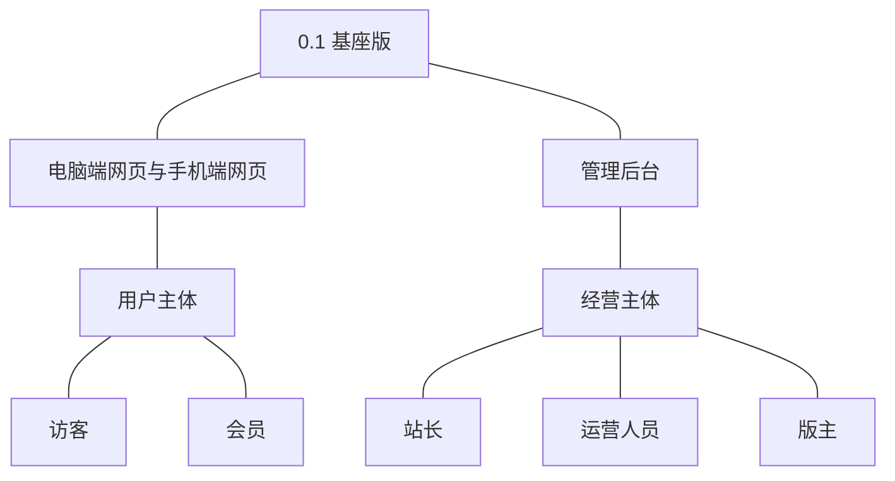

**主体表**：

| 主体 | 角色 | 端 | 怎么用系统 |
|---|---|---|---|
| 用户主体 | 访客 | 电脑端网页、手机端网页 | 在注册页填写账号名与密码注册成为会员 |
| 用户主体 | 会员 | 电脑端网页、手机端网页 | 登录与退出、维护资料与头像、修改与重置密码 |
| 经营主体 | 站长 | 管理后台 | 开通账号并分配角色、定义与调整角色；新增与删除板块；维护站点信息、配置审核策略 |
| 经营主体 | 运营人员 | 管理后台 | 编辑与排序板块、停用与启用板块、维护标签、查看设置、维护个人资料与凭据 |
| 经营主体 | 版主 | 管理后台 | 本版仅有账号就绪（由站长开通）与个人资料与凭据维护；审核与处置职能随 0.2 交付 |

**裁剪说明**：版主角色在本版仅完成账号就绪，其待审队列与处置页面随 0.2 点亮；访客在本版除注册外无内容浏览入口（板块与内容入口随 0.2）；会员的内容、成长与消息面分别随 0.2~0.5 交付；一人可持多个管理端角色的口径自本版起生效（D5）。

## 3. 核心业务流程

### 3.1 旅程一：站长开通账号并分配角色（权限基座就绪）

站长以初始账号进入管理后台，为团队成员开通管理端账号并分配角色，新账号按角色能力点看到对应管理入口；演练中可调整角色能力点或为账号增配角色，入口与接口校验同步生效。

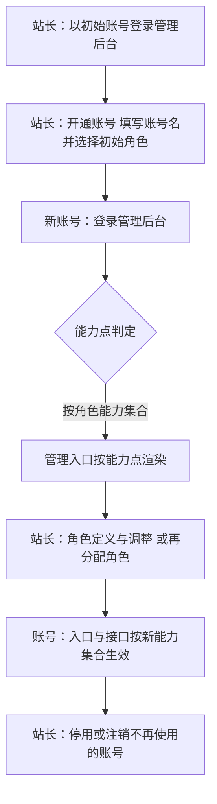

操作步骤清单：1. 站长登录管理后台；2. 开通管理端账号并分配初始角色；3. 新账号登录并核对可见入口；4. 按演练需要调整角色能力点或增配角色，再次核对入口与操作权；5. 对不再使用的账号执行停用或注销。

### 3.2 旅程二：建立板块与标签并完成站点设置（结构规则就绪）

站长建立板块构成站点结构，运营人员补充标签并调整板块编排，站长维护站点信息并配置审核策略，最终在设置查看中确认全部生效值，基座就绪。

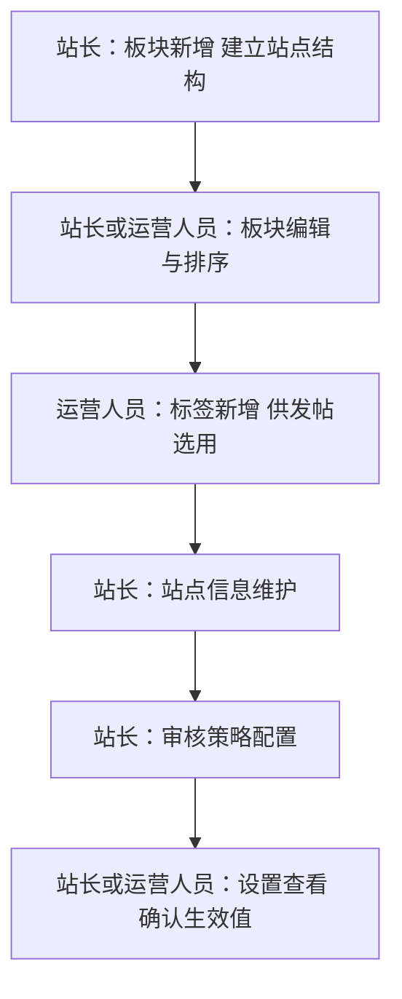

操作步骤清单：1. 站长新增板块并填写名称与说明；2. 编辑板块信息并调整排序；3. 运营人员新增标签；4. 站长维护站点名称与说明；5. 站长配置先审后发的适用范围；6. 在设置查看中核对站点信息与审核策略的当前生效值。

### 3.3 旅程三：注册成为会员并维护资料（身份基座就绪）

访客在电脑端网页或手机端网页注册成为会员，系统建立正常状态的会员账号并自动登录；会员随后维护资料与头像、修改密码，并以新凭据重新登录验证。

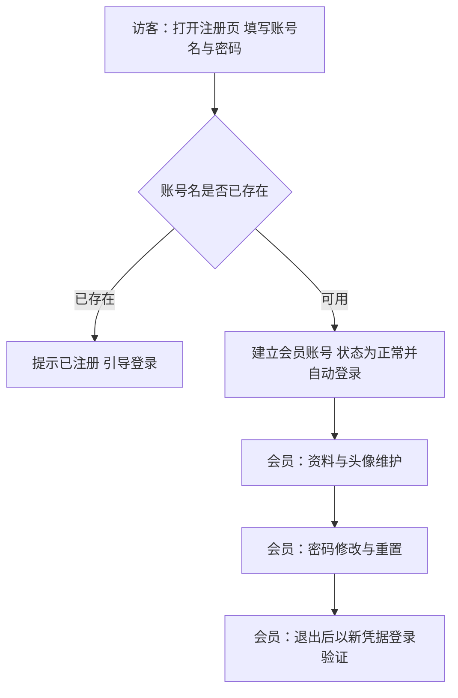

操作步骤清单：1. 访客在注册页提交账号名与密码；2. 注册成功自动登录；3. 维护昵称与头像；4. 修改密码；5. 退出后以新密码登录验证。

## 4. 功能需求

**功能全景总图**：

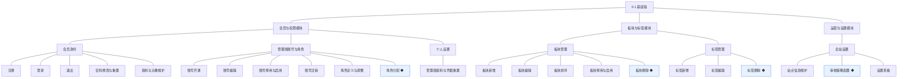

### 4.1 会员与权限模块

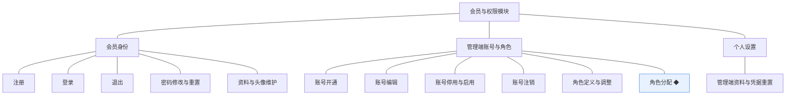

**会员身份**：访客取得会员身份并自行维护凭据与资料；一人一个会员账号，账号状态自建立即为正常。

| 功能 | 用途 | 验收标准 |
|---|---|---|
| 注册 | 访客以账号密码方式建立会员账号，取得站内身份 | 访客在电脑端网页或手机端网页填写账号名与密码提交注册，系统建立状态为正常的会员账号并自动登录，重复账号名被拒绝并提示 |
| 登录 | 会员凭账号密码进入登录态 | 会员输入正确凭据登录成功并进入个人资料页，凭据错误时收到明确提示且不泄露账号是否存在 |
| 退出 | 会员结束当前登录态 | 会员执行退出后登录态立即失效，再访问需登录的页面被引导至登录页 |
| 密码修改与重置 | 会员维护登录凭据 | 会员凭原密码设置新密码后，旧密码不能再登录、新密码可登录，该账号既有登录态全部失效 |
| 资料与头像维护 | 会员维护昵称与头像等对外信息 | 会员修改昵称并上传头像后保存成功，个人资料页与再次登录后显示为新值 |

**管理端账号与角色**：站长掌握内部人员的账号生命周期与能力授权，能力授予只经角色（D5）。

| 功能 | 用途 | 验收标准 |
|---|---|---|
| 账号开通 | 站长为内部人员建立管理端账号并分配初始角色 | 站长填写账号名并选择角色开通成功，新账号以该角色登录管理后台可见对应入口 |
| 账号编辑 | 站长修改管理端账号资料 | 站长修改账号资料保存后，账号列表与详情即时显示新值 |
| 账号停用与启用 | 站长控制管理端账号可用性 | 站长停用账号后该账号登录被拒绝，重新启用后可再登录 |
| 账号注销 | 站长对离职人员账号做终态处理 | 站长注销账号后该账号进入停用终态且不能再启用 |
| 角色定义与调整 | 站长定义角色及其能力点集合 | 站长新建角色并设定能力点保存成功，调整能力点后对应账号下次进入即按新集合渲染入口并校验接口，变更留痕 |
| 角色分配 ◆ | 站长把角色分配给管理端账号，一人可持多个 | 站长为账号分配第二个角色后，该账号拥有两角色能力点并集的入口与操作权，页面入口与接口校验同源生效，分配与调整留痕 |

**个人设置**：内部人员自助管理面（PRD 功能全景·个人设置），本版随权限基座一体交付。

| 功能 | 用途 | 验收标准 |
|---|---|---|
| 管理端资料与凭据重置 | 站长、运营人员、版主维护自身账号资料与重置凭据 | 任一管理端账号在个人设置修改自身资料或重置密码成功，重置后旧登录态失效且新凭据可登录 |

### 4.2 板块与标签模块

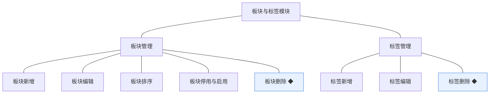

**板块管理**：站长与运营人员建立并编排站点结构；停用与删除的拦截规则为先行基座，内容提交自 0.2 起接入校验。

| 功能 | 用途 | 验收标准 |
|---|---|---|
| 板块新增 | 站长建立板块作为内容的一级去处 | 站长填写名称与说明保存后，板块列表出现该板块并处于启用状态 |
| 板块编辑 | 站长、运营人员修改板块信息 | 修改名称或说明保存后，板块列表与详情显示新值 |
| 板块排序 | 站长、运营人员调整板块展示次序 | 调整排序值保存后，板块列表按新次序展示 |
| 板块停用与启用 | 站长、运营人员控制板块是否接收新内容 | 停用后板块标记为停用状态、启用后恢复启用状态；对新增内容的拦截自 0.2 内容上线起生效（先行基座） |
| 板块删除 ◆ | 站长移除不再使用的板块 | 板块下无内容时删除成功并从列表移除；有内容时拒绝删除并提示先迁移或处置内容，删除留痕 |

**标签管理**：运营人员维护标签词表供发帖选用，选用与使用计数自 0.2 起发生。

| 功能 | 用途 | 验收标准 |
|---|---|---|
| 标签新增 | 运营人员建立标签供发帖选用 | 新增标签保存后出现在标签列表 |
| 标签编辑 | 运营人员修改标签名称 | 修改保存后标签列表显示新名称 |
| 标签删除 ◆ | 运营人员移除不再使用的标签 | 使用次数为零时删除成功并从列表移除；使用次数大于零时拒绝删除并提示，删除留痕 |

### 4.3 运营与设置模块

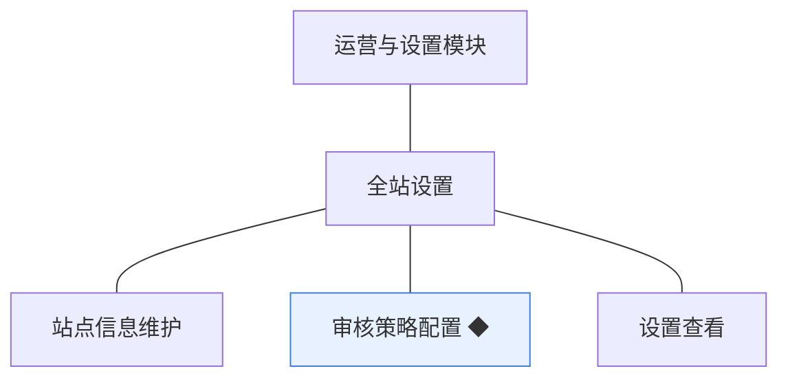

**全站设置**：站点级参数与规则的集中存放处；审核策略为先行基座，消费方自 0.2 内容审核起读取生效。

| 功能 | 用途 | 验收标准 |
|---|---|---|
| 站点信息维护 | 站长维护站点名称与说明等基础信息 | 修改站点信息保存后全站即时生效（如站点名展示为新值），变更留痕 |
| 审核策略配置 ◆ | 站长设定先审后发的适用范围，作为内容审核的规则来源 | 站长配置适用范围保存后设置页显示当前生效值，重复保存相同值不产生新变更记录，变更留痕；策略消费自 0.2 起生效（先行基座） |
| 设置查看 | 站长、运营人员查看当前生效配置 | 进入设置查看页可见站点信息与审核策略的当前生效值 |

## 5. 业务对象

**对象关系总览**：本版对象构成身份、结构、规则三层——管理端账号与角色承载内部授权，会员账号承载成员身份，板块与标签承载站点结构，全站设置承载规则；板块与标签对内容的容纳关系、会员账号的成长附属对象随后续版本接入。

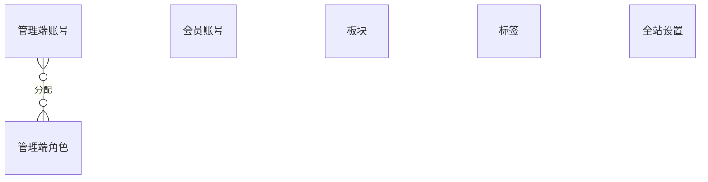

### 5.1 会员账号

定位：社区成员的身份，承载资料、凭据与账号状态（术语表）。

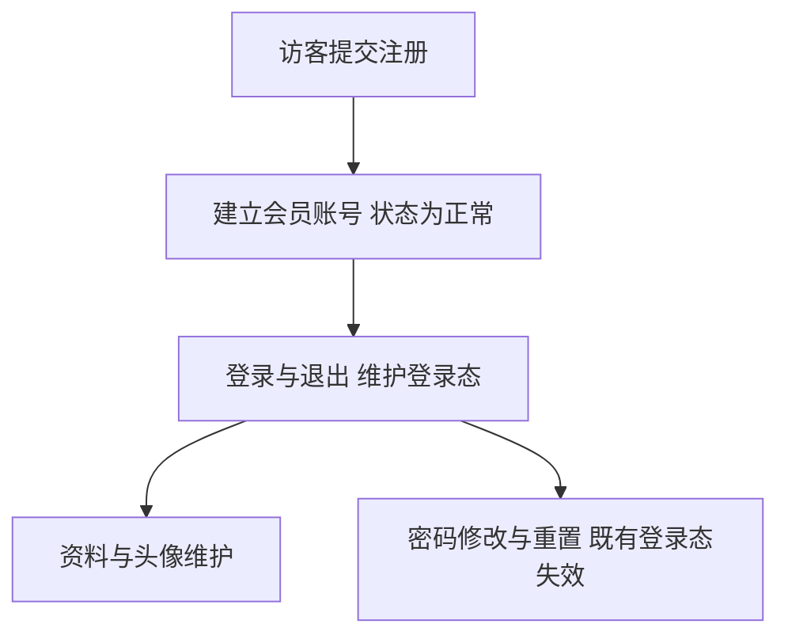

说明：本版账号仅有"正常"一种状态，禁言与封号随 0.2 违规处置交付；注册在本版只建立会员账号，积分账户开立机制随 0.3 成长模块交付、届时为存量会员补开账户（版本级安排，本轮拍板）；一人一个会员账号。

### 5.2 管理端账号

定位：经营方与版主的登录身份（术语表）。

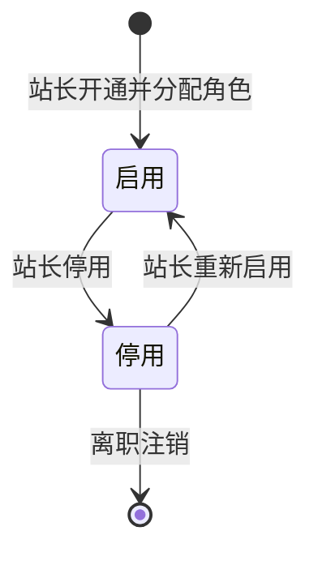

说明：启用与停用可逆，停用后不能登录；注销为停用的终态表达、不可再启用（术语表）；一个账号可持多个管理端角色（D5）。

### 5.3 管理端角色

定位：管理端能力的授权模板（术语表）。

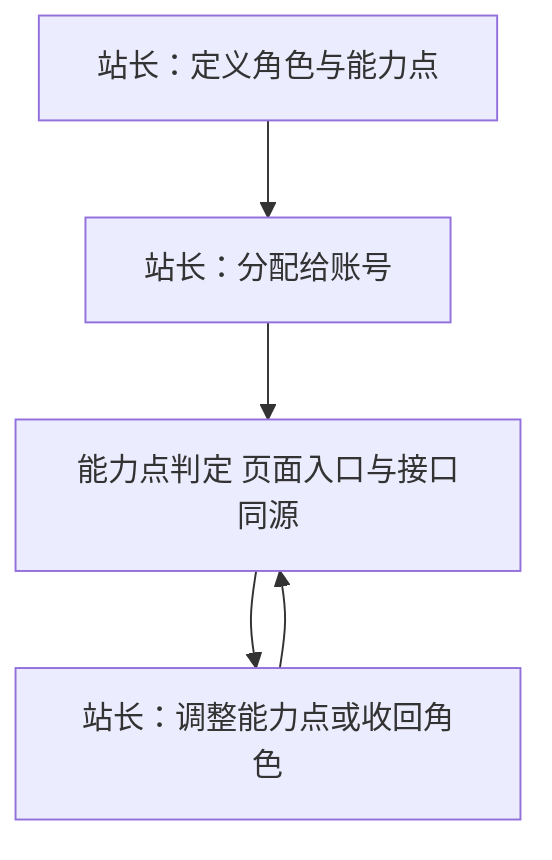

说明：配置型对象、无状态；能力授予只经角色，不针对单个账号定制（D5）；能力点判定是后续所有版本管理入口与接口校验的先行基座。

### 5.4 板块

定位：内容的一级去处，容纳话题与问题（术语表）。

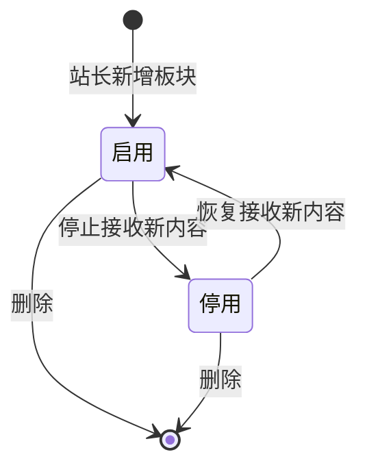

说明：启用与停用可逆；删除不可逆且前置条件为板块下无内容——本版尚无内容产生，删除与停用的拦截规则先行就绪，内容提交校验自 0.2 起接入（先行基座）。

### 5.5 标签

定位：话题的横向归类标记（术语表）。

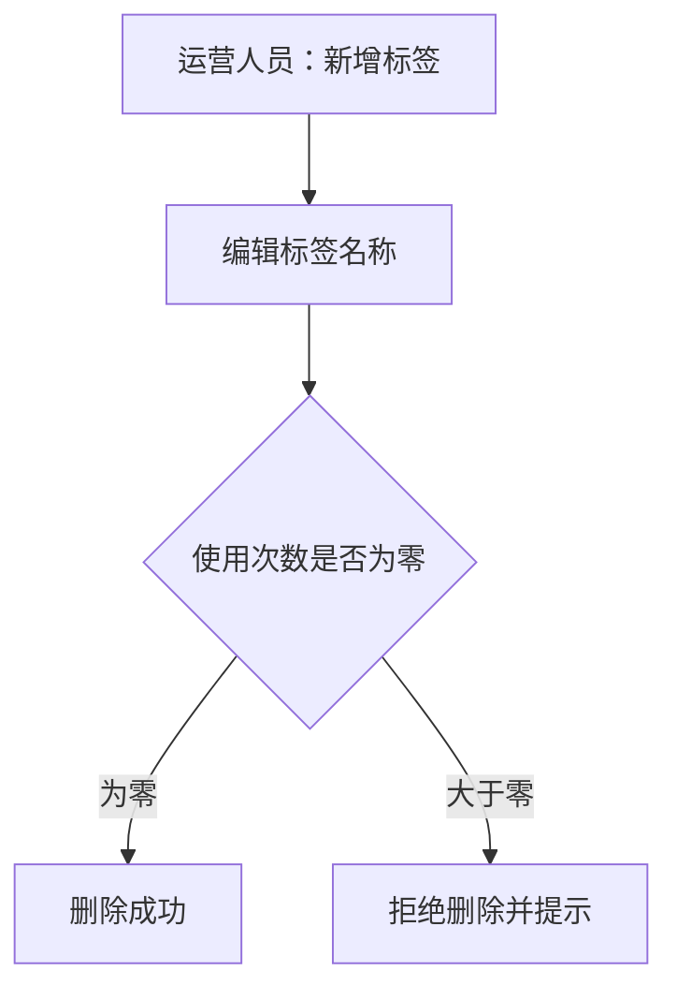

说明：配置型对象、无状态，使用次数由话题标注关系派生；本版无话题使用，使用与计数自 0.2 起发生，删除判定规则先行就绪（先行基座）。

### 5.6 全站设置

定位：站点级参数与开关的集中存放处（术语表）。

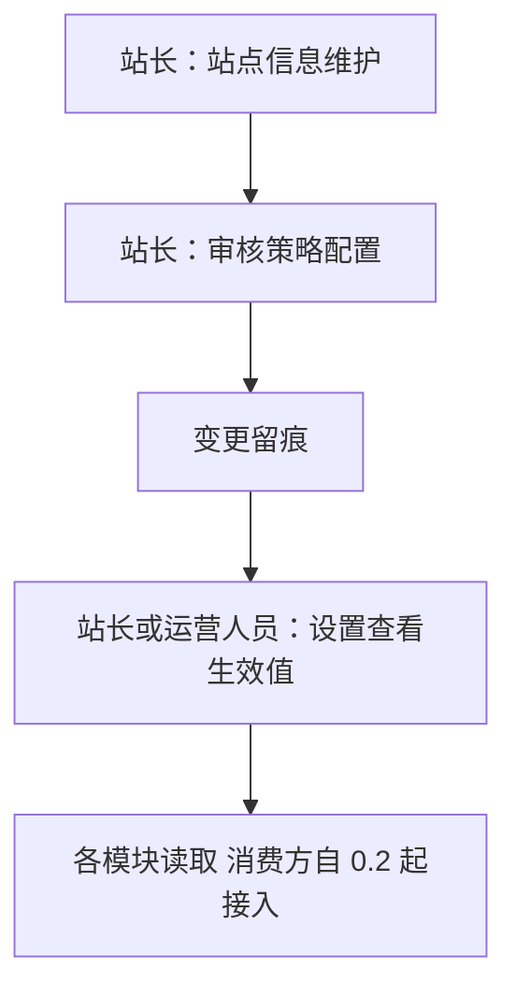

说明：键值与配置集合、无状态，同一配置项始终只有一个生效值；审核策略默认适用范围为话题、问题、答案与评论全部先审后发（D3 推导，默认全量，可按版调整）；本版交付站点信息与审核策略两类配置，等级与积分规则配置随 0.3 交付。
