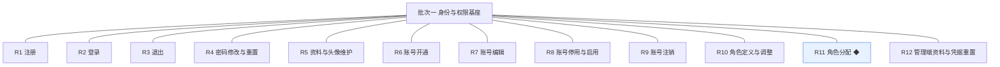
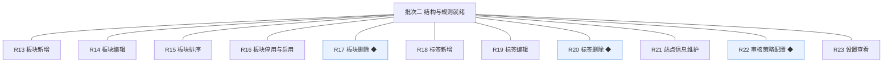

# 开发顺序与需求拆解（大版本）：0.1 基座版

> 定位：把大版本 PRD 转换为开发批次顺序＋功能级需求条目，本文即 0.1 基座版的完整需求清单（不另生成版本快照），需求池据此直接入池；上游为模拟案例材料，模拟性质予以保留。

## 1. 拆解说明

- **做什么**：把《PRD（大版本）0.1 基座版》的 23 项功能按依赖排成 2 个可独立验收的开发批次，每项功能转为一条可直接认领与验收的需求条目（R1～R23）。
- **一一同构口径**：一条需求＝一项 PRD 功能，需求名即 PRD 功能名（含 ◆ 标注），用途与验收标准逐字引自 PRD 功能清单、不压缩不改写；按钮、字段与跳转级的原子拆解归小版本开发，不进本文。
- **与需求池及小版本规划的关系**：本文是需求池的批量入池主入口但不是唯一入口——会议、沟通、临时反馈产生的需求可不经本文直接单条入池（M 编号）；小版本规划的输入＝本文开发顺序＋需求池实时状态两者合并，批次划分是建议而非锁定，实际认领以需求池为准。

## 2. 开发顺序

**前置版本沿用面**：0.1 为首个版本，无前置版本与沿用面。

**开发批次总图**：

```mermaid
flowchart TB
    V[0.1 基座版]
    V --- B1[批次一 身份与权限基座] & B2[批次二 结构与规则就绪]
    B1 --- N1[R1 注册] & N2[R2 登录] & N3[R3 退出] & N4[R4 密码修改与重置] & N5[R5 资料与头像维护] & N6[R6 账号开通] & N7[R7 账号编辑] & N8[R8 账号停用与启用] & N9[R9 账号注销] & N10[R10 角色定义与调整] & N11[R11 角色分配 ◆] & N12[R12 管理端资料与凭据重置]
    B2 --- N13[R13 板块新增] & N14[R14 板块编辑] & N15[R15 板块排序] & N16[R16 板块停用与启用] & N17[R17 板块删除 ◆] & N18[R18 标签新增] & N19[R19 标签编辑] & N20[R20 标签删除 ◆] & N21[R21 站点信息维护] & N22[R22 审核策略配置 ◆] & N23[R23 设置查看]
    classDef complex fill:#e7f1ff,stroke:#3b7ddd;
    class N11,N17,N20,N22 complex;
```

**批次推进链**：

**顺序依据与同事务契约**：身份与鉴权先于一切管理后台操作——批次二全部功能依赖批次一交付的登录态、能力点判定与留痕入口（04C-会员与权限模块对外契约）；本版内需要共同成立的契约：角色分配与能力点判定同源生效（页面与接口一套判定）、审核策略配置与变更留痕同事务、账号状态变更即时作用于登录（04C）；无外部联调点。

### 2.1 批次一：身份与权限基座

- **目标**：服务端身份与鉴权成形，两端登录可用，管理后台按角色授权运转。
- **依赖**：无前置（本大版本首批）。
- **可验收形态**：可演示完整权限基座——站长开通账号并分配角色、新账号按角色看到入口、无角色账号零入口，会员在电脑端网页与手机端网页完成注册登录并维护资料与密码。
- 判断注记：12 条同属身份与权限主题、可同批演示，不逐功能拆批（批次从简）；会员身份与管理端账号并行开发、同批联调收口。

条目与 PRD 4.1 功能清单一一同构，用途与验收标准逐字引自原文：

| 编号 | 需求名 | 用途 | 验收标准 |
|---|---|---|---|
| R1 | 注册 | 访客以账号密码方式建立会员账号，取得站内身份 | 访客在电脑端网页或手机端网页填写账号名与密码提交注册，系统建立状态为正常的会员账号并自动登录，重复账号名被拒绝并提示 |
| R2 | 登录 | 会员凭账号密码进入登录态 | 会员输入正确凭据登录成功并进入个人资料页，凭据错误时收到明确提示且不泄露账号是否存在 |
| R3 | 退出 | 会员结束当前登录态 | 会员执行退出后登录态立即失效，再访问需登录的页面被引导至登录页 |
| R4 | 密码修改与重置 | 会员维护登录凭据 | 会员凭原密码设置新密码后，旧密码不能再登录、新密码可登录，该账号既有登录态全部失效 |
| R5 | 资料与头像维护 | 会员维护昵称与头像等对外信息 | 会员修改昵称并上传头像后保存成功，个人资料页与再次登录后显示为新值 |
| R6 | 账号开通 | 站长为内部人员建立管理端账号并分配初始角色 | 站长填写账号名并选择角色开通成功，新账号以该角色登录管理后台可见对应入口 |
| R7 | 账号编辑 | 站长修改管理端账号资料 | 站长修改账号资料保存后，账号列表与详情即时显示新值 |
| R8 | 账号停用与启用 | 站长控制管理端账号可用性 | 站长停用账号后该账号登录被拒绝，重新启用后可再登录 |
| R9 | 账号注销 | 站长对离职人员账号做终态处理 | 站长注销账号后该账号进入停用终态且不能再启用 |
| R10 | 角色定义与调整 | 站长定义角色及其能力点集合 | 站长新建角色并设定能力点保存成功，调整能力点后对应账号下次进入即按新集合渲染入口并校验接口，变更留痕 |
| R11 | 角色分配 ◆ | 站长把角色分配给管理端账号，一人可持多个 | 站长为账号分配第二个角色后，该账号拥有两角色能力点并集的入口与操作权，页面入口与接口校验同源生效，分配与调整留痕 |
| R12 | 管理端资料与凭据重置 | 站长、运营人员、版主维护自身账号资料与重置凭据 | 任一管理端账号在个人设置修改自身资料或重置密码成功，重置后旧登录态失效且新凭据可登录 |

### 2.2 批次二：结构与规则就绪

- **目标**：站点结构与规则配置就绪——板块与标签建立并编排，站点信息与审核策略配置生效。
- **依赖**：批次一（管理后台登录、能力点判定、留痕入口；R13～R20 需站长／运营人员角色入口，R21～R23 需全站设置入口）。
- **可验收形态**：可演示开站准备——建立板块与标签并调整次序、完成站点信息与审核策略配置并在设置查看确认生效值。
- 判断注记：批次二 11 条同属结构规则主题可同批演示；板块与标签、全站设置两个功能组内部无依赖冲突，合并一批不再细分（能合并成一批演示的不拆成两批）。

条目与 PRD 4.2、4.3 功能清单一一同构，用途与验收标准逐字引自原文：

| 编号 | 需求名 | 用途 | 验收标准 |
|---|---|---|---|
| R13 | 板块新增 | 站长建立板块作为内容的一级去处 | 站长填写名称与说明保存后，板块列表出现该板块并处于启用状态 |
| R14 | 板块编辑 | 站长、运营人员修改板块信息 | 修改名称或说明保存后，板块列表与详情显示新值 |
| R15 | 板块排序 | 站长、运营人员调整板块展示次序 | 调整排序值保存后，板块列表按新次序展示 |
| R16 | 板块停用与启用 | 站长、运营人员控制板块是否接收新内容 | 停用后板块标记为停用状态、启用后恢复启用状态；对新增内容的拦截自 0.2 内容上线起生效（先行基座） |
| R17 | 板块删除 ◆ | 站长移除不再使用的板块 | 板块下无内容时删除成功并从列表移除；有内容时拒绝删除并提示先迁移或处置内容，删除留痕 |
| R18 | 标签新增 | 运营人员建立标签供发帖选用 | 新增标签保存后出现在标签列表 |
| R19 | 标签编辑 | 运营人员修改标签名称 | 修改保存后标签列表显示新名称 |
| R20 | 标签删除 ◆ | 运营人员移除不再使用的标签 | 使用次数为零时删除成功并从列表移除；使用次数大于零时拒绝删除并提示，删除留痕 |
| R21 | 站点信息维护 | 站长维护站点名称与说明等基础信息 | 修改站点信息保存后全站即时生效（如站点名展示为新值），变更留痕 |
| R22 | 审核策略配置 ◆ | 站长设定先审后发的适用范围，作为内容审核的规则来源 | 站长配置适用范围保存后设置页显示当前生效值，重复保存相同值不产生新变更记录，变更留痕；策略消费自 0.2 起生效（先行基座） |
| R23 | 设置查看 | 站长、运营人员查看当前生效配置 | 进入设置查看页可见站点信息与审核策略的当前生效值 |

**批次判断与边界取舍**：只拆两批——批次二对批次一的登录与能力点判定是硬依赖，必须后置；批次一内部 12 条与批次二内部 11 条各自可独立演示，逐功能拆批属过度拆分；无路径分批交付的条目，23 条均整条交付。

**版本级验收安排**：按 PRD 量化口径执行基座演练（五项动作 100%、无角色账号入口数 0、角色分工演练稳定）；本版为内部基座、无对外发布，路线图为 0.2 设置的灰度台阶不占本版开发批次。

## 3. 条目与 PRD 对应核对

- **一一同构声明**：条目数 23＝PRD 功能数 23，逐行对应、无归并无拆分；需求名（含 ◆）与 PRD 功能名逐字一致；用途与验收标准逐字引自 PRD 功能清单。
- **批次构成**：批次一 12 条（会员身份 5＋管理端账号与角色 6＋个人设置 1），批次二 11 条（板块管理 5＋标签管理 3＋全站设置 3）。
- **◆ 复杂条目清点**：共 4 条——R11 角色分配、R17 板块删除、R20 标签删除、R22 审核策略配置，与 PRD 总图高亮一致。
- **过渡支撑清点**：0 条；本版无过渡支撑能力，先行基座（能力点判定、留痕入口、审核策略配置、板块与标签拦截规则）为永久性基座能力，按 PRD 表述为"先行基座，供后续版本接入"。

## 4. 与需求池和小版本规划的衔接

- **入池路径**：本文 R1～R23 已按批量入池登记进《需求池》，编号沿用、批次随本文继承。
- **多入口口径**：会议、沟通与临时反馈需求不经本文直接单条入池（M 编号起），两类条目并存互不覆盖。
- **小版本规划输入**：本文开发顺序＋需求池实时状态合并；简单场景直接采纳批次建议，唯一硬约束是本文声明的依赖与同事务契约不回退（批次二不得先于批次一认领开工）。
- **认领与细化原则**：认领时逐字携带本表用途与验收标准，开发级细化（交互、字段、边界）归小版本 PRD，本文不预写。
