# PRD（小版本）：v0.1.0 身份与权限基座

> 定位：开发级需求说明书——承接大版本 PRD 0.1 与其 02 批次一，认领自需求池（R1～R12，状态已迁移为已认领（v0.1.0））；用途与验收标准逐字锚定上游、只细化不改写；上游为模拟案例材料，模拟性质予以保留。

## 1. 版本概述

**承接与目标**：认领来源＝0.1 基座版批次一「身份与权限基座」（简单场景采纳整批，R1～R12）＋需求池实时状态合并（池内该 12 条均为待规划，无池直入条目混入）。本版可验收形态＝02 批次一可验收形态——可演示完整权限基座：站长开通账号并分配角色、新账号按角色看到入口、无角色账号零入口，会员在电脑端网页与手机端网页完成注册登录并维护资料与密码。量化口径沿用大版本 PRD：五项演练动作 100%、无角色账号可见管理入口数 0、角色分工演练稳定。

**范围外声明**：R13～R23（板块与标签、站点信息与审核策略）随批次二（下一小版本）认领，本版不实现、界面不出现；内容生产与审核、积分与等级、互动与消息随 0.2 及以后版本；会员注销随 0.5；运营侧会员查询与维护随 0.6。

**条目内顺序与依赖**（引用上游批内说明）：R1～R5（会员身份）与 R6～R12（管理端账号与角色、个人设置）两组并行开发；R7～R12 依赖 R6 的账号存在与 R10 的角色存在；能力点判定机制随 R10／R11 落地（先行基座，供后续版本接入）。

## 2. 需求范围与验收锚

**条目总览树**（与上游批次一分支图同名同构）：

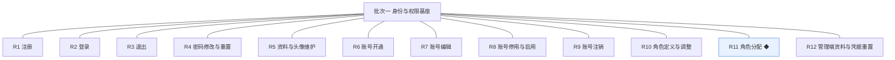

**认领条目表**（需求名、用途、验收标准逐字引自 02 批次一需求表）：

| 编号 | 需求名 | 用途 | 验收标准 |
|---|---|---|---|
| R1 | 注册 | 访客以账号密码方式建立会员账号，取得站内身份 | 访客在电脑端网页或手机端网页填写账号名与密码提交注册，系统建立状态为正常的会员账号并自动登录，重复账号名被拒绝并提示 |
| R2 | 登录 | 会员凭账号密码进入登录态 | 会员输入正确凭据登录成功并进入个人资料页，凭据错误时收到明确提示且不泄露账号是否存在 |
| R3 | 退出 | 会员结束当前登录态 | 会员执行退出后登录态立即失效，再访问需登录的页面被引导至登录页 |
| R4 | 密码修改与重置 | 会员维护登录凭据 | 会员凭原密码设置新密码后，旧密码不能再登录、新密码可登录，该账号既有登录态全部失效 |
| R5 | 资料与头像维护 | 会员维护昵称与头像等对外信息 | 会员修改昵称并上传头像后保存成功，个人资料页与再次登录后显示为新值 |
| R6 | 账号开通 | 站长为内部人员建立管理端账号并分配初始角色 | 站长填写账号名并选择角色开通成功，新账号以该角色登录管理后台可见对应入口 |
| R7 | 账号编辑 | 站长修改管理端账号资料 | 站长修改账号资料保存后，账号列表与详情即时显示新值 |
| R8 | 账号停用与启用 | 站长控制管理端账号可用性 | 站长停用账号后该账号登录被拒绝，重新启用后可再登录 |
| R9 | 账号注销 | 站长对离职人员账号做终态处理 | 站长注销账号后该账号进入停用终态且不能再启用 |
| R10 | 角色定义与调整 | 站长定义角色及其能力点集合 | 站长新建角色并设定能力点保存成功，调整能力点后对应账号下次进入即按新集合渲染入口并校验接口，变更留痕 |
| R11 | 角色分配 ◆ | 站长把角色分配给管理端账号，一人可持多个 | 站长为账号分配第二个角色后，该账号拥有两角色能力点并集的入口与操作权，页面入口与接口校验同源生效，分配与调整留痕 |
| R12 | 管理端资料与凭据重置 | 站长、运营人员、版主维护自身账号资料与重置凭据 | 任一管理端账号在个人设置修改自身资料或重置密码成功，重置后旧登录态失效且新凭据可登录 |

**锚定说明**：本表为全文档唯一锚源，第 4 章各条目细化不得与本表冲突、不得收窄或放宽验收；验收按本表逐条打钩。

## 3. 核心用户旅程

**旅程承接说明**：上游大版本 PRD 三条旅程中，旅程一（站长开通账号并分配角色）与旅程三（注册成为会员并维护资料）全程落在认领范围内，本章细化到开发级取值与反馈；旅程二（建立板块与标签并完成站点设置，对应 R13～R23）不在本版旅程内，随下一小版本交付。

### 3.1 旅程一：站长开通账号并分配角色（细化至取值与反馈）

站长以部署初始化的初始账号（账号名 admin，部署时设定初始密码，首次登录强制修改——本版采用，行业惯例默认）进入管理后台，为团队成员开通账号（系统生成一次性初始密码，新账号首次登录强制改密），新账号按角色能力点看到对应入口；随后按演练需要调整角色能力点或增配角色，入口与接口校验同步生效。

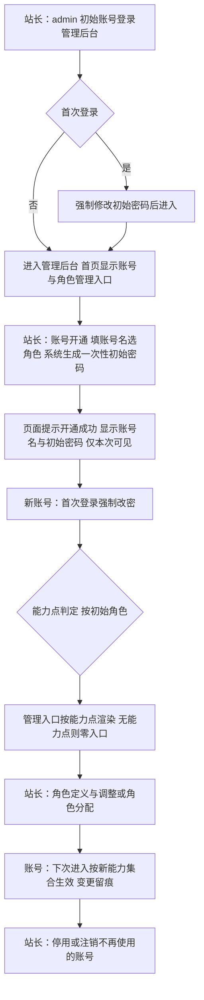

操作步骤清单：1. 站长以 admin 登录，首次登录按提示修改初始密码；2. 进入账号与角色管理，开通账号并选择初始角色，记录一次性初始密码；3. 新账号首次登录强制改密后，核对可见管理入口；4. 站长调整角色能力点或为账号增配角色，新账号重新进入核对入口与操作权变化；5. 对演练用毕的账号执行停用或注销，验证登录被拒。

### 3.2 旅程三：注册成为会员并维护资料（细化至取值与反馈）

访客在电脑端网页或手机端网页填写账号名与密码注册，成功后自动登录进入个人资料页（默认昵称为账号名）；随后修改昵称、上传头像、修改密码，退出后以新凭据重新登录验证。

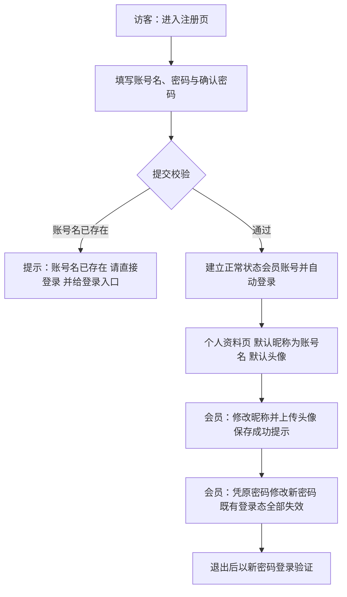

操作步骤清单：1. 访客进入注册页填写三项并提交；2. 成功后自动登录进入个人资料页；3. 修改昵称并上传头像；4. 凭原密码设置新密码后被退出登录；5. 以新密码重新登录核对资料为新值。

## 4. 功能需求

### 4.0 功能总览

**对象归组树**（版本→对象→条目）：

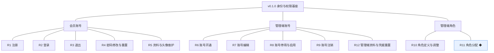

**对象增删改查矩阵**：

| 对象 | 增 | 改 | 删 | 查 |
|---|---|---|---|---|
| 会员账号 | R1（注册） | R4（密码）、R5（资料与头像） | 随后续小版本（注销随 0.5 会员中心版） | R5（自身资料回显）；运营侧查询随 0.6 |
| 管理端账号 | R6（开通） | R7（编辑）、R12（自身资料与凭据） | R9（注销，停用终态） | R7／R8（账号列表为操作入口） |
| 管理端角色 | R10（新建） | R10（能力点调整）、R11（分配关系） | 不做（路线图 0.1 清单未含角色删除，待后续版本评审；被分配中的角色不可删除） | R10（角色列表）、R11（账号已分配角色回显） |

**主体使用面**：

| 主体／角色 | 端 | 使用条目 | 机制条目 |
|---|---|---|---|
| 访客 | 电脑端网页、手机端网页 | R1 | — |
| 会员 | 电脑端网页、手机端网页 | R2、R3、R4、R5 | — |
| 站长 | 管理后台 | R6～R11、R12 | 能力点判定（随 R10／R11 落地，无独立人工触发面，效果为入口渲染与接口校验） |
| 运营人员 | 管理后台 | R12 | 同上（本版其结构运营条目随下一小版本） |
| 版主 | 管理后台 | R12 | 同上（本版仅有账号就绪，由站长开通） |

### 4.1 R1 注册

**功能说明**：访客建立会员账号取得站内身份的唯一步骤。触发：访客在电脑端网页或手机端网页点击「注册」进入注册页并提交表单。

**交互与流程**：

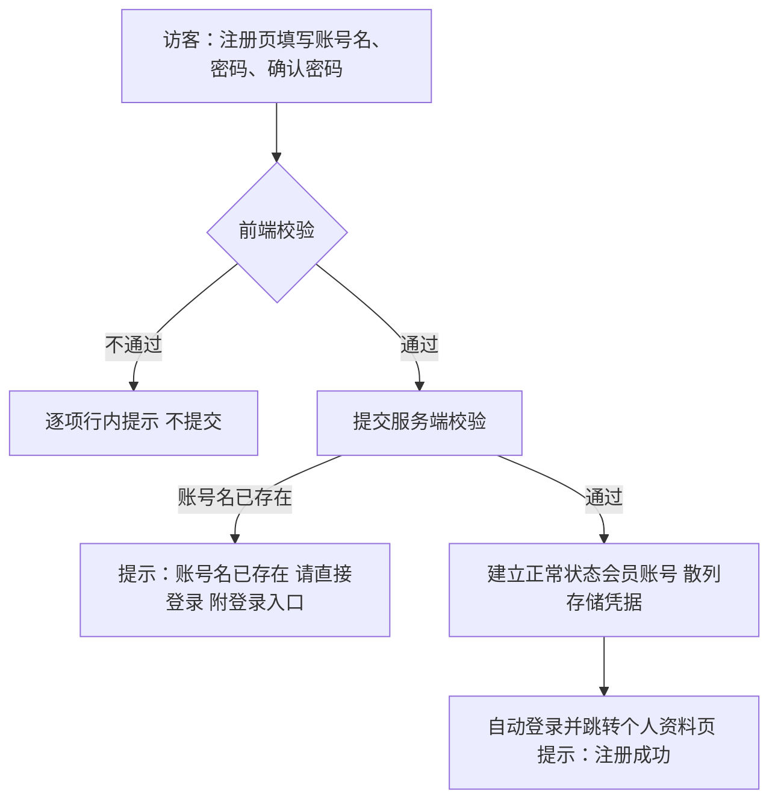

操作步骤清单：1. 进入注册页；2. 填写账号名、密码、确认密码；3. 提交并按提示修正错误；4. 成功后自动登录进入个人资料页。

**字段与校验**：

| 字段 | 必填 | 业务类型 | 落库字段名 | 约束与取值 |
|---|---|---|---|---|
| 账号名 | 是 | 文本 | account_name | 4～32 位，字母开头，仅字母、数字、下划线；全局唯一（不区分大小写判定） |
| 密码 | 是 | 凭据 | password_hash | 明文 ≥8 位且同时含字母与数字；仅存散列值 |
| 确认密码 | 是 | 凭据 | —（不落库） | 必须与密码一致 |
| 昵称 | 否 | 文本 | nickname | 不填时默认＝账号名 |
| 头像 | 否 | 图片地址 | avatar | 不填时使用系统默认头像 |

**规则与边界**：(1) 注册成功即建立状态为正常的会员账号并自动登录（验收锚）；(2) 一人一个会员账号，账号名唯一由唯一约束保证，不区分大小写（本版采用，行业惯例默认）；(3) 本版注册只建立会员账号，不建立积分账户（成长模块随 0.3，先行身份基座）；(4) 密码只落散列，明文不出现在任何存储与日志（开发规范·脱敏）。

**异常与拦截**：账号名已存在→「账号名已存在，请直接登录」并附登录入口；格式不符→「账号名需以字母开头，4～32 位字母、数字或下划线」；密码强度不足→「密码至少 8 位，且需同时包含字母与数字」；两次不一致→「两次输入的密码不一致」；同一访客短时间多次提交失败→图形验证码拦截（本版采用，行业惯例默认）。

### 4.2 R2 登录

**功能说明**：会员凭账号密码进入登录态。触发：访客或会员在电脑端网页或手机端网页点击「登录」提交凭据。

**交互与流程**：

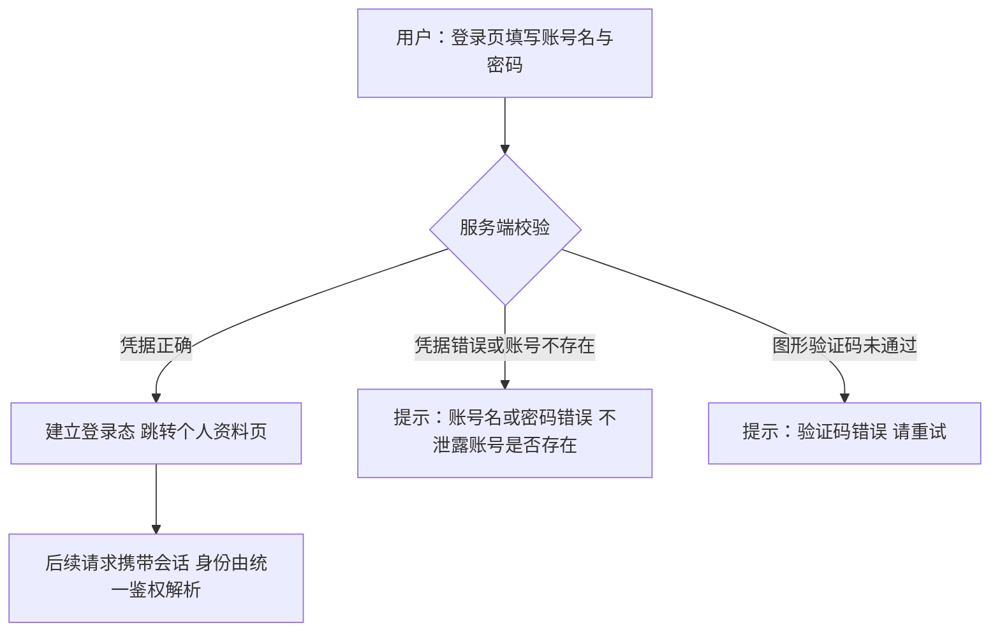

操作步骤清单：1. 进入登录页；2. 填写账号名与密码（含验证码时一并填写）；3. 成功跳转个人资料页，失败按提示重试。

**字段与校验**：

| 字段 | 必填 | 业务类型 | 落库字段名 | 约束与取值 |
|---|---|---|---|---|
| 账号名 | 是 | 文本 | account_name | 按注册规则校验格式 |
| 密码 | 是 | 凭据 | password_hash | 与账号名联合校验，仅比对散列 |

**规则与边界**：(1) 凭据错误提示不区分「账号不存在」与「密码错误」（验收锚）；(2) 登录能力同时服务前台与管理后台两个入口（统一鉴权，先行基座）——管理后台登录后按角色能力点渲染入口（R10／R11），本条验收锚为前台会员路径；(3) 连续失败 5 次锁定 10 分钟（本版采用，行业惯例默认）；(4) 管理端账号在停用状态下登录一律拒绝（对接 R8）。

**异常与拦截**：凭据错误→「账号名或密码错误」；验证码错误→「验证码错误，请重试」；连续失败达到阈值→「失败次数过多，请 10 分钟后再试」；账号被停用或注销（管理端账号）→「账号不可用，请联系站长」。

### 4.3 R3 退出

**功能说明**：会员结束当前登录态。触发：会员在页面右上角头像菜单点击「退出」。

**交互与流程**：

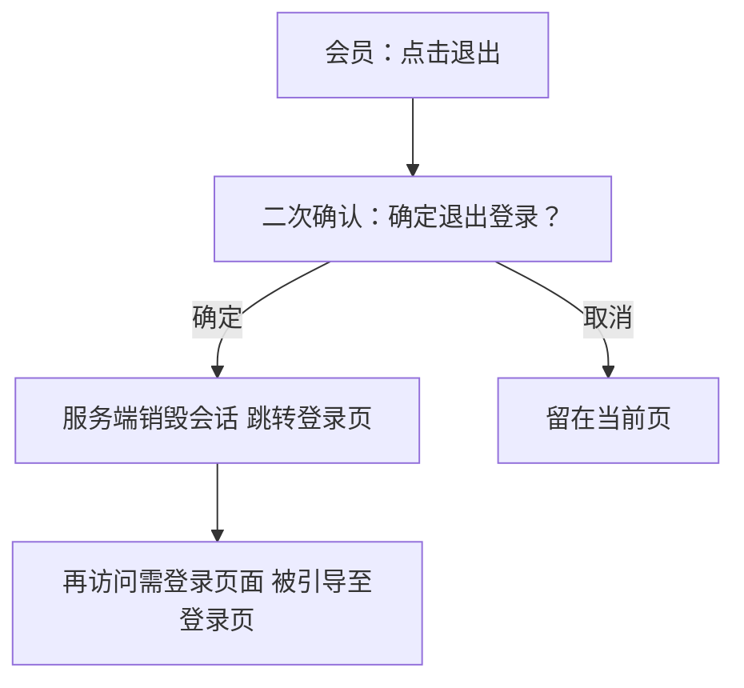

操作步骤清单：1. 点击退出并确认；2. 跳转登录页；3. 回访需登录页面验证被引导至登录页。

**字段与校验**：无——退出操作不涉及信息项，仅携带当前会话标识。

**规则与边界**：(1) 退出后登录态立即失效（验收锚）；(2) 退出适用于前台与管理后台两处入口；(3) 会话过期（30 天未活动，本版采用，行业惯例默认）等效退出。

**异常与拦截**：会话已过期时点击退出→直接跳转登录页（幂等，不报错）。

### 4.4 R4 密码修改与重置

**功能说明**：会员维护登录凭据的自助通道。触发：会员在个人资料页进入「密码修改与重置」提交表单。

**交互与流程**：

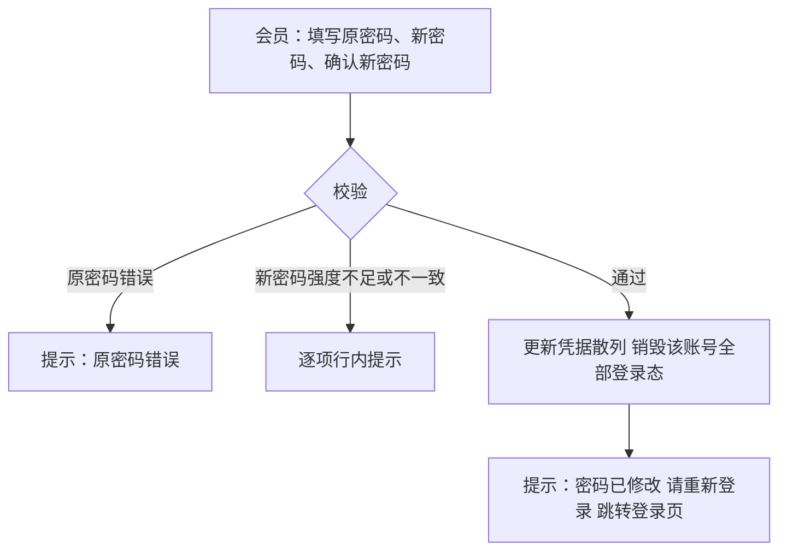

操作步骤清单：1. 进入密码修改表单；2. 填写三项；3. 成功后被登出；4. 以新密码登录、以旧密码验证被拒。

**字段与校验**：

| 字段 | 必填 | 业务类型 | 落库字段名 | 约束与取值 |
|---|---|---|---|---|
| 原密码 | 是 | 凭据 | password_hash（比对） | 必须与当前凭据散列匹配 |
| 新密码 | 是 | 凭据 | password_hash（更新） | 与注册同强度规则 |
| 确认新密码 | 是 | 凭据 | —（不落库） | 与新密码一致 |

**规则与边界**：(1) 修改成功后旧密码不能再登录、新密码可登录，既有登录态全部失效（验收锚）；(2) 新密码不得与原密码相同（本版采用，行业惯例默认）；(3) 重置走同一表单（本版无短信与邮件通道，PRD 备忘沿用）。

**异常与拦截**：原密码错误→「原密码错误」；新密码与原密码相同→「新密码不能与原密码相同」；强度不足／不一致→同 R1 文案。

### 4.5 R5 资料与头像维护

**功能说明**：会员维护对外形象信息。触发：会员在个人资料页修改昵称或头像后点击保存。

**交互与流程**：

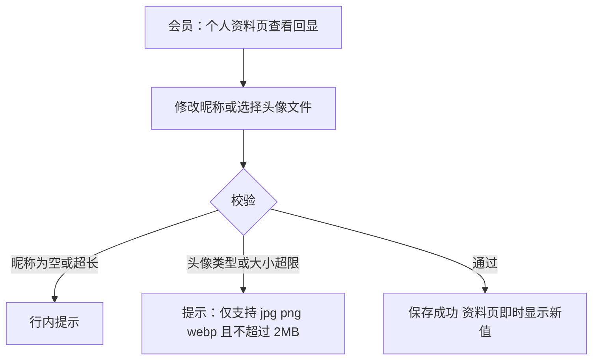

操作步骤清单：1. 打开个人资料页；2. 修改昵称或上传头像；3. 保存并核对即时回显；4. 退出重登后核对仍为新值。

**字段与校验**：

| 字段 | 必填 | 业务类型 | 落库字段名 | 约束与取值 |
|---|---|---|---|---|
| 昵称 | 是 | 文本 | nickname | 2～24 个字符，可含中文 |
| 头像 | 否 | 图片地址 | avatar | jpg／png／webp，≤2MB（本版采用，行业惯例默认）；上传后按系统规格生成展示图 |

**规则与边界**：(1) 保存成功后个人资料页与再次登录后显示为新值（验收锚）；(2) 昵称不作唯一性要求；(3) 头像上传经类型与大小白名单校验（开发规范·文件上传）。

**异常与拦截**：昵称越界→「昵称需 2～24 个字符」；头像超限→「仅支持 jpg、png、webp，且不超过 2MB」；上传中断→保留原头像并提示重试。

### 4.6 R6 账号开通

**功能说明**：站长为内部人员建立管理端账号的入口。触发：站长在管理后台「账号与角色管理」点击「开通账号」提交表单。

**交互与流程**：

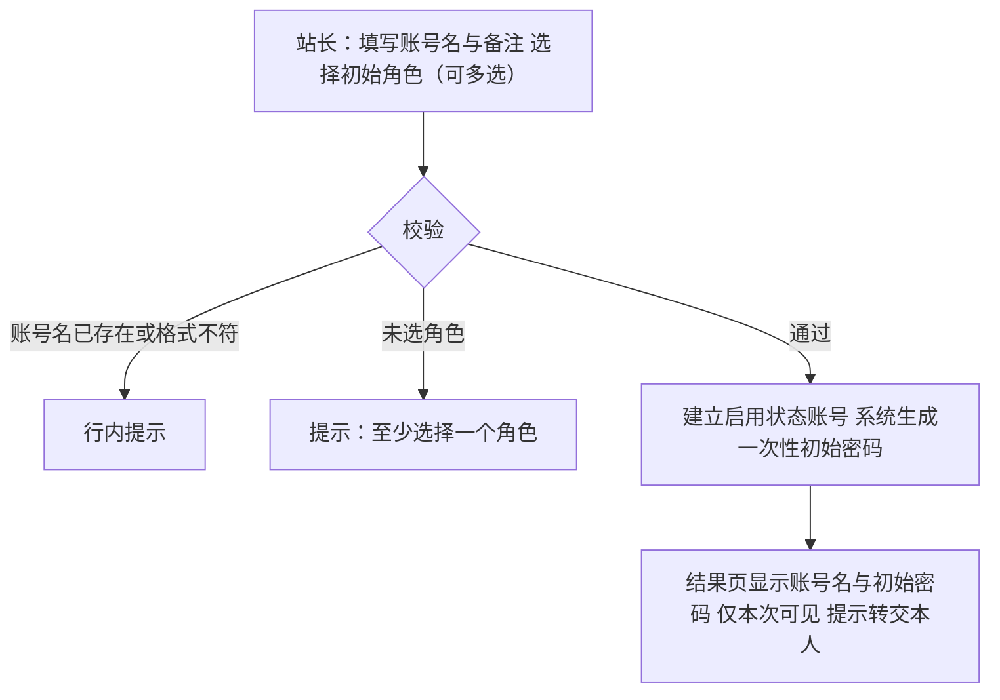

操作步骤清单：1. 进入账号与角色管理；2. 填写账号名、备注并选择初始角色；3. 提交后记录一次性初始密码并转交本人；4. 通知新账号首次登录改密。

**字段与校验**：

| 字段 | 必填 | 业务类型 | 落库字段名 | 约束与取值 |
|---|---|---|---|---|
| 账号名 | 是 | 文本 | account_name | 同注册规则；与管理端账号全局唯一 |
| 初始密码 | 是（系统生成） | 凭据 | password_hash | 12 位随机、一次性（本版采用，行业惯例默认） |
| 初始角色 | 是 | 关联 | admin_account_role（admin_id、role_id） | 至少一个，可多选 |
| 备注 | 否 | 文本 | remark | ≤50 字，用于记录人员说明 |

**规则与边界**：(1) 开通成功后新账号以该角色登录管理后台可见对应入口（验收锚）；(2) 新账号首次登录强制修改初始密码（本版采用，行业惯例默认）；(3) 初始密码仅开通结果页展示一次，系统不留存明文；(4) 开通动作写入操作留痕。

**异常与拦截**：账号名重复→「账号名已存在」；未选角色→「至少选择一个角色」；初始密码未在首次登录改密前泄露风险由转交流程提示承担（页面提示「请通过安全渠道转交」）。

### 4.7 R7 账号编辑

**功能说明**：站长修正管理端账号的资料信息。触发：站长在账号列表点击某账号「编辑」修改备注后保存。

**交互与流程**：

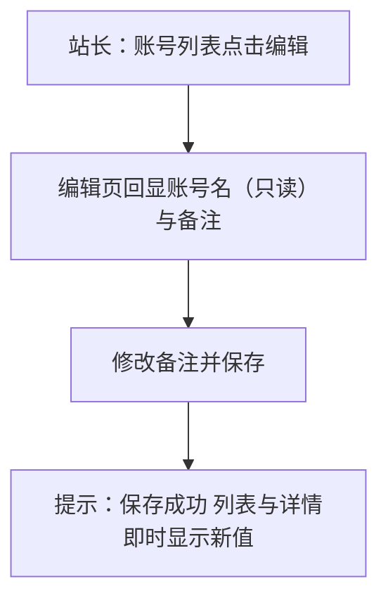

操作步骤清单：1. 在账号列表定位账号并进入编辑；2. 修改备注；3. 保存并核对列表与详情回显。

**字段与校验**：

| 字段 | 必填 | 业务类型 | 落库字段名 | 约束与取值 |
|---|---|---|---|---|
| 账号名 | —（只读） | 文本 | account_name | 创建后不可修改（本版采用） |
| 备注 | 否 | 文本 | remark | ≤50 字 |

**规则与边界**：(1) 保存后账号列表与详情即时显示新值（验收锚）；(2) 账号名与角色不在本条修改——角色调整走 R11；(3) 编辑动作写入操作留痕。

**异常与拦截**：备注超长→「备注不超过 50 字」；并发编辑以后保存者生效并提示「该账号资料已被更新，请刷新后重试」。

### 4.8 R8 账号停用与启用

**功能说明**：站长控制管理端账号可用性。触发：站长在账号列表对某账号点击「停用」或「启用」并确认。

**交互与流程**：

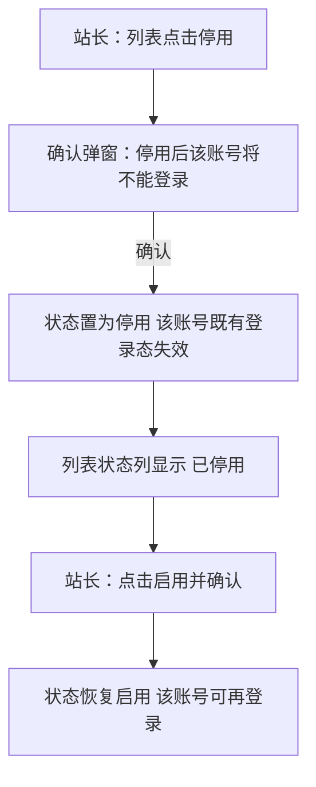

操作步骤清单：1. 在列表对目标账号执行停用并确认；2. 以该账号登录验证被拒；3. 执行启用并确认；4. 再次登录验证恢复。

**字段与校验**：

| 字段 | 必填 | 业务类型 | 落库字段名 | 约束与取值 |
|---|---|---|---|---|
| 状态 | —（操作对象） | 状态 | status | 取值：启用／停用（术语表） |

**规则与边界**：(1) 停用后该账号登录被拒绝、既有登录态失效，启用后可再登录（验收锚）；(2) 停用不删除账号与其角色分配关系，启用后按原角色生效；(3) 停用与启用动作写入操作留痕。

**异常与拦截**：对已停用账号重复停用→幂等返回「该账号已是停用状态」；停用自己当前登录的账号→拦截并提示「不能停用当前登录的账号」（本版采用）。

### 4.9 R9 账号注销

**功能说明**：站长对离职人员账号做终态处理。触发：站长在账号列表对停用中的账号点击「注销」并通过二次确认。

**交互与流程**：

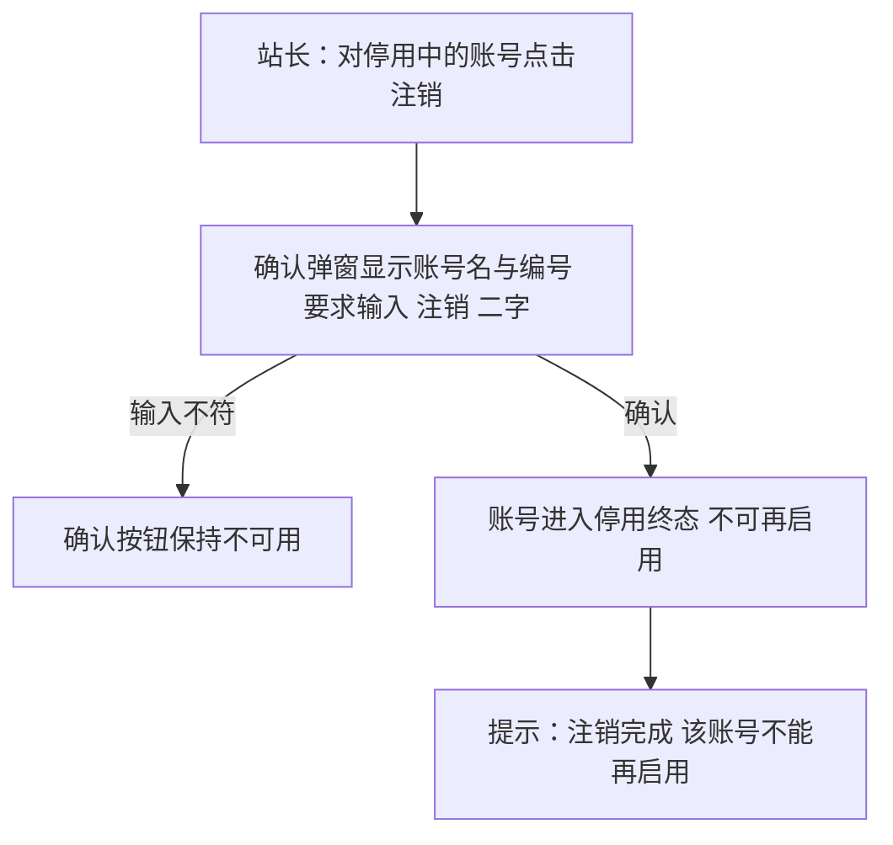

操作步骤清单：1. 先将目标账号停用；2. 点击注销并按弹窗输入「注销」确认；3. 核对该账号在列表标记为已注销且启用入口消失。

**字段与校验**：

| 字段 | 必填 | 业务类型 | 落库字段名 | 约束与取值 |
|---|---|---|---|---|
| 终态标记 | —（操作对象） | 状态 | status | 停用（离职注销）终态表达（术语表） |

**规则与边界**：(1) 注销后该账号进入停用终态且不能再启用（验收锚）；(2) 仅停用中的账号可注销（先停后注销，本版采用）；(3) 注销动作写入操作留痕，历史操作记录仍可回溯。

**异常与拦截**：对启用中账号直接注销→拦截「请先停用该账号再注销」；再次注销→幂等返回「该账号已注销」。

### 4.10 R10 角色定义与调整

**功能说明**：站长定义角色及其能力点集合的配置面。触发：站长在「账号与角色管理」进入角色页，新建角色或编辑既有角色的能力点后保存。

**交互与流程**：

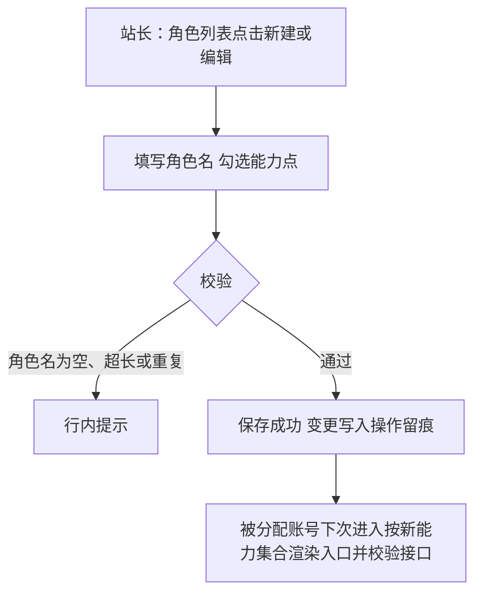

操作步骤清单：1. 进入角色页新建或编辑角色；2. 填写角色名并勾选能力点；3. 保存后以被分配账号重新进入核对入口变化。

**字段与校验**：

| 字段 | 必填 | 业务类型 | 落库字段名 | 约束与取值 |
|---|---|---|---|---|
| 角色名 | 是 | 文本 | role_name | 2～24 个字符，全局唯一 |
| 能力点集合 | 是 | 集合 | capability_set | 至少一项；以功能名命名，本版可用能力点＝R6～R12 涉及的管理功能，0.1.1 功能上线后由站长追加勾选（能力点清单随版本增长，先行基座） |

**规则与边界**：(1) 新建保存成功、调整后对应账号下次进入即按新集合渲染入口并校验接口、变更留痕（验收锚）；(2) 能力授予只经角色（D5）；(3) 删除角色不在本版（见增删改查矩阵）；(4) 角色名与能力点变更写入操作留痕。

**异常与拦截**：角色名重复→「角色名已存在」；能力点全不勾→「至少勾选一个能力点」；保存冲突（他人刚改过）→「该角色已被更新，请刷新后重试」。

### 4.11 R11 角色分配 ◆

**功能说明**：站长把角色分配给管理端账号的授权操作，一人可持多个角色。触发：站长在账号编辑页或开通表单选择该账号的角色（可多选）并保存。

**交互与流程**：

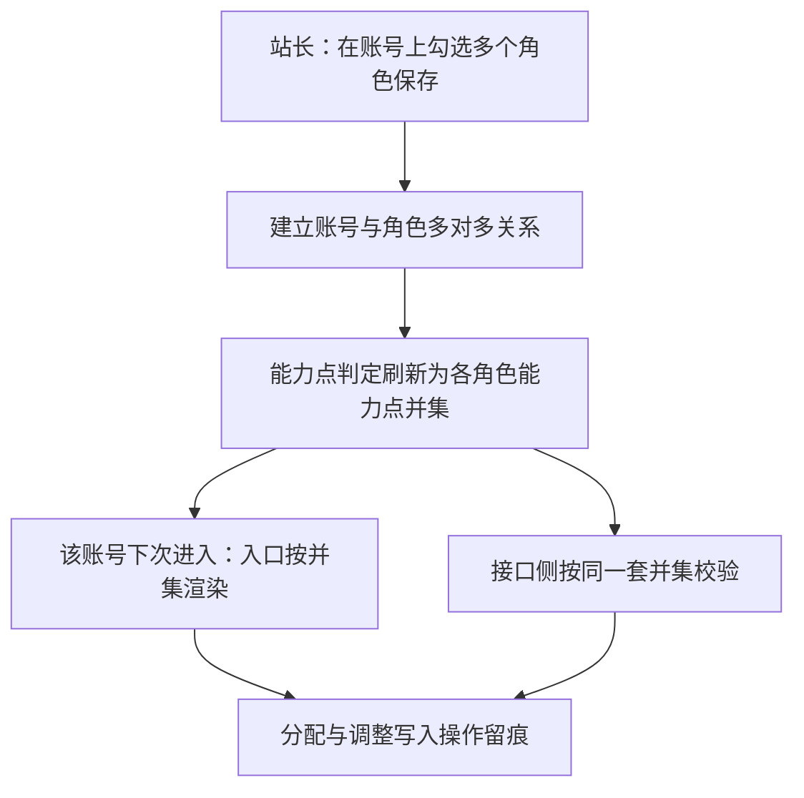

操作步骤清单：1. 进入某账号的角色设置；2. 勾选第二个角色保存；3. 该账号重新登录，核对入口与操作权＝两角色并集；4. 直接访问未授权功能的地址，核对接口拦截。

**字段与校验**：

| 字段 | 必填 | 业务类型 | 落库字段名 | 约束与取值 |
|---|---|---|---|---|
| 账号 | 是（操作对象） | 关联 | admin_id（关联表内） | 已存在的管理端账号 |
| 角色 | 是 | 关联 | role_id（关联表内） | 至少一个；同一账号同一角色不重复建立（唯一约束） |

**规则与边界**：(1) 分配第二个角色后该账号拥有两角色能力点并集的入口与操作权，页面入口与接口校验同源生效，分配与调整留痕（验收锚）；(2) 能力点判定集中在一个判定组件，页面与接口同一来源（开发规范·能力点判定）；(3) 取消全部角色后账号保留但零入口（口径二验收方式）；(4) 分配关系落在关联表，账号停用期间关系保留不生效。

**异常与拦截**：重复分配同一角色→唯一约束拦截，幂等返回「该角色已分配」；对停用中账号调整角色→允许保存、提示「该账号处于停用状态，启用后生效」。

### 4.12 R12 管理端资料与凭据重置

**功能说明**：站长、运营人员、版主维护自身账号的自助管理面。触发：任一管理端账号在管理后台右上角进入「个人设置」，修改资料或重置密码后保存。

**交互与流程**：

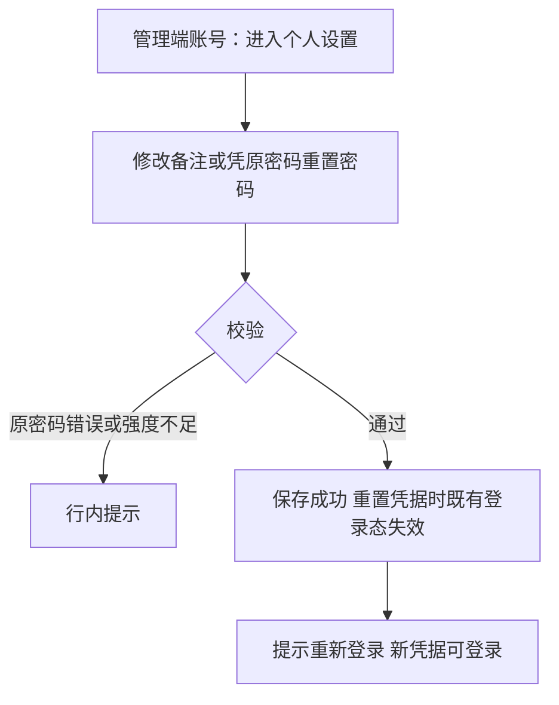

操作步骤清单：1. 进入个人设置；2. 修改备注或重置密码；3. 保存后按提示重新登录验证。

**字段与校验**：

| 字段 | 必填 | 业务类型 | 落库字段名 | 约束与取值 |
|---|---|---|---|---|
| 备注 | 否 | 文本 | remark | ≤50 字（自身说明用途） |
| 原密码／新密码 | 重置时必填 | 凭据 | password_hash | 同 R4 规则 |

**规则与边界**：(1) 修改自身资料或重置密码成功，重置后旧登录态失效且新凭据可登录（验收锚）；(2) 账号名与角色不在自助面修改；(3) 三类角色（站长、运营人员、版主）均可用本条，无能力点门槛（自助管理面为标配）。

**异常与拦截**：原密码错误→「原密码错误」；越权尝试修改他人资料→接口拦截「只能维护自己的账号」。

## 5. 业务对象与数据字段

**数据主体清单**：

| 业务对象 | 落库名 | 定位与关系 |
|---|---|---|
| 会员账号 | member_account | 会员身份；本版仅"正常"状态 |
| 管理端账号 | admin_account | 经营方与版主登录身份；与管理端角色多对多 |
| 管理端角色 | admin_role | 能力授权模板；被账号多对多引用 |
| 账号角色关联 | admin_account_role | 管理端账号与管理端角色的多对多关系表（一对象展开为多张表的映射：R11 分配关系落此表） |
| 登录态 | —（会话） | 机制态：服务端会话，不落业务表，实现形态由开发阶段定 |
| 操作留痕 | operation_log（建议名） | 机制态：账号与角色变更留痕（开通、编辑、停用启用、注销、角色定义调整、分配），实现形态由开发阶段定 |

**会员账号（member_account）字段表**：

| 字段 | 必填 | 业务类型 | 落库字段名 | 约束与取值 |
|---|---|---|---|---|
| 主键 | 是 | 编号 | id | 自增整数（通用字段） |
| 会员编号 | 是 | 编号 | member_no | 创建时生成、终身不变（术语表编码契约） |
| 账号名 | 是 | 文本 | account_name | 4～32 位规则，全局唯一 |
| 凭据散列 | 是 | 凭据 | password_hash | 仅存散列 |
| 昵称 | 是 | 文本 | nickname | 2～24 字符，默认＝账号名 |
| 头像 | 否 | 图片地址 | avatar | 默认头像兜底 |
| 状态 | 是 | 状态 | status | 本版仅"正常"（禁言／封号随 0.2） |
| 创建时间／更新时间 | 是 | 时间 | created_at／updated_at | 通用审计字段 |

**管理端账号（admin_account）字段表**：

| 字段 | 必填 | 业务类型 | 落库字段名 | 约束与取值 |
|---|---|---|---|---|
| 主键 | 是 | 编号 | id | 自增整数 |
| 管理端账号编号 | 是 | 编号 | admin_no | 创建时生成、终身不变 |
| 账号名 | 是 | 文本 | account_name | 同规则，全局唯一，创建后不可改 |
| 凭据散列 | 是 | 凭据 | password_hash | 一次性初始密码首次登录强制更换 |
| 备注 | 否 | 文本 | remark | ≤50 字 |
| 状态 | 是 | 状态 | status | 启用／停用；停用（离职注销）为终态表达 |
| 创建时间／更新时间 | 是 | 时间 | created_at／updated_at | 通用审计字段 |

**管理端角色（admin_role）字段表**：

| 字段 | 必填 | 业务类型 | 落库字段名 | 约束与取值 |
|---|---|---|---|---|
| 主键 | 是 | 编号 | id | 自增整数 |
| 角色名 | 是 | 文本 | role_name | 2～24 字符，全局唯一 |
| 能力点集合 | 是 | 集合 | capability_set | 以功能名命名；集合或子表形态由开发阶段定 |
| 创建时间／更新时间 | 是 | 时间 | created_at／updated_at | 通用审计字段 |

**账号角色关联（admin_account_role）字段表**：

| 字段 | 必填 | 业务类型 | 落库字段名 | 约束与取值 |
|---|---|---|---|---|
| 管理端账号 | 是 | 关联 | admin_id | 外键（术语表外键契约） |
| 角色 | 是 | 关联 | role_id | 外键；与 admin_id 联合唯一 |
| 建立时间 | 是 | 时间 | created_at | 通用审计字段 |

## 6. 待议与建议

**本版采用的推断与默认值汇总**（均已就地标明）：账号名 4～32 位字母开头规则、密码 ≥8 位含字母数字、昵称 2～24 字符、头像 jpg／png／webp ≤2MB、登录连续失败 5 次锁定 10 分钟、会话 30 天不活动过期、admin 初始账号由部署初始化且首次登录强制改密、开通生成 12 位一次性初始密码、先停用后注销、注销二次确认输入「注销」、不能停用当前登录账号、新密码不得与原密码相同、账号名不区分大小写判唯一、默认昵称＝账号名——以上均为行业惯例默认（本版采用），可随评审调整。

**待确认内容与影响**：能力点清单随版本增长的管理口径（0.1.1 上线时由站长追加勾选）；操作留痕的展示界面归后续版本（本版只落痕迹不建查询面，查询能力待版本排期）。

**建议回池的新想法**：无。

**术语表待登记行**（随本文档回报、由主流程合入）：account_name、password_hash、nickname、avatar、remark、role_name、capability_set、admin_account_role（含 admin_id、role_id）、operation_log（机制态建议名）。
