# PRD（小版本）：v0.1.1 结构与规则就绪

> 定位：开发级需求说明书——承接大版本 PRD 0.1 与其 02 批次二，认领自需求池（R13～R23，状态已迁移为已认领（v0.1.1））；用途与验收标准逐字锚定上游、只细化不改写；上游为模拟案例材料，模拟性质予以保留。

## 1. 版本概述

**承接与目标**：认领来源＝0.1 基座版批次二「结构与规则就绪」（简单场景采纳整批，R13～R23）＋需求池实时状态合并（池内该 11 条均为待规划，无池直入条目混入）。本版可验收形态＝02 批次二可验收形态——可演示开站准备：建立板块与标签并调整次序、完成站点信息与审核策略配置并在设置查看确认生效值。量化口径沿用大版本 PRD（基座演练五项动作中的「建立板块与标签」「完成站点信息与审核策略配置」自本版起可执行）。

**范围外声明**：R1～R12 已随 v0.1.0 发布，本版不重复实现；内容生产与审核、互动与消息、前台板块与内容入口随 0.2（板块停用与删除对内容提交的拦截、标签使用次数的派生、审核策略的消费均为先行基座，自 0.2 起接入）；会员注销随 0.5；运营内容与浏览量统计随 0.6／0.7。

**条目内顺序与依赖**（引用上游批内说明）：R13～R20（板块与标签）与 R21～R23（全站设置）两组并行开发；R14～R17 依赖 R13 的板块存在；R19～R20 依赖 R18 的标签存在；全部条目依赖 v0.1.0 已交付的管理后台登录与能力点判定（站长／运营人员入口）。

## 2. 需求范围与验收锚

**条目总览树**（与上游批次二分支图同名同构）：

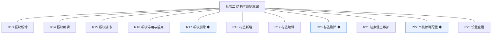

**认领条目表**（需求名、用途、验收标准逐字引自 02 批次二需求表）：

| 编号 | 需求名 | 用途 | 验收标准 |
|---|---|---|---|
| R13 | 板块新增 | 站长建立板块作为内容的一级去处 | 站长填写名称与说明保存后，板块列表出现该板块并处于启用状态 |
| R14 | 板块编辑 | 站长、运营人员修改板块信息 | 修改名称或说明保存后，板块列表与详情显示新值 |
| R15 | 板块排序 | 站长、运营人员调整板块展示次序 | 调整排序值保存后，板块列表按新次序展示 |
| R16 | 板块停用与启用 | 站长、运营人员控制板块是否接收新内容 | 停用后板块标记为停用状态、启用后恢复启用状态；对新增内容的拦截自 0.2 内容上线起生效（先行基座） |
| R17 | 板块删除 ◆ | 站长移除不再使用的板块 | 板块下无内容时删除成功并从列表移除；有内容时拒绝删除并提示先迁移或处置内容，删除留痕 |
| R18 | 标签新增 | 运营人员建立标签供发帖选用 | 新增标签保存后出现在标签列表 |
| R19 | 标签编辑 | 运营人员修改标签名称 | 修改保存后标签列表显示新名称 |
| R20 | 标签删除 ◆ | 运营人员移除不再使用的标签 | 使用次数为零时删除成功并从列表移除；使用次数大于零时拒绝删除并提示，删除留痕 |
| R21 | 站点信息维护 | 站长维护站点名称与说明等基础信息 | 修改站点信息保存后全站即时生效（如站点名展示为新值），变更留痕 |
| R22 | 审核策略配置 ◆ | 站长设定先审后发的适用范围，作为内容审核的规则来源 | 站长配置适用范围保存后设置页显示当前生效值，重复保存相同值不产生新变更记录，变更留痕；策略消费自 0.2 起生效（先行基座） |
| R23 | 设置查看 | 站长、运营人员查看当前生效配置 | 进入设置查看页可见站点信息与审核策略的当前生效值 |

**锚定说明**：本表为全文档唯一锚源，第 4 章各条目细化不得与本表冲突、不得收窄或放宽验收；验收按本表逐条打钩。

## 3. 核心用户旅程

**旅程承接说明**：上游大版本 PRD 三条旅程中，旅程二（建立板块与标签并完成站点设置）全程落在认领范围内，本章细化到开发级取值与反馈；旅程一与旅程三已随 v0.1.0 发布（登录、账号与角色操作沿用 v0.1.0 已交付能力，不在本版旅程内重复）。

### 3.1 旅程二：建立板块与标签并完成站点设置（细化至取值与反馈）

站长与运营人员以 v0.1.0 已交付的账号登录管理后台：站长新增板块（名称 2～24 字符、说明 ≤100 字，默认排序值追加在末位），运营人员编辑板块信息、调整排序并补充标签（名称 2～24 字符、全局唯一）；站长随后维护站点信息（站点名 2～30 字符、说明 ≤200 字）并配置审核策略（四类内容多选，默认全选），最后两人在设置查看页核对全部生效值——每一步保存均有行内反馈，结构、标签与规则三类基座就绪。

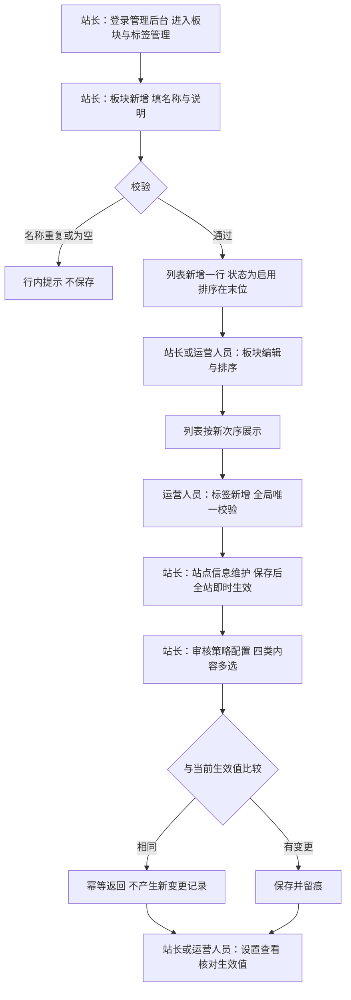

操作步骤清单：1. 站长登录并新增板块（名称「站务公告」、说明「站点事务与规则发布」）；2. 运营人员编辑说明并调整排序，核对列表次序；3. 运营人员新增标签（「公告」「新人指引」）；4. 站长维护站点信息并核对管理后台顶栏站点名即时更新；5. 站长配置审核策略并重复保存相同值验证幂等；6. 两人在设置查看页核对站点信息与审核策略当前生效值。

## 4. 功能需求

### 4.0 功能总览

**对象归组树**（版本→对象→条目）：

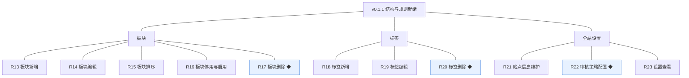

**对象增删改查矩阵**：

| 对象 | 增 | 改 | 删 | 查 |
|---|---|---|---|---|
| 板块 | R13（新增） | R14（名称与说明）、R15（排序值）、R16（启停） | R17（删除，前置＝板块下无内容） | R14／R15（板块列表为操作入口） |
| 标签 | R18（新增） | R19（名称） | R20（删除，前置＝使用次数为零） | R18／R19（标签列表为操作入口） |
| 全站设置 | 不做（配置项由系统随版本预置，无人工新增配置项） | R21（站点信息）、R22（审核策略） | 不做（配置项不可删除） | R23（设置查看） |

**主体使用面**：

| 主体／角色 | 端 | 使用条目 | 机制条目 |
|---|---|---|---|
| 站长 | 管理后台 | R13、R14、R15、R16、R17、R21、R22、R23 | 审核策略消费（0.2 起由内容审核读取，本版无界面）；板块停用对内容提交的拦截（0.2 起生效，先行基座） |
| 运营人员 | 管理后台 | R14、R15、R16、R18、R19、R20、R23 | 同上 |

### 4.1 R13 板块新增

**功能说明**：站长建立站点内容的一级去处。触发：站长在管理后台「板块与标签管理」点击「新增板块」提交表单。

**交互与流程**：

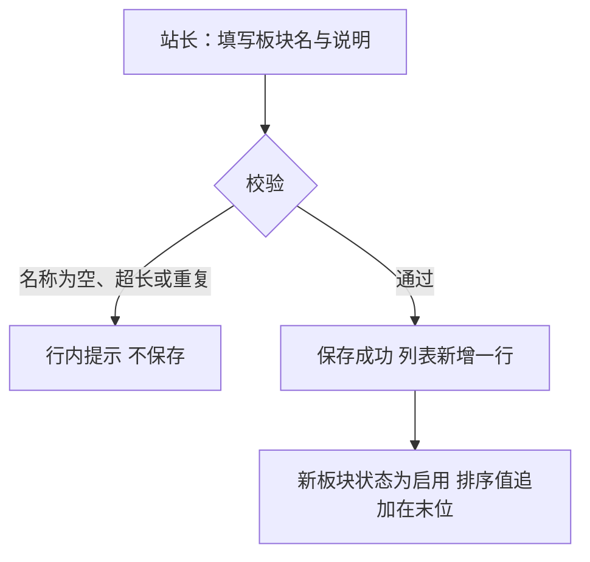

操作步骤清单：1. 点击「新增板块」打开表单；2. 填写板块名与说明；3. 提交并按提示修正错误；4. 在列表核对新行（启用状态、末位排序）。

**字段与校验**：

| 字段 | 必填 | 业务类型 | 落库字段名 | 约束与取值 |
|---|---|---|---|---|
| 板块名 | 是 | 文本 | board_name | 2～24 个字符，全局唯一（本版采用，行业惯例默认） |
| 说明 | 否 | 文本 | description | ≤100 字（本版采用，行业惯例默认） |
| 排序值 | 是（默认） | 整数 | sort_order | 1～9999；默认＝当前最大排序值＋10，追加在末位（本版采用） |
| 状态 | 是（默认） | 状态 | status | 默认「启用」（术语表） |

**规则与边界**：(1) 保存后板块列表出现该板块并处于启用状态（验收锚）；(2) 排序值可留空由系统赋默认值，手工填写时须为 1～9999 整数；(3) 板块名唯一性不区分大小写（沿用 v0.1.0 账号名同口径，本版采用）；(4) 前台展示入口随 0.2 交付，本版板块仅存在于管理后台（先行基座）。

**异常与拦截**：名称为空或越界→「板块名需 2～24 个字符」；名称重复→「板块名已存在」；说明超长→「说明不超过 100 字」；排序值非法→「排序值需为 1～9999 的整数」。

### 4.2 R14 板块编辑

**功能说明**：修正板块的名称与说明信息。触发：站长或运营人员在板块列表点击某板块「编辑」修改后保存。

**交互与流程**：

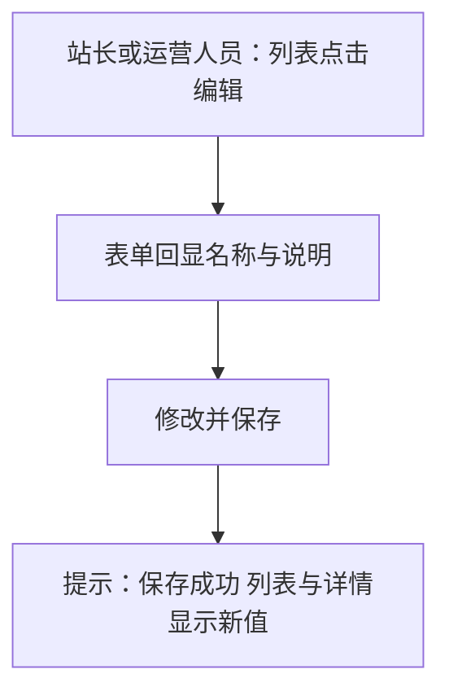

操作步骤清单：1. 在列表定位板块并进入编辑；2. 修改名称或说明；3. 保存并核对列表与详情回显。

**字段与校验**：

| 字段 | 必填 | 业务类型 | 落库字段名 | 约束与取值 |
|---|---|---|---|---|
| 板块名 | 是 | 文本 | board_name | 同 R13 规则（唯一性校验排除自身） |
| 说明 | 否 | 文本 | description | ≤100 字 |

**规则与边界**：(1) 修改保存后板块列表与详情显示新值（验收锚）；(2) 排序值不在本条修改——次序调整走 R15；(3) 编辑动作写入操作留痕（operation_log，沿用 v0.1.0 机制态）。

**异常与拦截**：名称重复（自身除外）→「板块名已存在」；并发编辑→「该板块已被更新，请刷新后重试」。

### 4.3 R15 板块排序

**功能说明**：调整板块的展示次序。触发：站长或运营人员在板块列表拖拽行或修改排序值后保存。

**交互与流程**：

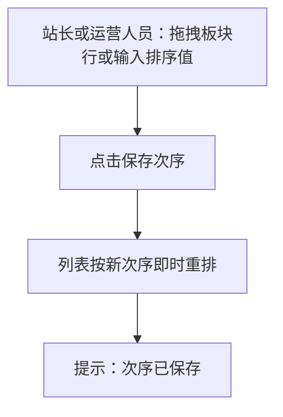

操作步骤清单：1. 拖拽或输入排序值；2. 保存次序；3. 核对列表按新次序展示。

**字段与校验**：

| 字段 | 必填 | 业务类型 | 落库字段名 | 约束与取值 |
|---|---|---|---|---|
| 排序值 | 是 | 整数 | sort_order | 1～9999；允许批量保存 |

**规则与边界**：(1) 调整保存后板块列表按新次序展示（验收锚）；(2) 相同排序值时按创建时间先后稳定排序（本版采用）；(3) 排序变更写入操作留痕。

**异常与拦截**：排序值非法→「排序值需为 1～9999 的整数」；批量保存部分失败→整批回滚并提示「保存失败，请重试」。

### 4.4 R16 板块停用与启用

**功能说明**：控制板块是否接收新内容。触发：站长或运营人员在板块列表对某板块点击「停用」或「启用」并确认。

**交互与流程**：

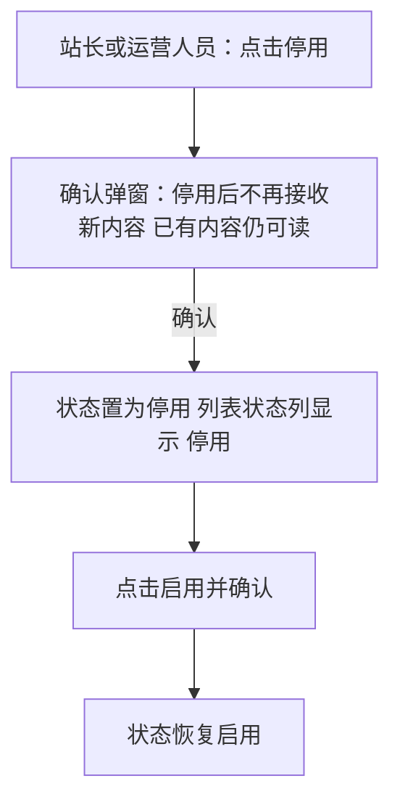

操作步骤清单：1. 对目标板块执行停用并确认；2. 核对状态标签；3. 执行启用并确认恢复。

**字段与校验**：

| 字段 | 必填 | 业务类型 | 落库字段名 | 约束与取值 |
|---|---|---|---|---|
| 状态 | —（操作对象） | 状态 | status | 取值：启用／停用（术语表） |

**规则与边界**：(1) 停用后标记停用状态、启用后恢复（验收锚）；(2) 停用只影响新增内容，已有内容仍可读（D／04C 口径）；(3) 对新增内容的提交拦截自 0.2 内容上线起生效——本版拦截校验逻辑先行就绪（先行基座，供 0.2 接入）；(4) 停用与启用写入操作留痕。

**异常与拦截**：重复停用→幂等返回「该板块已是停用状态」；对启用中板块显示「停用」、停用中板块显示「启用」，操作项互斥展示。

### 4.5 R17 板块删除 ◆

**功能说明**：移除不再使用的板块。触发：站长在板块列表对某板块点击「删除」并通过二次确认。

**交互与流程**：

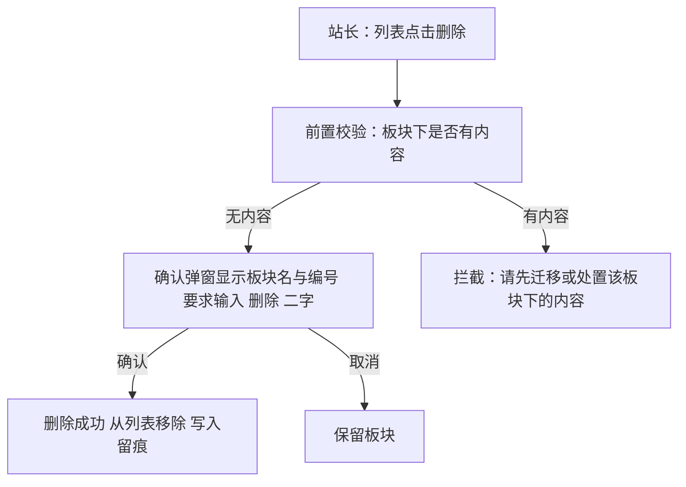

操作步骤清单：1. 对目标板块点击删除；2. 按弹窗输入「删除」确认；3. 核对该板块从列表移除。

**字段与校验**：

| 字段 | 必填 | 业务类型 | 落库字段名 | 约束与取值 |
|---|---|---|---|---|
| 删除确认 | 是 | 确认输入 | —（不落库） | 输入「删除」二字方可确认（本版采用，与 v0.1.0 注销同口径） |

**规则与边界**：(1) 板块下无内容时删除成功并从列表移除；有内容时拒绝并提示先迁移或处置内容（验收锚）——本版尚无内容产生，校验逻辑先行就绪（先行基座）；(2) 删除不可恢复，删除后板块名可被新板块复用；(3) 删除动作写入操作留痕。

**异常与拦截**：有内容时→「请先迁移或处置该板块下的内容」；重复删除→幂等返回「该板块已删除」。

### 4.6 R18 标签新增

**功能说明**：运营人员建立标签词表。触发：运营人员在「板块与标签管理」的标签页点击「新增标签」提交。

**交互与流程**：

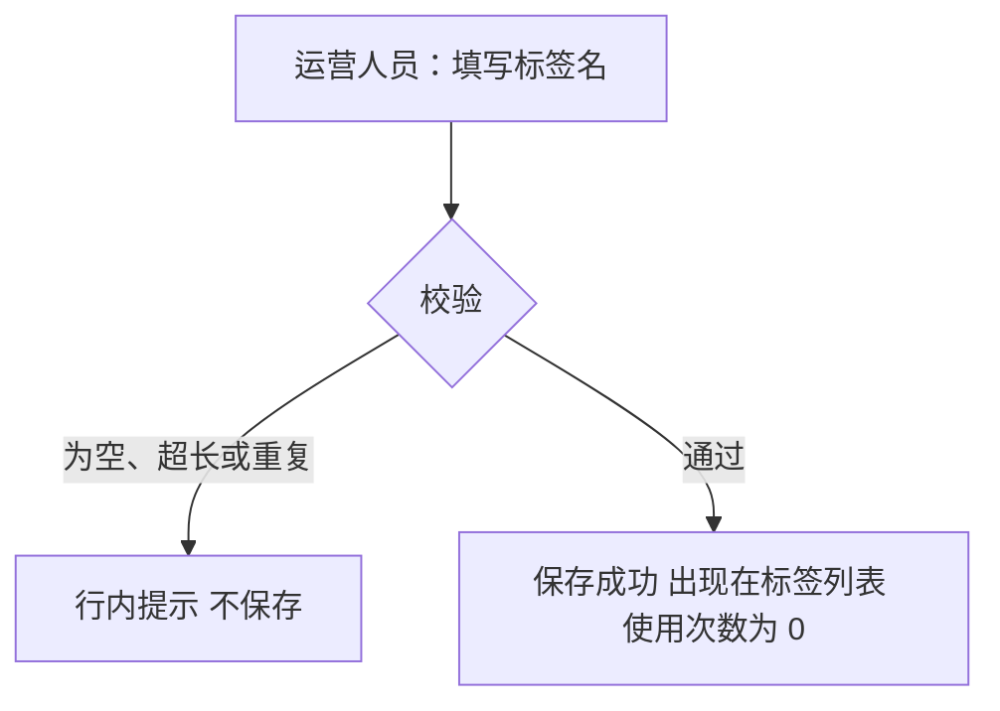

操作步骤清单：1. 切换到标签页并点击新增；2. 填写标签名；3. 保存并核对列表新行。

**字段与校验**：

| 字段 | 必填 | 业务类型 | 落库字段名 | 约束与取值 |
|---|---|---|---|---|
| 标签名 | 是 | 文本 | tag_name | 2～24 个字符，全局唯一（本版采用，行业惯例默认） |

**规则与边界**：(1) 新增保存后出现在标签列表（验收锚）；(2) 使用次数初始为 0，由话题标注关系派生（0.2 起有使用，本版恒 0）；(3) 标签供发帖选用，选用入口随 0.2 交付（先行基座）。

**异常与拦截**：名称为空或越界→「标签名需 2～24 个字符」；重复→「标签名已存在」。

### 4.7 R19 标签编辑

**功能说明**：修正标签名称。触发：运营人员在标签列表点击「编辑」修改名称后保存。

**交互与流程**：

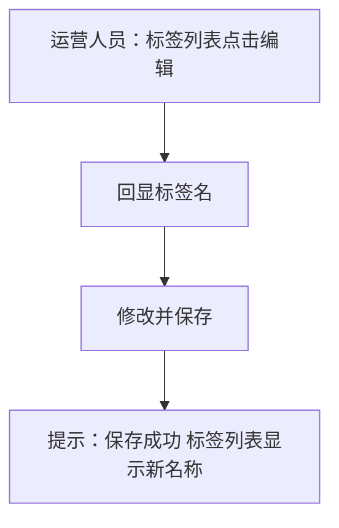

操作步骤清单：1. 定位标签进入编辑；2. 修改名称；3. 保存并核对列表回显。

**字段与校验**：

| 字段 | 必填 | 业务类型 | 落库字段名 | 约束与取值 |
|---|---|---|---|---|
| 标签名 | 是 | 文本 | tag_name | 同 R18 规则（唯一性校验排除自身） |

**规则与边界**：(1) 修改保存后标签列表显示新名称（验收锚）；(2) 编辑不影响使用次数（本版恒 0）；(3) 编辑动作写入操作留痕。

**异常与拦截**：名称重复（自身除外）→「标签名已存在」；越界→「标签名需 2～24 个字符」。

### 4.8 R20 标签删除 ◆

**功能说明**：移除不再使用的标签。触发：运营人员在标签列表对某标签点击「删除」并通过二次确认。

**交互与流程**：

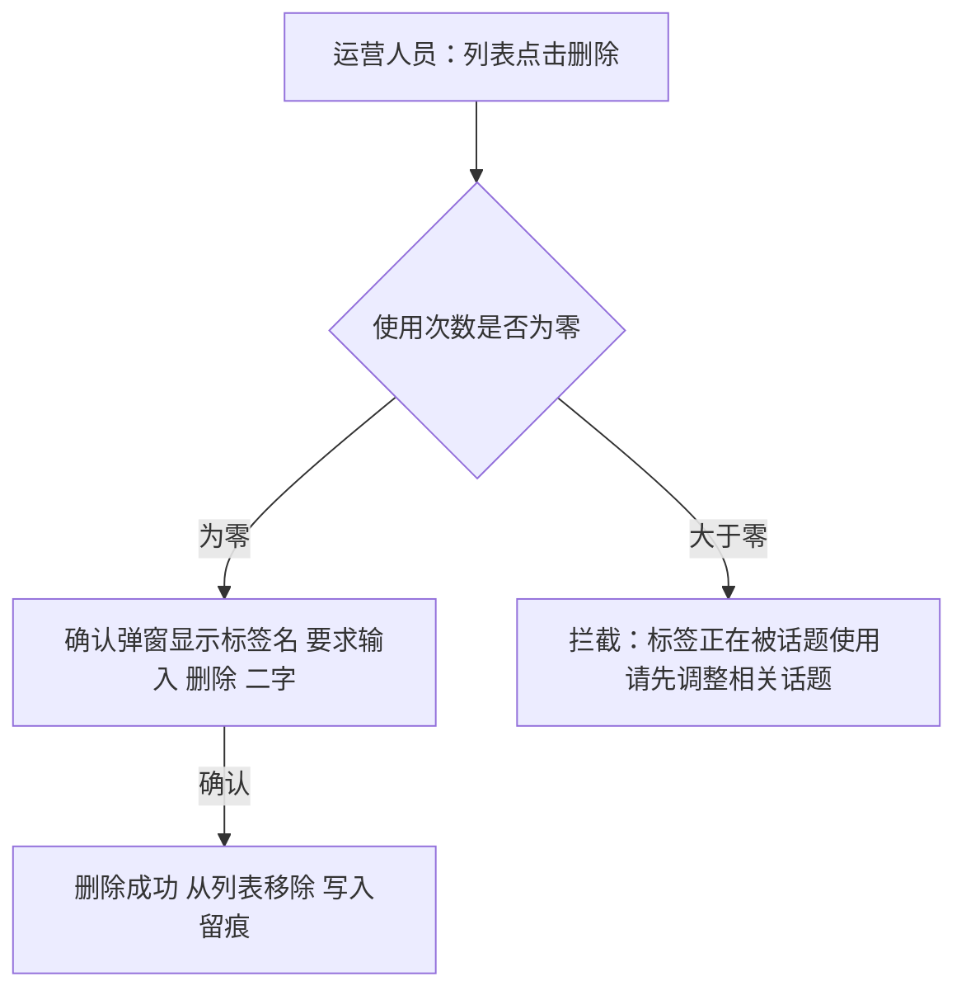

操作步骤清单：1. 对目标标签点击删除；2. 按弹窗输入「删除」确认；3. 核对从列表移除。

**字段与校验**：

| 字段 | 必填 | 业务类型 | 落库字段名 | 约束与取值 |
|---|---|---|---|---|
| 使用次数 | —（判定依据） | 计数 | use_count | 由话题标注关系派生，本版恒 0（0.2 起有值） |
| 删除确认 | 是 | 确认输入 | —（不落库） | 输入「删除」二字（本版采用） |

**规则与边界**：(1) 使用次数为零时删除成功、大于零时拒绝并提示，删除留痕（验收锚）——本版无话题使用，判定逻辑先行就绪（先行基座）；(2) 删除不可恢复，标签名可复用。

**异常与拦截**：使用中→「标签正在被话题使用，请先调整相关话题」；重复删除→幂等返回「该标签已删除」。

### 4.9 R21 站点信息维护

**功能说明**：站长维护站点级基础信息。触发：站长在管理后台「全站设置」修改站点名或站点说明后保存。

**交互与流程**：

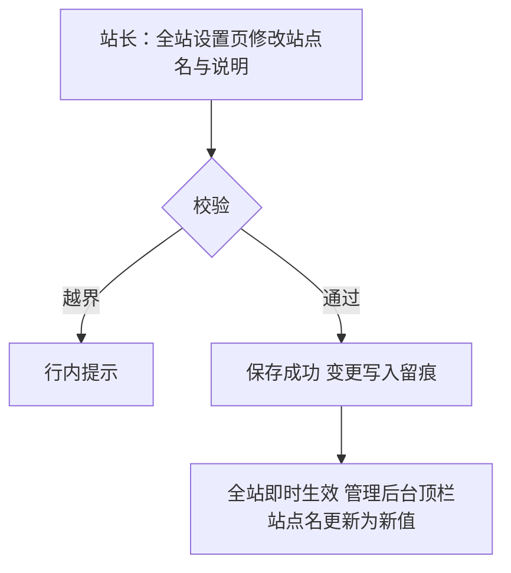

操作步骤清单：1. 进入全站设置；2. 修改站点名与说明；3. 保存后核对顶栏与设置页显示新值。

**字段与校验**：

| 字段 | 必填 | 业务类型 | 落库字段名 | 约束与取值 |
|---|---|---|---|---|
| 站点名 | 是 | 配置值 | site_setting（setting_value，键 site_name） | 2～30 个字符（本版采用，行业惯例默认） |
| 站点说明 | 否 | 配置值 | site_setting（setting_value，键 site_description） | ≤200 字（本版采用） |

**规则与边界**：(1) 修改保存后全站即时生效（站点名展示为新值），变更留痕（验收锚）；(2) 站点信息作为全站设置的配置项存储（键值形态）；(3) 前台页面随 0.2 上线后同样读取该配置展示。

**异常与拦截**：站点名越界→「站点名需 2～30 个字符」；说明超长→「站点说明不超过 200 字」。

### 4.10 R22 审核策略配置 ◆

**功能说明**：站长设定先审后发的适用范围，作为内容审核的规则来源。触发：站长在全站设置页的「审核策略」勾选适用内容类型后保存。

**交互与流程**：

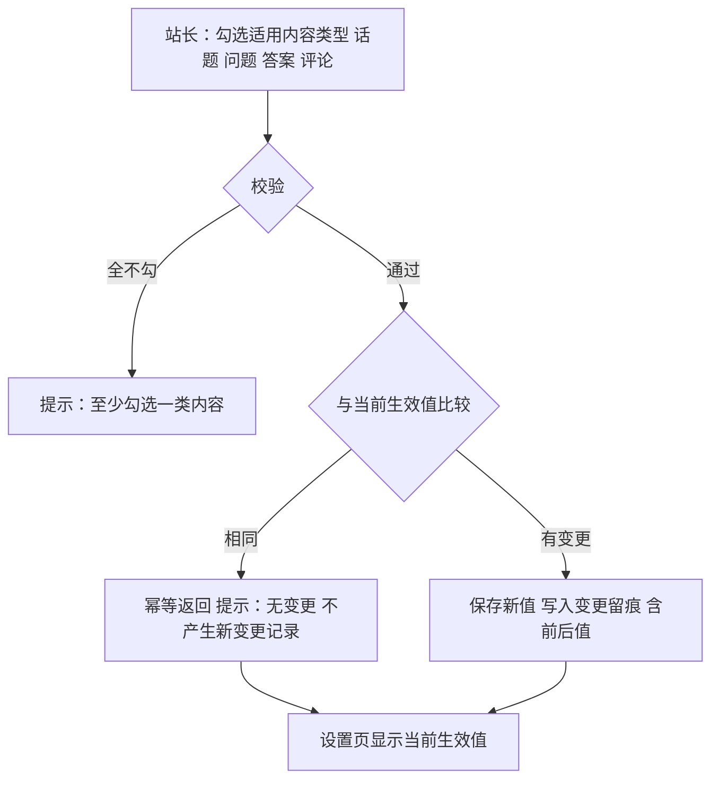

操作步骤清单：1. 进入全站设置的审核策略；2. 勾选适用内容类型（默认四类全选）；3. 保存并核对当前生效值；4. 不改动再次保存，验证幂等提示。

**字段与校验**：

| 字段 | 必填 | 业务类型 | 落库字段名 | 约束与取值 |
|---|---|---|---|---|
| 适用范围 | 是 | 配置值 | site_setting（setting_value，键 audit_scope） | 取值＝话题／问题／答案／评论 的非空子集；默认四类全选（D3 推导，默认全量先审后发） |

**规则与边界**：(1) 配置保存后设置页显示当前生效值，重复保存相同值不产生新变更记录，变更留痕（验收锚）；(2) 策略消费自 0.2 内容审核上线起生效——本版为先行基座，供后续版本接入；(3) 留痕记录前后值（开发规范·留痕机制）；(4) 策略变更只影响之后的内容提交（大版本 PRD 口径沿用）。

**异常与拦截**：全不勾→「至少勾选一类内容」；保存冲突→「配置已被更新，请刷新后重试」。

### 4.11 R23 设置查看

**功能说明**：集中查看当前生效的站点配置。触发：站长或运营人员在管理后台进入「设置查看」页。

**交互与流程**：

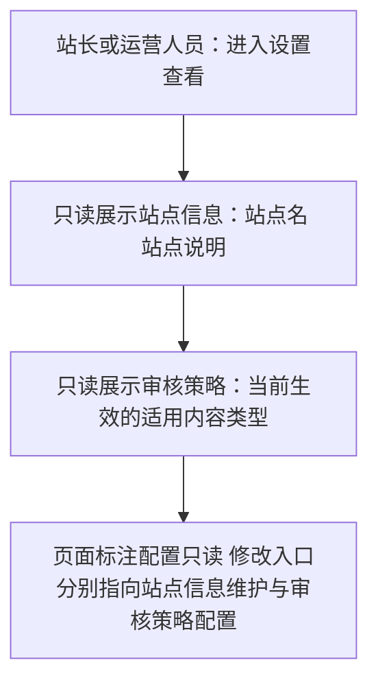

操作步骤清单：1. 进入设置查看页；2. 核对站点信息与审核策略的当前生效值。

**字段与校验**：

| 字段 | 必填 | 业务类型 | 落库字段名 | 约束与取值 |
|---|---|---|---|---|
| 站点信息 | —（只读回显） | 配置值 | site_setting（setting_value） | 键 site_name、site_description |
| 审核策略 | —（只读回显） | 配置值 | site_setting（setting_value） | 键 audit_scope |

**规则与边界**：(1) 进入设置查看页可见站点信息与审核策略的当前生效值（验收锚）；(2) 本页只读，不提供修改入口；(3) 站长与运营人员均可见（能力点：设置查看）。

**异常与拦截**：无——只读页无写操作，配置缺失时显示系统默认值并标注「默认值」。

## 5. 业务对象与数据字段

**数据主体清单**：

| 业务对象 | 落库名 | 定位与关系 |
|---|---|---|
| 板块 | board | 内容的一级去处；状态启用／停用；对内容的容纳关系随 0.2 建立 |
| 标签 | tag | 话题的横向归类标记；使用次数由话题标注派生（0.2 起） |
| 全站设置 | site_setting | 站点级参数的键值存放处；本版配置键＝site_name、site_description、audit_scope |
| 操作留痕 | operation_log（沿用 v0.1.0 机制态） | 板块与标签变更、站点信息与审核策略变更留痕，实现形态由开发阶段定 |

**板块（board）字段表**：

| 字段 | 必填 | 业务类型 | 落库字段名 | 约束与取值 |
|---|---|---|---|---|
| 主键 | 是 | 编号 | id | 自增整数 |
| 板块编号 | 是 | 编号 | board_no | 创建时生成、终身不变 |
| 板块名 | 是 | 文本 | board_name | 2～24 字符，全局唯一（不区分大小写） |
| 说明 | 否 | 文本 | description | ≤100 字 |
| 排序值 | 是 | 整数 | sort_order | 1～9999，同值按创建时间稳定排序 |
| 状态 | 是 | 状态 | status | 启用／停用（术语表） |
| 创建时间／更新时间 | 是 | 时间 | created_at／updated_at | 通用审计字段 |

**标签（tag）字段表**：

| 字段 | 必填 | 业务类型 | 落库字段名 | 约束与取值 |
|---|---|---|---|---|
| 主键 | 是 | 编号 | id | 自增整数 |
| 标签编号 | 是 | 编号 | tag_no | 创建时生成、终身不变 |
| 标签名 | 是 | 文本 | tag_name | 2～24 字符，全局唯一 |
| 使用次数 | 是 | 计数 | use_count | 由话题标注关系派生（冗余可校正），本版恒 0 |
| 创建时间／更新时间 | 是 | 时间 | created_at／updated_at | 通用审计字段 |

**全站设置（site_setting）字段表**：

| 字段 | 必填 | 业务类型 | 落库字段名 | 约束与取值 |
|---|---|---|---|---|
| 主键 | 是 | 编号 | id | 自增整数 |
| 配置键 | 是 | 文本 | setting_key | 全局唯一；本版键＝site_name、site_description、audit_scope |
| 配置值 | 是 | 文本 | setting_value | 按键各自的校验规则（见 R21／R22） |
| 更新时间 | 是 | 时间 | updated_at | 通用审计字段 |

## 6. 待议与建议

**本版采用的推断与默认值汇总**（均已就地标明）：板块名 2～24 字符唯一（不区分大小写）、说明 ≤100 字、排序值 1～9999 且默认＝当前最大值＋10、同排序值按创建时间稳定排序、删除二次确认输入「删除」二字、标签名 2～24 字符唯一、站点名 2～30 字符、站点说明 ≤200 字、审核策略默认四类全选——以上均为行业惯例默认或 D3 推导（本版采用），可随评审调整。

**待确认内容与影响**：板块与标签的删除拦截、标签使用次数派生、审核策略消费均依赖 0.2 内容模块上线，本版交付判定逻辑与配置先行就绪；0.2 立项时需回验三处先行基座的接入。

**建议回池的新想法**：无。

**术语表待登记行**（随本文档回报、由主流程合入）：board_no、board_name、description、tag_no、tag_name、use_count、setting_key、setting_value。
