# PRD（大版本）：0.2 讨论开站版

> 定位：本版立项说明书，承接路线图 0.2 条目与项目 PRD，把讨论开站版范围落成带验收标准的功能需求、用户旅程与对象版本态，供需求拆解与小版本规划直接开工；上游为模拟案例材料，模拟性质予以保留。

## 1. 版本概述

**承接与目标**：承接路线图 0.2 讨论开站版条目——交付讨论闭环的最小可经营集，站点可真实开门：浏览搜索、发帖与评论、先审后发的审核与公开、结果通知。本版消费 0.1 交付的先行基座（登录鉴权与能力点判定、操作留痕、板块与标签结构、审核策略配置），内容提交自此起按审核策略先审后发。

**成功标准与量化口径**：

- 口径一（开站路径全通过）：小范围邀请阶段每一名受邀访客的「注册 → 浏览板块 → 发表话题 → 审核通过公开 → 被其他会员评论」五步路径 100% 走通——本版该路径无人工替代入口，任一步失败按链路异常排查（从路线图完成标志推导；灰度台阶安排归路线图条目）。
- 口径二（先审后发零泄漏）：待审核与已驳回内容对访客与其他会员的可见实例数为 0，列表与搜索同样不泄漏（D3 与 v0.1.1 审核策略消费的判定方式）。
- 口径三（经营验证口径）：小范围邀请期间真实话题数与评论数达到本版立项时约定的数值口径——数值未定，列入立项依赖（路线图验证假设沿用，不阻塞拆解）。

**范围一句话**：做——前台浏览与搜索（板块入口、话题列表与详情、搜索、可见判定）、话题与评论的生产（发表、编辑、重新提交、删除、可见权限设置、评论与回复）、先审后发的审核（待审队列、通过、驳回、敏感词词表与命中校验）、结果通知（写入与查看）、互动（点赞与收藏）、违规账号处置（禁言、解除禁言、封号）；不做——问答与悬赏、积分与等级（随 0.3）、私信与关注（随 0.4）、个人中心聚合与注销（随 0.5）、举报与治理侧内容删除（随 0.6，过渡：对已公开违规内容先用本版已交付的禁言与封号处置账号，内容处置 0.6 补齐）、会员与内容的全量检索维护（随 0.6，过渡：内容以本版前台搜索与待审队列支撑）、运营内容（随 0.6）、浏览量统计（随 0.7）。

**沿用与前置**：前置版本 0.1（v0.1.0、v0.1.1 均已发布）——沿用统一鉴权与能力点判定、操作留痕、板块与标签、站点设置与审核策略；域名注册与备案在本版收口（路线图依赖，收口安排归发布环节，本文不写）；禁言的期限与解除条件在本版立项时定案（见 4.6 与 5.5，本版定案）。

## 2. 主体与角色

**上场主体总览树**：

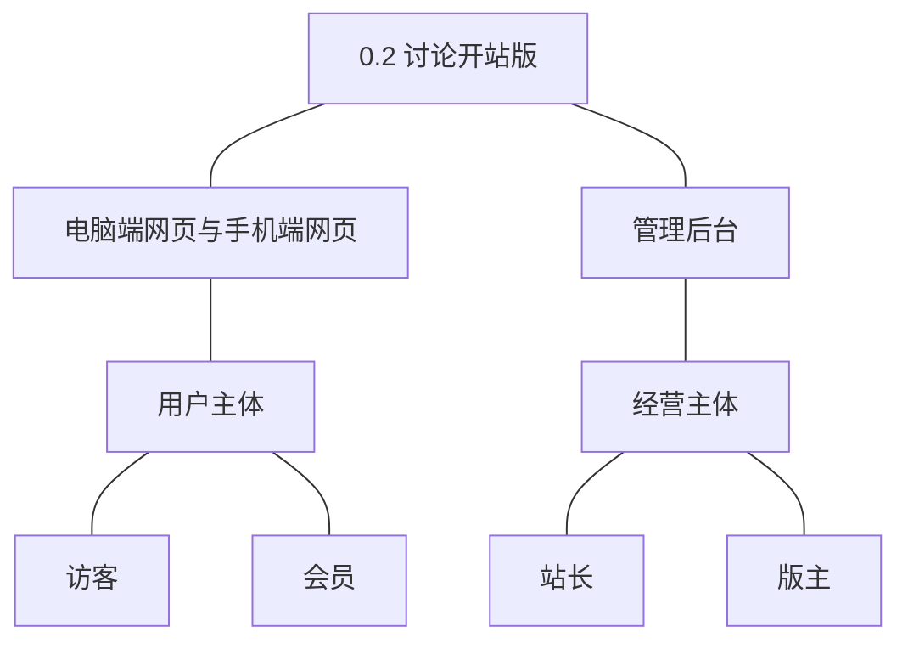
```mermaid
flowchart TB
    V[0.2 讨论开站版]
    V --- E1[电脑端网页与手机端网页] & E2[管理后台]
    E1 --- S1[用户主体]
    S1 --- R1[访客] & R2[会员]
    E2 --- S2[经营主体]
    S2 --- R3[站长] & R4[版主]
```

**主体表**：

| 主体 | 角色 | 端 | 怎么用系统 |
|---|---|---|---|
| 用户主体 | 访客 | 电脑端网页、手机端网页 | 按板块浏览已公开话题、按标签查看同类话题、搜索答案与讨论 |
| 用户主体 | 会员 | 电脑端网页、手机端网页 | 发表话题与评论、设置可见条件、点赞收藏、查看通知、维护资料（沿用 0.1） |
| 经营主体 | 站长 | 管理后台 | 维护敏感词词表，其余结构与规则能力沿用 0.1 |
| 经营主体 | 版主 | 管理后台 | 查看待审队列、通过或驳回待审内容、对违规会员禁言／解除禁言／封号 |

**裁剪说明**：运营人员在本版无新增专属操作面（板块与标签维护已在 0.1.1 交付，会员与内容查询维护随 0.6），其账号与角色自 0.1 起可用；访客可浏览与搜索但一切参与行为需注册登录（沿用项目 PRD 口径）。

## 3. 核心业务流程

**旅程覆盖说明**：本版两条跨主体旅程（发表话题经审核公开、评论与互动）用顺序图，两条关键单端旅程（驳回后修改重提、访客浏览搜索）用流程图；敏感词命中作为提交环节的机制线索随旅程一表达，不单独成旅程。

### 3.1 旅程一：会员发表话题并经审核公开（跨主体：会员与版主）

会员在前台选定板块发表话题（选用标签、可设可见条件），提交即进入待审核并接受敏感词命中标记；版主在管理后台待审队列作出结论——通过则话题公开进入板块列表与搜索，驳回则作者收到含原因的通知并可修改重提。

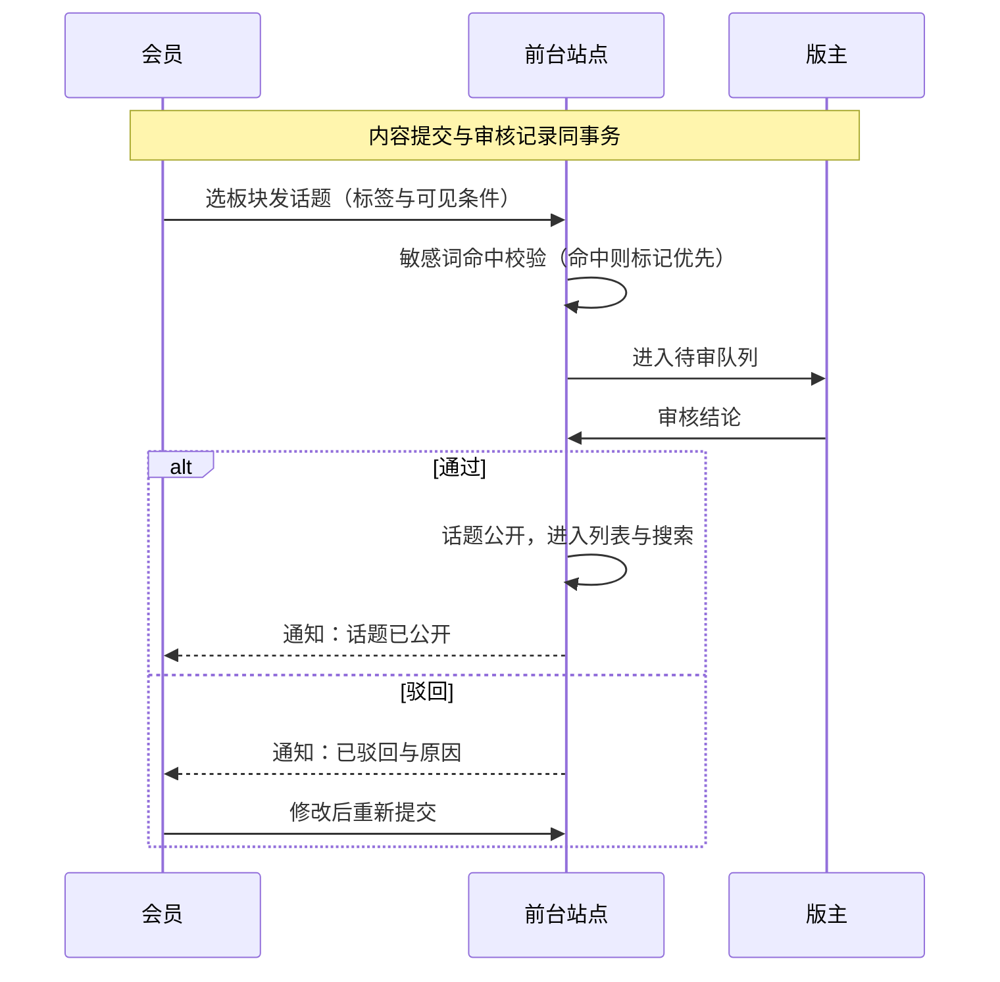
```mermaid
sequenceDiagram
    participant 会员
    participant 前台站点
    participant 版主
    Note over 会员,版主: 内容提交与审核记录同事务
    会员->>前台站点: 选板块发话题（标签与可见条件）
    前台站点->>前台站点: 敏感词命中校验（命中则标记优先）
    前台站点->>版主: 进入待审队列
    版主->>前台站点: 审核结论
    alt 通过
        前台站点->>前台站点: 话题公开，进入列表与搜索
        前台站点-->>会员: 通知：话题已公开
    else 驳回
        前台站点-->>会员: 通知：已驳回与原因
        会员->>前台站点: 修改后重新提交
    end
```

操作步骤清单：1. 会员登录并进入板块；2. 填写标题与正文、选用标签、可设可见条件后提交；3. 话题进入待审（命中敏感词被标记优先）；4. 版主在待审队列执行通过或驳回；5. 通过则话题公开可被浏览与搜索，驳回则会员按通知中的原因修改重提。

### 3.2 旅程二：会员在公开话题下评论与互动（跨主体：会员、其他会员与版主）

话题公开后，其他会员查看详情并发表评论（同样先审后发），评论公开后话题作者收到提醒；会员对话题与评论点赞、对话题收藏，互动即时反馈。

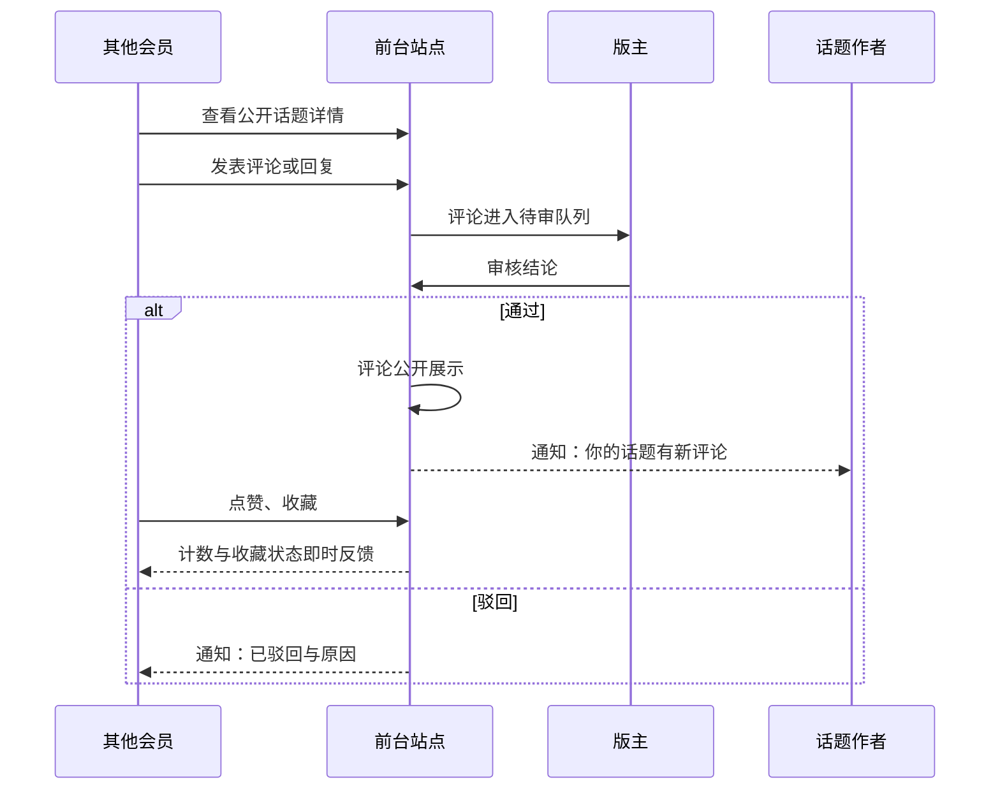
```mermaid
sequenceDiagram
    participant 其他会员
    participant 前台站点
    participant 版主
    participant 话题作者
    其他会员->>前台站点: 查看公开话题详情
    其他会员->>前台站点: 发表评论或回复
    前台站点->>版主: 评论进入待审队列
    版主->>前台站点: 审核结论
    alt 通过
        前台站点->>前台站点: 评论公开展示
        前台站点-->>话题作者: 通知：你的话题有新评论
        其他会员->>前台站点: 点赞、收藏
        前台站点-->>其他会员: 计数与收藏状态即时反馈
    else 驳回
        前台站点-->>其他会员: 通知：已驳回与原因
    end
```

操作步骤清单：1. 会员进入公开话题详情并查看评论；2. 发表评论或回复；3. 版主审核；4. 通过后评论公开并通知话题作者；5. 会员对话题与评论点赞、对话题收藏。

### 3.3 旅程三：驳回后修改重提（会员·单端）

被驳回话题的作者在前台我的内容入口看到已驳回状态与驳回原因，修改内容或调整可见条件后重新提交，话题回到待审核并生成新的审核记录；重复此循环直至通过或放弃（作者删除）。

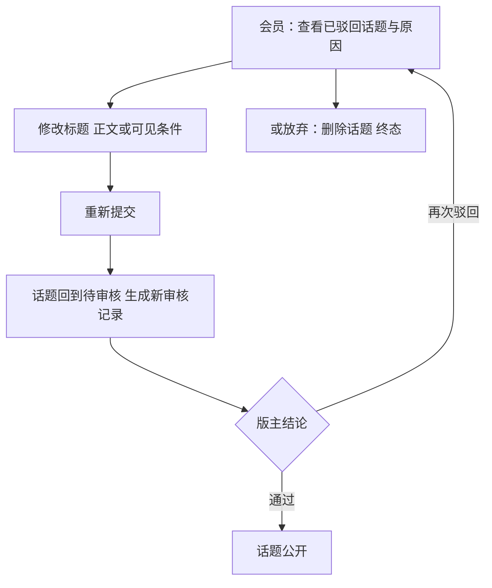
```mermaid
flowchart TD
    A[会员：查看已驳回话题与原因] --> B[修改标题 正文或可见条件]
    B --> C[重新提交]
    C --> D[话题回到待审核 生成新审核记录]
    D --> E{版主结论}
    E -->|通过| F[话题公开]
    E -->|再次驳回| A
    A --> G[或放弃：删除话题 终态]
```

操作步骤清单：1. 在我的内容入口定位已驳回话题；2. 查看驳回原因；3. 修改后重新提交；4. 等待新结论；5. 需要时删除放弃。

### 3.4 旅程四：访客浏览与搜索（访客·单端）

访客打开站点首页看到启用板块，进入板块浏览已公开话题列表，点击进入详情阅读正文与评论，或用关键词搜索并按标签缩小范围；未注册访客尝试参与时被引导注册。

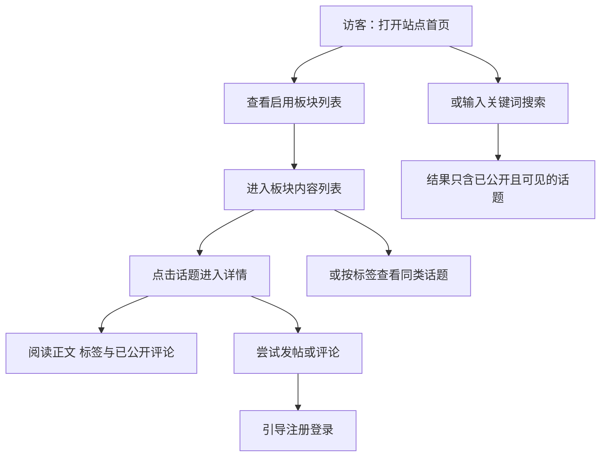
```mermaid
flowchart TD
    A[访客：打开站点首页] --> B[查看启用板块列表]
    B --> C[进入板块内容列表]
    C --> D[点击话题进入详情]
    D --> E[阅读正文 标签与已公开评论]
    C --> F[或按标签查看同类话题]
    A --> G[或输入关键词搜索]
    G --> H[结果只含已公开且可见的话题]
    D --> I[尝试发帖或评论]
    I --> J[引导注册登录]
```

操作步骤清单：1. 打开首页浏览板块；2. 进入板块或按标签浏览；3. 点击话题阅读详情与评论；4. 或关键词搜索；5. 参与时被引导注册。

## 4. 功能需求

**功能全景总图**：

```mermaid
flowchart TB
    V[0.2 讨论开站版]
    V --- M2[板块与标签模块] & M3[话题模块] & M7[审核与治理模块] & M5[互动模块] & M6[消息模块] & M1[会员与权限模块]
    M2 --- G1[前台结构入口]
    G1 --- F1[板块列表与导航] & F2[板块内容列表] & F3[标签入口]
    M3 --- G2[话题生命周期] & G3[评论] & G4[浏览与检索]
    G2 --- F4[发表话题 ◆] & F5[编辑话题] & F6[重新提交] & F7[删除话题 ◆] & F8[可见权限设置]
    G3 --- F9[发表评论与回复 ◆] & F10[删除评论] & F11[查看评论]
    G4 --- F12[话题列表与详情] & F13[话题搜索] & F14[可见判定]
    M7 --- G5[审核] & G6[敏感词]
    G5 --- F15[待审队列查看] & F16[审核通过 ◆] & F17[审核驳回 ◆]
    G6 --- F18[词条新增与编辑] & F19[词条删除] & F20[命中校验 ◆]
    M6 --- G7[通知提醒]
    G7 --- F21[写入通知提醒 ◆] & F22[查看通知提醒]
    M5 --- G8[点赞] & G9[收藏]
    G8 --- F23[点赞] & F24[取消点赞] & F25[点赞计数]
    G9 --- F26[收藏] & F27[取消收藏]
    M1 --- G10[会员账号状态处置]
    G10 --- F28[禁言] & F29[解除禁言] & F30[封号]
    classDef complex fill:#e7f1ff,stroke:#3b7ddd;
    class F4,F7,F9,F16,F17,F20,F21 complex;
```

### 4.1 板块与标签模块

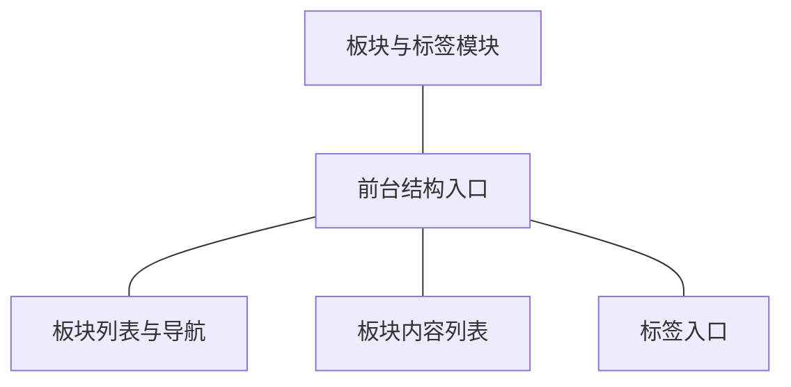
```mermaid
flowchart TB
    M2[板块与标签模块]
    M2 --- G1[前台结构入口]
    G1 --- F1[板块列表与导航] & F2[板块内容列表] & F3[标签入口]
```

**前台结构入口**：0.1 建立的板块与标签结构自此获得前台消费入口（沿用 0.1 结构数据）。

| 功能 | 用途 | 验收标准 |
|---|---|---|
| 板块列表与导航 | 访客与会员按板块浏览内容 | 前台首页展示启用状态板块的名称与说明，点击进入该板块内容列表；停用板块不出现在前台 |
| 板块内容列表 | 展示板块内已公开话题 | 板块内容列表按发布时间展示已公开话题的标题、作者、评论数、点赞数与标签，待审核与已驳回话题不出现 |
| 标签入口 | 按标签查看同类话题 | 点击标签展示标注该标签的已公开话题列表，标签使用计数随标注关系累计 |

### 4.2 话题模块

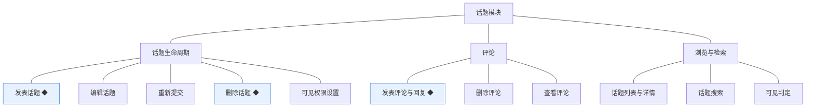
```mermaid
flowchart TB
    M3[话题模块]
    M3 --- G2[话题生命周期] & G3[评论] & G4[浏览与检索]
    G2 --- F4[发表话题 ◆] & F5[编辑话题] & F6[重新提交] & F7[删除话题 ◆] & F8[可见权限设置]
    G3 --- F9[发表评论与回复 ◆] & F10[删除评论] & F11[查看评论]
    G4 --- F12[话题列表与详情] & F13[话题搜索] & F14[可见判定]
    classDef complex fill:#e7f1ff,stroke:#3b7ddd;
    class F4,F7,F9 complex;
```

**话题生命周期**：先审后发贯穿发表、编辑与重提；删除为终态。

| 功能 | 用途 | 验收标准 |
|---|---|---|
| 发表话题 ◆ | 会员在板块内发表话题进入审核 | 会员在板块内选用标签、填写标题与正文（可设可见条件）提交后，话题进入待审核并出现在版主待审队列，命中敏感词时被标记优先，结论前对访客与其他会员不可见 |
| 编辑话题 | 会员修改自己的话题 | 会员编辑待审核或已驳回话题保存后重新进入待审核；编辑已公开话题同样重新进入待审核，审核期间原文保留可见并标注审核中 |
| 重新提交 | 被驳回话题修改后再提交 | 会员查看驳回原因修改后再次提交，话题回到待审核并生成新的审核记录 |
| 删除话题 ◆ | 会员删除自己的话题 | 会员删除自己的话题后话题及其评论不再可见且不可恢复（已删除终态）；治理侧删除路径随 0.6 交付 |
| 可见权限设置 | 会员限定话题可见范围 | 会员设置回复可见条件后，未回复的访问者只见条件提示不见正文，回复公开后自动可见；等级与积分条件可设置但判定随 0.3 成长模块接入生效（先行基座） |
| 话题列表与详情 | 浏览板块内话题与详情 | 访客与会员在板块内容列表进入话题详情，可见正文、标签与已公开评论 |
| 话题搜索 | 按关键词检索话题 | 关键词搜索只返回已公开且对当前身份可见的话题，待审核与已驳回话题不出现在结果中 |
| 可见判定 | 判定当前身份能否查看内容 | 不满足可见条件的访问者看到条件提示（如回复后可见）而不展示正文，判定对列表、详情与搜索一致生效 |

**评论**：依附于已公开话题，同样先审后发。

| 功能 | 用途 | 验收标准 |
|---|---|---|
| 发表评论与回复 ◆ | 会员在公开话题下评论与回复 | 会员对已公开话题提交评论或对评论回复后进入待审核，通过后公开并通知话题作者；被禁言或封号的账号提交被拒绝并提示 |
| 删除评论 | 会员删除自己的评论 | 会员删除自己的评论后该评论不再可见（终态）；治理侧删除随 0.6 交付 |
| 查看评论 | 按话题查看评论列表 | 话题详情页按时间展示已公开评论与回复层级，待审核与已驳回评论不展示 |

**浏览与检索**：见上表后三行（话题列表与详情、话题搜索、可见判定归本模块浏览与检索组）。

### 4.3 审核与治理模块

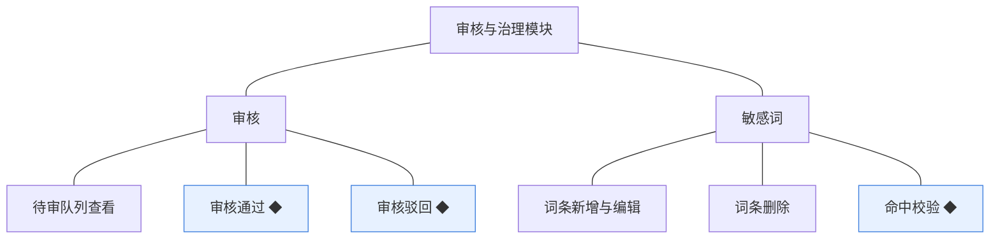
```mermaid
flowchart TB
    M7[审核与治理模块]
    M7 --- G5[审核] & G6[敏感词]
    G5 --- F15[待审队列查看] & F16[审核通过 ◆] & F17[审核驳回 ◆]
    G6 --- F18[词条新增与编辑] & F19[词条删除] & F20[命中校验 ◆]
    classDef complex fill:#e7f1ff,stroke:#3b7ddd;
    class F16,F17,F20 complex;
```

**审核**：本版消费 0.1.1 配置的审核策略（先审后发适用范围），结论与留痕、通知同事务。

| 功能 | 用途 | 验收标准 |
|---|---|---|
| 待审队列查看 | 版主查看与处理待审内容 | 版主进入待审队列按内容类型与时间查看待审话题与评论，命中敏感词的条目置顶并带命中标记 |
| 审核通过 ◆ | 版主通过待审内容 | 版主执行通过后内容立即公开并进入板块列表与搜索，审核记录与通知作者在同一事务完成 |
| 审核驳回 ◆ | 版主驳回待审内容 | 版主填写驳回原因执行驳回后，内容对作者显示已驳回与原因并通知作者，作者可修改后重新提交 |

**敏感词**：命中只作线索，不自动驳回。

| 功能 | 用途 | 验收标准 |
|---|---|---|
| 词条新增与编辑 | 站长维护拦截词表 | 站长新增或编辑词条保存后立即生效于后续提交内容的命中校验，变更留痕 |
| 词条删除 | 站长移除词条 | 站长删除词条后该词不再参与命中校验，删除留痕 |
| 命中校验 ◆ | 提交内容时匹配词表 | 会员提交话题或评论时对标题与正文匹配词表，命中的待审条目在队列中标记优先，未命中按常规进入队列，命中不自动驳回 |

### 4.4 消息模块

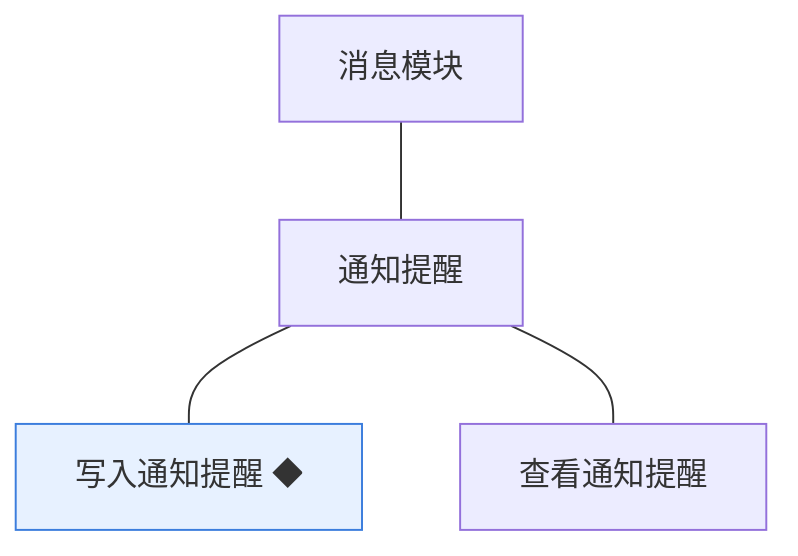
```mermaid
flowchart TB
    M6[消息模块]
    M6 --- G7[通知提醒]
    G7 --- F21[写入通知提醒 ◆] & F22[查看通知提醒]
    classDef complex fill:#e7f1ff,stroke:#3b7ddd;
    class F21 complex;
```

**通知提醒**：审核结论与评论公开事件驱动，同事务写入；标记已读与清理随 0.4。

| 功能 | 用途 | 验收标准 |
|---|---|---|
| 写入通知提醒 ◆ | 业务事件触发的结果送达 | 审核结论与评论公开事件发生时，通知在同一事务写入接收人通知列表，业务事务失败时通知不残留 |
| 查看通知提醒 | 会员查看通知列表 | 会员在前台通知入口查看通知列表并可进入对应内容，标记已读与清理随 0.4 交付 |

### 4.5 互动模块

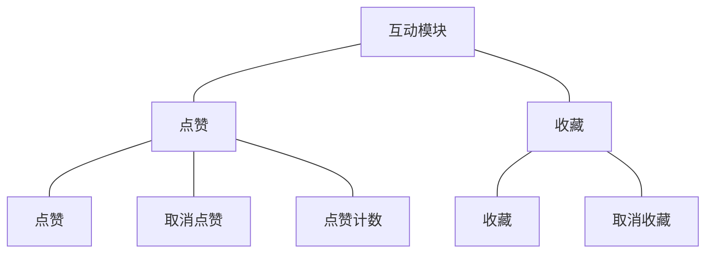
```mermaid
flowchart TB
    M5[互动模块]
    M5 --- G8[点赞] & G9[收藏]
    G8 --- F23[点赞] & F24[取消点赞] & F25[点赞计数]
    G9 --- F26[收藏] & F27[取消收藏]
```

**点赞与收藏**：仅作用于已公开内容；收藏列表界面随 0.5。

| 功能 | 用途 | 验收标准 |
|---|---|---|
| 点赞 | 会员对已公开内容点赞 | 会员对话题或评论点赞成功后点赞计数加一，同一会员重复点赞不产生重复记录 |
| 取消点赞 | 撤销点赞 | 会员取消点赞后计数即时减一，再次点赞可重新生效 |
| 点赞计数 | 展示赞同数 | 已公开话题与评论展示当前点赞数，与点赞关系记录一致 |
| 收藏 | 收藏已公开话题 | 会员收藏话题成功后收藏关系建立，重复收藏幂等提示已收藏；收藏列表界面随 0.5 交付 |
| 取消收藏 | 取消收藏关系 | 会员取消收藏后该话题不再保留收藏关系 |

### 4.6 会员与权限模块

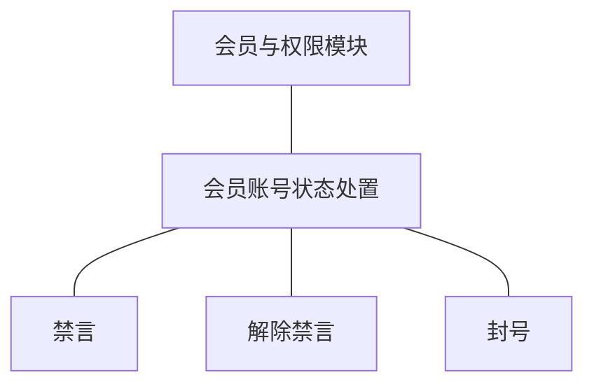
```mermaid
flowchart TB
    M1[会员与权限模块]
    M1 --- G10[会员账号状态处置]
    G10 --- F28[禁言] & F29[解除禁言] & F30[封号]
```

**会员账号状态处置**：会员账号自本版起具备禁言与封号路径（沿用 0.1 会员账号对象，新增状态流转）；期限口径本版定案。

| 功能 | 用途 | 验收标准 |
|---|---|---|
| 禁言 | 版主对违规会员禁言 | 版主选择会员与禁言期限（1／3／7／30 天，默认 7 天，本版定案·行业惯例默认）执行后，该会员不能发表话题与评论，处置留痕并通知当事人 |
| 解除禁言 | 提前解除禁言 | 版主解除禁言后该会员立即恢复发言，期限届满自动解除无需人工操作，解除留痕 |
| 封号 | 版主对严重违规会员封号 | 版主执行封号后该会员登录被拒绝并失去全部发言能力（终态），处置留痕并通知当事人 |

## 5. 业务对象

**对象关系总览**：本版新上线话题、评论、审核记录、敏感词、通知提醒、点赞、收藏七个对象，会员账号、板块、标签、全站设置四个沿用对象接入新路径；话题与评论的公开以审核结论为准（D3）。

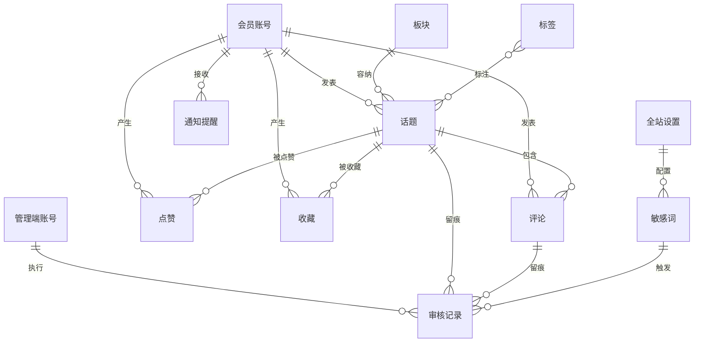
```mermaid
erDiagram
    "会员账号" ||--o{ "话题" : "发表"
    "会员账号" ||--o{ "评论" : "发表"
    "会员账号" ||--o{ "点赞" : "产生"
    "会员账号" ||--o{ "收藏" : "产生"
    "会员账号" ||--o{ "通知提醒" : "接收"
    "管理端账号" ||--o{ "审核记录" : "执行"
    "板块" ||--o{ "话题" : "容纳"
    "标签" }o--o{ "话题" : "标注"
    "话题" ||--o{ "评论" : "包含"
    "话题" ||--o{ "审核记录" : "留痕"
    "话题" ||--o{ "点赞" : "被点赞"
    "话题" ||--o{ "收藏" : "被收藏"
    "评论" ||--o{ "审核记录" : "留痕"
    "敏感词" ||--o{ "审核记录" : "触发"
    "全站设置" ||--o{ "敏感词" : "配置"
```

### 5.1 话题

定位：论坛讨论的主帖，讨论闭环的载体（术语表）。

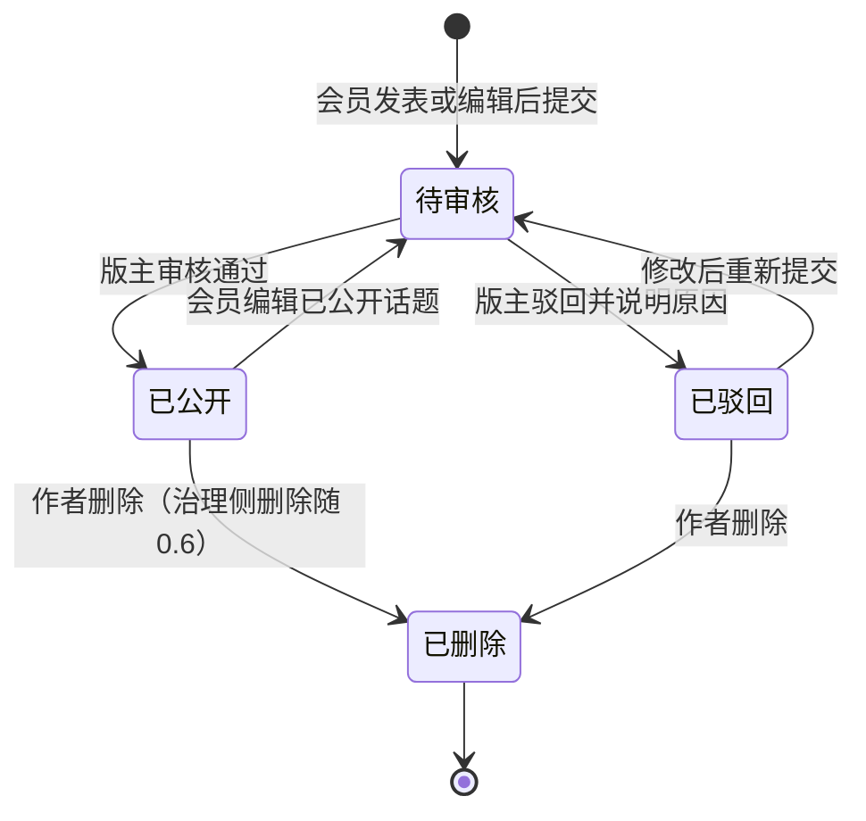
```mermaid
stateDiagram-v2
    [*] --> 待审核: 会员发表或编辑后提交
    待审核 --> 已公开: 版主审核通过
    待审核 --> 已驳回: 版主驳回并说明原因
    已驳回 --> 待审核: 修改后重新提交
    已公开 --> 待审核: 会员编辑已公开话题
    已公开 --> 已删除: 作者删除（治理侧删除随 0.6）
    已驳回 --> 已删除: 作者删除
    已删除 --> [*]
```

说明：本版状态机全量落地（沿用项目 PRD 骨架）；已公开话题编辑后按原文保留可见并标注审核中；可见条件中等级与积分判定随 0.3 接入（先行基座）；被删除话题的点赞与收藏关系一并失效。

### 5.2 评论

定位：话题下的互动回复（术语表）。

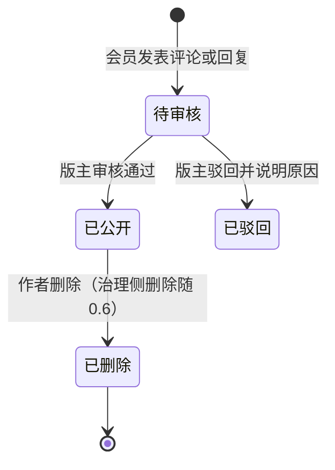
```mermaid
stateDiagram-v2
    [*] --> 待审核: 会员发表评论或回复
    待审核 --> 已公开: 版主审核通过
    待审核 --> 已驳回: 版主驳回并说明原因
    已公开 --> 已删除: 作者删除（治理侧删除随 0.6）
    已删除 --> [*]
```

说明：依附于话题，话题不可见时评论一并不可见；评论不设独立可见条件；回复可见条件的话题在评论公开后向评论者展示正文。

### 5.3 审核记录

定位：先审后发的留痕（术语表）。

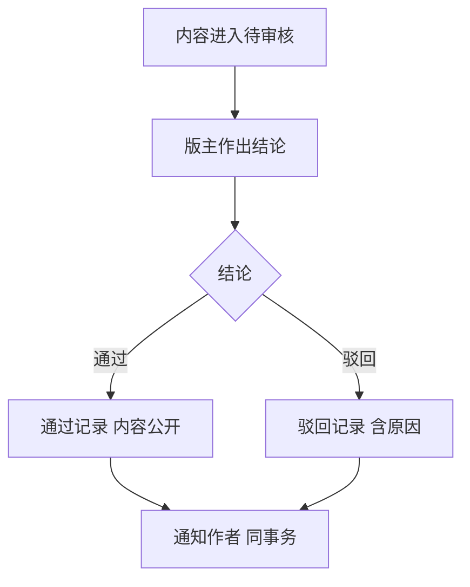
```mermaid
flowchart TD
    A[内容进入待审核] --> B[版主作出结论]
    B --> C{结论}
    C -->|通过| D[通过记录 内容公开]
    C -->|驳回| E[驳回记录 含原因]
    D --> F[通知作者 同事务]
    E --> F
```

说明：只增不改；与内容状态变更、通知同事务；敏感词命中作为线索记入待审条目标记。

### 5.4 敏感词

定位：内容审核的拦截词表（术语表）。

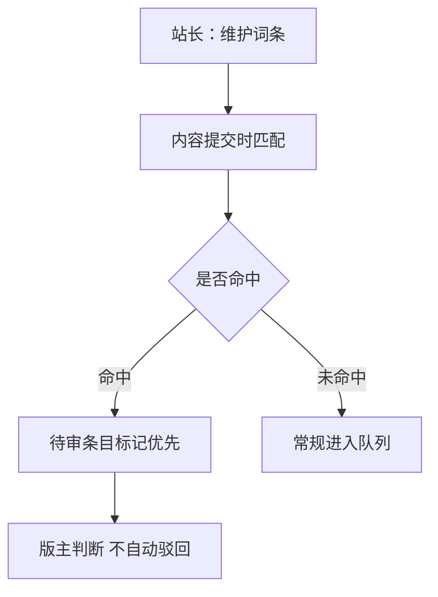
```mermaid
flowchart TD
    A[站长：维护词条] --> B[内容提交时匹配]
    B --> C{是否命中}
    C -->|命中| D[待审条目标记优先]
    C -->|未命中| E[常规进入队列]
    D --> F[版主判断 不自动驳回]
```

说明：配置型对象；词条变更即时生效于后续提交，词表从全站设置读取（0.1.1 配置入口沿用）。

### 5.5 会员账号（沿用 0.1，本版新增路径）

定位：社区成员的身份（术语表）。

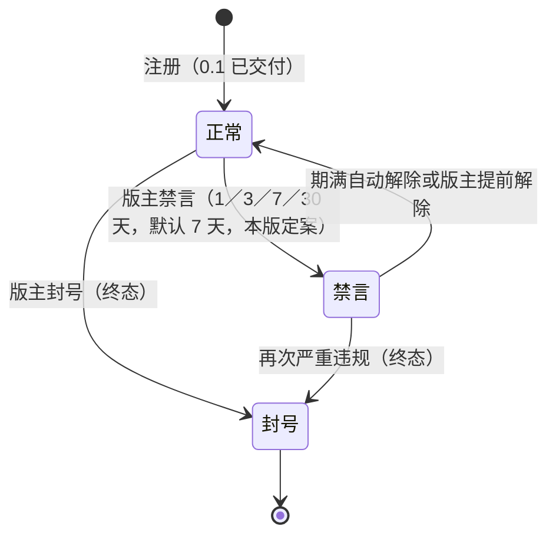
```mermaid
stateDiagram-v2
    [*] --> 正常: 注册（0.1 已交付）
    正常 --> 禁言: 版主禁言（1／3／7／30 天，默认 7 天，本版定案）
    禁言 --> 正常: 期满自动解除或版主提前解除
    正常 --> 封号: 版主封号（终态）
    禁言 --> 封号: 再次严重违规（终态）
    封号 --> [*]
```

说明：沿用 0.1 会员账号对象，本版新增禁言与封号流转；禁言期限口径本版定案（行业惯例默认，可随评审调整）；禁言覆盖发表话题、评论与后续私信等发言类行为（D7 口径）。

### 5.6 通知提醒（沿用项目骨架，本版首版落地）

定位：互动、审核与结算结果的送达消息（术语表；结算类事件随 0.3 起）。

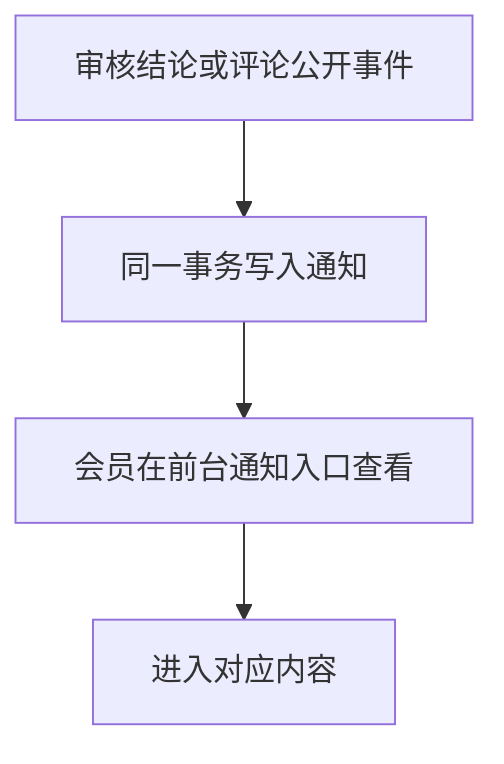
```mermaid
flowchart TD
    A[审核结论或评论公开事件] --> B[同一事务写入通知]
    B --> C[会员在前台通知入口查看]
    C --> D[进入对应内容]
```

说明：本版覆盖审核结论与评论公开两类事件；标记已读与清理随 0.4；写入失败与业务同回滚。

### 5.7 点赞

定位：会员对内容的单次赞同标记（术语表）。

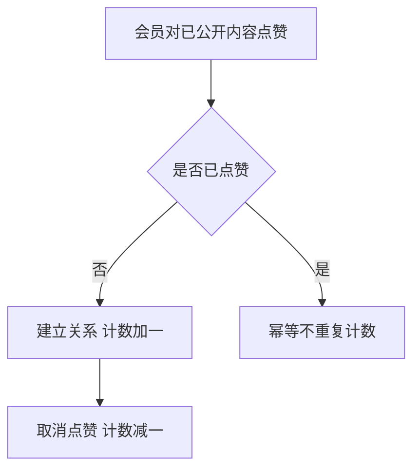
```mermaid
flowchart TD
    A[会员对已公开内容点赞] --> B{是否已点赞}
    B -->|否| C[建立关系 计数加一]
    B -->|是| D[幂等不重复计数]
    C --> E[取消点赞 计数减一]
```

说明：唯一约束保证幂等；计数为冗余值可由关系重算；仅作用于已公开内容。

### 5.8 收藏

定位：会员把内容归入个人收藏夹的标记（术语表）。

```mermaid
flowchart TD
    A[会员收藏已公开话题] --> B{是否已收藏}
    B -->|否| C[建立收藏关系]
    B -->|是| D[幂等提示已收藏]
    C --> E[取消收藏 移除关系]
```

说明：收藏列表界面随 0.5；本版仅作用于已公开话题。

### 5.9 板块（沿用 0.1，本版新增消费路径）

定位：内容的一级去处，容纳话题与问题（术语表）。

```mermaid
flowchart TD
    A[前台首页读取启用板块] --> B[板块列表与导航展示]
    B --> C[会员进入板块发表话题 建立容纳关系]
    C --> D{板块是否停用}
    D -->|停用| E[前台不展示 提交拦截生效]
    D -->|启用| F[正常展示与接收]
```

说明：沿用 0.1 板块对象，本版新增前台导航消费与话题容纳关系；0.1 交付的停用拦截（不接收新内容）自本版起正式接入生效（沿用来源：0.1，先行基座回验）。

### 5.10 标签（沿用 0.1，本版新增消费路径）

定位：话题的横向归类标记（术语表）。

```mermaid
flowchart TD
    A[会员发帖选用标签] --> B[标注关系建立]
    B --> C[使用计数随标注派生]
    C --> D[前台标签入口展示同类话题]
    D --> E[取消标注 计数回减]
```

说明：沿用 0.1 标签对象，本版新增话题标注消费与使用计数派生——0.1 交付的删除判定（使用次数为零）自此有真实取值（沿用来源：0.1，先行基座回验）。

### 5.11 全站设置（沿用 0.1，本版新增消费路径）

定位：站点级参数与开关的集中存放处（术语表）。

```mermaid
flowchart TD
    A[内容提交与审核读取审核策略] --> B{适用范围是否含该内容类型}
    B -->|含| C[先审后发 进入待审队列]
    B -->|不含| D[按策略直接公开 不进待审队列]
    A --> E[前台展示读取站点信息]
```

说明：沿用 0.1 全站设置对象，本版消费其审核策略配置（audit_scope，配置入口沿用 v0.1.1）与站点信息展示；默认适用范围为全部内容类型（D3 推导，站长可按版调整）（沿用来源：0.1，先行基座回验）。
