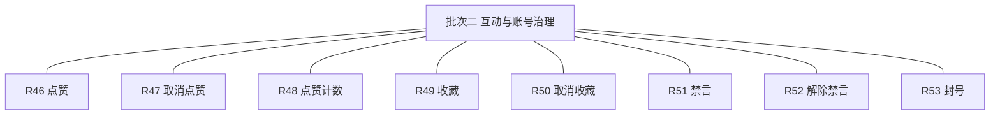

# 开发顺序与需求拆解（大版本）：0.2 讨论开站版

> 定位：把大版本 PRD 转换为开发批次顺序＋功能级需求条目，本文即 0.2 讨论开站版的完整需求清单（不另生成版本快照），需求池据此直接入池；上游为模拟案例材料，模拟性质予以保留。

## 1. 拆解说明

- **做什么**：把《PRD（大版本）0.2 讨论开站版》的 30 项功能按依赖排成 2 个可独立验收的开发批次，每项功能转为一条可直接认领与验收的需求条目（R24～R53，编号承接 0.1 的 R1～R23）。
- **一一同构口径**：一条需求＝一项 PRD 功能，需求名即 PRD 功能名（含 ◆ 标注），用途与验收标准逐字引自 PRD 功能清单、不压缩不改写；按钮、字段与跳转级的原子拆解归小版本开发，不进本文。
- **与需求池及小版本规划的关系**：本文是需求池的批量入池主入口但不是唯一入口——会议、沟通、临时反馈产生的需求可不经本文直接单条入池（M 编号）；小版本规划的输入＝本文开发顺序＋需求池实时状态两者合并，批次划分是建议而非锁定，实际认领以需求池为准。

## 2. 开发顺序

**前置版本沿用面**：0.1 基座版全部已发布——沿用统一鉴权与能力点判定、操作留痕、板块与标签结构、站点设置与审核策略配置（三处先行基座在本版接入消费：停用板块拦截、标签标注派生、审核策略读取）。

**开发批次总图**：

```mermaid
flowchart TB
    V[0.2 讨论开站版]
    V --- B1[批次一 讨论闭环] & B2[批次二 互动与账号治理]
    B1 --- N24[R24 板块列表与导航] & N25[R25 板块内容列表] & N26[R26 标签入口] & N27[R27 发表话题 ◆] & N28[R28 编辑话题] & N29[R29 重新提交] & N30[R30 删除话题 ◆] & N31[R31 可见权限设置] & N32[R32 话题列表与详情] & N33[R33 话题搜索] & N34[R34 可见判定] & N35[R35 发表评论与回复 ◆] & N36[R36 删除评论] & N37[R37 查看评论] & N38[R38 待审队列查看] & N39[R39 审核通过 ◆] & N40[R40 审核驳回 ◆] & N41[R41 词条新增与编辑] & N42[R42 词条删除] & N43[R43 命中校验 ◆] & N44[R44 写入通知提醒 ◆] & N45[R45 查看通知提醒]
    B2 --- N46[R46 点赞] & N47[R47 取消点赞] & N48[R48 点赞计数] & N49[R49 收藏] & N50[R50 取消收藏] & N51[R51 禁言] & N52[R52 解除禁言] & N53[R53 封号]
    classDef complex fill:#e7f1ff,stroke:#3b7ddd;
    class N27,N30,N35,N39,N40,N43,N44 complex;
```

**批次推进链**：

**顺序依据与同事务契约**：先审后发要求内容生产与审核能力同批就绪（提交即入队、结论即公开，缺一不可演示）——话题、评论、审核队列与结论、敏感词命中、通知写入强制同批；本版内需要共同成立的契约：内容提交与审核记录同事务（04C-话题模块 3.6、04C-审核与治理模块 3.6）、审核结论与内容状态回写／审核记录／通知同事务（04C-审核与治理模块 3.6）、删除话题与互动关系清理同事务（04C-话题模块 3.6）；无外部联调点（域名备案收口属发布环节）。

### 2.1 批次一：讨论闭环

```mermaid
flowchart TB
    B1[批次一 讨论闭环]
    B1 --- N24[R24 板块列表与导航] & N25[R25 板块内容列表] & N26[R26 标签入口] & N27[R27 发表话题 ◆] & N28[R28 编辑话题] & N29[R29 重新提交] & N30[R30 删除话题 ◆] & N31[R31 可见权限设置] & N32[R32 话题列表与详情] & N33[R33 话题搜索] & N34[R34 可见判定] & N35[R35 发表评论与回复 ◆] & N36[R36 删除评论] & N37[R37 查看评论] & N38[R38 待审队列查看] & N39[R39 审核通过 ◆] & N40[R40 审核驳回 ◆] & N41[R41 词条新增与编辑] & N42[R42 词条删除] & N43[R43 命中校验 ◆] & N44[R44 写入通知提醒 ◆] & N45[R45 查看通知提醒]
    classDef complex fill:#e7f1ff,stroke:#3b7ddd;
    class N27,N30,N35,N39,N40,N43,N44 complex;
```

- **目标**：讨论闭环全量可演示——前台浏览与搜索、发帖与评论、先审后发、敏感词线索、结果通知。
- **依赖**：前置版本 0.1（登录鉴权、板块与标签结构、审核策略配置）；批内顺序——前台结构入口与话题生命周期先行，审核与敏感词、通知同批联调（同事务契约强制，不可拆批）。
- **可验收形态**：可演示路线图完成标志路径——一名访客完成「注册 → 浏览板块 → 发表话题 → 审核通过公开 → 被其他会员评论」，全程通知送达、待审核与已驳回内容零泄漏。
- 判断注记：评论必须同批（完成标志路径含「被其他会员评论」，先审后发不允许评论晚于话题公开单独成批）；敏感词与命中校验同批（命中标记发生在提交环节）；22 条虽多但为依赖强制的最小闭环，不再细拆（能合并演示的不拆批）。

条目与 PRD 4.1～4.4 功能清单一一同构，用途与验收标准逐字引自原文：

| 编号 | 需求名 | 用途 | 验收标准 |
|---|---|---|---|
| R24 | 板块列表与导航 | 访客与会员按板块浏览内容 | 前台首页展示启用状态板块的名称与说明，点击进入该板块内容列表；停用板块不出现在前台 |
| R25 | 板块内容列表 | 展示板块内已公开话题 | 板块内容列表按发布时间展示已公开话题的标题、作者、评论数、点赞数与标签，待审核与已驳回话题不出现 |
| R26 | 标签入口 | 按标签查看同类话题 | 点击标签展示标注该标签的已公开话题列表，标签使用计数随标注关系累计 |
| R27 | 发表话题 ◆ | 会员在板块内发表话题进入审核 | 会员在板块内选用标签、填写标题与正文（可设可见条件）提交后，话题进入待审核并出现在版主待审队列，命中敏感词时被标记优先，结论前对访客与其他会员不可见 |
| R28 | 编辑话题 | 会员修改自己的话题 | 会员编辑待审核或已驳回话题保存后重新进入待审核；编辑已公开话题同样重新进入待审核，审核期间原文保留可见并标注审核中 |
| R29 | 重新提交 | 被驳回话题修改后再提交 | 会员查看驳回原因修改后再次提交，话题回到待审核并生成新的审核记录 |
| R30 | 删除话题 ◆ | 会员删除自己的话题 | 会员删除自己的话题后话题及其评论不再可见且不可恢复（已删除终态）；治理侧删除路径随 0.6 交付 |
| R31 | 可见权限设置 | 会员限定话题可见范围 | 会员设置回复可见条件后，未回复的访问者只见条件提示不见正文，回复公开后自动可见；等级与积分条件可设置但判定随 0.3 成长模块接入生效（先行基座） |
| R32 | 话题列表与详情 | 浏览板块内话题与详情 | 访客与会员在板块内容列表进入话题详情，可见正文、标签与已公开评论 |
| R33 | 话题搜索 | 按关键词检索话题 | 关键词搜索只返回已公开且对当前身份可见的话题，待审核与已驳回话题不出现在结果中 |
| R34 | 可见判定 | 判定当前身份能否查看内容 | 不满足可见条件的访问者看到条件提示（如回复后可见）而不展示正文，判定对列表、详情与搜索一致生效 |
| R35 | 发表评论与回复 ◆ | 会员在公开话题下评论与回复 | 会员对已公开话题提交评论或对评论回复后进入待审核，通过后公开并通知话题作者；被禁言或封号的账号提交被拒绝并提示 |
| R36 | 删除评论 | 会员删除自己的评论 | 会员删除自己的评论后该评论不再可见（终态）；治理侧删除随 0.6 交付 |
| R37 | 查看评论 | 按话题查看评论列表 | 话题详情页按时间展示已公开评论与回复层级，待审核与已驳回评论不展示 |
| R38 | 待审队列查看 | 版主查看与处理待审内容 | 版主进入待审队列按内容类型与时间查看待审话题与评论，命中敏感词的条目置顶并带命中标记 |
| R39 | 审核通过 ◆ | 版主通过待审内容 | 版主执行通过后内容立即公开并进入板块列表与搜索，审核记录与通知作者在同一事务完成 |
| R40 | 审核驳回 ◆ | 版主驳回待审内容 | 版主填写驳回原因执行驳回后，内容对作者显示已驳回与原因并通知作者，作者可修改后重新提交 |
| R41 | 词条新增与编辑 | 站长维护拦截词表 | 站长新增或编辑词条保存后立即生效于后续提交内容的命中校验，变更留痕 |
| R42 | 词条删除 | 站长移除词条 | 站长删除词条后该词不再参与命中校验，删除留痕 |
| R43 | 命中校验 ◆ | 提交内容时匹配词表 | 会员提交话题或评论时对标题与正文匹配词表，命中的待审条目在队列中标记优先，未命中按常规进入队列，命中不自动驳回 |
| R44 | 写入通知提醒 ◆ | 业务事件触发的结果送达 | 审核结论与评论公开事件发生时，通知在同一事务写入接收人通知列表，业务事务失败时通知不残留 |
| R45 | 查看通知提醒 | 会员查看通知列表 | 会员在前台通知入口查看通知列表并可进入对应内容，标记已读与清理随 0.4 交付 |

### 2.2 批次二：互动与账号治理

- **目标**：公开内容可互动（点赞与收藏）、违规账号可处置（禁言／解除禁言／封号）。
- **依赖**：批次一（互动仅作用于已公开内容；账号处置针对内容场景中的违规会员；禁言拦截对接批次一的发表校验）。
- **可验收形态**：可演示——会员对话题与评论点赞、取消与计数即时变化，收藏与取消生效；版主对违规会员禁言后其发言被拒、期满或提前解除恢复、封号后登录被拒。
- 判断注记：互动与账号处置合并一批——两者都只依赖批次一的公开内容与发表校验，各自独立可演示但无相互依赖，合并符合批次从简（不逐功能拆批）。

条目与 PRD 4.5、4.6 功能清单一一同构，用途与验收标准逐字引自原文：

| 编号 | 需求名 | 用途 | 验收标准 |
|---|---|---|---|
| R46 | 点赞 | 会员对已公开内容点赞 | 会员对话题或评论点赞成功后点赞计数加一，同一会员重复点赞不产生重复记录 |
| R47 | 取消点赞 | 撤销点赞 | 会员取消点赞后计数即时减一，再次点赞可重新生效 |
| R48 | 点赞计数 | 展示赞同数 | 已公开话题与评论展示当前点赞数，与点赞关系记录一致 |
| R49 | 收藏 | 收藏已公开话题 | 会员收藏话题成功后收藏关系建立，重复收藏幂等提示已收藏；收藏列表界面随 0.5 交付 |
| R50 | 取消收藏 | 取消收藏关系 | 会员取消收藏后该话题不再保留收藏关系 |
| R51 | 禁言 | 版主对违规会员禁言 | 版主选择会员与禁言期限（1／3／7／30 天，默认 7 天，本版定案·行业惯例默认）执行后，该会员不能发表话题与评论，处置留痕并通知当事人 |
| R52 | 解除禁言 | 提前解除禁言 | 版主解除禁言后该会员立即恢复发言，期限届满自动解除无需人工操作，解除留痕 |
| R53 | 封号 | 版主对严重违规会员封号 | 版主执行封号后该会员登录被拒绝并失去全部发言能力（终态），处置留痕并通知当事人 |

**批次判断与边界取舍**：只拆两批——批次一内部为同事务契约与完成标志路径强制（内容＋审核＋评论＋通知不可分割），批次二对批次一的公开内容是硬依赖；无路径分批交付的条目，30 条均整条交付。

**版本级验收安排**：按 PRD 量化口径执行（开站路径 100%、先审后发零泄漏、经营验证口径立项时定值）；灰度台阶（环境联调 → 内部全流程演练 → 小范围邀请 → 全量开放）属上线安排、不占开发批次，随批次二交付后整体进入。

## 3. 条目与 PRD 对应核对

- **一一同构声明**：条目数 30＝PRD 功能数 30，逐行对应、无归并无拆分；需求名（含 ◆）与 PRD 功能名逐字一致；用途与验收标准逐字引自 PRD 功能清单。
- **批次构成**：批次一 22 条（前台结构入口 3＋话题生命周期与浏览检索 8＋评论 3＋审核 3＋敏感词 3＋通知提醒 2），批次二 8 条（点赞与收藏 5＋会员账号状态处置 3）。
- **◆ 复杂条目清点**：共 7 条，全部在批次一——R27 发表话题、R30 删除话题、R35 发表评论与回复、R39 审核通过、R40 审核驳回、R43 命中校验、R44 写入通知提醒，与 PRD 总图高亮一致。
- **过渡支撑清点**：0 条；范围外事项（举报与治理侧删除、会员与内容查询维护、运营内容、浏览量统计等）按 PRD 范围一句话随后续版本，0.2 内的板块停用拦截、标签计数、审核策略消费为 0.1 先行基座的正式接入而非过渡支撑。

## 4. 与需求池和小版本规划的衔接

- **入池路径**：本文 R24～R53 已按批量入池登记进《需求池》，编号沿用、批次随本文继承。
- **多入口口径**：会议、沟通与临时反馈需求不经本文直接单条入池（M 编号起），两类条目并存互不覆盖。
- **小版本规划输入**：本文开发顺序＋需求池实时状态合并；简单场景直接采纳批次建议，唯一硬约束是本文声明的依赖与同事务契约不回退（批次二不得先于批次一认领开工）。
- **认领与细化原则**：认领时逐字携带本表用途与验收标准，开发级细化（交互、字段、边界）归小版本 PRD，本文不预写。
