# PRD（小版本）：v0.2.0 讨论闭环

> 定位：开发级需求说明书——承接大版本 PRD 0.2 与其 02 批次一，认领自需求池（R24～R45，状态已迁移为已认领（v0.2.0））；用途与验收标准逐字锚定上游、只细化不改写；上游为模拟案例材料，模拟性质予以保留。

## 1. 版本概述

**承接与目标**：认领来源＝0.2 讨论开站版批次一「讨论闭环」（简单场景采纳整批，R24～R45）＋需求池实时状态合并（池内该 22 条均为待规划，无池直入条目混入）。本版可验收形态＝02 批次一可验收形态——可演示路线图完成标志路径：一名访客完成「注册 → 浏览板块 → 发表话题 → 审核通过公开 → 被其他会员评论」，全程通知送达、待审核与已驳回内容零泄漏。量化口径沿用大版本 PRD（开站路径 100%、先审后发零泄漏；经营验证数值口径立项时定值）。

**范围外声明**：R46～R53（点赞与收藏、会员账号状态处置）随批次二（下一小版本）认领；问答与悬赏、积分与等级随 0.3（可见规则的等级与积分判定为先行设置、0.3 接入生效）；标记已读与清理随 0.4；举报与治理侧删除、会员与内容查询维护随 0.6；运营内容与浏览量统计随 0.6／0.7。板块与标签的维护界面已随 v0.1.1 交付，本版仅消费其数据。

**条目内顺序与依赖**（引用上游批内说明）：前台结构入口（R24～R26）与话题生命周期（R27～R31）先行；审核（R38～R40）、敏感词（R41～R43）、通知（R44～R45）同批联调——内容提交与审核记录同事务、审核结论与状态回写／留痕／通知同事务为不可回退契约；评论（R35～R37）依赖话题公开；浏览检索（R32～R34）贯穿收口。

## 2. 需求范围与验收锚

**条目总览树**（与上游批次一分支图同名同构）：

```mermaid
flowchart TB
    B1[批次一 讨论闭环]
    B1 --- N24[R24 板块列表与导航] & N25[R25 板块内容列表] & N26[R26 标签入口] & N27[R27 发表话题 ◆] & N28[R28 编辑话题] & N29[R29 重新提交] & N30[R30 删除话题 ◆] & N31[R31 可见权限设置] & N32[R32 话题列表与详情] & N33[R33 话题搜索] & N34[R34 可见判定] & N35[R35 发表评论与回复 ◆] & N36[R36 删除评论] & N37[R37 查看评论] & N38[R38 待审队列查看] & N39[R39 审核通过 ◆] & N40[R40 审核驳回 ◆] & N41[R41 词条新增与编辑] & N42[R42 词条删除] & N43[R43 命中校验 ◆] & N44[R44 写入通知提醒 ◆] & N45[R45 查看通知提醒]
    classDef complex fill:#e7f1ff,stroke:#3b7ddd;
    class N27,N30,N35,N39,N40,N43,N44 complex;
```

**认领条目表**（需求名、用途、验收标准逐字引自 02 批次一需求表）：

| 编号 | 需求名 | 用途 | 验收标准 |
|---|---|---|---|
| R24 | 板块列表与导航 | 访客与会员按板块浏览内容 | 前台首页展示启用状态板块的名称与说明，点击进入该板块内容列表；停用板块不出现在前台 |
| R25 | 板块内容列表 | 展示板块内已公开话题 | 板块内容列表按发布时间展示已公开话题的标题、作者、评论数、点赞数与标签，待审核与已驳回话题不出现 |
| R26 | 标签入口 | 按标签查看同类话题 | 点击标签展示标注该标签的已公开话题列表，标签使用计数随标注关系累计 |
| R27 | 发表话题 ◆ | 会员在板块内发表话题进入审核 | 会员在板块内选用标签、填写标题与正文（可设可见条件）提交后，话题进入待审核并出现在版主待审队列，命中敏感词时被标记优先，结论前对访客与其他会员不可见 |
| R28 | 编辑话题 | 会员修改自己的话题 | 会员编辑待审核或已驳回话题保存后重新进入待审核；编辑已公开话题同样重新进入待审核，审核期间原文保留可见并标注审核中 |
| R29 | 重新提交 | 被驳回话题修改后再提交 | 会员查看驳回原因修改后再次提交，话题回到待审核并生成新的审核记录 |
| R30 | 删除话题 ◆ | 会员删除自己的话题 | 会员删除自己的话题后话题及其评论不再可见且不可恢复（已删除终态）；治理侧删除路径随 0.6 交付 |
| R31 | 可见权限设置 | 会员限定话题可见范围 | 会员设置回复可见条件后，未回复的访问者只见条件提示不见正文，回复公开后自动可见；等级与积分条件可设置但判定随 0.3 成长模块接入生效（先行基座） |
| R32 | 话题列表与详情 | 浏览板块内话题与详情 | 访客与会员在板块内容列表进入话题详情，可见正文、标签与已公开评论 |
| R33 | 话题搜索 | 按关键词检索话题 | 关键词搜索只返回已公开且对当前身份可见的话题，待审核与已驳回话题不出现在结果中 |
| R34 | 可见判定 | 判定当前身份能否查看内容 | 不满足可见条件的访问者看到条件提示（如回复后可见）而不展示正文，判定对列表、详情与搜索一致生效 |
| R35 | 发表评论与回复 ◆ | 会员在公开话题下评论与回复 | 会员对已公开话题提交评论或对评论回复后进入待审核，通过后公开并通知话题作者；被禁言或封号的账号提交被拒绝并提示 |
| R36 | 删除评论 | 会员删除自己的评论 | 会员删除自己的评论后该评论不再可见（终态）；治理侧删除随 0.6 交付 |
| R37 | 查看评论 | 按话题查看评论列表 | 话题详情页按时间展示已公开评论与回复层级，待审核与已驳回评论不展示 |
| R38 | 待审队列查看 | 版主查看与处理待审内容 | 版主进入待审队列按内容类型与时间查看待审话题与评论，命中敏感词的条目置顶并带命中标记 |
| R39 | 审核通过 ◆ | 版主通过待审内容 | 版主执行通过后内容立即公开并进入板块列表与搜索，审核记录与通知作者在同一事务完成 |
| R40 | 审核驳回 ◆ | 版主驳回待审内容 | 版主填写驳回原因执行驳回后，内容对作者显示已驳回与原因并通知作者，作者可修改后重新提交 |
| R41 | 词条新增与编辑 | 站长维护拦截词表 | 站长新增或编辑词条保存后立即生效于后续提交内容的命中校验，变更留痕 |
| R42 | 词条删除 | 站长移除词条 | 站长删除词条后该词不再参与命中校验，删除留痕 |
| R43 | 命中校验 ◆ | 提交内容时匹配词表 | 会员提交话题或评论时对标题与正文匹配词表，命中的待审条目在队列中标记优先，未命中按常规进入队列，命中不自动驳回 |
| R44 | 写入通知提醒 ◆ | 业务事件触发的结果送达 | 审核结论与评论公开事件发生时，通知在同一事务写入接收人通知列表，业务事务失败时通知不残留 |
| R45 | 查看通知提醒 | 会员查看通知列表 | 会员在前台通知入口查看通知列表并可进入对应内容，标记已读与清理随 0.4 交付 |

**锚定说明**：本表为全文档唯一锚源，第 4 章各条目细化不得与本表冲突、不得收窄或放宽验收；验收按本表逐条打钩。

## 3. 核心用户旅程

**旅程承接说明**：承接大版本 PRD 0.2 的四条旅程——旅程一（发表话题并经审核公开）、旅程三（驳回后修改重提）、旅程四（访客浏览与搜索）全程在认领范围内；旅程二（评论与互动）的评论与通知段在本版，点赞与收藏段显式不在本版旅程内（随 v0.2.1）；四条旅程的取值与反馈均用本版已落地口径。

### 3.1 旅程一：发表话题并经审核公开（会员与版主·跨主体）

会员登录后从首页进入板块（启用状态板块可见），选用标签（1～5 个）填写标题（2～100 字符）与正文、可设可见条件后提交；系统同事务写入话题（待审核）与审核队列项，敏感词命中的条目被标记优先；版主在待审队列执行通过（内容立即公开进入列表与搜索、通知作者）或驳回（填写 2～200 字符原因，作者收到含原因通知）。

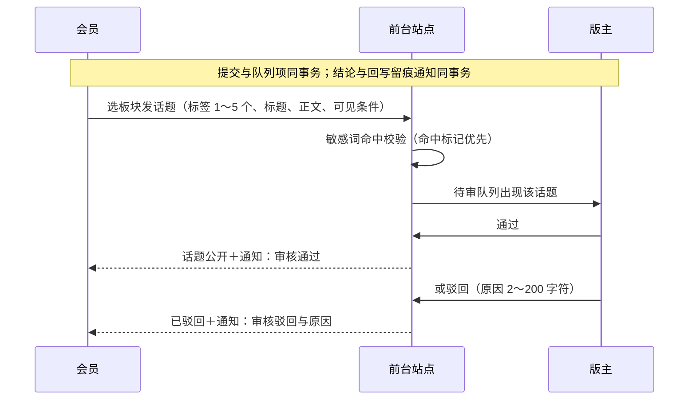
```mermaid
sequenceDiagram
    participant 会员
    participant 前台站点
    participant 版主
    Note over 会员,版主: 提交与队列项同事务；结论与回写留痕通知同事务
    会员->>前台站点: 选板块发话题（标签 1～5 个、标题、正文、可见条件）
    前台站点->>前台站点: 敏感词命中校验（命中标记优先）
    前台站点->>版主: 待审队列出现该话题
    版主->>前台站点: 通过
    前台站点-->>会员: 话题公开＋通知：审核通过
    版主->>前台站点: 或驳回（原因 2～200 字符）
    前台站点-->>会员: 已驳回＋通知：审核驳回与原因
```

操作步骤清单：1. 会员登录并进入板块；2. 点击发帖，填标签、标题、正文并选择可见条件；3. 提交后在我的内容处显示待审核；4. 版主在待审队列处理；5. 通过后话题公开、驳回则按通知修改重提。

### 3.2 旅程二（评论段）：在公开话题下评论并通知作者

其他会员进入已公开话题详情，提交评论（2～1000 字符）或对评论回复；评论进入待审，版主通过后公开展示并通知话题作者，驳回则评论人收到含原因通知——点赞与收藏互动段不在本版旅程内（随 v0.2.1）。

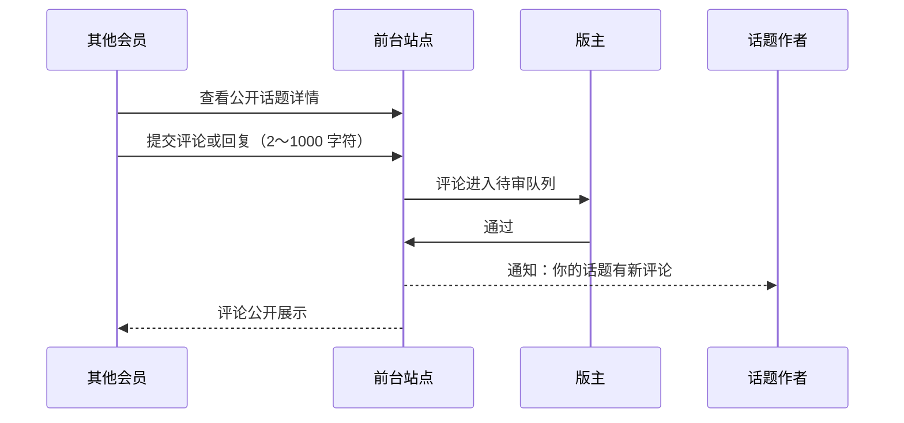
```mermaid
sequenceDiagram
    participant 其他会员
    participant 前台站点
    participant 版主
    participant 话题作者
    其他会员->>前台站点: 查看公开话题详情
    其他会员->>前台站点: 提交评论或回复（2～1000 字符）
    前台站点->>版主: 评论进入待审队列
    版主->>前台站点: 通过
    前台站点-->>话题作者: 通知：你的话题有新评论
    前台站点-->>其他会员: 评论公开展示
```

操作步骤清单：1. 进入公开话题详情并阅读评论；2. 填写评论或回复提交；3. 版主审核；4. 通过后评论公开且作者收到通知。

### 3.3 旅程三：驳回后修改重提（会员·单端）

作者在我的内容入口看到已驳回状态与驳回原因，修改标题、正文或可见条件后重新提交，话题回到待审核并生成新的审核记录；循环直至通过或删除放弃。

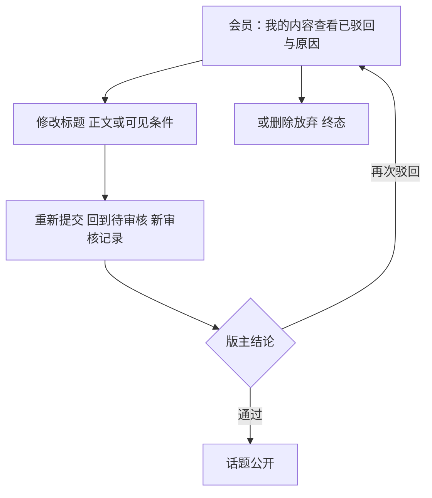
```mermaid
flowchart TD
    A[会员：我的内容查看已驳回与原因] --> B[修改标题 正文或可见条件]
    B --> C[重新提交 回到待审核 新审核记录]
    C --> D{版主结论}
    D -->|通过| E[话题公开]
    D -->|再次驳回| A
    A --> F[或删除放弃 终态]
```

操作步骤清单：1. 定位已驳回话题；2. 查看驳回原因；3. 修改后重新提交；4. 等待新结论；5. 需要时删除放弃。

### 3.4 旅程四：访客浏览与搜索（访客·单端）

访客打开首页看到启用板块（名称与说明），进入板块内容列表（已公开话题按发布时间倒序，含标题、作者、评论数、点赞数与标签），点击进入详情阅读正文与评论，或关键词搜索（只返回已公开且可见的话题）；参与时被引导注册。

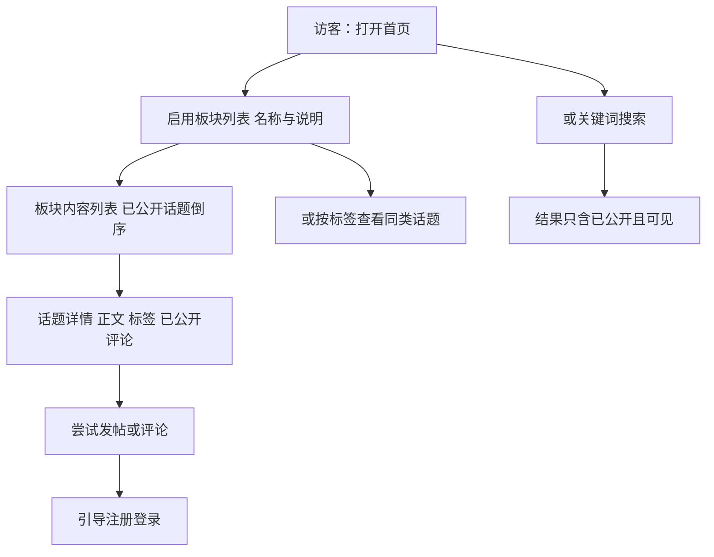
```mermaid
flowchart TD
    A[访客：打开首页] --> B[启用板块列表 名称与说明]
    B --> C[板块内容列表 已公开话题倒序]
    C --> D[话题详情 正文 标签 已公开评论]
    B --> E[或按标签查看同类话题]
    A --> F[或关键词搜索]
    F --> G[结果只含已公开且可见]
    D --> H[尝试发帖或评论]
    H --> I[引导注册登录]
```

操作步骤清单：1. 打开首页浏览板块；2. 进入板块或标签列表；3. 阅读详情与评论；4. 或关键词搜索；5. 参与时注册。

## 4. 功能需求

### 4.0 功能总览

**对象归组树**（版本→对象→条目）：

```mermaid
flowchart TB
    V[v0.2.0 讨论闭环]
    V --- O1[板块 消费] & O2[话题] & O3[评论] & O4[审核记录] & O5[敏感词] & O6[通知提醒]
    O1 --- N24[R24 板块列表与导航] & N25[R25 板块内容列表] & N26[R26 标签入口]
    O2 --- N27[R27 发表话题 ◆] & N28[R28 编辑话题] & N29[R29 重新提交] & N30[R30 删除话题 ◆] & N31[R31 可见权限设置] & N32[R32 话题列表与详情] & N33[R33 话题搜索] & N34[R34 可见判定]
    O3 --- N35[R35 发表评论与回复 ◆] & N36[R36 删除评论] & N37[R37 查看评论]
    O4 --- N38[R38 待审队列查看] & N39[R39 审核通过 ◆] & N40[R40 审核驳回 ◆]
    O5 --- N41[R41 词条新增与编辑] & N42[R42 词条删除] & N43[R43 命中校验 ◆]
    O6 --- N44[R44 写入通知提醒 ◆] & N45[R45 查看通知提醒]
    classDef complex fill:#e7f1ff,stroke:#3b7ddd;
    class N27,N30,N35,N39,N40,N43,N44 complex;
```

**对象增删改查矩阵**：

| 对象 | 增 | 改 | 删 | 查 |
|---|---|---|---|---|
| 板块 | 随 v0.1.1 已交付 | 随 v0.1.1 已交付 | 随 v0.1.1 已交付 | R24／R25（前台消费，停用板块不展示） |
| 话题 | R27（发表） | R28（编辑）、R29（重提）、R31（可见规则） | R30（作者删除，终态） | R32／R33／R34（详情、搜索、可见判定） |
| 评论 | R35（评论与回复） | 不做（本版无评论编辑） | R36（作者删除，终态） | R37（话题详情评论列表） |
| 审核记录 | R39／R40（结论产生，只增） | 不做（只增不改） | 不做（留痕不可删） | R38（待审队列与留痕回溯） |
| 敏感词 | R41（新增） | R41（编辑、启停） | R42（删除） | R41（词表列表为入口） |
| 通知提醒 | R44（事件写入，只增） | 不做（已读随 0.4） | 不做（清理随 0.4） | R45（通知列表） |

**主体使用面**：

| 主体／角色 | 端 | 使用条目 | 机制条目 |
|---|---|---|---|
| 访客 | 电脑端网页、手机端网页 | R24、R25、R26、R32、R33、R34（只读浏览） | 可见判定（随 R32～R34 展示生效） |
| 会员 | 电脑端网页、手机端网页 | R27～R37、R45 | 命中校验（随 R27／R35 提交生效）；写入通知提醒（随 R39／R40／R35 事件生效） |
| 版主 | 管理后台 | R38、R39、R40 | 同上（队列侧消费命中标记） |
| 站长 | 管理后台 | R41、R42 | 同上（词表供命中校验读取） |

### 4.1 R24 板块列表与导航

**功能说明**：前台按板块组织内容的一级入口。触发：访客或会员打开站点首页，或点击顶部板块导航。

**交互与流程**：

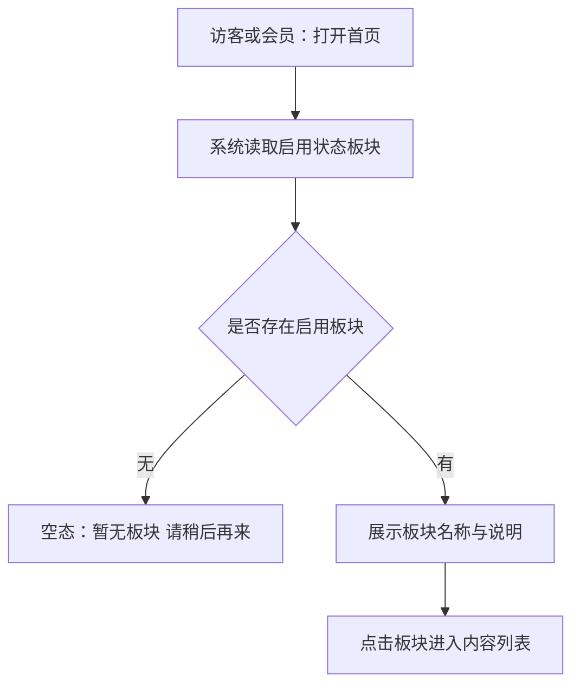
```mermaid
flowchart TD
    A[访客或会员：打开首页] --> B[系统读取启用状态板块]
    B --> C{是否存在启用板块}
    C -->|无| D[空态：暂无板块 请稍后再来]
    C -->|有| E[展示板块名称与说明]
    E --> F[点击板块进入内容列表]
```

操作步骤清单：1. 打开首页；2. 查看启用板块；3. 点击进入目标板块。

**字段与校验**：

| 字段 | 必填 | 业务类型 | 落库字段名 | 约束与取值 |
|---|---|---|---|---|
| 板块名 | —（展示） | 文本 | board_name | 取自板块表（v0.1.1） |
| 说明 | —（展示） | 文本 | description | 同上 |
| 状态 | —（过滤） | 状态 | status | 仅展示启用（术语表） |

**规则与边界**：(1) 首页只展示启用状态板块，停用板块不出现在前台（验收锚）；(2) 板块排序按 sort_order（同值按创建时间，沿用 v0.1.1）；(3) 本条为只读消费，板块数据由 v0.1.1 管理界面维护。

**异常与拦截**：无启用板块→首页显示空态「暂无板块，请稍后再来」；板块在访问瞬间被停用→列表不展示该板块（下次读取生效）。

### 4.2 R25 板块内容列表

**功能说明**：板块内已公开话题的列表页。触发：用户从板块导航或板块内容列表页进入某板块。

**交互与流程**：

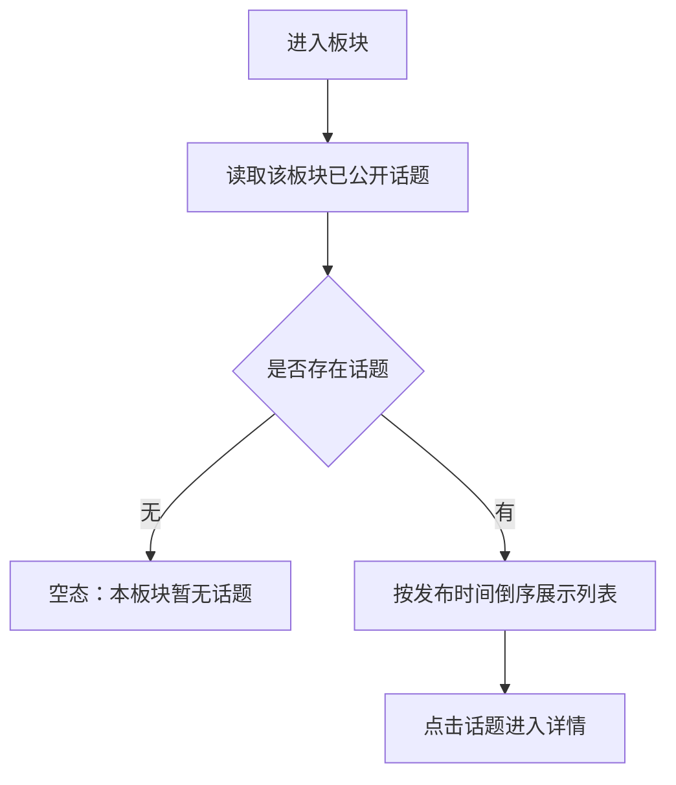
```mermaid
flowchart TD
    A[进入板块] --> B[读取该板块已公开话题]
    B --> C{是否存在话题}
    C -->|无| D[空态：本板块暂无话题]
    C -->|有| E[按发布时间倒序展示列表]
    E --> F[点击话题进入详情]
```

操作步骤清单：1. 进入板块；2. 浏览话题列表；3. 点击进入详情。

**字段与校验**：

| 字段 | 必填 | 业务类型 | 落库字段名 | 约束与取值 |
|---|---|---|---|---|
| 标题 | —（展示） | 文本 | title | 话题表 |
| 作者昵称 | —（展示） | 文本 | nickname | 会员账号表关联展示 |
| 评论数 | —（展示） | 计数 | comment_count | 该话题已公开评论计数（冗余可校正） |
| 点赞数 | —（展示） | 计数 | like_count | 本版恒展示 0，计数随 v0.2.1 点赞交付（先行展示位） |
| 标签 | —（展示） | 关联 | topic_tag | 话题标签关联表展示 |

**规则与边界**：(1) 只展示已公开话题，待审核与已驳回不出现（验收锚）；(2) 按发布时间倒序、分页 20 条／页（本版采用，行业惯例默认）；(3) 不满足可见条件的已公开话题在列表显示标题与条件提示、不显示正文入口摘要（与 R34 一致）。

**异常与拦截**：板块无话题→空态；停用板块的直接访问→提示「该板块已停用」并回首页。

### 4.3 R26 标签入口

**功能说明**：按标签聚合同类话题的前台入口。触发：用户点击话题标签或标签聚合入口。

**交互与流程**：

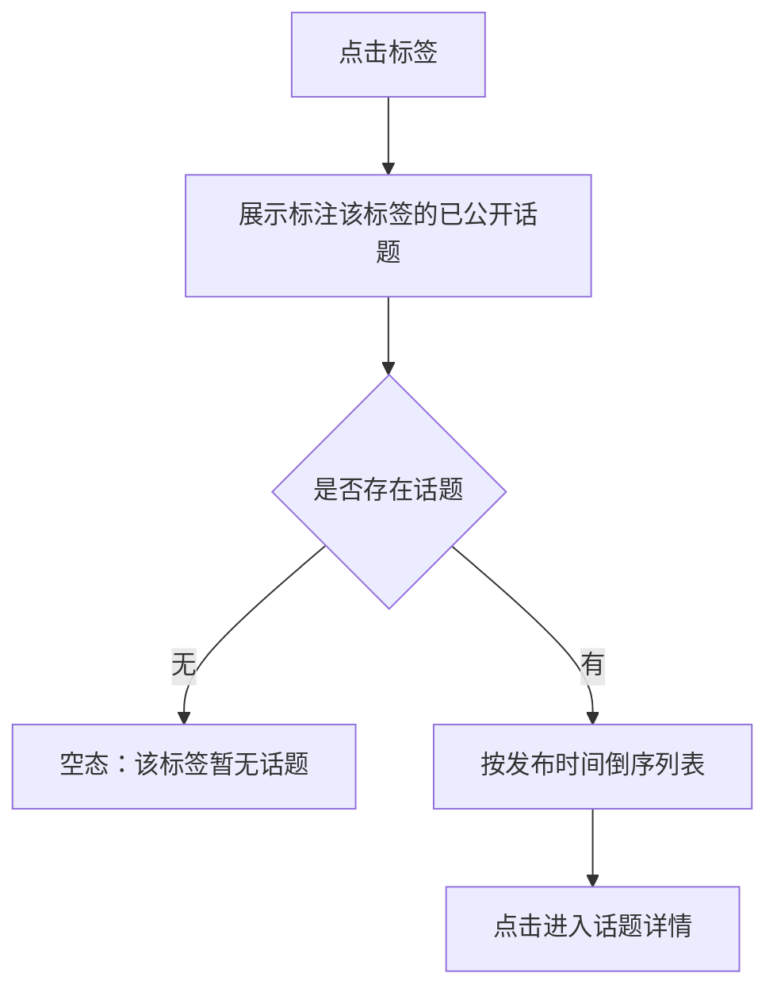
```mermaid
flowchart TD
    A[点击标签] --> B[展示标注该标签的已公开话题]
    B --> C{是否存在话题}
    C -->|无| D[空态：该标签暂无话题]
    C -->|有| E[按发布时间倒序列表]
    E --> F[点击进入话题详情]
```

操作步骤清单：1. 点击标签；2. 浏览同类话题；3. 进入详情。

**字段与校验**：

| 字段 | 必填 | 业务类型 | 落库字段名 | 约束与取值 |
|---|---|---|---|---|
| 标签名 | —（展示） | 文本 | tag_name | 标签表（v0.1.1） |
| 使用次数 | —（派生） | 计数 | use_count | 随话题标注关系累计（0.1 先行派生自此生效） |

**规则与边界**：(1) 只展示已公开话题（验收锚）；(2) 标签使用计数随标注关系建立与取消累计与回减；空标签（计数 0）不出现在前台标签入口聚合位（本版采用）。

**异常与拦截**：无话题→空态；标签被删除后历史正文不受影响、入口不再出现。

### 4.4 R27 发表话题 ◆

**功能说明**：会员生产讨论内容并进入先审后发。触发：会员在板块内点击「发表话题」提交表单。

**交互与流程**：

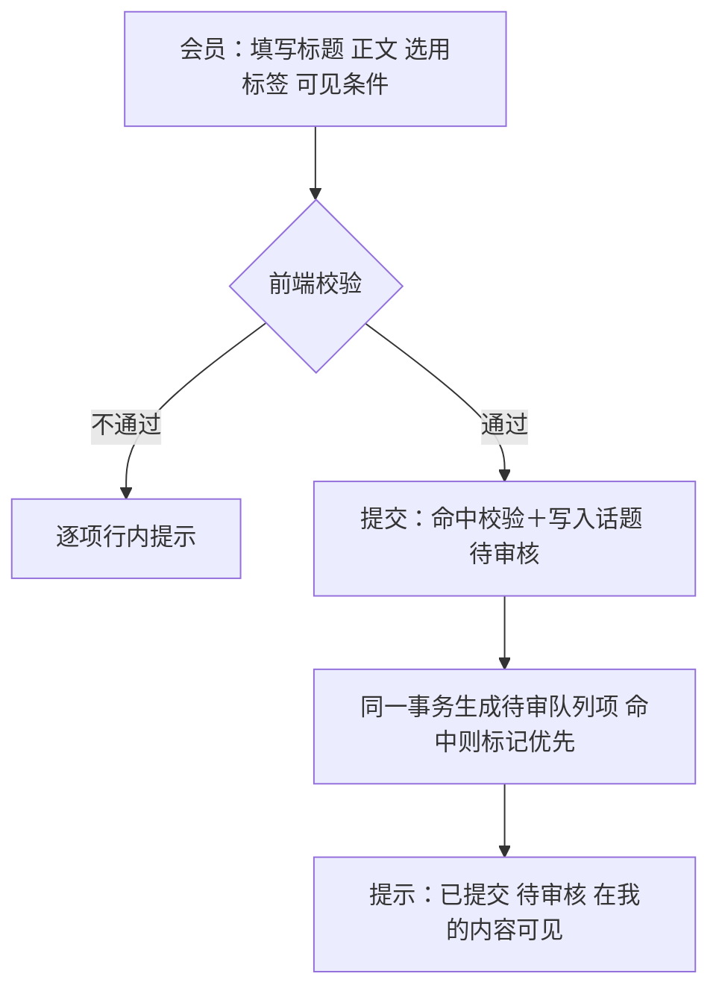
```mermaid
flowchart TD
    A[会员：填写标题 正文 选用标签 可见条件] --> B{前端校验}
    B -->|不通过| C[逐项行内提示]
    B -->|通过| D[提交：命中校验＋写入话题 待审核]
    D --> E[同一事务生成待审队列项 命中则标记优先]
    E --> F[提示：已提交 待审核 在我的内容可见]
```

操作步骤清单：1. 进入板块点击发帖；2. 填写标题（2～100 字符）、正文（≤50000 字符）；3. 选用 1～5 个标签；4. 可选设置可见条件；5. 提交并按提示修正。

**字段与校验**：

| 字段 | 必填 | 业务类型 | 落库字段名 | 约束与取值 |
|---|---|---|---|---|
| 标题 | 是 | 文本 | title | 2～100 字符（本版采用，行业惯例默认） |
| 正文 | 是 | 文本 | content | ≤50000 字符（本版采用） |
| 标签 | 是 | 关联 | topic_tag（topic_id、tag_id） | 1～5 个，取自标签表（本版采用） |
| 可见条件 | 是（默认公开） | 规则 | visibility_rule | 公开／回复可见／等级可见／积分可见；默认公开；等级与积分判定随 0.3 生效（先行基座） |
| 所属板块 | 是（上下文） | 关联 | board_id | 启用状态板块 |
| 作者 | 是（上下文） | 关联 | member_id | 当前会员 |

**规则与边界**：(1) 提交后进入待审核并出现在待审队列，结论前对访客与其他会员不可见（验收锚）；(2) 话题写入、队列项、命中标记同事务；(3) 被禁言或封号的账号不能进入发帖（沿用 0.2 版主处置能力于 v0.2.1 交付，本版校验先行就绪——见 R35 同口径）；(4) 停用板块拒绝发帖（v0.1.1 先行拦截接入）。

**异常与拦截**：标题越界→「标题需 2～100 个字符」；正文超限→「正文不超过 50000 字符」；标签超量→「最多选用 5 个标签」；停用板块→「该板块已停用，不能发表话题」；禁言／封号→「账号被禁言，暂不能发言」（拦截校验先行就绪，处置界面随 v0.2.1）。

### 4.5 R28 编辑话题

**功能说明**：作者维护自己的话题内容。触发：会员在我的内容或话题页对自己的话题点击「编辑」保存。

**交互与流程**：

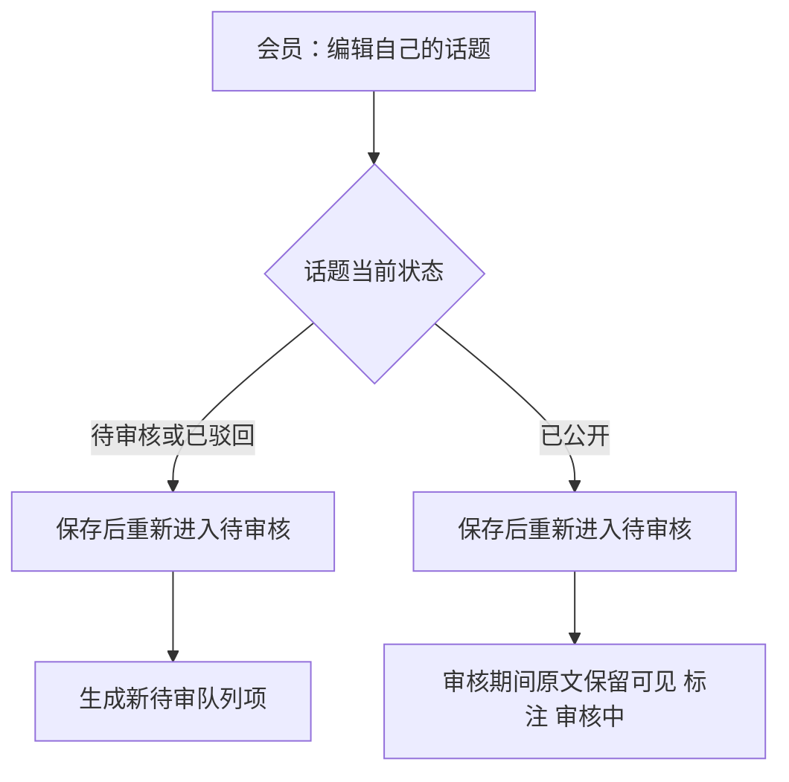
```mermaid
flowchart TD
    A[会员：编辑自己的话题] --> B{话题当前状态}
    B -->|待审核或已驳回| C[保存后重新进入待审核]
    B -->|已公开| D[保存后重新进入待审核]
    D --> E[审核期间原文保留可见 标注 审核中]
    C --> F[生成新待审队列项]
```

操作步骤清单：1. 定位自己的话题；2. 修改标题、正文、标签或可见条件；3. 保存后查看状态变化。

**字段与校验**：同 R27 表（编辑回显原值，校验同口径）。

**规则与边界**：(1) 待审核与已驳回编辑保存后重新进入待审核；已公开编辑后同样重新进入待审核且审核期间原文保留可见并标注审核中（验收锚）；(2) 仅作者可编辑，他人编辑入口不可见且接口拦截；(3) 编辑写入同事务生成新队列项。

**异常与拦截**：非作者→接口拦截「只能编辑自己的话题」；越权并发→「该话题已被更新，请刷新后重试」。

### 4.6 R29 重新提交

**功能说明**：被驳回话题的再进入通道。触发：会员在已驳回话题查看驳回原因后修改并再次提交。

**交互与流程**：

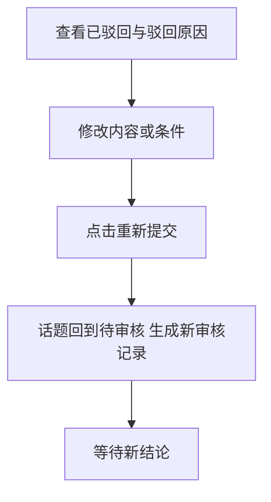
```mermaid
flowchart TD
    A[查看已驳回与驳回原因] --> B[修改内容或条件]
    B --> C[点击重新提交]
    C --> D[话题回到待审核 生成新审核记录]
    D --> E[等待新结论]
```

操作步骤清单：1. 查看驳回原因；2. 修改；3. 重新提交；4. 等待结论。

**字段与校验**：同 R27 表；驳回原因只读回显（reject_reason，取自审核记录）。

**规则与边界**：(1) 重新提交后回到待审核并生成新的审核记录（验收锚，历史记录保留可回溯）；(2) 仅已驳回状态可执行重新提交（待审核话题无此入口）；(3) 重提交次数不设上限（本版采用）。

**异常与拦截**：对非已驳回话题重提→「仅被驳回的话题可重新提交」。

### 4.7 R30 删除话题 ◆

**功能说明**：作者对自己话题的终态处置。触发：会员对自己的话题点击「删除」并二次确认。

**交互与流程**：

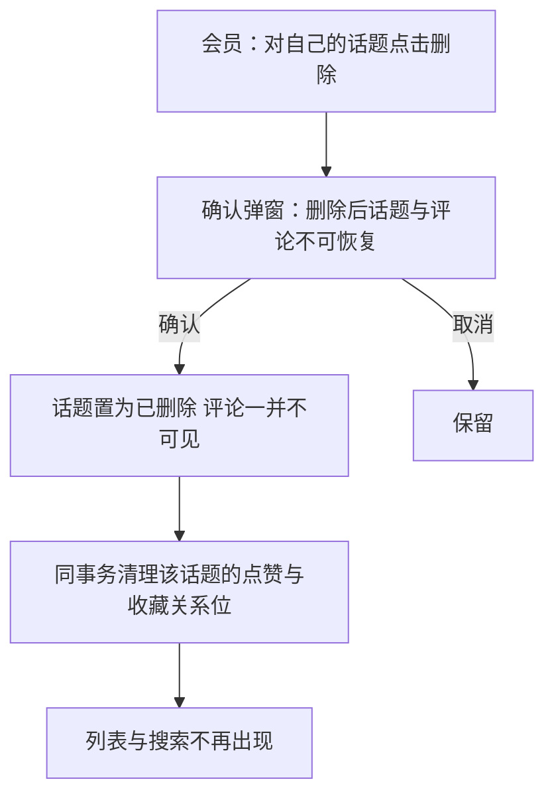
```mermaid
flowchart TD
    A[会员：对自己的话题点击删除] --> B[确认弹窗：删除后话题与评论不可恢复]
    B -->|确认| C[话题置为已删除 评论一并不可见]
    C --> D[同事务清理该话题的点赞与收藏关系位]
    D --> E[列表与搜索不再出现]
    B -->|取消| F[保留]
```

操作步骤清单：1. 点击删除；2. 确认；3. 核实列表与搜索不再出现。

**字段与校验**：

| 字段 | 必填 | 业务类型 | 落库字段名 | 约束与取值 |
|---|---|---|---|---|
| 状态 | —（操作对象） | 状态 | status | 置为已删除（终态，术语表） |

**规则与边界**：(1) 删除后话题及其评论不再可见且不可恢复（验收锚）；(2) 仅作者可删，治理侧删除随 0.6；(3) 删除同事务清理互动关系位（点赞与收藏关系表随 v0.2.1 建，本版预留清理挂点）；(4) 删除后标签使用计数回减。

**异常与拦截**：非作者→接口拦截「只能删除自己的话题」；重复删除→幂等返回「该话题已删除」。

### 4.8 R31 可见权限设置

**功能说明**：作者限定话题正文可见范围的条件设置。触发：会员在发帖或编辑表单选择可见条件保存。

**交互与流程**：

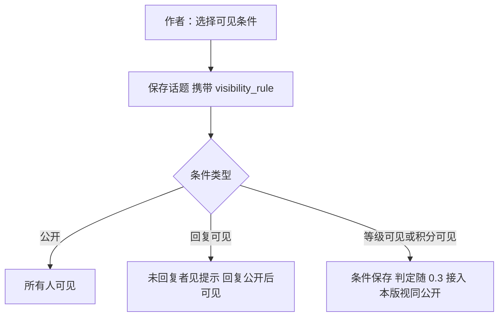
```mermaid
flowchart TD
    A[作者：选择可见条件] --> B[保存话题 携带 visibility_rule]
    B --> C{条件类型}
    C -->|公开| D[所有人可见]
    C -->|回复可见| E[未回复者见提示 回复公开后可见]
    C -->|等级可见或积分可见| F[条件保存 判定随 0.3 接入 本版视同公开]
```

操作步骤清单：1. 在表单选择条件；2. 保存；3. 以另一账号验证提示与可见性。

**字段与校验**：

| 字段 | 必填 | 业务类型 | 落库字段名 | 约束与取值 |
|---|---|---|---|---|
| 可见条件 | 是（默认公开） | 规则 | visibility_rule | 公开／回复可见／等级可见／积分可见（本版采用四值） |

**规则与边界**：(1) 回复可见条件下，未回复的访问者只见条件提示不见正文，其回复公开后自动可见（验收锚）；(2) 等级与积分条件可设置但判定随 0.3 接入生效，本版该两类条件的话题视同公开展示（先行基座，表单对两类条件标注「将于后续版本生效」）；(3) 访客对回复可见话题同样只见提示，回复需注册登录。

**异常与拦截**：无（条件为受控四选一，无自由输入）。

### 4.9 R32 话题列表与详情

**功能说明**：话题的阅读入口。触发：用户从板块列表或标签列表点击话题。

**交互与流程**：

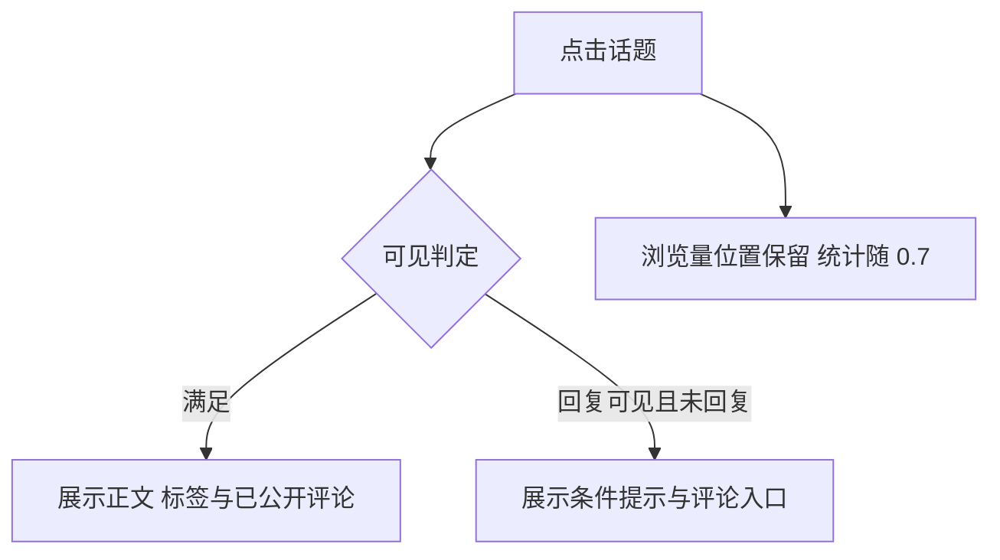
```mermaid
flowchart TD
    A[点击话题] --> B{可见判定}
    B -->|满足| C[展示正文 标签与已公开评论]
    B -->|回复可见且未回复| D[展示条件提示与评论入口]
    A --> E[浏览量位置保留 统计随 0.7]
```

操作步骤清单：1. 点击话题；2. 阅读正文与标签；3. 查看评论列表。

**字段与校验**：展示字段同 R25 列；详情额外展示正文（content）、发布时间（created_at）、作者（member_id 关联昵称头像）。

**规则与边界**：(1) 详情可见正文、标签与已公开评论（验收锚）；(2) 待审核与已驳回话题的详情页对非作者返回「内容不存在或不可见」；(3) 编辑中的已公开话题详情顶部标注「审核中」并展示原文。

**异常与拦截**：不可见或不存在→「内容不存在或不可见」；已删除→同上（终态不暴露删除事实）。

### 4.10 R33 话题搜索

**功能说明**：站内话题关键词检索。触发：用户在搜索框输入关键词提交。

**交互与流程**：

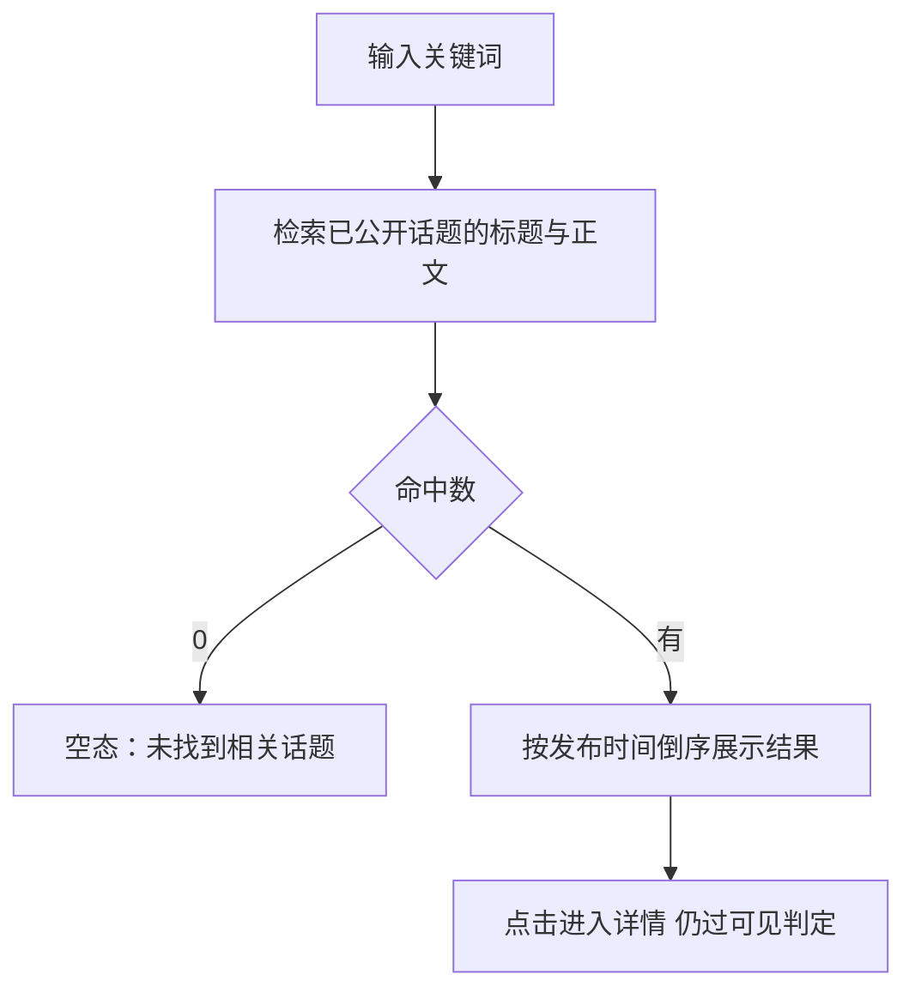
```mermaid
flowchart TD
    A[输入关键词] --> B[检索已公开话题的标题与正文]
    B --> C{命中数}
    C -->|0| D[空态：未找到相关话题]
    C -->|有| E[按发布时间倒序展示结果]
    E --> F[点击进入详情 仍过可见判定]
```

操作步骤清单：1. 输入关键词；2. 查看结果；3. 点击进入详情。

**字段与校验**：

| 字段 | 必填 | 业务类型 | 落库字段名 | 约束与取值 |
|---|---|---|---|---|
| 关键词 | 是 | 文本 | —（查询条件） | 1～50 字符（本版采用） |

**规则与边界**：(1) 只返回已公开且对当前身份可见的话题，待审核与已驳回不出现在结果（验收锚）；(2) 检索范围含标题与正文，按发布时间倒序、分页 20 条／页（本版采用）；(3) 数据库全文检索实现（K 沿用），不引入外部搜索引擎。

**异常与拦截**：关键词为空→「请输入关键词」；超长→截断至 50 字符检索。

### 4.11 R34 可见判定

**功能说明**：内容可见性的统一判定机制。触发：列表、详情与搜索每次渲染内容时。

**交互与流程**：

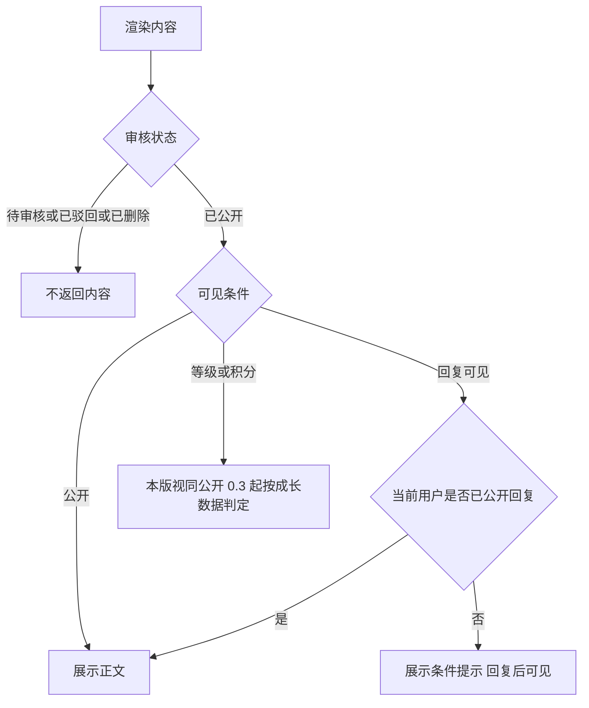
```mermaid
flowchart TD
    A[渲染内容] --> B{审核状态}
    B -->|待审核或已驳回或已删除| C[不返回内容]
    B -->|已公开| D{可见条件}
    D -->|公开| E[展示正文]
    D -->|回复可见| F{当前用户是否已公开回复}
    F -->|是| E
    F -->|否| G[展示条件提示 回复后可见]
    D -->|等级或积分| H[本版视同公开 0.3 起按成长数据判定]
```

操作步骤清单（机制无独立操作）：1. 列表／详情／搜索统一调用判定；2. 按判定结果展示正文或提示。

**字段与校验**：无独立表单；判定输入＝话题状态、visibility_rule、当前身份与其在本话题下的已公开评论。

**规则与边界**：(1) 不满足条件的访问者看到条件提示而不展示正文，判定对列表、详情与搜索一致生效（验收锚）；(2) 判定为服务端统一接口，前端不得自行放宽；(3) 作者本人始终可见自己的话题正文。

**异常与拦截**：绕过前端直接请求正文接口→服务端按同口径返回提示或内容，不泄漏。

### 4.12 R35 发表评论与回复 ◆

**功能说明**：公开话题下的讨论参与。触发：会员在话题详情评论框提交评论或对评论点击回复。

**交互与流程**：

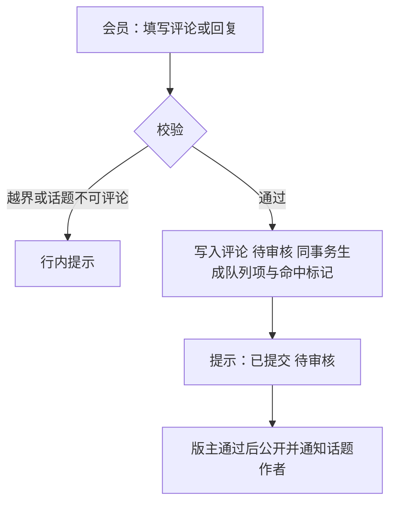
```mermaid
flowchart TD
    A[会员：填写评论或回复] --> B{校验}
    B -->|越界或话题不可评论| C[行内提示]
    B -->|通过| D[写入评论 待审核 同事务生成队列项与命中标记]
    D --> E[提示：已提交 待审核]
    E --> F[版主通过后公开并通知话题作者]
```

操作步骤清单：1. 打开话题详情；2. 填写评论（2～1000 字符）或回复；3. 提交；4. 审核通过后查看公开与作者通知。

**字段与校验**：

| 字段 | 必填 | 业务类型 | 落库字段名 | 约束与取值 |
|---|---|---|---|---|
| 评论正文 | 是 | 文本 | content | 2～1000 字符（本版采用） |
| 所属话题 | 是（上下文） | 关联 | topic_id | 已公开话题 |
| 父级评论 | 回复时必填 | 关联 | parent_comment_id | 两级层级：评论与对评论的回复，回复不再嵌套（本版采用） |
| 作者 | 是（上下文） | 关联 | member_id | 当前会员 |

**规则与边界**：(1) 提交后进入待审核，通过后公开并通知话题作者（验收锚）；(2) 仅已公开话题可评论；(3) 被禁言或封号的账号提交被拒绝（验收锚——处置界面随 v0.2.1，本版拦截校验先行就绪）；(4) 评论公开后，若话题为回复可见条件，评论者自动获得正文可见资格。

**异常与拦截**：越界→「评论需 2～1000 个字符」；话题非公开→「该话题暂不能评论」；禁言／封号→「账号被禁言，暂不能发言」。

### 4.13 R36 删除评论

**功能说明**：作者对自己评论的终态处置。触发：会员对自己的评论点击「删除」并确认。

**交互与流程**：

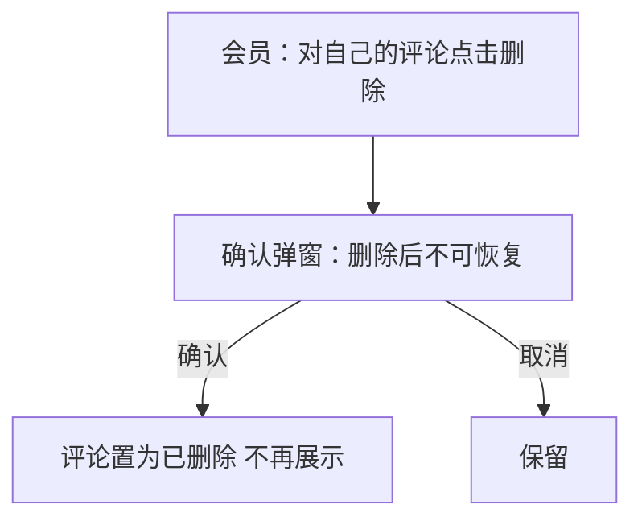
```mermaid
flowchart TD
    A[会员：对自己的评论点击删除] --> B[确认弹窗：删除后不可恢复]
    B -->|确认| C[评论置为已删除 不再展示]
    B -->|取消| D[保留]
```

操作步骤清单：1. 定位自己的评论；2. 删除确认；3. 核实不再展示。

**字段与校验**：状态字段 status 置为已删除（术语表）。

**规则与边界**：(1) 删除后该评论不再可见（终态，验收锚）；治理侧删除随 0.6；(2) 被删除评论的回复保留展示但不再显示父级内容（显示「该评论已删除」占位，本版采用）；(3) 仅作者可删。

**异常与拦截**：非作者→接口拦截「只能删除自己的评论」；重复删除→幂等返回「该评论已删除」。

### 4.14 R37 查看评论

**功能说明**：话题详情的评论消费。触发：用户打开话题详情页。

**交互与流程**：

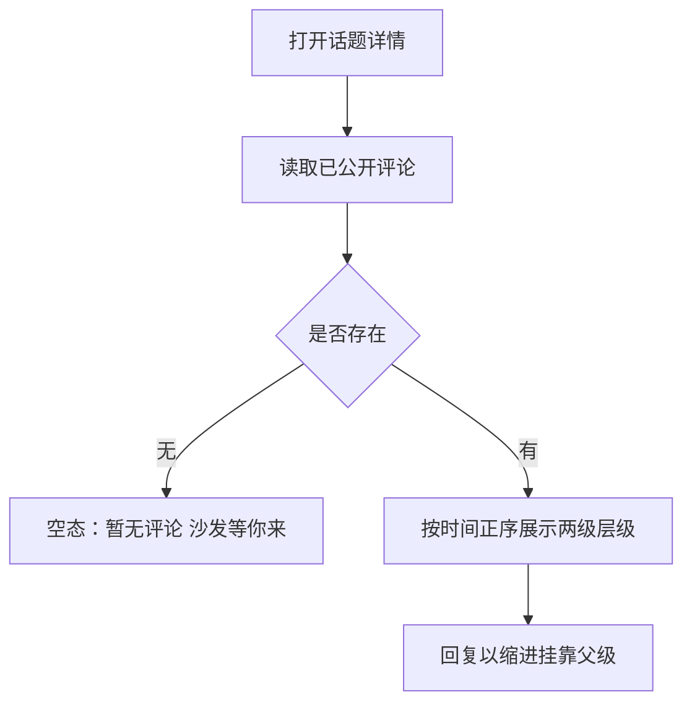
```mermaid
flowchart TD
    A[打开话题详情] --> B[读取已公开评论]
    B --> C{是否存在}
    C -->|无| D[空态：暂无评论 沙发等你来]
    C -->|有| E[按时间正序展示两级层级]
    E --> F[回复以缩进挂靠父级]
```

操作步骤清单：1. 打开详情；2. 浏览评论与回复；3. 需要时回复。

**字段与校验**：展示字段：作者昵称与头像、正文、发布时间、回复层级（parent_comment_id）。

**规则与边界**：(1) 只展示已公开评论，待审核与已驳回不展示（验收锚）；(2) 按时间正序、分页 20 条／页（本版采用）；(3) 评论数（comment_count）随公开评论计数。

**异常与拦截**：无评论→空态；父级已删除→占位「该评论已删除」。

### 4.15 R38 待审队列查看

**功能说明**：版主处理待审内容的工作台。触发：版主在管理后台进入「待审队列」。

**交互与流程**：

```mermaid
flowchart TD
    A[版主：进入待审队列] --> B[按内容类型与时间筛选]
    B --> C{队列是否有项}
    C -->|无| D[空态：暂无待审内容]
    C -->|有| E[命中敏感词条目置顶并带命中标记]
    E --> F[点击条目查看内容详情]
    F --> G[执行通过或驳回]
```

操作步骤清单：1. 进入待审队列；2. 按类型（话题／评论）与时间筛选；3. 查看内容；4. 执行结论。

**字段与校验**：

| 字段 | 必填 | 业务类型 | 落库字段名 | 约束与取值 |
|---|---|---|---|---|
| 内容类型 | —（筛选） | 类型 | content_type | 话题／评论 |
| 命中标记 | —（展示） | 布尔 | is_hit（队列项派生） | 命中敏感词为真，置顶展示 |

**规则与边界**：(1) 按内容类型与时间查看待审话题与评论，命中条目置顶带标记（验收锚）；(2) 分页 20 条／页（本版采用）；(3) 队列仅版主能力点可见（能力点判定沿用 v0.1.0）。

**异常与拦截**：无待审→空态；非版主访问→能力点拦截（入口不渲染且接口 403）。

### 4.16 R39 审核通过 ◆

**功能说明**：版主放行待审内容。触发：版主对待审条目点击「通过」。

**交互与流程**：

```mermaid
sequenceDiagram
    participant 版主
    participant 审核与治理
    participant 话题模块
    participant 消息模块
    版主->>审核与治理: 点击通过
    审核与治理->>审核与治理: 校验条目仍为待审核（条件更新防重复）
    Note over 审核与治理,消息模块: 同一本地事务
    审核与治理->>话题模块: 回写状态为已公开
    审核与治理->>审核与治理: 写入审核记录（通过）
    审核与治理->>消息模块: 写入通知：审核通过
    消息模块-->>审核与治理: 写入完成
    审核与治理-->>版主: 队列移除该条目
```

操作步骤清单：1. 在队列定位条目；2. 点击通过；3. 队列移除；4. 前台核实公开。

**字段与校验**：

| 字段 | 必填 | 业务类型 | 落库字段名 | 约束与取值 |
|---|---|---|---|---|
| 结论 | 是 | 结论 | conclusion | 通过（术语表 §7 结论类） |
| 审核人 | 是（上下文） | 关联 | admin_id | 当前版主账号 |

**规则与边界**：(1) 通过后内容立即公开并进入板块列表与搜索，审核记录与通知作者在同一事务完成（验收锚）；(2) 校验条目仍处待审核，重复通过幂等返回；评论公开同时触发话题作者通知。

**异常与拦截**：条目已被处理→「该内容已处理，请刷新队列」；同事务任一步失败→整体回滚，内容保持待审核。

### 4.17 R40 审核驳回 ◆

**功能说明**：版主拒绝待审内容并说明原因。触发：版主对待审条目点击「驳回」并填写原因。

**交互与流程**：

```mermaid
flowchart TD
    A[版主：点击驳回] --> B[填写驳回原因 2～200 字符]
    B --> C{原因校验}
    C -->|不通过| D[行内提示]
    C -->|通过| E[同一事务：回写已驳回＋审核记录＋通知作者]
    E --> F[作者在我的内容见已驳回与原因]
```

操作步骤清单：1. 定位条目点击驳回；2. 填写原因；3. 提交；4. 作者侧核实状态与通知。

**字段与校验**：

| 字段 | 必填 | 业务类型 | 落库字段名 | 约束与取值 |
|---|---|---|---|---|
| 驳回原因 | 是 | 文本 | reject_reason | 2～200 字符（本版采用） |

**规则与边界**：(1) 驳回后内容对作者显示已驳回与原因并通知作者，作者可修改后重新提交（验收锚）；(2) 驳回原因对作者可见、对其他会员不可见；(3) 与通过互斥，同事务三件套（回写／记录／通知）。

**异常与拦截**：原因为空或越界→「驳回原因需 2～200 个字符」；条目已被处理→「该内容已处理，请刷新队列」。

### 4.18 R41 词条新增与编辑

**功能说明**：站长维护拦截词表。触发：站长在管理后台「敏感词」页新增或编辑词条保存。

**交互与流程**：

```mermaid
flowchart TD
    A[站长：新增或编辑词条] --> B{校验}
    B -->|为空 越界或重复| C[行内提示]
    B -->|通过| D[保存并留痕 立即生效于后续提交]
    D --> E[词表列表即时显示]
```

操作步骤清单：1. 进入敏感词页；2. 新增或编辑词条；3. 保存核实。

**字段与校验**：

| 字段 | 必填 | 业务类型 | 落库字段名 | 约束与取值 |
|---|---|---|---|---|
| 词条 | 是 | 文本 | word | 2～30 字符，全局唯一（本版采用） |
| 启停 | 是（默认启用） | 布尔 | is_active | 默认启用；停用不参与命中 |

**规则与边界**：(1) 保存后立即生效于后续提交的命中校验，变更留痕（验收锚）；(2) 编辑不改历史命中标记，仅影响后续匹配。

**异常与拦截**：重复→「词条已存在」；越界→「词条需 2～30 个字符」。

### 4.19 R42 词条删除

**功能说明**：站长移除词条。触发：站长对词条点击「删除」并确认。

**交互与流程**：

```mermaid
flowchart TD
    A[站长：点击删除] --> B[确认弹窗显示词条]
    B -->|确认| C[删除并留痕 词不再参与命中]
    B -->|取消| D[保留]
```

操作步骤清单：1. 定位词条；2. 删除确认；3. 核实列表移除。

**字段与校验**：删除对象＝词条（word），删除留痕。

**规则与边界**：(1) 删除后该词不再参与命中校验，删除留痕（验收锚）；(2) 历史命中标记不受影响。

**异常与拦截**：重复删除→幂等返回「该词条已删除」。

### 4.20 R43 命中校验 ◆

**功能说明**：提交时点的词表匹配机制。触发：会员提交话题或评论（R27／R35 提交链路）。

**交互与流程**：

```mermaid
flowchart TD
    A[提交内容] --> B[读取启用状态词表]
    B --> C{标题或正文是否命中}
    C -->|命中| D[队列项标记优先 对作者不提示命中细节]
    C -->|未命中| E[常规进入队列]
    D --> F[版主判断结论 命中不自动驳回]
```

操作步骤清单（机制无独立操作）：1. 提交即触发；2. 队列按标记呈现。

**字段与校验**：匹配对象＝title＋content；词表＝is_active 为真的词条。

**规则与边界**：(1) 命中的待审条目在队列中标记优先，未命中按常规进入队列，命中不自动驳回（验收锚）；(2) 匹配为本版全量精确匹配、不区分大小写（本版采用，不分词不变体）；(3) 命中标记仅版主可见，作者侧不暴露词表。

**异常与拦截**：词表读取失败→提交不阻断，按未命中入队并记录异常日志供排查（本版采用）。

### 4.21 R44 写入通知提醒 ◆

**功能说明**：业务事件到通知的送达机制。触发：审核结论（R39／R40）与评论公开（R39 作用于评论）事件。

**交互与流程**：

```mermaid
sequenceDiagram
    participant 业务模块
    participant 消息模块
    participant 会员
    Note over 业务模块,消息模块: 同一本地事务
    业务模块->>消息模块: 写入请求（接收人、类型、关联内容）
    消息模块->>消息模块: 生成摘要与链接写入通知
    消息模块-->>业务模块: 写入完成
    Note over 业务模块,消息模块: 任一步失败整体回滚 通知不残留
    会员->>消息模块: 前台通知入口查看
```

操作步骤清单（机制无独立操作）：事件发生即写入；会员经 R45 查看。

**字段与校验**：

| 字段 | 必填 | 业务类型 | 落库字段名 | 约束与取值 |
|---|---|---|---|---|
| 接收人 | 是 | 关联 | member_id | 话题作者或评论人 |
| 通知类型 | 是 | 类型 | notify_type | 本版取值：审核通过／审核驳回／评论公开（本版新定） |
| 关联内容 | 是 | 关联 | related_type／related_id | 指向话题或评论 |
| 摘要 | 是 | 文本 | content | 系统按类型统一生成 |

**规则与边界**：(1) 通知在同一事务写入，业务事务失败时通知不残留（验收锚）；(2) 通知文案由消息模块统一生成、业务方不传文案；(3) 只增不改（已读与清理随 0.4）。

**异常与拦截**：接收人不可达→静默丢弃不阻断业务（沿用 04C 契约）。

### 4.22 R45 查看通知提醒

**功能说明**：会员消费通知的入口。触发：会员点击前台顶栏通知入口（铃铛与未读占位）。

**交互与流程**：

```mermaid
flowchart TD
    A[会员：点击通知入口] --> B{是否有通知}
    B -->|无| C[空态：暂无通知]
    B -->|有| D[按时间倒序展示列表]
    D --> E[点击进入对应话题或评论]
    E --> F[返回后可继续查看 标记已读随 0.4]
```

操作步骤清单：1. 点击通知入口；2. 浏览列表；3. 点击进入对应内容。

**字段与校验**：展示字段：通知类型（notify_type）、摘要（content）、时间（created_at）、跳转（related_type／related_id）。

**规则与边界**：(1) 会员查看通知列表并可进入对应内容，标记已读与清理随 0.4 交付（验收锚）；(2) 分页 20 条／页（本版采用）；(3) 仅本人可见自己的通知。

**异常与拦截**：关联内容已删除→跳转显示「内容不存在或不可见」，通知条目保留。

## 5. 业务对象与数据字段

**数据主体清单**：

| 业务对象 | 落库名 | 定位与关系 |
|---|---|---|
| 话题 | topic | 论坛讨论主帖；归属板块、作者，被评论、点赞（0.2.1）、收藏（0.2.1）、审核留痕 |
| 评论 | comment | 话题下互动回复；两级层级（parent_comment_id） |
| 话题标签关联 | topic_tag | 话题与标签多对多关联表（一对象展开为多张表的映射：标签归 v0.1.1 标签表，标注关系落此表） |
| 审核记录 | audit_record | 先审后发留痕，只增不改 |
| 敏感词 | sensitive_word | 拦截词表（词条、启停） |
| 通知提醒 | notification | 事件驱动的站内送达消息，只增 |
| 板块／标签／全站设置／会员账号／管理端账号 | board／tag／site_setting／member_account／admin_account（沿用） | 沿用 v0.1 已建表，本版只读取与建立引用 |
| 操作留痕 | operation_log（沿用机制态） | 词条变更留痕沿用 |

**话题（topic）字段表**：

| 字段 | 必填 | 业务类型 | 落库字段名 | 约束与取值 |
|---|---|---|---|---|
| 主键／话题编号 | 是 | 编号 | id／topic_no | 自增主键；编号创建时生成终身不变 |
| 标题 | 是 | 文本 | title | 2～100 字符 |
| 正文 | 是 | 文本 | content | ≤50000 字符 |
| 所属板块 | 是 | 关联 | board_id | 启用状态板块 |
| 作者 | 是 | 关联 | member_id | 会员账号 |
| 可见条件 | 是 | 规则 | visibility_rule | 公开／回复可见／等级可见／积分可见，默认公开 |
| 状态 | 是 | 状态 | status | 待审核／已公开／已驳回／已删除（术语表） |
| 评论数 | 是 | 计数 | comment_count | 已公开评论计数（冗余可校正） |
| 点赞数 | 是 | 计数 | like_count | 本版恒 0，随 v0.2.1 生效（先行展示位） |
| 创建时间／更新时间 | 是 | 时间 | created_at／updated_at | 通用审计字段 |

**评论（comment）字段表**：

| 字段 | 必填 | 业务类型 | 落库字段名 | 约束与取值 |
|---|---|---|---|---|
| 主键／评论编号 | 是 | 编号 | id／comment_no | 同编号契约 |
| 所属话题 | 是 | 关联 | topic_id | 话题表 |
| 父级评论 | 否 | 关联 | parent_comment_id | 回复时必填；两级层级 |
| 作者 | 是 | 关联 | member_id | 会员账号 |
| 正文 | 是 | 文本 | content | 2～1000 字符 |
| 状态 | 是 | 状态 | status | 待审核／已公开／已驳回／已删除（术语表） |
| 创建时间／更新时间 | 是 | 时间 | created_at／updated_at | 通用审计字段 |

**话题标签关联（topic_tag）字段表**：

| 字段 | 必填 | 业务类型 | 落库字段名 | 约束与取值 |
|---|---|---|---|---|
| 话题 | 是 | 关联 | topic_id | 外键 |
| 标签 | 是 | 关联 | tag_id | 外键；与 topic_id 联合唯一 |
| 建立时间 | 是 | 时间 | created_at | 通用审计字段 |

**审核记录（audit_record）字段表**：

| 字段 | 必填 | 业务类型 | 落库字段名 | 约束与取值 |
|---|---|---|---|---|
| 主键 | 是 | 编号 | id | 自增主键 |
| 审核人 | 是 | 关联 | admin_id | 管理端账号 |
| 内容类型 | 是 | 类型 | content_type | 话题／评论 |
| 内容标识 | 是 | 关联 | content_id | 对应表主键 |
| 结论 | 是 | 结论 | conclusion | 通过／驳回（术语表 §7） |
| 驳回原因 | 驳回时必填 | 文本 | reject_reason | 2～200 字符 |
| 创建时间 | 是 | 时间 | created_at | 只增不改 |

**敏感词（sensitive_word）字段表**：

| 字段 | 必填 | 业务类型 | 落库字段名 | 约束与取值 |
|---|---|---|---|---|
| 主键 | 是 | 编号 | id | 自增主键 |
| 词条 | 是 | 文本 | word | 2～30 字符，全局唯一 |
| 启停 | 是 | 布尔 | is_active | 默认启用 |
| 创建时间／更新时间 | 是 | 时间 | created_at／updated_at | 通用审计字段 |

**通知提醒（notification）字段表**：

| 字段 | 必填 | 业务类型 | 落库字段名 | 约束与取值 |
|---|---|---|---|---|
| 主键 | 是 | 编号 | id | 自增主键 |
| 接收人 | 是 | 关联 | member_id | 会员账号 |
| 通知类型 | 是 | 类型 | notify_type | 审核通过／审核驳回／评论公开（本版新定） |
| 关联类型／关联标识 | 是 | 关联 | related_type／related_id | 话题／评论 |
| 摘要 | 是 | 文本 | content | 系统统一生成 |
| 已读 | 是 | 布尔 | is_read | 默认未读；标记已读随 0.4 |
| 创建时间 | 是 | 时间 | created_at | 只增 |

## 6. 待议与建议

**本版采用的推断与默认值汇总**（均已就地标明）：标题 2～100 字符、正文 ≤50000 字符、标签 1～5 个、评论 2～1000 字符、两级评论层级、驳回原因 2～200 字符、词条 2～30 字符、关键词 1～50 字符、各列表分页 20 条／页、命中匹配为不区分大小写的全量精确匹配、词表读取失败按未命中入队、重提次数不设上限、空标签不出现在聚合位、等级与积分条件本版视同公开——以上均为行业惯例默认或本版拍板，可随评审调整。

**待确认内容与影响**：R25 列表的点赞数列本版恒为 0（计数随 v0.2.1 交付，先行展示位，锚在大版本验收时点核对）；禁言与封号的拦截校验本版先行就绪、处置界面随 v0.2.1；经营验证数值口径（话题数与评论数）按大版本 PRD 列入立项依赖。

**建议回池的新想法**：无。

**术语表待登记行**（随本文档回报、由主流程合入）：topic_tag（关联表）、visibility_rule、word、is_active、notify_type、related_type、related_id、parent_comment_id、comment_count、like_count。
