# PRD（小版本）：v0.2.1 互动与账号治理

> 定位：开发级需求说明书——承接大版本 PRD 0.2 与其 02 批次二，认领自需求池（R46～R53，状态已迁移为已认领（v0.2.1））；用途与验收标准逐字锚定上游、只细化不改写；上游为模拟案例材料，模拟性质予以保留。

## 1. 版本概述

**承接与目标**：认领来源＝0.2 讨论开站版批次二「互动与账号治理」（简单场景采纳整批，R46～R53）＋需求池实时状态合并（池内该 8 条均为待规划，无池直入条目混入）。本版可验收形态＝02 批次二可验收形态——可演示：会员对话题与评论点赞、取消与计数即时变化，收藏与取消生效；版主对违规会员禁言后其发言被拒、期满或提前解除恢复、封号后登录被拒。量化口径沿用大版本 PRD（开站路径与零泄漏结论随 v0.2.0 已可验，本版补齐 0.2 完成标志的全部能力后大版本整体进入灰度台阶）。

**范围外声明**：R24～R45 已随 v0.2.0 发布；我的收藏与我的点赞列表界面随 0.5（本版仅建立与解除收藏关系、前台收藏操作即时反馈）；私信与关注随 0.4；举报与治理侧内容删除、会员与内容查询维护随 0.6（处置入口定位会员的方式见 R51 细化：经待审队列与已公开内容的作者处，不建独立会员搜索）；积分与等级随 0.3。

**条目内顺序与依赖**（引用上游批内说明）：互动（R46～R50）与账号处置（R51～R53）两组并行；互动仅作用于 v0.2.0 已交付的公开内容；账号处置的禁言拦截对接 v0.2.0 已先行就绪的发表校验；点赞计数（R48）使 v0.2.0 话题列表的点赞数先行展示位自此有真实取值。

## 2. 需求范围与验收锚

**条目总览树**（与上游批次二分支图同名同构）：

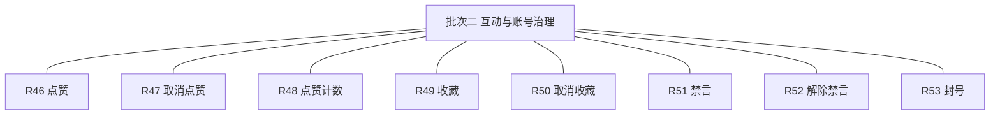

**认领条目表**（需求名、用途、验收标准逐字引自 02 批次二需求表）：

| 编号 | 需求名 | 用途 | 验收标准 |
|---|---|---|---|
| R46 | 点赞 | 会员对已公开内容点赞 | 会员对话题或评论点赞成功后点赞计数加一，同一会员重复点赞不产生重复记录 |
| R47 | 取消点赞 | 撤销点赞 | 会员取消点赞后计数即时减一，再次点赞可重新生效 |
| R48 | 点赞计数 | 展示赞同数 | 已公开话题与评论展示当前点赞数，与点赞关系记录一致 |
| R49 | 收藏 | 收藏已公开话题 | 会员收藏话题成功后收藏关系建立，重复收藏幂等提示已收藏；收藏列表界面随 0.5 交付 |
| R50 | 取消收藏 | 取消收藏关系 | 会员取消收藏后该话题不再保留收藏关系 |
| R51 | 禁言 | 版主对违规会员禁言 | 版主选择会员与禁言期限（1／3／7／30 天，默认 7 天，本版定案·行业惯例默认）执行后，该会员不能发表话题与评论，处置留痕并通知当事人 |
| R52 | 解除禁言 | 提前解除禁言 | 版主解除禁言后该会员立即恢复发言，期限届满自动解除无需人工操作，解除留痕 |
| R53 | 封号 | 版主对严重违规会员封号 | 版主执行封号后该会员登录被拒绝并失去全部发言能力（终态），处置留痕并通知当事人 |

**锚定说明**：本表为全文档唯一锚源，第 4 章各条目细化不得与本表冲突、不得收窄或放宽验收；验收按本表逐条打钩。

## 3. 核心用户旅程

**旅程承接说明**：大版本 PRD 旅程二的互动段（点赞与收藏）在本版落地——v0.2.0 旅程二只含评论与通知段，本版补齐互动段；账号治理为本版新增关键单端流程成一条旅程（处置涉及版主与会员双方，用时序图表达处置与通知交接）。

### 3.1 旅程（互动段承接）：会员点赞与收藏（会员·前台单端）

会员在已公开话题详情对话题与评论点赞，计数即时加一并可再次取消减一；对话题收藏成功后操作位变为已收藏，重复收藏提示已收藏，取消后可再次收藏——互动仅作用于已公开内容，未公开与已删除内容不可互动。

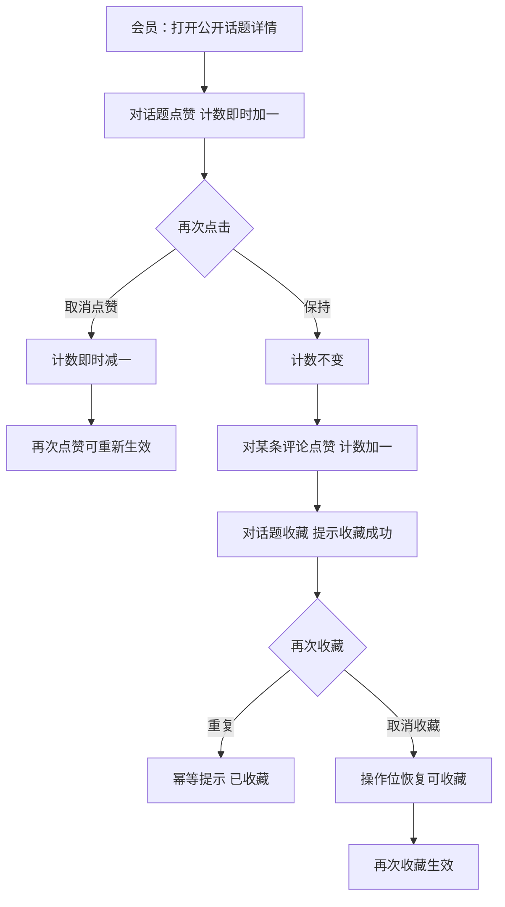

操作步骤清单：1. 打开公开话题详情；2. 点赞话题核对计数加一；3. 取消再点核对减一与重生效；4. 对评论点赞；5. 收藏话题、重复收藏核对幂等提示、取消后再次收藏。

### 3.2 旅程：版主处置违规会员（版主与会员·跨主体）

版主从待审队列条目或已公开内容的作者处进入处置面板，选择会员与禁言期限执行禁言——该会员发言立即被拒并收到通知；期限届满自动解除无需人工，版主也可提前解除（留痕并通知）；对严重违规者执行封号（二次确认），该会员登录被拒且通知送达，终态不可恢复。

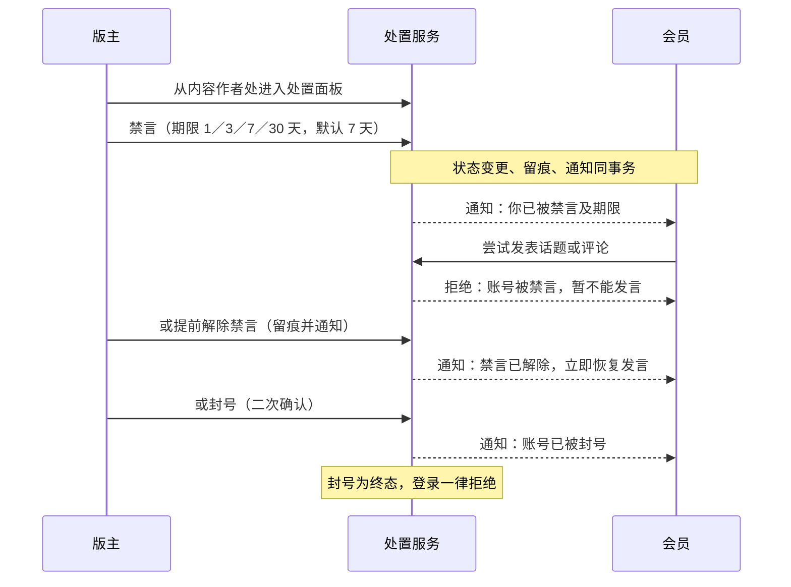

操作步骤清单：1. 版主从待审队列或内容作者处打开处置面板；2. 选择会员与禁言期限执行禁言；3. 以该会员账号验证发言被拒；4. 提前解除或等待期满自动解除，验证恢复发言；5. 对严重违规账号执行封号并验证登录被拒（终态）。

## 4. 功能需求

### 4.0 功能总览

**对象归组树**（版本→对象→条目）：

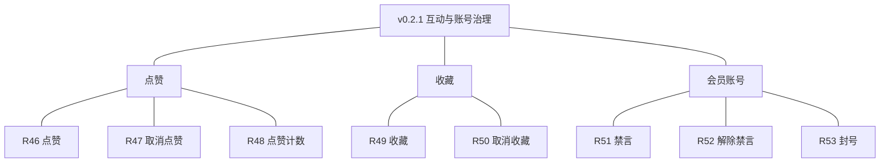

**对象增删改查矩阵**：

| 对象 | 增 | 改 | 删 | 查 |
|---|---|---|---|---|
| 点赞 | R46（点赞） | 不做（关系只增删不改） | R47（取消） | R48（计数展示） |
| 收藏 | R49（收藏） | 不做 | R50（取消） | 随 0.5（我的收藏列表） |
| 会员账号 | 随 v0.1.0 已交付 | R51／R52／R53（状态流转处置） | 随 0.5（注销） | 处置入口定位（待审队列与内容作者处，独立会员搜索随 0.6） |

**主体使用面**：

| 主体／角色 | 端 | 使用条目 | 机制条目 |
|---|---|---|---|
| 会员 | 电脑端网页、手机端网页 | R46、R47、R49、R50（互动）；作为当事人接收 R51～R53 通知 | 点赞唯一约束幂等（效果＝计数不重复）；期满自动解除（定时任务，效果＝状态回正常）；点赞计数冗余可校正 |
| 版主 | 管理后台 | R51、R52、R53 | 同上（处置侧） |

### 4.1 R46 点赞

**功能说明**：会员对已公开内容的赞同表达。触发：会员在话题或评论的点赞操作位点击。

**交互与流程**：

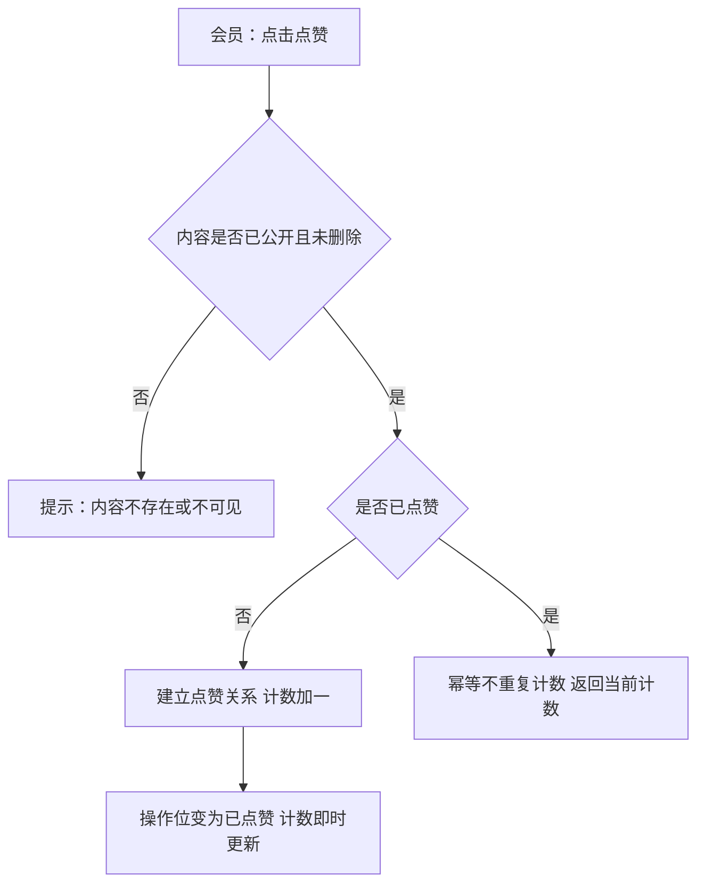

操作步骤清单：1. 打开公开话题详情；2. 对话题或评论点击点赞；3. 核对计数加一与操作位状态；4. 重复点击核对不重复计数。

**字段与校验**：

| 字段 | 必填 | 业务类型 | 落库字段名 | 约束与取值 |
|---|---|---|---|---|
| 会员 | 是（上下文） | 关联 | member_id | 当前会员 |
| 内容类型 | 是 | 类型 | content_type | 话题／评论 |
| 内容标识 | 是 | 关联 | content_id | 对应表主键；与 member_id＋content_type 联合唯一 |

**规则与边界**：(1) 点赞成功后计数加一，同一会员重复点赞不产生重复记录（验收锚，唯一约束保证）；(2) 仅已公开内容可点赞；(3) 点赞关系与计数同事务写入，计数为冗余值可由关系重算；(4) 访客点赞被引导注册登录。

**异常与拦截**：内容未公开或已删除→「内容不存在或不可见」；未登录→「登录后参与互动」引导。

### 4.2 R47 取消点赞

**功能说明**：撤销已有点赞。触发：会员在已点赞的操作位再次点击（取消）。

**交互与流程**：

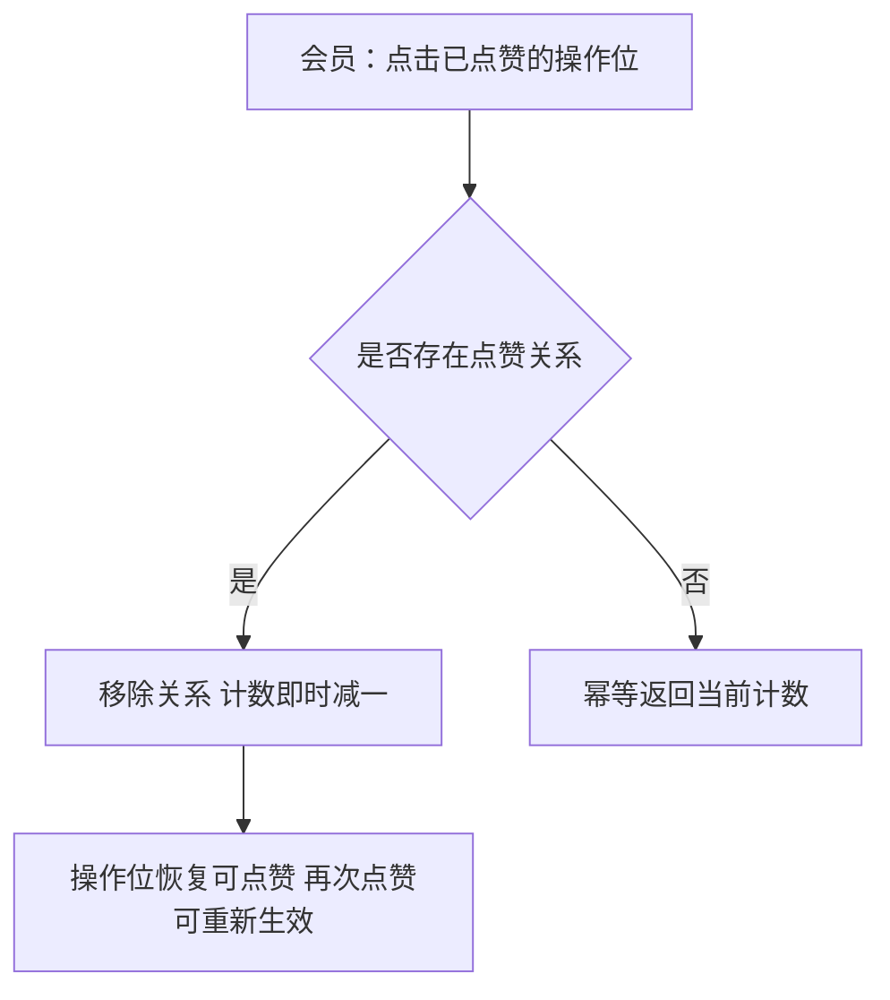

操作步骤清单：1. 点击已点赞操作位；2. 核对计数减一；3. 再次点赞核对重新生效。

**字段与校验**：操作对象＝点赞关系（member_id＋content_type＋content_id）；无新增信息项。

**规则与边界**：(1) 取消后计数即时减一，再次点赞可重新生效（验收锚）；(2) 内容已删除时取消请求幂等成功、不报错（关系随删除清理挂点，沿用 v0.2.0）。

**异常与拦截**：未点赞时取消→幂等返回当前计数（不提示错误）。

### 4.3 R48 点赞计数

**功能说明**：公开内容赞同数的展示机制。触发：话题与评论渲染时，以及点赞与取消操作后。

**交互与流程**：

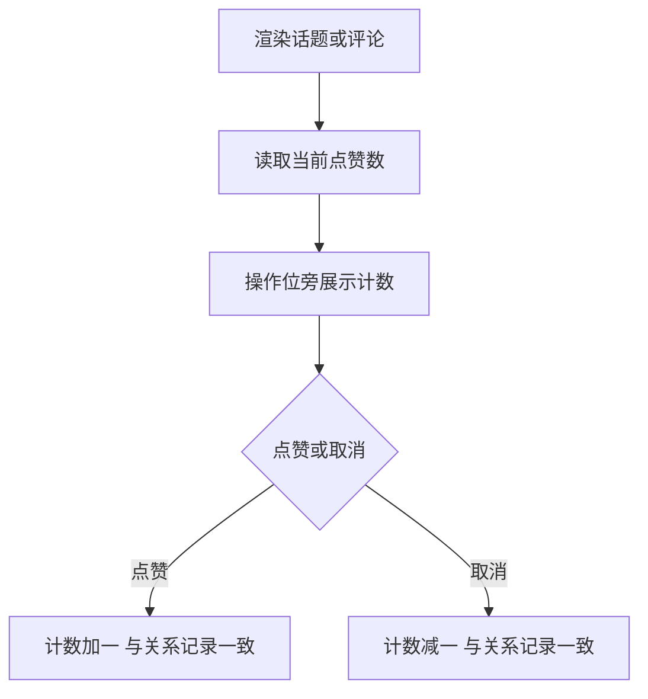

操作步骤清单（机制无独立操作）：1. 详情与列表渲染计数；2. 操作后即时更新核对。

**字段与校验**：

| 字段 | 必填 | 业务类型 | 落库字段名 | 约束与取值 |
|---|---|---|---|---|
| 话题点赞数 | 是 | 计数 | like_count | 话题表（v0.2.0 先行展示位自此有真实取值） |
| 评论点赞数 | 是 | 计数 | like_count | 评论表（本版新增字段） |

**规则与边界**：(1) 已公开话题与评论展示当前点赞数，与点赞关系记录一致（验收锚）；(2) 计数不参与可见性与排序判定（沿用大版本口径）；(3) 计数与关系同事务，重算可校正。

**异常与拦截**：计数与关系不一致（异常场景）→以关系记录为准，后台校正任务修复（本版采用）。

### 4.4 R49 收藏

**功能说明**：会员收藏已公开话题。触发：会员在话题详情或列表的收藏操作位点击。

**交互与流程**：

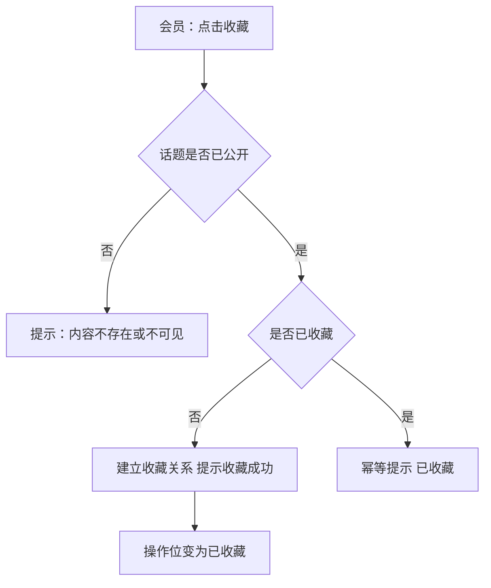

操作步骤清单：1. 打开公开话题；2. 点击收藏核对成功提示；3. 重复收藏核对幂等提示。

**字段与校验**：

| 字段 | 必填 | 业务类型 | 落库字段名 | 约束与取值 |
|---|---|---|---|---|
| 会员 | 是（上下文） | 关联 | member_id | 当前会员 |
| 话题 | 是 | 关联 | topic_id | 已公开话题；与 member_id 联合唯一 |

**规则与边界**：(1) 收藏成功后收藏关系建立，重复收藏幂等提示已收藏（验收锚）；(2) 收藏列表界面随 0.5 交付，本版仅操作位即时反馈；(3) 仅已公开话题可收藏（评论与问答内容收藏随后续版本评审，本版不做）。

**异常与拦截**：话题未公开或已删除→「内容不存在或不可见」；未登录→「登录后参与互动」。

### 4.5 R50 取消收藏

**功能说明**：解除收藏关系。触发：会员在已收藏的操作位点击取消。

**交互与流程**：

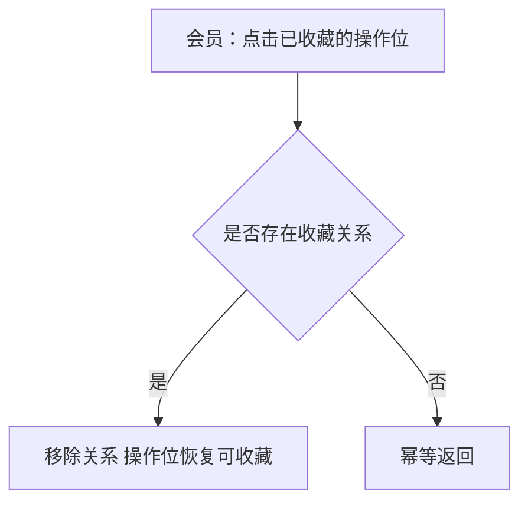

操作步骤清单：1. 点击取消收藏；2. 核对操作位恢复；3. 再次收藏核对可重新建立。

**字段与校验**：操作对象＝收藏关系（member_id＋topic_id）；无新增信息项。

**规则与边界**：(1) 取消后该话题不再保留收藏关系（验收锚）；(2) 话题被删除后取消请求幂等成功。

**异常与拦截**：未收藏时取消→幂等返回（不提示错误）。

### 4.6 R51 禁言

**功能说明**：版主对违规会员的发言限制处置。触发：版主从待审队列条目或已公开内容的作者处进入处置面板，选择会员与禁言期限执行。

**交互与流程**：

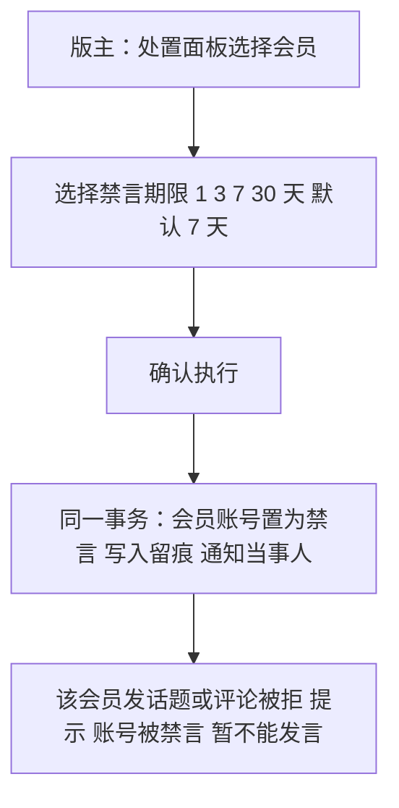

操作步骤清单：1. 从待审队列或内容作者处打开处置面板；2. 选择会员与期限；3. 确认执行；4. 以该账号验证发言被拒与通知送达。

**字段与校验**：

| 字段 | 必填 | 业务类型 | 落库字段名 | 约束与取值 |
|---|---|---|---|---|
| 会员 | 是 | 关联 | member_id | 被处置会员 |
| 禁言期限 | 是 | 期限 | mute_until | 1／3／7／30 天，默认 7 天（本版定案，行业惯例默认）；落库为禁言截止时间 |
| 处置原因 | 否 | 文本 | punish_reason | ≤200 字符（术语表 §7；选填，本版采用） |

**规则与边界**：(1) 执行后该会员不能发表话题与评论，处置留痕并通知当事人（验收锚）；(2) 禁言期限四选一为本版定案（大版本 PRD 5.5 沿用）；(3) 禁言覆盖发表类行为，读取浏览不受影响；(4) 处置入口定位会员＝待审队列条目与已公开内容的作者处（本版采用，独立会员搜索随 0.6）；(5) 状态变更、留痕（operation_log）、通知（notify_type＝禁言，本版新定）同事务。

**异常与拦截**：对已封号会员禁言→拦截「该账号已封号，无需禁言」；重复禁言→以新期限覆盖并留痕（本版采用）。

### 4.7 R52 解除禁言

**功能说明**：恢复被禁言会员的发言能力。触发：版主在处置面板对该会员点击「解除禁言」，或禁言期限届满由系统自动解除。

**交互与流程**：

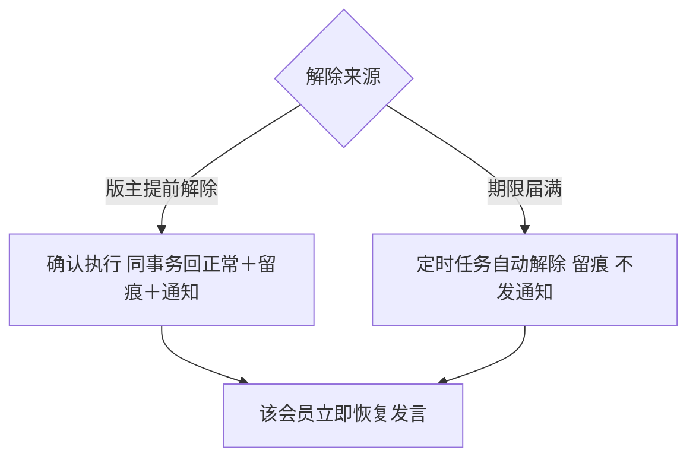

操作步骤清单：1. 版主对禁言中会员点击解除；2. 核对该会员立即恢复发言与通知送达；3. 演练期满场景验证自动解除。

**字段与校验**：操作对象＝会员账号状态（status）与 mute_until；解除时清空 mute_until。

**规则与边界**：(1) 版主解除后立即恢复发言，期限届满自动解除无需人工操作，解除留痕（验收锚）；(2) 自动解除由定时任务扫描 mute_until（沿用 K 定时任务可重入口径）；(3) 解除通知仅人工解除发送（notify_type＝解除禁言，本版新定），自动解除不发通知（本版采用）。

**异常与拦截**：对非禁言状态会员解除→幂等返回「该账号未处于禁言状态」。

### 4.8 R53 封号

**功能说明**：版主对严重违规会员的终态处置。触发：版主在处置面板对该会员点击「封号」并通过二次确认。

**交互与流程**：

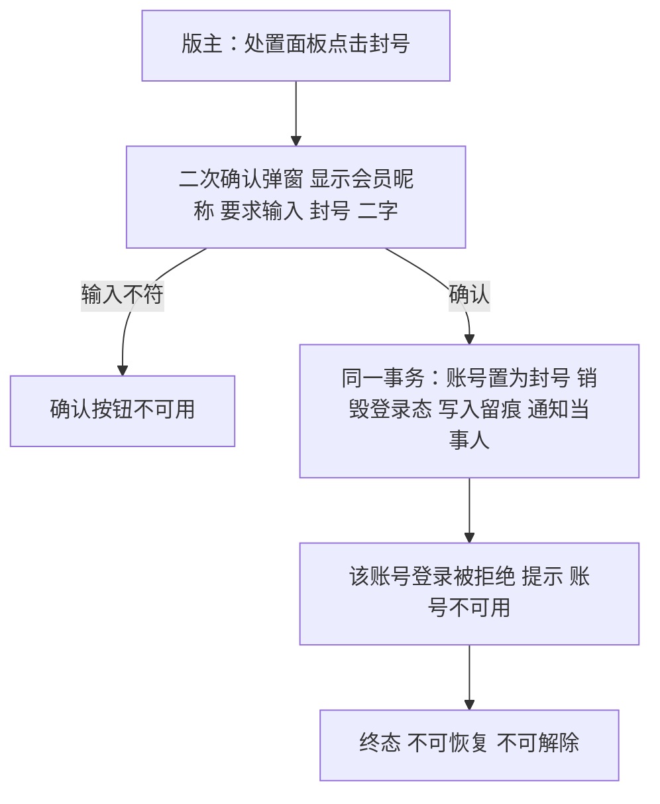

操作步骤清单：1. 点击封号并按弹窗输入「封号」确认；2. 以该账号验证登录被拒；3. 核对通知送达与留痕。

**字段与校验**：

| 字段 | 必填 | 业务类型 | 落库字段名 | 约束与取值 |
|---|---|---|---|---|
| 状态 | —（操作对象） | 状态 | status | 置为封号（终态，术语表） |
| 处置原因 | 否 | 文本 | punish_reason | ≤200 字符（选填，本版采用） |
| 封号确认 | 是 | 确认输入 | —（不落库） | 输入「封号」二字（与 v0.1 注销同口径，本版采用） |

**规则与边界**：(1) 执行后该会员登录被拒绝并失去全部发言能力（终态），处置留痕并通知当事人（验收锚）；(2) 封号不可解除，如需恢复只能重新注册（沿用项目 PRD 口径）；(3) 该账号已公开内容按保留策略保留展示（沿用 0.2 大版本口径）；(4) 处置人为版主（PRD 功能全景·违规处置）。

**异常与拦截**：重复封号→幂等返回「该账号已封号」；对封号账号解除禁言→拦截「该账号已封号」。

## 5. 业务对象与数据字段

**数据主体清单**：

| 业务对象 | 落库名 | 定位与关系 |
|---|---|---|
| 点赞 | like_record | 会员对已公开话题／评论的赞同关系；member_id＋content_type＋content_id 联合唯一 |
| 收藏 | favorite | 会员对已公开话题的收藏关系；member_id＋topic_id 联合唯一 |
| 会员账号 | member_account（沿用 v0.1） | 本版新增禁言与封号状态流转及 mute_until 字段 |
| 通知提醒 | notification（沿用 v0.2.0） | 本版新增通知类型：禁言／解除禁言／封号（本版新定） |
| 操作留痕 | operation_log（沿用机制态） | 禁言、解除禁言、封号处置留痕 |

**点赞（like_record）字段表**：

| 字段 | 必填 | 业务类型 | 落库字段名 | 约束与取值 |
|---|---|---|---|---|
| 主键 | 是 | 编号 | id | 自增整数 |
| 会员 | 是 | 关联 | member_id | 会员账号 |
| 内容类型 | 是 | 类型 | content_type | 话题／评论 |
| 内容标识 | 是 | 关联 | content_id | 对应表主键 |
| 建立时间 | 是 | 时间 | created_at | 通用审计字段 |

**收藏（favorite）字段表**：

| 字段 | 必填 | 业务类型 | 落库字段名 | 约束与取值 |
|---|---|---|---|---|
| 主键 | 是 | 编号 | id | 自增整数 |
| 会员 | 是 | 关联 | member_id | 会员账号 |
| 话题 | 是 | 关联 | topic_id | 已公开话题 |
| 建立时间 | 是 | 时间 | created_at | 通用审计字段 |

**会员账号（member_account，沿用扩展）字段表（本版新增字段）**：

| 字段 | 必填 | 业务类型 | 落库字段名 | 约束与取值 |
|---|---|---|---|---|
| 状态 | 是 | 状态 | status | 正常／禁言／封号（术语表；本版起三态全部生效） |
| 禁言截止时间 | 禁言时必填 | 时间 | mute_until | 禁言期限的落库表达；解除或期满清空；封号时置空 |

**通知提醒（notification，沿用扩展）**：notify_type 本版新增取值——禁言／解除禁言／封号（本版新定）；其余沿用 v0.2.0 字段表。

## 6. 待议与建议

**本版采用的推断与默认值汇总**（均已就地标明）：禁言期限 1／3／7／30 天默认 7 天（本版定案）、处置原因选填 ≤200 字符、封号二次确认输入「封号」二字、重复禁言以新期限覆盖、自动解除不发通知、点赞收藏仅作用于已公开内容且收藏仅限话题、处置入口定位会员经待审队列与内容作者处——以上为本版拍板或行业惯例默认，可随评审调整。

**待确认内容与影响**：点赞计数与关系不一致的后台校正任务形态（本版以关系为准，校正随运营复盘版本评审）；评论与问答内容的收藏能力（后续版本评审）。

**建议回池的新想法**：无。

**术语表待登记行**（随本文档回报、由主流程合入）：like_record（含 member_id／content_type／content_id）、favorite（含 member_id／topic_id）、mute_until、评论表 like_count、notify_type 新增取值（禁言／解除禁言／封号）。
