# PRD（大版本）：0.3 悬赏问答版

> 定位：本版立项说明书，承接路线图 0.3 条目与项目 PRD，把悬赏问答版范围落成带验收标准的功能需求、用户旅程与对象版本态，供需求拆解与小版本规划直接开工；上游为模拟案例材料，模拟性质予以保留。

## 1. 版本概述

**承接与目标**：承接路线图 0.3 悬赏问答版条目——悬赏问答闭环上线（含问答列表与搜索），积分与等级成为站内真实的激励与凭证，优质问答沉淀为可搜索的答案库。本版消费 0.2 的内容审核机制、通知提醒与互动能力（问答内容复用点赞），成长模块（积分账本与等级）自此上线并为 v0.2.0 先行就绪的等级／积分可见条件接入判定。

**成功标准与量化口径**：

- 口径一（问答闭环全通过）：演练路径「提问并设悬赏 → 另一会员作答 → 采纳最佳答案 → 积分结算到账并通知双方」与「悬赏到期无人被采纳 → 自动退回并通知」两条全链路 100% 走通——本版无人工替代入口，任一步失败按链路异常排查（从路线图完成标志推导）。
- 口径二（账实一致）：任意时点积分账户余额＝按流水重算值（判定方式＝抽样重算比对，判定线 100%）；悬赏状态与问题状态一一对应（待结算↔待解答、已结算↔已采纳、已撤回↔已关闭）。
- 口径三（激励验证口径）：首批问题中被采纳的比例与参与作答人数达到本版立项时约定的数值口径——数值未定，列入立项依赖（路线图验证假设沿用，不阻塞拆解）。

**本版定案值**（路线图依赖行声明的唯一归属时点，先从版本事实推导、无事实依据的按行业惯例拍板并标明）：悬赏到期时限默认 14 天（行业惯例默认）；悬赏积分取值 10～500、步长 10（行业惯例默认）；行为积分值——注册＋10、话题被公开＋5、评论被公开＋2、问题被公开＋5、答案被公开＋5、答案被采纳按悬赏结算入账、发起悬赏按悬赏额出账（行业惯例默认）；等级门槛——Lv1 新手上路 0、Lv2 初级会员 50、Lv3 中级会员 200、Lv4 高级会员 500、Lv5 资深会员 1500（门槛须递增，行业惯例默认）；板块呈现——同一板块容纳讨论与问答两类内容，前台分设「讨论／问答」标签页入口（本版定案，回应路线图依赖行的讨论区与问答区之问）。

**范围一句话**：做——问答与悬赏闭环（提问含悬赏预扣、追加补充、编辑、作答与补充、采纳结算、到期退回、关闭、问答列表与搜索、悬赏展示）、成长模块（账户开立、积分入账／出账与预扣、流水记录、等级判定与变更）、等级与积分规则配置；不做——私信与关注（随 0.4）、个人中心的积分与等级展示及注销（随 0.5，过渡：余额与流水经接口可查，个人中心聚合面随 0.5）、积分人工修正（随 0.7，过渡：异常账目以流水追溯排查）、举报与治理侧删除（随 0.6）、问答内容的收藏（v0.2.1 拍板收藏仅限话题，本版沿用，扩展能力列入待议回池）。

**沿用与前置**：前置版本 0.1、0.2（均已发布）——沿用统一鉴权、先审后发队列与审核策略、通知写入、点赞（content_type 取值本版扩展至问题／答案）；等级／积分可见条件自本版起由成长模块接入判定（v0.2.0 先行基座回验）。

## 2. 主体与角色

**上场主体总览树**：

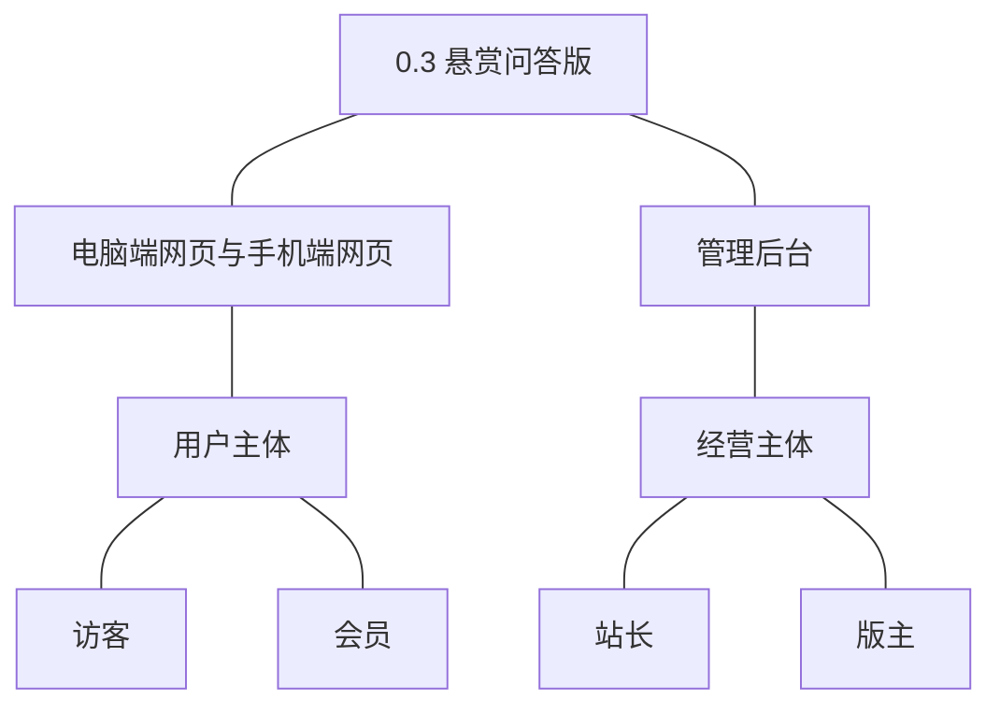

**主体表**：

| 主体 | 角色 | 端 | 怎么用系统 |
|---|---|---|---|
| 用户主体 | 访客 | 电脑端网页、手机端网页 | 浏览问答列表与详情、关键词搜索答案库 |
| 用户主体 | 会员 | 电脑端网页、手机端网页 | 提问并设悬赏、追加补充、作答与补充、采纳最佳答案、点赞问答内容、查看悬赏与通知 |
| 经营主体 | 站长 | 管理后台 | 配置行为积分值与等级门槛 |
| 经营主体 | 版主 | 管理后台 | 经沿用 0.2 的待审队列审核问题、追加与答案（问答内容进入同一队列，无新增操作面） |

**裁剪说明**：运营人员在本版无新增操作面（会员与内容查询维护随 0.6）；提问人与答题人同为会员的两类身份在问答闭环中成对出现（不能自采纳）；等级与积分的运营报表随 0.7。

## 3. 核心业务流程

**旅程覆盖说明**：两条跨主体旅程（提问经审核公开并预扣、作答与采纳结算）用顺序图，两条单端旅程（悬赏到期退回、访客问答浏览与搜索）用流程图；规则配置为简单操作型功能不成旅程。

### 3.1 旅程一：提问并设置悬赏经审核公开（会员与版主·跨主体）

会员进入问答入口填写标题与正文、设定悬赏积分（余额不足被拒），提交时同一事务预扣积分并写入出账流水，问题进入待审核；版主在沿用 0.2 的待审队列作出结论——通过则问题公开为待解答、悬赏生效，驳回则冲正退回预扣并通知提问人。

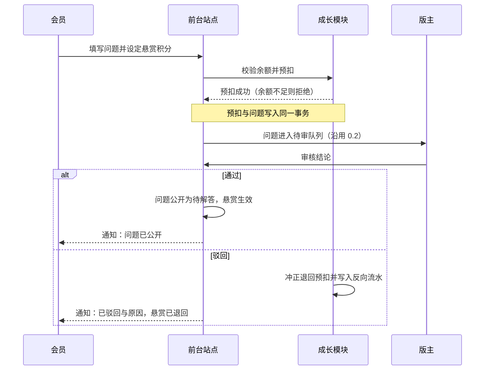

操作步骤清单：1. 会员进入问答入口；2. 填写标题与正文并设定悬赏积分；3. 提交（余额不足按提示调整）；4. 版主在待审队列处理；5. 通过后问题公开，驳回则积分退回。

### 3.2 旅程二：作答与采纳结算（提问会员、答题会员与版主·跨主体）

待解答问题公开后，其他会员提交答案（先审后发，公开后通知提问人）；提问人从已公开答案中采纳一个最佳答案——悬赏状态、答题人积分入账与双方流水在同一事务完成，双方收到通知，问题进入已采纳终态。

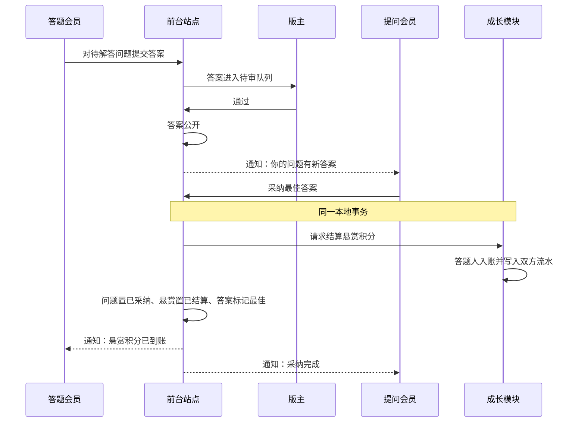

操作步骤清单：1. 答题会员提交答案；2. 版主审核通过后答案公开；3. 提问人查看答案并采纳一个最佳答案；4. 双方核对积分流水与通知；5. 核对问题与悬赏终态。

### 3.3 旅程三：悬赏到期退回（系统与提问人·定时）

悬赏到期（默认 14 天）仍无人被采纳时，系统定时任务扫描到期待结算悬赏：跳过已采纳项，对到期项在同一事务内冲正退回预扣积分、写入反向流水，悬赏置已撤回、问题置已关闭，通知提问人。

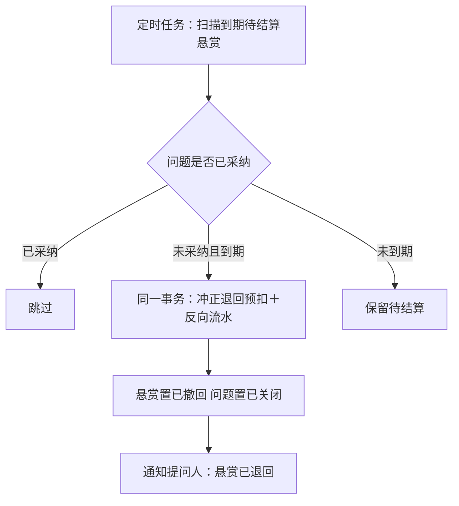

操作步骤清单（系统自动，人工仅核对）：1. 核对到期扫描不重复退回（可重入）；2. 核对积分退回与反向流水；3. 核对问题终态与通知。

### 3.4 旅程四：访客问答浏览与搜索（访客·单端）

访客从问答入口按板块与时间浏览已公开问题，进入详情阅读正文、追加补充、答案列表与悬赏状态（最佳答案置顶），或用关键词检索问题与答案——待审核与已驳回内容不出现在任何入口，优质问答沉淀为可搜索的答案库。

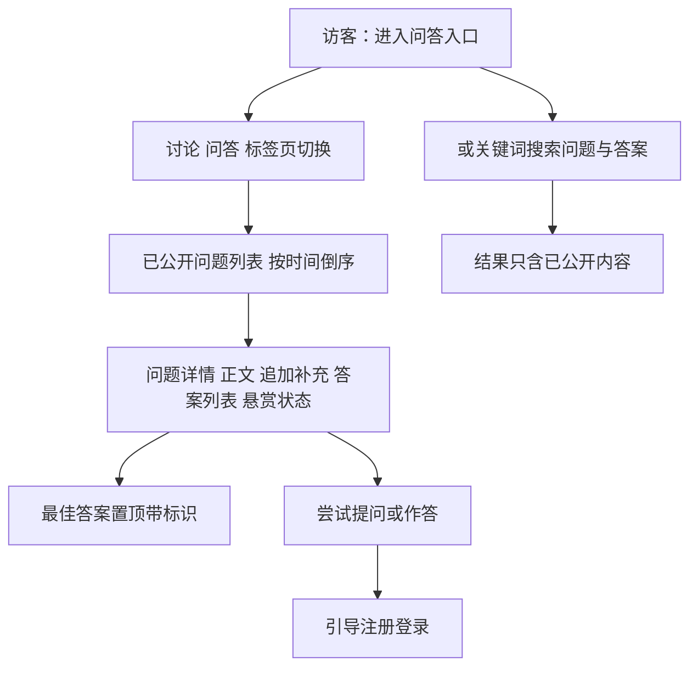

操作步骤清单：1. 进入问答入口；2. 浏览问题列表或搜索；3. 进入详情阅读答案与悬赏状态；4. 参与时注册。

## 4. 功能需求

**功能全景总图**：

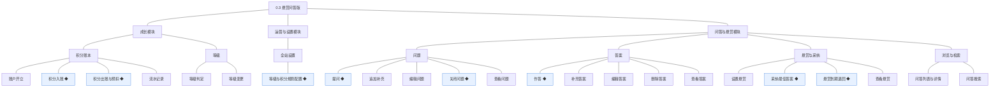

### 4.1 成长模块

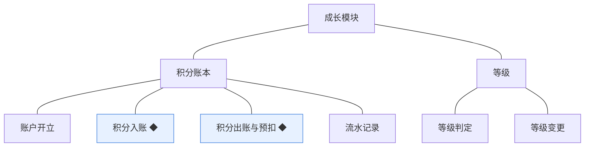

**积分账本**：站内价值凭证的唯一账本，任何余额变动经本模块并留流水（K 沿用）。

| 功能 | 用途 | 验收标准 |
|---|---|---|
| 账户开立 | 会员账本建立 | 会员注册时同一事务开立余额为零的积分账户，存量会员随本版升级补开；账户与会员一对一 |
| 积分入账 ◆ | 行为与结算积分收入 | 行为积分（注册、话题／评论／问题／答案被公开、答案被采纳结算）按规则值入账，余额与流水同事务写入，余额可由流水重算 |
| 积分出账与预扣 ◆ | 悬赏积分支出 | 提问设置悬赏时预扣（余额不足拒绝提交），采纳时转出给答题人，驳回／关闭／到期时冲正退回；任何时点余额不得为负 |
| 流水记录 | 每笔变动留痕 | 每次积分变动写入一条流水（来源类型、方向、数值、关联对象），只增不改，冲正以反向流水表达 |

**等级**：成长分层，本版起为前台展示与可见条件判定供数。

| 功能 | 用途 | 验收标准 |
|---|---|---|
| 等级判定 | 按积分判级 | 积分变动后按门槛（Lv1 0／Lv2 50／Lv3 200／Lv4 500／Lv5 1500，本版定案）即时判定，判定结果供等级展示与等级／积分可见条件读取（v0.2.0 先行基座接入） |
| 等级变更 | 等级生效 | 判定结果与原等级不同时即时变更并生效；规则变更不追溯已判等级 |

### 4.2 运营与设置模块

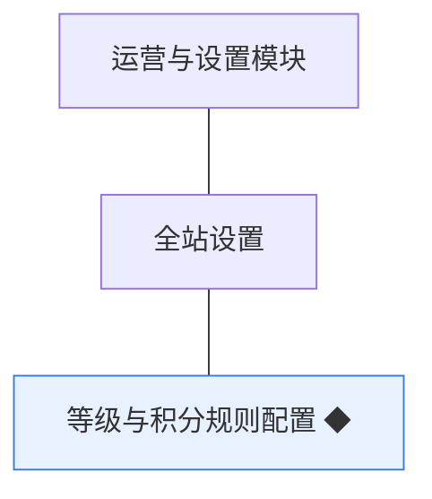

**全站设置**：等级与积分规则自此进入可配置（配置入口随本模块主题点亮）。

| 功能 | 用途 | 验收标准 |
|---|---|---|
| 等级与积分规则配置 ◆ | 站长维护激励规则 | 站长设定行为积分值与等级门槛保存后即时生效且不追溯已判等级，门槛须递增校验，变更留痕，重复保存相同值幂等 |

### 4.3 问答与悬赏模块

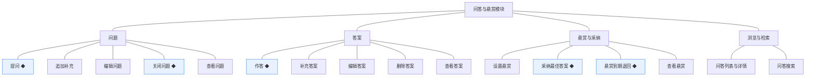

**问题**：先审后发沿用 0.2 队列；追加补充不改变悬赏金额。

| 功能 | 用途 | 验收标准 |
|---|---|---|
| 提问 ◆ | 会员发表问题并设置悬赏进入审核 | 会员填写标题与正文、设定悬赏积分（余额不足被拒）提交后，悬赏积分预扣并写入出账流水，问题进入待审核并出现在待审队列，结论前不可见；驳回时冲正退回并通知提问人 |
| 追加补充 | 提问人补充问题条件 | 提问人对已公开问题追加补充（≤2000 字符）保存后经审核公开并标注追加时间，不改变悬赏金额 |
| 编辑问题 | 提问人修改问题 | 提问人编辑待审核或已驳回问题保存后重新进入待审核；编辑已公开问题同样重新进入待审核，审核期间原文保留可见并标注审核中 |
| 关闭问题 ◆ | 终止问题等待 | 提问人关闭自己的问题或悬赏到期系统关闭后，问题进入已关闭终态不再接受作答；关闭时待结算悬赏按规则退回 |
| 查看问题 | 阅读问题与悬赏状态 | 问题详情展示标题、正文、追加补充、悬赏积分与状态（待解答／已采纳／已关闭），最佳答案优先展示 |

**答案**：作答、补充与编辑均先审后发；被采纳的答案锁定。

| 功能 | 用途 | 验收标准 |
|---|---|---|
| 作答 ◆ | 会员对问题作答 | 会员对待解答问题提交答案后进入待审核，通过后公开并通知提问人；提问人不能作答自己的问题 |
| 补充答案 | 作答人补充答案 | 作答人对自己的答案追加补充保存后经审核公开，不重复计答 |
| 编辑答案 | 作答人修改答案 | 作答人编辑自己的答案保存后重新进入待审核；被采纳的答案不能编辑 |
| 删除答案 | 作答人删除答案 | 作答人删除自己的答案后该答案不再可见；被采纳的答案不可删除 |
| 查看答案 | 阅读答案列表 | 问题详情按时间展示已公开答案，最佳答案置顶并带最佳标识 |

**悬赏与采纳**：悬赏三态与问题状态一一对应（口径二）。

| 功能 | 用途 | 验收标准 |
|---|---|---|
| 设置悬赏 | 提问时设定悬赏积分 | 提问人设定悬赏积分（10～500、步长 10，本版定案）后提交，积分预扣并写入流水；余额不足拒绝提交 |
| 采纳最佳答案 ◆ | 提问人采纳答案并结算 | 提问人采纳一个已公开答案后，悬赏积分在同一事务内结算给答题人并写入双方流水，通知双方，问题进入已采纳终态 |
| 悬赏到期退回 ◆ | 到期未采纳退回 | 悬赏到期（默认 14 天，本版定案）仍无人被采纳时，系统自动退回预扣积分并写入冲正流水，问题置为已关闭并通知提问人；同一悬赏不重复退回 |
| 查看悬赏 | 展示悬赏状态 | 问题详情与列表展示悬赏积分与状态（待结算／已结算／已撤回） |

**浏览与检索**：答案库的消费入口。

| 功能 | 用途 | 验收标准 |
|---|---|---|
| 问答列表与详情 | 浏览问答 | 前台问答入口按板块与时间展示已公开问题列表（含悬赏标识），进入详情可见答案列表与悬赏状态 |
| 问答搜索 | 检索问答 | 关键词搜索只返回已公开的问题与答案，待审核与已驳回不出现在结果中，优质问答沉淀为可搜索的答案库 |

## 5. 业务对象

**对象关系总览**：本版新上线问题、答案、悬赏、积分账户、积分流水、会员等级六个对象；会员账号沿用开账，话题／评论沿用接入行为积分，全站设置新增规则配置项，审核记录与通知提醒沿用扩展。

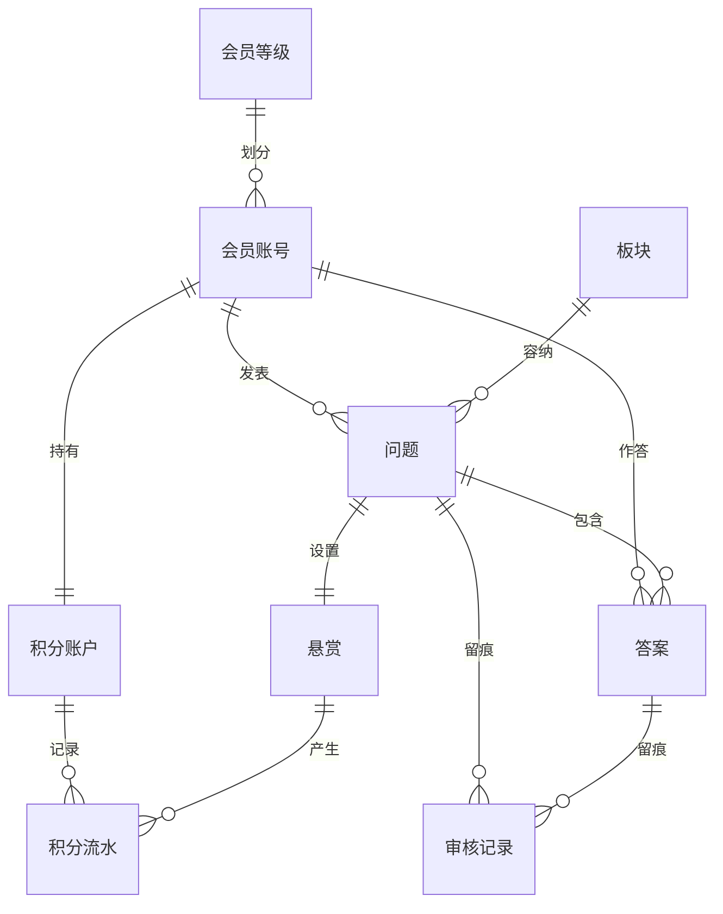

### 5.1 问题

定位：悬赏问答的提问主体，问答闭环的起点（术语表）。

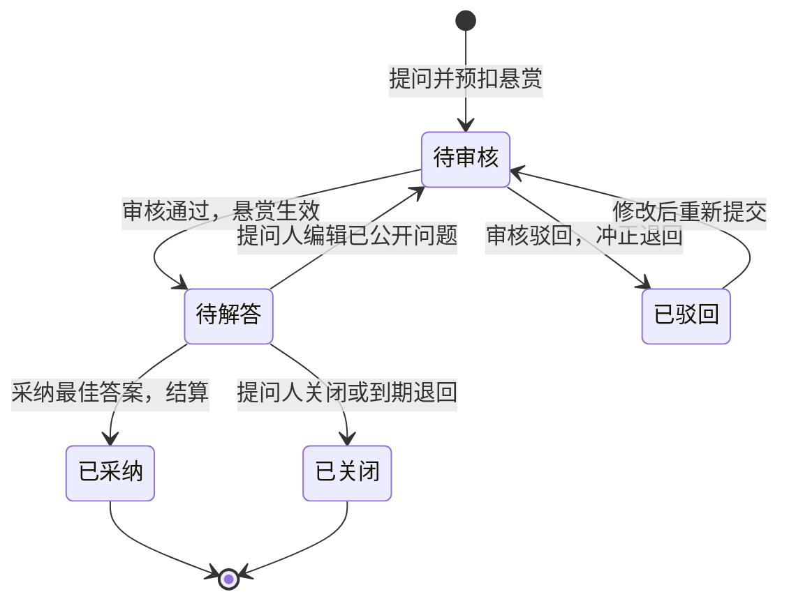

说明：状态机全量落地（沿用项目 PRD 骨架）；追加补充不改变状态与悬赏；编辑沿用 0.2 口径（原文保留可见＋审核中标注）。

### 5.2 答案

定位：对问题的作答，被采纳者成为最佳答案（术语表）。

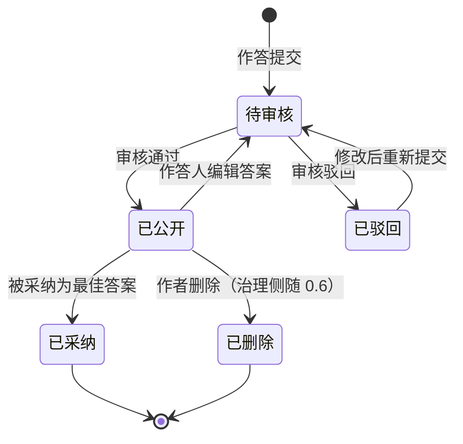

说明：被采纳的答案锁定（不可编辑、不可删除，治理处置随 0.6）；补充与编辑均回待审核。

### 5.3 悬赏

定位：提问人为问题设置的积分回报（术语表）。

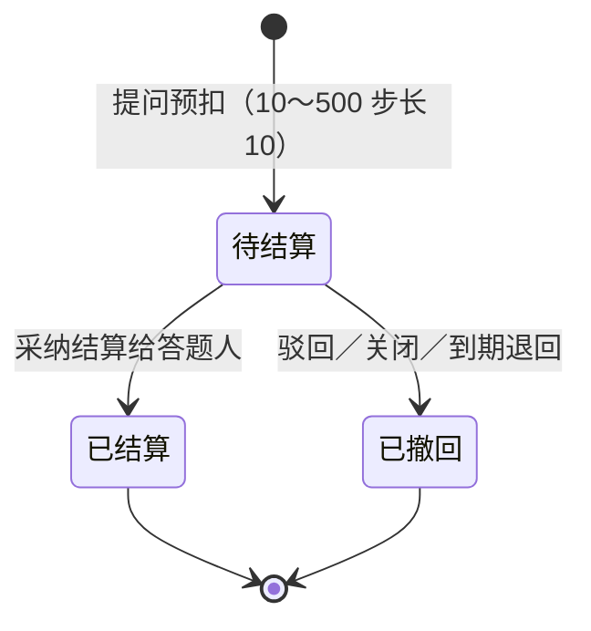

说明：与问题一一对应且状态联动（口径二）；退回一律冲正流水；同一悬赏只结算或退回一次（幂等）。

### 5.4 积分账户

定位：会员积分余额的账本（术语表）。

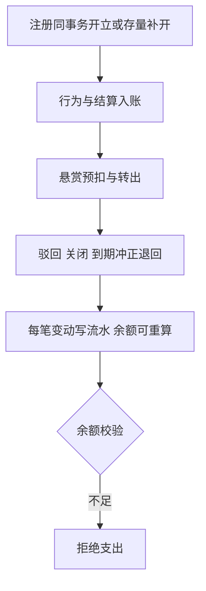

说明：一人一账户；余额不得为负；个人中心展示面随 0.5（本版经接口可查）。

### 5.5 积分流水

定位：积分每一次增减的记录（术语表）。

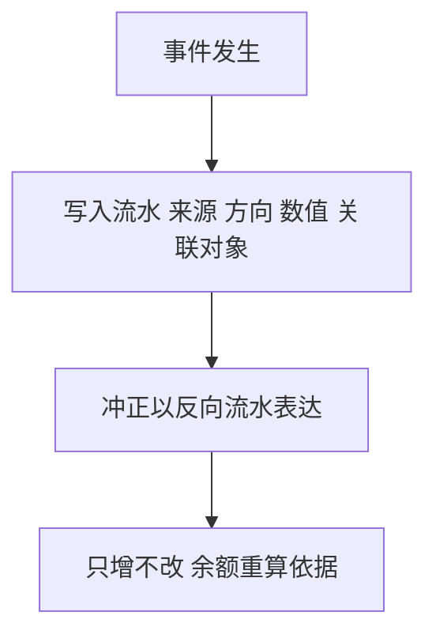

说明：来源类型含注册、话题／评论／问题／答案被公开、悬赏预扣、悬赏结算、悬赏退回（本版新定枚举）。

### 5.6 会员等级

定位：会员成长的分层（术语表）。

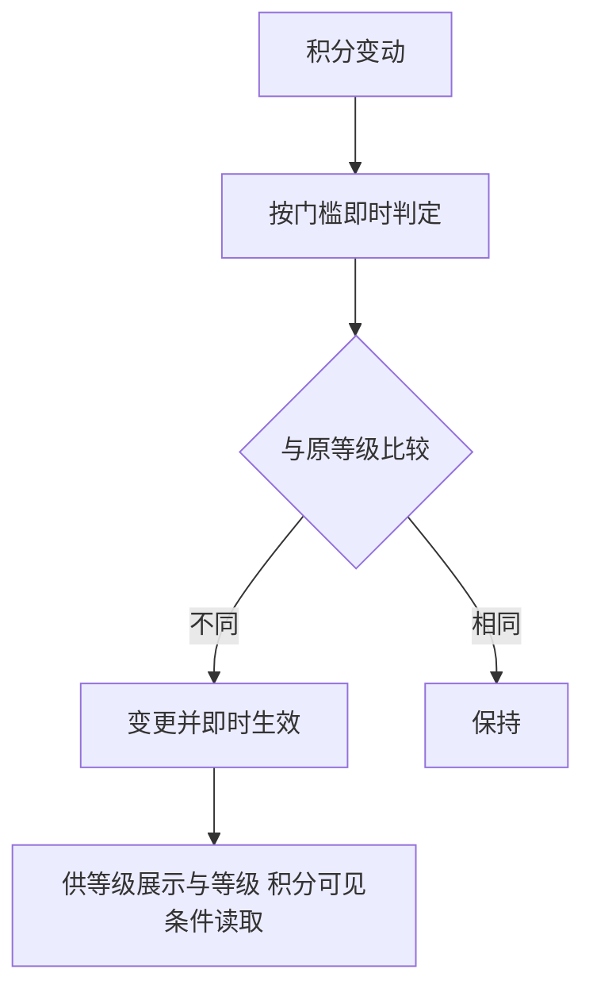

说明：判定由成长模块供数，v0.2.0 先行就绪的等级／积分可见条件自此接入生效（先行基座回验）；规则变更不追溯。

### 5.7 沿用对象接入路径（会员账号／话题／评论／全站设置／审核记录／通知提醒）

说明：会员账号沿用并一对一开立积分账户（0.1 注册会员随本版升级补开）；话题与评论被公开自此触发行为积分入账；全站设置新增等级与积分规则配置项（本版定案值作为初始配置）；审核记录沿用 0.2 队列承接问题／追加／答案审核；通知提醒新增类型——答案公开、悬赏结算、悬赏退回（本版新定，已登记术语表）；点赞 content_type 取值扩展至问题／答案（沿用 0.2 互动）。
