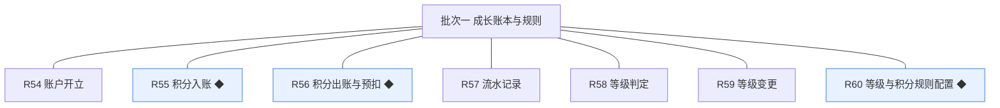
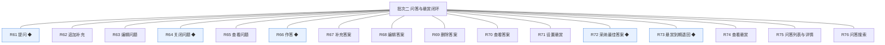

# 开发顺序与需求拆解（大版本）：0.3 悬赏问答版

> 定位：把大版本 PRD 转换为开发批次顺序＋功能级需求条目，本文即 0.3 悬赏问答版的完整需求清单（不另生成版本快照），需求池据此直接入池；上游为模拟案例材料，模拟性质予以保留。

## 1. 拆解说明

- **做什么**：把《PRD（大版本）0.3 悬赏问答版》的 23 项功能按依赖排成 2 个可独立验收的开发批次，每项功能转为一条可直接认领与验收的需求条目（R54～R76，编号承接此前的 R1～R53）。
- **一一同构口径**：一条需求＝一项 PRD 功能，需求名即 PRD 功能名（含 ◆ 标注），用途与验收标准逐字引自 PRD 功能清单、不压缩不改写；按钮、字段与跳转级的原子拆解归小版本开发，不进本文。
- **与需求池及小版本规划的关系**：本文是需求池的批量入池主入口但不是唯一入口——会议、沟通、临时反馈产生的需求可不经本文直接单条入池（M 编号）；小版本规划的输入＝本文开发顺序＋需求池实时状态两者合并，批次划分是建议而非锁定，实际认领以需求池为准。

## 2. 开发顺序

**前置版本沿用面**：0.1、0.2 均已发布——沿用统一鉴权与能力点判定、操作留痕、先审后发队列与审核策略（问答内容进入同一队列）、通知写入（本版新增类型随条目落地）、点赞（content_type 取值扩展至问题／答案）。

**开发批次总图**：

```mermaid
flowchart TB
    V[0.3 悬赏问答版]
    V --- B1[批次一 成长账本与规则] & B2[批次二 问答与悬赏闭环]
    B1 --- N54[R54 账户开立] & N55[R55 积分入账 ◆] & N56[R56 积分出账与预扣 ◆] & N57[R57 流水记录] & N58[R58 等级判定] & N59[R59 等级变更] & N60[R60 等级与积分规则配置 ◆]
    B2 --- N61[R61 提问 ◆] & N62[R62 追加补充] & N63[R63 编辑问题] & N64[R64 关闭问题 ◆] & N65[R65 查看问题] & N66[R66 作答 ◆] & N67[R67 补充答案] & N68[R68 编辑答案] & N69[R69 删除答案] & N70[R70 查看答案] & N71[R71 设置悬赏] & N72[R72 采纳最佳答案 ◆] & N73[R73 悬赏到期退回 ◆] & N74[R74 查看悬赏] & N75[R75 问答列表与详情] & N76[R76 问答搜索]
    classDef complex fill:#e7f1ff,stroke:#3b7ddd;
    class N55,N56,N60,N61,N64,N66,N72,N73 complex;
```

**批次推进链**：

**顺序依据与同事务契约**：积分引擎先于悬赏（路线图拆分纪律）——批次二全部悬赏路径依赖批次一的出账／入账／冲正接口与等级判定（04C-成长模块对外契约）；本版内需要共同成立的契约：提问预扣与问题写入同事务（04C-问答与悬赏模块 3.7）、采纳结算的悬赏状态／积分入账／双方流水／通知同一事务（04C-问答与悬赏模块 3.7）、到期退回的冲正流水与状态变更同事务且可重入（04C-问答与悬赏模块 3.7）、积分余额与流水同事务（04C-成长模块 3.4）；无外部联调点。

### 2.1 批次一：成长账本与规则

- **目标**：积分账本与等级引擎上线并可配置——账户开立（含存量会员补开）、行为与结算入账、出账与预扣冲正、流水留痕、等级判定与变更、规则配置。
- **依赖**：前置版本 0.1、0.2（会员账号与话题／评论公开事件作为行为积分触发源；全站设置承载规则配置项）。
- **可验收形态**：可演示——新注册会员同事务开立账户、存量会员补开；按规则入账与预扣冲正各演示一笔且余额＝流水重算值；等级判定即时生效并供可见条件读取（v0.2.0 先行基座回验）；站长配置规则幂等且不追溯。
- 判断注记：成长 6 条与规则配置 1 条合批——规则配置是账本与判级的取值来源，拆开则账本演示无口径（依赖强制）；批内顺序为账本先行、配置收口。

条目与 PRD 4.1、4.2 功能清单一一同构，用途与验收标准逐字引自原文：

| 编号 | 需求名 | 用途 | 验收标准 |
|---|---|---|---|
| R54 | 账户开立 | 会员账本建立 | 会员注册时同一事务开立余额为零的积分账户，存量会员随本版升级补开；账户与会员一对一 |
| R55 | 积分入账 ◆ | 行为与结算积分收入 | 行为积分（注册、话题／评论／问题／答案被公开、答案被采纳结算）按规则值入账，余额与流水同事务写入，余额可由流水重算 |
| R56 | 积分出账与预扣 ◆ | 悬赏积分支出 | 提问设置悬赏时预扣（余额不足拒绝提交），采纳时转出给答题人，驳回／关闭／到期时冲正退回；任何时点余额不得为负 |
| R57 | 流水记录 | 每笔变动留痕 | 每次积分变动写入一条流水（来源类型、方向、数值、关联对象），只增不改，冲正以反向流水表达 |
| R58 | 等级判定 | 按积分判级 | 积分变动后按门槛（Lv1 0／Lv2 50／Lv3 200／Lv4 500／Lv5 1500，本版定案）即时判定，判定结果供等级展示与等级／积分可见条件读取（v0.2.0 先行基座接入） |
| R59 | 等级变更 | 等级生效 | 判定结果与原等级不同时即时变更并生效；规则变更不追溯已判等级 |
| R60 | 等级与积分规则配置 ◆ | 站长维护激励规则 | 站长设定行为积分值与等级门槛保存后即时生效且不追溯已判等级，门槛须递增校验，变更留痕，重复保存相同值幂等 |

### 2.2 批次二：问答与悬赏闭环

- **目标**：问答与悬赏闭环全量可演示——提问含预扣、审核沿用、作答与补充、采纳结算、到期退回、关闭、问答列表与搜索、悬赏展示。
- **依赖**：批次一（出账／入账／冲正接口与等级判定）；0.2 的先审后发队列、通知写入与点赞（content_type 扩展）。
- **可验收形态**：可演示口径一路径（提问设悬赏→作答→采纳→结算到账并通知双方）与口径二路径（到期未采纳自动退回），问答列表与搜索只含已公开内容（答案库沉淀）。
- 判断注记：16 条为依赖强制的最小闭环——提问／作答／采纳／退回四条 ◆ 由同事务契约绑定不可拆（能合并演示的不拆批）；浏览检索与查看类随闭环同批交付。

条目与 PRD 4.3 功能清单一一同构，用途与验收标准逐字引自原文：

| 编号 | 需求名 | 用途 | 验收标准 |
|---|---|---|---|
| R61 | 提问 ◆ | 会员发表问题并设置悬赏进入审核 | 会员填写标题与正文、设定悬赏积分（余额不足被拒）提交后，悬赏积分预扣并写入出账流水，问题进入待审核并出现在待审队列，结论前不可见；驳回时冲正退回并通知提问人 |
| R62 | 追加补充 | 提问人补充问题条件 | 提问人对已公开问题追加补充（≤2000 字符）保存后经审核公开并标注追加时间，不改变悬赏金额 |
| R63 | 编辑问题 | 提问人修改问题 | 提问人编辑待审核或已驳回问题保存后重新进入待审核；编辑已公开问题同样重新进入待审核，审核期间原文保留可见并标注审核中 |
| R64 | 关闭问题 ◆ | 终止问题等待 | 提问人关闭自己的问题或悬赏到期系统关闭后，问题进入已关闭终态不再接受作答；关闭时待结算悬赏按规则退回 |
| R65 | 查看问题 | 阅读问题与悬赏状态 | 问题详情展示标题、正文、追加补充、悬赏积分与状态（待解答／已采纳／已关闭），最佳答案优先展示 |
| R66 | 作答 ◆ | 会员对问题作答 | 会员对待解答问题提交答案后进入待审核，通过后公开并通知提问人；提问人不能作答自己的问题 |
| R67 | 补充答案 | 作答人补充答案 | 作答人对自己的答案追加补充保存后经审核公开，不重复计答 |
| R68 | 编辑答案 | 作答人修改答案 | 作答人编辑自己的答案保存后重新进入待审核；被采纳的答案不能编辑 |
| R69 | 删除答案 | 作答人删除答案 | 作答人删除自己的答案后该答案不再可见；被采纳的答案不可删除 |
| R70 | 查看答案 | 阅读答案列表 | 问题详情按时间展示已公开答案，最佳答案置顶并带最佳标识 |
| R71 | 设置悬赏 | 提问时设定悬赏积分 | 提问人设定悬赏积分（10～500、步长 10，本版定案）后提交，积分预扣并写入流水；余额不足拒绝提交 |
| R72 | 采纳最佳答案 ◆ | 提问人采纳答案并结算 | 提问人采纳一个已公开答案后，悬赏积分在同一事务内结算给答题人并写入双方流水，通知双方，问题进入已采纳终态 |
| R73 | 悬赏到期退回 ◆ | 到期未采纳退回 | 悬赏到期（默认 14 天，本版定案）仍无人被采纳时，系统自动退回预扣积分并写入冲正流水，问题置为已关闭并通知提问人；同一悬赏不重复退回 |
| R74 | 查看悬赏 | 展示悬赏状态 | 问题详情与列表展示悬赏积分与状态（待结算／已结算／已撤回） |
| R75 | 问答列表与详情 | 浏览问答 | 前台问答入口按板块与时间展示已公开问题列表（含悬赏标识），进入详情可见答案列表与悬赏状态 |
| R76 | 问答搜索 | 检索问答 | 关键词搜索只返回已公开的问题与答案，待审核与已驳回不出现在结果中，优质问答沉淀为可搜索的答案库 |

**批次判断与边界取舍**：只拆两批——批次二对批次一的积分接口是硬依赖，必须后置；批次一内部 7 条（账本＋配置）与批次二内部 16 条各自可独立演示，不再细拆；无路径分批交付的条目，23 条均整条交付。

**版本级验收安排**：按 PRD 量化口径执行（问答闭环全通过 100%、账实一致重算比对 100%、悬赏与问题状态一一对应；激励验证数值口径立项时定值）；本版为内部能力版本、无对外发布台阶（站点已开站，问答入口上线形式随发布环节安排）。

## 3. 条目与 PRD 对应核对

- **一一同构声明**：条目数 23＝PRD 功能数 23，逐行对应、无归并无拆分；需求名（含 ◆）与 PRD 功能名逐字一致；用途与验收标准逐字引自 PRD 功能清单。
- **批次构成**：批次一 7 条（成长 6＋全站设置 1），批次二 16 条（问题 5＋答案 5＋悬赏与采纳 4＋浏览与检索 2）。
- **◆ 复杂条目清点**：共 8 条——批次一 3 条（R55 积分入账、R56 积分出账与预扣、R60 等级与积分规则配置），批次二 5 条（R61 提问、R64 关闭问题、R66 作答、R72 采纳最佳答案、R73 悬赏到期退回），与 PRD 总图高亮一致。
- **过渡支撑清点**：0 条；范围外事项（私信与关注随 0.4、个人中心展示与注销随 0.5、举报与治理删除随 0.6、积分人工修正随 0.7）按 PRD 范围一句话随后续版本；积分账本与等级判定为永久性基座能力（非过渡支撑）。

## 4. 与需求池和小版本规划的衔接

- **入池路径**：本文 R54～R76 已按批量入池登记进《需求池》，编号沿用、批次随本文继承。
- **多入口口径**：会议、沟通与临时反馈需求不经本文直接单条入池（M 编号起），两类条目并存互不覆盖。
- **小版本规划输入**：本文开发顺序＋需求池实时状态合并；简单场景直接采纳批次建议，唯一硬约束是本文声明的依赖与同事务契约不回退（批次二不得先于批次一认领开工）。
- **认领与细化原则**：认领时逐字携带本表用途与验收标准，开发级细化（交互、字段、边界）归小版本 PRD，本文不预写。
