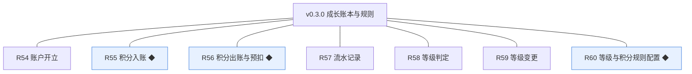
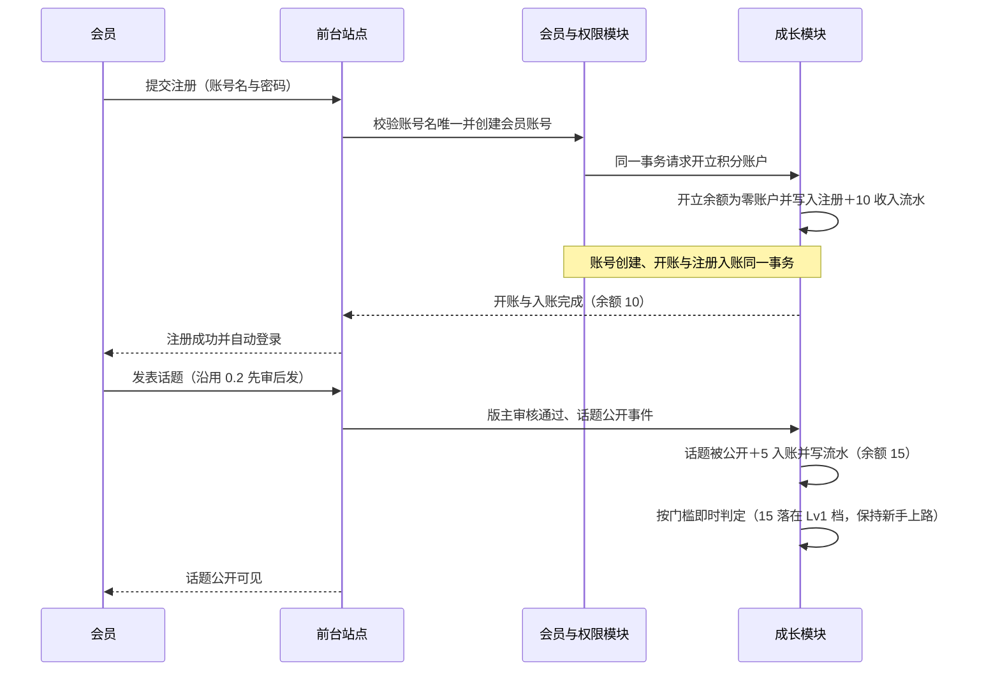
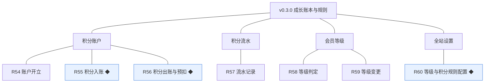
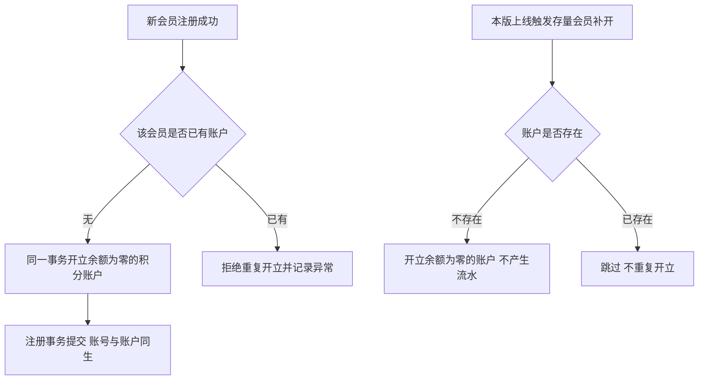
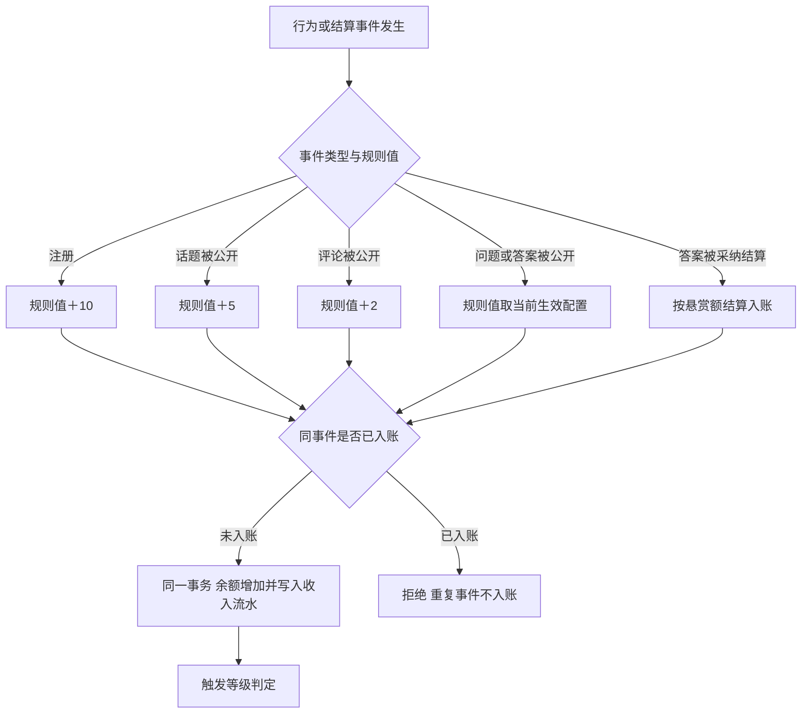
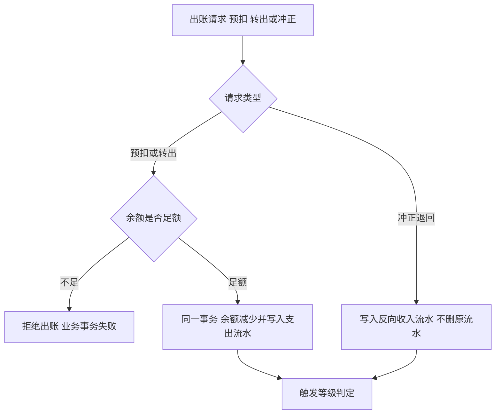
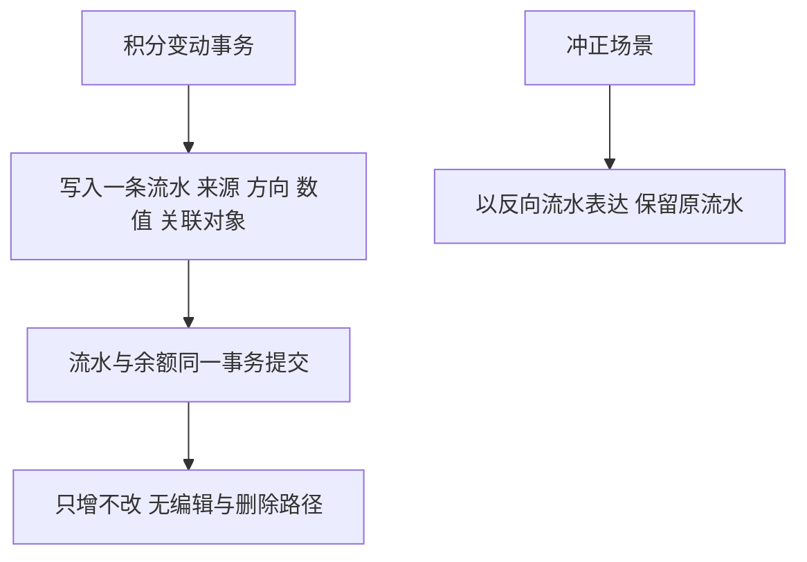
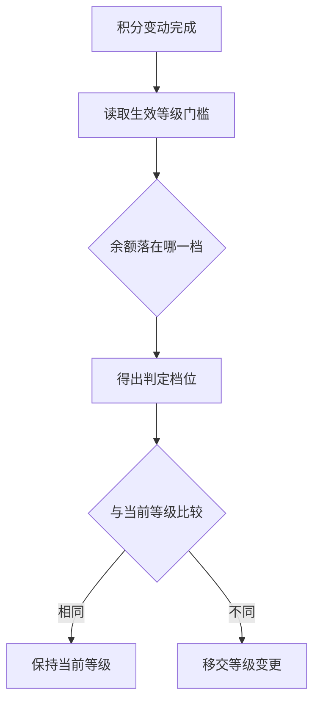
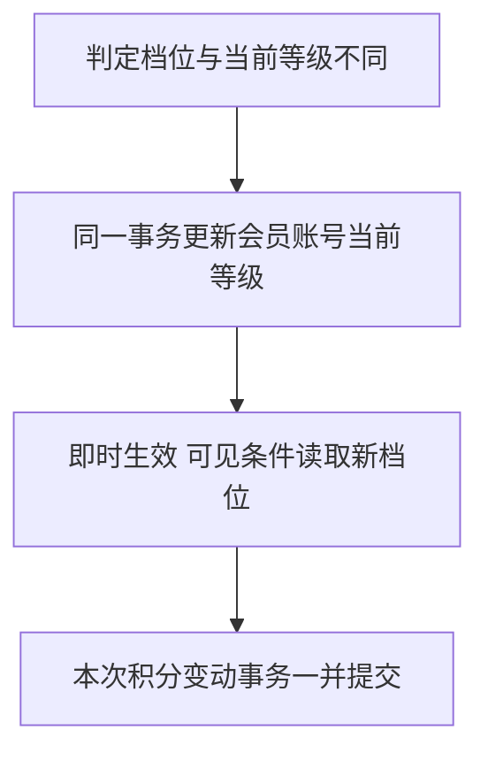
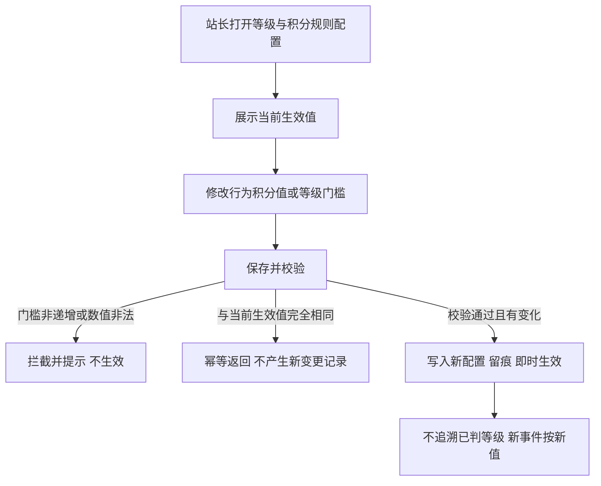

# PRD（小版本）：v0.3.0 成长账本与规则

> 定位：开发级需求说明书——承接大版本 PRD 0.3 悬赏问答版与其 02 批次一，认领自需求池（R54～R60，状态已迁移为已认领（v0.3.0））；用途与验收标准逐字锚定上游、只细化不改写；上游为模拟案例材料，模拟性质予以保留。

## 1. 版本概述

**承接与目标**：本版认领 0.3 悬赏问答版批次一「成长账本与规则」全部 7 条（R54～R60，简单场景采纳整批），交付积分账本与等级引擎并可配置——账户开立（含存量会员补开）、行为与结算入账、出账与预扣冲正、流水留痕、等级判定与变更、规则配置（0.3 PRD §1 目标的账本与规则部分）。本版可验收形态：新注册会员同事务开立账户、存量会员补开；按规则入账与预扣冲正各演示一笔且余额＝流水重算值；等级判定即时生效并供可见条件读取（v0.2.0 先行基座回验）；站长配置规则幂等且不追溯（上游 02 批次一可验收形态原文）。本版为内部能力版本、无对外发布台阶（0.3 PRD 版本级验收安排沿用）。

**范围外声明**：R61～R76（批次二问答与悬赏闭环）随 v0.3.1；悬赏问答的提问、作答、采纳与到期退回界面与事件入口随批次二接入；会员个人中心的积分与等级展示、流水查询、注销随 0.5；等级权益配置随 0.5；积分人工修正随 0.7；问答内容的点赞 content_type 扩展（问题／答案）随批次二。本版不新增任何前台会员界面。

**条目内顺序与依赖**（引用上游批内顺序：账本先行、配置收口）：R54 账户开立 → R55 积分入账／R56 积分出账与预扣／R57 流水记录（账本三件同段联调，余额与流水同事务）→ R58 等级判定／R59 等级变更 → R60 等级与积分规则配置收口（配置为账本与判级的取值来源，升级时以本版定案值作为初始配置写入，R60 交付维护能力）。全站设置承载规则配置项（0.3 PRD §4.2）。

**本版定案值沿用**（0.3 PRD §1 本版定案，均为行业惯例默认）：行为积分值——注册＋10、话题被公开＋5、评论被公开＋2、问题被公开＋5、答案被公开＋5、答案被采纳按悬赏结算入账、发起悬赏按悬赏额出账；等级门槛——Lv1 新手上路 0、Lv2 初级会员 50、Lv3 中级会员 200、Lv4 高级会员 500、Lv5 资深会员 1500（门槛须递增，档位名称已登记术语表 §4）。

## 2. 需求范围与验收锚

**条目总览树**（与上游批次一分支图同名同构，◆ 随行）：

**认领条目表**（需求名／用途／验收标准逐字引自 0.3 大版本 02 批次一需求表，验收判定以本表锚为准）：

| 编号 | 需求名 | 用途 | 验收标准 |
|---|---|---|---|
| R54 | 账户开立 | 会员账本建立 | 会员注册时同一事务开立余额为零的积分账户，存量会员随本版升级补开；账户与会员一对一 |
| R55 | 积分入账 ◆ | 行为与结算积分收入 | 行为积分（注册、话题／评论／问题／答案被公开、答案被采纳结算）按规则值入账，余额与流水同事务写入，余额可由流水重算 |
| R56 | 积分出账与预扣 ◆ | 悬赏积分支出 | 提问设置悬赏时预扣（余额不足拒绝提交），采纳时转出给答题人，驳回／关闭／到期时冲正退回；任何时点余额不得为负 |
| R57 | 流水记录 | 每笔变动留痕 | 每次积分变动写入一条流水（来源类型、方向、数值、关联对象），只增不改，冲正以反向流水表达 |
| R58 | 等级判定 | 按积分判级 | 积分变动后按门槛（Lv1 0／Lv2 50／Lv3 200／Lv4 500／Lv5 1500，本版定案）即时判定，判定结果供等级展示与等级／积分可见条件读取（v0.2.0 先行基座接入） |
| R59 | 等级变更 | 等级生效 | 判定结果与原等级不同时即时变更并生效；规则变更不追溯已判等级 |
| R60 | 等级与积分规则配置 ◆ | 站长维护激励规则 | 站长设定行为积分值与等级门槛保存后即时生效且不追溯已判等级，门槛须递增校验，变更留痕，重复保存相同值幂等 |

**锚定说明**：上表三要素与 0.3 大版本 02 批次一逐字一致（含 ◆ 标记与全角标点）；池内登记同源（需求池 §2／§3.1，状态已认领（v0.3.0））。事件源接入时点不改变锚定义——R55 的问题被公开、答案被公开、答案被采纳结算与 R56 的提问预扣、驳回／关闭／到期冲正，其触发入口（提问、作答、采纳、到期任务）随 v0.3.1 交付，本版交付完整账本机制并以演练口径验证（余额＝流水重算值判定线 100%，0.3 PRD 口径二沿用）。

## 3. 核心用户旅程

**旅程承接说明**：上游大版本 PRD 四条旅程（提问并设置悬赏经审核公开、作答与采纳结算、悬赏到期退回、访客问答浏览与搜索）全部落在批次二，显式声明不在本版旅程内；上游「规则配置为简单操作型功能不成旅程」口径沿用，站长配置操作流随 R60 条目小节。本版核心用户旅程为「会员注册开账并完成首次行为入账与判级」——承接上游旅程一／二共同依赖的账本与判级基座段（注册＋10 与话题被公开＋5 两个本版已有事件源）；等级变更跨档链路为单条目机制链路，随 R59 条目小节图示，不重复成旅程。

### 3.1 旅程：会员注册开账并完成首次行为入账与判级（会员·前台站点·会员与权限模块·成长模块）

本旅程演示本版账本从零到有的建立与两笔入账：注册即开账并同事务获得注册行为积分，首个话题经 0.2 已交付的先审后发链路公开后按规则值入账；每笔变动即时触发等级判定，判定结果供 v0.2.0 先行就绪的等级／积分可见条件读取。

操作步骤清单：1. 访客在注册页填写账号名与密码提交；2. 系统校验账号名唯一并在同一事务内创建会员账号、开立余额为零的积分账户、写入注册＋10 收入流水；3. 注册成功自动登录（余额 10）；4. 会员在板块发表话题，版主审核通过后话题公开；5. 成长模块按规则写入话题被公开＋5 收入流水（余额 15）并即时判定等级（Lv1 新手上路，保持）；6. 验收核对：余额＝按流水重算值（10＋5＝15）。

## 4. 功能需求

### 4.1 功能总览

**对象归组树**（版本→对象→条目，对象为功能归属主体）：

**对象增删改查矩阵**：

| 对象 | 增 | 改 | 删 | 查 |
|---|---|---|---|---|
| 积分账户 | R54（注册开立＋存量补开） | R55／R56（余额仅经成长模块随出入账变动） | 不做（账户随会员账号一对一存续，会员注销面随 0.5） | 机制读取（R56 余额校验、R58 判定取值）；会员与经营方查询面随 0.5 |
| 积分流水 | R55／R56（随事件同事务写入） | 不做（只增不改，R57 锚） | 不做（只增不改，R57 锚） | 余额重算校验（本版机制口径）；流水查询面随 0.5 |
| 会员等级（当前等级） | 不做（注册随开账路径落初始值 Lv1） | R59（判定结果变更时更新） | 不做 | R58（判定读取）；等级／积分可见条件读取（v0.2.0 先行基座接入）；等级展示面随 0.5 |
| 全站设置（等级与积分规则项） | R60（本版新增配置项，初始值＝本版定案值） | R60（站长维护） | 不做 | 沿用 v0.1.1 设置查看（R23 已交付入口展示本版项）；R55／R58 读取生效值 |

**主体使用面**：

| 主体 | 使用条目 | 面说明 |
|---|---|---|
| 站长 | R60 | 管理后台·全站设置·等级与积分规则配置——本版唯一人工操作面，仅站长可见（能力点判定沿用 0.1） |
| 会员 | R54 | 注册时被动开账，无本版新增操作面（注册页沿用 v0.1.0；我的积分与等级随 0.5） |
| 运营人员、版主 | 无本版条目 | 无界面 |
| 访客 | 无 | 无界面 |
| 机制条目（无人工触发面） | R55、R56、R57、R58、R59 | 由业务事件、定时任务与系统经成长模块接口触发 |

### 4.2 R54 账户开立

**功能说明**：会员账本建立——为每个会员建立与账号一对一的积分账户。触发：①新会员注册成功（会员与权限模块创建账号时同事务请求开账）；②本版上线时的存量会员补开任务（一次性升级动作）。

**交互与流程**：

操作步骤清单：1. 注册路径——账号创建事务内向成长模块请求开账；2. 成长模块校验会员一对一约束后写入余额为零的账户；3. 补开路径——升级任务逐个扫描存量会员，无账户者开立余额为零账户，已有者跳过（幂等，可重跑）。

**字段与校验**：

| 信息项 | 必填 | 校验 |
|---|---|---|
| 账户归属会员 | 是 | 与会员账号一对一，重复开立被唯一约束拒绝 |
| 初始余额 | 是 | 固定为零，不接受指定初值 |

**规则与边界**：1. 账户与会员账号一对一（member_id 唯一约束，重复开立拒绝并记录异常）。2. 开立与账号创建同一事务，失败整体回滚，不出现「有账号无账户」的中间状态（R54 锚）。3. 存量补开只建余额为零的空账户，不追补历史积分、不产生流水（规则不追溯，R60 锚同口径；本版拍板：从「规则变更不追溯」推导，历史行为无规则值可依）。4. 本版无删除账户路径（会员注销面随 0.5）。5. 判定初始等级随开账路径落值：新账户当前等级一律 Lv1 新手上路（余额为零落在 Lv1 档）。

**异常与拦截**：1. 注册事务失败→账户不开立（同事务回滚）。2. 补开任务重跑遇已有账户→跳过，不报错不产生流水。3. 一对一冲突（并发或数据异常）→拒绝开立并记录异常，不覆盖既有账户。

### 4.3 R55 积分入账 ◆

**功能说明**：行为与结算积分收入——行为事件按规则值入账，余额与流水同事务写入，余额可由流水重算。触发：行为与结算事件——注册、话题被公开、评论被公开（本版接入的三个事件源）；问题被公开、答案被公开、答案被采纳结算（触发入口随 v0.3.1，机制本版交付）。

**交互与流程**：

操作步骤清单：1. 事件源（注册链路、话题／评论审核通过链路，随批次二追问链路）在业务事务内调用成长模块入账；2. 成长模块读取全站设置当前生效规则值；3. 同一事务内增加余额并写入一条收入流水（来源类型、方向、数值、关联对象）；4. 随后执行等级判定（R58）。

**字段与校验**：

| 信息项 | 必填 | 校验 |
|---|---|---|
| 来源类型 | 是 | 枚举：注册／话题被公开／评论被公开／问题被公开／答案被公开／悬赏预扣／悬赏结算／悬赏退回（术语表 §7 已登记） |
| 方向 | 是 | 收入（本条目）或支出（R56），冲正为反向收入流水 |
| 数值 | 是 | 正整数，等于当前生效规则值（或结算悬赏额） |
| 关联对象 | 注册必填自关联 | 话题／评论／问题／答案／悬赏事件携带对象类型与标识 |

**规则与边界**：1. 入账数值一律取保存当时生效的规则值，规则调整后新事件按新值、已入账流水不重算（不追溯，R60 锚）。2. 余额与流水同一事务写入，事务失败两者同时回滚（R55 锚）。3. 入账防重：同一来源事件（来源类型＋关联对象）只入账一次，唯一约束拒绝重复（本版拍板：从「余额可由流水重算」推导，重复入账破坏重算一致性）。4. 每笔入账即时触发等级判定（R58）。5. 问题被公开、答案被公开、答案被采纳结算的触发入口随 v0.3.1 接入（范围外声明），机制与规则值配置本版已全量交付。

**异常与拦截**：1. 重复事件→唯一约束拒绝，余额与流水不变。2. 规则值读取异常→按本版定案初始值兜底生效（配置项上线即有初始值，缺失视为数据异常并告警）。3. 入账事务失败→业务事务整体失败（先审后发链路下内容公开与入账同败，不出现公开未入账）。

### 4.4 R56 积分出账与预扣 ◆

**功能说明**：悬赏积分支出——预扣、转出与冲正退回的账本机制，任何时点余额不得为负。触发：悬赏生命周期事件——提问设置悬赏预扣、采纳转出、驳回／关闭／到期冲正（触发入口随 v0.3.1，本版交付机制并以演练口径验证一笔预扣与冲正）。

**交互与流程**：

操作步骤清单：1. 出账方（随批次二的提问、采纳链路）在业务事务内请求预扣或转出；2. 成长模块校验余额足额，不足即拒绝；3. 同一事务减少余额并写支出流水；4. 冲正场景写入等额反向收入流水；5. 出账与冲正后均触发等级判定（本版拍板：判定跟随一切余额变动，口径见 R58）。

**字段与校验**：

| 信息项 | 必填 | 校验 |
|---|---|---|
| 出账数值 | 是 | 悬赏额取值 10～500、步长 10（0.3 PRD 本版定案，提问入口随 v0.3.1） |
| 余额校验 | 是 | 出账前余额≥出账数值，否则拒绝 |
| 冲正关联 | 是 | 冲正流水关联原支出流水或悬赏标识，同一悬赏只冲正一次 |

**规则与边界**：1. 预扣与转出前强制余额校验，不足拒绝提交（R56 锚）。2. 任何时点余额不得为负——并发出账以条件更新（或等价行级控制）保证校验与扣减原子，失败方拒绝（R56 锚；实现形态由开发阶段定）。3. 冲正一律以反向流水表达、不删除原流水（R57 锚同口径）。4. 同一悬赏不重复冲正（幂等，到期任务可重入——随 v0.3.1 的悬赏到期场景沿用本机制）。5. 出账（含冲正回补）后触发等级判定，余额跌出当前档门槛时按门槛机械判定为低档（降级），无保级（本版拍板：锚「按门槛即时判定」无方向例外）。

**异常与拦截**：1. 余额不足→拒绝出账并提示（提示界面随 v0.3.1 提问页；本版演练以拦截记录表达）。2. 并发导致负余额→条件更新失败、该笔事务拒绝。3. 重复冲正→幂等拒绝，不产生第二条冲正流水。

### 4.5 R57 流水记录

**功能说明**：每笔变动留痕——积分的每一次增减写入一条流水并永久保留。触发：R55／R56 的一切余额变动（含冲正）。

**交互与流程**：

操作步骤清单：1. 每次余额变动在同一事务内写入一条流水；2. 冲正场景追加反向流水，原流水保留；3. 验收以「任意时点余额＝按流水重算值」核账（判定线 100%，0.3 PRD 口径二）。

**字段与校验**：

| 信息项 | 必填 | 校验 |
|---|---|---|
| 流水四要素 | 是 | 来源类型、方向、数值、关联对象（R57 锚），随事务写入、不允许事后补写 |
| 数值 | 是 | 正整数（方向由「方向」字段表达，数值不取负） |

**规则与边界**：1. 只增不改不删——流水表无更新与删除路径，任何修正以新流水表达（R57 锚；人工修正随 0.7）。2. 流水与余额同事务，重算口径＝Σ（收入）－Σ（支出）＝余额。3. 关联对象类型与标识随事件携带，注册入账关联会员账号自身。

**异常与拦截**：1. 流水写入失败→所在业务事务整体失败，不出现无流水的余额变动。2. 本版无流水查询界面（查询面随 0.5），验收以重算核账表达。

### 4.6 R58 等级判定

**功能说明**：按积分判级——积分变动后按生效门槛即时判定会员档位。触发：每次积分变动完成（入账、出账、冲正）。

**交互与流程**：

操作步骤清单：1. 积分变动事务内读取全站设置当前生效门槛（初始＝Lv1 0／Lv2 50／Lv3 200／Lv4 500／Lv5 1500，本版定案）；2. 按余额落档得出判定档位；3. 与当前等级比较，不同则执行等级变更（R59），相同则保持。

**字段与校验**：

| 信息项 | 必填 | 校验 |
|---|---|---|
| 生效门槛 | 是 | 五档全部必填、严格递增（R60 保存校验），Lv1 固定为 0 |
| 判定输入 | 是 | 变动后的账户余额 |

**规则与边界**：1. 判定随积分变动即时执行，与变动同一事务完成（本版拍板：消除余额与等级不一致窗口，口径与「余额与流水同事务」同源）。2. 判定结果供等级展示与等级／积分可见条件读取——v0.2.0 先行就绪的等级／积分可见条件自此接入生效（R58 锚）：设置等级可见条件的话题对档位不足的访问者显示条件提示（0.2 R31／R34 已交付的先行判定接入本版数据源）。3. 规则（门槛）变更不追溯已判等级，新判定自下次积分变动起按新门槛（R59／R60 锚）。4. 等级展示面（当前等级与距下一等级积分差）随 0.5，本版仅经判定结果供数。

**异常与拦截**：1. 判定随变动事务执行，失败则整体回滚（不出现变动未判级）。2. 生效门槛非法（历史数据异常）→沿用上次生效配置判定并告警（R60 保存拦截保证新增配置合法）。

### 4.7 R59 等级变更

**功能说明**：等级生效——判定结果与原等级不同时即时变更并生效。触发：R58 判定档位与当前等级不一致。

**交互与流程**：

操作步骤清单：1. 判定结果与当前等级不同时，在同一事务内更新会员账号的当前等级；2. 变更即时生效，等级／积分可见条件即时按新档位判定；3. 与触发它的积分变动一并提交。

**字段与校验**：

| 信息项 | 必填 | 校验 |
|---|---|---|
| 当前等级 | 是 | 取值为术语表 §4 会员等级五档（Lv1 新手上路～Lv5 资深会员），仅经判定变更 |

**规则与边界**：1. 即时变更并生效，无生效延迟与人工确认（R59 锚）。2. 升级与降级同样适用——判定按门槛机械执行，无方向例外（本版拍板，与 R56 出账降级口径同源）。3. 规则变更不追溯已判等级（R59 锚）：门槛调整后既有会员等级保持，直到下一次积分变动触发重判。4. 等级权益配置（各档开放的可见范围与权限）随 0.5，本版可见条件仍取 v0.2.0 已交付的条件类型。

**异常与拦截**：无——变更随判定与积分变动同一事务原子生效，不存在独立失败分支；档位取值非法由 R60 保存拦截在源头阻断。

### 4.8 R60 等级与积分规则配置 ◆

**功能说明**：站长维护激励规则——维护行为积分值与等级门槛，保存后即时生效且不追溯已判等级。触发：站长在管理后台打开全站设置·等级与积分规则配置。

**交互与流程**：

操作步骤清单：1. 站长进入管理后台·全站设置·等级与积分规则配置（仅站长角色可见入口，能力点判定沿用 0.1）；2. 页面展示当前生效的行为积分值五项与等级门槛五档；3. 修改后保存：门槛须五档严格递增且 Lv1 固定为 0，积分值为 0～999 整数；4. 校验通过且有变化→写入新配置、留痕（operation_log 机制态沿用 v0.1.0 登记口径）、即时生效；5. 与当前生效值完全相同→幂等返回，不产生新变更记录（R22 审核策略配置同款口径沿用）。

**字段与校验**：

| 信息项 | 必填 | 校验与取值 |
|---|---|---|
| 行为积分值（注册） | 是 | 0～999 整数，初始 10 |
| 行为积分值（话题被公开） | 是 | 0～999 整数，初始 5 |
| 行为积分值（评论被公开） | 是 | 0～999 整数，初始 2 |
| 行为积分值（问题被公开） | 是 | 0～999 整数，初始 5（事件随 v0.3.1 接入） |
| 行为积分值（答案被公开） | 是 | 0～999 整数，初始 5（事件随 v0.3.1 接入） |
| 等级门槛 Lv1 | 固定 | 固定为 0 不可修改（注册即 Lv1，本版拍板） |
| 等级门槛 Lv2～Lv5 | 是 | 正整数，五档严格递增，初始 50／200／500／1500 |

按额结算说明：答案被采纳结算与发起悬赏出账按悬赏额执行、不设配置键（0.3 PRD 本版定案），页面以说明文字表达而非输入项。

**规则与边界**：1. 保存后即时生效：新入账与新判定按新值；不追溯已判等级与已入账流水（R60 锚）。2. 门槛递增校验在保存时强制，不满足即拦截、原配置保持生效。3. 变更留痕：操作人、时间、变更前后值入 operation_log（机制态，实现形态由开发阶段定）。4. 幂等：重复保存相同值不产生新变更记录、不触发生效动作。5. 初始配置随本版升级写入（本版定案值），存量会员不追补（R54 口径同源）。

**异常与拦截**：1. 门槛非递增→保存拦截，提示「等级门槛须递增」。2. 积分值非整数、负数或超 0～999→保存拦截并提示。3. 非站长角色→入口与接口双重拦截（能力点判定，沿用 0.1 同源判定）。4. 配置读取异常→账本与判定沿用上次生效配置并告警（与 R55／R58 兜底口径闭环）。

## 5. 业务对象与数据字段

**数据主体清单**：

| 业务对象 | 落库名 | 定位与关系 |
|---|---|---|
| 积分账户 | point_account | 会员积分余额的账本，与会员账号一对一（member_id 唯一） |
| 积分流水 | point_transaction | 积分每一次增减的记录，属于积分账户，只增不改；一对象随来源类型表达行为、悬赏与冲正多类事实，不拆多表 |
| 会员等级（当前等级） | member_account.current_level（字段） | 会员账号上的当前档位，注册初始 Lv1 新手上路，仅经等级判定与变更更新；五档定义随全站设置存放，不独立建表（本版拍板：档位为配置派生，非独立对象实例） |
| 全站设置（本版新增项） | site_setting | 沿用 v0.1.1 键值形态，新增行为积分值五键与等级门槛 Lv2～Lv5 四键（Lv1 固定 0 不落键） |

**逐对象字段表**：

积分账户 point_account：

| 字段 | 必填 | 业务类型 | 落库字段名 | 约束与取值 |
|---|---|---|---|---|
| 归属会员 | 是 | 关联 | member_id | 一对一，唯一约束 |
| 余额 | 是 | 整数 | balance | ≥0，初始 0，任何时点不得为负，仅经成长模块变动 |

积分流水 point_transaction：

| 字段 | 必填 | 业务类型 | 落库字段名 | 约束与取值 |
|---|---|---|---|---|
| 所属账户 | 是 | 关联 | account_id | 指向积分账户 |
| 来源类型 | 是 | 枚举 | source_type | 注册／话题被公开／评论被公开／问题被公开／答案被公开／悬赏预扣／悬赏结算／悬赏退回 |
| 方向 | 是 | 枚举 | direction | 收入／支出；冲正为反向收入流水 |
| 数值 | 是 | 整数 | amount | 正整数 |
| 关联对象类型 | 否 | 枚举 | related_type | 会员账号／话题／评论／问题／答案／悬赏 |
| 关联对象标识 | 否 | 关联 | related_id | 与 related_type 配对；注册入账关联会员账号自身 |

会员账号 member_account（本版新增字段）：

| 字段 | 必填 | 业务类型 | 落库字段名 | 约束与取值 |
|---|---|---|---|---|
| 当前等级 | 是 | 枚举 | current_level | 术语表 §4 五档取值，初始 Lv1 新手上路，仅经 R59 变更 |

全站设置 site_setting（本版新增键，沿用 setting_key／setting_value）：

| 字段 | 必填 | 业务类型 | 落库字段名 | 约束与取值 |
|---|---|---|---|---|
| 行为积分值五项 | 是 | 整数键值 | point_rule_register／point_rule_topic_published／point_rule_comment_published／point_rule_question_published／point_rule_answer_published | 各 0～999，初始 10／5／2／5／5 |
| 等级门槛 Lv2～Lv5 | 是 | 整数键值 | level_threshold_lv2／level_threshold_lv3／level_threshold_lv4／level_threshold_lv5 | 正整数严格递增，初始 50／200／500／1500；Lv1 固定 0 不落键 |

以上字段均已登记术语表 §7 对象字段登记（来源 v0.3.0）；列类型、主键、索引与建表 DDL 归开发阶段。

## 6. 待议与建议

**本版采用的推断与默认值汇总**（均为从锚推导或行业惯例拍板，标明来源状态）：

| 采用值 | 来源状态 |
|---|---|
| 行为积分值与等级门槛初始值 | 0.3 PRD 本版定案（行业惯例默认） |
| Lv1 门槛固定 0、不可修改 | 本版拍板（从「注册即开账落 Lv1」推导） |
| 注册积分入账随开账同一事务 | 本版拍板（与「开立与账号创建同事务」锚同源） |
| 等级判定与变更随积分变动同一事务 | 本版拍板（消除余额与等级不一致窗口） |
| 出账降级按门槛机械判定、无保级 | 本版拍板（锚「按门槛即时判定」无方向例外） |
| 入账防重唯一约束（来源类型＋关联对象） | 本版拍板（从「余额可由流水重算」推导） |
| 行为积分值取值范围 0～999 | 本版拍板（行业惯例，留 R60 校验落地） |
| 存量补开不追补历史积分 | 本版拍板（从「规则变更不追溯」推导） |
| 会员等级五档定义不独立建表、当前等级为会员账号字段 | 本版拍板（档位为配置派生） |

**待确认内容与影响**：无阻塞性待议——Lv2～Lv5 门槛与行为积分值为可配置项，业务调整经 R60 自助完成，不需回改本文；等级权益配置与展示细节随 0.5 立项定案。

**建议回池的新想法**：无。

**术语表登记**：本版新字段（point_account.balance，point_transaction 六字段，member_account.current_level，site_setting 行为积分值与门槛键）已随认领登记术语表 §7（来源 v0.3.0），变更记录已追加；档位五档取值已于 0.3 立项时登记 §4，本文逐字沿用。
