# PRD（小版本）：v0.3.1 问答与悬赏闭环

> 定位：开发级需求说明书——承接大版本 PRD 0.3 悬赏问答版与其 02 批次二，认领自需求池（R61～R76，状态已迁移为已认领（v0.3.1））；用途与验收标准逐字锚定上游、只细化不改写；上游为模拟案例材料，模拟性质予以保留。

## 1. 版本概述

**承接与目标**：本版认领 0.3 悬赏问答版批次二「问答与悬赏闭环」全部 16 条（R61～R76，简单场景采纳整批），交付问答与悬赏闭环全量——提问含预扣、审核沿用、作答与补充、采纳结算、到期退回、关闭、问答列表与搜索、悬赏展示（0.3 PRD §1 范围的问答部分）。沿用：v0.3.0 的积分账本（出账／入账／冲正接口与等级判定）与 0.2 的先审后发队列、审核策略与敏感词、通知写入、点赞（content_type 本版扩展至问题／答案，术语表已登记）。本版可验收形态：口径一路径（提问设悬赏→作答→采纳→结算到账并通知双方）与口径二路径（到期未采纳自动退回）均可演示，问答列表与搜索只含已公开内容、答案库沉淀（上游 02 批次二可验收形态原文）。

**范围外声明**：治理侧删除与举报随 0.6（过渡：对违规问答内容先用 0.2 已交付的禁言与封号处置账号）；个人中心的积分与等级展示、流水查询、注销随 0.5；积分人工修正随 0.7；问答内容的收藏本版不做（v0.2.1 拍板收藏仅限话题，扩展能力列入待议回池）；悬赏到期时限可配置化待议（本版按定案值 14 天实现）；问题无作者删除路径（关闭问题为提问人侧终态处置，治理侧删除随 0.6）。

**条目内顺序与依赖**（引用上游批内顺序：16 条为依赖强制的最小闭环，浏览检索与查看类随闭环同批交付）：问题生命周期（R61～R65）→ 答案（R66～R70）→ 悬赏与采纳（R71～R74）→ 浏览与检索（R75～R76）；同事务契约不回退——提问预扣与问题写入同事务、采纳结算的悬赏状态／积分入账／双方流水／通知同一事务、到期退回可重入、余额与流水同事务（上游 02 顺序依据沿用）。本版为内部能力版本、无对外发布台阶（0.3 PRD 版本级验收安排沿用）。

**本版定案值沿用**（0.3 PRD §1，均为行业惯例默认）：悬赏积分 10～500、步长 10；悬赏到期时限默认 14 天（本版拍板：自提问公开时点起算，悬赏生效即计时）；行为积分——问题被公开＋5、答案被公开＋5、答案被采纳按悬赏结算入账、发起悬赏按悬赏额出账；板块呈现——同一板块容纳讨论与问答两类内容，前台分设「讨论／问答」标签页入口。

## 2. 需求范围与验收锚

**条目总览树**（与上游批次二分支图同名同构，◆ 随行）：

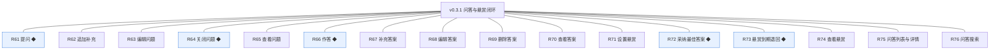
```mermaid
flowchart TB
    V[v0.3.1 问答与悬赏闭环]
    V --- N61[R61 提问 ◆] & N62[R62 追加补充] & N63[R63 编辑问题] & N64[R64 关闭问题 ◆] & N65[R65 查看问题] & N66[R66 作答 ◆] & N67[R67 补充答案] & N68[R68 编辑答案] & N69[R69 删除答案] & N70[R70 查看答案] & N71[R71 设置悬赏] & N72[R72 采纳最佳答案 ◆] & N73[R73 悬赏到期退回 ◆] & N74[R74 查看悬赏] & N75[R75 问答列表与详情] & N76[R76 问答搜索]
    classDef complex fill:#e7f1ff,stroke:#3b7ddd;
    class N61,N64,N66,N72,N73 complex;
```

**认领条目表**（需求名／用途／验收标准逐字引自 0.3 大版本 02 批次二需求表，验收判定以本表锚为准）：

| 编号 | 需求名 | 用途 | 验收标准 |
|---|---|---|---|
| R61 | 提问 ◆ | 会员发表问题并设置悬赏进入审核 | 会员填写标题与正文、设定悬赏积分（余额不足被拒）提交后，悬赏积分预扣并写入出账流水，问题进入待审核并出现在待审队列，结论前不可见；驳回时冲正退回并通知提问人 |
| R62 | 追加补充 | 提问人补充问题条件 | 提问人对已公开问题追加补充（≤2000 字符）保存后经审核公开并标注追加时间，不改变悬赏金额 |
| R63 | 编辑问题 | 提问人修改问题 | 提问人编辑待审核或已驳回问题保存后重新进入待审核；编辑已公开问题同样重新进入待审核，审核期间原文保留可见并标注审核中 |
| R64 | 关闭问题 ◆ | 终止问题等待 | 提问人关闭自己的问题或悬赏到期系统关闭后，问题进入已关闭终态不再接受作答；关闭时待结算悬赏按规则退回 |
| R65 | 查看问题 | 阅读问题与悬赏状态 | 问题详情展示标题、正文、追加补充、悬赏积分与状态（待解答／已采纳／已关闭），最佳答案优先展示 |
| R66 | 作答 ◆ | 会员对问题作答 | 会员对待解答问题提交答案后进入待审核，通过后公开并通知提问人；提问人不能作答自己的问题 |
| R67 | 补充答案 | 作答人补充答案 | 作答人对自己的答案追加补充保存后经审核公开，不重复计答 |
| R68 | 编辑答案 | 作答人修改答案 | 作答人编辑自己的答案保存后重新进入待审核；被采纳的答案不能编辑 |
| R69 | 删除答案 | 作答人删除答案 | 作答人删除自己的答案后该答案不再可见；被采纳的答案不可删除 |
| R70 | 查看答案 | 阅读答案列表 | 问题详情按时间展示已公开答案，最佳答案置顶并带最佳标识 |
| R71 | 设置悬赏 | 提问时设定悬赏积分 | 提问人设定悬赏积分（10～500、步长 10，本版定案）后提交，积分预扣并写入流水；余额不足拒绝提交 |
| R72 | 采纳最佳答案 ◆ | 提问人采纳答案并结算 | 提问人采纳一个已公开答案后，悬赏积分在同一事务内结算给答题人并写入双方流水，通知双方，问题进入已采纳终态 |
| R73 | 悬赏到期退回 ◆ | 到期未采纳退回 | 悬赏到期（默认 14 天，本版定案）仍无人被采纳时，系统自动退回预扣积分并写入冲正流水，问题置为已关闭并通知提问人；同一悬赏不重复退回 |
| R74 | 查看悬赏 | 展示悬赏状态 | 问题详情与列表展示悬赏积分与状态（待结算／已结算／已撤回） |
| R75 | 问答列表与详情 | 浏览问答 | 前台问答入口按板块与时间展示已公开问题列表（含悬赏标识），进入详情可见答案列表与悬赏状态 |
| R76 | 问答搜索 | 检索问答 | 关键词搜索只返回已公开的问题与答案，待审核与已驳回不出现在结果中，优质问答沉淀为可搜索的答案库 |

**锚定说明**：上表三要素与 0.3 大版本 02 批次二逐字一致（含 ◆ 标记与全角标点）；池内登记同源（需求池 §2／§3.1，状态已认领（v0.3.1））。积分与等级侧（R54～R60）已随 v0.3.0 发布，本版仅作为事件源接入其接口，不重述其规则。

## 3. 核心用户旅程

**旅程承接说明**：承接上游大版本 PRD 同名四条旅程，全部落在批次二认领范围内，本版逐条细化到开发级取值（悬赏额、余额、通知类型、到期时限均用本版已落地口径）；单条目机制链路不重复成旅程，其图随条目小节。

### 3.1 旅程一：提问并设置悬赏经审核公开（提问会员、版主·跨主体）

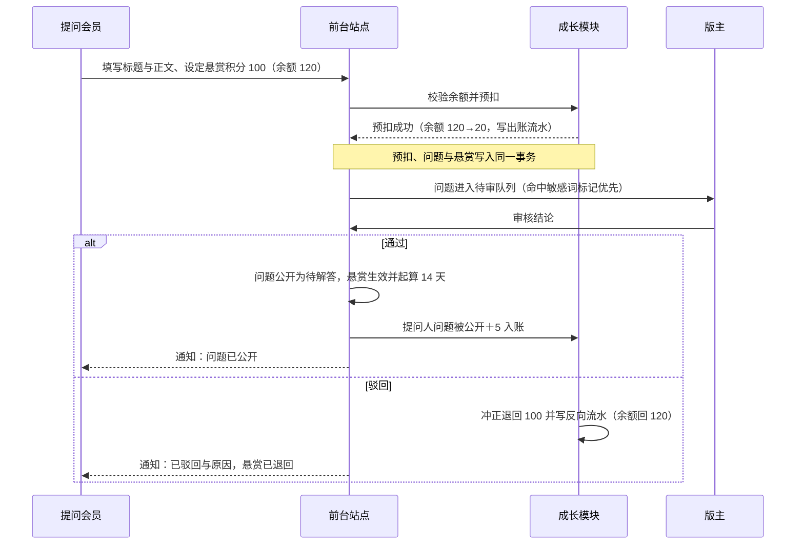
```mermaid
sequenceDiagram
    participant 提问会员
    participant 前台站点
    participant 成长模块
    participant 版主
    提问会员->>前台站点: 填写标题与正文、设定悬赏积分 100（余额 120）
    前台站点->>成长模块: 校验余额并预扣
    成长模块-->>前台站点: 预扣成功（余额 120→20，写出账流水）
    Note over 前台站点,成长模块: 预扣、问题与悬赏写入同一事务
    前台站点->>版主: 问题进入待审队列（命中敏感词标记优先）
    版主->>前台站点: 审核结论
    alt 通过
        前台站点->>前台站点: 问题公开为待解答，悬赏生效并起算 14 天
        前台站点->>成长模块: 提问人问题被公开＋5 入账
        前台站点-->>提问会员: 通知：问题已公开
    else 驳回
        成长模块->>成长模块: 冲正退回 100 并写反向流水（余额回 120）
        前台站点-->>提问会员: 通知：已驳回与原因，悬赏已退回
    end
```

本旅程演示提问含预扣的完整链路：余额校验与预扣先于提交，问题与悬赏同事务写入，审核结论决定公开或冲正；待审核与已驳回问题对访客与其他会员不可见。

操作步骤清单：1. 提问会员进入板块问答标签页的提问入口；2. 填写标题与正文、设定悬赏积分（10～500、步长 10，余额不足被拒）；3. 提交后同一事务内预扣积分、写出账流水、写入问题（待审核）与悬赏（待结算）；4. 版主在沿用 0.2 的待审队列作出结论；5. 通过则问题公开为待解答、悬赏生效并起算到期，提问人获问题被公开＋5；驳回则冲正退回并通知原因。

### 3.2 旅程二：作答与采纳结算（答题会员、版主、提问会员·跨主体）

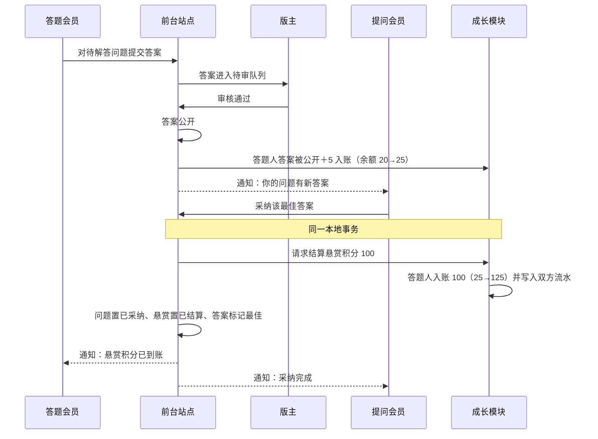
```mermaid
sequenceDiagram
    participant 答题会员
    participant 前台站点
    participant 版主
    participant 提问会员
    participant 成长模块
    答题会员->>前台站点: 对待解答问题提交答案
    前台站点->>版主: 答案进入待审队列
    版主->>前台站点: 审核通过
    前台站点->>前台站点: 答案公开
    前台站点->>成长模块: 答题人答案被公开＋5 入账（余额 20→25）
    前台站点-->>提问会员: 通知：你的问题有新答案
    提问会员->>前台站点: 采纳该最佳答案
    Note over 前台站点,成长模块: 同一本地事务
    前台站点->>成长模块: 请求结算悬赏积分 100
    成长模块->>成长模块: 答题人入账 100（25→125）并写入双方流水
    前台站点->>前台站点: 问题置已采纳、悬赏置已结算、答案标记最佳
    前台站点-->>答题会员: 通知：悬赏积分已到账
    前台站点-->>提问会员: 通知：采纳完成
```

本旅程演示口径一路径（0.3 PRD 口径一）：作答经审核公开后，提问人从已公开答案中采纳一个最佳答案，悬赏结算、双方流水、双方通知在同一事务完成，问题进入已采纳终态。

操作步骤清单：1. 答题会员（非提问人）在待解答问题下提交答案，进入待审核；2. 版主审核通过后答案公开，通知提问人（通知类型＝答案公开），答题人获答案被公开＋5；3. 提问人查看答案并采纳一个最佳答案；4. 同一事务内：悬赏置已结算、答题人入账悬赏额、写入双方流水、双方收到通知（通知类型＝悬赏结算）、答案标记最佳、问题置已采纳；5. 双方核对流水与通知。

### 3.3 旅程三：悬赏到期退回（系统与提问人·定时）

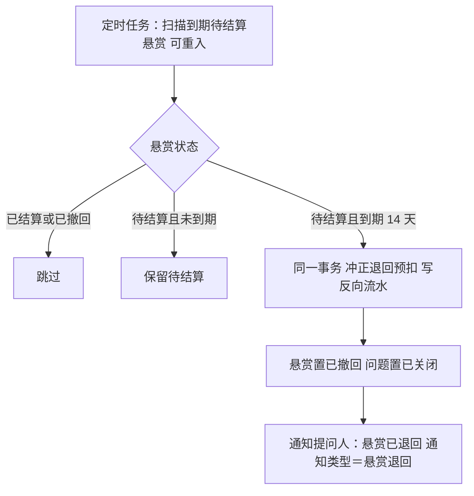
```mermaid
flowchart TB
    A[定时任务：扫描到期待结算悬赏 可重入] --> B{悬赏状态}
    B -->|已结算或已撤回| C[跳过]
    B -->|待结算且未到期| D[保留待结算]
    B -->|待结算且到期 14 天| E[同一事务 冲正退回预扣 写反向流水]
    E --> F[悬赏置已撤回 问题置已关闭]
    F --> G[通知提问人：悬赏已退回 通知类型＝悬赏退回]
```

本旅程演示口径二路径（0.3 PRD 口径二）：悬赏生效起 14 天内无人被采纳时，系统自动退回预扣积分，问题随悬赏一并终态化；同一悬赏不重复退回。

操作步骤清单（系统自动，人工仅核对）：1. 核对到期扫描对已结算与已撤回悬赏跳过、对同一悬赏重复扫描不重复退回（可重入）；2. 核对退回积分与冲正流水、悬赏已撤回与问题已关闭的对应关系；3. 核对提问人通知（通知类型＝悬赏退回）。

### 3.4 旅程四：访客问答浏览与搜索（访客·单端）

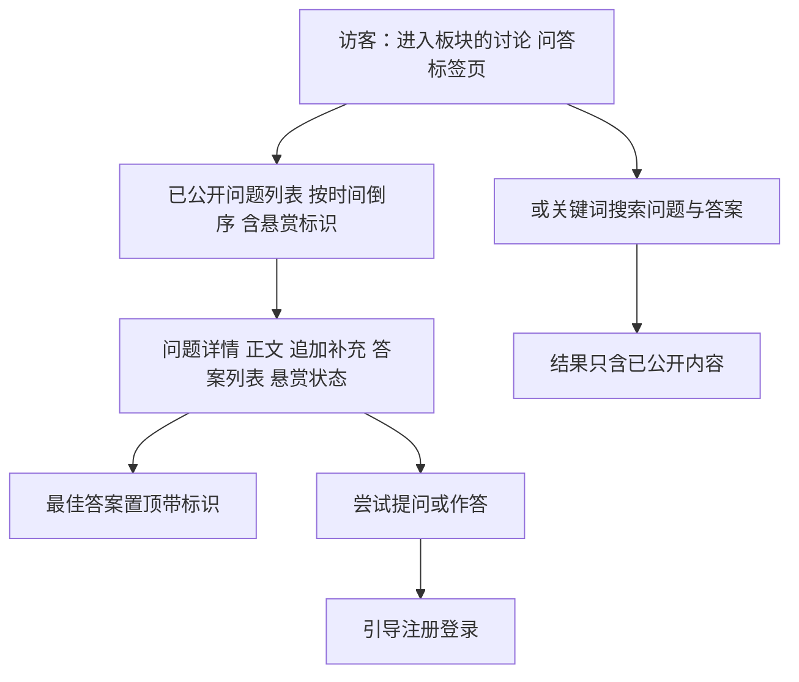
```mermaid
flowchart TB
    A[访客：进入板块的讨论 问答标签页] --> B[已公开问题列表 按时间倒序 含悬赏标识]
    B --> C[问题详情 正文 追加补充 答案列表 悬赏状态]
    C --> D[最佳答案置顶带标识]
    A --> E[或关键词搜索问题与答案]
    E --> F[结果只含已公开内容]
    C --> G[尝试提问或作答]
    G --> H[引导注册登录]
```

本旅程演示答案库的消费入口：访客无需注册即可浏览与检索，列表、详情与搜索全程只见已公开内容；待审核与已驳回内容零泄漏。

操作步骤清单：1. 访客进入板块并切换「问答」标签页；2. 浏览已公开问题列表（含悬赏标识）或用关键词搜索；3. 进入详情阅读正文、追加补充、答案列表与悬赏状态（最佳答案置顶）；4. 参与时被引导注册登录。

## 4. 功能需求

### 4.1 功能总览

**对象归组树**（版本→对象→条目，对象为功能归属主体）：

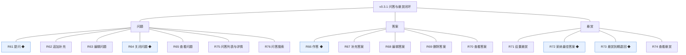
```mermaid
flowchart TB
    V[v0.3.1 问答与悬赏闭环]
    V --- O1[问题]
    O1 --- N61[R61 提问 ◆] & N62[R62 追加补充] & N63[R63 编辑问题] & N64[R64 关闭问题 ◆] & N65[R65 查看问题] & N75[R75 问答列表与详情] & N76[R76 问答搜索]
    V --- O2[答案]
    O2 --- N66[R66 作答 ◆] & N67[R67 补充答案] & N68[R68 编辑答案] & N69[R69 删除答案] & N70[R70 查看答案]
    V --- O3[悬赏]
    O3 --- N71[R71 设置悬赏] & N72[R72 采纳最佳答案 ◆] & N73[R73 悬赏到期退回 ◆] & N74[R74 查看悬赏]
    classDef complex fill:#e7f1ff,stroke:#3b7ddd;
    class N61,N64,N66,N72,N73 complex;
```

**对象增删改查矩阵**：

| 对象 | 增 | 改 | 删 | 查 |
|---|---|---|---|---|
| 问题 | R61（提问，含 R71 悬赏设置同事务建立） | R62 追加补充／R63 编辑问题／R64 关闭（终态）／R72 采纳（终态） | 不做（问题无作者删除路径，关闭为提问人侧终态处置；治理侧删除随 0.6） | R65 查看问题、R75 列表与详情、R76 搜索 |
| 答案 | R66 作答 | R67 补充答案／R68 编辑答案／R72 标记最佳 | R69 删除答案（作者侧；被采纳不可删；治理侧随 0.6） | R70 查看答案（R75 详情内答案列表、R76 搜索） |
| 悬赏 | R71（随提问同事务建立，预扣生效） | R72 采纳结算／R73 到期退回／R64 关闭退回（状态流转） | 不做（随问题生命周期表达，无独立删除） | R74 查看悬赏（详情与列表） |

**主体使用面**：

| 主体 | 使用条目 | 面说明 |
|---|---|---|
| 会员 | R61～R64、R66～R69、R71、R72（限提问人）、R75、R76 | 前台·问答标签页：提问（含悬赏设置）、追加补充、编辑、关闭、作答、补充、编辑、删除、采纳入口、浏览与搜索 |
| 访客 | R65、R70、R74、R75、R76 | 前台只读：浏览问答列表与详情、悬赏展示、搜索；参与时引导注册 |
| 版主 | R61／R66 的审核环节（沿用 0.2 待审队列） | 无新增操作面——问题、追加、答案进入同一队列，沿用通过／驳回与命中标记 |
| 系统（定时任务） | R73 | 机制条目，无人工触发面 |
| 站长、运营人员 | 无本版条目 | 无界面 |

### 4.2 R61 提问 ◆

**功能说明**：会员发表问题并设置悬赏进入审核——提交即预扣悬赏积分并进入待审队列，结论前不可见。触发：会员在前台问答标签页点击提问。

**交互与流程**：

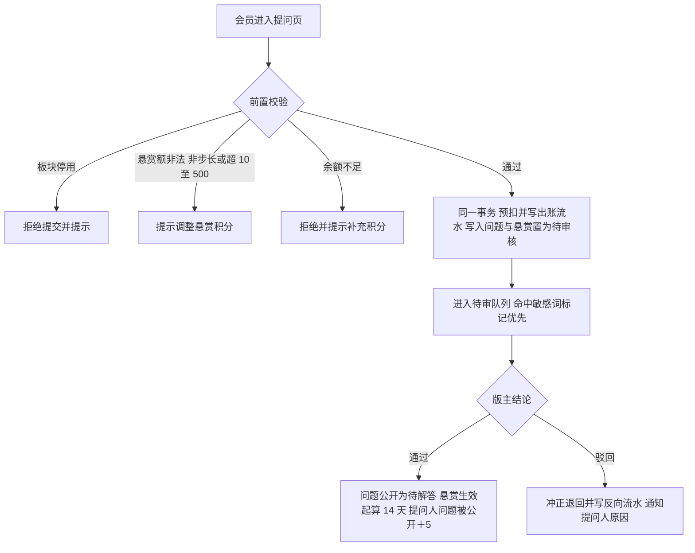
```mermaid
flowchart TB
    A[会员进入提问页] --> B{前置校验}
    B -->|板块停用| C[拒绝提交并提示]
    B -->|悬赏额非法 非步长或超 10 至 500| D[提示调整悬赏积分]
    B -->|余额不足| E[拒绝并提示补充积分]
    B -->|通过| F[同一事务 预扣并写出账流水 写入问题与悬赏置为待审核]
    F --> G[进入待审队列 命中敏感词标记优先]
    G --> H{版主结论}
    H -->|通过| I[问题公开为待解答 悬赏生效起算 14 天 提问人问题被公开＋5]
    H -->|驳回| J[冲正退回并写反向流水 通知提问人原因]
```

操作步骤清单：1. 会员进入提问页，选择所属板块（沿用板块结构）；2. 填写标题与正文、设定悬赏积分；3. 提交时依次校验板块启停、悬赏额取值、余额足额，任一不过即拒绝且不产生流水；4. 通过后同一事务内预扣积分、写出账流水、写入问题（待审核）与悬赏（待结算）；5. 问题进入待审队列（沿用 0.2 队列与敏感词命中标记）；6. 版主通过则公开为待解答、悬赏生效并起算到期、提问人获行为积分；驳回则冲正退回并通知原因。

**字段与校验**：

| 信息项 | 必填 | 校验 |
|---|---|---|
| 所属板块 | 是 | 须为启用状态板块（停用板块拒绝新内容，0.1 先行基座） |
| 标题 | 是 | 沿用 0.2 话题标题口径（2～100 字符） |
| 正文 | 是 | ≤20000 字符 |
| 悬赏积分 | 是 | 10～500、步长 10（本版定案）；余额不足拒绝提交 |

**规则与边界**：1. 预扣、出账流水、问题与悬赏写入同一事务，不出现「扣了积分没有问题」的中间状态（D4、04C 同事务契约）。2. 结论前问题对访客与其他会员不可见（先审后发，D3）。3. 驳回时冲正退回以反向流水表达、不删原流水（v0.3.0 账本口径）。4. 悬赏生效（审核通过）起算 14 天到期（本版拍板：自提问公开时点起算）。5. 问题被公开＋5 入账（v0.3.0 规则取值，事件源本版接入）。

**异常与拦截**：1. 板块停用→拒绝提交并提示。2. 悬赏额非步长或超范围→提示「悬赏积分为 10～500、步长 10」。3. 余额不足→拒绝提交并提示补充积分，无流水产生。4. 预扣事务失败→整体回滚，问题不落库。5. 命中敏感词→不自动驳回，待审队列标记优先（0.2 命中校验沿用）。

### 4.3 R62 追加补充

**功能说明**：提问人补充问题条件——对已公开问题追加补充并经审核公开，不改变悬赏金额。触发：提问人在自己的已公开问题详情点击追加补充。

**交互与流程**：

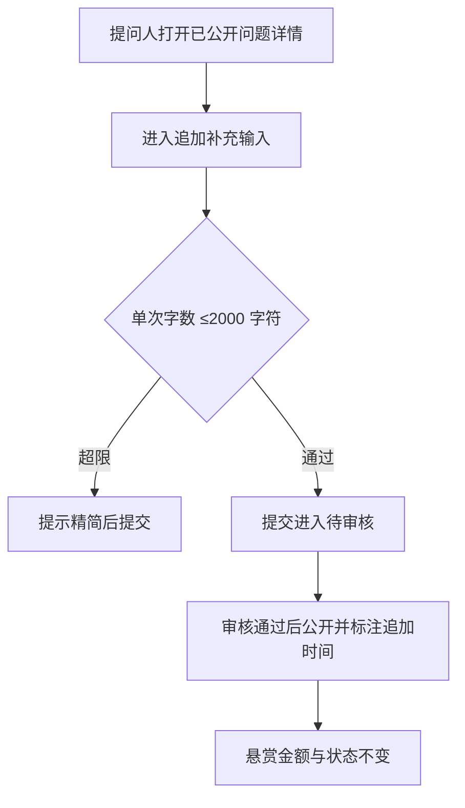
```mermaid
flowchart TB
    A[提问人打开已公开问题详情] --> B[进入追加补充输入]
    B --> C{单次字数 ≤2000 字符}
    C -->|超限| D[提示精简后提交]
    C -->|通过| E[提交进入待审核]
    E --> F[审核通过后公开并标注追加时间]
    F --> G[悬赏金额与状态不变]
```

操作步骤清单：1. 提问人（仅本人）在已公开问题详情发起追加补充；2. 输入补充内容提交，进入待审核；3. 审核通过后公开，展示时标注追加时间；4. 悬赏金额与状态不受影响。

**字段与校验**：

| 信息项 | 必填 | 校验 |
|---|---|---|
| 补充内容 | 是 | 单次 ≤2000 字符（R62 锚） |
| 追加时间 | 系统生成 | 审核通过公开时标注 |

**规则与边界**：1. 仅提问人本人可追加（本版拍板：从「提问人补充问题条件」锚推导）。2. 追加补充可多次，每次独立经审核（本版拍板，术语表已登记 supplement 口径）。3. 不改变悬赏金额与状态、不改变问题状态（0.3 PRD §5.1 说明沿用）。4. 审核期间原文与既有补充保留可见。

**异常与拦截**：1. 非提问人→无追加入口且接口拒绝。2. 超过 2000 字符→提示精简。3. 问题已采纳或已关闭→无追加入口（终态不再接受补充）。

### 4.4 R63 编辑问题

**功能说明**：提问人修改问题——编辑后重新进入审核，审核期间原文保留可见并标注审核中。触发：提问人编辑自己的待审核、已驳回或已公开问题。

**交互与流程**：

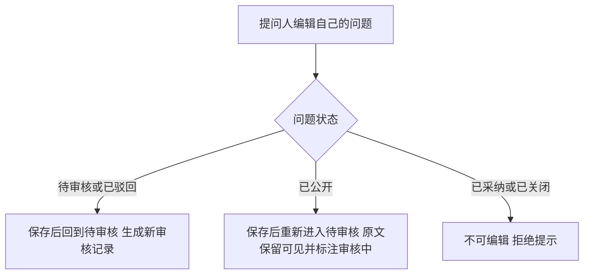
```mermaid
flowchart TB
    A[提问人编辑自己的问题] --> B{问题状态}
    B -->|待审核或已驳回| C[保存后回到待审核 生成新审核记录]
    B -->|已公开| D[保存后重新进入待审核 原文保留可见并标注审核中]
    B -->|已采纳或已关闭| E[不可编辑 拒绝提示]
```

操作步骤清单：1. 提问人打开编辑入口（待审核、已驳回、已公开状态可编辑；终态不可）；2. 修改标题与正文保存；3. 重新进入待审核并生成新的审核记录；4. 已公开问题编辑期间原文保留可见并标注「审核中」。

**字段与校验**：

| 信息项 | 必填 | 校验 |
|---|---|---|
| 标题／正文 | 是 | 同 R61 口径 |

**规则与边界**：1. 编辑不改悬赏（悬赏随提问一次性设定，本版不做中途调整——04C 待业务确认项沿用，列入 §6 待议）。2. 编辑已公开问题原文保留可见＋审核中标注（0.2 话题编辑同口径）。3. 编辑回审边与状态机一致（0.3 PRD §5.1：待解答→待审核）。4. 仅提问人本人可编辑。

**异常与拦截**：1. 已采纳或已关闭问题→拒绝编辑并提示终态。2. 非提问人→无入口且接口拒绝。

### 4.5 R64 关闭问题 ◆

**功能说明**：终止问题等待——提问人主动关闭或悬赏到期系统关闭，问题进入已关闭终态不再接受作答，待结算悬赏按规则退回。触发：①提问人在自己的待解答问题点击关闭；②悬赏到期系统关闭（随 R73 同一事务）。

**交互与流程**：

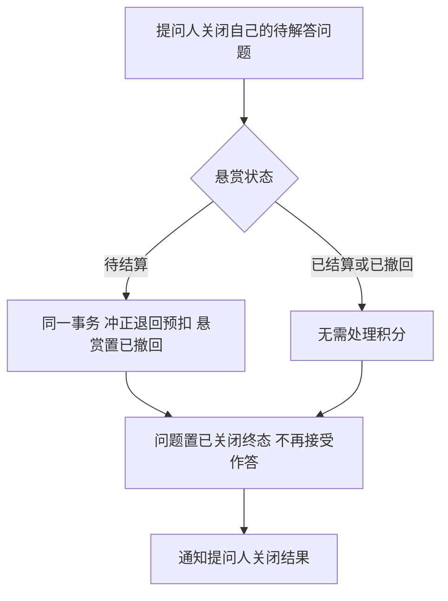
```mermaid
flowchart TB
    A[提问人关闭自己的待解答问题] --> B{悬赏状态}
    B -->|待结算| C[同一事务 冲正退回预扣 悬赏置已撤回]
    B -->|已结算或已撤回| D[无需处理积分]
    C --> E[问题置已关闭终态 不再接受作答]
    D --> E
    E --> F[通知提问人关闭结果]
```

操作步骤清单：1. 提问人（仅本人）对待解答问题发起关闭并确认；2. 系统校验悬赏状态：待结算则同事务冲正退回并置已撤回，已结算或已撤回则无需处理；3. 问题置已关闭终态，不再接受作答与追加补充；4. 通知提问人关闭结果。

**字段与校验**：

| 信息项 | 必填 | 校验 |
|---|---|---|
| 关闭确认 | 是 | 二次确认弹层（关闭为终态、不可恢复） |

**规则与边界**：1. 关闭为终态，关闭后不可再编辑、追加与作答（术语表终态口径）。2. 待结算悬赏退回规则与到期退回一致（04C 本轮建议沿用：冲正流水表达、同一悬赏只退回一次）。3. 系统侧到期关闭随 R73 定时任务同一事务完成，本条目交付提问人主动关闭路径。4. 已有已公开答案保留可见（本版拍板：关闭不清除内容，答案库沉淀口径）。

**异常与拦截**：1. 非提问人或问题非待解答→拒绝关闭。2. 退回事务失败→整体回滚，问题保持待解答。3. 重复关闭请求→幂等拒绝（终态校验）。

### 4.6 R65 查看问题

**功能说明**：阅读问题与悬赏状态——问题详情聚合展示问题本体、追加补充、悬赏与答案。触发：访客或会员从问答列表或搜索结果进入问题详情。

**交互与流程**：

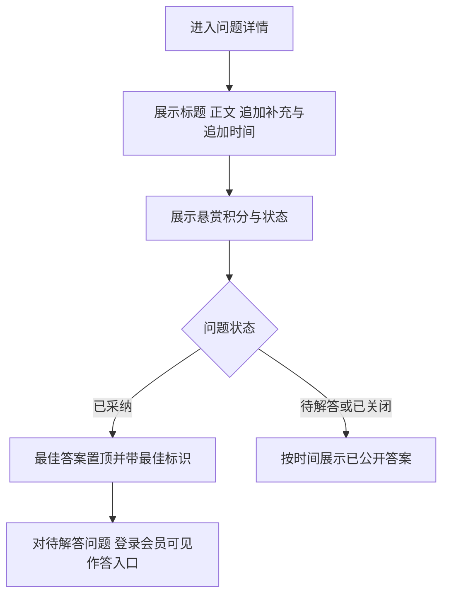
```mermaid
flowchart TB
    A[进入问题详情] --> B[展示标题 正文 追加补充与追加时间]
    B --> C[展示悬赏积分与状态]
    C --> D{问题状态}
    D -->|已采纳| E[最佳答案置顶并带最佳标识]
    D -->|待解答或已关闭| F[按时间展示已公开答案]
    E --> G[对待解答问题 登录会员可见作答入口]
```

操作步骤清单：1. 从列表或搜索进入详情；2. 展示标题、正文、追加补充（标注时间）与悬赏积分及状态；3. 已采纳问题最佳答案置顶展示；4. 待解答问题对登录会员展示作答入口、对访客引导注册。

**字段与校验**：

| 信息项 | 必填 | 校验 |
|---|---|---|
| 展示要素 | — | 标题、正文、追加补充、悬赏积分与状态（待解答／已采纳／已关闭）、作者昵称与头像、发布时间 |

**规则与边界**：1. 仅已公开（待解答／已采纳／已关闭）问题可被访问，待审核与已驳回详情页不可达（先审后发）。2. 悬赏状态展示三态：待结算／已结算／已撤回（术语表 §4）。3. 展示字段沿用 0.2 详情口径（作者昵称与头像经会员摘要接口读取，等级随 0.5 展示）。

**异常与拦截**：1. 访问待审核或已驳回问题→404 式不可见反馈（不泄露存在性）。2. 问题不存在→同样不可见反馈。

### 4.7 R66 作答 ◆

**功能说明**：会员对问题作答——在待解答问题下提交答案进入审核，通过后公开并通知提问人；提问人不能作答自己的问题。触发：会员在待解答问题详情点击作答。

**交互与流程**：

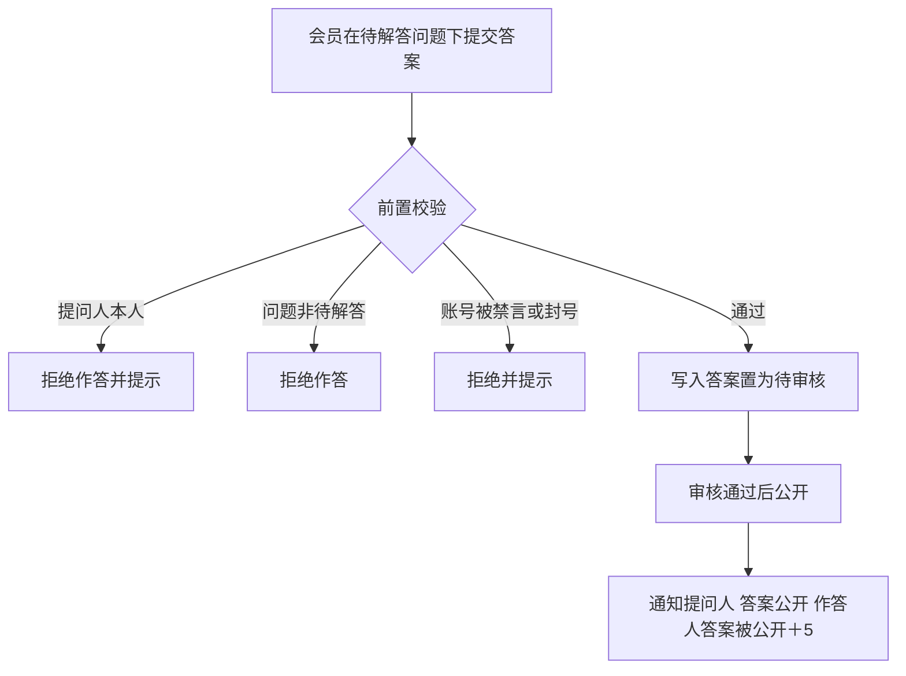
```mermaid
flowchart TB
    A[会员在待解答问题下提交答案] --> B{前置校验}
    B -->|提问人本人| C[拒绝作答并提示]
    B -->|问题非待解答| D[拒绝作答]
    B -->|账号被禁言或封号| E[拒绝并提示]
    B -->|通过| F[写入答案置为待审核]
    F --> G[审核通过后公开]
    G --> H[通知提问人 答案公开 作答人答案被公开＋5]
```

操作步骤清单：1. 会员（非提问人）在待解答问题详情的作答区提交正文；2. 校验问题状态、作答人身份与账号状态；3. 通过后答案置待审核并进入队列（沿用 0.2）；4. 审核通过后公开、通知提问人（通知类型＝答案公开）、作答人获答案被公开＋5；驳回则通知作答人原因。

**字段与校验**：

| 信息项 | 必填 | 校验 |
|---|---|---|
| 答案正文 | 是 | ≤20000 字符 |
| 所属问题 | 是 | 须为待解答状态 |

**规则与边界**：1. 提问人不能作答自己的问题（R66 锚）。2. 只有待解答问题可被作答（状态机约束）。3. 禁言与封号账号拒绝发言类操作（0.2 校验沿用）。4. 同一会员对同一问题可多次作答（本版拍板：锚未设限，按多答案并存处理；被采纳后其余答案保留已公开状态）。

**异常与拦截**：1. 自答→拒绝并提示「不能作答自己的问题」。2. 问题已采纳或已关闭→拒绝作答。3. 被禁言或封号→拒绝并提示处置状态。4. 提交事务失败→答案不落库。

### 4.8 R67 补充答案

**功能说明**：作答人补充答案——对自己的答案追加补充并经审核公开，不重复计答。触发：作答人在自己的答案上点击补充。

**交互与流程**：

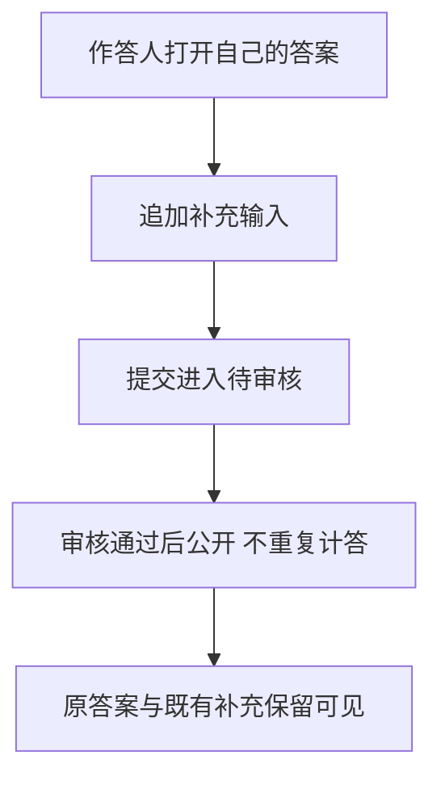
```mermaid
flowchart TB
    A[作答人打开自己的答案] --> B[追加补充输入]
    B --> C[提交进入待审核]
    C --> D[审核通过后公开 不重复计答]
    D --> E[原答案与既有补充保留可见]
```

操作步骤清单：1. 作答人（仅本人）在自己的答案发起补充；2. 提交后进入待审核；3. 通过后公开并标注补充内容；4. 不重复计答（答案计数与积分均只按原答案一次性发生）。

**字段与校验**：

| 信息项 | 必填 | 校验 |
|---|---|---|
| 补充内容 | 是 | 单次 ≤2000 字符（与追加补充同口径，本版拍板） |

**规则与边界**：1. 仅作答人本人可补充。2. 补充可多次、各自经审核（与问题追加同口径）。3. 被采纳的答案不能补充（已采纳锁定，与 R68 编辑同口径——本版拍板：采纳锁定覆盖编辑与补充）。4. 审核期间原答案保留可见。

**异常与拦截**：1. 非本人→无入口且接口拒绝。2. 被采纳答案→拒绝补充。3. 已删除答案→不存在、拒绝。

### 4.9 R68 编辑答案

**功能说明**：作答人修改答案——编辑后重新进入审核，被采纳的答案不能编辑。触发：作答人编辑自己的非已采纳答案。

**交互与流程**：

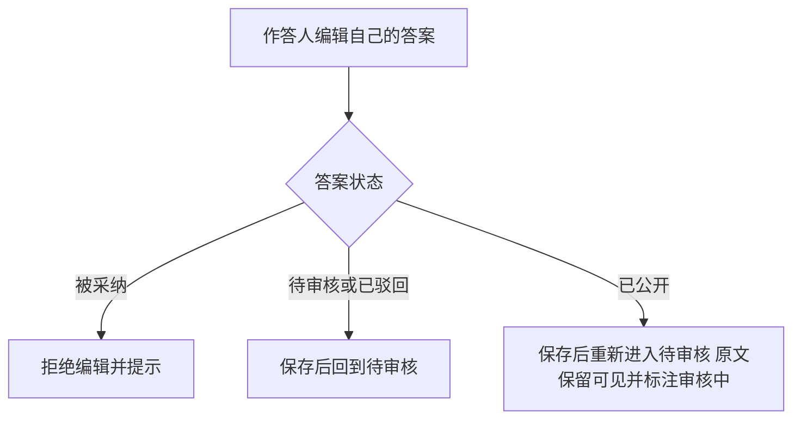
```mermaid
flowchart TB
    A[作答人编辑自己的答案] --> B{答案状态}
    B -->|被采纳| C[拒绝编辑并提示]
    B -->|待审核或已驳回| D[保存后回到待审核]
    B -->|已公开| E[保存后重新进入待审核 原文保留可见并标注审核中]
```

操作步骤清单：1. 作答人打开编辑入口（被采纳答案无入口）；2. 修改正文保存后重新进入待审核；3. 已公开答案编辑期间原文保留可见并标注「审核中」。

**字段与校验**：

| 信息项 | 必填 | 校验 |
|---|---|---|
| 答案正文 | 是 | 同 R66 口径 |

**规则与边界**：1. 被采纳的答案不能编辑（R68 锚，已采纳锁定）。2. 编辑回审边与状态机一致（0.3 PRD §5.2：已公开→待审核）。3. 仅作答人本人可编辑。

**异常与拦截**：1. 被采纳答案→拒绝编辑。2. 非本人→无入口且接口拒绝。3. 已删除答案→拒绝。

### 4.10 R69 删除答案

**功能说明**：作答人删除答案——删除后不再可见，被采纳的答案不可删除。触发：作答人对自己的非已采纳答案执行删除。

**交互与流程**：

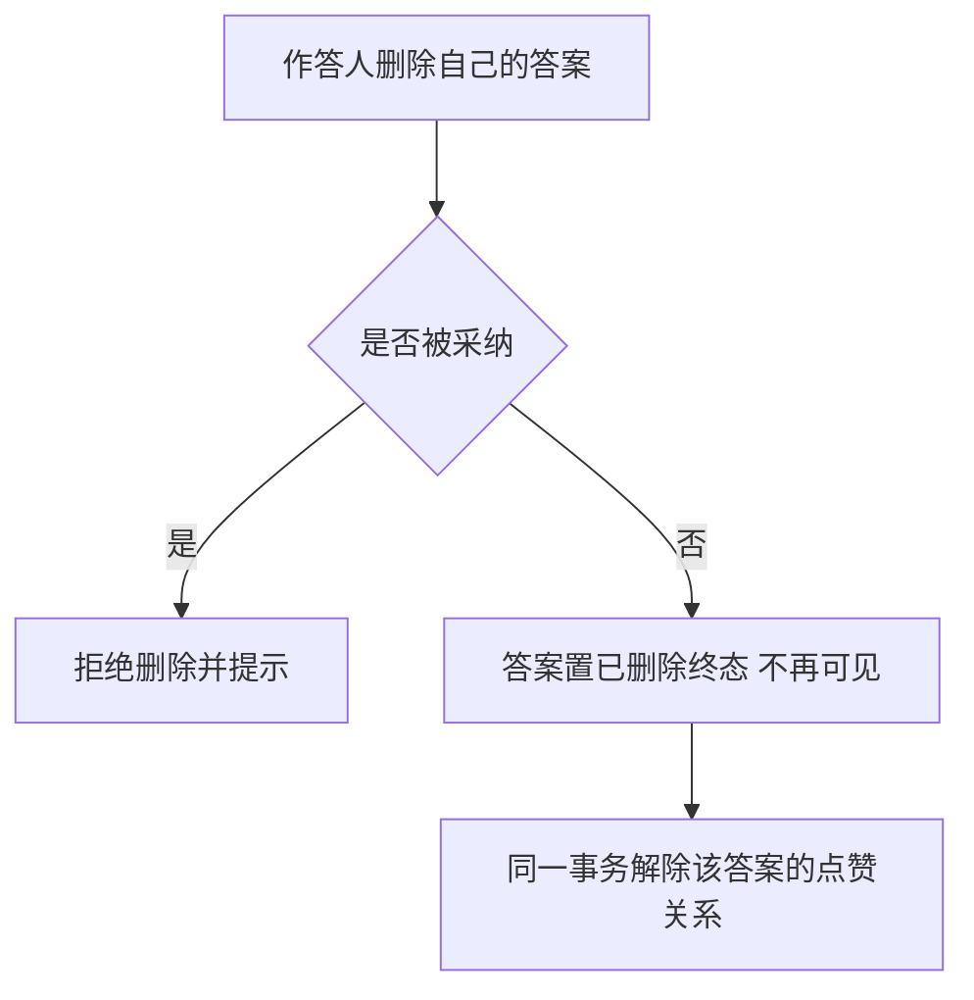
```mermaid
flowchart TB
    A[作答人删除自己的答案] --> B{是否被采纳}
    B -->|是| C[拒绝删除并提示]
    B -->|否| D[答案置已删除终态 不再可见]
    D --> E[同一事务解除该答案的点赞关系]
```

操作步骤清单：1. 作答人发起删除并确认（终态不可恢复）；2. 校验非被采纳答案；3. 答案置已删除，详情与搜索不再出现；4. 同一事务解除该答案的点赞关系。

**字段与校验**：

| 信息项 | 必填 | 校验 |
|---|---|---|
| 删除确认 | 是 | 二次确认弹层（终态） |

**规则与边界**：1. 被采纳的答案不可删除（R69 锚）。2. 删除为终态、不可恢复（术语表）。3. 解除点赞关系与删除同事务（本版拍板：沿用 0.2 删除话题与互动关系清理同事务口径；收藏仅限话题无涉）。4. 治理侧删除随 0.6。

**异常与拦截**：1. 被采纳答案→拒绝删除。2. 非本人→接口拒绝。3. 重复删除→幂等拒绝（终态校验）。

### 4.11 R70 查看答案

**功能说明**：阅读答案列表——问题详情按时间展示已公开答案，最佳答案置顶。触发：进入问题详情的答案区。

**交互与流程**：

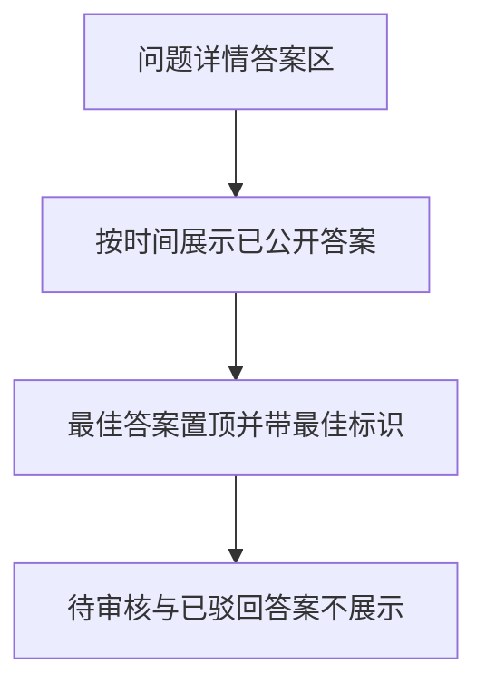
```mermaid
flowchart TB
    A[问题详情答案区] --> B[按时间展示已公开答案]
    B --> C[最佳答案置顶并带最佳标识]
    C --> D[待审核与已驳回答案不展示]
```

操作步骤清单：1. 进入问题详情，答案区按时间展示已公开答案；2. 已采纳问题的最佳答案置顶并带最佳标识；3. 待审核与已驳回答案不出现在列表。

**字段与校验**：

| 信息项 | 必填 | 校验 |
|---|---|---|
| 展示要素 | — | 作答人昵称与头像、正文、补充内容、发布时间、最佳标识 |

**规则与边界**：1. 只展示已公开答案（先审后发零泄漏）。2. 最佳答案置顶且带「最佳」标识（胶囊、成功色语义，UI 沿用状态双表达）。3. 展示沿用 0.2 评论列表口径（时间正序、层级扁平）。

**异常与拦截**：无——只读展示无独立失败分支；待审核与已驳回内容在数据层即被过滤。

### 4.12 R71 设置悬赏

**功能说明**：提问时设定悬赏积分——悬赏随提问同事务建立并预扣。触发：提问页设定悬赏积分（与 R61 同一表单、同一次提交）。

**交互与流程**：

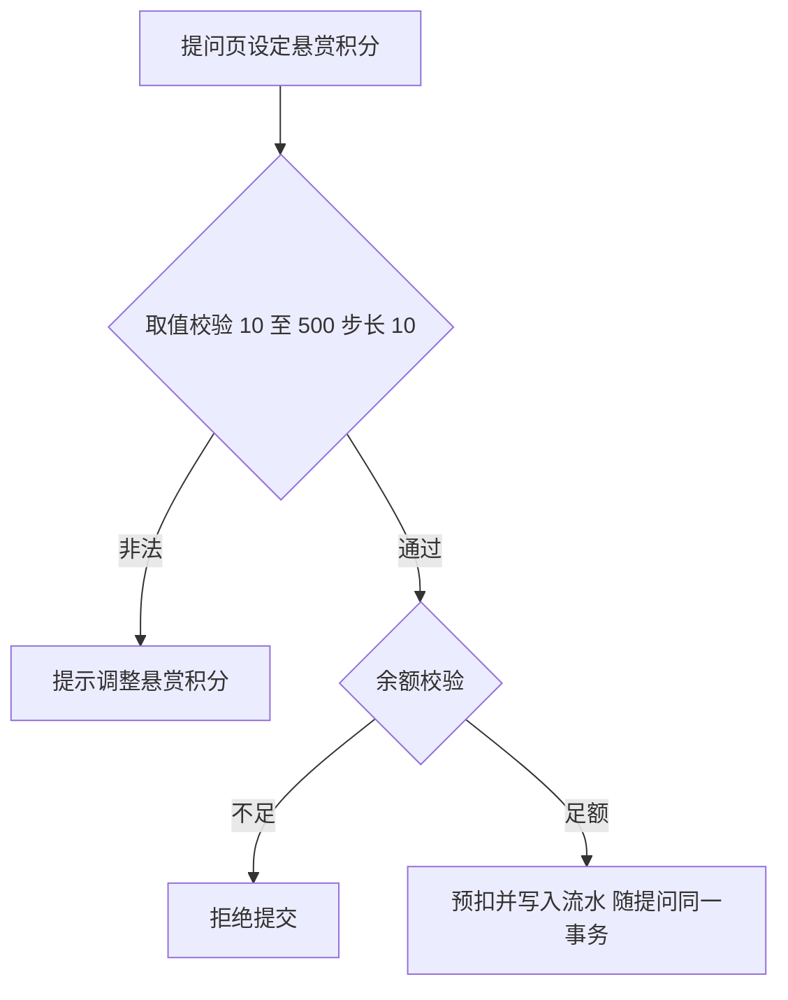
```mermaid
flowchart TB
    A[提问页设定悬赏积分] --> B{取值校验 10 至 500 步长 10}
    B -->|非法| C[提示调整悬赏积分]
    B -->|通过| D{余额校验}
    D -->|不足| E[拒绝提交]
    D -->|足额| F[预扣并写入流水 随提问同一事务]
```

操作步骤清单：1. 提问人在提问页以步进器设定悬赏积分（10～500、步长 10）；2. 提交时校验取值与余额；3. 通过后预扣并写流水，与问题写入同一事务；4. 提问页展示当前余额供参照。

**字段与校验**：

| 信息项 | 必填 | 校验 |
|---|---|---|
| 悬赏积分 | 是 | 10～500、步长 10（本版定案）；余额不足拒绝提交 |

**规则与边界**：1. 悬赏只在提问时一次性设定，后续不调整（编辑不改悬赏，R63 口径；04C 待业务确认项沿用）。2. 发起悬赏按悬赏额出账（v0.3.0 规则取值，事件源本版接入）。3. 悬赏与问题一对一（bounty.question_id 唯一约束）。

**异常与拦截**：1. 取值非法→提示「悬赏积分为 10～500、步长 10」。2. 余额不足→拒绝提交、无流水。3. 重复提交（并发双击）→幂等，只产生一个问题与一笔预扣。

### 4.13 R72 采纳最佳答案 ◆

**功能说明**：提问人采纳答案并结算——采纳后悬赏在同一事务内结算给答题人，问题进入已采纳终态。触发：提问人在自己的待解答问题详情对某个已公开答案点击采纳。

**交互与流程**：

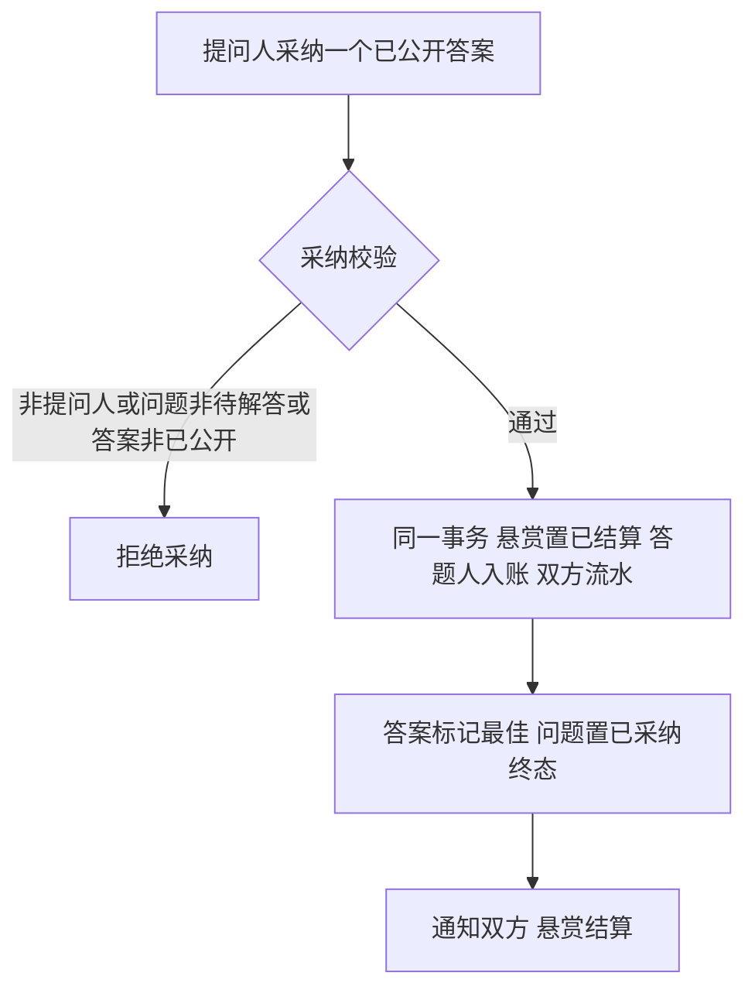
```mermaid
flowchart TB
    A[提问人采纳一个已公开答案] --> B{采纳校验}
    B -->|非提问人或问题非待解答或答案非已公开| C[拒绝采纳]
    B -->|通过| D[同一事务 悬赏置已结算 答题人入账 双方流水]
    D --> E[答案标记最佳 问题置已采纳终态]
    E --> F[通知双方 悬赏结算]
```

操作步骤清单：1. 提问人在待解答问题详情选择一个已公开答案点击采纳并确认；2. 校验采纳人、问题状态与答案状态；3. 同一事务内：悬赏置已结算、答题人入账悬赏额、写入双方流水、答案标记最佳、问题置已采纳；4. 双方收到通知（通知类型＝悬赏结算）。

**字段与校验**：

| 信息项 | 必填 | 校验 |
|---|---|---|
| 采纳确认 | 是 | 二次确认弹层（采纳后不可更换） |

**规则与边界**：1. 同一问题只能采纳一次，重复采纳被唯一约束或条件更新拒绝（幂等）。2. 已采纳为终态，不可撤回与换人（04C 本轮建议沿用）。3. 结算、入账、流水、通知同一事务，失败整体回滚（D4、K 沿用）。4. 采纳后人机两侧锁定：问题不可编辑与追加、答案不可编辑补充与删除。

**异常与拦截**：1. 非提问人→接口拒绝。2. 问题非待解答或答案非已公开→拒绝。3. 并发重复采纳→一方成功一方拒绝。4. 结算事务失败→整体回滚、状态不变。

### 4.14 R73 悬赏到期退回 ◆

**功能说明**：到期未采纳退回——定时任务扫描到期悬赏，自动退回预扣积分并终态化问题。触发：定时任务按批扫描到期待结算悬赏。

**交互与流程**：

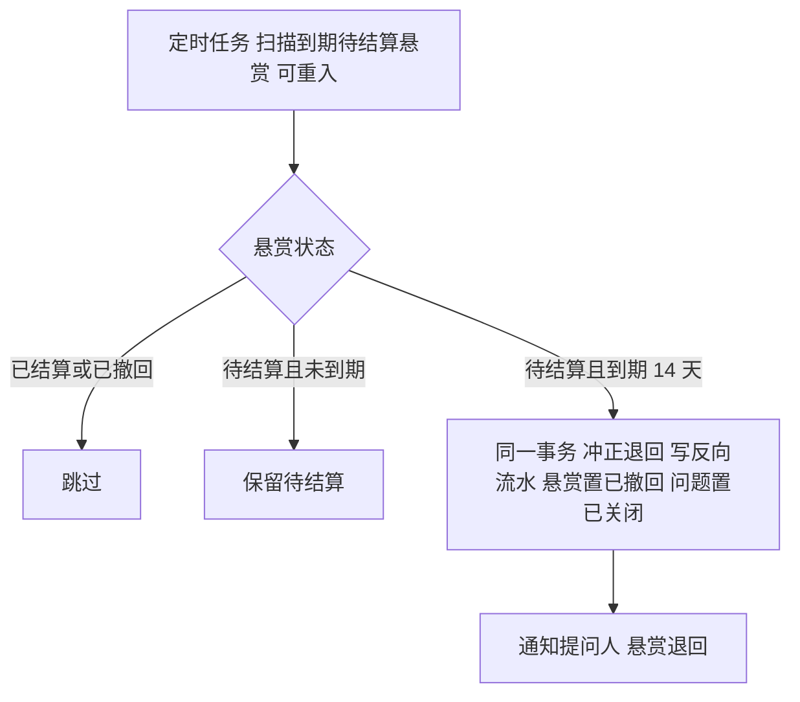
```mermaid
flowchart TB
    A[定时任务 扫描到期待结算悬赏 可重入] --> B{悬赏状态}
    B -->|已结算或已撤回| C[跳过]
    B -->|待结算且未到期| D[保留待结算]
    B -->|待结算且到期 14 天| E[同一事务 冲正退回 写反向流水 悬赏置已撤回 问题置已关闭]
    E --> F[通知提问人 悬赏退回]
```

操作步骤清单：1. 定时任务扫描待结算悬赏，比对到期时点（提问公开起 14 天）；2. 已结算或已撤回跳过、未到期保留；3. 到期项同一事务冲正退回、写反向流水、悬赏置已撤回、问题置已关闭；4. 通知提问人（通知类型＝悬赏退回）。

**字段与校验**：

| 信息项 | 必填 | 校验 |
|---|---|---|
| 到期时点 | 系统生成 | 提问公开时点＋14 天（本版定案值） |

**规则与边界**：1. 任务可重入：同一悬赏重复扫描不重复退回（幂等）。2. 退回以冲正流水表达、保留原流水（账本口径）。3. 到期退回与问题关闭同事务（悬赏与问题状态一一对应）。4. 无人工触发面，结果经问题详情与通知体现。

**异常与拦截**：1. 重复退回→幂等拒绝（状态条件更新）。2. 退回事务失败→整体回滚，下轮扫描重试。

### 4.15 R74 查看悬赏

**功能说明**：展示悬赏状态——问题详情与列表展示悬赏积分与三态。触发：浏览问答列表或问题详情。

**交互与流程**：

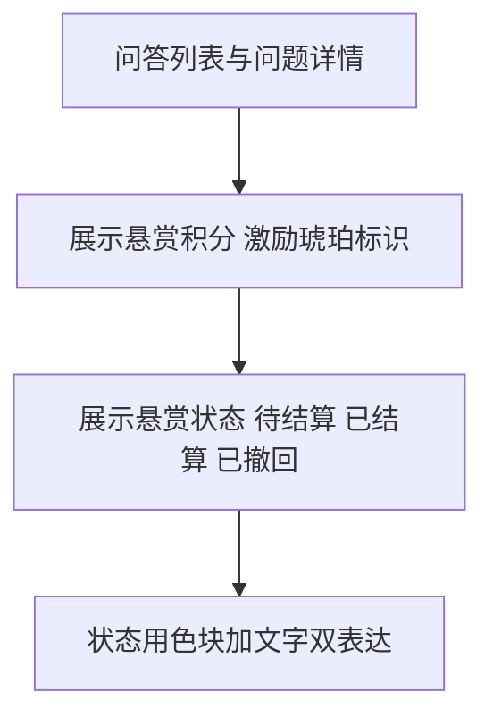
```mermaid
flowchart TB
    A[问答列表与问题详情] --> B[展示悬赏积分 激励琥珀标识]
    B --> C[展示悬赏状态 待结算 已结算 已撤回]
    C --> D[状态用色块加文字双表达]
```

操作步骤清单：1. 列表行展示悬赏积分标识；2. 详情展示悬赏积分与状态；3. 状态以「色块＋文字」双表达（待结算／已结算／已撤回）。

**字段与校验**：

| 信息项 | 必填 | 校验 |
|---|---|---|
| 展示要素 | — | 悬赏积分、状态（术语表 §4 三态） |

**规则与边界**：1. 悬赏状态与问题状态一一对应（待结算↔待解答、已结算↔已采纳、已撤回↔已关闭，口径二）。2. 悬赏标识用激励琥珀色（项目层 UI 规范）。

**异常与拦截**：无——只读展示随列表与详情渲染。

### 4.16 R75 问答列表与详情

**功能说明**：浏览问答——前台问答入口按板块与时间展示已公开问题列表，进入详情可见答案列表与悬赏状态。触发：访客或会员进入板块「问答」标签页。

**交互与流程**：

```mermaid
flowchart TB
    A[进入板块的讨论 问答标签页] --> B{本板块是否有已公开问题}
    B -->|无| C[空态提示 暂无已公开问题 引导发起新问答]
    B -->|有| D[按时间倒序展示已公开问题列表 含悬赏标识 分页 20 条]
    D --> E[进入详情 问题 答案列表 悬赏状态]
```

操作步骤清单：1. 进入板块并切换「问答」标签页（同一板块容纳讨论与问答，0.3 PRD 定案）；2. 列表按发布时间倒序展示已公开问题（标题、作者、悬赏标识、时间），分页 20 条；3. 进入详情查看问题、答案列表与悬赏状态；4. 板块暂无已公开问题时展示空态。

**字段与校验**：

| 信息项 | 必填 | 校验 |
|---|---|---|
| 列表要素 | — | 标题、作者昵称、悬赏积分标识、发布时间、状态标识 |
| 分页 | — | 每页 20 条（沿用 0.2 板块内容列表口径） |

**规则与边界**：1. 只展示已公开问题，待审核与已驳回不出现在列表（先审后发零泄漏）。2. 按发布时间倒序（本版拍板：沿用 0.2 板块内容列表口径）。3. 手机端网页同源自适应呈现（D1）。

**异常与拦截**：1. 空板块→空态提示。2. 翻页越界→返回空页或提示无更多。

### 4.17 R76 问答搜索

**功能说明**：检索问答——关键词搜索只返回已公开的问题与答案，沉淀可搜索的答案库。触发：访客或会员使用站内搜索（沿用 0.2 搜索入口，范围本版扩展至问答）。

**交互与流程**：

```mermaid
flowchart TB
    A[关键词搜索] --> B[检索已公开的问题与答案]
    B --> C{是否有结果}
    C -->|无| D[空态提示 无匹配结果]
    C -->|有| E[结果按类型分组呈现 问题与答案]
    E --> F[待审核与已驳回不出现在结果中]
```

操作步骤清单：1. 在站内搜索输入关键词（入口沿用 0.2 界面）；2. 结果含已公开的问题与答案两类；3. 无结果时展示空态；4. 点击结果进入对应问题详情（答案结果定位到所属问题详情的答案位置）。

**字段与校验**：

| 信息项 | 必填 | 校验 |
|---|---|---|
| 关键词 | 是 | 沿用 0.2 话题搜索口径 |

**规则与边界**：1. 只检索已公开内容，待审核与已驳回零泄漏（R76 锚）。2. 搜索范围本版扩展至问题与答案（沿用 0.2 搜索机制与排序口径）。3. 答案库沉淀：已公开问答长期可检索。

**异常与拦截**：1. 无结果→空态提示。2. 空关键词→不发起检索。

## 5. 业务对象与数据字段

**数据主体清单**：

| 业务对象 | 落库名 | 定位与关系 |
|---|---|---|
| 问题 | question | 悬赏问答的提问主体，属板块、由会员发表，与悬赏一对一（经 bounty.question_id）；状态取值术语表 §4 五态 |
| 答案 | answer | 对问题的作答，属于问题，被采纳者置 is_best；状态取值术语表 §4 五态 |
| 悬赏 | bounty | 提问人为问题设置的积分回报，与问题一对一（question_id 唯一），金额进出经 v0.3.0 的积分账户与流水表达 |
| 沿用对象接入 | audit_record／notification／like_record／point_account／point_transaction | 审核记录 content_type 扩展取值（问题〔含追加补充〕／答案〔含补充答案〕，本版登记）；通知提醒新增类型（答案公开／悬赏结算／悬赏退回，0.3 立项已登记）；点赞 content_type 扩展取值（问题／答案，0.3 立项已登记）；积分流水 source_type 既有枚举本版接入触发源（悬赏预扣／悬赏结算／悬赏退回／问题被公开／答案被公开，v0.3.0 已登记） |

**逐对象字段表**：

问题 question：

| 字段 | 必填 | 业务类型 | 落库字段名 | 约束与取值 |
|---|---|---|---|---|
| 问题编号 | 是 | 编号 | question_no | 创建时生成、终身不变（§5 编码契约） |
| 标题 | 是 | 文本 | title | 2～100 字符（沿用 0.2 话题标题口径） |
| 正文 | 是 | 文本 | content | ≤20000 字符 |
| 追加补充 | 否 | 文本 | supplement | 可多次追加，单次 ≤2000 字符，随审核公开并标注追加时间，不改变悬赏 |
| 所属板块 | 是 | 关联 | board_id | 启用状态板块 |
| 提问人 | 是 | 关联 | member_id | 会员账号 |
| 状态 | 是 | 枚举 | status | 待审核／待解答／已驳回／已采纳／已关闭（术语表 §4） |

答案 answer：

| 字段 | 必填 | 业务类型 | 落库字段名 | 约束与取值 |
|---|---|---|---|---|
| 答案编号 | 是 | 编号 | answer_no | 创建时生成、终身不变 |
| 所属问题 | 是 | 关联 | question_id | 待解答状态问题 |
| 作答人 | 是 | 关联 | member_id | 会员账号，不得为该问题提问人 |
| 正文 | 是 | 文本 | content | ≤20000 字符 |
| 补充答案 | 否 | 文本 | supplement | 可多次，单次 ≤2000 字符，随审核公开，不重复计答 |
| 是否最佳答案 | 是 | 布尔 | is_best | 采纳时置位，仅经 R72 变更 |
| 状态 | 是 | 枚举 | status | 待审核／已公开／已驳回／已采纳／已删除（术语表 §4） |

悬赏 bounty：

| 字段 | 必填 | 业务类型 | 落库字段名 | 约束与取值 |
|---|---|---|---|---|
| 所属问题 | 是 | 关联 | question_id | 与问题一对一，唯一约束 |
| 悬赏积分 | 是 | 整数 | amount | 10～500、步长 10（本版定案） |
| 状态 | 是 | 枚举 | status | 待结算／已结算／已撤回（术语表 §4），与问题状态一一对应 |
| 结算对象 | 否 | 关联 | settle_member_id | 采纳结算时的答题人 |
| 结算时间 | 否 | 时间 | settled_at | 采纳结算时写入 |
| 到期时点 | 是 | 时间 | expire_at | 提问公开时点＋14 天（本版定案值） |

以上新字段已随认领登记术语表 §7（来源 v0.3.1）；列类型、主键、索引与建表 DDL 归开发阶段。

## 6. 待议与建议

**本版采用的推断与默认值汇总**：

| 采用值 | 来源状态 |
|---|---|
| 悬赏到期自提问公开时点起算 14 天 | 本版拍板（0.3 PRD 定案值＋起算点推导：悬赏生效即计时） |
| 追加补充与补充答案可多次、单次 ≤2000 字符 | 追加补充为锚值；补充答案字数与多次口径为本版拍板（与锚对称） |
| 删除答案同事务解除该答案的点赞关系 | 本版拍板（沿用 0.2 删除话题清理互动关系口径） |
| 问答列表按发布时间倒序、分页 20 条 | 本版拍板（沿用 0.2 板块内容列表口径） |
| 采纳锁定覆盖问题与答案的编辑、补充、删除与再采纳 | 本版拍板（从「已采纳为终态」推导） |
| 同一会员对同一问题可多次作答 | 本版拍板（锚未设限，多答案并存） |
| 悬赏只在提问时一次性设定、不做中途调整 | 04C 待业务确认沿用（编辑不改悬赏） |
| 关闭问题不清除已有答案（保留可见） | 本版拍板（答案库沉淀口径） |
| 问题标题取值 2～100 字符（答案无标题字段，正文与补充即其内容形态） | 沿用（v0.2.0 小版本 PRD 话题标题定值） |
| 问题与答案正文 ≤20000 字符 | 本版拍板（行业惯例默认） |

**待确认内容与影响**：1. 悬赏到期时限可配置化（04C 待业务确认——本版按定案值 14 天实现，若改为配置项需回改 R73 与配置页，不影响本版锚）。2. 问答内容的收藏扩展（v0.2.1 拍板收藏仅限话题；若承载需扩展 favorite 对象范围与 0.5 收藏列表口径）。

**建议回池的新想法**：问答内容的收藏（会员收藏问题与答案）——建议按单条入池流程登记（M 编号起），供后续版本认领。

**术语表登记**：本版新字段（question 七字段、answer 七字段、bounty 六字段）与审核记录 content_type 扩展取值已随认领登记术语表 §7（来源 v0.3.1），变更记录已追加；状态枚举沿用 §4 既有登记，本文逐字沿用。
