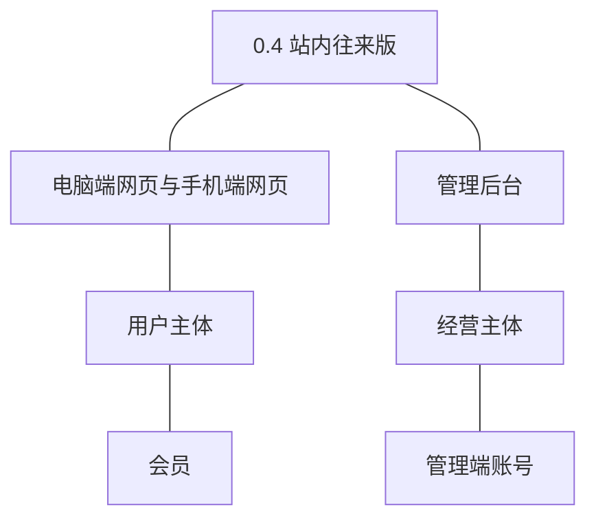
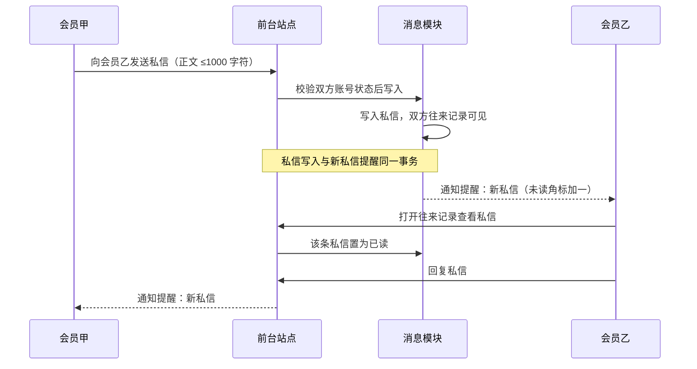
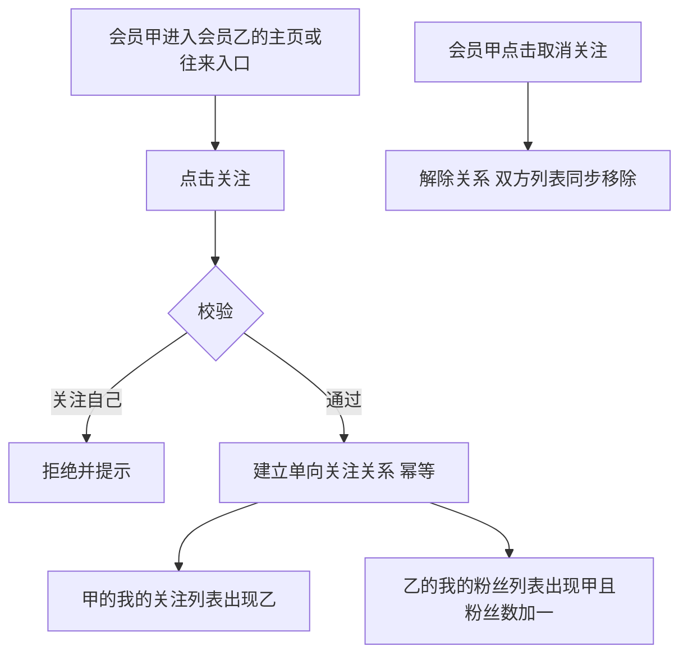
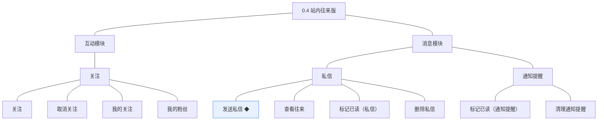
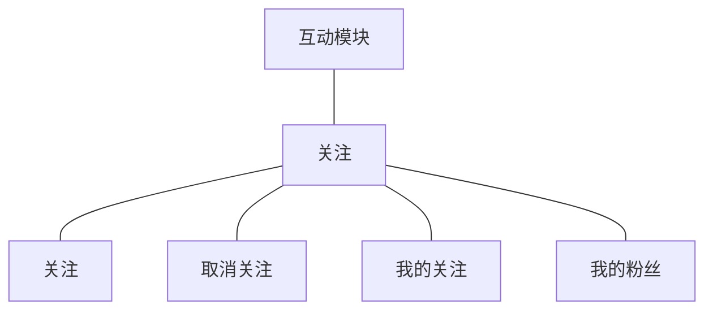
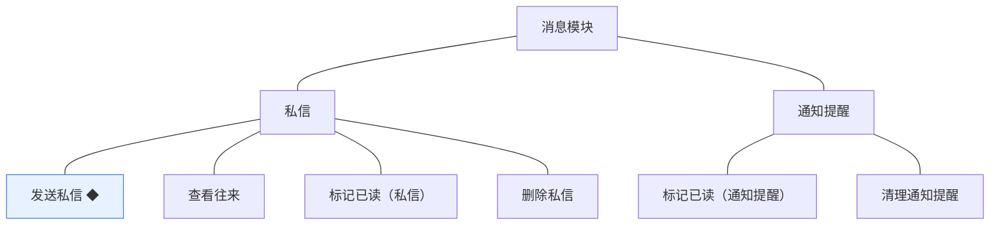
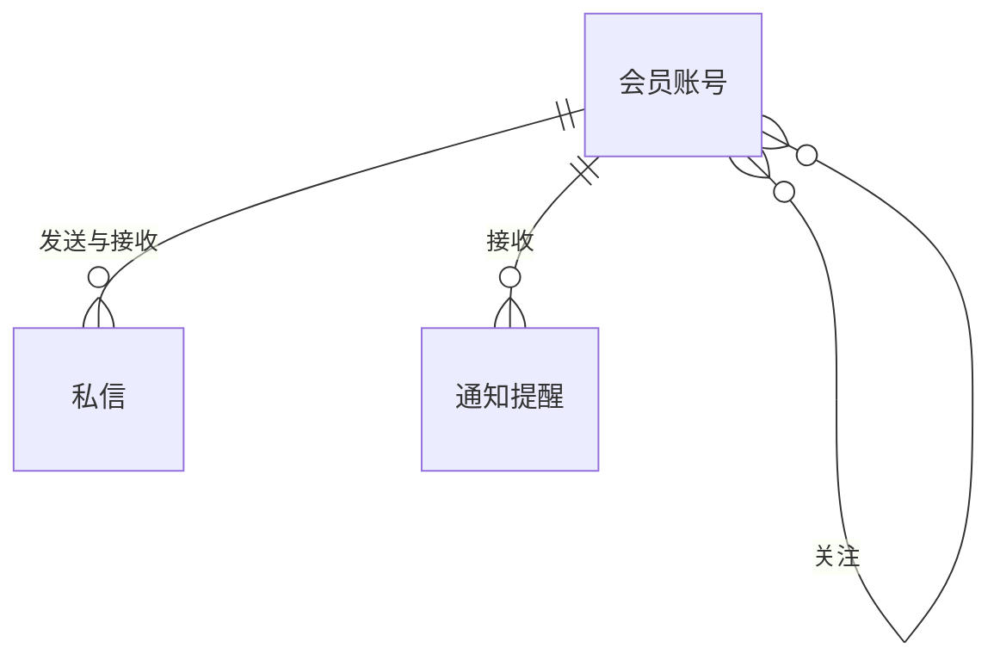
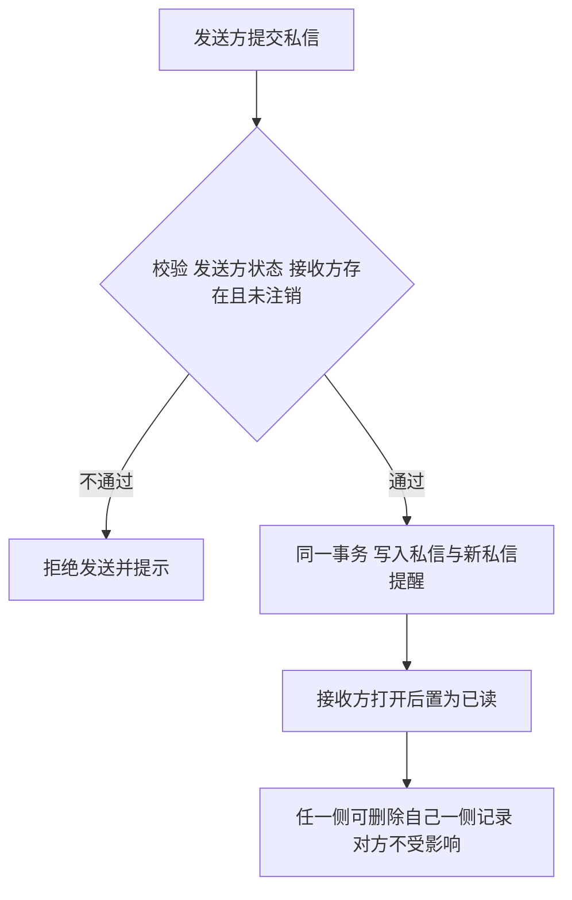
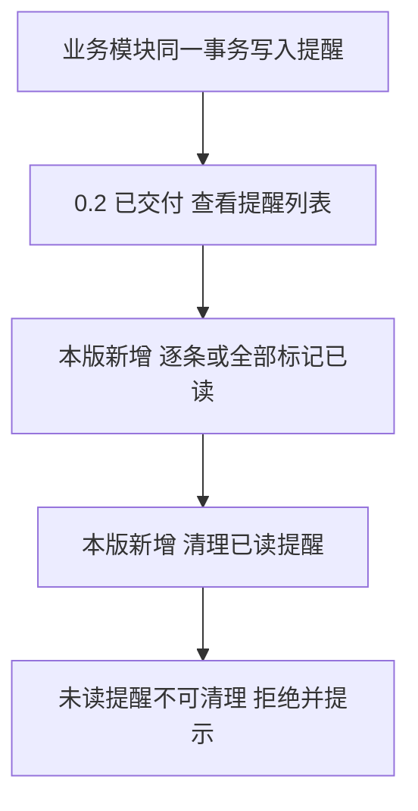
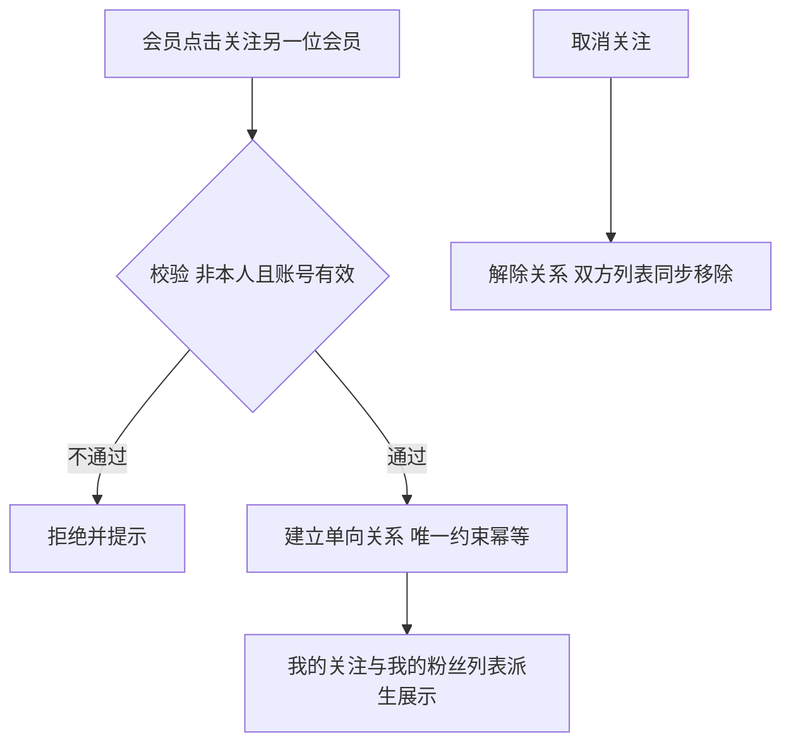

# PRD（大版本）：0.4 站内往来版

> 定位：本版立项说明书，承接路线图 0.4 条目与项目 PRD，把站内往来版范围落成带验收标准的功能需求、用户旅程与对象版本态，供需求拆解与小版本规划直接开工；上游为模拟案例材料，模拟性质予以保留。

## 1. 版本概述

**承接与目标**：承接路线图 0.4 站内往来版条目——站内往来与关注可用：会员之间能私信并收到提醒，能关注他人并积累粉丝。本版交付互动模块的关注关系族与消息模块的私信族，并为 0.2 已上线的通知提醒补齐标记已读与清理的消费面；本版与 0.3 可并行开发、发布顺序在 0.3 之后（路线图沿用行拍板）。

**成功标准与量化口径**：

- 口径一（完成标志双路径）：演练路径「两名会员互相发送私信并各自收到提醒」与「一名会员关注另一名会员后，双方在关注与粉丝列表中可见」两条全链路 100% 走通（从路线图完成标志推导）。
- 口径二（同事务送达）：私信写入与「新私信」通知提醒写入在同一事务完成，判定线 100%——本版不存在事务外补写路径，任一错位按链路异常排查（从总览协作约束表·通知送达推导）。
- 口径三（往来验证口径）：观察期内私信与关注的发生量达到本版立项时约定的数值口径——数值未定，列入立项依赖（路线图验证假设沿用，不阻塞拆解）。

**本版定案值**（路线图依赖行声明的唯一归属时点，先从版本事实推导、无事实依据的按行业惯例拍板并标明）：非好友私信的发送限制——不设好友或关注关系前置、不设发送频率上限，会员之间可直接互发私信，骚扰治理沿用 0.2 已交付的禁言与封号处置兜底（行业惯例默认：小型社区站内私信普遍全员开放，靠治理兜底；机制上保留策略开关位，04C·发送私信）；私信正文单条 ≤1000 字符（行业惯例默认）；往来记录与列表分页每页 20 条（沿用 0.2 板块内容列表口径）；通知提醒不自动过期，清理仅手动（本版拍板：锚定「清理已读提醒」为主动作，不叠加系统清理）。

**范围一句话**：做——关注、取消关注、我的关注、我的粉丝、发送私信、查看往来、标记已读（私信）、删除私信、标记已读（通知提醒）、清理通知提醒；不做——个人中心聚合面与注销（随 0.5，过渡：本版各列表经前台独立入口先行交付，0.5 汇聚为个人中心入口）、关注流的排序与推荐（未纳入，见路线图暂缓清单）、实时长连接推送与群聊（K·明确不采用）、外部邮件与短信通知。

**沿用与前置**：前置版本 0.1、0.2——沿用统一鉴权与账号状态处置（禁言与封号的发送校验消费方在本版）、通知提醒统一写入机制与前台查看入口（0.2 已交付查看，本版补已读与清理）；与 0.3 无相互依赖，可并行开发。

## 2. 主体与角色

**上场主体总览树**：

**主体表**：

| 主体 | 角色 | 端 | 怎么用系统 |
|---|---|---|---|
| 用户主体 | 会员 | 电脑端网页、手机端网页 | 关注与取关他人、查看我的关注与我的粉丝、互发私信、查看往来、标记已读、删除自己一侧私信、标记与清理通知提醒 |
| 经营主体 | 管理端账号 | 管理后台 | 对 0.2 已交付的通知提醒列表执行标记已读与清理（沿用个人设置的通知入口，无新增管理面） |

**裁剪说明**：访客不上场（本版无浏览类条目，参与即需登录）；站长、运营人员、版主经管理端账号同用通知已读与清理能力，不区分角色差异；通知提醒的写入方为各业务模块机制（非主体）。

## 3. 核心业务流程

**旅程覆盖说明**：一条跨主体旅程（会员互发私信）用时序图，一条承载版本主题的关键单端旅程（关注与粉丝）用流程图；标记已读、删除私信、清理提醒为简单操作型功能不成旅程（验收标准可覆盖）。

### 3.1 旅程一：会员互发私信并各自收到提醒（会员甲、会员乙·跨主体）

本旅程演示口径一路径：发送校验（发送方未被禁言或封号、接收方存在且未注销）→私信与「新私信」提醒同事务写入→接收方打开已读→回复形成双向往来；双方各自在自己一侧看到完整往来并收到提醒。

操作步骤清单：1. 会员甲在私信入口选择会员乙并输入正文提交；2. 系统校验双方账号状态，任一不过即拒绝并提示；3. 通过后同一事务写入私信与「新私信」通知提醒；4. 会员乙经提醒进入往来记录，打开的未读私信置为已读；5. 会员乙回复，会员甲同样收到提醒——两条方向各演示一遍即完成标志路径一。

### 3.2 旅程二：关注与粉丝列表（会员·单端）

本旅程演示口径一路径的关注段：关注为单向关系、不能关注自己、重复关注幂等；关注建立后关注方与被关注方在各自的列表中即时可见，取消即双向解除。

操作步骤清单：1. 会员甲在会员乙的入口点击关注；2. 系统校验非本人且账号有效后建立关系（重复请求幂等）；3. 甲在「我的关注」、乙在「我的粉丝」各自看到对方；4. 甲取消关注后双方列表同步移除。

## 4. 功能需求

**功能全景总图**：

功能名消歧说明：路线图 2.4 消息模块在私信与通知提醒两个功能组各有一条「标记已读」，本版按功能组消歧为「标记已读（私信）」与「标记已读（通知提醒）」，出处与语义均逐字对应路线图对应行。

### 4.1 互动模块

**关注**：会员之间的单向关系，带来粉丝语义；本组为互动模块在 0.4 点亮的全部能力（04C·关注）。

| 功能 | 用途 | 验收标准 |
|---|---|---|
| 关注 | 建立对另一位会员的单向关注 | 会员关注另一位会员后关注关系建立，出现在自己的我的关注列表，对方我的粉丝列表同步出现该会员且粉丝数加一；关注自己被拒绝并提示 |
| 取消关注 | 解除关注关系 | 会员取消关注后关系解除，我的关注不再出现该会员、对方粉丝数减一；重复取消幂等不产生副作用 |
| 我的关注 | 查看自己关注的会员列表 | 会员进入我的关注，按关注时间倒序分页展示被关注会员的昵称与头像（每页 20 条） |
| 我的粉丝 | 查看关注自己的会员列表 | 会员进入我的粉丝，按关注时间倒序分页展示粉丝的昵称与头像（每页 20 条） |

### 4.2 消息模块

**私信**：会员之间的站内往来消息，双方各自可见往来记录，单条私信只有收件方的已读语义（04C·私信）；**通知提醒**：0.2 已上线统一写入与查看，本组补齐已读与清理的消费面。

| 功能 | 用途 | 验收标准 |
|---|---|---|
| 发送私信 ◆ | 向另一位会员发送站内私信并送达提醒 | 会员向另一位会员发送私信后，接收方往来记录出现该私信且「新私信」通知提醒在同一事务内出现；被禁言或封号的账号发送被拒绝并提示；接收方为已注销账号拒绝发送 |
| 查看往来 | 查看与某位会员的双向往来记录 | 会员进入与某位会员的往来记录，按时间展示双方私信（每页 20 条），接收方未读的私信带未读标识 |
| 标记已读（私信） | 私信打开后置为已读 | 接收方打开未读私信后该条置为已读、未读数相应减少；发送方一侧不变化 |
| 删除私信 | 删除自己一侧的私信记录 | 会员删除自己一侧的私信后本人往来记录不再可见该条，对方一侧记录不受影响 |
| 标记已读（通知提醒） | 通知提醒逐条或全部标记已读 | 会员与管理端账号对提醒逐条或全部标记已读后未读数相应减少，已读提醒保留在列表中（查看已随 0.2 交付） |
| 清理通知提醒 | 清理已读提醒 | 会员与管理端账号清理已读提醒后该条从本人列表移除；未读提醒不可清理，被拒绝并提示 |

## 5. 业务对象

**对象关系总览**：本版新上线私信与关注两个对象；通知提醒沿用 0.2 扩展已读与清理路径；会员账号沿用作为关注与私信的双方主体。

### 5.1 私信

定位：会员之间的站内往来消息，不依赖外部通讯工具（术语表）。

说明：无状态对象——只有存在与已读两种事实，不承载生命周期（04C）；已读是收件方单向的阅读状态；删除按侧表达、互不影响；被禁言或封号的账号不能发送（D7）；正文单条 ≤1000 字符（本版定案·行业惯例默认）；「新私信」为通知提醒本版新增类型（已登记术语表）。

### 5.2 通知提醒

定位：把与会员相关的结果主动送达的消息，覆盖互动、审核与结算（术语表）。

说明：沿用 0.2 对象，本版只新增两条消费路径（标记已读与清理，均按接收人视角操作、不影响业务事实）；只增不改、已读是唯一可变字段（04C）；不自动过期（本版拍板）；「新私信」类型随本版接入（术语表 §7 已登记扩展取值）。

### 5.3 关注

定位：会员之间的单向关注关系，积累粉丝与内容订阅（术语表）。

说明：无状态对象——只表达存在或不存在的关系事实，取消即删除关系记录（04C）；不能关注自己；被关注人注销或封号后关系保留但不产生新内容（04C·本轮建议）；我的关注与我的粉丝为关系记录的两面派生列表；关注流的排序与推荐未纳入（路线图暂缓清单）。
