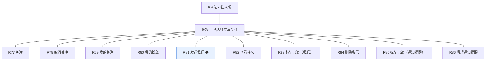
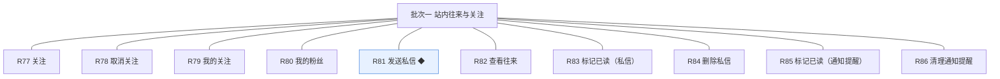

# 开发顺序与需求拆解（大版本）：0.4 站内往来版

> 定位：把大版本 PRD 转换为开发批次顺序＋功能级需求条目，本文即 0.4 站内往来版的完整需求清单（不另生成版本快照），需求池据此直接入池；上游为模拟案例材料，模拟性质予以保留。

## 1. 拆解说明

- **做什么**：把《PRD（大版本）0.4 站内往来版》的 10 项功能按依赖排成 1 个可独立验收的开发批次，每项功能转为一条可直接认领与验收的需求条目（R77～R86，编号承接此前的 R1～R76）。
- **一一同构口径**：一条需求＝一项 PRD 功能，需求名即 PRD 功能名（含 ◆ 标注与功能组消歧后缀）；用途与验收标准逐字引自 PRD 功能清单、不压缩不改写；按钮、字段与跳转级的原子拆解归小版本开发，不进本文。
- **与需求池及小版本规划的关系**：本文是需求池的批量入池主入口但不是唯一入口——会议、沟通、临时反馈产生的需求可不经本文直接单条入池（M 编号）；小版本规划的输入＝本文开发顺序＋需求池实时状态两者合并，批次划分是建议而非锁定，实际认领以需求池为准。

## 2. 开发顺序

**前置版本沿用面**：0.1、0.2 均已发布——沿用统一鉴权与账号状态处置（禁言与封号作为发送私信的校验消费方）、通知提醒统一写入机制与前台查看入口（本版补已读与清理）；与 0.3 无相互依赖（并行开发、发布顺序在 0.3 之后，路线图拍板）。

**开发批次总图**：

**批次推进链**：

**顺序依据与同事务契约**：关注族与私信族分属互动与消息两个模块、彼此无依赖，且共同构成路线图完成标志的两条路径（互发私信、关注与粉丝可见）——两族可在同一批次内并行开发、同批联调收口，拆成两批反而割裂完成标志的整体验收（批次从简判断）；本版内需要共同成立的契约：私信写入与「新私信」通知提醒同一事务（总览协作约束表·通知送达）、关注关系以唯一约束幂等（开发规范·幂等）、未读提醒不可清理；无外部联调点。

### 2.1 批次一：站内往来与关注

- **目标**：站内往来与关注可用——会员之间能私信并收到提醒，能关注他人并积累粉丝，通知提醒可标记已读与清理。
- **依赖**：前置版本 0.1、0.2（登录鉴权、账号状态处置、通知提醒写入与查看机制）；批内无跨条目硬依赖，关注族与私信族可并行开发。
- **可验收形态**：可演示路线图完成标志两条路径——两名会员互相发送私信并各自收到提醒（打开已读、回复往来、单侧删除、提醒标记与清理逐项可演）；一名会员关注另一名会员后双方在关注与粉丝列表可见（关注自己被拒、取消解除可演）。
- 判断注记：10 条两族无依赖且同批即可演示完成标志全路径，不拆批（能合并成一批演示的不拆成两批）；无路径分批交付的条目，10 条均整条交付。

条目与 PRD 4.1、4.2 功能清单一一同构，用途与验收标准逐字引自原文：

| 编号 | 需求名 | 用途 | 验收标准 |
|---|---|---|---|
| R77 | 关注 | 建立对另一位会员的单向关注 | 会员关注另一位会员后关注关系建立，出现在自己的我的关注列表，对方我的粉丝列表同步出现该会员且粉丝数加一；关注自己被拒绝并提示 |
| R78 | 取消关注 | 解除关注关系 | 会员取消关注后关系解除，我的关注不再出现该会员、对方粉丝数减一；重复取消幂等不产生副作用 |
| R79 | 我的关注 | 查看自己关注的会员列表 | 会员进入我的关注，按关注时间倒序分页展示被关注会员的昵称与头像（每页 20 条） |
| R80 | 我的粉丝 | 查看关注自己的会员列表 | 会员进入我的粉丝，按关注时间倒序分页展示粉丝的昵称与头像（每页 20 条） |
| R81 | 发送私信 ◆ | 向另一位会员发送站内私信并送达提醒 | 会员向另一位会员发送私信后，接收方往来记录出现该私信且「新私信」通知提醒在同一事务内出现；被禁言或封号的账号发送被拒绝并提示；接收方为已注销账号拒绝发送 |
| R82 | 查看往来 | 查看与某位会员的双向往来记录 | 会员进入与某位会员的往来记录，按时间展示双方私信（每页 20 条），接收方未读的私信带未读标识 |
| R83 | 标记已读（私信） | 私信打开后置为已读 | 接收方打开未读私信后该条置为已读、未读数相应减少；发送方一侧不变化 |
| R84 | 删除私信 | 删除自己一侧的私信记录 | 会员删除自己一侧的私信后本人往来记录不再可见该条，对方一侧记录不受影响 |
| R85 | 标记已读（通知提醒） | 通知提醒逐条或全部标记已读 | 会员与管理端账号对提醒逐条或全部标记已读后未读数相应减少，已读提醒保留在列表中（查看已随 0.2 交付） |
| R86 | 清理通知提醒 | 清理已读提醒 | 会员与管理端账号清理已读提醒后该条从本人列表移除；未读提醒不可清理，被拒绝并提示 |

**批次判断与边界取舍**：只拆一批——关注族与私信族无相互依赖、无外部联调点，完成标志两条路径可在同批联调中整体验收，拆两批属为流程美观多拆（过度拆分）；无路径分批交付的条目，10 条均整条交付。

**版本级验收安排**：按 PRD 量化口径执行（完成标志双路径 100%、同事务送达 100%、往来验证数值口径立项时定值）；本版为站内能力版本、无对外发布台阶（站点已开站）。

## 3. 条目与 PRD 对应核对

- **一一同构声明**：条目数 10＝PRD 功能数 10，逐行对应、无归并无拆分；需求名（含 ◆ 与功能组消歧后缀）与 PRD 功能名逐字一致；用途与验收标准逐字引自 PRD 功能清单。
- **批次构成**：批次一 10 条（互动模块关注族 4＋消息模块私信族 4＋通知提醒消费面 2）。
- **◆ 复杂条目清点**：共 1 条——R81 发送私信，与 PRD 总图高亮一致。
- **过渡支撑清点**：0 条；本版各列表经前台独立入口交付、0.5 汇聚为个人中心入口属入口聚合而非临时简化替代，按「先行交付入口，0.5 个人中心聚合」表述（非过渡支撑）。

## 4. 与需求池和小版本规划的衔接

- **入池路径**：本文 R77～R86 已按批量入池登记进《需求池》，编号沿用、批次随本文继承。
- **多入口口径**：会议、沟通与临时反馈需求不经本文直接单条入池（M 编号起），两类条目并存互不覆盖。
- **小版本规划输入**：本文开发顺序＋需求池实时状态合并；简单场景直接采纳批次建议（单批即一个小版本），唯一硬约束是本文声明的同事务契约不回退（私信与提醒同事务、关注幂等、未读不可清理）。
- **认领与细化原则**：认领时逐字携带本表用途与验收标准，开发级细化（交互、字段、边界）归小版本 PRD，本文不预写。
