# PRD（小版本）：v0.4.0 站内往来与关注

> 定位：开发级需求说明书——承接大版本 PRD 0.4 站内往来版与其 02 批次一，认领自需求池（R77～R86，状态已迁移为已认领（v0.4.0））；用途与验收标准逐字锚定上游、只细化不改写；上游为模拟案例材料，模拟性质予以保留。

## 1. 版本概述

**承接与目标**：本版认领 0.4 站内往来版批次一「站内往来与关注」全部 10 条（R77～R86，简单场景采纳整批——该大版本仅此一批），交付站内往来与关注全量：关注族（关注、取消关注、我的关注、我的粉丝）与私信族（发送私信 ◆、查看往来、标记已读（私信）、删除私信），并为 0.2 已上线的通知提醒补齐标记已读（通知提醒）与清理通知提醒的消费面（0.4 PRD §1 目标全文）。本版可验收形态：可演示路线图完成标志两条路径——两名会员互相发送私信并各自收到提醒（打开已读、回复往来、单侧删除、提醒标记与清理逐项可演）；一名会员关注另一名会员后双方在关注与粉丝列表可见（关注自己被拒、取消解除可演）（上游 02 批次一可验收形态原文）。本版为站内能力版本、无对外发布台阶。

**范围外声明**：个人中心聚合面与注销随 0.5（本版各列表与往来经前台消息中心及个人侧入口先行交付，0.5 汇聚为个人中心入口——入口聚合，非过渡支撑）；关注流的排序与推荐未纳入（路线图暂缓清单）；实时长连接推送、群聊与多人群组消息、外部邮件与短信通知不做（K·明确不采用，未读提醒经前台角标与列表呈现）；管理后台无新增界面（R85／R86 由管理端账号沿用 0.2 个人设置的通知提醒入口操作）。

**条目内顺序与依赖**（引用上游批内口径：关注族与私信族无相互依赖、可并行开发，同批联调收口）：开发序建议关注族（R77～R80）与私信族（R81～R84）并行、通知提醒消费面（R85～R86）随私信族联调（「新私信」提醒的已读与清理一并演练）；本版同事务契约不回退——私信写入与「新私信」通知提醒同一事务、关注关系唯一约束幂等、未读提醒不可清理。

**本版定案值沿用**（0.4 PRD §1，均为行业惯例默认或推导拍板）：非好友私信不设好友或关注关系前置、不设发送频率上限（骚扰治理沿用 0.2 禁言与封号）；私信正文单条 ≤1000 字符；往来记录与列表分页每页 20 条；通知提醒不自动过期、清理仅手动；「新私信」为通知提醒本版新增类型（术语表 §7 已登记）。

## 2. 需求范围与验收锚

**条目总览树**（与上游批次一分支图同名同构，◆ 随行）：

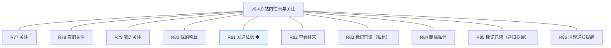

**认领条目表**（需求名／用途／验收标准逐字引自 0.4 大版本 02 批次一需求表，验收判定以本表锚为准）：

| 编号 | 需求名 | 用途 | 验收标准 |
|---|---|---|---|
| R77 | 关注 | 建立对另一位会员的单向关注 | 会员关注另一位会员后关注关系建立，出现在自己的我的关注列表，对方我的粉丝列表同步出现该会员且粉丝数加一；关注自己被拒绝并提示 |
| R78 | 取消关注 | 解除关注关系 | 会员取消关注后关系解除，我的关注不再出现该会员、对方粉丝数减一；重复取消幂等不产生副作用 |
| R79 | 我的关注 | 查看自己关注的会员列表 | 会员进入我的关注，按关注时间倒序分页展示被关注会员的昵称与头像（每页 20 条） |
| R80 | 我的粉丝 | 查看关注自己的会员列表 | 会员进入我的粉丝，按关注时间倒序分页展示粉丝的昵称与头像（每页 20 条） |
| R81 | 发送私信 ◆ | 向另一位会员发送站内私信并送达提醒 | 会员向另一位会员发送私信后，接收方往来记录出现该私信且「新私信」通知提醒在同一事务内出现；被禁言或封号的账号发送被拒绝并提示；接收方为已注销账号拒绝发送 |
| R82 | 查看往来 | 查看与某位会员的双向往来记录 | 会员进入与某位会员的往来记录，按时间展示双方私信（每页 20 条），接收方未读的私信带未读标识 |
| R83 | 标记已读（私信） | 私信打开后置为已读 | 接收方打开未读私信后该条置为已读、未读数相应减少；发送方一侧不变化 |
| R84 | 删除私信 | 删除自己一侧的私信记录 | 会员删除自己一侧的私信后本人往来记录不再可见该条，对方一侧记录不受影响 |
| R85 | 标记已读（通知提醒） | 通知提醒逐条或全部标记已读 | 会员与管理端账号对提醒逐条或全部标记已读后未读数相应减少，已读提醒保留在列表中（查看已随 0.2 交付） |
| R86 | 清理通知提醒 | 清理已读提醒 | 会员与管理端账号清理已读提醒后该条从本人列表移除；未读提醒不可清理，被拒绝并提示 |

**锚定说明**：上表三要素与 0.4 大版本 02 批次一逐字一致（含 ◆ 标注、功能组消歧后缀与全角标点）；池内登记同源（需求池 §2／§3.1，状态已认领（v0.4.0））。「接收方为已注销账号拒绝发送」的注销路径随 0.5 交付，本版接口校验先行（0.4 PRD 沿用 04C 口径，不收窄锚）。

## 3. 核心用户旅程

**旅程承接说明**：承接上游大版本 PRD 同名两条旅程，均落在批次一认领范围内，本版细化到开发级取值（正文上限、未读角标、同事务、分页）；标记已读、删除私信、清理提醒为简单操作型功能不成旅程（验收标准可覆盖）。

### 3.1 旅程一：会员互发私信并各自收到提醒（会员甲、会员乙·跨主体）

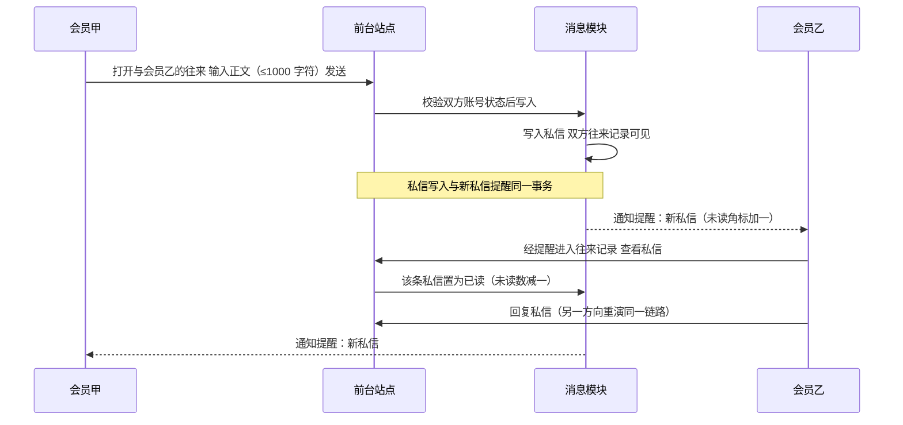

本旅程演示完成标志路径一：发送校验（发送方未被禁言或封号、接收方存在且未注销）→私信与「新私信」提醒同事务写入→接收方打开已读→回复形成双向往来；两个方向各演示一遍即达成「互相发送并各自收到提醒」。

操作步骤清单：1. 会员甲在消息中心选择会员乙（或从其入口发起）进入往来页输入正文提交；2. 系统依次校验发送方账号状态、接收方存在且未注销、正文 ≤1000 字符，任一不过即拒绝且不产生私信与提醒；3. 通过后同一事务写入私信与「新私信」通知提醒，接收方未读角标加一；4. 会员乙经提醒进入往来页，打开的未读私信置为已读、未读数减一；5. 会员乙回复，会员甲同样收到提醒——双向各演示一遍。

### 3.2 旅程二：关注与粉丝列表（会员·单端）

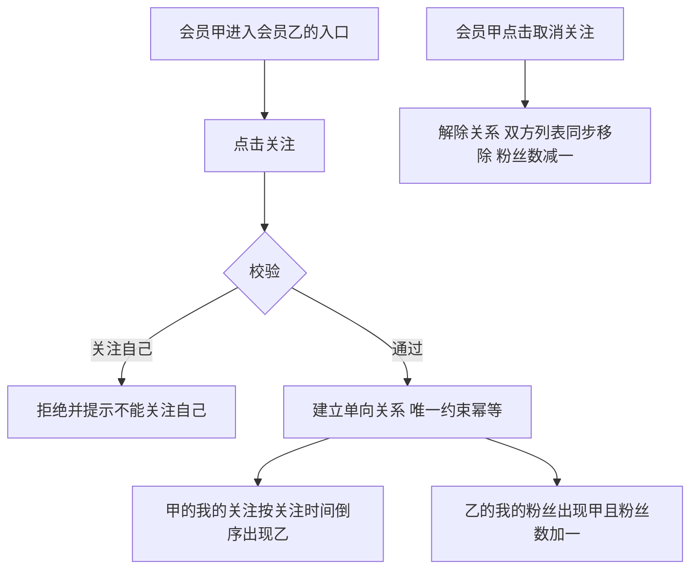

本旅程演示完成标志路径二：关注为单向关系、不能关注自己、重复关注幂等；关注建立后双方在各自的列表即时可见，取消即双向解除。

操作步骤清单：1. 会员甲在会员乙的入口点击关注；2. 系统校验非本人后建立关系（重复请求被联合唯一约束吸收、不产生重复记录）；3. 甲进入「我的关注」、乙进入「我的粉丝」各自看到对方（按关注时间倒序、每页 20 条）；4. 甲取消关注后双方列表同步移除、粉丝数减一。

## 4. 功能需求

### 4.1 功能总览

**对象归组树**（版本→对象→条目，对象为功能归属主体）：

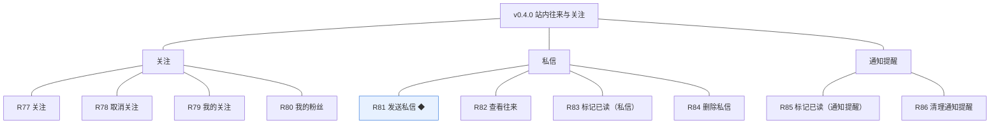

**对象增删改查矩阵**：

| 对象 | 增 | 改 | 删 | 查 |
|---|---|---|---|---|
| 关注 | R77（建立单向关系，联合唯一幂等） | 不做（无状态关系事实，仅存在或不存在） | R78（取消即删除关系记录） | R79 我的关注／R80 我的粉丝（关系记录两面派生） |
| 私信 | R81（发送，与「新私信」提醒同事务） | R83（已读，收件方单向的唯一可变事实） | R84（删除自己一侧，按侧软删除、互不影响） | R82 查看往来（双方各自一侧可见） |
| 通知提醒 | 沿用（各业务模块同事务写入；本版随 R81 接入「新私信」类型） | R85（逐条或全部标记已读） | R86（清理已读，软删除移出本人列表） | 沿用 0.2 查看通知提醒（前台入口；管理端账号经 0.2 个人设置入口） |

**主体使用面**：

| 主体 | 使用条目 | 面说明 |
|---|---|---|
| 会员 | R77～R86 | 前台·消息中心（会话与往来、提醒列表）与个人侧列表（我的关注、我的粉丝）及各会员入口的关注按钮 |
| 管理端账号 | R85、R86 | 沿用 0.2 个人设置的通知提醒入口（无新增管理面） |
| 访客 | 无 | 无界面（参与即需登录） |
| 机制行为（无人工触发面） | 「新私信」提醒写入 | 随 R81 发送事务由系统写入，非独立操作 |

### 4.2 R77 关注

**功能说明**：建立对另一位会员的单向关注——关注后双方列表与粉丝数即时可见。触发：会员在另一位会员的入口（往来页、列表页或会员卡片）点击关注。

**交互与流程**：

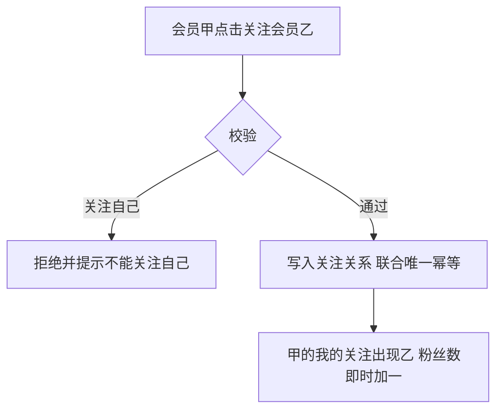

操作步骤清单：1. 会员甲点击关注按钮；2. 系统校验目标非本人；3. 通过后写入关注关系（follower_id＋followed_id 联合唯一，重复请求幂等吸收）；4. 双方列表与粉丝数即时更新。

**字段与校验**：

| 信息项 | 必填 | 校验 |
|---|---|---|
| 关注人与被关注人 | 是 | 会员账号外键对；不得为同一人；两键联合唯一 |

**规则与边界**：1. 关注为单向关系，甲关注乙不产生乙关注甲（04C）。2. 不能关注自己（R77 锚）。3. 幂等：重复关注不产生重复记录与重复计数（开发规范·幂等）。4. 被关注人封号后既有关系保留但不产生新内容（04C·本轮建议沿用）；注销路径随 0.5，届时按关系保留处理。

**异常与拦截**：1. 关注自己→拒绝并提示「不能关注自己」。2. 重复关注→幂等吸收，界面按钮态不变。3. 目标账号不存在→拒绝并提示。

### 4.3 R78 取消关注

**功能说明**：解除关注关系——取消后双方列表同步移除、粉丝数减一。触发：会员在已关注的入口或我的关注列表点击取消关注。

**交互与流程**：

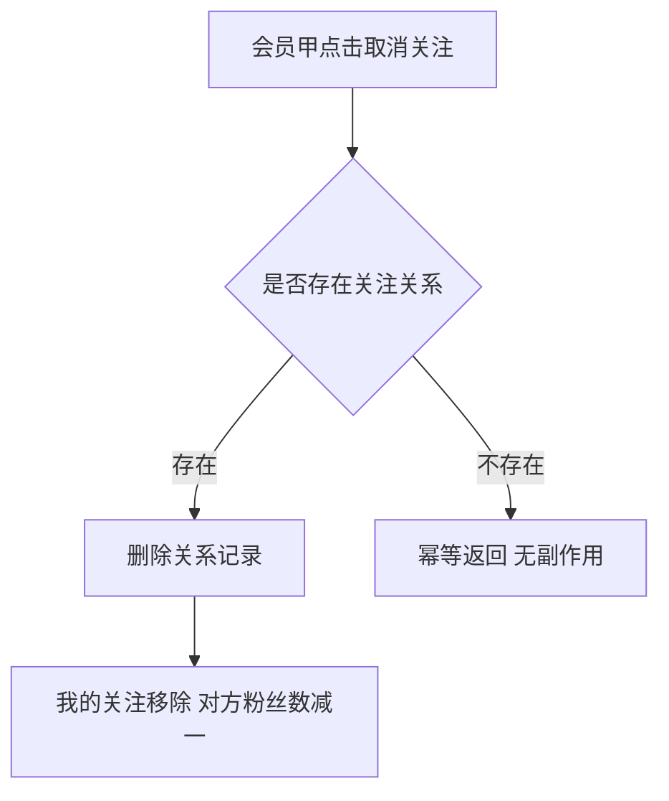

操作步骤清单：1. 会员甲点击取消关注；2. 存在关系则删除记录、双方列表与粉丝数同步更新；3. 不存在则幂等返回。

**字段与校验**：

| 信息项 | 必填 | 校验 |
|---|---|---|
| 目标会员 | 是 | 须为本人当前关注中的会员；非关注中则幂等返回 |

**规则与边界**：1. 取消即删除关系记录、不保留历史（04C·无状态关系）。2. 重复取消幂等不产生副作用（R78 锚）。3. 粉丝数由关系记录派生重算，不做独立维护值。

**异常与拦截**：1. 非关注中→幂等返回。2. 目标不存在→幂等返回（关系事实已不存在）。

### 4.4 R79 我的关注

**功能说明**：查看自己关注的会员列表。触发：会员在前台进入我的关注。

**交互与流程**：

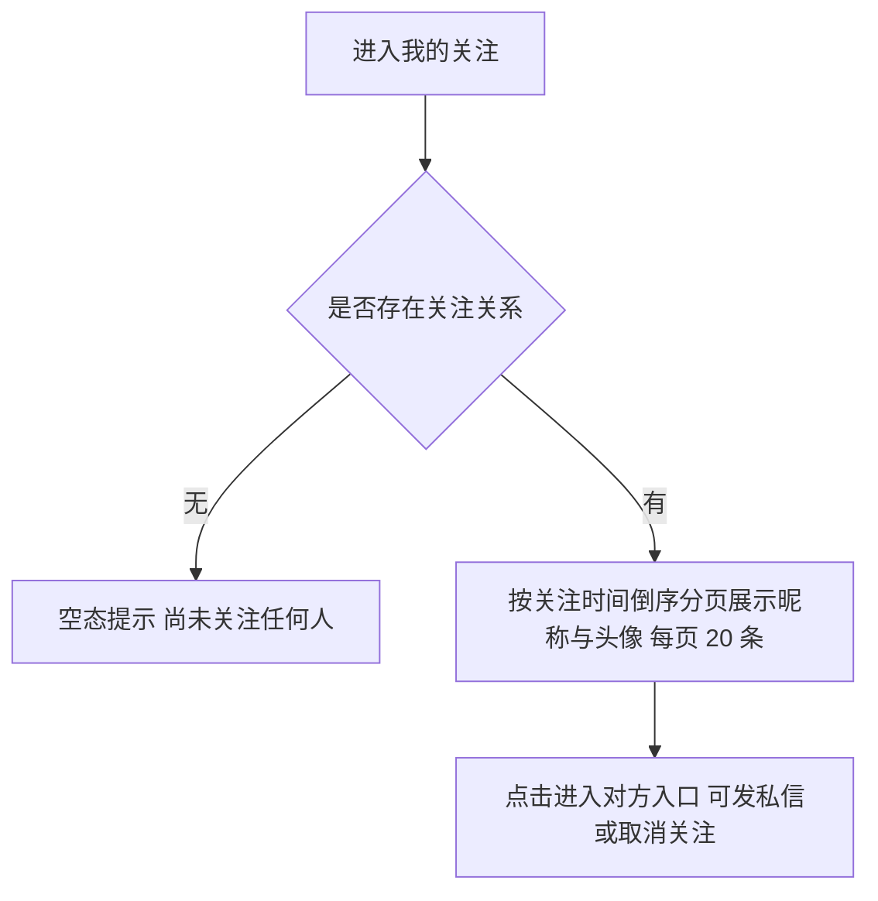

操作步骤清单：1. 会员进入我的关注；2. 按关注时间倒序、每页 20 条展示被关注会员的昵称与头像；3. 无关注时展示空态；4. 点击某一会员进入其入口。

**字段与校验**：

| 信息项 | 必填 | 校验 |
|---|---|---|
| 展示要素 | — | 昵称、头像（经会员摘要接口读取）；排序键＝关注时间倒序；每页 20 条 |

**规则与边界**：1. 列表为本人关注关系的派生视图，只读。2. 被关注人封号后仍在列表中保留（关系保留语义）。

**异常与拦截**：无——只读列表，空态为正常呈现。

### 4.5 R80 我的粉丝

**功能说明**：查看关注自己的会员列表。触发：会员在前台进入我的粉丝。

**交互与流程**：

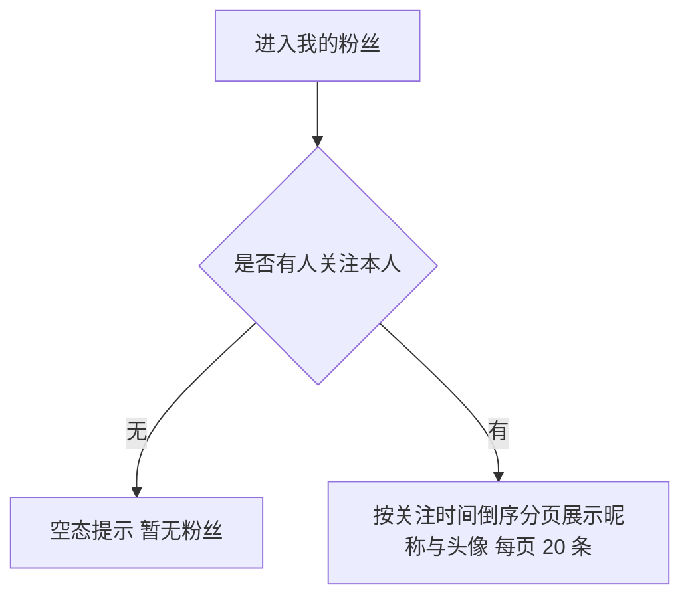

操作步骤清单：1. 会员进入我的粉丝；2. 按关注时间倒序、每页 20 条展示粉丝的昵称与头像与粉丝数；3. 无粉丝时展示空态。

**字段与校验**：

| 信息项 | 必填 | 校验 |
|---|---|---|
| 展示要素 | — | 昵称、头像、粉丝总数；排序键＝关注时间倒序；每页 20 条 |

**规则与边界**：1. 列表为被关注方向的派生视图，只读。2. 粉丝数与列表一致（由关系记录重算）。

**异常与拦截**：无——只读列表，空态为正常呈现。

### 4.6 R81 发送私信 ◆

**功能说明**：向另一位会员发送站内私信并送达提醒——私信与「新私信」通知提醒同一事务写入。触发：会员在往来页输入正文点击发送。

**交互与流程**：

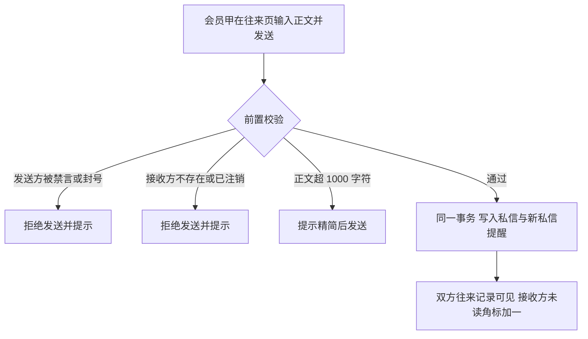

操作步骤清单：1. 会员甲进入与目标会员的往来页输入正文（≤1000 字符）发送；2. 系统依次校验发送方账号状态、接收方存在且未注销、正文字数；3. 通过后同一事务写入私信与「新私信」通知提醒（任一失败整体回滚，不出现有私信无提醒或反之）；4. 接收方未读角标加一，进入往来即可查看。

**字段与校验**：

| 信息项 | 必填 | 校验 |
|---|---|---|
| 接收方 | 是 | 存在且未注销的会员账号；不设好友或关注前置（本版定案） |
| 正文 | 是 | 1～1000 字符，空白提交拒绝 |

**规则与边界**：1. 私信写入与「新私信」提醒同一事务（R81 锚、总览协作约束表）。2. 被禁言或封号的账号不能发送（D7，禁言范围覆盖私信）。3. 不设发送频率上限（本版定案，骚扰治理走 0.2 禁言与封号）。4. 提醒摘要由消息模块统一生成（04C），展示发送方昵称（本版拍板）。5. 发送方一侧不区分已读（已读仅收件方语义）。

**异常与拦截**：1. 发送方被禁言或封号→拒绝并提示处置状态。2. 接收方不存在或已注销→拒绝发送并提示。3. 正文超限或为空→提示调整。4. 写入事务失败→私信与提醒同时回滚。

### 4.7 R82 查看往来

**功能说明**：查看与某位会员的双向往来记录。触发：会员在消息中心会话列表选择某位会员，或从其入口进入往来页。

**交互与流程**：

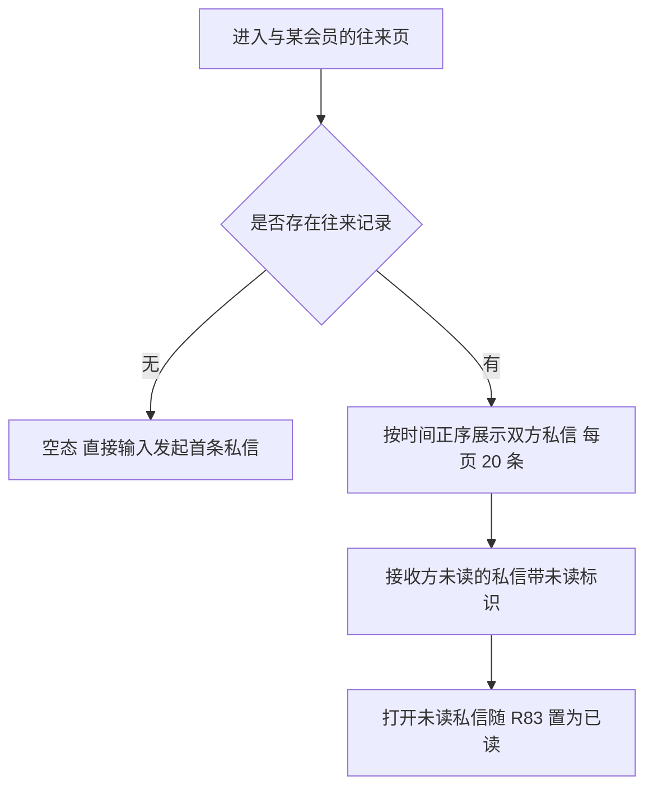

操作步骤清单：1. 会员进入与某会员的往来页；2. 按时间正序、每页 20 条展示双方私信（本人一侧与对方一侧各自过滤已删除）；3. 未读私信带未读标识，打开即置为已读；4. 无往来时展示空态并可发起首条私信。

**字段与校验**：

| 信息项 | 必填 | 校验 |
|---|---|---|
| 展示要素 | — | 对方昵称与头像、正文、发送时间、未读标识；排序键＝发送时间正序；每页 20 条 |

**规则与边界**：1. 往来按双方过滤——本人看到未删除的全部双方私信（含对方删除其一侧后仍可见本人一侧记录，R84 口径）。2. 会话列表（消息中心）按最近往来时间倒序呈现（本版拍板）。

**异常与拦截**：无——只读呈现，空态为正常呈现。

### 4.8 R83 标记已读（私信）

**功能说明**：私信打开后置为已读——已读为收件方单向事实。触发：接收方打开未读私信（进入往来页查看该条）。

**交互与流程**：

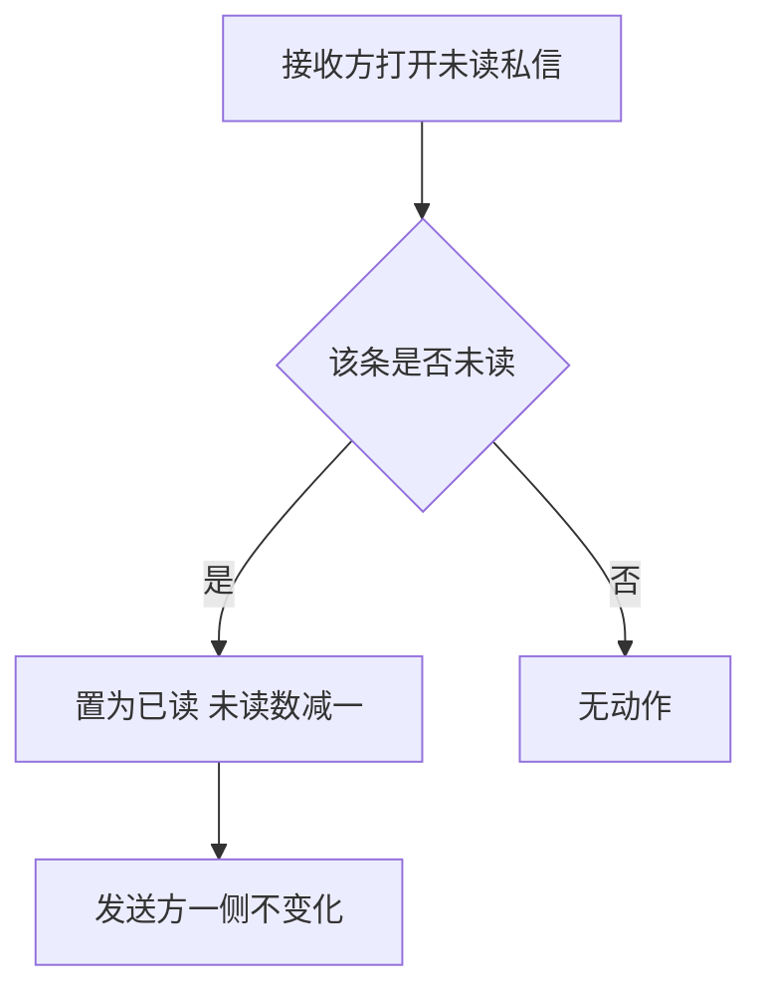

操作步骤清单：1. 接收方进入往来页查看未读私信；2. 该条置为已读、未读数（角标）相应减少；3. 发送方一侧不变化。

**字段与校验**：

| 信息项 | 必填 | 校验 |
|---|---|---|
| 已读标记 | 是 | 布尔，仅收件方可变更；打开未读私信即置位，幂等 |

**规则与边界**：1. 已读仅收件方语义，发送方不区分（04C·本轮建议）。2. 未读数按本人未读私信计数派生。3. 置位幂等，重复打开不再减少未读数。

**异常与拦截**：无——置位为幂等写操作，无独立失败分支。

### 4.9 R84 删除私信

**功能说明**：删除自己一侧的私信记录——按侧删除、互不影响。触发：会员在自己的往来页对某条私信执行删除。

**交互与流程**：

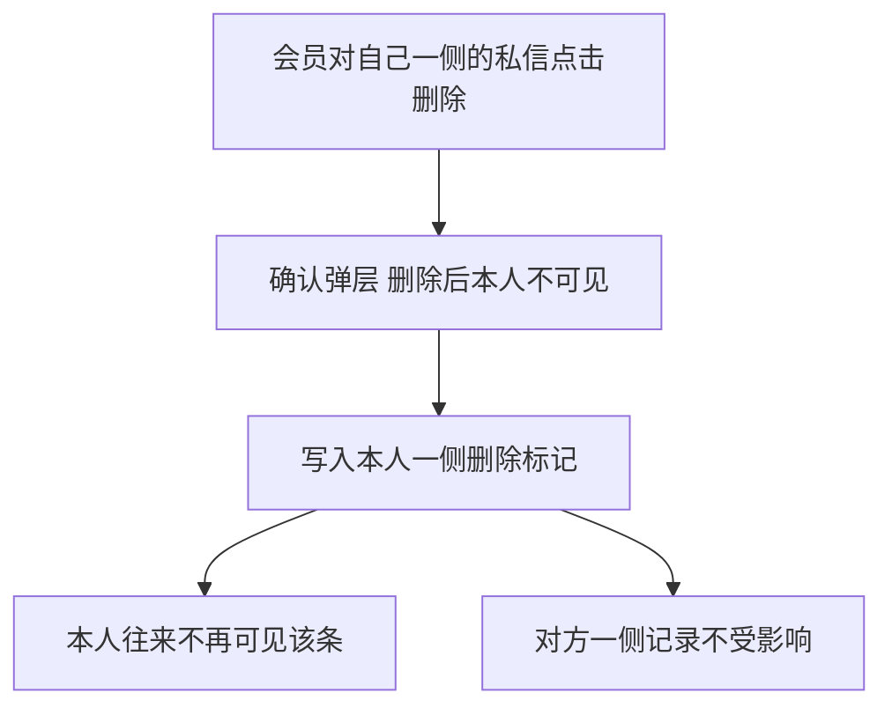

操作步骤清单：1. 会员对某条私信点击删除并确认（删除仅作用于本人一侧）；2. 系统写入本人一侧删除时间（发送侧或接收侧按本人身份）；3. 本人往来记录不再可见该条；4. 对方一侧不受影响。

**字段与校验**：

| 信息项 | 必填 | 校验 |
|---|---|---|
| 删除确认 | 是 | 二次确认弹层（仅删本人一侧、不影响对方） |

**规则与边界**：1. 删除按侧软删除（sender_deleted_at／receiver_deleted_at），互不影响（R84 锚）。2. 不提供恢复路径（本版拍板：删除即本人侧终态）。3. 重复删除幂等。

**异常与拦截**：1. 对非本人一侧记录→接口拒绝。2. 重复删除→幂等返回。

### 4.10 R85 标记已读（通知提醒）

**功能说明**：通知提醒逐条或全部标记已读——已读提醒保留在列表。触发：会员在前台提醒列表、管理端账号在 0.2 个人设置提醒入口操作。

**交互与流程**：

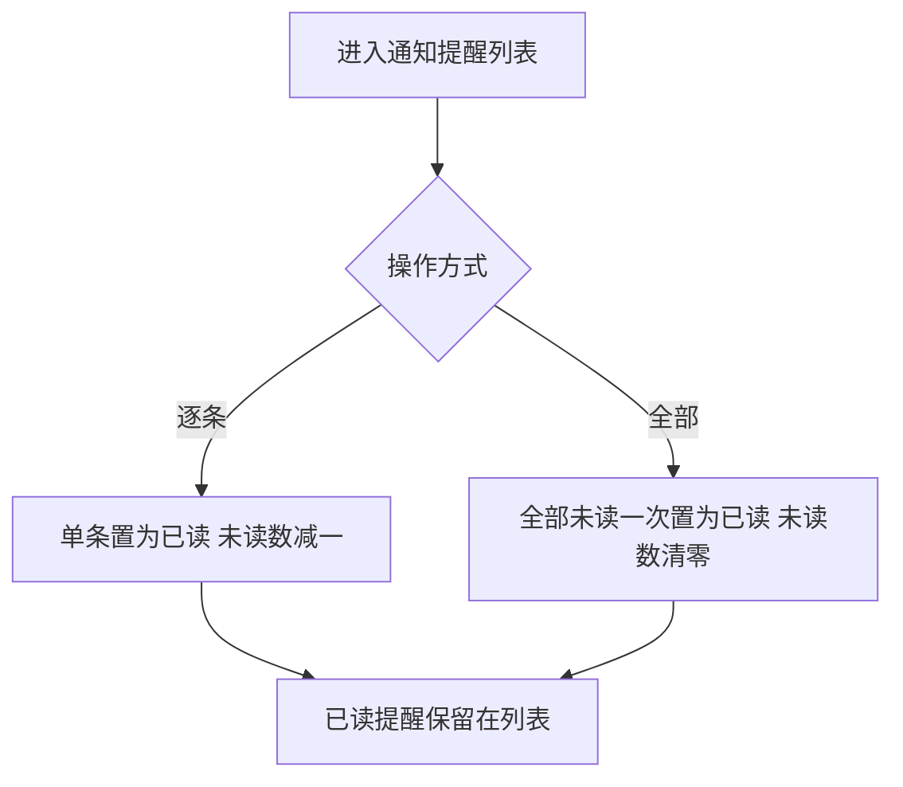

操作步骤清单：1. 进入提醒列表（前台或个人设置入口）；2. 逐条点击或「全部已读」一键操作；3. 未读数相应减少，已读提醒保留在列表中可继续查看。

**字段与校验**：

| 信息项 | 必填 | 校验 |
|---|---|---|
| 操作范围 | 是 | 逐条（单条未读）或全部（本人全部未读）；仅本人提醒可操作 |

**规则与边界**：1. 已读是通知提醒唯一可变字段（04C），标记不影响业务事实。2. 「全部已读」按接收人视角一次置位（本版拍板）。3. 查看入口沿用 0.2 已交付界面，本版仅新增已读操作（R85 锚括注沿用）。

**异常与拦截**：1. 对已读提醒重复标记→幂等返回。2. 非本人提醒→接口拒绝。

### 4.11 R86 清理通知提醒

**功能说明**：清理已读提醒——清理后从本人列表移除，未读不可清理。触发：会员或管理端账号在提醒列表对已读条目执行清理（含「清理全部已读」）。

**交互与流程**：

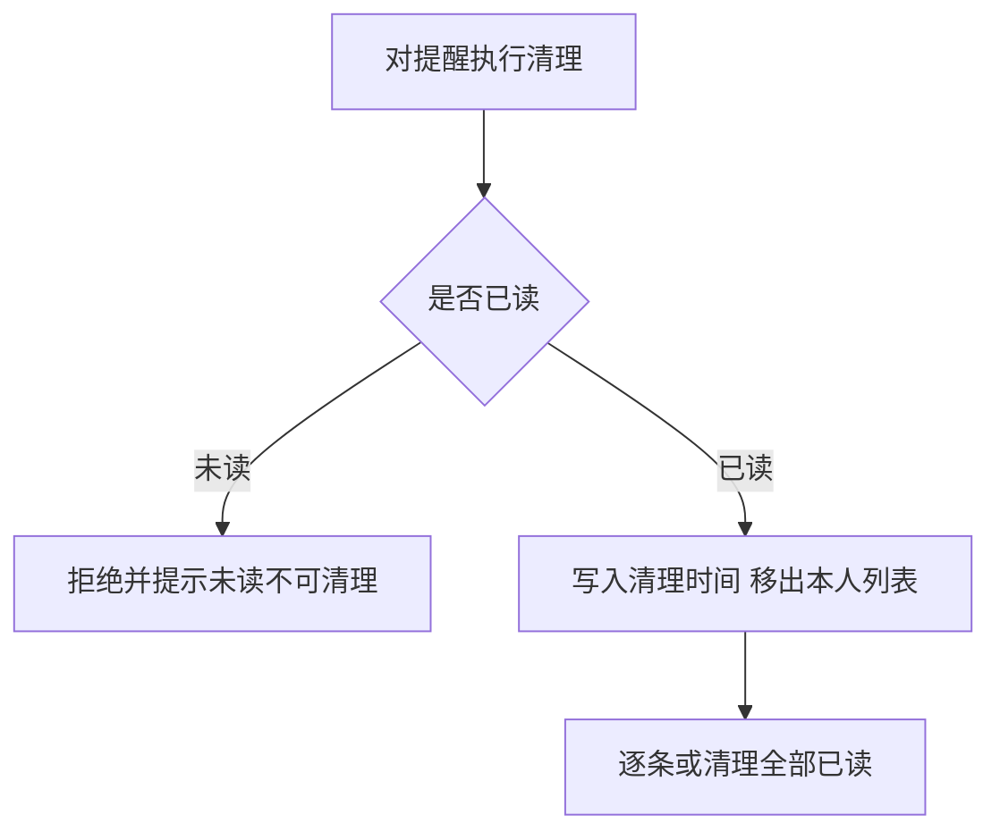

操作步骤清单：1. 在提醒列表对已读条目点击清理（或「清理全部已读」）；2. 系统校验为已读，未读被拒绝并提示；3. 通过后写入清理时间，该条从本人列表移除（业务事实保留）。

**字段与校验**：

| 信息项 | 必填 | 校验 |
|---|---|---|
| 清理目标 | 是 | 须为本人已读提醒；未读一律拒绝 |

**规则与边界**：1. 清理为接收人视角的软删除，不影响业务事实（04C）。2. 未读提醒不可清理（R86 锚）。3. 支持逐条清理与「清理全部已读」一次操作（本版拍板）。4. 提醒不自动过期（本版定案）。

**异常与拦截**：1. 未读提醒→拒绝并提示「未读提醒不可清理」。2. 重复清理→幂等返回。3. 非本人提醒→接口拒绝。

## 5. 业务对象与数据字段

**数据主体清单**：

| 业务对象 | 落库名 | 定位与关系 |
|---|---|---|
| 私信 | private_message | 会员之间的站内往来消息，发送人与接收人均为会员账号；已读为收件方单向事实；删除按侧软删除（两侧互不影响） |
| 关注 | follow | 会员之间的单向关注关系，关注人与被关注人两键联合唯一；我的关注与我的粉丝为其两面派生视图 |
| 通知提醒 | notification | 沿用 0.2 对象，本版新增已读操作与清理路径（清理为软删除）；「新私信」类型随本版接入 |
| 会员账号 | member_account | 沿用，作为私信双方与关注双方主体；账号状态（禁言／封号）为发送校验来源 |

**逐对象字段表**：

私信 private_message：

| 字段 | 必填 | 业务类型 | 落库字段名 | 约束与取值 |
|---|---|---|---|---|
| 私信编号 | 是 | 编号 | message_no | 创建时生成、终身不变（§5 编码契约，v0.4.0 增补） |
| 发送人 | 是 | 关联 | sender_id | 会员账号，发送时须非禁言非封号 |
| 接收人 | 是 | 关联 | receiver_id | 会员账号，存在且未注销 |
| 正文 | 是 | 文本 | content | 1～1000 字符 |
| 已读 | 是 | 布尔 | is_read | 默认未读，仅收件方打开后置位 |
| 发送时间 | 是 | 时间 | sent_at | 发送事务写入 |
| 发送侧删除时间 | 否 | 时间 | sender_deleted_at | 发送方删除自己一侧时写入 |
| 接收侧删除时间 | 否 | 时间 | receiver_deleted_at | 接收方删除自己一侧时写入 |

关注 follow：

| 字段 | 必填 | 业务类型 | 落库字段名 | 约束与取值 |
|---|---|---|---|---|
| 关注人 | 是 | 关联 | follower_id | 会员账号 |
| 被关注人 | 是 | 关联 | followed_id | 会员账号，不得与关注人相同；两键联合唯一 |

通知提醒 notification（沿用 0.2 字段，本版新增一项）：

| 字段 | 必填 | 业务类型 | 落库字段名 | 约束与取值 |
|---|---|---|---|---|
| 清理时间 | 否 | 时间 | deleted_at | 清理已读提醒时写入（软删除，移出本人列表、业务事实保留） |
| 类型取值扩展 | — | 枚举 | notify_type | 新增「新私信」（术语表 §7 已登记）；其余字段沿用 v0.2.0 登记 |

以上新字段与编码名已随认领登记术语表 §5／§7（来源 v0.4.0）；列类型、主键、索引与建表 DDL 归开发阶段。

## 6. 待议与建议

**本版采用的推断与默认值汇总**：

| 采用值 | 来源状态 |
|---|---|
| 非好友私信不设好友或关注前置、不设频率上限 | 0.4 PRD 本版定案（行业惯例默认；治理兜底沿用禁言与封号） |
| 私信正文单条 ≤1000 字符 | 0.4 PRD 本版定案（行业惯例默认） |
| 往来与列表每页 20 条、时间倒序（往来页内正序） | 0.4 PRD 定案沿用＋本版拍板（沿用 0.2 列表口径） |
| 会话列表按最近往来时间倒序 | 本版拍板（行业惯例默认） |
| 删除私信按侧软删除、不提供恢复 | 本版拍板（从「删除自己一侧、互不影响」锚推导） |
| 「全部已读」与「清理全部已读」一次操作 | 本版拍板（锚「逐条或全部」同构扩展） |
| 「新私信」提醒摘要展示发送方昵称 | 本版拍板（04C 文案统一生成口径内的取值） |
| 未读数按未读记录派生计数 | 本版拍板（可重算，不独立维护） |
| 通知提醒不自动过期 | 0.4 PRD 本版定案 |

**待确认内容与影响**：无阻塞性待议——往来验证数值口径（观察期私信与关注发生量）属版本级验收安排，立项依赖已在 0.4 PRD 声明，不影响本版开发。

**建议回池的新想法**：无。

**术语表登记**：本版新字段（private_message 八字段、follow 两键、notification.deleted_at）与编码名 message_no 已随认领登记术语表 §5／§7（来源 v0.4.0），变更记录已追加；notify_type「新私信」取值已于 0.4 立项时登记，本文逐字沿用。
