# PRD（大版本）：0.5 会员中心版

> 定位：本版立项说明书，承接路线图 0.5 条目与项目 PRD，把会员中心版范围落成带验收标准的功能需求、用户旅程与对象版本态，供需求拆解与小版本规划直接开工；上游为模拟案例材料，模拟性质予以保留。

## 1. 版本概述

**承接与目标**：承接路线图 0.5 会员中心版条目——外部使用者（会员）的自助管理面完整：个人中心能查到自己的内容与记录，能管理资料与凭据，能注销。本版交付个人中心聚合面（我的内容、我的资料与凭据、我的私信与通知提醒、我的收藏、我的点赞、流水查询、等级展示）与两项新能力（等级权益配置、会员注销）；0.4 先行交付的各独立入口自此汇聚为个人中心入口（入口聚合，非过渡支撑替代）。

**成功标准与量化口径**：

- 口径一（完成标志全链路）：会员在个人中心依次查到自己的内容、收藏、积分与等级、私信与通知，并完成一次注销；注销后再登录被拒绝——全链路 100% 走通（从路线图完成标志推导）。
- 口径二（权益即时生效）：等级权益配置保存后，内容可见判定即时按新配置执行，判定线 100%——本版不存在延迟生效窗口（机制强制，从「等级变化即时生效」推导）。
- 口径三（使用验证口径）：个人中心各入口的访问量口径未定，列入立项依赖（路线图验证假设沿用，不阻塞拆解）。

**本版定案值**（路线图依赖行声明的唯一归属时点，先从版本事实推导、无事实依据的按行业惯例拍板并标明）：会员注销后公开内容的保留范围——已公开内容（话题、评论、问题、答案）全部保留，作者身份统一显示为「已注销会员」占位（昵称置为占位、头像置默认头像）；待审核与已驳回内容随注销一并移出（不再进入队列与列表）；既有关注关系保留但不产生新内容；向已注销账号的私信与提醒写入静默丢弃（04C 沿用）；注销前置阻断项＝待结算悬赏（04C·本轮建议沿用；待审核内容不阻断，随注销移出）；注销后原账号名不可被他人注册占用；「已注销」为会员账号新增终态（术语表 §4 已登记）。等级权益配置默认值——各档可见范围初始为全开放、权限集合初始为空集不做限制（本版拍板：配置能力与消费链路先行交付、即时生效，收紧取值由站长按运营需要设定）；流水与列表分页每页 20 条（沿用口径）。

**范围一句话**：做——我的内容入口、我的资料与凭据、我的私信与通知提醒、注销 ◆、我的收藏、我的点赞、流水查询、等级权益配置、等级展示；不做——积分人工修正（归 0.7）、会员注销后的内容迁移或导出（未纳入，见路线图暂缓清单）、关注流的排序与推荐（暂缓清单沿用）。

**沿用与前置**：前置版本 0.1～0.4 全部已发布——沿用 0.1 的资料与凭据维护、0.2 的内容与收藏及通知查看、0.3 的积分账本与等级判定、0.4 的私信往来与关注粉丝及提醒已读清理；本版不新建消息、互动或账本机制，只做聚合入口、查询面、权益配置与注销。

## 2. 主体与角色

**上场主体总览树**：

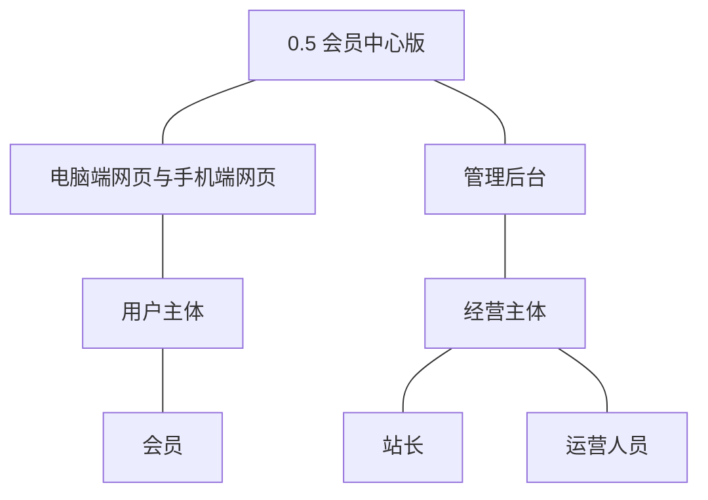

**主体表**：

| 主体 | 角色 | 端 | 怎么用系统 |
|---|---|---|---|
| 用户主体 | 会员 | 电脑端网页、手机端网页 | 经个人中心查自己的内容、收藏、点赞、积分与流水、等级、私信与通知，维护资料与凭据，配置并完成注销 |
| 经营主体 | 站长 | 管理后台 | 配置各等级开放的可见范围与权限（即时生效） |
| 经营主体 | 运营人员 | 管理后台 | 按会员与时间查询积分流水 |

**裁剪说明**：访客不上场（个人中心登录后可达）；版主无本版条目；流水查询的经营侧与会员侧同接口不同过滤范围。

## 3. 核心业务流程

**旅程覆盖说明**：一条跨主体旅程（等级权益配置与可见性生效）用时序图，两条承载版本主题的关键单端旅程（个人中心自助查看、会员注销）用流程图；我的收藏、我的点赞、流水查询、我的资料与凭据为简单操作型功能不成旅程（验收标准可覆盖）。

### 3.1 旅程一：会员个人中心自助查看（会员·单端）

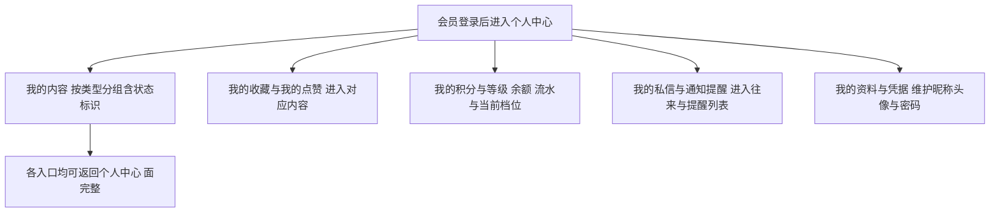

本旅程演示口径一前半段：个人中心一次可达全部自助面——内容（含待审核／已驳回状态与驳回原因入口）、收藏、点赞、积分与流水、等级、私信与通知；各面为 0.1～0.4 已交付能力的聚合入口，不重复建设。

操作步骤清单：1. 会员登录进入个人中心；2. 依次进入我的内容（话题、评论、问题、答案分组与状态标识）、我的收藏、我的点赞、我的积分与等级（余额、流水、档位）、我的私信与通知提醒；3. 在我的资料与凭据维护昵称、头像与密码；4. 全部入口自查完成即达成「能查到自己的内容与记录，能管理资料与凭据」。

### 3.2 旅程二：会员注销（会员·单端·终态）

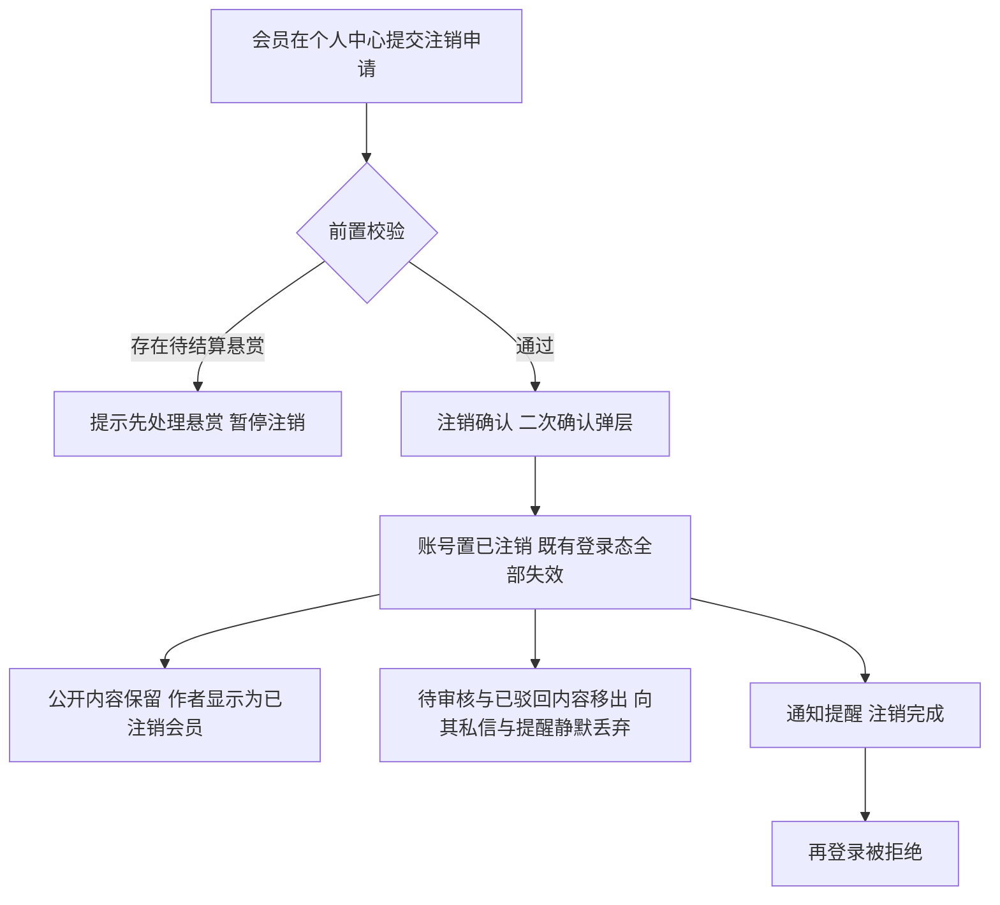

本旅程演示口径一后半段：注销为终态操作——前置阻断（待结算悬赏）、二次确认、登录态失效、内容按保留策略处理、注销完成通知；注销后原账号名不可复用、再登录被拒绝。

操作步骤清单：1. 会员在个人中心提交注销；2. 系统校验待结算悬赏等前置阻断项，不通过则提示先处理；3. 二次确认后账号置已注销、登录态全部失效；4. 已公开内容保留并显示「已注销会员」，待审核与已驳回内容移出；5. 收到注销完成通知；6. 以原凭据再登录被拒绝（验收锚）。

### 3.3 旅程三：等级权益配置与可见性生效（站长、会员·跨主体）

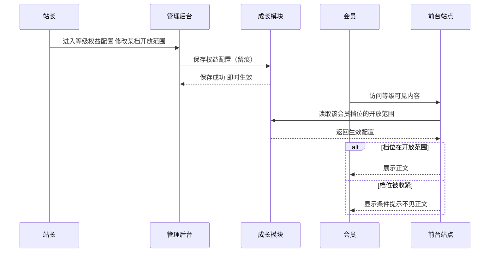

本旅程演示口径二：站长在管理后台配置各等级开放的可见范围与权限，保存即时生效并留痕；会员侧内容可见判定即时读取生效配置，无延迟窗口。

操作步骤清单：1. 站长进入管理后台·等级权益配置；2. 修改某档开放的可见范围（或权限集合）并保存，变更留痕；3. 会员访问对应等级可见内容，可见判定按新配置即时执行（收紧则见条件提示、放宽则恢复可见）；4. 会员当前等级展示与距下一等级积分差随判定同步（等级展示）。

## 4. 功能需求

**功能全景总图**：

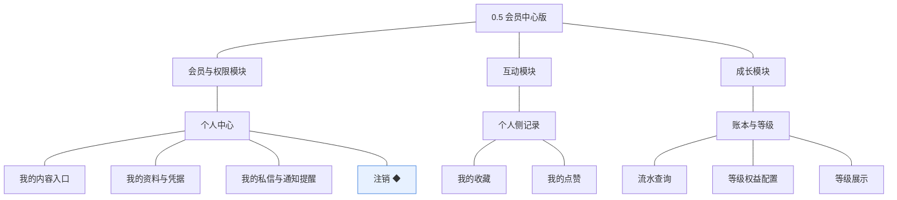

### 4.1 会员与权限模块

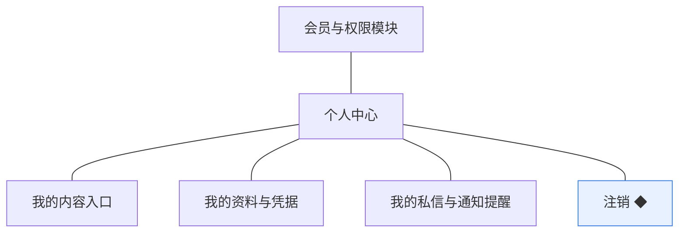

**个人中心**：会员自助管理面的聚合入口，本模块承载内容入口、资料凭据、消息入口与注销（04C·个人中心）。

| 功能 | 用途 | 验收标准 |
|---|---|---|
| 我的内容入口 | 聚合查看自己发表的内容 | 会员进入个人中心我的内容，按类型分组展示自己的话题、评论、问题与答案，待审核与已驳回条目带状态标识并可查看驳回原因，点击可进入对应内容详情 |
| 我的资料与凭据 | 个人中心的资料与凭据维护入口 | 会员在个人中心维护昵称与头像保存后即时生效，修改密码后新凭据可登录且既有登录态全部失效（0.1 能力经个人中心入口承接） |
| 我的私信与通知提醒 | 进入消息模块的往来与提醒 | 会员从个人中心进入私信往来与通知提醒列表，0.4 已交付的查看、标记已读与清理能力全部可达（入口聚合不改能力） |
| 注销 ◆ | 会员主动注销账号 | 会员提交注销并通过前置校验（无待结算悬赏）后账号注销、登录态全部失效、再登录被拒绝；已公开内容保留并显示为「已注销会员」，收到注销完成通知 |

### 4.2 互动模块

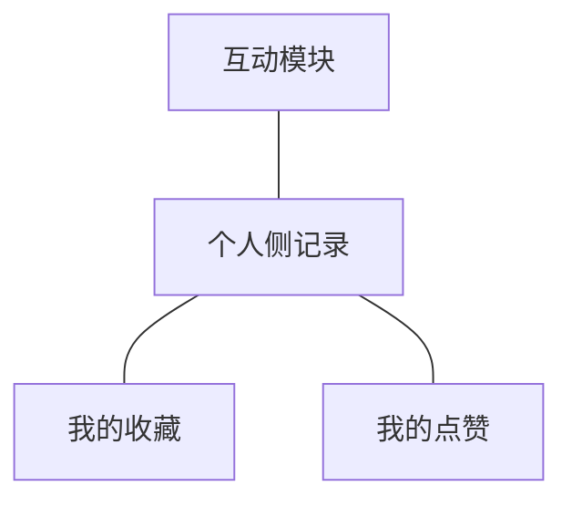

**个人侧记录**：互动模块持有的收藏与点赞关系在个人中心的呈现（04C·契约·读取我的收藏）。

| 功能 | 用途 | 验收标准 |
|---|---|---|
| 我的收藏 | 查看收藏列表并进入内容详情 | 会员进入我的收藏，列表展示已收藏的话题并可进入内容详情，取消收藏后即时移出列表（收藏范围沿用 v0.2.1 口径） |
| 我的点赞 | 查看自己点过赞的内容 | 会员进入我的点赞，列表展示自己点过赞的话题、评论、问题与答案并可进入对应内容，取消点赞后即时移出列表 |

### 4.3 成长模块

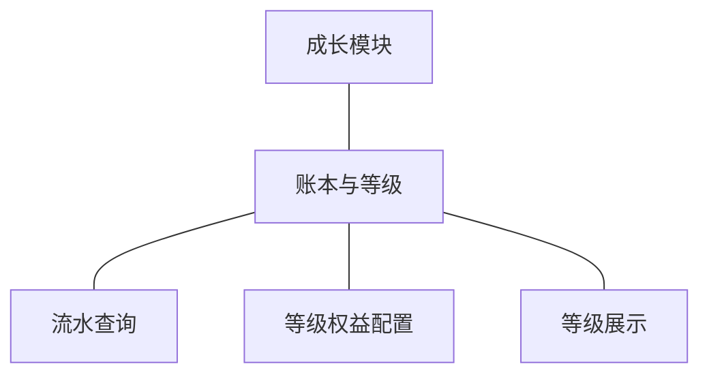

**账本与等级**：积分流水的查询面与等级的权益配置、展示面（04C·读取账户与流水、等级权益配置）。

| 功能 | 用途 | 验收标准 |
|---|---|---|
| 流水查询 | 会员查自己的流水，经营方按会员与时间查询 | 会员在个人中心查询自己的积分流水，展示余额与逐笔变动（来源类型、方向、数值、时间，每页 20 条）且与余额重算一致；运营人员与站长在管理后台按会员与时间区间查询 |
| 等级权益配置 | 在各等级上配置开放的可见范围与权限 | 站长在各等级档位配置开放的可见范围与权限并保存后即时生效、变更留痕，内容可见判定按新配置即时执行（收紧档位后该档会员访问对应内容见条件提示，恢复后可见） |
| 等级展示 | 展示当前等级与距下一等级的积分差 | 前台与个人中心展示会员当前等级名称与距下一等级的积分差，积分变动后展示随判定即时更新 |

## 5. 业务对象

**对象关系总览**：本版不新建业务对象——个人中心为聚合面而非对象；会员账号扩展「已注销」终态，会员等级扩展权益配置，收藏、点赞、积分流水、私信、通知提醒沿用并新增个人中心查询路径。下图按沿用关系的真实基数呈现（与项目数据模型一致：流水经积分账户归属会员），本版新增的是对这些关系的查询路径（我的内容、我的收藏、我的点赞、我的流水、等级展示与权益配置），不新增关系本身。

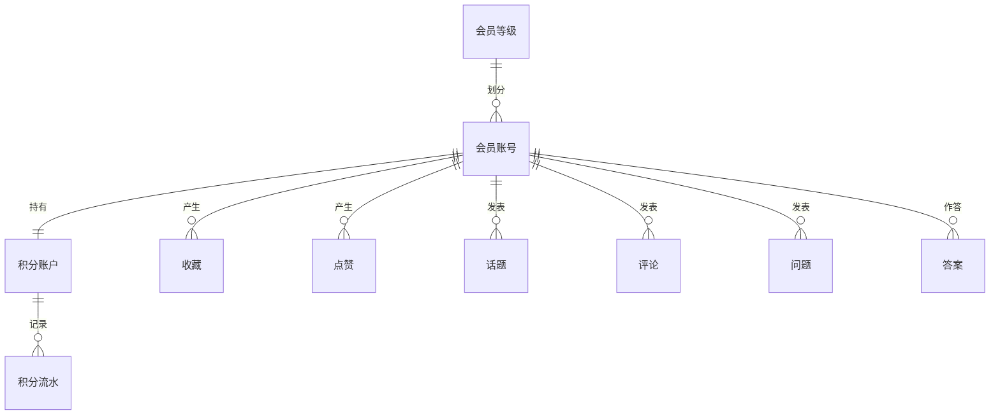

### 5.1 会员账号

定位：社区成员的身份载体（术语表）。

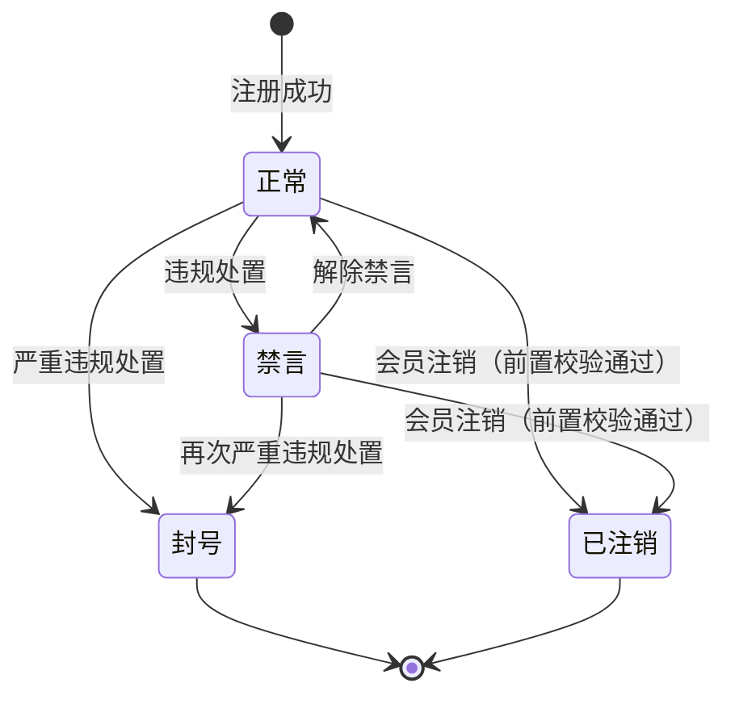

说明：本版新增「已注销」终态（术语表 §4 已登记）——注销前置校验通过后由会员本人触发，登录态全部失效、再登录拒绝、账号名不可复用；已公开内容保留并显示「已注销会员」，待审核与已驳回内容移出；向已注销账号的私信与提醒写入静默丢弃（04C 沿用）。禁言期间可发起注销——禁言是发言限制而非账号存续限制，前置阻断项仅待结算悬赏（本版拍板：从定案值与 04C 注销流程推导），故正常与禁言两态均可流转至已注销；封号为平台处置终态且无法登录，不经会员注销路径。

### 5.2 会员等级

定位：会员成长的分层，决定可见内容与权限的开放程度（术语表）。

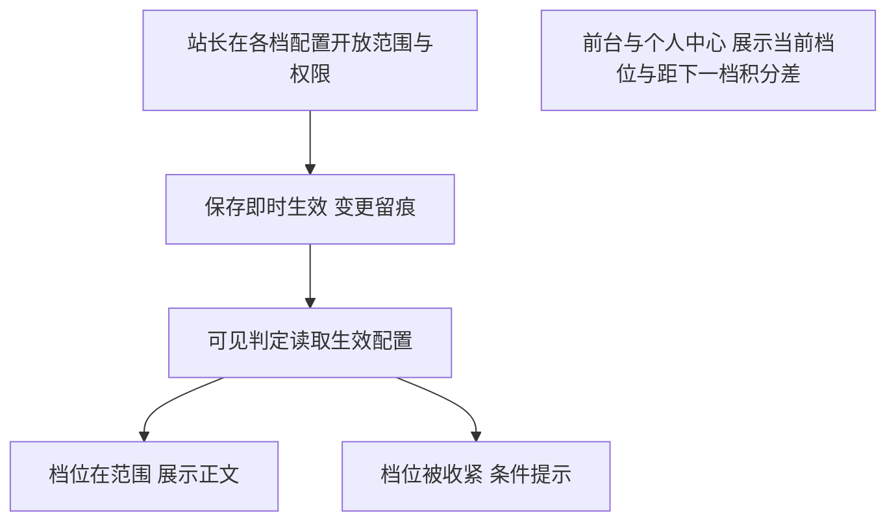

说明：沿用 0.3 判定机制，本版新增权益配置面（各档开放的可见范围与权限）与等级展示（当前档位名称＋距下一等级积分差）；默认值＝各档全开放、权限集合空集不做限制（本版拍板），收紧取值由站长设定、即时生效。

### 5.3 沿用对象接入路径（收藏／点赞／积分流水／私信／通知提醒）

说明：收藏与点赞新增个人中心列表读取路径（契约·读取我的收藏，点赞同构）；积分流水新增会员自查面与经营方按会员与时间查询面（只读，余额可重算）；私信与通知提醒经个人中心入口聚合（0.4 能力不改）；各对象机制与落库沿用既有登记。
