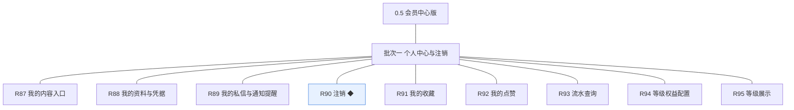
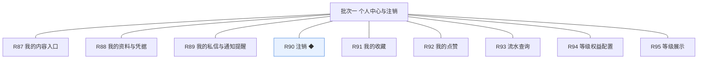

# 开发顺序与需求拆解（大版本）：0.5 会员中心版

> 定位：把大版本 PRD 转换为开发批次顺序＋功能级需求条目，本文即 0.5 会员中心版的完整需求清单（不另生成版本快照），需求池据此直接入池；上游为模拟案例材料，模拟性质予以保留。

## 1. 拆解说明

- **做什么**：把《PRD（大版本）0.5 会员中心版》的 9 项功能按依赖排成 1 个可独立验收的开发批次，每项功能转为一条可直接认领与验收的需求条目（R87～R95，编号承接此前的 R1～R86）。
- **一一同构口径**：一条需求＝一项 PRD 功能，需求名即 PRD 功能名（含 ◆ 标注）；用途与验收标准逐字引自 PRD 功能清单、不压缩不改写；按钮、字段与跳转级的原子拆解归小版本开发，不进本文。
- **与需求池及小版本规划的关系**：本文是需求池的批量入池主入口但不是唯一入口——会议、沟通、临时反馈产生的需求可不经本文直接单条入池（M 编号）；小版本规划的输入＝本文开发顺序＋需求池实时状态两者合并，批次划分是建议而非锁定，实际认领以需求池为准。

## 2. 开发顺序

**前置版本沿用面**：0.1～0.4 均已发布——沿用资料与凭据维护（0.1）、内容与收藏及通知查看（0.2）、积分账本与等级判定（0.3）、私信往来与提醒已读清理（0.4）；本版不新建消息、互动或账本机制，只做聚合入口、查询面、权益配置与注销。

**开发批次总图**：

**批次推进链**：

**顺序依据与同事务契约**：七条聚合与查询条目为 0.1～0.4 已交付能力的入口汇聚（只读或既有能力承接），等级权益配置与注销为两项新写入能力；完成标志要求「个人中心一次查全并完成一次注销」——九条须同批联调整体验收，拆批割裂完成标志（批次从简判断）；本版内需要共同成立的契约：注销与前置校验（待结算悬赏阻断）、账号置已注销与登录态失效同事务、权益配置保存与留痕同事务并即时生效；无外部联调点。

### 2.1 批次一：个人中心与注销

- **目标**：外部使用者（会员）的自助管理面完整——个人中心能查到自己的内容与记录，能管理资料与凭据，能注销；等级权益可配置并即时生效。
- **依赖**：前置版本 0.1～0.4（聚合面全部能力已交付）；批内开发序建议聚合入口先行（R87～R89、R91～R93、R95）→ 权益配置（R94）与注销（R90）收口；注销演练置于批次最后（终态破坏性操作）。
- **可验收形态**：可演示路线图完成标志——会员在个人中心依次查到自己的内容、收藏、积分与等级、私信与通知并完成一次注销，注销后再登录被拒绝；权益配置收紧与恢复即时生效可演。
- 判断注记：九条中七条为入口汇聚与查询面、两条为新写入能力，完成标志须个人中心与注销同批联调，不拆批（能合并成一批演示的不拆成两批）；无路径分批交付的条目，9 条均整条交付。

条目与 PRD 4.1～4.3 功能清单一一同构，用途与验收标准逐字引自原文：

| 编号 | 需求名 | 用途 | 验收标准 |
|---|---|---|---|
| R87 | 我的内容入口 | 聚合查看自己发表的内容 | 会员进入个人中心我的内容，按类型分组展示自己的话题、评论、问题与答案，待审核与已驳回条目带状态标识并可查看驳回原因，点击可进入对应内容详情 |
| R88 | 我的资料与凭据 | 个人中心的资料与凭据维护入口 | 会员在个人中心维护昵称与头像保存后即时生效，修改密码后新凭据可登录且既有登录态全部失效（0.1 能力经个人中心入口承接） |
| R89 | 我的私信与通知提醒 | 进入消息模块的往来与提醒 | 会员从个人中心进入私信往来与通知提醒列表，0.4 已交付的查看、标记已读与清理能力全部可达（入口聚合不改能力） |
| R90 | 注销 ◆ | 会员主动注销账号 | 会员提交注销并通过前置校验（无待结算悬赏）后账号注销、登录态全部失效、再登录被拒绝；已公开内容保留并显示为「已注销会员」，收到注销完成通知 |
| R91 | 我的收藏 | 查看收藏列表并进入内容详情 | 会员进入我的收藏，列表展示已收藏的话题并可进入内容详情，取消收藏后即时移出列表（收藏范围沿用 v0.2.1 口径） |
| R92 | 我的点赞 | 查看自己点过赞的内容 | 会员进入我的点赞，列表展示自己点过赞的话题、评论、问题与答案并可进入对应内容，取消点赞后即时移出列表 |
| R93 | 流水查询 | 会员查自己的流水，经营方按会员与时间查询 | 会员在个人中心查询自己的积分流水，展示余额与逐笔变动（来源类型、方向、数值、时间，每页 20 条）且与余额重算一致；运营人员与站长在管理后台按会员与时间区间查询 |
| R94 | 等级权益配置 | 在各等级上配置开放的可见范围与权限 | 站长在各等级档位配置开放的可见范围与权限并保存后即时生效、变更留痕，内容可见判定按新配置即时执行（收紧档位后该档会员访问对应内容见条件提示，恢复后可见） |
| R95 | 等级展示 | 展示当前等级与距下一等级的积分差 | 前台与个人中心展示会员当前等级名称与距下一等级的积分差，积分变动后展示随判定即时更新 |

**批次判断与边界取舍**：只拆一批——聚合面与两项新能力共同构成完成标志全链路，拆批属为流程美观多拆（过度拆分）；无路径分批交付的条目，9 条均整条交付。

**版本级验收安排**：按 PRD 量化口径执行（完成标志全链路 100%、权益即时生效 100%、访问量口径立项时定值）；本版为站内能力版本、无对外发布台阶（站点已开站）。

## 3. 条目与 PRD 对应核对

- **一一同构声明**：条目数 9＝PRD 功能数 9，逐行对应、无归并无拆分；需求名（含 ◆）与 PRD 功能名逐字一致；用途与验收标准逐字引自 PRD 功能清单。
- **批次构成**：批次一 9 条（个人中心入口族 4＋互动个人侧记录 2＋成长账本与等级 3）。
- **◆ 复杂条目清点**：共 1 条——R90 注销，与 PRD 总图高亮一致。
- **过渡支撑清点**：0 条；0.4 先行交付的独立入口在本版汇聚为个人中心入口属入口聚合而非临时简化替代（「先行交付入口，本版个人中心聚合」口径沿用）。

## 4. 与需求池和小版本规划的衔接

- **入池路径**：本文 R87～R95 已按批量入池登记进《需求池》，编号沿用、批次随本文继承。
- **多入口口径**：会议、沟通与临时反馈需求不经本文直接单条入池（M 编号起），两类条目并存互不覆盖。
- **小版本规划输入**：本文开发顺序＋需求池实时状态合并；简单场景直接采纳批次建议（单批即一个小版本），唯一硬约束是本文声明的依赖与同事务契约不回退（注销前置校验与登录态失效同事务、权益配置即时生效）。
- **认领与细化原则**：认领时逐字携带本表用途与验收标准，开发级细化（交互、字段、边界）归小版本 PRD，本文不预写。
