# PRD（小版本）：v0.5.0 个人中心与注销

> 定位：开发级需求说明书——承接大版本 PRD 0.5 会员中心版与其 02 批次一，认领自需求池（R87～R95，状态已迁移为已认领（v0.5.0））；用途与验收标准逐字锚定上游、只细化不改写；上游为模拟案例材料，模拟性质予以保留。

## 1. 版本概述

**承接与目标**：本版认领 0.5 会员中心版批次一「个人中心与注销」全部 9 条（R87～R95，简单场景采纳整批——该大版本仅此一批），交付外部使用者（会员）的自助管理面：个人中心聚合我的一切入口（我的内容、我的资料与凭据、我的私信与通知提醒、我的收藏、我的点赞、流水查询、等级展示）与两项新能力（等级权益配置、会员注销）；0.4 先行交付的独立入口自此汇聚为个人中心入口（入口聚合，非过渡支撑）。本版可验收形态：可演示路线图完成标志——会员在个人中心依次查到自己的内容、收藏、积分与等级、私信与通知并完成一次注销，注销后再登录被拒绝；权益配置收紧与恢复即时生效可演（上游 02 批次一可验收形态原文）。本版为站内能力版本、无对外发布台阶。

**范围外声明**：积分人工修正随 0.7；会员注销后的内容迁移或导出未纳入（路线图暂缓清单）；关注流的排序与推荐未纳入（暂缓清单沿用）；等级权益默认值外的新权限项扩展（如档位差异化的操作权限）不在本版预写——本版权益配置只承载可见范围与权限集合的既有口径，新权限项走需求池单条入池；管理后台除等级权益配置页与流水查询入口外无新增界面。

**条目内顺序与依赖**（引用上游批内口径：聚合入口先行、权益配置与注销收口）：开发序建议聚合与查询面先行（R87～R89、R91～R93、R95）→ 等级权益配置（R94）与注销（R90）收口，注销演练置于批次最后（终态破坏性操作）；同事务契约不回退——注销与前置校验（待结算悬赏阻断）及登录态失效同事务、权益配置保存与留痕同事务并即时生效。

**本版定案值沿用**（0.5 PRD §1，均为推导拍板或行业惯例默认）：注销保留范围——已公开内容保留并显示「已注销会员」占位、待审核与已驳回内容随注销移出、既有关注关系保留、向已注销账号的私信与提醒静默丢弃、前置阻断项仅待结算悬赏、账号名不可复用、「已注销」为会员账号终态（术语表 §4）；禁言期间可发起注销（禁言是发言限制而非账号存续限制）；等级权益默认＝各档可见范围全开放、权限集合空集不做限制；分页每页 20 条（沿用口径）。

## 2. 需求范围与验收锚

**条目总览树**（与上游批次一分支图同名同构，◆ 随行）：

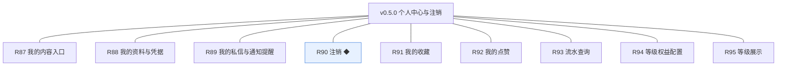

**认领条目表**（需求名／用途／验收标准逐字引自 0.5 大版本 02 批次一需求表，验收判定以本表锚为准）：

| 编号 | 需求名 | 用途 | 验收标准 |
|---|---|---|---|
| R87 | 我的内容入口 | 聚合查看自己发表的内容 | 会员进入个人中心我的内容，按类型分组展示自己的话题、评论、问题与答案，待审核与已驳回条目带状态标识并可查看驳回原因，点击可进入对应内容详情 |
| R88 | 我的资料与凭据 | 个人中心的资料与凭据维护入口 | 会员在个人中心维护昵称与头像保存后即时生效，修改密码后新凭据可登录且既有登录态全部失效（0.1 能力经个人中心入口承接） |
| R89 | 我的私信与通知提醒 | 进入消息模块的往来与提醒 | 会员从个人中心进入私信往来与通知提醒列表，0.4 已交付的查看、标记已读与清理能力全部可达（入口聚合不改能力） |
| R90 | 注销 ◆ | 会员主动注销账号 | 会员提交注销并通过前置校验（无待结算悬赏）后账号注销、登录态全部失效、再登录被拒绝；已公开内容保留并显示为「已注销会员」，收到注销完成通知 |
| R91 | 我的收藏 | 查看收藏列表并进入内容详情 | 会员进入我的收藏，列表展示已收藏的话题并可进入内容详情，取消收藏后即时移出列表（收藏范围沿用 v0.2.1 口径） |
| R92 | 我的点赞 | 查看自己点过赞的内容 | 会员进入我的点赞，列表展示自己点过赞的话题、评论、问题与答案并可进入对应内容，取消点赞后即时移出列表 |
| R93 | 流水查询 | 会员查自己的流水，经营方按会员与时间查询 | 会员在个人中心查询自己的积分流水，展示余额与逐笔变动（来源类型、方向、数值、时间，每页 20 条）且与余额重算一致；运营人员与站长在管理后台按会员与时间区间查询 |
| R94 | 等级权益配置 | 在各等级上配置开放的可见范围与权限 | 站长在各等级档位配置开放的可见范围与权限并保存后即时生效、变更留痕，内容可见判定按新配置即时执行（收紧档位后该档会员访问对应内容见条件提示，恢复后可见） |
| R95 | 等级展示 | 展示当前等级与距下一等级的积分差 | 前台与个人中心展示会员当前等级名称与距下一等级的积分差，积分变动后展示随判定即时更新 |

**锚定说明**：上表三要素与 0.5 大版本 02 批次一逐字一致（含 ◆ 标注与全角标点）；池内登记同源（需求池 §2／§3.1，状态已认领（v0.5.0））。我的收藏锚中「收藏范围沿用 v0.2.1 口径」＝收藏对象仅限话题；问答内容收藏扩展已按 v0.3.1 建议回池，不在本版。

## 3. 核心用户旅程

**旅程承接说明**：承接上游大版本 PRD 同名三条旅程，均落在批次一认领范围内，本版细化到开发级取值（分组维度、阻断项、占位显示、即时生效）；我的收藏、我的点赞、流水查询、我的资料与凭据为简单操作型功能不成旅程（验收标准可覆盖）。

### 3.1 旅程一：会员个人中心自助查看（会员·单端）

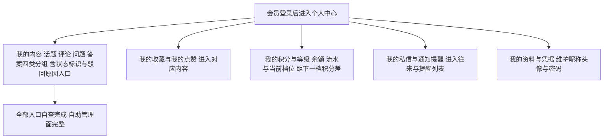

本旅程演示口径一前半段：个人中心一次可达全部自助面，各面为 0.1～0.4 已交付能力的聚合入口，能力本身不在本版重复建设。

操作步骤清单：1. 会员登录进入个人中心；2. 依次进入我的内容（四类分组与状态标识）、我的收藏、我的点赞、我的积分与等级（余额、流水、档位与积分差）、我的私信与通知提醒；3. 在我的资料与凭据维护昵称、头像与密码；4. 全部入口自查完成。

### 3.2 旅程二：会员注销（会员·单端·终态）

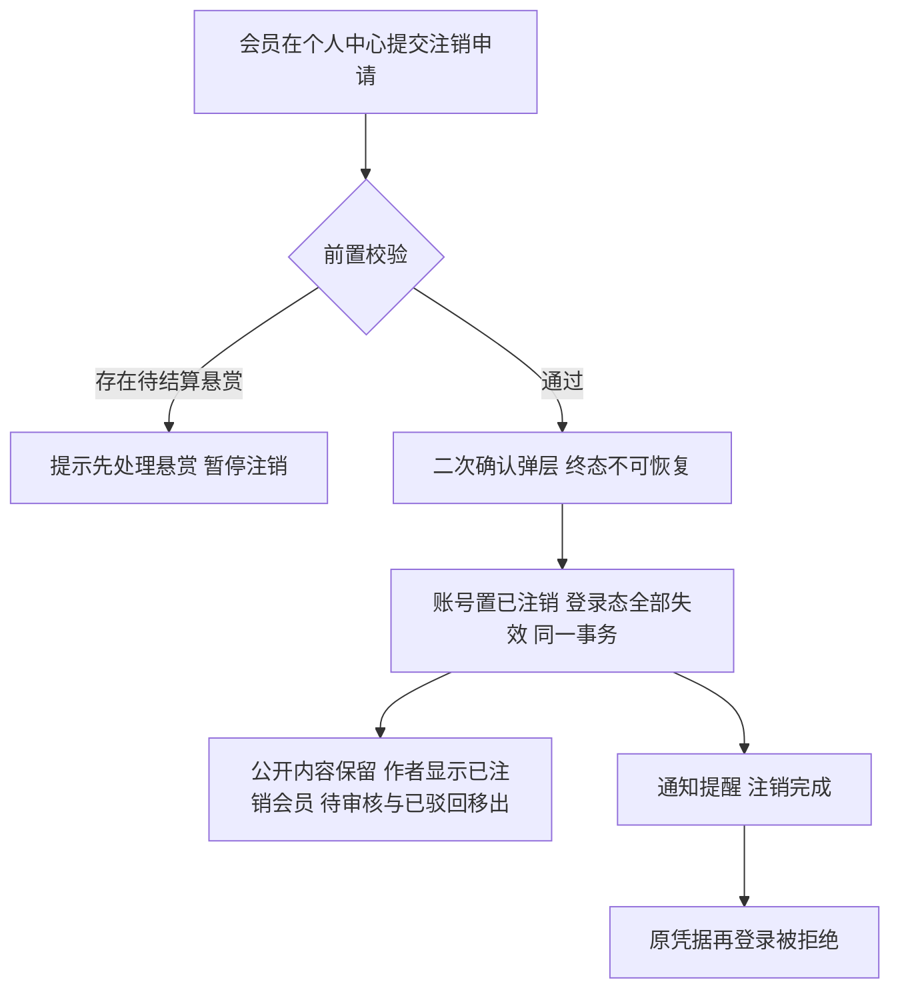

本旅程演示口径一后半段：注销为终态操作——前置阻断（仅待结算悬赏）、二次确认、登录态失效与状态置位同事务、内容按保留策略处理、注销完成通知、再登录被拒绝；禁言期间同样可发起注销（禁言是发言限制而非账号存续限制）。

操作步骤清单：1. 会员在个人中心提交注销；2. 系统校验待结算悬赏，存在则提示先处理并暂停；3. 二次确认后同一事务内置已注销（写注销时间）、全部登录态失效；4. 已公开内容保留并显示「已注销会员」，待审核与已驳回内容移出；5. 收到注销完成通知；6. 以原凭据再登录被拒绝（验收锚）。

### 3.3 旅程三：等级权益配置与可见性生效（站长、会员·跨主体）

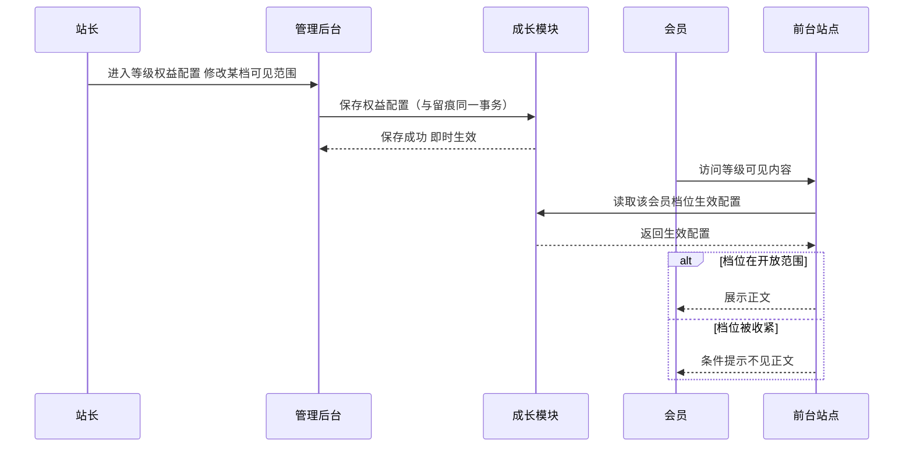

本旅程演示口径二：权益配置保存即时生效并留痕，会员侧可见判定即时读取生效配置，无延迟窗口。

操作步骤清单：1. 站长进入管理后台·等级权益配置；2. 修改某档开放的可见范围（或权限集合）保存，留痕同事务；3. 会员访问对应等级可见内容，判定按新配置即时执行；4. 恢复开放后该档会员重新可见。

## 4. 功能需求

### 4.1 功能总览

**对象归组树**（版本→对象→条目，对象为功能归属主体）：

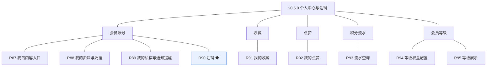

**对象增删改查矩阵**：

| 对象 | 增 | 改 | 删 | 查 |
|---|---|---|---|---|
| 会员账号 | 不做（注册随 0.1 已交付） | R88 资料与凭据（昵称、头像、密码）／R90 置已注销（终态） | 不做（注销为终态表达，不物理删除） | R87 我的内容入口（本人内容聚合）／R89 消息入口（聚合只读） |
| 收藏 | 沿用（0.2 收藏与取消） | 不做（关系事实） | 沿用（取消收藏） | R91 我的收藏（个人中心列表＋取消即移出） |
| 点赞 | 沿用（0.2 点赞与取消，取值扩展沿用 0.3） | 不做（关系事实） | 沿用（取消点赞） | R92 我的点赞（个人中心列表＋取消即移出） |
| 积分流水 | 沿用（事件写入，v0.3.0 起登记） | 不做（只增不改） | 不做 | R93 流水查询（会员自查＋经营方按会员与时间） |
| 会员等级 | 不做（判定派生） | R94 权益配置（各档开放范围与权限） | 不做 | R95 等级展示（当前档位与积分差；判定读取沿用 0.3） |

**主体使用面**：

| 主体 | 使用条目 | 面说明 |
|---|---|---|
| 会员 | R87～R93、R95 | 前台·个人中心（聚合导航＋各子面）；注销入口置于个人中心底部 |
| 站长 | R94 | 管理后台·等级权益配置（本版唯一新增管理面） |
| 运营人员、站长 | R93（经营侧） | 管理后台·流水查询（按会员与时间区间，只读） |
| 访客、版主 | 无本版条目 | 无界面 |

### 4.2 R87 我的内容入口

**功能说明**：聚合查看自己发表的内容——按类型分组展示本人的话题、评论、问题与答案，含未公开状态与驳回原因。触发：会员进入个人中心我的内容。

**交互与流程**：

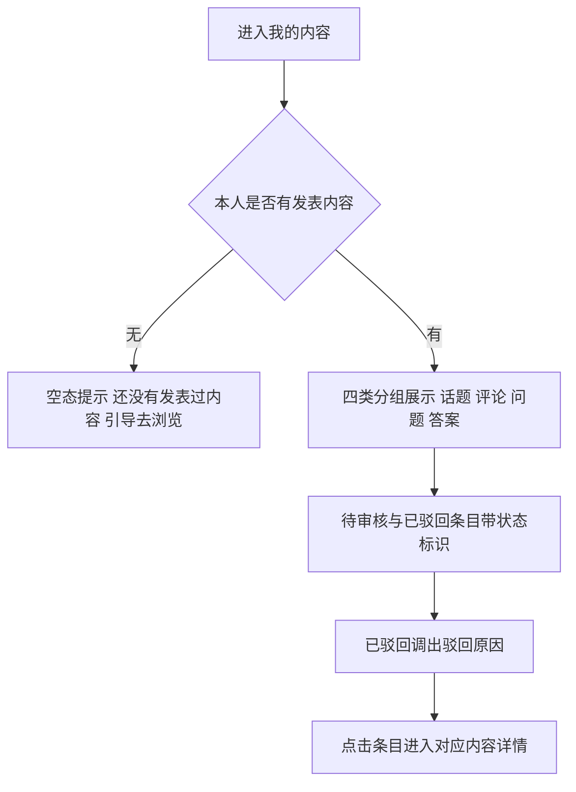

操作步骤清单：1. 会员进入个人中心我的内容；2. 按话题、评论、问题、答案四类分组展示本人内容（每页 20 条，沿用口径）；3. 待审核与已驳回条目带「色块＋文字」状态标识；4. 已驳回条目可查看驳回原因（逐字取自审核记录）；5. 点击条目进入对应内容详情（已驳回与待审核内容仅本人经此入口可见）。

**字段与校验**：

| 信息项 | 必填 | 校验 |
|---|---|---|
| 展示要素 | — | 标题或摘要、类型、状态标识（待审核／已公开／已驳回）、发布时间；驳回原因入口随已驳回条目 |

**规则与边界**：1. 仅本人内容，他人不可见（自助管理面）。2. 状态标识与内容状态机一致（术语表 §4 各对象状态）。3. 已删除内容不在列表（删除为终态、不可见）。4. 该入口为聚合只读，内容管理动作（编辑、删除等）沿用各内容模块既有入口与规则。

**异常与拦截**：无内容→空态提示；其余为只读呈现无独立失败分支。

### 4.3 R88 我的资料与凭据

**功能说明**：个人中心的资料与凭据维护入口——0.1 能力经个人中心入口承接。触发：会员在个人中心进入我的资料与凭据。

**交互与流程**：

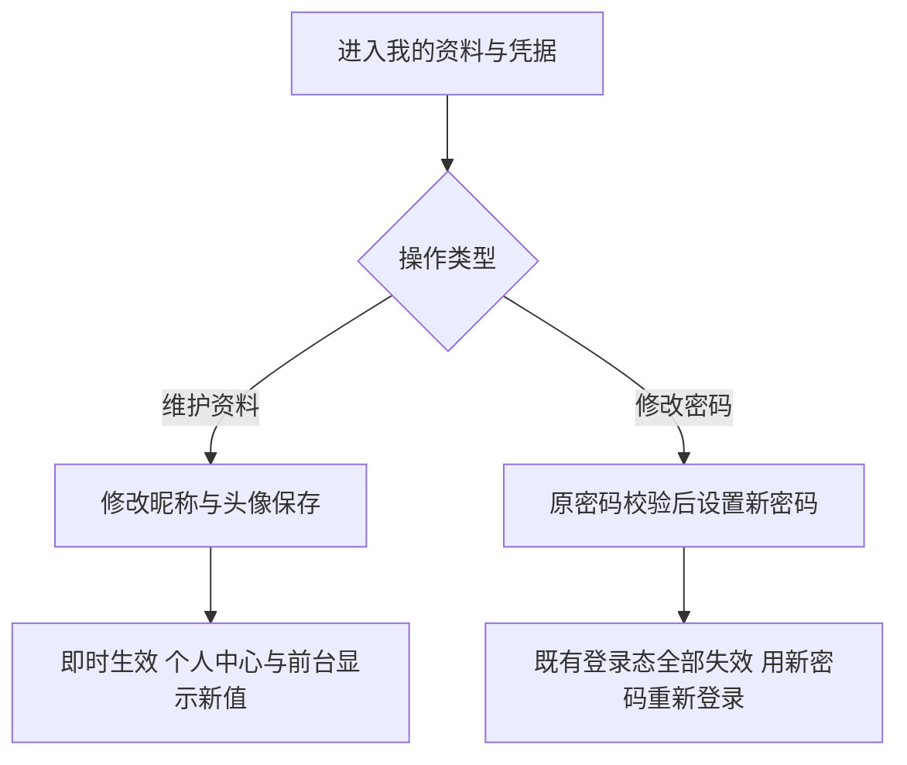

操作步骤清单：1. 会员进入我的资料与凭据；2. 修改昵称与头像保存后即时生效；3. 修改密码：校验原密码后设置新密码，保存后既有登录态全部失效，须以新密码重新登录。

**字段与校验**：

| 信息项 | 必填 | 校验 |
|---|---|---|
| 昵称 | 是 | 沿用 0.1 资料维护口径 |
| 头像 | 是 | 沿用 0.1 口径（默认头像兜底） |
| 原密码／新密码 | 修改时必填 | 原密码校验通过方可设置；新凭据规则沿用 0.1 |

**规则与边界**：1. 能力与规则沿用 0.1（R4 密码修改与重置、R5 资料与头像维护），本版只做入口聚合，不改判定。2. 修改密码后既有登录态全部失效（R4 锚同口径）。

**异常与拦截**：1. 原密码错误→拒绝修改并提示。2. 昵称或头像校验不过→提示调整。

### 4.4 R89 我的私信与通知提醒

**功能说明**：进入消息模块的往来与提醒——0.4 已交付能力经个人中心入口聚合。触发：会员在个人中心点击我的私信或通知提醒。

**交互与流程**：

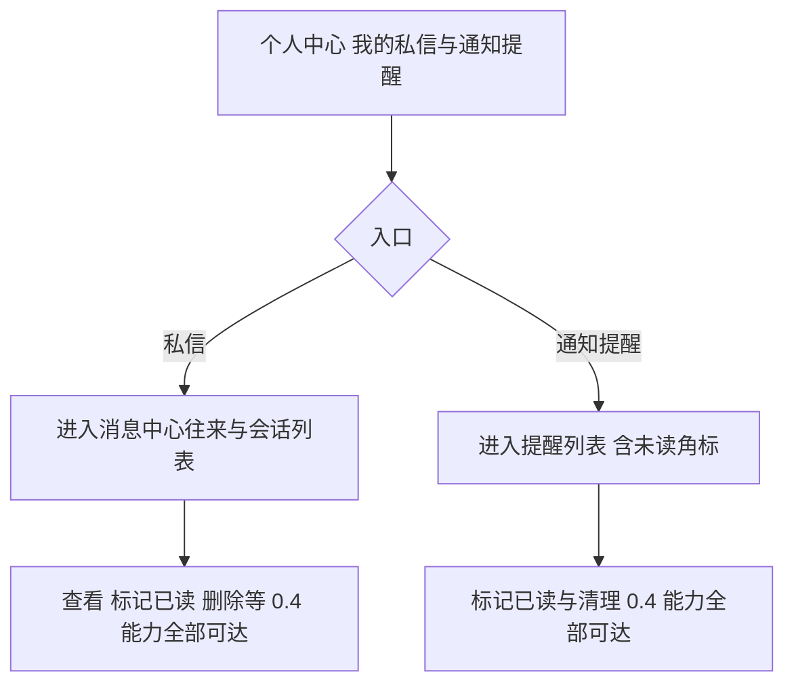

操作步骤清单：1. 会员从个人中心进入私信（消息中心）或通知提醒；2. 0.4 已交付的查看往来、标记已读、删除私信、标记已读（通知）、清理提醒能力全部可达；3. 未读角标沿消息中心入口呈现。

**字段与校验**：

| 信息项 | 必填 | 校验 |
|---|---|---|
| 入口要素 | — | 未读角标（私信与提醒分列）；列表与操作沿用 0.4 界面 |

**规则与边界**：1. 入口聚合不改能力——0.4 各能力的验收锚不在本版重验。2. 消息中心独立入口保留（双入口可达）。

**异常与拦截**：无——入口聚合与跳转，无独立失败分支。

### 4.5 R90 注销 ◆

**功能说明**：会员主动注销账号——前置校验通过后终态化账号并按保留策略处理内容。触发：会员在个人中心底部提交注销申请。

**交互与流程**：

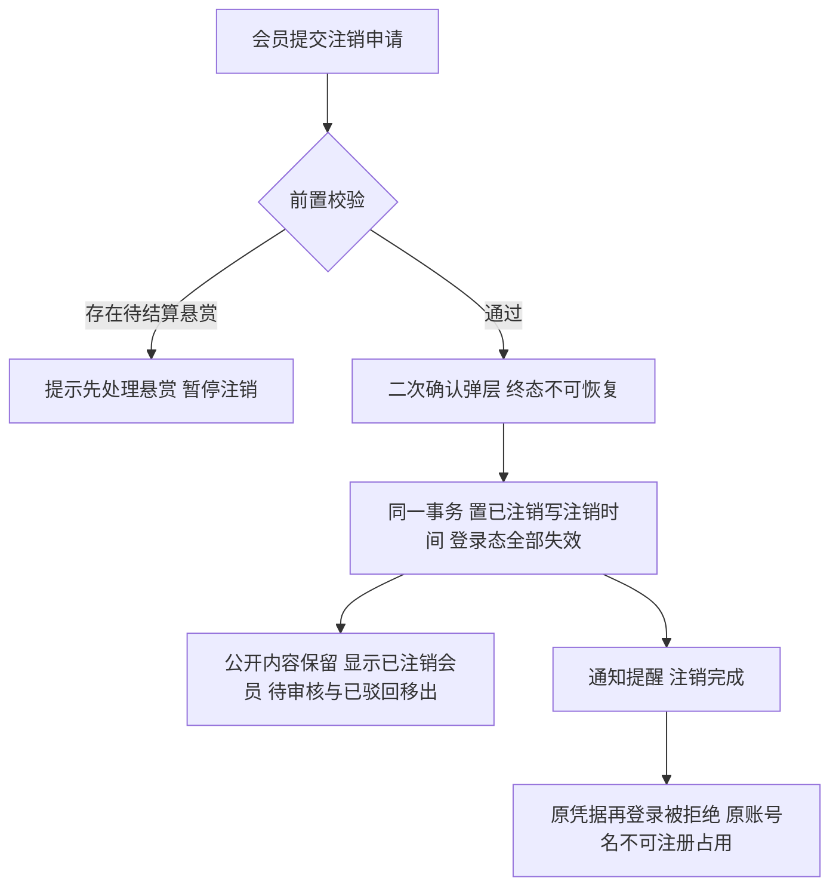

操作步骤清单：1. 会员在个人中心提交注销；2. 系统校验前置阻断项（仅待结算悬赏——存在则提示先处理并暂停，禁言不阻断）；3. 二次确认后同一事务内：账号置已注销（写注销时间）、既有登录态全部失效；4. 已公开内容保留并显示「已注销会员」（昵称与头像占位），待审核与已驳回内容移出队列与列表；5. 收到注销完成通知；6. 原凭据再登录被拒绝，原账号名不可被他人注册。

**字段与校验**：

| 信息项 | 必填 | 校验 |
|---|---|---|
| 注销确认 | 是 | 二次确认弹层（终态不可恢复、公开内容保留提示） |
| 前置校验 | 系统执行 | 无待结算悬赏方可继续（唯一阻断项） |

**规则与边界**：1. 已注销为终态（术语表 §4），不可恢复、不可再登录、账号名不可复用。2. 已公开内容保留并占位显示「已注销会员」；待审核与已驳回内容移出；既有关注关系保留但不产生新内容；向已注销账号的私信与提醒静默丢弃（写入方不阻断）。3. 注销置位与登录态失效同一事务（不出现已注销仍可在线的窗口）。4. 积分账户随账号停用（余额冻结不退转，本版拍板：从「不做内容迁移或导出」与账本只增不改推导）。

**异常与拦截**：1. 存在待结算悬赏→暂停并提示先处理。2. 重复注销请求→幂等拒绝（终态校验）。3. 注销事务失败→整体回滚，账号保持原状态。

### 4.6 R91 我的收藏

**功能说明**：查看收藏列表并进入内容详情——互动模块收藏关系的个人中心呈现。触发：会员进入个人中心我的收藏。

**交互与流程**：

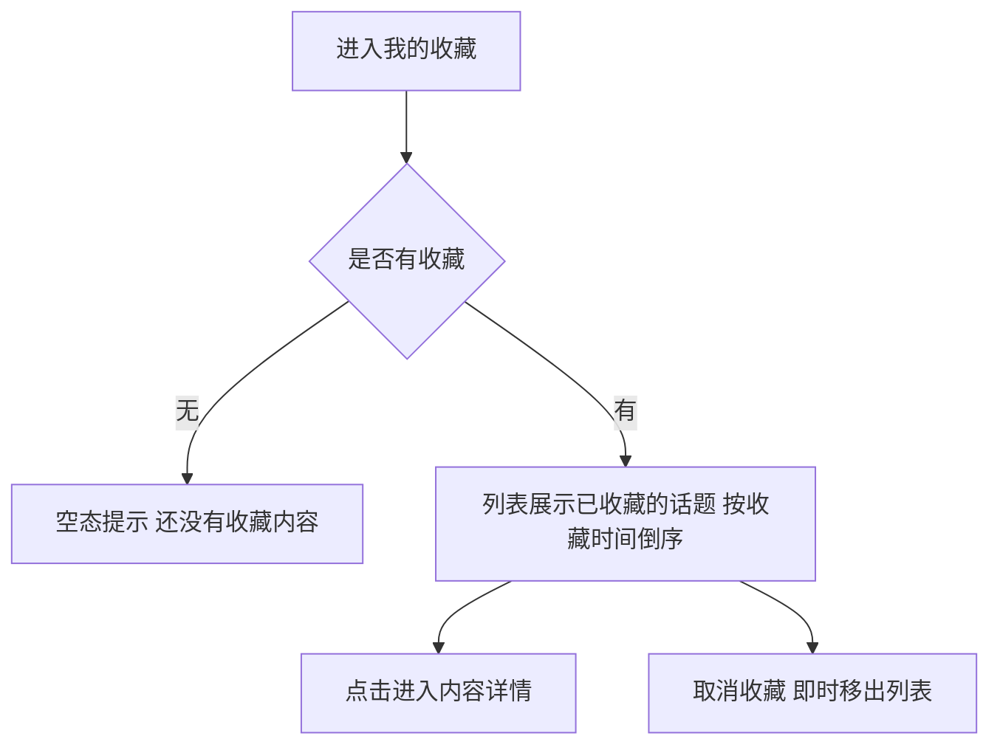

操作步骤清单：1. 会员进入我的收藏；2. 按收藏时间倒序展示已收藏话题（标题、作者、时间，每页 20 条）；3. 点击进入内容详情；4. 取消收藏后即时移出列表。

**字段与校验**：

| 信息项 | 必填 | 校验 |
|---|---|---|
| 展示要素 | — | 话题标题、作者昵称、收藏时间；排序＝收藏时间倒序；每页 20 条 |

**规则与边界**：1. 收藏对象沿用 v0.2.1 口径（仅话题）；问答收藏扩展已回池不在本版。2. 内容被删除后收藏关系失效、列表不再出现（0.2 删除连带沿用）。3. 列表只读＋取消入口，收藏动作沿用内容页既有按钮。

**异常与拦截**：无收藏→空态提示；只读列表无独立失败分支。

### 4.7 R92 我的点赞

**功能说明**：查看自己点过赞的内容——点赞关系的个人中心呈现，覆盖话题、评论、问题与答案四类。触发：会员进入个人中心我的点赞。

**交互与流程**：

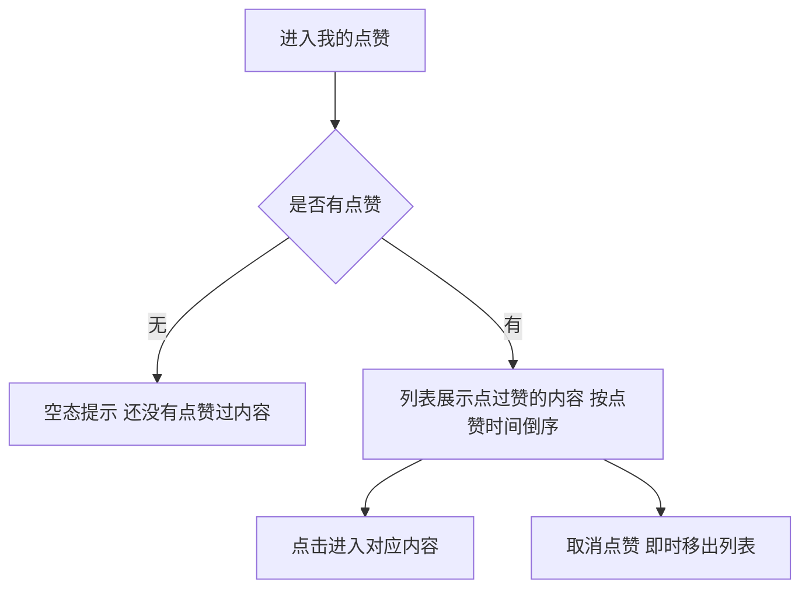

操作步骤清单：1. 会员进入我的点赞；2. 按点赞时间倒序展示本人点赞的内容（类型标识区分话题、评论、问题、答案，每页 20 条）；3. 点击进入对应内容；4. 取消点赞后即时移出列表。

**字段与校验**：

| 信息项 | 必填 | 校验 |
|---|---|---|
| 展示要素 | — | 内容标题或摘要、类型标识、点赞时间；排序＝点赞时间倒序；每页 20 条 |

**规则与边界**：1. 覆盖 content_type 全部取值（话题／评论／问题／答案，随版本扩展沿用）。2. 内容被删除后关系失效、列表不再出现。3. 列表只读＋取消入口。

**异常与拦截**：无点赞→空态提示；只读列表无独立失败分支。

### 4.8 R93 流水查询

**功能说明**：会员查自己的流水，经营方按会员与时间查询——积分流水的双视角查询面。触发：会员在个人中心进入我的积分；运营人员或站长在管理后台进入流水查询。

**交互与流程**：

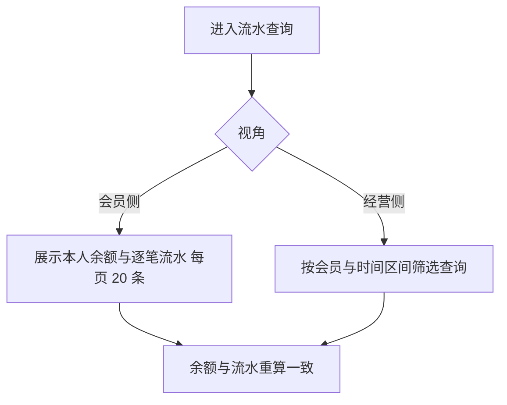

操作步骤清单：1. 会员侧：进入我的积分，展示余额与流水（来源类型、方向、数值、时间，每页 20 条）；2. 经营侧：在管理后台按会员（昵称或编号）与时间区间筛选查询；3. 两侧核对余额与流水重算一致。

**字段与校验**：

| 信息项 | 必填 | 校验 |
|---|---|---|
| 展示要素（会员侧） | — | 余额、逐笔流水四要素＋时间 |
| 筛选要素（经营侧） | 会员或时间至少一项 | 会员（昵称／编号）与时间区间；无结果时空态 |

**规则与边界**：1. 会员只读自己的账本；经营侧只读、不改动（人工修正随 0.7）。2. 流水只增不改，查询不过滤任何类型（含冲正流水）。3. 重算一致为验收口径（口径沿用 v0.3.0）。

**异常与拦截**：1. 经营侧查询无结果→空态提示。2. 越权访问他人账本→接口拒绝。

### 4.9 R94 等级权益配置

**功能说明**：在各等级上配置开放的可见范围与权限——保存即时生效并留痕，可见判定按新配置执行。触发：站长在管理后台进入等级权益配置。

**交互与流程**：

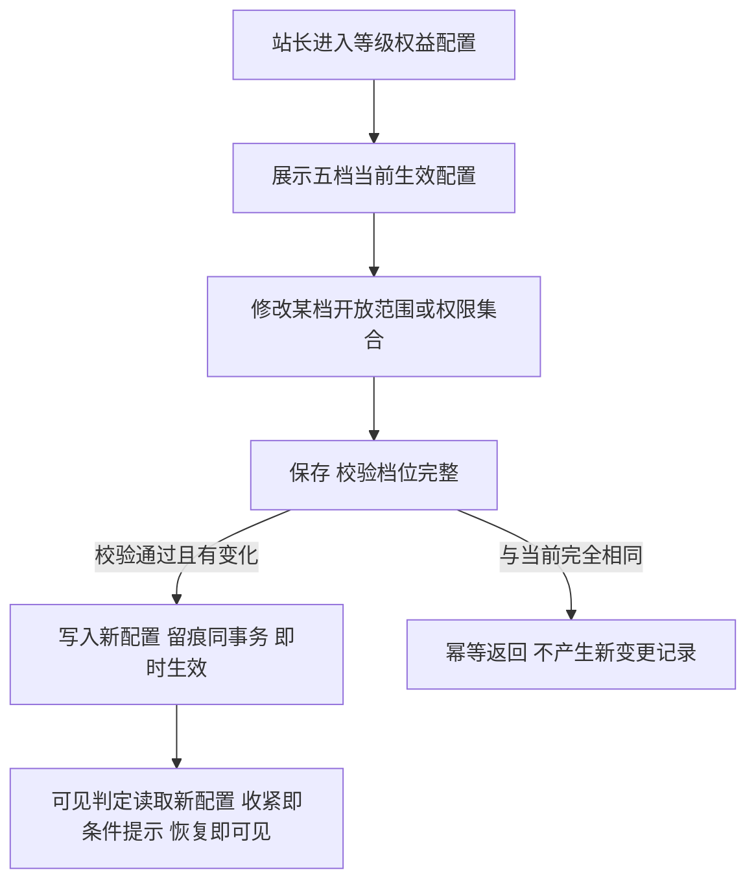

操作步骤清单：1. 站长进入管理后台·等级权益配置（仅站长可见）；2. 页面展示五档（Lv1～Lv5）当前生效的开放范围与权限集合；3. 修改某档配置保存：五档配置项须完整（默认值可一键回填）；4. 保存成功即时生效、变更留痕（operation_log 同事务）；5. 重复保存相同值幂等。

**字段与校验**：

| 信息项 | 必填 | 校验 |
|---|---|---|
| 各档开放范围 | 是 | 五档全部必填；初始＝全开放 |
| 各档权限集合 | 是 | 五档全部必填；初始＝空集（不做限制） |

**规则与边界**：1. 配置载体为全站设置键 level_benefit_lv1～lv5（术语表 §7 已登记），一键一档。2. 保存即时生效（口径二，判定线 100%），变更留痕。3. 判定规则变更不追溯已判等级（等级判定口径沿用 0.3）。4. 权限集合本版只承载既有口径，新权限项走需求池。

**异常与拦截**：1. 五档配置不完整→保存拦截并提示。2. 非站长→入口与接口双重拦截。3. 重复保存相同值→幂等返回。

### 4.10 R95 等级展示

**功能说明**：展示当前等级与距下一等级的积分差——前台与个人中心的等级呈现。触发：前台内容页作者信息、个人中心我的积分等位置渲染。

**交互与流程**：

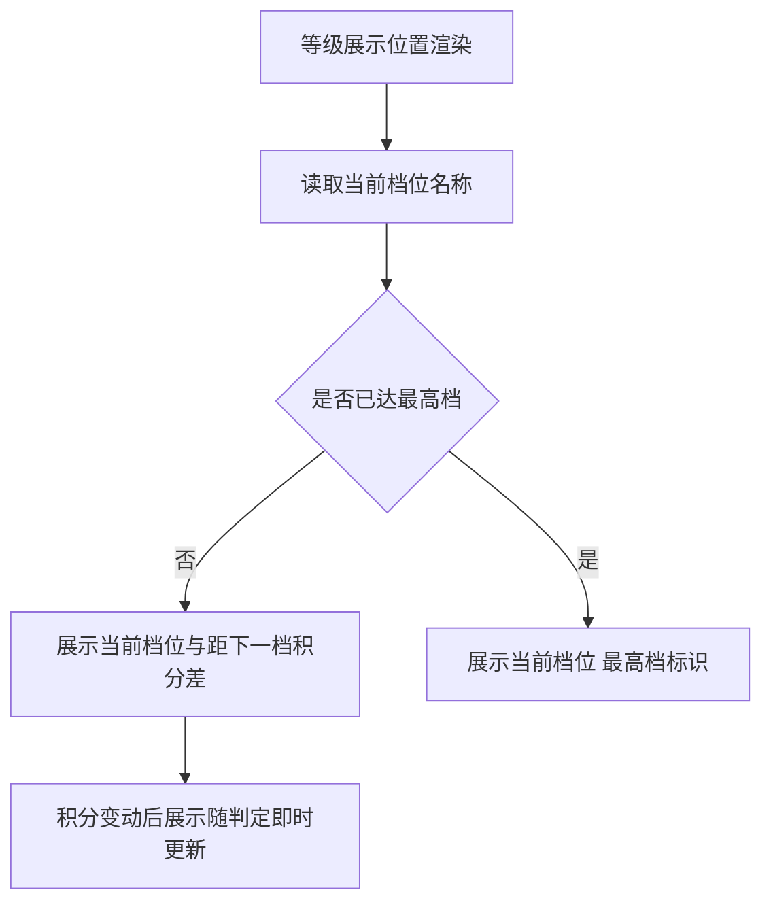

操作步骤清单：1. 前台与个人中心展示会员当前等级名称（档位胶囊，激励琥珀色系）；2. 未达最高档时展示距下一等级的积分差（如「再获 35 积分升级」）；3. 积分变动后展示随判定即时更新。

**字段与校验**：

| 信息项 | 必填 | 校验 |
|---|---|---|
| 展示要素 | — | 档位名称（术语表 §4 五档取值）；积分差＝下一档门槛−当前余额 |

**规则与边界**：1. 档位取值与判定结果同源（current_level，v0.3.0 登记）。2. 已注销会员不展示等级（显示「已注销会员」占位，本版拍板）。3. 展示为只读派生，无操作面。

**异常与拦截**：无——只读展示随渲染生效。

## 5. 业务对象与数据字段

**数据主体清单**：

| 业务对象 | 落库名 | 定位与关系 |
|---|---|---|
| 会员账号 | member_account | 沿用，本版新增注销终态表达（cancelled_at）与「已注销会员」占位显示规则；资料与凭据字段沿用 v0.1.0 登记 |
| 收藏 | favorite | 沿用（v0.2.1 登记），本版新增个人中心列表读取路径 |
| 点赞 | like_record | 沿用（v0.2.1／v0.3 扩展登记），本版新增个人中心列表读取路径 |
| 积分流水 | point_transaction | 沿用（v0.3.0 登记，只增不改），本版新增会员自查与经营方筛选查询面（只读） |
| 会员等级 | member_account.current_level＋site_setting（level_threshold_*、level_benefit_lv1～lv5） | 沿用 0.3 判定与门槛键，本版新增权益配置键与展示派生（积分差） |
| 我的内容（聚合） | 话题／评论／问题／答案 各表沿用 | 聚合只读视图，按 member_id 过滤，不新建表 |

**逐对象字段表**（本版新增项；既有字段沿用登记）：

会员账号 member_account：

| 字段 | 必填 | 业务类型 | 落库字段名 | 约束与取值 |
|---|---|---|---|---|
| 注销时间 | 否 | 时间 | cancelled_at | 注销事务写入；写入后账号状态＝已注销（终态），对外显示「已注销会员」占位 |

全站设置 site_setting（本版新增键，沿用 setting_key／setting_value）：

| 字段 | 必填 | 业务类型 | 落库字段名 | 约束与取值 |
|---|---|---|---|---|
| 各档权益配置 | 是 | 结构化键值 | level_benefit_lv1／lv2／lv3／lv4／lv5 | 一键一档；值为该档开放的可见范围与权限集合；初始＝可见范围全开放、权限集合空集 |

以上新字段已随认领登记术语表 §7（来源 v0.5.0）；列类型、主键、索引与建表 DDL 归开发阶段。

## 6. 待议与建议

**本版采用的推断与默认值汇总**：

| 采用值 | 来源状态 |
|---|---|
| 注销保留范围（公开保留占位、待审已驳移出、关注保留、私信提醒静默丢弃） | 0.5 PRD 本版定案（04C 方向＋拍板细化） |
| 注销前置阻断项仅待结算悬赏；禁言期间可注销 | 0.5 PRD 本版拍板（从定案值与 04C 流程推导） |
| 注销后积分账户随账号停用、余额冻结不退转 | 本版拍板（从「不做迁移或导出」与账本只增不改推导） |
| 已注销会员不展示等级 | 本版拍板（占位显示口径） |
| 权益默认＝可见范围全开放、权限集合空集 | 0.5 PRD 本版拍板（配置先行、默认不改现状） |
| 我的内容／收藏／点赞按时间倒序、每页 20 条 | 本版拍板（沿用列表口径） |
| 等级展示「再获 N 积分升级」积分差口径＝下一档门槛−当前余额 | 本版拍板（从锚推导） |
| 消息中心独立入口保留（与个人中心双入口） | 本版拍板（入口聚合不撤既有入口） |

**待确认内容与影响**：无阻塞性待议——个人中心访问量口径属版本级验收安排（0.5 PRD 口径三），不影响本版开发。

**建议回池的新想法**：无（问答内容收藏扩展已按 v0.3.1 建议回池，待后续版本认领）。

**术语表登记**：本版新字段（member_account.cancelled_at、site_setting.level_benefit_lv1～lv5）已随认领登记术语表 §7（来源 v0.5.0），变更记录已追加；「已注销」终态与档位五档取值沿用既有登记，本文逐字沿用。
