# PRD（大版本）：0.6 治理完善版

> 定位：本版立项说明书，承接路线图 0.6 条目与项目 PRD，把治理完善版范围落成带验收标准的功能需求、用户旅程与对象版本态，供需求拆解与小版本规划直接开工；上游为模拟案例材料，模拟性质予以保留。

## 1. 版本概述

**承接与目标**：承接路线图 0.6 治理完善版条目——治理闭环完整、运营管理面齐备：举报有入口、处置有动作（含治理侧内容删除）、结论有通知、历史有留痕；会员与内容可查可维护，运营内容可维护。本版交付审核与治理模块的举报族与治理侧删除、留痕查询，运营与设置模块的运营内容维护，以及运营人员侧的会员与内容查询维护（0.2 过渡期的禁言与封号处置自此并入完整举报闭环消费）。

**成功标准与量化口径**：

- 口径一（完成标志全链路）：一名会员举报违规内容，版主核实后完成处置（含内容删除）并通知双方，处置结论可在审核留痕中回溯；运营人员能检索会员与内容并维护运营内容——全链路 100% 走通（从路线图完成标志推导）。
- 口径二（同事务处置）：举报状态变更、处置结论留痕与双方通知在同一事务完成，判定线 100%——本版不存在事务外补写（从总览协作约束表·违规处置推导）。
- 口径三（治理验证口径）：举报量与处置时长的口径在本版立项时约定数值——数值未定，列入立项依赖（路线图验证假设沿用，不阻塞拆解）。

**本版定案值**（路线图依赖行声明的唯一归属时点，先从版本事实推导、无事实依据的按行业惯例拍板并标明）：运营内容的具体形态——结构化运营位条目，字段为标题（2～24 字符）、正文摘要（≤100 字符）、跳转目标（仅站内话题或问题，按编号引用）、展示位置（枚举：首页横幅／板块侧栏）与启停状态，新增即默认启用、同一展示位置最多同时启用 5 条（行业惯例默认，防堆积）；删除为软删除（记录保留、前台不再展示，被引用不可删沿用 04C 口径）。举报合并——一名举报人对同一内容的重复举报做合并处理（04C·本轮建议沿用，队列只保留一条待处理项）。结论通知——新增通知类型「举报成立」「举报驳回」（术语表 §7 已登记）；处置含禁言或封号时被处置方沿用既有处置类通知，含内容删除时被处置方收「举报成立」通知（视角文案由消息模块统一生成）。

**范围一句话**：做——举报发起、举报核实与处置 ◆、举报驳回、我的举报、审核留痕查询、删除违规内容 ◆、运营内容新增、运营内容编辑、运营内容删除、会员查询与维护、话题内容查询与维护、问答内容查询与维护；不做——申诉流程与自动审核机器判定（路线图明确不做，PRD 不做 AI 助手）、浏览量统计（归 0.7）、积分人工修正（归 0.7）、被处置内容连带隐藏同作者其他内容（04C 待业务确认，未纳入）。

**沿用与前置**：前置版本 0.1～0.5 全部已发布——沿用统一鉴权与能力点判定（版主／运营人员入口）、先审后发队列与审核记录（0.2）、禁言与封号处置（0.2，本版作为举报处置动作消费）、个人中心入口（0.5，承载我的举报）、等级与积分规则配置页形态（v0.3.0，运营内容维护同构沿用管理后台交互）。

## 2. 主体与角色

**上场主体总览树**：

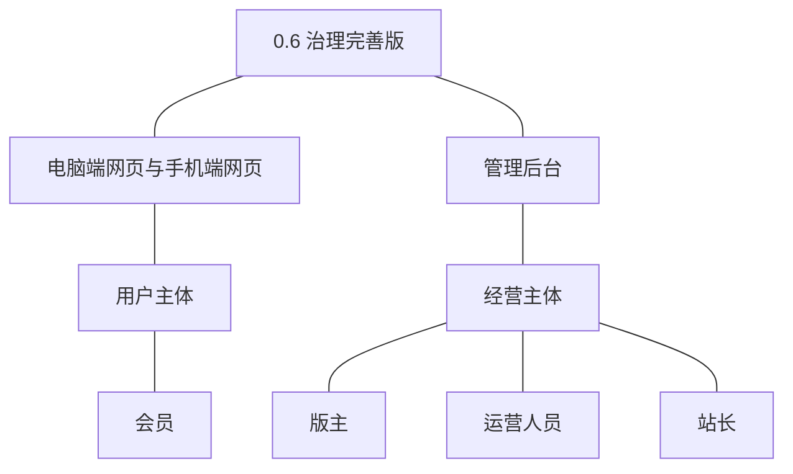

**主体表**：

| 主体 | 角色 | 端 | 怎么用系统 |
|---|---|---|---|
| 用户主体 | 会员 | 电脑端网页、手机端网页 | 对已公开内容发起举报并在个人中心查看结论（我的举报） |
| 经营主体 | 版主 | 管理后台 | 核实举报并处置或驳回、执行治理侧内容删除、查询审核留痕 |
| 经营主体 | 运营人员 | 管理后台 | 维护运营内容（新增／编辑／删除）、检索并维护会员与站内内容 |
| 经营主体 | 站长 | 管理后台 | 查询审核留痕（与版主同面） |

**裁剪说明**：访客不上场（举报需登录；前台运营位为被动展示，随运营内容旅程呈现）；内容查询与维护按模块对象范围拆为话题与问答两路交付（路线图切片），界面为同一检索面按对象范围区分。

## 3. 核心业务流程

**旅程覆盖说明**：一条跨主体旅程（举报核实与处置闭环）用时序图，两条承载版本主题的关键单端旅程（治理侧删除与留痕回溯、运营内容维护与前台展示）用流程图；我的举报、审核留痕查询、会员查询与维护、内容查询与维护为简单操作型功能不成旅程（验收标准可覆盖）。

### 3.1 旅程一：举报核实与处置闭环（会员、版主·跨主体）

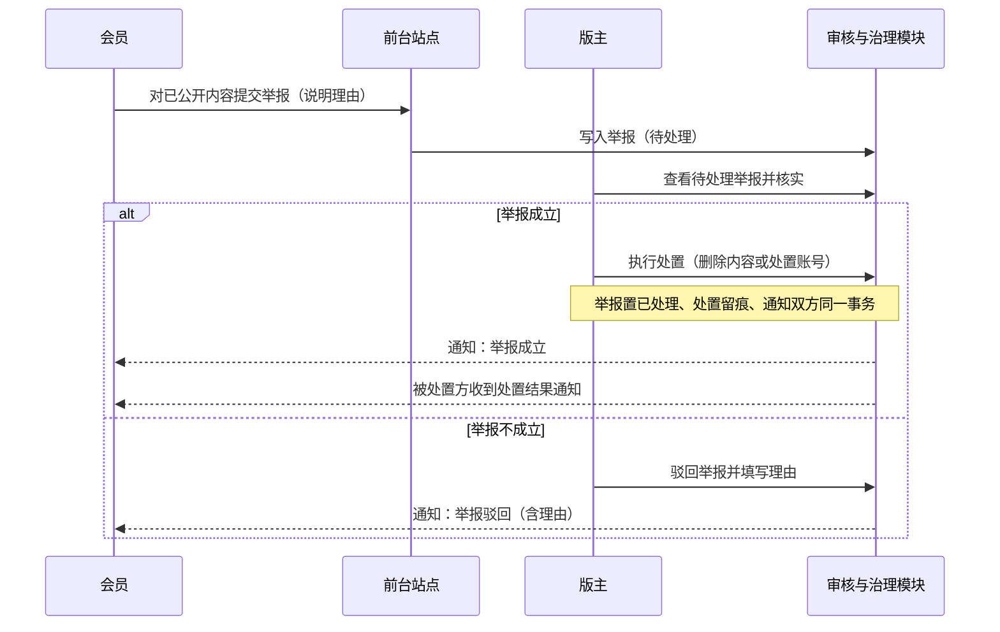

本旅程演示口径一前半段与口径二：举报进入待处理队列，版主核实后两路结论（成立处置／不成立驳回）均与留痕、通知同事务；处置动作含治理侧内容删除与沿用 0.2 的禁言封号。

操作步骤清单：1. 会员对已公开内容点击举报并填写理由提交；2. 举报写入待处理队列（对同一内容的重复举报合并为一条）；3. 版主在管理后台查看待处理举报并核实内容与理由；4. 成立则执行处置（删除违规内容或禁言／封号）、不成立则驳回并说明理由；5. 结论、处置留痕与双方通知同一事务完成；6. 会员在我的举报查看结论。

### 3.2 旅程二：治理侧删除与留痕回溯（版主·单端）

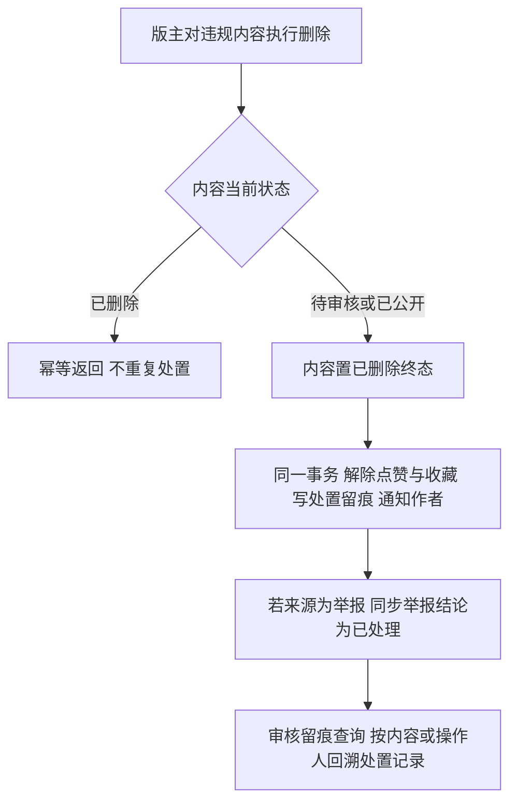

本旅程演示治理侧内容删除（0.2 遗留过渡的正式补齐）与历史留痕回溯：删除为终态、互动关系同事务清理、留痕可按内容与操作人检索；被采纳的答案不删除、改为保留并标记处置结果（问答契约沿用）。

操作步骤清单：1. 版主对违规内容执行删除（来源可为举报核实或主动巡查）；2. 幂等校验当前状态后置已删除终态；3. 同一事务解除该内容的点赞与收藏、写处置留痕（处置人、时间、理由）、通知作者；4. 来源为举报时同步举报结论；5. 在审核留痕查询按内容或操作人回溯该处置记录。

### 3.3 旅程三：运营内容维护与前台展示（运营人员、访客视角·单端流程）

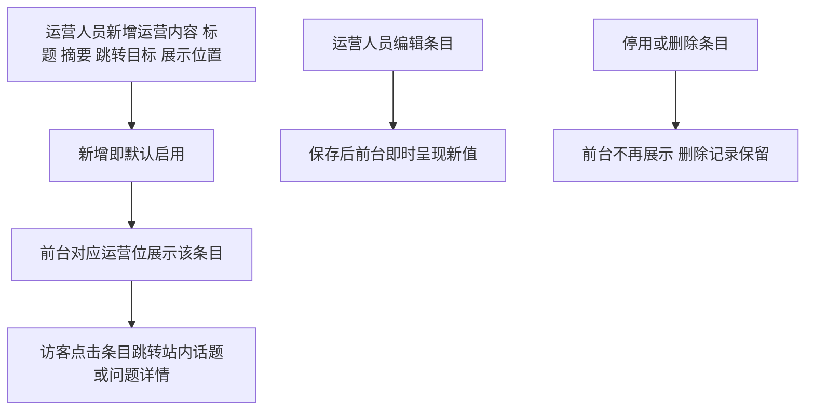

本旅程演示运营内容从维护到前台消费的闭环：新增即展示、编辑即时生效、停用与软删除下架；跳转目标仅站内内容。

操作步骤清单：1. 运营人员在管理后台新增运营内容（标题、摘要、跳转目标、展示位置）；2. 新增即默认启用，前台对应运营位展示；3. 编辑保存后前台即时呈现新值；4. 停用后前台不再展示、可再启用；5. 删除为软删除，前台不再展示且记录保留；6. 访客点击条目跳转对应站内详情。

## 4. 功能需求

**功能全景总图**：

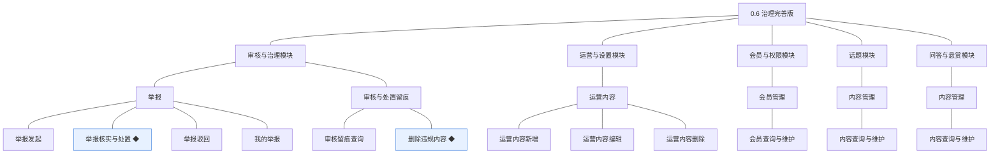

功能名消歧说明：路线图 2.6 在话题与问答两个模块各有一条「内容查询与维护」，本版按模块归属以小节区分（4.5 话题、4.6 问答），条目名保持逐字一致、以编号区分认领与验收。

### 4.1 审核与治理模块·举报

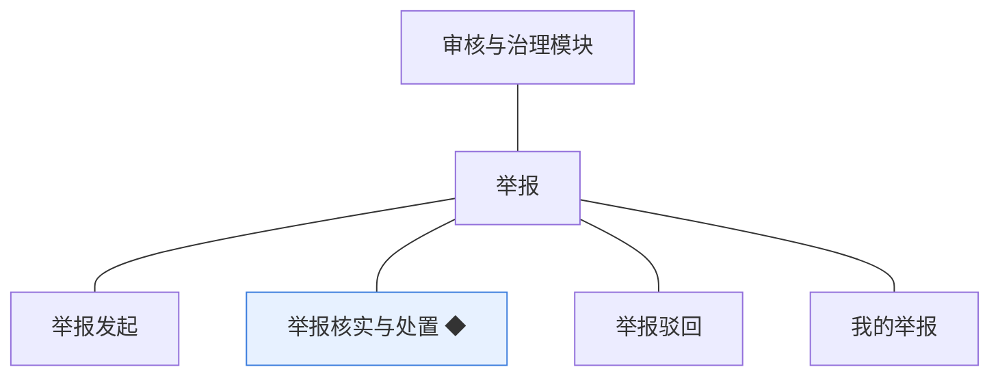

**举报**：会员对违规内容的报告，治理闭环的触发入口；状态为待处理、已处理、已驳回（术语表 §4）。

| 功能 | 用途 | 验收标准 |
|---|---|---|
| 举报发起 | 对已公开内容提交举报并说明理由 | 会员对已公开内容提交举报并填写理由后，举报进入待处理队列；对同一内容的重复举报合并为一条待处理项；非公开内容不可举报 |
| 举报核实与处置 ◆ | 核实后作出处置或驳回，结论通知相关方 | 版主核实举报后，成立则执行处置（删除违规内容或禁言、封号）并将举报置为已处理，处置留痕与双方通知在同一事务完成；不成立则转入举报驳回 |
| 举报驳回 | 举报不成立时驳回并说明理由 | 版主填写理由驳回举报后，举报置为已驳回并通知举报人（含理由）；驳回后举报不可再变更 |
| 我的举报 | 在个人中心查看自己发起的举报与结论 | 会员在个人中心我的举报查看自己发起的举报列表与结论（待处理／已处理／已驳回），已处理条目可查看处置结论 |

### 4.2 审核与治理模块·审核与处置留痕

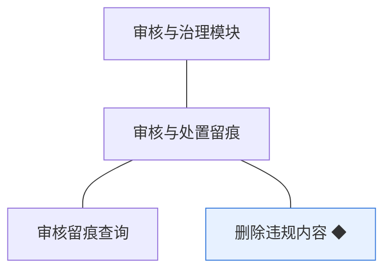

**审核与处置留痕**：审核记录沿用 0.2（只增不改）；治理侧删除为本版补齐的处置动作，处置留痕记录处置人、时间与理由。

| 功能 | 用途 | 验收标准 |
|---|---|---|
| 审核留痕查询 | 按内容或操作人查询历史审核记录 | 站长与版主按内容标识或操作人查询历史审核与处置记录，结果含结论、驳回或处置原因、操作人与时间，按时间倒序分页展示 |
| 删除违规内容 ◆ | 对内容执行删除，删除为终态 | 版主对违规内容执行删除后内容置已删除终态、前台与搜索不再出现；同一事务解除该内容的点赞与收藏、写处置留痕并通知作者；被采纳的答案不删除改为标记处置结果；重复删除幂等 |

### 4.3 运营与设置模块·运营内容

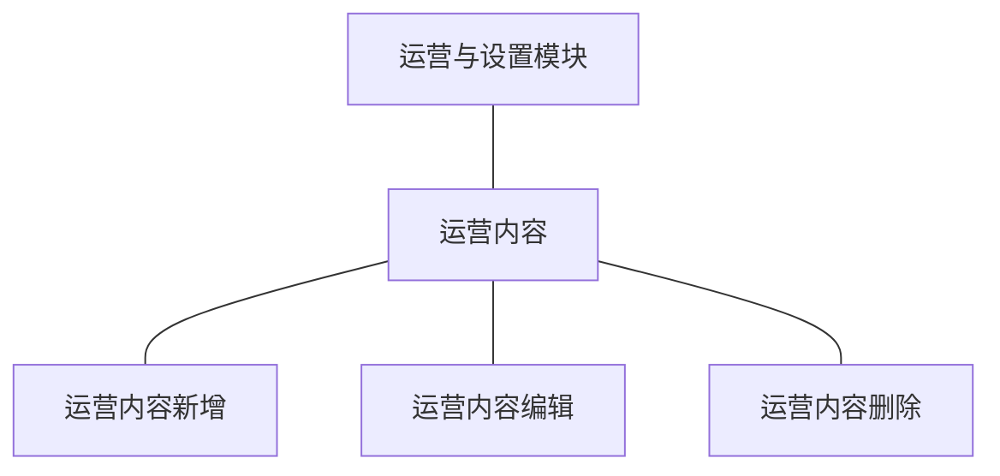

**运营内容**：运营人员维护的推荐与引导性内容，在站点前台运营位展示（术语表）；形态定案见 §1。

| 功能 | 用途 | 验收标准 |
|---|---|---|
| 运营内容新增 | 新增推荐与引导性内容 | 运营人员填写标题、正文摘要、跳转目标（站内话题或问题）与展示位置保存后，条目默认启用并即时出现在前台对应运营位；同一展示位置启用条数上限 5 条，超限保存被拦截并提示 |
| 运营内容编辑 | 修改已发布的运营内容 | 运营人员修改标题、摘要、跳转目标或展示位置保存后前台即时呈现新值；仅停用条目可修改展示位置（启用中条目改位置须先停用，避免前台错位） |
| 运营内容删除 | 下架不再需要的运营内容 | 运营人员删除运营内容后前台不再展示且记录保留（软删除）；被前台运营位引用中的条目删除后该位置即时下架；重复删除幂等 |

### 4.4 会员与权限模块·会员管理

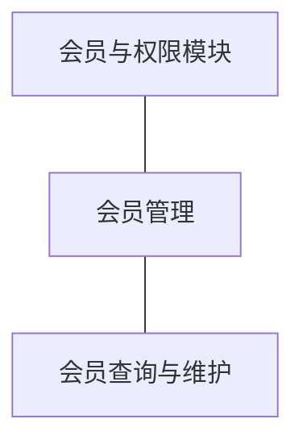

**会员管理**：运营人员按检索条件查看会员情况并维护资料，账号状态处置归审核与治理模块（04C 契约）。

| 功能 | 用途 | 验收标准 |
|---|---|---|
| 会员查询与维护 | 按昵称、编号与状态检索会员并维护资料 | 运营人员按昵称、会员编号与账号状态检索会员，查看资料并可维护昵称与备注（维护留痕）；账号状态变更入口指向审核与治理处置，不在本功能内执行 |

### 4.5 话题模块·内容管理

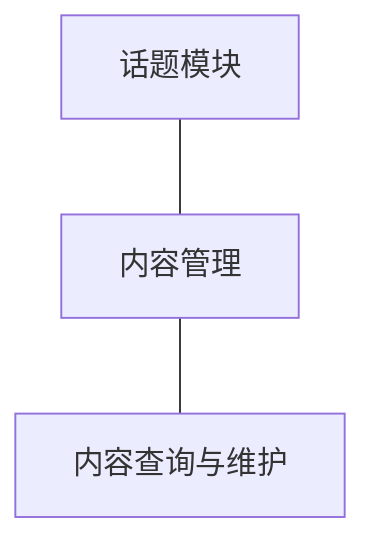

**内容管理（话题范围）**：检索并维护站内话题与评论（本模块对象范围，04C·3.6）。

| 功能 | 用途 | 验收标准 |
|---|---|---|
| 内容查询与维护 | 检索并维护站内话题与评论 | 运营人员按关键词、作者、状态与时间检索话题与评论并查看详情；维护动作限资料性更正（如板块归属调整），删除仍走治理侧处置路径并留痕，维护与处置均留痕 |

### 4.6 问答与悬赏模块·内容管理

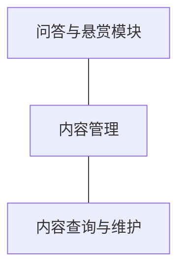

**内容管理（问答范围）**：检索并维护站内问题与答案（本模块对象范围，04C·3.6）。

| 功能 | 用途 | 验收标准 |
|---|---|---|
| 内容查询与维护 | 检索并维护站内问题与答案 | 运营人员按关键词、作者、状态与时间检索问题与答案并查看详情；被采纳的答案不可删除（治理处置沿用标记口径），悬赏状态随问题只读展示；维护与处置均留痕 |

## 5. 业务对象

**对象关系总览**：本版新上线举报与运营内容两个对象；审核记录沿用扩展处置留痕读取路径；会员账号、话题、评论、问题、答案沿用作为检索与处置对象。举报的被举报对象为多态引用（话题／评论／问题／答案四类，以内容类型＋内容标识表达，不设独立实体故不入图）；运营内容的跳转目标为对站内话题或问题的可选引用。

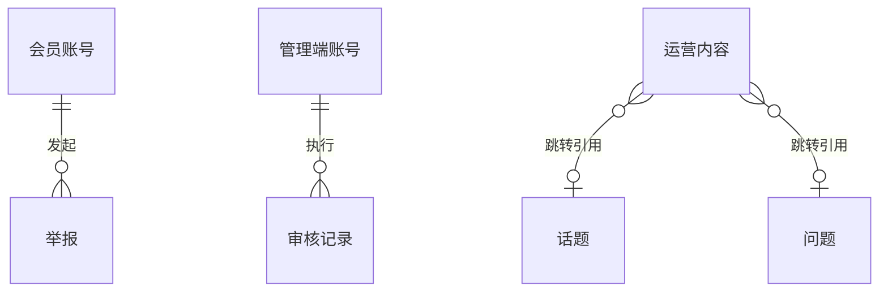

> 图说：关系基数为沿用事实——一名会员可发起多条举报、一管理端账号执行多条审核记录；一条运营内容至多引用一个站内话题或一个问题（二选一，可为空则仅展示不跳转）。

### 5.1 举报

定位：会员对违规内容的报告，治理闭环的触发入口（术语表）。

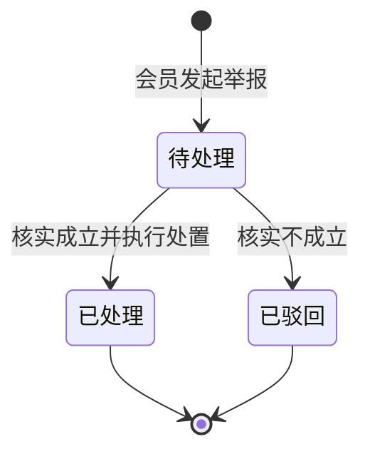

说明：三态均为明确归属（待处理为活跃态、已处理与已驳回为终态，术语表 §4）；状态变更与处置留痕、双方通知同一事务（口径二）；同一举报人对同一内容的重复举报合并（本版定案）；已处理与已驳回不可再变更。

### 5.2 运营内容

定位：运营人员维护的推荐与引导性内容，前台运营位展示（术语表）。

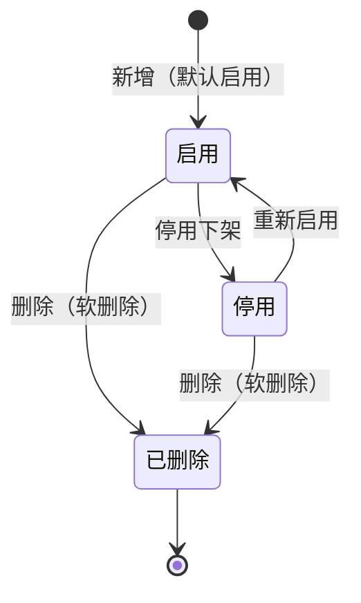

说明：新增即默认启用并上前台（本版拍板，从「新增推荐与引导性内容」推导）；停用可逆、删除为软删除（记录保留、前台不再展示）；形态与上限定案见 §1（标题 2～24 字符、摘要 ≤100 字符、跳转仅站内、位置枚举两处、每位置启用上限 5 条）。

### 5.3 沿用对象接入路径（审核记录／会员账号／话题／评论／问题／答案）

说明：审核记录沿用 0.2 只增不改，本版新增按内容与操作人的留痕查询面（含处置留痕，处置人／时间／理由沿用留痕机制）；会员账号、话题、评论、问题、答案沿用既有登记，本版新增运营侧检索与维护路径（资料性更正留痕、删除统一走治理侧处置）；处置动作消费 0.2 的禁言与封号。
