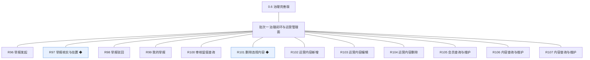
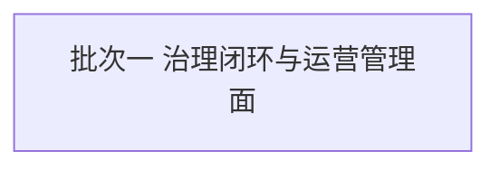
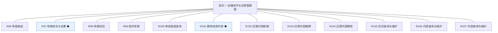

# 开发顺序与需求拆解（大版本）：0.6 治理完善版

> 定位：把大版本 PRD 转换为开发批次顺序＋功能级需求条目，本文即 0.6 治理完善版的完整需求清单（不另生成版本快照），需求池据此直接入池；上游为模拟案例材料，模拟性质予以保留。

## 1. 拆解说明

- **做什么**：把《PRD（大版本）0.6 治理完善版》的 12 项功能按依赖排成 1 个可独立验收的开发批次，每项功能转为一条可直接认领与验收的需求条目（R96～R107，编号承接此前的 R1～R95）。
- **一一同构口径**：一条需求＝一项 PRD 功能，需求名即 PRD 功能名（含 ◆ 标注）；路线图在话题与问答两模块的同名「内容查询与维护」按 PRD 模块小节分立两条、名逐字一致以编号区分；用途与验收标准逐字引自 PRD 功能清单、不压缩不改写；按钮、字段与跳转级的原子拆解归小版本开发，不进本文。
- **与需求池及小版本规划的关系**：本文是需求池的批量入池主入口但不是唯一入口——会议、沟通、临时反馈产生的需求可不经本文直接单条入池（M 编号）；小版本规划的输入＝本文开发顺序＋需求池实时状态两者合并，批次划分是建议而非锁定，实际认领以需求池为准。

## 2. 开发顺序

**前置版本沿用面**：0.1～0.5 均已发布——沿用统一鉴权与能力点判定（版主／运营人员管理入口）、0.2 的先审后发队列与审核记录、禁言与封号处置（本版作为举报处置动作消费）、0.5 的个人中心入口（承载我的举报）与管理后台配置页交互形态。

**开发批次总图**：

**批次推进链**：

**顺序依据与同事务契约**：举报族（发起→核实处置／驳回→我的举报）为治理闭环主线，删除违规内容与留痕查询为其处置与回溯配套；运营内容族与检索维护族（会员／话题内容／问答内容）为运营管理面，与举报族无相互依赖、可并行开发；完成标志要求举报闭环与运营管理面同批联调整体验收，拆批割裂完成标志（批次从简判断）；本版内需要共同成立的契约：举报状态变更与处置留痕、双方通知同一事务（口径二）、治理侧删除与互动关系清理及留痕通知同事务、运营内容保存与留痕同事务；无外部联调点。

### 2.1 批次一：治理闭环与运营管理面

- **目标**：治理闭环完整、运营管理面齐备——举报有入口、处置有动作（含治理侧内容删除）、结论有通知、历史有留痕；会员与内容可查可维护，运营内容可维护。
- **依赖**：前置版本 0.1～0.5（鉴权与能力点、审核记录与禁言封号、个人中心入口）；批内开发序建议举报闭环先行（R96～R101，R101 删除与 R100 留痕随闭环联调）→ 运营管理面收口（R102～R107，三族可并行）。
- **可验收形态**：可演示路线图完成标志——一名会员举报违规内容，版主核实后完成处置（含内容删除）并通知双方，处置结论可在审核留痕中回溯；运营人员检索会员与内容、维护运营内容并见前台运营位呈现。
- 判断注记：12 条三族（举报闭环 6＋运营内容 3＋检索维护 3）无跨族硬依赖，但完成标志须全链同批联调，不拆批（能合并成一批演示的不拆成两批）；R106 与 R107 为路线图同名功能的模块分立交付（对象范围不同），非归并；无路径分批交付的条目，12 条均整条交付。

条目与 PRD 4.1～4.6 功能清单一一同构，用途与验收标准逐字引自原文：

| 编号 | 需求名 | 用途 | 验收标准 |
|---|---|---|---|
| R96 | 举报发起 | 对已公开内容提交举报并说明理由 | 会员对已公开内容提交举报并填写理由后，举报进入待处理队列；对同一内容的重复举报合并为一条待处理项；非公开内容不可举报 |
| R97 | 举报核实与处置 ◆ | 核实后作出处置或驳回，结论通知相关方 | 版主核实举报后，成立则执行处置（删除违规内容或禁言、封号）并将举报置为已处理，处置留痕与双方通知在同一事务完成；不成立则转入举报驳回 |
| R98 | 举报驳回 | 举报不成立时驳回并说明理由 | 版主填写理由驳回举报后，举报置为已驳回并通知举报人（含理由）；驳回后举报不可再变更 |
| R99 | 我的举报 | 在个人中心查看自己发起的举报与结论 | 会员在个人中心我的举报查看自己发起的举报列表与结论（待处理／已处理／已驳回），已处理条目可查看处置结论 |
| R100 | 审核留痕查询 | 按内容或操作人查询历史审核记录 | 站长与版主按内容标识或操作人查询历史审核与处置记录，结果含结论、驳回或处置原因、操作人与时间，按时间倒序分页展示 |
| R101 | 删除违规内容 ◆ | 对内容执行删除，删除为终态 | 版主对违规内容执行删除后内容置已删除终态、前台与搜索不再出现；同一事务解除该内容的点赞与收藏、写处置留痕并通知作者；被采纳的答案不删除改为标记处置结果；重复删除幂等 |
| R102 | 运营内容新增 | 新增推荐与引导性内容 | 运营人员填写标题、正文摘要、跳转目标（站内话题或问题）与展示位置保存后，条目默认启用并即时出现在前台对应运营位；同一展示位置启用条数上限 5 条，超限保存被拦截并提示 |
| R103 | 运营内容编辑 | 修改已发布的运营内容 | 运营人员修改标题、摘要、跳转目标或展示位置保存后前台即时呈现新值；仅停用条目可修改展示位置（启用中条目改位置须先停用，避免前台错位） |
| R104 | 运营内容删除 | 下架不再需要的运营内容 | 运营人员删除运营内容后前台不再展示且记录保留（软删除）；被前台运营位引用中的条目删除后该位置即时下架；重复删除幂等 |
| R105 | 会员查询与维护 | 按昵称、编号与状态检索会员并维护资料 | 运营人员按昵称、会员编号与账号状态检索会员，查看资料并可维护昵称与备注（维护留痕）；账号状态变更入口指向审核与治理处置，不在本功能内执行 |
| R106 | 内容查询与维护 | 检索并维护站内话题与评论 | 运营人员按关键词、作者、状态与时间检索话题与评论并查看详情；维护动作限资料性更正（如板块归属调整），删除仍走治理侧处置路径并留痕，维护与处置均留痕 |
| R107 | 内容查询与维护 | 检索并维护站内问题与答案 | 运营人员按关键词、作者、状态与时间检索问题与答案并查看详情；被采纳的答案不可删除（治理处置沿用标记口径），悬赏状态随问题只读展示；维护与处置均留痕 |

**批次判断与边界取舍**：只拆一批——三族无跨族依赖且完成标志须同批联调整体验收，拆批属为流程美观多拆（过度拆分）；R106／R107 同名分立为模块对象范围差异，逐字名一致以编号区分（PRD 消歧说明沿用）；无路径分批交付的条目，12 条均整条交付。

**版本级验收安排**：按 PRD 量化口径执行（完成标志全链路 100%、同事务处置 100%、举报量与处置时长口径立项时定值）；本版为站内能力版本、无对外发布台阶（站点已开站）。

## 3. 条目与 PRD 对应核对

- **一一同构声明**：条目数 12＝PRD 功能数 12，逐行对应、无归并；需求名（含 ◆）与 PRD 功能名逐字一致；用途与验收标准逐字引自 PRD 功能清单。
- **批次构成**：批次一 12 条（举报族 4＋留痕与删除 2＋运营内容 3＋检索维护 3）。
- **◆ 复杂条目清点**：共 2 条——R97 举报核实与处置、R101 删除违规内容，与 PRD 总图高亮一致。
- **过渡支撑清点**：0 条；0.2 的禁言与封号为永久性处置能力（本版作为举报处置动作消费，非被替代）；0.2 遗留的「治理侧删除缺失过渡」由 R101 正式补齐（属承诺补齐项，非临时简化）。

## 4. 与需求池和小版本规划的衔接

- **入池路径**：本文 R96～R107 已按批量入池登记进《需求池》，编号沿用、批次随本文继承。
- **多入口口径**：会议、沟通与临时反馈需求不经本文直接单条入池（M 编号起），两类条目并存互不覆盖。
- **小版本规划输入**：本文开发顺序＋需求池实时状态合并；简单场景直接采纳批次建议（单批即一个小版本），唯一硬约束是本文声明的同事务契约不回退（举报状态与留痕通知同事务、删除与互动清理留痕同事务、运营内容保存与留痕同事务）。
- **认领与细化原则**：认领时逐字携带本表用途与验收标准，开发级细化（交互、字段、边界）归小版本 PRD，本文不预写。
