# PRD（小版本）：v0.6.0 治理闭环与运营管理面

> 定位：开发级需求说明书——承接大版本 PRD 0.6 治理完善版与其 02 批次一，认领自需求池（R96～R107，状态已迁移为已认领（v0.6.0））；用途与验收标准逐字锚定上游、只细化不改写；上游为模拟案例材料，模拟性质予以保留。

## 1. 版本概述

**承接与目标**：本版认领 0.6 治理完善版批次一「治理闭环与运营管理面」全部 12 条（R96～R107，简单场景采纳整批——该大版本仅此一批），交付：举报闭环（发起→核实处置／驳回→我的举报）、处置与回溯（删除违规内容、审核留痕查询）、运营内容维护（新增／编辑／删除与前台运营位）与检索维护面（会员、话题范围内容、问答范围内容）；0.2 遗留的「治理侧删除缺失」过渡由 R101 正式补齐。本版可验收形态：可演示路线图完成标志——一名会员举报违规内容，版主核实后完成处置（含内容删除）并通知双方，处置结论可在审核留痕中回溯；运营人员能检索会员与内容并维护运营内容（上游 02 批次一可验收形态原文）。本版为站内能力版本、无对外发布台阶。

**范围外声明**：申诉流程与自动审核机器判定不做（路线图明确不做，PRD 不做 AI 助手）；浏览量统计与积分人工修正随 0.7；被处置内容连带隐藏同作者其他内容未纳入（04C 待业务确认）；会员账号状态变更不在 R105 内执行（指向 0.2 已交付的禁言与封号处置入口，R97 作为举报处置动作消费）。

**条目内顺序与依赖**（引用上游批内口径：举报闭环先行、运营管理面收口）：开发序建议举报闭环先行（R96→R97／R98→R99，R101 删除与 R100 留痕随闭环联调）→ 运营管理面收口（R102～R104、R105～R107 三族可并行）；同事务契约不回退——举报状态变更与处置留痕、双方通知同一事务（口径二）、治理侧删除与互动关系清理及留痕通知同事务、运营内容保存与留痕同事务。

**本版定案值沿用**（0.6 PRD §1，均为推导拍板或行业惯例默认）：运营内容形态＝结构化运营位条目（标题 2～24 字符、摘要 ≤100 字符、跳转仅站内话题或问题、位置枚举首页横幅／板块侧栏、新增即默认启用、每位置启用上限 5 条、软删除记录保留）；举报重复合并（同一举报人对同一内容只保留一条待处理项）；结论通知类型＝「举报成立」「举报驳回」（术语表 §7 已登记），处置含禁言封号时被处置方沿用既有处置类通知。

## 2. 需求范围与验收锚

**条目总览树**（与上游批次一分支图同名同构，◆ 随行；R106／R107 为路线图同名功能的模块分立，以编号区分）：

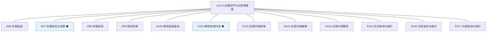
```mermaid
flowchart TB
    V[v0.6.0 治理闭环与运营管理面]
    V --- N96[R96 举报发起] & N97[R97 举报核实与处置 ◆] & N98[R98 举报驳回] & N99[R99 我的举报] & N100[R100 审核留痕查询] & N101[R101 删除违规内容 ◆] & N102[R102 运营内容新增] & N103[R103 运营内容编辑] & N104[R104 运营内容删除] & N105[R105 会员查询与维护] & N106[R106 内容查询与维护] & N107[R107 内容查询与维护]
    classDef complex fill:#e7f1ff,stroke:#3b7ddd;
    class N97,N101 complex;
```

**认领条目表**（需求名／用途／验收标准逐字引自 0.6 大版本 02 批次一需求表，验收判定以本表锚为准）：

| 编号 | 需求名 | 用途 | 验收标准 |
|---|---|---|---|
| R96 | 举报发起 | 对已公开内容提交举报并说明理由 | 会员对已公开内容提交举报并填写理由后，举报进入待处理队列；对同一内容的重复举报合并为一条待处理项；非公开内容不可举报 |
| R97 | 举报核实与处置 ◆ | 核实后作出处置或驳回，结论通知相关方 | 版主核实举报后，成立则执行处置（删除违规内容或禁言、封号）并将举报置为已处理，处置留痕与双方通知在同一事务完成；不成立则转入举报驳回 |
| R98 | 举报驳回 | 举报不成立时驳回并说明理由 | 版主填写理由驳回举报后，举报置为已驳回并通知举报人（含理由）；驳回后举报不可再变更 |
| R99 | 我的举报 | 在个人中心查看自己发起的举报与结论 | 会员在个人中心我的举报查看自己发起的举报列表与结论（待处理／已处理／已驳回），已处理条目可查看处置结论 |
| R100 | 审核留痕查询 | 按内容或操作人查询历史审核记录 | 站长与版主按内容标识或操作人查询历史审核与处置记录，结果含结论、驳回或处置原因、操作人与时间，按时间倒序分页展示 |
| R101 | 删除违规内容 ◆ | 对内容执行删除，删除为终态 | 版主对违规内容执行删除后内容置已删除终态、前台与搜索不再出现；同一事务解除该内容的点赞与收藏、写处置留痕并通知作者；被采纳的答案不删除改为标记处置结果；重复删除幂等 |
| R102 | 运营内容新增 | 新增推荐与引导性内容 | 运营人员填写标题、正文摘要、跳转目标（站内话题或问题）与展示位置保存后，条目默认启用并即时出现在前台对应运营位；同一展示位置启用条数上限 5 条，超限保存被拦截并提示 |
| R103 | 运营内容编辑 | 修改已发布的运营内容 | 运营人员修改标题、摘要、跳转目标或展示位置保存后前台即时呈现新值；仅停用条目可修改展示位置（启用中条目改位置须先停用，避免前台错位） |
| R104 | 运营内容删除 | 下架不再需要的运营内容 | 运营人员删除运营内容后前台不再展示且记录保留（软删除）；被前台运营位引用中的条目删除后该位置即时下架；重复删除幂等 |
| R105 | 会员查询与维护 | 按昵称、编号与状态检索会员并维护资料 | 运营人员按昵称、会员编号与账号状态检索会员，查看资料并可维护昵称与备注（维护留痕）；账号状态变更入口指向审核与治理处置，不在本功能内执行 |
| R106 | 内容查询与维护 | 检索并维护站内话题与评论 | 运营人员按关键词、作者、状态与时间检索话题与评论并查看详情；维护动作限资料性更正（如板块归属调整），删除仍走治理侧处置路径并留痕，维护与处置均留痕 |
| R107 | 内容查询与维护 | 检索并维护站内问题与答案 | 运营人员按关键词、作者、状态与时间检索问题与答案并查看详情；被采纳的答案不可删除（治理处置沿用标记口径），悬赏状态随问题只读展示；维护与处置均留痕 |

**锚定说明**：上表三要素与 0.6 大版本 02 批次一逐字一致（含 ◆ 标注与全角标点）；池内登记同源（需求池 §2／§3.1，状态已认领（v0.6.0））。R106／R107 同名分立为模块对象范围差异（话题与评论／问题与答案），认领与验收以编号区分。

## 3. 核心用户旅程

**旅程承接说明**：承接上游大版本 PRD 同名三条旅程，均落在批次一认领范围内，本版细化到开发级取值（理由字数、合并口径、留痕字段、位置上限）；我的举报、审核留痕查询、会员查询与维护、内容查询与维护为简单操作型功能不成旅程（验收标准可覆盖）。

### 3.1 旅程一：举报核实与处置闭环（会员、版主·跨主体）

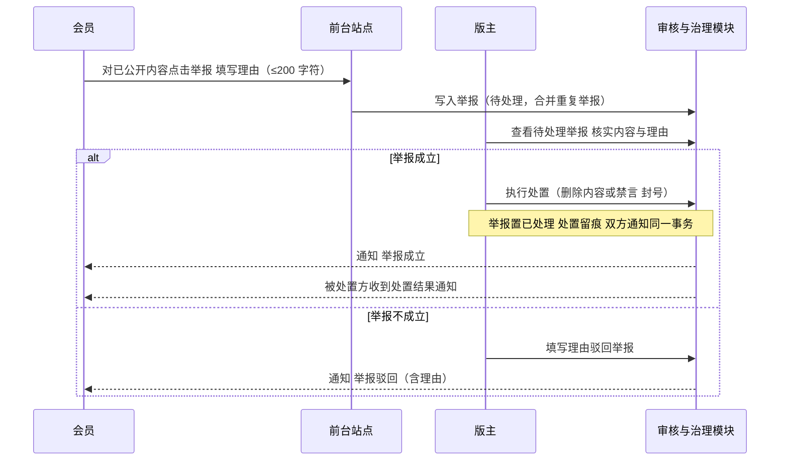
```mermaid
sequenceDiagram
    participant 会员
    participant 前台站点
    participant 版主
    participant 审核与治理模块
    会员->>前台站点: 对已公开内容点击举报 填写理由（≤200 字符）
    前台站点->>审核与治理模块: 写入举报（待处理，合并重复举报）
    版主->>审核与治理模块: 查看待处理举报 核实内容与理由
    alt 举报成立
        版主->>审核与治理模块: 执行处置（删除内容或禁言 封号）
        Note over 版主,审核与治理模块: 举报置已处理 处置留痕 双方通知同一事务
        审核与治理模块-->>会员: 通知 举报成立
        审核与治理模块-->>会员: 被处置方收到处置结果通知
    else 举报不成立
        版主->>审核与治理模块: 填写理由驳回举报
        审核与治理模块-->>会员: 通知 举报驳回（含理由）
    end
```

本旅程演示口径一前半段与口径二：举报进入待处理（同一内容重复举报合并为一条）；版主核实后两路结论均与留痕、通知同事务完成。

操作步骤清单：1. 会员对已公开内容点击举报、填写理由提交；2. 举报进入待处理队列（重复举报被合并）；3. 版主查看待处理举报并核实；4. 成立则执行处置（删除违规内容或禁言、封号）、不成立则填写理由驳回；5. 结论、处置留痕（处置人、时间、理由）与双方通知同一事务完成；6. 会员在我的举报查看结论。

### 3.2 旅程二：治理侧删除与留痕回溯（版主·单端）

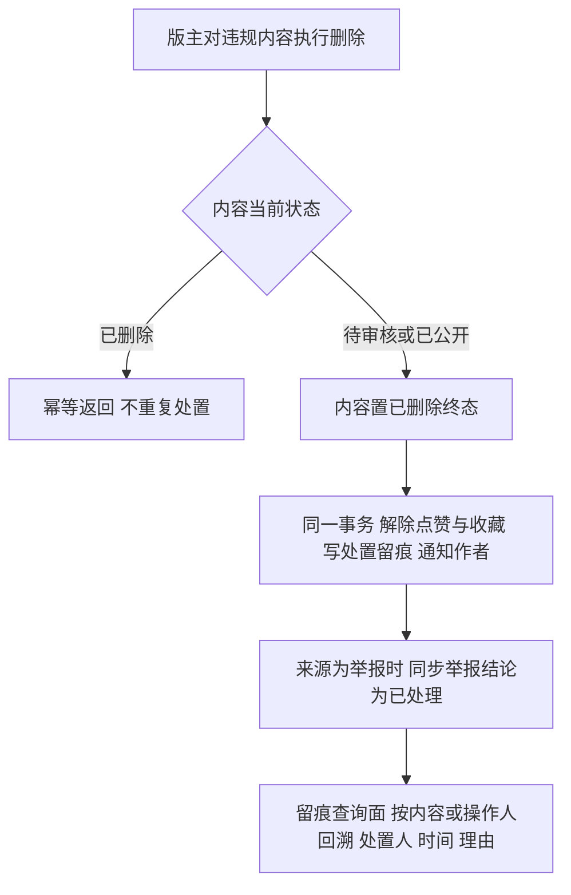
```mermaid
flowchart TB
    A[版主对违规内容执行删除] --> B{内容当前状态}
    B -->|已删除| C[幂等返回 不重复处置]
    B -->|待审核或已公开| D[内容置已删除终态]
    D --> E[同一事务 解除点赞与收藏 写处置留痕 通知作者]
    E --> F[来源为举报时 同步举报结论为已处理]
    F --> G[留痕查询面 按内容或操作人回溯 处置人 时间 理由]
```

本旅程演示治理侧删除（0.2 过渡的正式补齐）与留痕回溯：删除为终态、互动关系同事务清理、留痕可检索；被采纳的答案不删除、改为保留并标记处置结果。

操作步骤清单：1. 版主对违规内容执行删除（来源可为举报核实或主动巡查）；2. 幂等校验当前状态后置已删除终态；3. 同一事务解除点赞与收藏、写处置留痕、通知作者；4. 来源为举报时同步举报结论；5. 在审核留痕查询按内容或操作人回溯该记录。

### 3.3 旅程三：运营内容维护与前台展示（运营人员·单端流程）

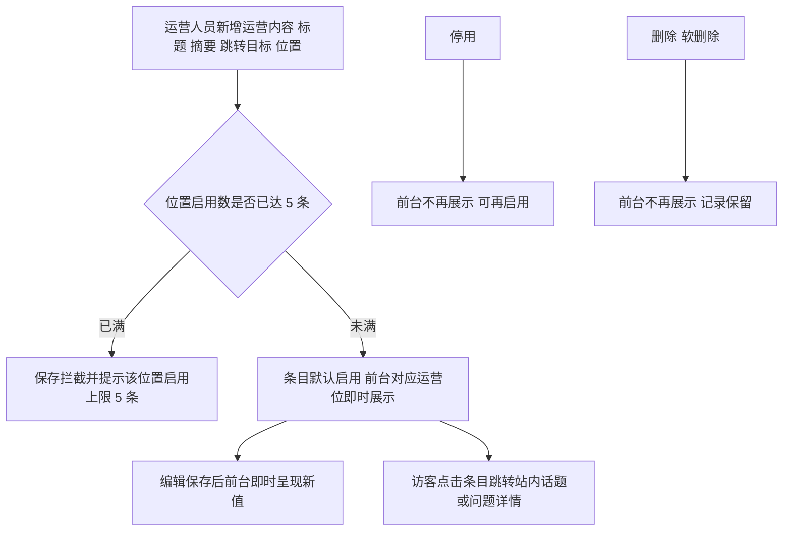
```mermaid
flowchart TB
    A[运营人员新增运营内容 标题 摘要 跳转目标 位置] --> B{位置启用数是否已达 5 条}
    B -->|已满| C[保存拦截并提示该位置启用上限 5 条]
    B -->|未满| D[条目默认启用 前台对应运营位即时展示]
    D --> E[编辑保存后前台即时呈现新值]
    F[停用] --> G[前台不再展示 可再启用]
    H[删除 软删除] --> I[前台不再展示 记录保留]
    D --> J[访客点击条目跳转站内话题或问题详情]
```

本旅程演示运营内容从维护到前台消费的闭环：新增即展示（位置上限拦截）、编辑即时生效、停用可逆、软删除下架。

操作步骤清单：1. 运营人员新增运营内容并保存（位置未满则默认启用）；2. 前台对应运营位即时展示；3. 编辑保存后前台即时呈现新值；4. 停用后前台下架、可再启用；5. 删除为软删除、前台下架且记录保留；6. 访客点击条目跳转对应站内详情。

## 4. 功能需求

### 4.1 功能总览

**对象归组树**（版本→对象→条目，对象为功能归属主体）：

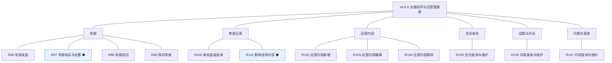
```mermaid
flowchart TB
    V[v0.6.0 治理闭环与运营管理面]
    V --- O1[举报]
    O1 --- N96[R96 举报发起] & N97[R97 举报核实与处置 ◆] & N98[R98 举报驳回] & N99[R99 我的举报]
    V --- O2[审核记录]
    O2 --- N100[R100 审核留痕查询] & N101[R101 删除违规内容 ◆]
    V --- O3[运营内容]
    O3 --- N102[R102 运营内容新增] & N103[R103 运营内容编辑] & N104[R104 运营内容删除]
    V --- O4[会员账号]
    O4 --- N105[R105 会员查询与维护]
    V --- O5[话题与评论]
    O5 --- N106[R106 内容查询与维护]
    V --- O6[问题与答案]
    O6 --- N107[R107 内容查询与维护]
    classDef complex fill:#e7f1ff,stroke:#3b7ddd;
    class N97,N101 complex;
```

**对象增删改查矩阵**：

| 对象 | 增 | 改 | 删 | 查 |
|---|---|---|---|---|
| 举报 | R96（发起，重复合并） | R97／R98（状态流转＋结论与处置人写入） | 不做（终态保留作治理档案） | R99 我的举报（本人只读）；R97 版主待处理队列 |
| 审核记录 | 沿用（0.2 审核写入＋本版处置留痕随处置写入） | 不做（只增不改） | 不做 | R100 审核留痕查询（站长与版主，按内容或操作人） |
| 运营内容 | R102（新增即默认启用，位置上限 5） | R103（标题／摘要／跳转／位置，位置限停用态改） | R104（软删除，前台下架记录保留） | 前台运营位呈现（随条目状态）；管理后台列表 |
| 会员账号 | 不做（注册随 0.1） | R105 资料性维护（昵称、备注，留痕）；状态变更指向 0.2 处置 | 不做 | R105 检索（昵称／编号／状态） |
| 话题与评论 | 不做（发表随 0.2） | R106 资料性更正（如板块归属，留痕） | 经治理侧处置（R101 路径，不在检索面直删） | R106 检索（关键词／作者／状态／时间） |
| 问题与答案 | 不做（发表随 0.3） | R107 资料性更正（留痕） | 经治理侧处置（被采纳答案不可删、标记处置） | R107 检索（含悬赏状态只读） |

**主体使用面**：

| 主体 | 使用条目 | 面说明 |
|---|---|---|
| 会员 | R96（前台内容入口的举报按钮）、R99（个人中心我的举报） | 前台两端 |
| 版主 | R97、R98、R101、R100 | 管理后台·举报处置队列与留痕查询 |
| 运营人员 | R102～R104、R105～R107 | 管理后台·运营内容维护与会员／内容检索维护 |
| 站长 | R100（与版主同面） | 管理后台·留痕查询 |
| 访客 | 无操作面 | 前台运营位被动展示（随 R102～R104 结果） |

### 4.2 R96 举报发起

**功能说明**：对已公开内容提交举报并说明理由——举报进入待处理队列，重复举报合并。触发：会员在已公开内容（话题、评论、问题、答案）的操作区点击举报。

**交互与流程**：

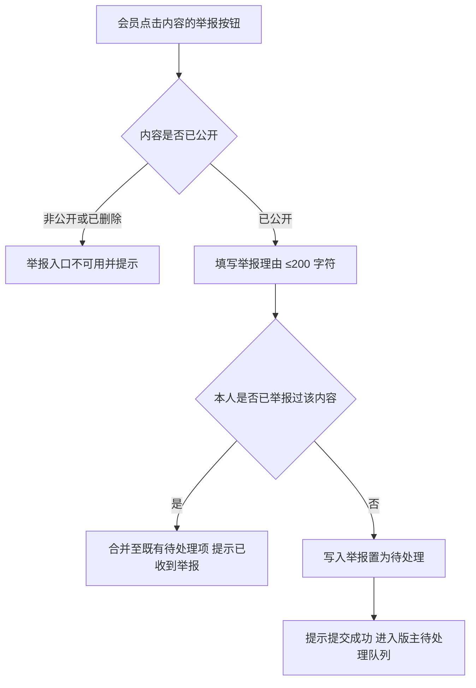
```mermaid
flowchart TB
    A[会员点击内容的举报按钮] --> B{内容是否已公开}
    B -->|非公开或已删除| C[举报入口不可用并提示]
    B -->|已公开| D[填写举报理由 ≤200 字符]
    D --> E{本人是否已举报过该内容}
    E -->|是| F[合并至既有待处理项 提示已收到举报]
    E -->|否| G[写入举报置为待处理]
    G --> H[提示提交成功 进入版主待处理队列]
```

操作步骤清单：1. 会员在已公开内容操作区点击举报；2. 填写理由（1～200 字符）提交；3. 首次举报写入待处理；4. 对同一内容的重复举报合并至既有待处理项并提示已收到；5. 提交成功提示。

**字段与校验**：

| 信息项 | 必填 | 校验 |
|---|---|---|
| 被举报内容 | 是 | 须为已公开状态的话题／评论／问题／答案（多态引用：内容类型＋内容标识） |
| 举报理由 | 是 | 1～200 字符 |

**规则与边界**：1. 仅已公开内容可举报（非公开与已删除不可举报，入口不可用）。2. 同一举报人对同一内容的重复举报合并为一条待处理项（本版定案；不同举报人对同一内容各成一条）。3. 举报为治理档案：终态（已处理／已驳回）后不可再变更、不删除。4. 举报不通知被举报方（避免打草惊蛇，处置结论才通知双方——本版拍板，从「结论通知相关方」锚推导）。

**异常与拦截**：1. 非公开内容→入口不可用并提示。2. 理由为空或超 200 字符→提示调整。3. 重复提交（并发双击）→合并幂等，只产生一条待处理项。

### 4.3 R97 举报核实与处置 ◆

**功能说明**：核实后作出处置或驳回，结论通知相关方——举报处置的版主主操作。触发：版主在管理后台打开待处理举报。

**交互与流程**：

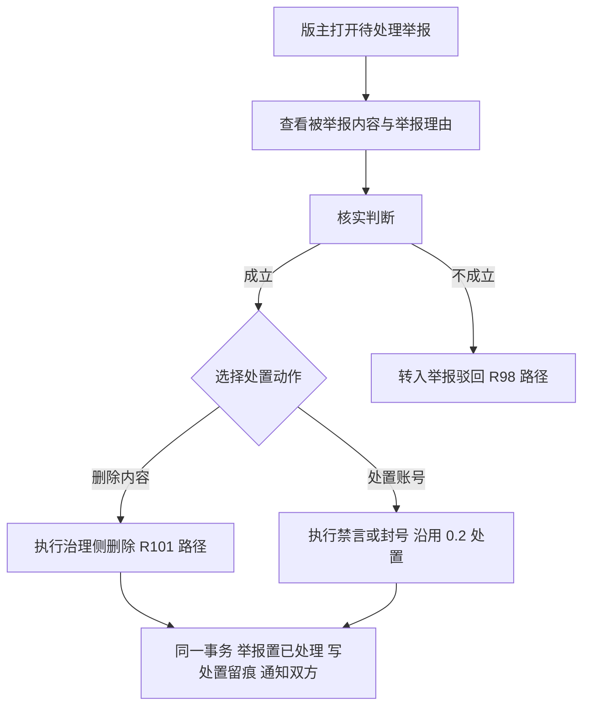
```mermaid
flowchart TB
    A[版主打开待处理举报] --> B[查看被举报内容与举报理由]
    B --> C[核实判断]
    C -->|成立| D{选择处置动作}
    D -->|删除内容| E[执行治理侧删除 R101 路径]
    D -->|处置账号| F[执行禁言或封号 沿用 0.2 处置]
    E --> G[同一事务 举报置已处理 写处置留痕 通知双方]
    F --> G
    C -->|不成立| H[转入举报驳回 R98 路径]
```

操作步骤清单：1. 版主在待处理举报队列打开某条举报，查看被举报内容与理由（内容原文可跳转）；2. 核实后选择结论：成立则选择处置动作（删除违规内容，或禁言、封号沿用 0.2），不成立则转入驳回；3. 成立路径同一事务完成：处置执行、举报置已处理（写结论、处置人、处置时间）、写处置留痕、通知举报人（举报成立）与被处置方（处置结果）；4. 处置完成后举报从待处理队列消失。

**字段与校验**：

| 信息项 | 必填 | 校验 |
|---|---|---|
| 处置动作 | 成立时必选 | 删除内容／禁言／封号三选（禁言期限取值沿用 0.2：1／3／7／30 天） |
| 处置理由 | 是 | 1～200 字符，写入处置留痕与通知摘要 |

**规则与边界**：1. 举报状态变更、处置留痕、双方通知同一事务（R97 锚、口径二），任一失败整体回滚。2. 处置动作消费既有能力：内容删除走 R101 路径（含互动清理）、账号处置走 0.2 禁言与封号（含留痕与通知）。3. 同一事务内仅处置一次：重复提交被终态校验拒绝（幂等）。4. 通知口径：举报人收「举报成立」；被处置方在删除场景收「举报成立」视角文案、在禁言封号场景沿用既有处置类通知（本版定案）。

**异常与拦截**：1. 举报已被处理（并发）→终态校验拒绝，界面刷新。2. 被举报内容在核实前已被删除→举报仍可处置（结论基于既有事实），处置动作仅剩账号处置或驳回。3. 事务失败→整体回滚，举报保持待处理。

### 4.4 R98 举报驳回

**功能说明**：举报不成立时驳回并说明理由——驳回为终态。触发：版主在举报核实中选择不成立。

**交互与流程**：

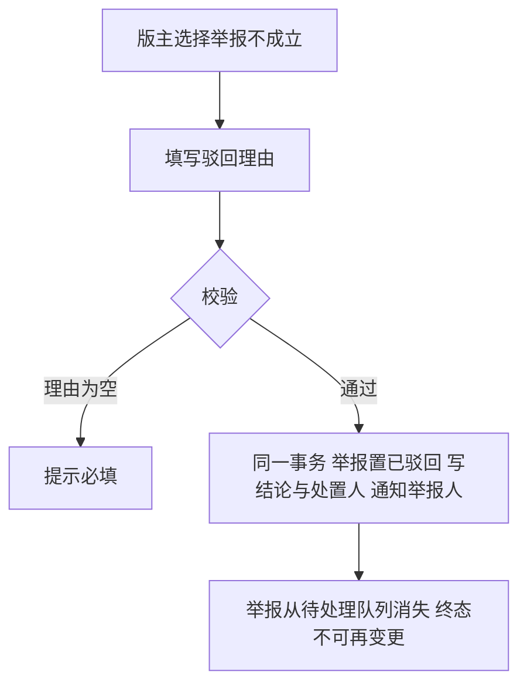
```mermaid
flowchart TB
    A[版主选择举报不成立] --> B[填写驳回理由]
    B --> C{校验}
    C -->|理由为空| D[提示必填]
    C -->|通过| E[同一事务 举报置已驳回 写结论与处置人 通知举报人]
    E --> F[举报从待处理队列消失 终态不可再变更]
```

操作步骤清单：1. 版主选择不成立并填写驳回理由（1～200 字符）；2. 同一事务内举报置已驳回、写结论与处置人、通知举报人（举报驳回，含理由）；3. 驳回后该举报不可再变更。

**字段与校验**：

| 信息项 | 必填 | 校验 |
|---|---|---|
| 驳回理由 | 是 | 1～200 字符，写入举报结论并进入通知 |

**规则与边界**：1. 驳回为终态，不可再变更（R98 锚）。2. 驳回不触发任何处置动作、不通知被举报方。3. 驳回与结论、通知同事务。

**异常与拦截**：1. 理由为空→提示必填。2. 并发重复驳回→终态校验拒绝（幂等）。

### 4.5 R99 我的举报

**功能说明**：在个人中心查看自己发起的举报与结论。触发：会员进入个人中心我的举报。

**交互与流程**：

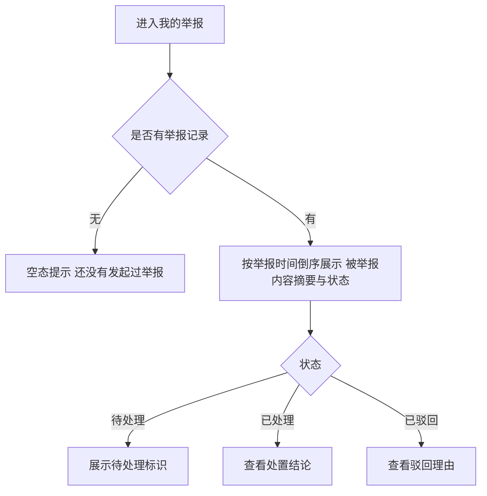
```mermaid
flowchart TB
    A[进入我的举报] --> B{是否有举报记录}
    B -->|无| C[空态提示 还没有发起过举报]
    B -->|有| D[按举报时间倒序展示 被举报内容摘要与状态]
    D --> E{状态}
    E -->|待处理| F[展示待处理标识]
    E -->|已处理| G[查看处置结论]
    E -->|已驳回| H[查看驳回理由]
```

操作步骤清单：1. 会员进入个人中心我的举报；2. 按举报时间倒序分页展示（每页 20 条，沿用口径），每条含被举报内容摘要与状态标识（色块＋文字）；3. 已处理可查看处置结论、已驳回收驳回理由、待处理显示等待标识。

**字段与校验**：

| 信息项 | 必填 | 校验 |
|---|---|---|
| 展示要素 | — | 被举报内容摘要、举报理由、状态（待处理／已处理／已驳回）、结论或驳回理由、时间；仅本人记录 |

**规则与边界**：1. 仅本人举报记录（按举报人过滤）。2. 被举报内容已删除时摘要保留原文快照（本版拍板：举报记录自带内容摘要快照，删除不破坏回溯）。3. 只读，无撤销举报路径。

**异常与拦截**：无举报→空态提示；只读列表无独立失败分支。

### 4.6 R100 审核留痕查询

**功能说明**：按内容或操作人查询历史审核记录——含 0.2 审核记录与本版处置留痕。触发：站长或版主在管理后台进入审核留痕查询。

**交互与流程**：

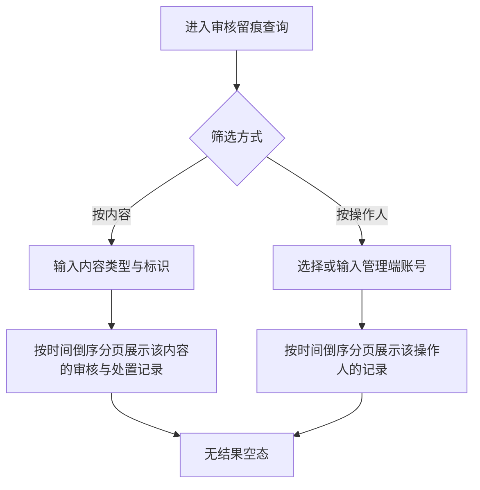
```mermaid
flowchart TB
    A[进入审核留痕查询] --> B{筛选方式}
    B -->|按内容| C[输入内容类型与标识]
    B -->|按操作人| D[选择或输入管理端账号]
    C --> E[按时间倒序分页展示该内容的审核与处置记录]
    D --> E2[按时间倒序分页展示该操作人的记录]
    E --> F[无结果空态]
    E2 --> F
```

操作步骤清单：1. 站长或版主进入留痕查询；2. 按内容（类型＋标识）或操作人筛选；3. 结果按时间倒序分页（每页 20 条），每条含结论（通过／驳回／处置）、驳回或处置原因、操作人与时间；4. 无匹配显示空态。

**字段与校验**：

| 信息项 | 必填 | 校验 |
|---|---|---|
| 筛选条件 | 内容或操作人至少一项 | 内容＝类型＋标识；操作人＝管理端账号 |
| 展示要素 | — | 结论、原因、操作人、时间；只读 |

**规则与边界**：1. 覆盖审核记录（0.2 起）与处置留痕（本版起）两类记录，统一时间轴呈现。2. 只读，不改不删（只增不改口径）。3. 权限：站长与版主可见（能力点判定，页面与接口同源）。

**异常与拦截**：1. 无筛选条件→不发起查询。2. 无结果→空态提示。3. 无权限→入口与接口拦截。

### 4.7 R101 删除违规内容 ◆

**功能说明**：对内容执行删除，删除为终态——治理侧内容删除的正式交付。触发：版主在举报处置中选择删除，或在内容巡查／检索面发起删除。

**交互与流程**：

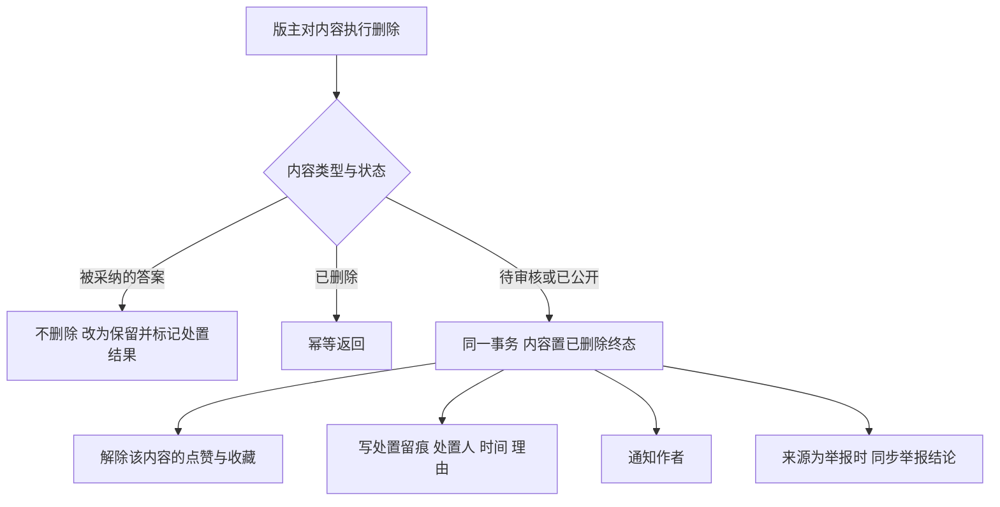
```mermaid
flowchart TB
    A[版主对内容执行删除] --> B{内容类型与状态}
    B -->|被采纳的答案| C[不删除 改为保留并标记处置结果]
    B -->|已删除| D[幂等返回]
    B -->|待审核或已公开| E[同一事务 内容置已删除终态]
    E --> F[解除该内容的点赞与收藏]
    E --> G[写处置留痕 处置人 时间 理由]
    E --> H[通知作者]
    E --> I[来源为举报时 同步举报结论]
```

操作步骤清单：1. 版主发起删除并确认（填处置理由）；2. 校验内容状态：被采纳的答案不删除改为标记处置结果、已删除幂等返回；3. 其余状态同一事务内：置已删除终态、解除点赞与收藏、写处置留痕、通知作者；4. 来源为举报时同步举报结论为已处理。

**字段与校验**：

| 信息项 | 必填 | 校验 |
|---|---|---|
| 处置理由 | 是 | 1～200 字符，入留痕与通知摘要 |
| 删除确认 | 是 | 二次确认（终态不可恢复） |

**规则与边界**：1. 删除为终态、前台与搜索不再出现（R101 锚）。2. 互动关系清理与删除同事务（0.2 删除话题清理口径推广至四类内容，本版拍板）。3. 被采纳的答案不可删除、保留内容并标记处置结果（问答契约沿用）。4. 幂等：重复删除不产生多条处置记录。

**异常与拦截**：1. 被采纳答案→拦截删除并提示，改走标记处置。2. 重复删除→幂等返回。3. 事务失败→整体回滚，内容状态不变。

### 4.8 R102 运营内容新增

**功能说明**：新增推荐与引导性内容——填写结构化条目并默认启用上前台。触发：运营人员在管理后台运营内容维护页点击新增。

**交互与流程**：

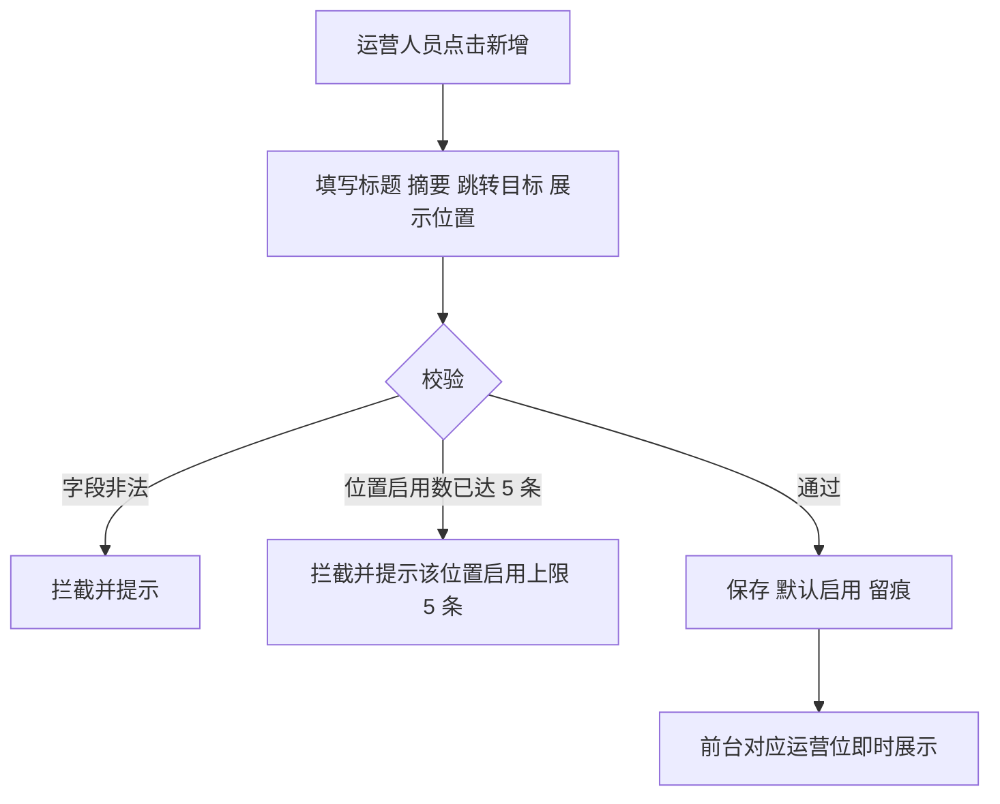
```mermaid
flowchart TB
    A[运营人员点击新增] --> B[填写标题 摘要 跳转目标 展示位置]
    B --> C{校验}
    C -->|字段非法| D[拦截并提示]
    C -->|位置启用数已达 5 条| E[拦截并提示该位置启用上限 5 条]
    C -->|通过| F[保存 默认启用 留痕]
    F --> G[前台对应运营位即时展示]
```

操作步骤清单：1. 运营人员填写标题（2～24 字符）、摘要（≤100 字符）、跳转目标（站内话题或问题，可选）、展示位置（首页横幅／板块侧栏）；2. 校验通过保存，条目默认启用；3. 前台对应运营位即时展示；4. 保存留痕（操作人、时间）。

**字段与校验**：

| 信息项 | 必填 | 校验 |
|---|---|---|
| 标题 | 是 | 2～24 字符 |
| 正文摘要 | 是 | ≤100 字符 |
| 跳转目标 | 否 | 站内话题或问题（类型＋编号），可为空（仅展示不跳转）；外链不支持 |
| 展示位置 | 是 | 枚举：首页横幅／板块侧栏；该位置启用数上限 5 条 |

**规则与边界**：1. 新增即默认启用（本版定案）。2. 位置启用上限 5 条，超限拦截（行业惯例默认）。3. 跳转目标仅站内（本版定案）。4. 保存与留痕同事务。

**异常与拦截**：1. 字段非法→拦截并提示。2. 位置满额→拦截提示。3. 跳转目标不存在→拦截提示。

### 4.9 R103 运营内容编辑

**功能说明**：修改已发布的运营内容——保存后前台即时呈现新值。触发：运营人员在运营内容列表对条目执行编辑。

**交互与流程**：

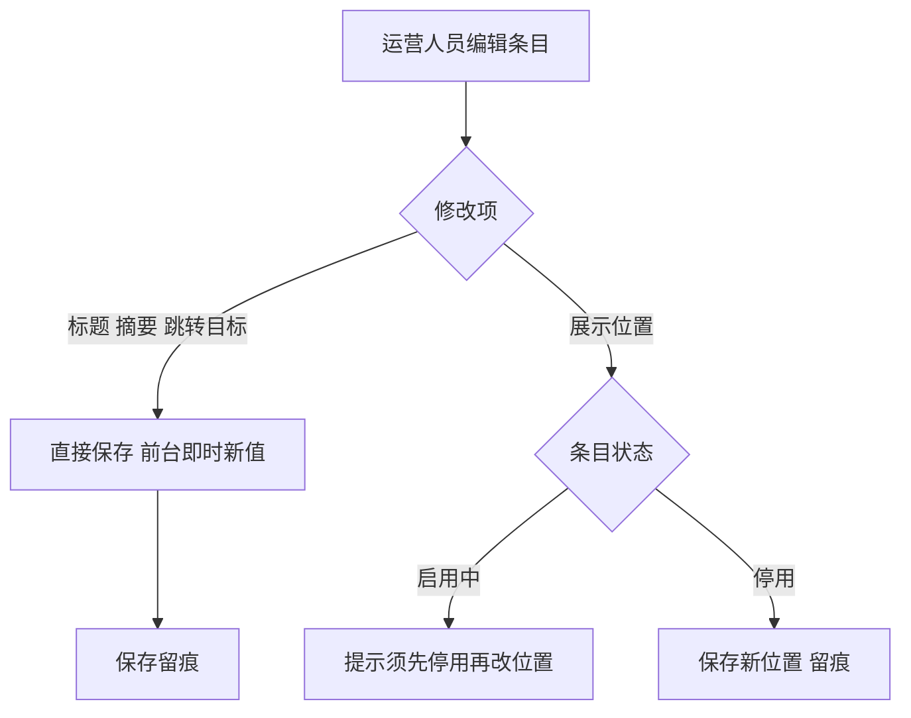
```mermaid
flowchart TB
    A[运营人员编辑条目] --> B{修改项}
    B -->|标题 摘要 跳转目标| C[直接保存 前台即时新值]
    B -->|展示位置| D{条目状态}
    D -->|启用中| E[提示须先停用再改位置]
    D -->|停用| F[保存新位置 留痕]
    C --> G[保存留痕]
```

操作步骤清单：1. 运营人员编辑标题、摘要或跳转目标，保存后前台即时呈现新值；2. 修改展示位置：启用中条目提示先停用（避免前台错位），停用条目可直接改；3. 新位置启用数校验同上限；4. 保存留痕。

**字段与校验**：同 R102 字段口径；展示位置修改限停用态条目。

**规则与边界**：1. 编辑不改状态（启用保持启用、停用保持停用）。2. 位置变更受上限校验。3. 已删除条目不可编辑。

**异常与拦截**：1. 启用中改位置→提示先停用。2. 字段非法或位置满额→拦截。3. 编辑已删除条目→拒绝。

### 4.10 R104 运营内容删除

**功能说明**：下架不再需要的运营内容——软删除，前台不再展示、记录保留。触发：运营人员对条目执行删除。

**交互与流程**：

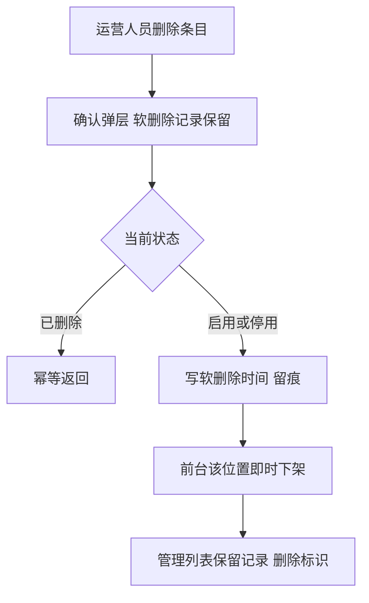
```mermaid
flowchart TB
    A[运营人员删除条目] --> B[确认弹层 软删除记录保留]
    B --> C{当前状态}
    C -->|已删除| D[幂等返回]
    C -->|启用或停用| E[写软删除时间 留痕]
    E --> F[前台该位置即时下架]
    F --> G[管理列表保留记录 删除标识]
```

操作步骤清单：1. 运营人员删除并确认（提示记录保留）；2. 已删除幂等返回；3. 其余状态写软删除时间并留痕；4. 前台即时下架；5. 管理列表保留记录并带删除标识。

**字段与校验**：

| 信息项 | 必填 | 校验 |
|---|---|---|
| 删除确认 | 是 | 二次确认（前台下架、记录保留） |

**规则与边界**：1. 软删除（R104 锚），记录保留可追溯。2. 前台下架即时生效。3. 重复删除幂等。

**异常与拦截**：重复删除→幂等返回。

### 4.11 R105 会员查询与维护

**功能说明**：按昵称、编号与状态检索会员并维护资料。触发：运营人员在管理后台进入会员查询与维护。

**交互与流程**：

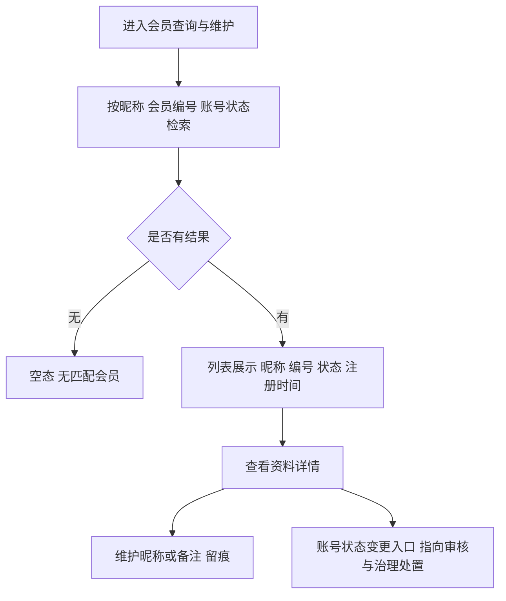
```mermaid
flowchart TB
    A[进入会员查询与维护] --> B[按昵称 会员编号 账号状态检索]
    B --> C{是否有结果}
    C -->|无| D[空态 无匹配会员]
    C -->|有| E[列表展示 昵称 编号 状态 注册时间]
    E --> F[查看资料详情]
    F --> G[维护昵称或备注 留痕]
    F --> H[账号状态变更入口 指向审核与治理处置]
```

操作步骤清单：1. 运营人员按昵称、会员编号或账号状态（正常／禁言／封号／已注销）检索；2. 列表展示结果（每页 20 条）；3. 进入资料详情查看；4. 可维护昵称与备注（维护留痕）；5. 账号状态变更入口指向审核与治理处置（禁言／封号沿 0.2 路径），不在本功能内执行。

**字段与校验**：

| 信息项 | 必填 | 校验 |
|---|---|---|
| 检索条件 | 至少一项 | 昵称（模糊）、会员编号（精确）、账号状态（枚举） |
| 维护项 | — | 昵称（沿用 0.1 口径）、备注；留痕记录操作人与时间 |

**规则与边界**：1. 只读身份摘要与状态，资料维护限昵称与备注（资料性维护，留痕）。2. 账号状态变更不在本功能执行（04C 契约：处置归审核与治理）。3. 已注销会员可检索可见（占位显示），不可维护。

**异常与拦截**：1. 无匹配→空态。2. 维护已注销会员→拒绝。3. 昵称校验不过→提示。

### 4.12 R106 内容查询与维护（话题与评论）

**功能说明**：检索并维护站内话题与评论——话题模块对象范围的运营检索面。触发：运营人员在管理后台进入内容查询与维护（话题范围）。

**交互与流程**：

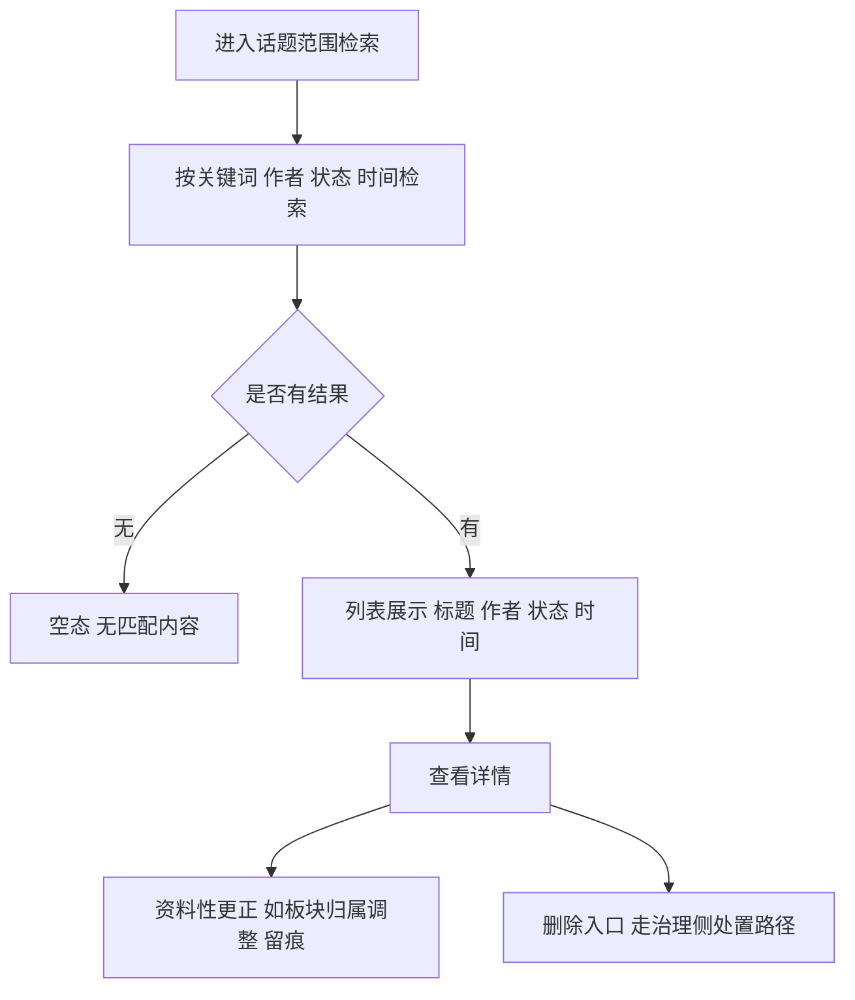
```mermaid
flowchart TB
    A[进入话题范围检索] --> B[按关键词 作者 状态 时间检索]
    B --> C{是否有结果}
    C -->|无| D[空态 无匹配内容]
    C -->|有| E[列表展示 标题 作者 状态 时间]
    E --> F[查看详情]
    F --> G[资料性更正 如板块归属调整 留痕]
    F --> H[删除入口 走治理侧处置路径]
```

操作步骤清单：1. 运营人员按关键词、作者、状态（含全部状态）与时间区间检索话题与评论；2. 列表与详情查看；3. 资料性更正（如话题板块归属调整）留痕执行；4. 删除不走本面直删，转治理侧处置路径（R101，版主权限）并留痕。

**字段与校验**：

| 信息项 | 必填 | 校验 |
|---|---|---|
| 检索条件 | 至少一项 | 关键词、作者、状态、时间区间 |
| 维护项 | — | 资料性更正（板块归属等）；均留痕 |

**规则与边界**：1. 检索覆盖全部状态（含待审核与已删除，供运营核查——与前台零泄漏不冲突，本面为管理后台）。2. 维护限资料性更正，删除统一走治理处置（R101 路径）。3. 维护与处置均留痕（R106 锚）。

**异常与拦截**：1. 无匹配→空态。2. 越权（非运营人员）→入口与接口拦截。3. 非法维护项→拒绝。

### 4.13 R107 内容查询与维护（问题与答案）

**功能说明**：检索并维护站内问题与答案——问答模块对象范围的运营检索面。触发：运营人员在管理后台进入内容查询与维护（问答范围）。

**交互与流程**：

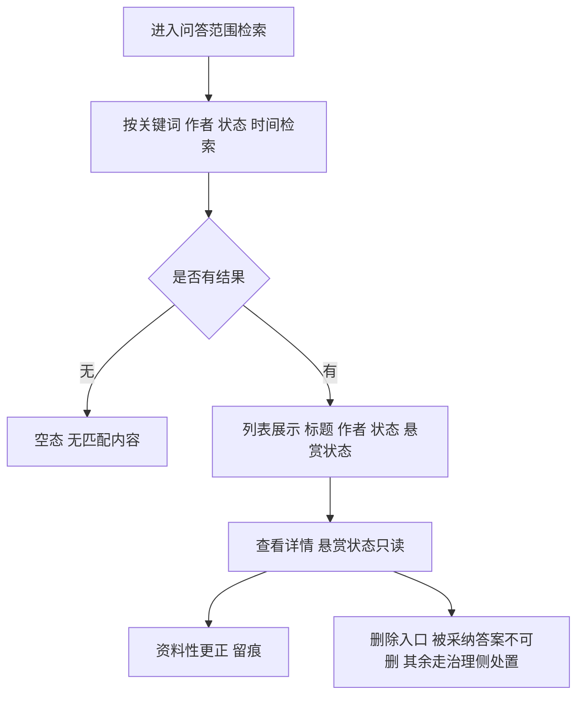
```mermaid
flowchart TB
    A[进入问答范围检索] --> B[按关键词 作者 状态 时间检索]
    B --> C{是否有结果}
    C -->|无| D[空态 无匹配内容]
    C -->|有| E[列表展示 标题 作者 状态 悬赏状态]
    E --> F[查看详情 悬赏状态只读]
    F --> G[资料性更正 留痕]
    F --> H[删除入口 被采纳答案不可删 其余走治理侧处置]
```

操作步骤清单：1. 运营人员按关键词、作者、状态与时间区间检索问题与答案；2. 列表与详情查看，悬赏状态随问题只读展示；3. 资料性更正留痕执行；4. 删除：被采纳的答案不可删除（拦截并提示）、其余内容转治理侧处置路径并留痕。

**字段与校验**：

| 信息项 | 必填 | 校验 |
|---|---|---|
| 检索条件 | 至少一项 | 关键词、作者、状态、时间区间 |
| 展示要素 | — | 悬赏状态（待结算／已结算／已撤回）随问题只读展示 |

**规则与边界**：1. 被采纳的答案不可删除（R107 锚，治理处置沿用标记口径）。2. 悬赏状态只读（账本与悬赏状态变更归成长与问答模块）。3. 维护与处置均留痕。

**异常与拦截**：1. 被采纳答案删除→拦截并提示。2. 无匹配→空态。3. 越权→拦截。

## 5. 业务对象与数据字段

**数据主体清单**：

| 业务对象 | 落库名 | 定位与关系 |
|---|---|---|
| 举报 | report | 会员对违规内容的报告；被举报对象为多态引用（话题／评论／问题／答案，内容类型＋标识）；三态沿术语表 §4 |
| 审核记录 | audit_record | 沿用（v0.2.0 登记，content_type 取值已含话题／评论／问题／答案），本版处置留痕随处置写入（结论类记录含处置原因 punish_reason，沿 §7 通用契约） |
| 运营内容 | operation_content | 运营人员维护的运营位条目（§3 已登记落库名），本版落地字段并新增前台运营位消费路径 |
| 会员账号／话题／评论／问题／答案 | 沿用各表 | 沿用既有登记，本版新增运营侧检索与维护路径（资料性更正留痕）；治理侧删除复用各内容表状态字段（置已删除终态） |

**逐对象字段表**（本版新增表；既有对象沿用登记）：

举报 report：

| 字段 | 必填 | 业务类型 | 落库字段名 | 约束与取值 |
|---|---|---|---|---|
| 举报编号 | 是 | 编号 | report_no | 创建时生成、终身不变（§5 编码契约，v0.6.0 增补） |
| 举报人 | 是 | 关联 | reporter_id | 会员账号 |
| 被举报内容类型 | 是 | 枚举 | content_type | 话题／评论／问题／答案 |
| 被举报内容标识 | 是 | 关联 | content_id | 与 content_type 配对；提交时快照内容摘要供回溯 |
| 举报理由 | 是 | 文本 | reason | 1～200 字符 |
| 状态 | 是 | 枚举 | status | 待处理／已处理／已驳回（术语表 §4，后两态为终态） |
| 处理结论 | 否 | 枚举 | conclusion | 成立／驳回（处置或驳回时写入） |
| 处置人 | 否 | 关联 | handler_id | 管理端账号 |
| 处置时间 | 否 | 时间 | handled_at | 结论写入时间 |

运营内容 operation_content：

| 字段 | 必填 | 业务类型 | 落库字段名 | 约束与取值 |
|---|---|---|---|---|
| 标题 | 是 | 文本 | title | 2～24 字符 |
| 正文摘要 | 是 | 文本 | summary | ≤100 字符 |
| 跳转目标类型 | 否 | 枚举 | target_type | 话题／问题（可为空，仅展示不跳转） |
| 跳转目标标识 | 否 | 关联 | target_id | 与 target_type 配对 |
| 展示位置 | 是 | 枚举 | position | 首页横幅／板块侧栏；每位置启用上限 5 条 |
| 状态 | 是 | 枚举 | status | 启用／停用（新增默认启用） |
| 软删除时间 | 否 | 时间 | deleted_at | 软删除时写入，记录保留 |

以上新字段已随认领登记术语表 §5／§7（来源 v0.6.0）；列类型、主键、索引与建表 DDL 归开发阶段。

## 6. 待议与建议

**本版采用的推断与默认值汇总**：

| 采用值 | 来源状态 |
|---|---|
| 运营内容形态（结构化条目、位置枚举、每位置上限 5、新增即启用、软删除） | 0.6 PRD 本版定案（行业惯例默认） |
| 同一举报人对同一内容重复举报合并 | 0.6 PRD 本版定案（04C 本轮建议沿用） |
| 举报理由与处置／驳回理由 1～200 字符 | 本版拍板（行业惯例默认，与既有文本约束同档） |
| 举报不通知被举报方，处置结论才通知双方 | 本版拍板（从「结论通知相关方」锚推导） |
| 举报记录自带内容摘要快照（内容被删后仍可回溯） | 本版拍板（治理档案完整性） |
| 治理侧删除的互动清理推广至四类内容 | 本版拍板（0.2 删除话题清理口径推广） |
| 运营内容启用中改位置须先停用 | 0.6 PRD 定案沿用（避免前台错位） |
| 检索与列表每页 20 条、时间倒序 | 本版拍板（沿用列表口径） |
| 管理后台检索面可见全部状态（含待审核与已删除） | 本版拍板（运营核查需要，与前台零泄漏不冲突） |

**待确认内容与影响**：无阻塞性待议——举报量与处置时长口径属版本级验收安排（0.6 PRD 口径三），不影响本版开发；被处置内容连带隐藏同作者其他内容未纳入（04C 待业务确认，如承载走需求池单条入池）。

**建议回池的新想法**：无。

**术语表登记**：本版新表字段（report 九字段、operation_content 七字段）与编码名 report_no 已随认领登记术语表 §5／§7（来源 v0.6.0），变更记录已追加；notify_type「举报成立」「举报驳回」已于 0.6 立项时登记，本文逐字沿用。
