# PRD（大版本）：0.7 运营复盘版

> 定位：本版立项说明书——承接路线图 0.7 条目与项目 PRD，圈定运营复盘版的范围、功能与验收口径，供需求拆解与小版本规划直接开工。上游为模拟案例材料，模拟性质予以保留。

## 1. 版本概述

**承接与目标**：0.6 治理完善版收口后，站点已具备完整的身份、内容、互动、激励与治理能力，项目 PRD 成功标准中「经营方能看到内容与互动的基本情况并据此调整规则」尚缺两个抓手——内容热度数据与异常账目的纠偏手段（D8）。本版作为路线图收官版本交付两件事：浏览量的累计与统计查看，让经营方看到内容热度并据此复盘；积分人工修正，让账目异常有可追溯的修正出口。

**成功标准与量化口径**：两条完成标志路径在内部演练中 100% 走通——①「访客查看已公开内容 → 管理后台浏览量统计页看到该内容计数增长」；②「站长完成一次带原因的积分修正 → 修正流水在会员与经营方两侧流水查询中均可查到、必要时等级随新余额重判」。判定方式为内部演练逐项核对（收官版本为内部复盘口径，无灰度台阶）；「运营依据热度数据调整规则与内容」为观察期验证假设（观察期内发生由数据驱动的内容与规则调整事件），不阻塞本版立项与验收。

**范围一句话**：本版做三件事——浏览量累计、浏览量统计查看、积分人工修正；不做统计报表与埋点体系、浏览量时间趋势分析（未纳入，见路线图暂缓清单），不做积分商城与积分兑换、积分有效期（未纳入，见路线图暂缓清单；若引入需先评审余额与流水的过期处理机制并同步悬赏预扣规则，04C-成长模块·关联评审），不交付去重口径的管理端开关界面（机制建议归模块设计，不在本版功能清单）；本版无过渡支撑条目——经营方复盘动作（调整运营内容与规则）由 0.6 已交付的运营内容维护与内容查询维护承接，账目查询面由 0.5 已交付的流水查询承接。

**沿用与前置**：前置版本 0.2、0.3、0.6（路线图依赖行）；沿用 0.2 与 0.3 的内容与积分基础（已公开内容的详情呈现、积分账户与流水、等级判定）、0.6 的运营内容与查询维护能力；浏览量的去重口径在本版定案（路线图指明的唯一归属时点，见 5.1 浏览量对象）。

## 2. 主体与角色

**上场主体总览树**：

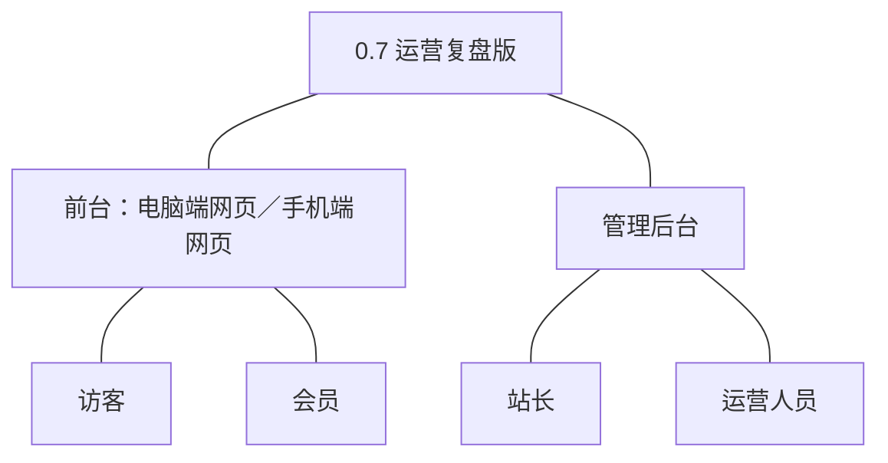

| 主体／角色 | 端 | 怎么用系统 |
|---|---|---|
| 访客 | 电脑端网页、手机端网页 | 查看已公开内容，查看行为触发浏览量累计（无需注册） |
| 会员 | 电脑端网页、手机端网页 | 查看已公开内容触发浏览量累计；自己账户被修正后，修正流水可在流水查询中看到 |
| 站长 | 管理后台 | 查看浏览量统计；对异常积分账目发起人工修正 |
| 运营人员 | 管理后台 | 查看浏览量统计，结合热度调整运营内容与规则 |

**裁剪说明**：版主本版不上场——浏览量与积分修正均不涉内容审核与处置动作；会员侧无新增主动功能，修正结果经既有流水查询体现；浏览量累计由系统在内容被查看时执行，系统是执行方而非角色。

## 3. 核心业务流程

### 3.1 旅程一：浏览量——从查看到复盘

访客或会员在前台打开已公开内容，系统累计浏览量；站长或运营人员在管理后台查看热度统计，据此调整运营内容与规则。旅程跨用户主体与经营主体、前台与管理后台，是本版复盘主线的完整闭环。

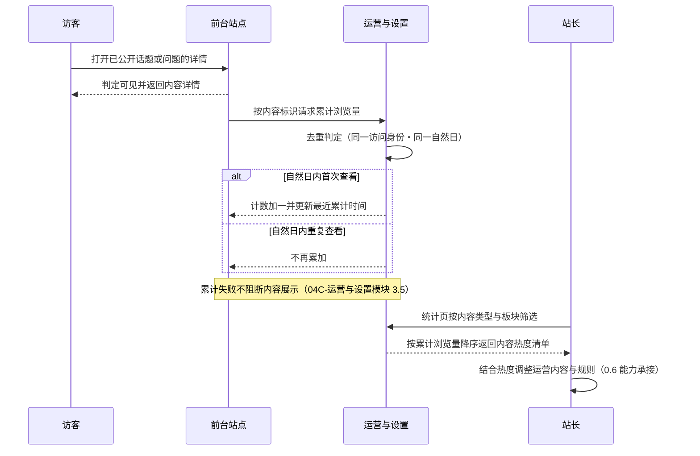

操作步骤清单：

1. 访客或会员在前台打开一个已公开话题或问题的详情页。
2. 系统判定内容可见并返回详情，同时按内容标识请求累计浏览量。
3. 系统按去重口径判定：同一访问身份在同一自然日内首次查看则计数加一并更新最近累计时间，重复查看不再累加；累计环节异常不影响内容详情展示。
4. 站长或运营人员在管理后台浏览量统计页按内容类型（话题／问题）与板块筛选。
5. 系统按累计浏览量降序返回内容热度清单，含累计浏览量与最近累计时间。
6. 站长或运营人员定位到具体内容，结合热度调整运营内容与规则（0.6 已交付能力承接）。

### 3.2 旅程二：积分人工修正——异常账目纠偏

站长在管理后台对异常积分账目发起修正，填写数值与原因，系统同事务调整余额并写入修正流水，必要时重判等级；会员与经营方都能在流水查询中回溯该次修正。单端单主体的操作流，承载本版账目纠偏主题。

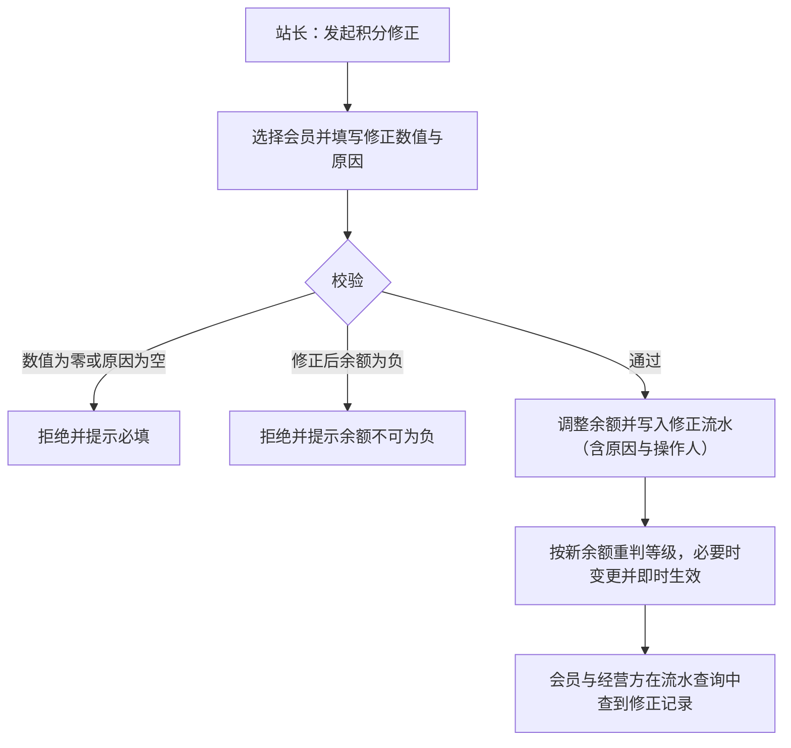

操作步骤清单：

1. 站长在管理后台进入积分修正入口，选择目标会员的积分账户。
2. 填写非零修正数值与修正原因（原因必填）。
3. 提交校验：数值为零或原因为空、或修正后余额为负时拒绝并提示。
4. 校验通过后余额调整与修正流水在同一事务内完成（04C-成长模块 3.4）。
5. 系统按新余额重判等级，判定结果与当前等级不同则变更并即时生效（0.3 等级判定沿用）。
6. 修正流水在会员侧与经营方流水查询中均可回溯（0.5 流水查询沿用）。

## 4. 功能需求

**功能全景总图**：

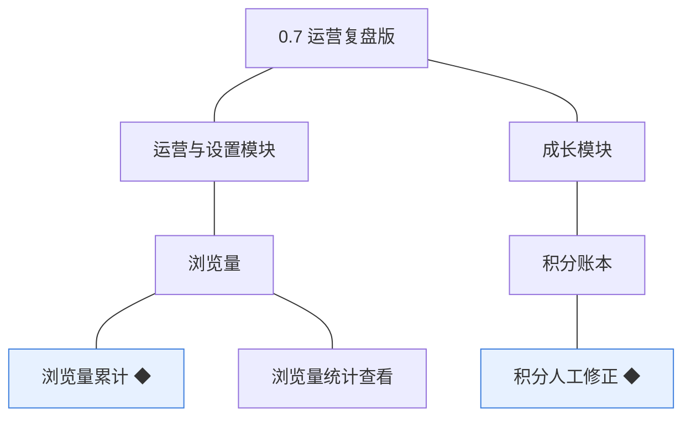

### 4.1 运营与设置模块

模块分支图（摘自总图、同名同构）：

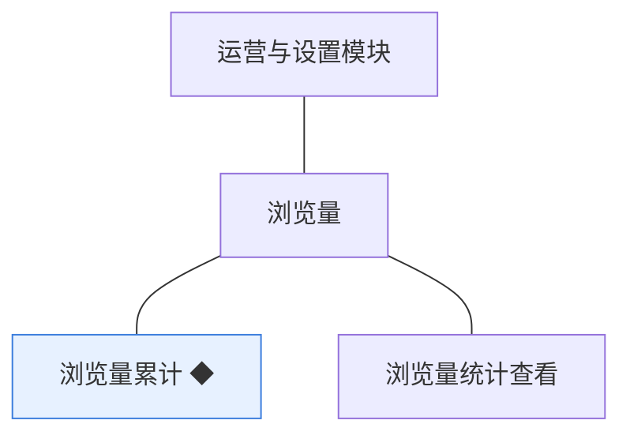

**组说明**：浏览量组为运营与设置模块的记录型对象——累计由系统在内容被查看时执行（使用方：系统），统计查看供站长与运营人员使用；浏览量不参与内容可见性与排序的强判定，仅作参考数据（04C-运营与设置模块）。

本表功能行与下游需求条目一一同构：一条需求＝一项功能，名称、用途与验收标准由下游逐字转记、不压缩不改写。

| 功能 | 用途 | 验收标准 |
|---|---|---|
| 浏览量累计 ◆ | 内容被查看时累计浏览量，作为经营方判断内容热度的基础数据（D8） | 访客或会员打开一个已公开话题或问题的详情，该内容的浏览量加一；同一访问身份在同一自然日内再次打开同一内容不再累加；累计环节异常时内容详情仍正常展示 |
| 浏览量统计查看 | 查看内容热度，支撑运营调整（D8） | 站长或运营人员在管理后台浏览量统计页按内容类型（话题／问题）与板块筛选，列表按累计浏览量降序展示内容的累计浏览量与最近累计时间，可定位到具体内容 |

### 4.2 成长模块

模块分支图（摘自总图、同名同构）：

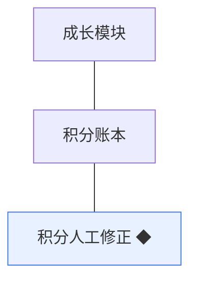

**组说明**：积分人工修正为成长模块账本的新增变更路径（使用方：站长）——此前的余额变更只经行为入账与悬赏出账（0.3 交付），本版补齐人工纠偏出口；修正属契约类写操作，原因必填、留痕可追溯（04C-成长模块 3.4）。

本表功能行与下游需求条目一一同构：一条需求＝一项功能，名称、用途与验收标准由下游逐字转记、不压缩不改写。

| 功能 | 用途 | 验收标准 |
|---|---|---|
| 积分人工修正 ◆ | 异常账目修正，原因必填、留痕可追溯（D4） | 站长对某会员的积分账户填写非零修正数值与原因后提交，余额按数值调整且不为负，生成一条含原因与操作人的修正流水，必要时等级按新余额重判；修正后会员与经营方在流水查询中均能查到该条修正记录 |

## 5. 业务对象

**对象关系总览**：本版新上线浏览量对象（挂接话题与问题的查看行为），并为既有积分账户与积分流水新增人工修正路径、为会员等级新增重判触发点；修正的操作人留痕关联管理端账号。

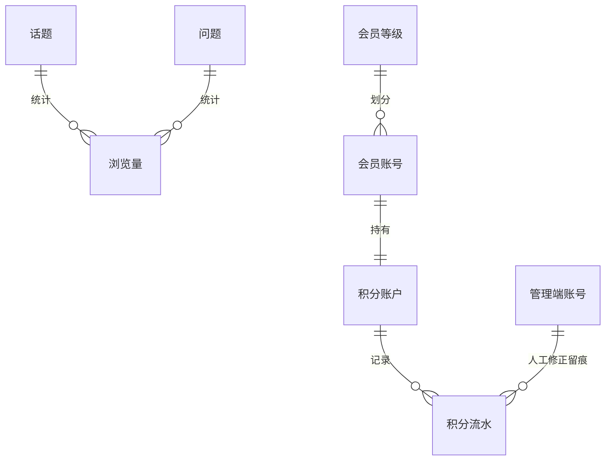

本版涉及五个对象：浏览量为新上线，积分账户、积分流水、会员等级为沿用扩展；话题与问题仅作为浏览量的统计对象被引用，其既有行为不变。

### 5.1 浏览量

**定位一句话**：内容被查看次数的统计记录，经营方判断内容热度的基础数据。

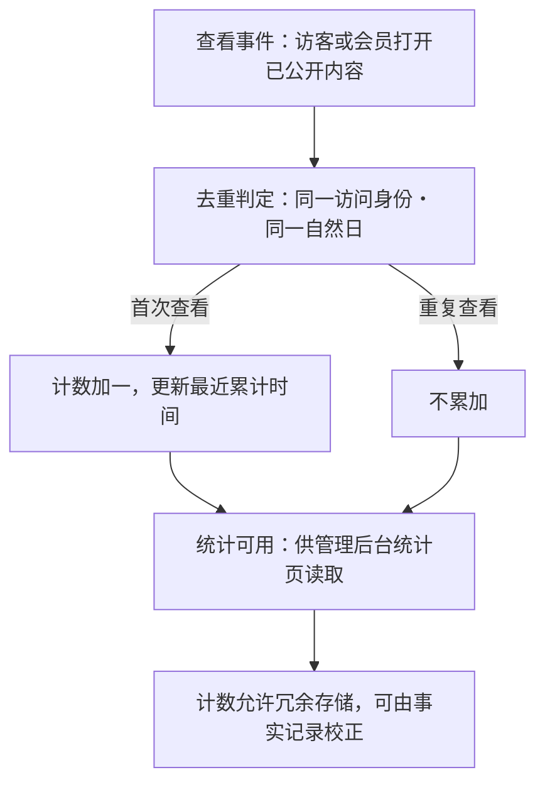

**说明**：本版上线、记录型对象，无状态流转（04C-运营与设置模块 4）；统计对象为话题与问题，沿用项目 PRD 对象关系。去重口径本版定案（路线图指明的唯一归属时点）：同一访问身份对同一内容的查看在同一自然日内只计一次，访问身份＝登录者按会员账号、未登录访客按站点会话标识；内容作者查看自己的内容不去除（推断·行业惯例从简：浏览量仅作参考数据且允许与事实存在小幅差异，不为参考数据引入作者判定）。累计失败不阻断内容展示；计数不参与内容可见性与排序的强判定（04C-运营与设置模块 3.5）。

### 5.2 积分账户

**定位一句话**：会员积分余额的账本，与会员账号一一对应（沿用 0.3，本版新增人工修正路径）。

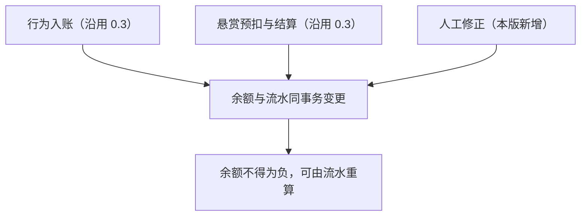

**说明**：账本沿用 0.3 上线形态；本版新增人工修正变更路径——此前余额只经行为入账与悬赏出账变更，本版补齐站长纠偏入口。修正后余额不得为负（04C-成长模块 3.4）；余额与流水同事务、余额可由流水重算的口径沿用（开发规范·事务与一致性）。

### 5.3 积分流水

**定位一句话**：积分每一次增减的记录，说明来源与去向（沿用 0.3，本版新增来源类型）。

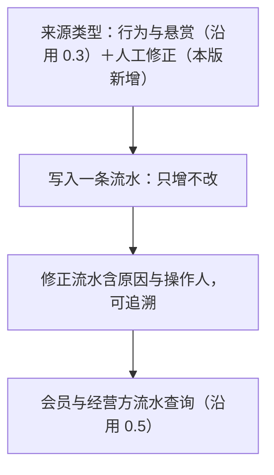

**说明**：流水沿用 0.3 上线形态，只增不改；本版新增来源类型取值「人工修正」，修正流水与自动流水同表记录、以来源类型区分（04C-成长模块 3.4）；冲正以反向流水表达的口径沿用（开发规范·变动类数据留流水），本版不涉冲正场景。

### 5.4 会员等级

**定位一句话**：会员成长的分层，由积分判定、不人工指定（沿用 0.3，本版新增重判触发）。

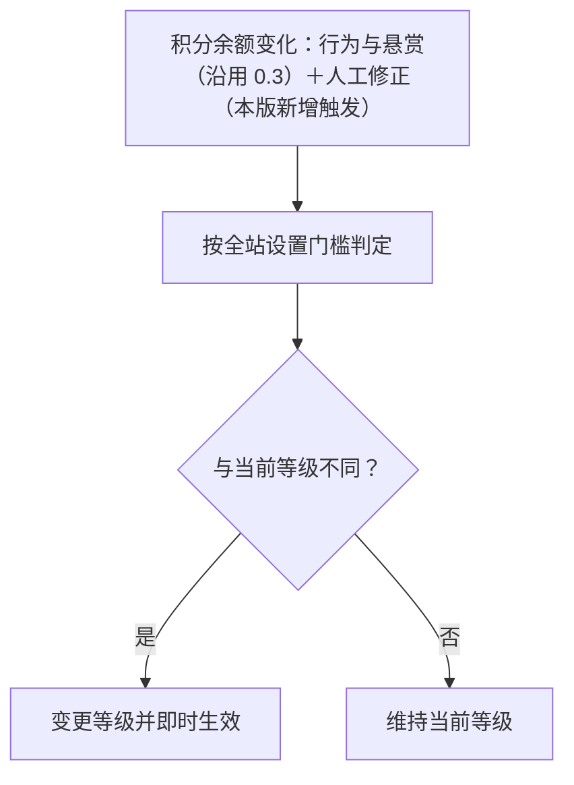

**说明**：等级判定与变更机制沿用 0.3，等级由积分判定、不人工指定（04C-成长模块）；本版仅新增触发点——人工修正后按新余额重判，判定结果不同则即时变更。等级变更不单独发通知提醒的口径沿用（0.3 拍板）；五档门槛与等级权益配置沿用全站设置既有键，本版不新增配置项。
