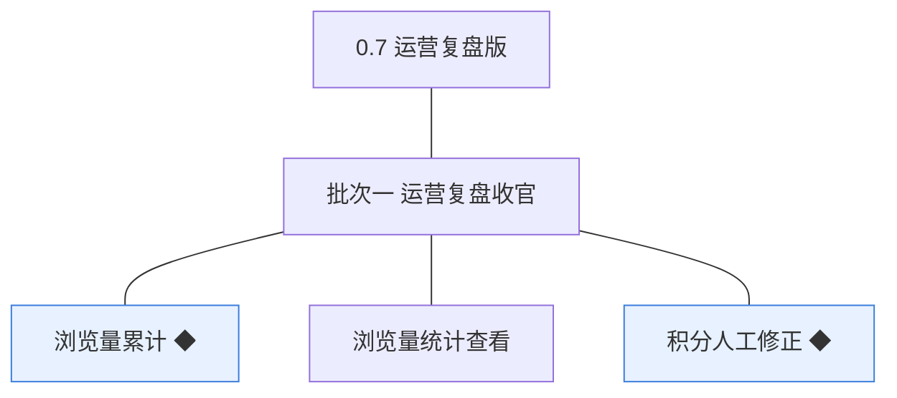
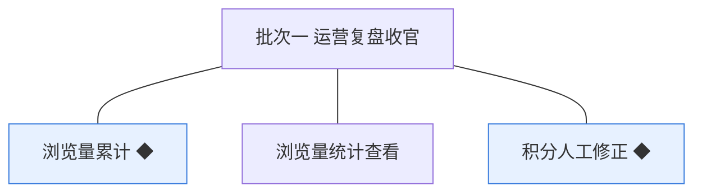

# 开发顺序与需求拆解（大版本）：0.7 运营复盘版

> 定位：把《PRD（大版本）0.7 运营复盘版》转换为开发批次顺序＋功能级需求条目，本文即 0.7 运营复盘版的完整需求清单（不另生成版本快照），需求池据此直接入池；上游为模拟案例材料，模拟性质予以保留。

## 1. 拆解说明

- **做什么**：把《PRD（大版本）0.7 运营复盘版》的 3 项功能按依赖排成 1 个可独立验收的开发批次，每项功能转为一条可直接认领与验收的需求条目（R108～R110，编号承接此前的 R1～R107）。
- **一一同构口径**：一条需求＝一项 PRD 功能，需求名即 PRD 功能名（含 ◆ 标注），用途与验收标准逐字引自 PRD 功能清单、不压缩不改写；按钮、字段与跳转级的原子拆解归小版本开发，不进本文。
- **与需求池及小版本规划的关系**：本文是需求池的批量入池主入口但不是唯一入口——会议、沟通、临时反馈产生的需求可不经本文直接单条入池（M 编号）；小版本规划的输入＝本文开发顺序＋需求池实时状态两者合并，批次划分是建议而非锁定，实际认领以需求池为准。

## 2. 开发顺序

**前置版本沿用面**：0.2 与 0.3 的内容与积分基础（已公开内容的详情呈现、积分账户与流水、等级判定）、0.6 的运营内容维护与内容查询维护（复盘动作承接）、0.5 的流水查询（修正记录查询面）。

**开发批次总图**：

**批次推进链**：

**顺序依据与同事务契约**：浏览量线内——统计查看依赖累计产生的数据，批内开发序为先累计后查看；浏览量累计挂接话题与问答的内容详情路径（内容模块按标识调用累计契约，04C-运营与设置模块对外契约），累计与内容展示解耦、失败不阻断（04C-运营与设置模块 3.5）；积分人工修正与浏览量线无相互依赖，可并行开发。本版内需要共同成立的契约：人工修正的余额调整与修正流水同一事务（04C-成长模块 3.4）、修正不得把余额改为负（04C-成长模块）；无外部联调点。

### 2.1 批次一：运营复盘收官

批次分支图（摘自总图、同名同构）：

- **目标**：交付本版全部三件事——浏览量从累计到统计查看的完整链路、积分人工修正的纠偏出口。
- **依赖**：前置版本 0.2、0.3、0.6；批内开发序建议浏览量累计先行（R108）→ 统计查看收口（R109），积分人工修正（R110）并行推进、最后同批联调。
- **可验收形态**：可演示——访客查看一个已公开话题后，管理后台浏览量统计页该内容计数可见并可按内容类型与板块筛选、按累计浏览量降序排序；站长完成一次带原因的积分修正，流水两侧可查、余额与等级联动正确；版本完成标志两条路径一次走通。

条目与 PRD 4.1／4.2 节功能清单一一同构，用途与验收标准逐字引自原文。

| 编号 | 需求名 | 用途 | 验收标准 |
|---|---|---|---|
| R108 | 浏览量累计 ◆ | 内容被查看时累计浏览量，作为经营方判断内容热度的基础数据（D8） | 访客或会员打开一个已公开话题或问题的详情，该内容的浏览量加一；同一访问身份在同一自然日内再次打开同一内容不再累加；累计环节异常时内容详情仍正常展示 |
| R109 | 浏览量统计查看 | 查看内容热度，支撑运营调整（D8） | 站长或运营人员在管理后台浏览量统计页按内容类型（话题／问题）与板块筛选，列表按累计浏览量降序展示内容的累计浏览量与最近累计时间，可定位到具体内容 |
| R110 | 积分人工修正 ◆ | 异常账目修正，原因必填、留痕可追溯（D4） | 站长对某会员的积分账户填写非零修正数值与原因后提交，余额按数值调整且不为负，生成一条含原因与操作人的修正流水，必要时等级按新余额重判；修正后会员与经营方在流水查询中均能查到该条修正记录 |

**批次判断与边界取舍**：只拆一批——三条体量小且两主题（热度数据、账目纠偏）在版本完成标志中并列验收，浏览量线与积分线无相互依赖、可同批并行开发同批联调收口，拆成两批属为流程美观多拆（过度拆分）；无路径分批交付的条目，3 条均整条交付。

**版本级验收安排**：按 PRD 量化口径执行内部演练（两条完成标志路径 100% 走通：浏览量「查看 → 统计可见」、修正「发起 → 流水可查且等级联动」）；收官版本无灰度台阶，不占开发批次。

## 3. 条目与 PRD 对应核对

- **一一同构声明**：条目数＝PRD 功能数＝3（R108～R110 对应浏览量累计 ◆、浏览量统计查看、积分人工修正 ◆），逐行对应、无归并无拆分。
- **批次构成**：批次一 3 条（运营与设置模块浏览量族 2＋成长模块积分账本 1）。
- **◆ 复杂条目清点**：共 2 条——R108 浏览量累计、R110 积分人工修正，与 PRD 功能全景总图高亮一致；无过渡支撑条目。

## 4. 与需求池和小版本规划的衔接

- **入池路径**：本文 R108～R110 已按批量入池登记进《需求池》，编号沿用、批次随本文继承。
- **多入口口径**：本文为批量入池主入口但不是唯一入口——会议、沟通、临时反馈产生的需求不经本文直接单条入池（M 编号），两类条目并存互不覆盖。
- **小版本规划输入**：本文开发顺序＋需求池实时状态合并；简单场景直接采纳批次建议（单批即一个小版本），唯一硬约束是本文声明的依赖与同事务契约不回退（累计失败不阻断展示、修正与流水同事务、修正后余额不得为负）。
- **认领与细化原则**：认领时逐字携带本表用途与验收标准，开发级细化（交互、字段、边界——如浏览量落库字段与去重实现、修正入口的表单细节）归小版本 PRD，本文不预写。
