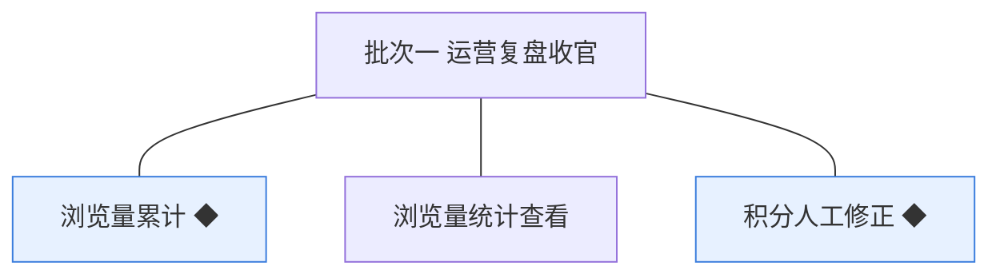
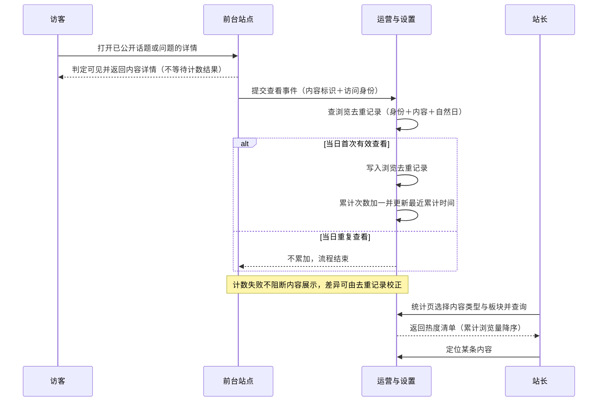
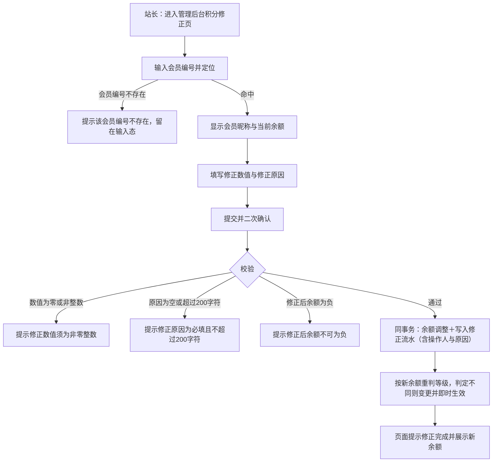
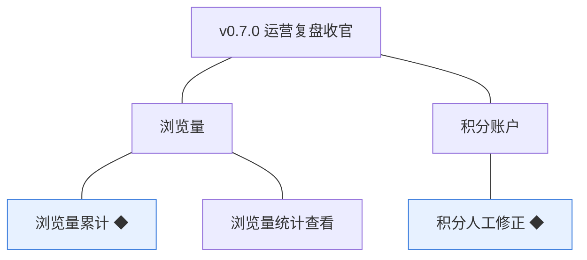
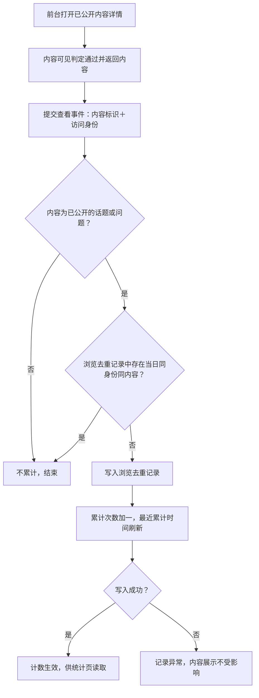
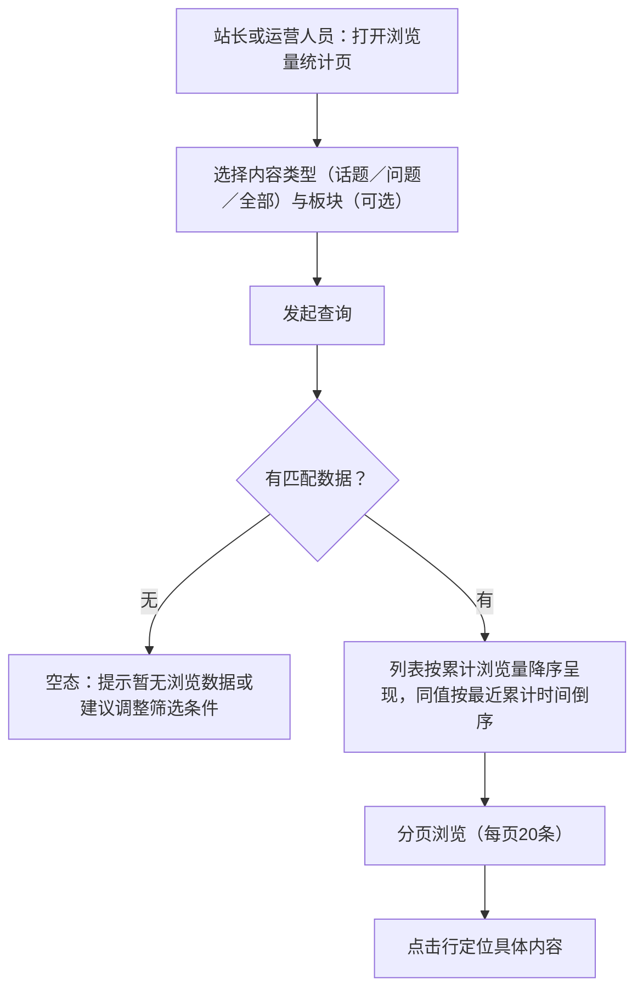

# PRD（小版本）：v0.7.0 运营复盘收官

> 定位：开发级需求说明书——承接《PRD（大版本）0.7 运营复盘版》与《开发顺序与需求拆解（大版本）0.7》，认领自需求池（R108～R110）；上游为模拟案例材料，模拟性质予以保留。

## 1. 版本概述

**承接与目标**：本版认领需求池 0.7 运营复盘版批次一（运营复盘收官）全部 3 条（R108～R110，简单场景采纳整批），把浏览量累计、浏览量统计查看、积分人工修正从功能级细化到开发级。可验收形态：访客查看一个已公开话题后，管理后台浏览量统计页该内容计数可见并可按内容类型与板块筛选、按累计浏览量降序排序；站长完成一次带原因的积分修正，流水两侧可查、余额与等级联动正确。来源状态标签口径：「沿用」＝上游已定案逐字承接；「本版定案」＝上游指明唯一归属时点、本版落地；「本版拍板·行业惯例默认」＝上游留白、按行业惯例定值。

**范围外声明**：前台内容详情页不展示浏览量数字（前台界面零变化，热度数据仅供管理后台复盘——统计报表与埋点体系未纳入，见路线图暂缓清单）；不交付去重口径的管理端开关（机制建议归模块设计）；积分人工修正不写入通知提醒（等级变更不单独发通知的 0.3 口径沿用，修正结果经流水查询体现）；会员与经营方流水查询界面随 v0.5.0 已交付，本版无新增。

**条目内顺序与依赖**：引用上游批内顺序——浏览量累计先行（R108）→ 统计查看收口（R109），积分人工修正（R110）并行推进、最后同批联调；不回退 02 声明的同事务契约（累计失败不阻断展示、修正与流水同事务、修正后余额不得为负）。

## 2. 需求范围与验收锚

**条目总览树**（与上游批次分支图同名同构）：

**认领条目表**（需求名／用途／验收标准逐字引自 0.7 版 02 批次需求表）：

| 编号 | 需求名 | 用途 | 验收标准 |
|---|---|---|---|
| R108 | 浏览量累计 ◆ | 内容被查看时累计浏览量，作为经营方判断内容热度的基础数据（D8） | 访客或会员打开一个已公开话题或问题的详情，该内容的浏览量加一；同一访问身份在同一自然日内再次打开同一内容不再累加；累计环节异常时内容详情仍正常展示 |
| R109 | 浏览量统计查看 | 查看内容热度，支撑运营调整（D8） | 站长或运营人员在管理后台浏览量统计页按内容类型（话题／问题）与板块筛选，列表按累计浏览量降序展示内容的累计浏览量与最近累计时间，可定位到具体内容 |
| R110 | 积分人工修正 ◆ | 异常账目修正，原因必填、留痕可追溯（D4） | 站长对某会员的积分账户填写非零修正数值与原因后提交，余额按数值调整且不为负，生成一条含原因与操作人的修正流水，必要时等级按新余额重判；修正后会员与经营方在流水查询中均能查到该条修正记录 |

**锚定说明**：三条条目的需求名、用途、验收标准逐字锚定上表；本文后续细化只加深行为描述，不与锚冲突、不收窄或放宽验收。

## 3. 核心用户旅程

**旅程承接说明**：本版认领覆盖大版本 PRD 两条旅程的全部认领段；「站长结合热度调整运营内容与规则」一环为 0.6 已交付能力、非本版认领条目，本版旅程到「统计页查看并定位内容」为止；前台侧内容详情页无界面变化，访客与会员的查看行为仅作为累计触发存在。

### 3.1 旅程一：浏览量——从查看到复盘（开发级）

访客或会员在前台打开已公开内容，系统在内容正常返回的同时完成去重判定与计数；站长或运营人员在管理后台筛选查看热度清单并定位内容。旅程跨用户主体与经营主体、前台与管理后台。

操作步骤清单：

1. 访客或会员在前台打开一个已公开话题或问题的详情页，页面正常返回内容。
2. 系统以「访问身份＋内容＋自然日」为键查浏览去重记录：登录者身份取会员账号、未登录访客取站点会话标识。
3. 当日首次有效查看：写入一条浏览去重记录，该内容的累计次数加一、最近累计时间刷新为当前时间；计数过程在内容返回之后进行，失败不影响展示。
4. 当日重复查看：不写入、不累加。
5. 站长或运营人员在管理后台打开浏览量统计页，选择内容类型（话题／问题／全部）与板块（可选），发起查询。
6. 列表按累计浏览量降序展示内容标题、内容类型、所属板块、累计浏览量与最近累计时间，同值按最近累计时间倒序排列，每页 20 条。
7. 定位具体内容：点击列表行进入该内容的查看定位，供复盘决策使用。

### 3.2 旅程二：积分人工修正——异常账目纠偏（开发级）

站长在管理后台定位目标会员、填写修正数值与原因、确认提交；系统同事务调整余额并写入修正流水，必要时重判等级；会员与经营方在既有流水查询中回溯该次修正。单端单主体操作流。

操作步骤清单：

1. 站长在管理后台进入积分修正页，输入目标会员的会员编号并定位。
2. 命中后页面显示该会员的昵称与当前积分余额；未命中提示「该会员编号不存在」并留在输入态。
3. 填写修正数值（非零整数，正值入账、负值出账）与修正原因（必填，≤200 字符）。
4. 提交并二次确认（确认弹窗回显会员、数值与修正后余额预览）。
5. 校验通过后，余额调整与修正流水在同一事务内完成；任一校验不过则拒绝并给出对应提示，表单保留已填内容。
6. 系统按新余额重判会员等级，判定结果与当前等级不同则即时变更（不发通知）。
7. 页面提示修正完成并展示新余额；该条修正流水（来源类型＝人工修正，含操作人与原因）随后在会员侧与经营方流水查询中均可见（流水查询随 v0.5.0 交付）。

## 4. 功能需求

**功能总览**：

对象归组树（版本→对象→条目）：

对象增删改查矩阵：

| 对象 | 增 | 改 | 删 | 查 |
|---|---|---|---|---|
| 浏览量 | R108（有效查看写入累计） | 不做（记录型只增不减） | 不做（浏览量随内容存在，无删除语义） | R109（统计查看） |
| 浏览去重记录 | R108（当日首次有效查看写入） | 不做（判定事实不改写） | 不做（保留作事实依据与校正来源） | 不做（仅供系统判定与校正，无查询面） |
| 积分账户 | 不做（开立随 v0.3.0 注册链路） | R110（人工修正调整余额） | 不做（账户随会员账号存续） | 不做（余额经流水查询间接可见，随 v0.5.0） |
| 积分流水 | R110（修正流水写入） | 不做（只增不改，上游契约） | 不做（只增不改） | 随 v0.5.0（流水查询已交付，本版条目沿用其呈现） |

主体使用面：

| 主体 | 使用条目 | 说明 |
|---|---|---|
| 系统 | R108 | 机制条目：无人工触发面，由内容被查看事件触发 |
| 站长 | R109、R110 | 管理后台操作面 |
| 运营人员 | R109 | 管理后台操作面 |
| 访客、会员 | 无直接操作面 | 查看行为触发 R108；前台界面零变化 |

### 4.1 R108 浏览量累计 ◆

**功能说明**：把每次有效查看沉淀为内容的累计浏览量，作为经营方判断内容热度的基础数据。触发：系统在访客或会员于前台打开已公开话题或问题详情、内容正常返回之后执行，无人工操作入口。

**交互与流程**：无用户交互界面（机制条目）；系统链路如下。

操作步骤清单（系统视角）：

1. 前台请求内容详情，内容模块完成可见性判定并返回内容（沿用既有链路）。
2. 系统提交查看事件，携带内容类型、内容标识与访问身份（登录者取会员账号标识、未登录访客取站点会话标识）。
3. 校验统计对象：仅已公开状态的话题与问题累计；其余内容（待审核、已驳回、已删除，或评论与答案等非统计对象）不累计。
4. 以「访问身份＋内容＋自然日」为键查浏览去重记录：已存在则结束；不存在则写入一条去重记录并随后累加。
5. 累计次数加一、最近累计时间刷新；该环节失败时仅记录异常，内容展示与后续访问不受影响。

**字段与校验**：

| 信息项 | 必填 | 业务类型 | 落库字段名 | 约束与取值 |
|---|---|---|---|---|
| 内容类型 | 是 | 枚举 | content_type | 取值：话题／问题（沿用审核记录 content_type 取值口径） |
| 内容标识 | 是 | 外键标识 | content_id | 与内容类型联合定位唯一内容 |
| 访问身份·会员 | 条件 | 外键标识 | member_id | 登录查看者填写；与访客标识二选一 |
| 访问身份·访客 | 条件 | 会话标识 | visitor_key | 未登录查看者的站点会话标识（机制态，实现形态由开发阶段定）；与会员标识二选一 |
| 查看日期 | 是 | 日期 | view_date | 自然日（按站点时区取当日）；与访问身份及内容联合构成去重键 |
| 累计次数 | 是 | 计数 | view_count | 非负整数，只增不减，可由去重记录重算校正 |
| 最近累计时间 | 是 | 时间 | last_view_at | 最近一次有效查看时间 |

**规则与边界**：

1. 去重口径（本版定案，承接大版本 PRD）：同一访问身份对同一内容的查看在同一自然日内只计一次；访问身份＝登录者按会员账号、未登录访客按站点会话标识。
2. 内容作者查看自己的内容不去除（沿用大版本 PRD 拍板：浏览量仅作参考数据且允许小幅差异，不为参考数据引入作者判定）。
3. 累计对象仅「查看时已公开」的话题与问题；内容此后被删除则不再产生新计数，既有计数保留在库、不在统计页呈现（呈现口径见 R109 规则 2）。
4. 浏览量不参与内容可见性与排序的强判定（04C-运营与设置模块）。
5. 计数为冗余存储值，允许与去重事实记录存在小幅差异，可由去重记录校正（开发规范·全局数据共识）。
6. 浏览量对象展开为两张表：view_count 存每内容累计值（一行一内容）、view_dedup 存有效查看事实（一行一次有效查看），后者是前者的校正依据。

**异常与拦截**：

| 异常场景 | 系统行为 | 用户感知 |
|---|---|---|
| 内容非已公开状态或非统计对象 | 不提交计数，链路结束 | 无（该内容本就对查看者不可见或非详情载体） |
| 当日重复查看 | 命中去重记录，不累加 | 无 |
| 计数写入失败 | 记录异常，不重试阻断 | 内容详情正常展示；计数差异留待由去重记录校正 |
| 访问身份缺失（既无登录态也无会话标识） | 视为无法判定的查看，不累计（本版拍板·从简：宁少计不多计，与「允许小幅差异」一致） | 无 |

### 4.2 R109 浏览量统计查看

**功能说明**：在管理后台按内容类型与板块查看内容热度清单，支撑运营调整。触发：站长或运营人员在管理后台打开浏览量统计页并查询。

**交互与流程**：

操作步骤清单：

1. 站长或运营人员在管理后台进入浏览量统计页（入口受能力点判定控制，沿用既有鉴权上下文）。
2. 选择内容类型：话题／问题／全部（默认全部）；选择板块：可选项（默认全部板块）。
3. 发起查询；无匹配数据时呈现空态（区分「全站暂无浏览数据」与「当前筛选无结果」两种文案）。
4. 有数据时列表按累计浏览量降序展示五列：内容标题、内容类型、所属板块、累计浏览量、最近累计时间；同值按最近累计时间倒序，每页 20 条。
5. 点击列表行定位到该内容（进入该内容的查看定位），支撑复盘决策。

**字段与校验**：

| 信息项 | 必填 | 业务类型 | 落库字段名 | 约束与取值 |
|---|---|---|---|---|
| 内容类型筛选 | 否 | 枚举 | —（查询条件，不落库） | 话题／问题／全部，默认全部 |
| 板块筛选 | 否 | 外键标识 | —（查询条件，不落库） | 板块列表单选＋全部，默认全部 |
| 内容标题 | 是 | 文本 | （内容方字段，随内容读取） | 列表展示列 |
| 内容类型 | 是 | 枚举 | content_type | 列表展示列，取值话题／问题 |
| 所属板块 | 是 | 文本 | （板块方字段，随内容读取） | 列表展示列 |
| 累计浏览量 | 是 | 计数 | view_count | 列表展示列；排序键（降序） |
| 最近累计时间 | 是 | 时间 | last_view_at | 列表展示列；同值次级排序键（倒序） |

**规则与边界**：

1. 列表仅呈现当前已公开状态的话题与问题（待审核、已驳回内容无浏览；已删除内容从列表移除，历史计数保留在库不呈现——本版拍板：统计页服务于复盘定位，只列可定位的现存内容）。
2. 排序固定为累计浏览量降序，同值按最近累计时间倒序（本版拍板·呈现口径）；不提供按标题或其他列的自定义排序。
3. 每页 20 条分页（本版拍板·行业惯例默认）。
4. 统计页为只读界面，不提供任何写操作（增删改均不在本条与矩阵「不做」列）。
5. 查询范围全站内容，无时间区间筛选（时间趋势分析未纳入，见路线图暂缓清单）。

**异常与拦截**：

| 异常场景 | 系统行为 | 用户感知 |
|---|---|---|
| 全站无任何浏览数据 | 返回空列表 | 空态文案「暂无浏览数据」＋一句引导（内容被查看后自动累计） |
| 筛选条件无匹配结果 | 返回空列表 | 空态文案「当前筛选条件下暂无结果，可调整筛选」 |
| 非站长且非运营人员角色访问 | 能力点判定不通过 | 不显示统计页入口；直接访问被拒绝（沿用能力点判定口径） |

### 4.3 R110 积分人工修正 ◆

**功能说明**：对异常积分账目执行人工修正，余额调整与修正流水同事务留痕可追溯。触发：站长在管理后台积分修正页发起并提交。

**交互与流程**：见 3.2 旅程二流程图与操作步骤清单（同一条链路，不重复）。

**字段与校验**：

| 信息项 | 必填 | 业务类型 | 落库字段名 | 约束与取值 |
|---|---|---|---|---|
| 会员编号 | 是 | 对外编号 | member_no（定位用，落库关联 member_id） | 须命中存在的会员账号；已注销与封号账号可被修正（账目纠偏不限于状态，本版拍板） |
| 修正数值 | 是 | 整数 | amount（流水数值，正整数；方向落 direction） | 非零整数；正值＝收入、负值＝支出（方向随数值，术语表 0.7 立项口径）；不设上限（上游未定上限，不新增） |
| 修正原因 | 是 | 文本 | adjust_reason | ≤200 字符（本版拍板·行业惯例默认）；写入修正流水，会员与经营方流水查询可见 |
| 修正操作人 | 是 | 外键标识 | admin_id | 取当前登录的站长（管理端账号），系统自动记录，非表单项 |
| 修正后余额 | — | 派生值 | balance（随账户读取） | 提交前预览展示；须 ≥0 方可提交 |

**规则与边界**：

1. 修正后余额不得为负，违反即拒绝（04C-成长模块 3.4）。
2. 余额调整与修正流水写入同一事务，不出现半完成状态（04C-成长模块 3.4；技术文档·积分结算用事务保证同源口径）。
3. 修正流水与自动流水同表记录，以来源类型＝人工修正区分（04C-成长模块 3.4）；流水携带操作人 admin_id 与原因 adjust_reason，不携带业务关联对象（修正的解释由原因承载，related 两字段为空——本版拍板）。
4. 修正提交前二次确认，确认弹窗回显目标会员、修正数值与修正后余额预览（本版拍板·防误操作）。
5. 修正后即时按新余额重判会员等级，判定不同则变更并即时生效；等级变更与修正均不写入通知提醒（沿用 0.3 口径，结果经流水与等级展示体现）。
6. 修正为有意的人工动作，不做服务端幂等去重（同数值同原因可再次提交——二次确认为防误操作手段，非幂等键；本版拍板）。
7. 修正入口仅站长可见可用（能力点判定沿用），运营人员与版主无此入口。

**异常与拦截**：

| 异常场景 | 系统行为 | 用户感知 |
|---|---|---|
| 会员编号未命中 | 拒绝定位 | 提示「该会员编号不存在」，留在输入态 |
| 修正数值为零或非整数 | 校验拒绝 | 提示「修正数值须为非零整数」，表单保留已填内容 |
| 修正原因为空或超过 200 字符 | 校验拒绝 | 提示「修正原因为必填且不超过 200 字符」 |
| 修正后余额为负 | 校验拒绝 | 提示「修正后余额不可为负」 |
| 同事务写入失败 | 事务回滚，余额与流水均不变 | 提示「修正未完成，请重试」；不产生部分写入 |
| 非站长角色访问 | 能力点判定不通过 | 不显示积分修正入口；直接访问被拒绝 |

## 5. 业务对象与数据字段

**数据主体清单**：

| 业务对象 | 落库名 | 定位与关系 |
|---|---|---|
| 浏览量 | view_count（累计表）＋view_dedup（去重记录表） | 一对象两表：view_count 一行一内容存累计值与最近累计时间，供统计页读取；view_dedup 一行一次有效查看，为去重判定与累计校正的事实依据 |
| 积分账户 | point_account | 会员积分余额账本，与会员账号一一对应（沿用 v0.3.0）；本版新增人工修正变更路径 |
| 积分流水 | point_transaction | 只增不改的变动记录（沿用 v0.3.0）；本版新增来源类型人工修正及操作人、原因两字段 |
| 会员账号 | member_account | 沿用；本版作为修正目标（member_no 定位）与浏览访问身份引用 |
| 会员等级 | —（不独立建表，current_level 字段承载，v0.3.0 口径） | 沿用；修正后按门槛重判 |

**逐对象字段表**：

浏览量·累计表（view_count，本版新建）：

| 字段 | 必填 | 业务类型 | 落库字段名 | 约束与取值 |
|---|---|---|---|---|
| 内容类型 | 是 | 枚举 | content_type | 话题／问题 |
| 内容标识 | 是 | 外键标识 | content_id | 与内容类型联合定位唯一内容（联合唯一） |
| 累计次数 | 是 | 计数 | view_count | 非负整数，初始 0，只增不减 |
| 最近累计时间 | 是 | 时间 | last_view_at | 首次有效查看时建立 |

浏览量·去重记录表（view_dedup，本版新建）：

| 字段 | 必填 | 业务类型 | 落库字段名 | 约束与取值 |
|---|---|---|---|---|
| 内容类型 | 是 | 枚举 | content_type | 话题／问题 |
| 内容标识 | 是 | 外键标识 | content_id | 与内容类型联合定位内容 |
| 会员标识 | 条件 | 外键标识 | member_id | 登录查看者填写，与访客标识二选一 |
| 访客标识 | 条件 | 会话标识 | visitor_key | 未登录查看者的站点会话标识（机制态，实现形态由开发阶段定），与会员标识二选一 |
| 查看日期 | 是 | 日期 | view_date | 自然日；访问身份＋内容＋查看日期联合构成去重键（联合唯一） |

积分流水（point_transaction，沿用表，本版新增两字段）：

| 字段 | 必填 | 业务类型 | 落库字段名 | 约束与取值 |
|---|---|---|---|---|
| 修正操作人 | 条件 | 外键标识 | admin_id | 仅来源类型＝人工修正的流水填写（管理端账号外键），其余流水为空 |
| 修正原因 | 条件 | 文本 | adjust_reason | 仅人工修正流水填写；必填 ≤200 字符；会员与经营方流水查询可见 |
| （既有字段） | — | — | account_id／source_type／direction／amount／related_type／related_id | 沿用 v0.3.0 登记；本版 source_type 新增取值人工修正，人工修正流水 related 两字段为空 |

积分账户（point_account，沿用表，无新增字段）：

| 字段 | 必填 | 业务类型 | 落库字段名 | 约束与取值 |
|---|---|---|---|---|
| （既有字段） | — | — | balance | 沿用 v0.3.0（非负整数，初始 0）；本版经人工修正路径变更，变更后仍须 ≥0 |

会员账号、会员等级：纯沿用（member_no 定位、current_level 等级承载与五档取值见术语表既有登记），本版无新增字段。

## 6. 待议与建议

**本版采用的推断与默认值汇总**：

| 采用值 | 来源状态 | 影响 |
|---|---|---|
| 去重口径＝同一访问身份同一自然日只计一次；身份＝会员账号／访客会话标识 | 本版定案（大版本 PRD 0.7 落地，路线图唯一归属时点） | 计数口径与统计页数值判定 |
| 作者自看不去除；身份缺失不累计（宁少计不多计） | 沿用大版本 PRD 拍板／本版拍板·从简 | 浏览量允许小幅差异 |
| 统计列表仅呈现已公开内容；同值按最近累计时间倒序；每页 20 条 | 本版拍板·呈现口径／行业惯例默认 | 统计页列表与空态判定 |
| 修正原因 ≤200 字符；提交二次确认；修正流水 related 为空、不设服务端幂等；已注销与封号账号可被修正 | 本版拍板·行业惯例默认 | R110 表单与流水落库 |
| 修正与等级变更不写通知提醒 | 沿用 0.3 口径 | 会员感知路径＝流水查询 |

**待确认内容与影响**：无（本版无遗留待议口径）。

**建议回池的新想法**：无。

**术语表待登记行**（随本版认领合入术语表）：§3 新增对象「浏览去重记录｜view_dedup」；§7 新增浏览量字段行（content_type／content_id／view_count／last_view_at）、浏览去重记录字段行（content_type／content_id／member_id／visitor_key／view_date）、积分流水增补行（admin_id／adjust_reason）。
