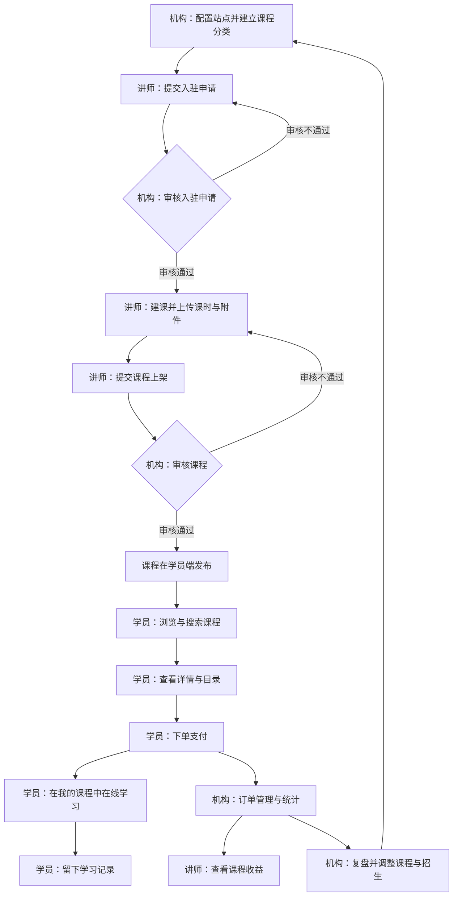
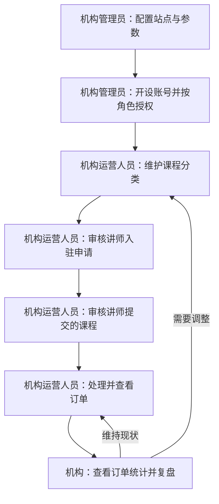
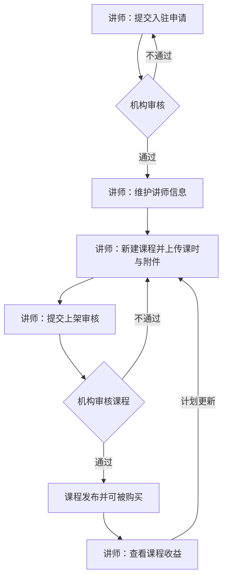
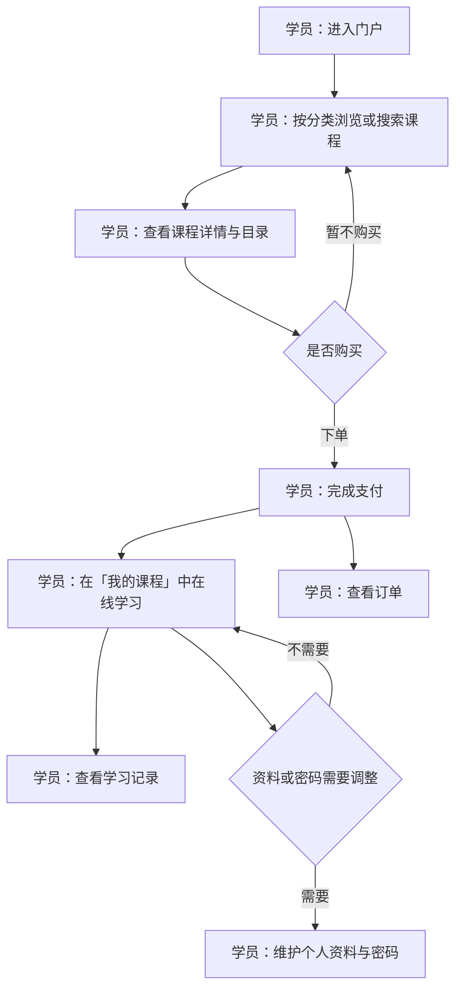

# 项目概念：领课教育

> 本文是「领课教育」的项目概念基线：说清项目做什么、为什么做、由哪些主体与角色参与、各自需要什么能力、怎样协同把事做成；供项目成员对齐方向，并作为后续项目 PRD 的输入。上游为模拟案例材料，模拟性质在全篇保留；概念判断的决策状态随文标注（已确认／建议默认／推断／待议／期望）。

## 1. 项目是什么

领课教育是一套自建自营的在线教育系统。机构用它把课程搬到线上经营：讲师在平台上开课，学员在门户里选课、买课、在线学习；讲师入驻与课程审核、下单支付、学习记录、订单与收益、经营复盘，原本散在线下与聊天工具里的环节，收进同一套系统。

产品由三个端构成（已确认，来自输入的范围与偏好）：
- **学员端（门户）**：访客与学员浏览、搜索课程，查看课程详情（讲师介绍、课程介绍、目录）；登录后下单支付、在线播放学习、查看学习记录与订单、维护个人资料与密码。
- **讲师端（讲师工作台）**：讲师申请入驻、维护讲师信息、管理自己的课程（新增／修改／提交审核）、查看课程收益。
- **机构端（PC 网页管理后台）**：机构的运营管理人员配置站点与参数、审核讲师入驻与课程、维护课程分类、管理订单与统计、安排账号权限与登录控制。

核心主体与定位（建议默认，依据输入的角色列举推导）：**机构**是经营主体，对经营结果负责；**讲师**是课程供给方，通过入驻成为平台授课方并按课程收益结算；**学员**是用户主体，是产品最终服务的使用方。

方向上补充两点（建议默认）：课程以**点播**（录播视频＋配套附件资料）为主要交付形态；课程视频与资料**支持对接多家服务商**，便于按需替换。

本质范围（已确认）：单个机构自建自营，不做多租户；本期不做直播课、在线考试与题库、任务打卡与积分证书、社区问答与博文，不做原生 App 与小程序，学员端以网页（含手机浏览器）为主要使用形态。

## 2. 为什么要做

| # | 主要困境（背景，来自输入） | 现有做法造成的阻碍与代价 | 对应解决思路 |
|---|---|---|---|
| 1 | 机构和讲师想开线上课 | 自研一套系统成本高、周期长，开课计划被拖住 | 用现成的在线教育系统把开课链路一次配齐：站点、课程、下单支付、学习与订单都在一套系统内（期望） |
| 2 | 课程视频与资料缺统一的存放与播放方式 | 资料散落在网盘、聊天工具和本地，学员找不到、机构管不住 | 课程视频与附件统一在课程下管理；视频与资料支持对接多家服务商，机构可按需替换（建议默认） |
| 3 | 报名、交费、学习和记录散在线下 | 报名靠人工登记、交费靠转账，人和进度跟不住，讲师与机构对不上账 | 讲师入驻、建课审核、下单支付、学习记录、订单与收益串成一条链，各角色在自己的端上看自己的那一份（期望） |
| 4 | 课卖得怎么样、谁在学，没有数据可看 | 招生与课程调整只能凭感觉 | 机构端提供订单管理与统计，用于复盘课程与招生节奏（期望） |

以上困境来自输入材料，属背景陈述；「对应解决思路」是概念层面的解法判断，效果状态为期望，待实现后验证。

## 3. 参与主体与角色

主体划分说明（建议默认）：本项目按**三主体**组织——用户主体是**学员**（产品最终服务的使用方）；经营主体是**机构**（对经营结果负责，承担决策、组织与账号权限安排）；**讲师**既不是机构内部岗位、也不是课程买家，而是独立的课程供给方，因此单列为供给主体（裁决依据：输入明确要求讲师独立成端并有「入驻—建课—收益」的独立目标，若并入机构会丢失其独立目标与审核关系）。机构内部的日常业务执行（审核、订单处理、内容维护）按职责模板落在机构下的角色上，不单设主体。

| 主体 | 定位 | 包含角色 | 主要责任 | 典型场景 |
|---|---|---|---|---|
| 机构 | 经营主体，对经营结果负责 | 机构管理员；机构运营人员 | 决策与配置、审核把关、经营复盘；日常业务执行与内容维护 | 开通并配置站点、审核讲师与课程、处理订单、看统计定下一步 |
| 讲师 | 课程供给方 | 讲师 | 提供并维护课程、按审核意见修改、关注课程收益 | 申请入驻、建课上传课时与附件、提交上架、查看收益 |
| 学员 | 用户主体（含未登录访客） | 学员 | 选课、买课、学课并管理自己的学习记录与订单 | 浏览搜索课程、看详情与目录、下单支付、在线学习、查订单 |

角色划分说明（建议默认）：机构下的两个角色依据输入中机构端「多角色权限」的要求与「运营管理人员」的职责列举拆分——**机构管理员**承担决策与配置（站点与参数、账号与权限、经营数据）；**机构运营人员**承担日常执行（分类与内容、讲师与课程审核、订单处理与统计）。一人可持多个角色；`待议`：若实际运营只有一个岗位，可合并为「机构运营管理员」一个角色，不影响能力清单。

## 4. 做成以后有什么用

- **机构**：不必自研即可开课（期望）；站点、课程、订单、账号权限在一个后台里管，日常执行有抓手（期望）；讲师与课程按「先审后发」把关，内容质量可控（建议默认）；订单与统计集中呈现，复盘有据可依（期望）。
- **讲师**：入驻与建课线上化，不必逐个线下沟通（期望）；课程、课时与附件的维护有统一入口，改课不必重发资料（期望）；收益在讲师端可见，与课程销售对得上（期望）。
- **学员**：找课有分类与搜索、下单支付到学习记录在同一条链路上完成（期望）；已购课程集中在「我的课程」，学习进度与订单随时可查（期望）；资料与课程视频集中可看，不再依赖外部工具（期望）。

## 5. 各主体与角色需要哪些能力

**机构 → 机构管理员**
- 账号与权限管理：开设机构端账号、按角色授权、停用账号，控制谁能进后台、能做什么。
- 站点与第三方参数配置：维护站点基础信息与对外对接参数，使门户按机构自己的名义对外呈现。
- 登录控制：同一账号同一时间只允许在一处登录，避免账号共享带来的经营与安全风险。
- 经营数据查看：查看订单统计，用于课程与招生决策。

**机构 → 机构运营人员**
- 讲师入驻审核：查看讲师入驻申请并作出通过或不通过的处置。
- 课程审核：查看讲师提交的课程并作出通过或不通过的处置，通过后方可在学员端发布。
- 分类管理：维护课程分类，使学员端可按分类浏览与检索。
- 订单管理与统计：查看订单列表与统计结果，掌握售卖情况。
- 内容与站点日常维护：在站点配置范围内维护对外的呈现内容（`待议`：首页推荐位等运营位是否单独设能力，见备忘）。

**讲师 → 讲师**
- 入驻申请：提交成为平台讲师的申请，等待机构审核。
- 讲师信息维护：维护讲师介绍等对外展示信息，供学员端课程详情呈现。
- 课程管理：新建与修改课程、维护课时与附件资料、提交上架审核；按审核意见修改后再次提交。
- 收益查看：查看自己课程的收益。

**学员 → 学员**
- 账号与登录：注册、登录，作为下单与学习记录归属的前提（推断，由「我的课程、学习记录、订单查询」推导）。
- 首页与推荐位浏览：从站点首页直达推荐课程与站点导航。
- 分类与搜索：按分类浏览或按关键词搜索课程。
- 课程详情：查看讲师介绍、课程介绍与课程目录，决定是否购买。
- 下单支付：对选中的课程下单并完成支付。
- 在线播放与我的课程：在「我的课程」中播放已购课程学习。
- 学习记录：查看自己的学习记录与进度。
- 订单查询：查看自己的订单。
- 资料与密码：维护个人资料、修改密码。

## 6. 各主体与角色怎样开展工作

三个角色的工作在「课程」与「订单」两处交接，形成一条从开课到复盘的闭环。

**机构的工作**：先做业务准备——配置站点与参数、建立课程分类、把账号与角色分给运营人员；随后进入日常循环——审核讲师入驻与课程上架、处理并查看订单、看统计结果；依据统计复盘，调整分类、课程范围与招生节奏，回到站点与内容配置，形成持续循环。审核是机构的把关动作：不通过的申请与课程回到讲师处修改后重新提交。

**讲师的工作**：以「入驻—建课—送审—收益」为主线。先提交入驻申请，通过后维护讲师信息；再新建课程、上传课时与附件资料并提交上架审核；审核不通过时按意见修改后重新提交，通过后课程在学员端发布；课程售出后，在讲师端查看课程收益，并据此决定是否继续更新课程内容。

**学员的工作**：从门户进入，按分类或搜索找到课程，看详情（讲师介绍、课程介绍、目录）后下单支付；已购课程进入「我的课程」，在此在线播放学习并留下学习记录；需要时查看自己的订单，并维护个人资料与密码。

---

## 讨论备忘

1. **站点运营位的维护入口（待议）**：输入只写了机构端「站点与第三方参数配置」，未说明首页推荐位、轮播等运营内容由谁维护。当前按「在站点配置范围内维护」处理，属推断；若需要独立的运营位管理，机构端能力需增补，会影响机构端的功能划分。
2. **支付与收益结算（待议）**：输入要求学员端「下单支付」、讲师端「收益」与机构端「订单管理与统计」，但未明确由系统直接对接支付渠道，也未明确讲师收益是自动结算还是线下结算。当前概念上只保证「订单与收益各角色可见」。此项影响订单与结算相关能力的边界。
3. **视频与资料的服务商范围（待议）**：输入要求「可对接多家服务商，方便替换」，未指明具体服务商与是否保留本地上传兜底。不改变概念方向，留给后续细化。
4. **学员账号的注册与登录方式（待议）**：手机号、邮箱或第三方登录未明确；本概念只按「需要账号承载学习记录与订单」处理。
5. **已确认不做项**：直播课、在线考试与题库、任务打卡与积分证书、社区问答与博文、原生 App 与小程序、多租户；若后续要引入，属改变本质范围的决策，需回到本层重新评审。
