# 产品需求文档（PRD）：领课教育

> 本文是「领课教育」的项目级产品需求总纲：跨版本稳定的产品全景，用于立项汇报与整体讲解，供产品路线图选范围、大版本规划细化、技术设计与 UI 设计承接；功能的详细规则、界面交互、数据字段与指标口径由版本级文档逐步细化，本文不预写。上游为模拟案例材料，模拟性质全篇保留；推断与建议默认就地标注，并汇总到文末备忘。

## 1. 产品概述

### 1.1 背景与目标

**现状问题（来自模拟案例材料，背景）**

1. 想开线上课的机构与讲师自研系统成本高、周期长，开课计划被拖住。
2. 课程视频与资料没有统一的存放与播放方式，散落在网盘、聊天工具与本地。
3. 报名、交费、学习与学习记录散在线下，人和进度跟不住，讲师与机构对不上账。
4. 课程卖得怎么样、谁在学，没有数据可看，招生与课程调整只能凭感觉。

**产品目标**

用一套自建自营的在线教育系统，把机构开课到学员学习的链路收进同一个系统（期望）：机构不必自研即可开课并经营自己的站点；讲师有统一的入驻、建课与收益入口；学员在一条链路上完成找课、买课、学课，学习记录与订单随时可查；机构以「先审后发」把住内容质量，以订单统计支撑复盘。

**成功标准（上游未提供量化标准，按目标推导定性表达；量化口径留版本级）**

- 机构：站点可配置完成、讲师与课程可审核发布、订单与统计可查（建议默认：以「一条完整链路走通」为达标，不设数值）。
- 讲师：入驻到课程上线可在系统内闭环完成，收益可查（建议默认）。
- 学员：从进入门户到完成学习有连续路径，已购课程、学习记录与订单可随时查看（建议默认）。

### 1.2 产品定位与形态

**一句话定义**：领课教育是一套单机构自建自营、以点播课程为核心交付形态的在线教育系统，由学员端、讲师端、机构端三个端组成。

**形态构成与商业模式**

| 端 | 使用者 | 载体与形态 | 职责 |
|---|---|---|---|
| 学员端 | 学员（含未登录访客） | 网页（桌面浏览器为主，手机浏览器可用） | 浏览、搜索与购买课程，在线播放学习，查看学习记录与订单，维护个人资料 |
| 讲师端 | 讲师 | 网页工作台 | 入驻申请、维护讲师信息与课程、提交上架审核、查看课程收益 |
| 机构端 | 机构的运营管理人员 | PC 网页管理后台 | 站点与参数配置、账号与权限、讲师与课程审核、分类管理、订单管理与统计 |

**商业模式与边界**：单机构自建自营，机构自行经营自己的课程与学员，不做多租户（已确认）；三端均为网页形态，本期不做原生 App 与小程序（已确认）。`待议`：支付渠道的对接方式与讲师收益的结算方式（见备忘）。

## 2. 参与主体与角色

### 2.1 主体划分

主体划分承接《概念文档（项目）》的三主体划分（建议默认）。

| 主体 | 所属端 | 定位 | 包含角色 |
|---|---|---|---|
| 机构 | 机构端 | 经营主体，对经营结果负责，承担决策、组织与账号权限安排 | 机构管理员、机构运营人员 |
| 讲师 | 讲师端 | 课程供给方，通过入驻成为平台授课方 | 讲师 |
| 学员 | 学员端 | 用户主体，产品最终服务的使用方 | 学员 |

### 2.2 各主体的角色特征与典型场景

- **机构管理员**（机构端）：对经营结果与系统配置负责。典型场景：初次开通站点，配置站点信息与对接参数；为运营人员开设账号并授予角色；出问题或人员变动时停用账号；查看经营数据判断课程与招生方向。
- **机构运营人员**（机构端）：承担日常业务执行。典型场景：维护课程分类；处理讲师入驻申请与课程上架审核；处理并查看订单；查看订单统计。
- **讲师**（讲师端）：以课程为中心开展工作。典型场景：提交入驻申请；维护讲师信息；新建课程、上传课时与附件资料、提交上架审核，按审核意见修改后重新提交；查看课程收益。
- **学员**（学员端）：以选课与学习为中心。典型场景：从门户首页或分类、搜索找到课程，看详情与目录后下单支付；在「我的课程」在线学习并查看学习记录；查看订单，维护个人资料与密码。

### 2.3 共性的工作方式

- 角色是职责模板，一人可持多个角色（建议默认）：机构只有一个运营岗位时，可由同一人同时持有机构管理员与机构运营人员两个角色（`待议`，见备忘）。
- 讲师与学员同处对外侧，但分属两个端与两套身份：讲师通过入驻获得讲师身份，用讲师端开展授课与收益事务；学员在学员端完成学习事务（见决策 D5）。
- 机构的把关动作统一为审核：讲师入驻与课程上架均需机构审核通过后才生效（见决策 D4）。

## 3. 功能全景

功能全景按「主体 → 角色」组织。每个角色的能力都落在自己的端上；每个直接使用系统的主体都有自己的自助管理面（学员与讲师为个人中心，机构内部人员为个人设置与账号权限）。

### 3.1 机构 → 机构管理员（机构端）

| 能力 | 用途 |
|---|---|
| 机构端账号开通 | 为机构内部人员开设机构端账号，作为进入后台的前提 |
| 角色授权 | 给账号授予机构管理员、机构运营人员等角色，决定其在后台的权限范围 |
| 账号停用 | 停用离职或异常账号，收回其后台访问能力 |
| 站点与第三方参数配置 | 维护站点基础信息与对外对接参数，使门户以机构自己的名义对外呈现 |
| 登录控制 | 限制同一账号同一时间仅在一处登录，降低账号共享带来的经营与安全风险 |
| 经营数据查看 | 查看订单统计结果，作为课程与招生决策依据 |
| 个人设置 | 维护自身账号资料与登录凭据，使内部人员能自助管理自己的账号 |

### 3.2 机构 → 机构运营人员（机构端）

| 能力 | 用途 |
|---|---|
| 课程分类管理 | 维护课程分类，使学员端可按分类浏览与检索 |
| 讲师入驻审核 | 审阅讲师入驻申请并作出通过或不通过的处置，控制平台授课方范围 |
| 课程审核 | 审阅讲师提交的课程并作出通过或不通过的处置，通过后方可在学员端发布 |
| 订单管理 | 查看和处理课程订单，掌握成交情况 |
| 订单统计 | 查看订单统计结果，用于复盘课程与招生节奏 |
| 个人设置 | 维护自身账号资料与登录凭据 |

### 3.3 讲师 → 讲师（讲师端）

| 能力 | 用途 |
|---|---|
| 讲师登录 | 进入讲师工作台的前提 |
| 入驻申请 | 提交成为平台讲师的申请，等待机构审核 |
| 讲师信息维护 | 维护讲师介绍等对外展示信息，供学员端课程详情呈现 |
| 课程新建与修改 | 创建与调整自己的课程，形成课程的基本信息 |
| 课时与附件维护 | 上传与维护课程课时与配套附件资料，形成可学习的内容 |
| 提交上架审核 | 把课程提交机构审核，作为发布上架的前提 |
| 收益查看 | 查看自己课程的收益，作为是否继续更新课程的依据 |
| 个人中心 | 维护自身账号资料与登录凭据 |

### 3.4 学员 → 学员（学员端）

| 能力 | 用途 |
|---|---|
| 注册与登录 | 建立学员身份，承载订单与学习记录 |
| 个人资料维护 | 维护自己的账号资料 |
| 密码修改 | 自助更新登录凭据 |
| 退出登录 | 结束当前会话，保护账号 |
| 首页浏览 | 从站点首页的推荐位与导航直达内容 |
| 分类浏览 | 按课程分类逐层浏览课程 |
| 课程搜索 | 按关键词检索课程 |
| 课程详情查看 | 查看讲师介绍、课程介绍与课程目录，作为购买判断依据 |
| 下单支付 | 对选中的课程下单并完成支付 |
| 订单查询 | 查看自己的订单 |
| 我的课程 | 集中查看已购课程，作为学习的入口 |
| 在线播放学习 | 播放已购课程的课时进行学习 |
| 学习记录查看 | 查看自己的学习记录，掌握学习进度 |

## 4. 核心业务闭环

### 4.1 闭环总览

五条闭环按「先建站与授权 → 再引入讲师与课程 → 学员买课 → 学员学习 → 订单与收益复盘」衔接，最终回到机构的站点与内容调整，形成循环。

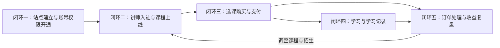

### 4.2 闭环一：站点建立与账号权限开通（机构内部）

机构在开门营业前把自己那一侧准备好：配置站点、建立课程分类、开出账号并授予角色。

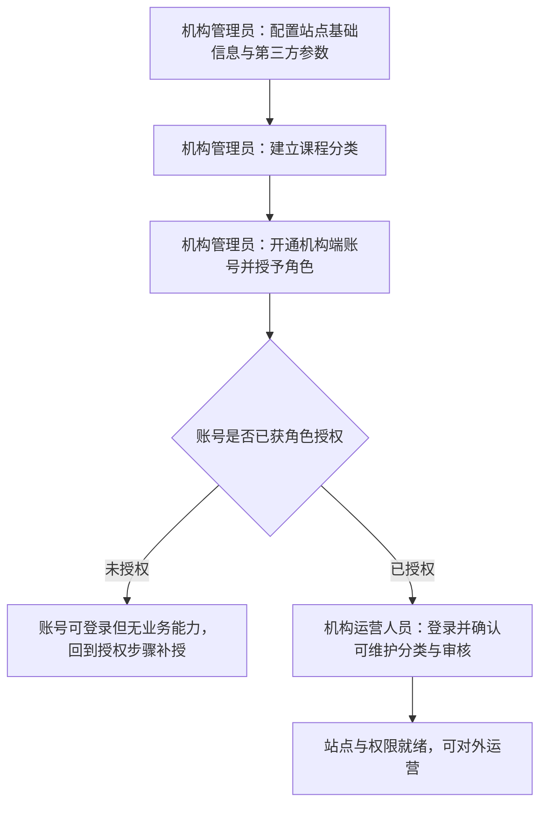

这段流程的起点是机构管理员的配置动作：先把站点对外信息与对接参数配好，再建立课程分类作为课程组织骨架，然后为运营人员开通账号并授予角色；账号生效后运营人员按角色获得能力并登录确认。结束于「站点与权限就绪」——此时可以开始引入讲师与课程。全局性异常：若角色未授予，账号可登录但无可操作能力，需回到授权步骤补授。

### 4.3 闭环二：讲师入驻与课程上线（跨主体）

讲师从入驻到课程发布，机构在两次审核上把关。

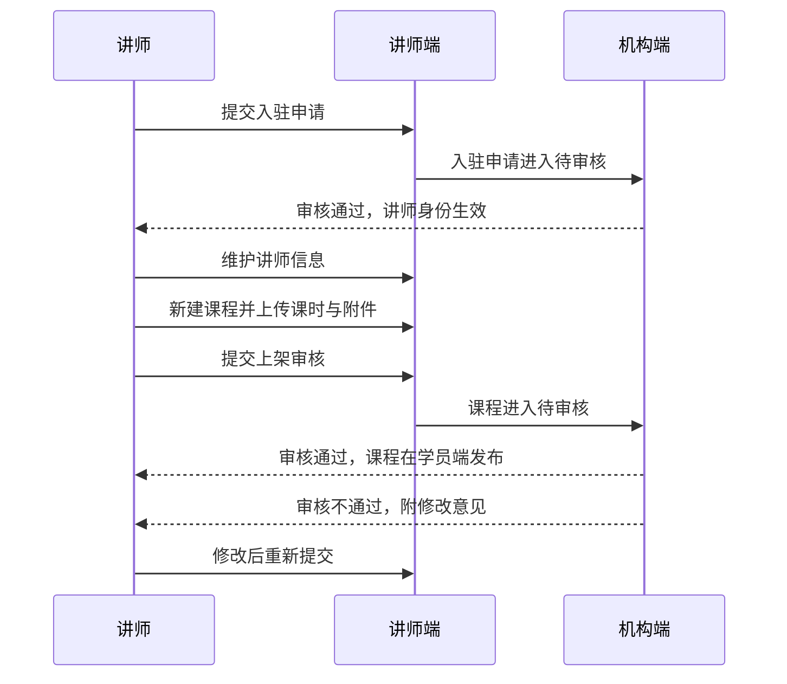

起点是讲师提交入驻申请，机构审核通过后讲师身份才生效；讲师随后维护对外信息、建课并上传课时与附件，提交上架审核；机构审核通过后课程在学员端发布。结束于课程发布。全局性异常：入驻审核不通过则回到申请；课程审核不通过则退回讲师修改后重新提交，两次审核不通过都不产生发布结果。

### 4.4 闭环三：选课购买与支付（跨端）

学员从门户进入，完成从找课到支付的交接。

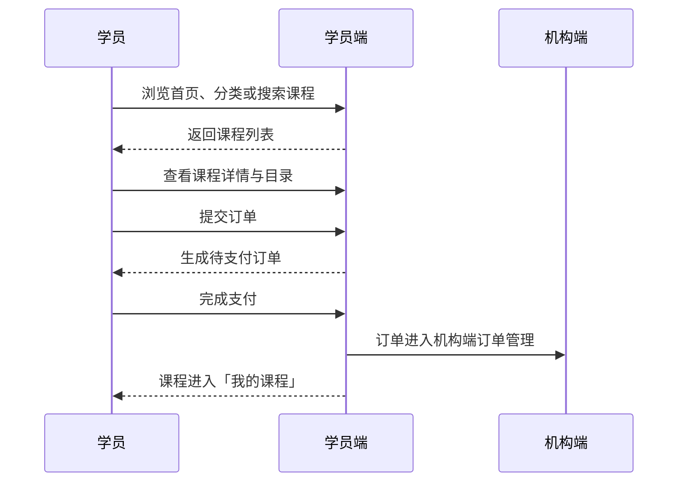

起点是学员在学员端找课，通过首页、分类或搜索到达课程详情，看过讲师介绍、课程介绍与目录后提交订单；支付完成后订单汇入机构端，课程进入学员的「我的课程」。结束于课程可学习、订单可查。全局性异常：未完成支付的订单停留在待支付状态，学员可继续支付或取消；取消后不进入「我的课程」。

### 4.5 闭环四：学习与学习记录（学员，循环型）

学员围绕已购课程反复学习，学习记录随之累积。

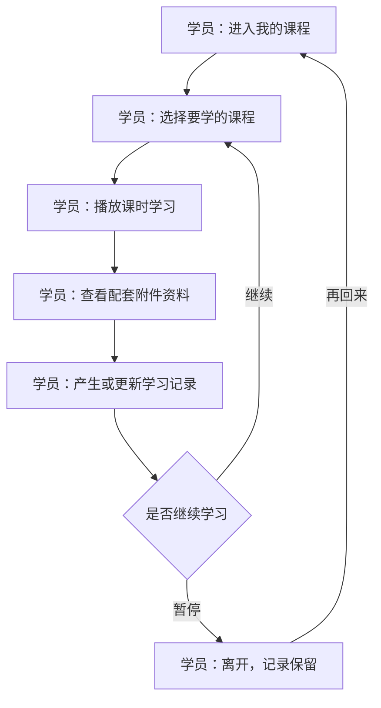

起点是学员进入「我的课程」，选定课程后播放课时学习、查看配套附件资料，学习行为被记为学习记录；学员可随时暂停或继续，暂停后记录保留，下次回到「我的课程」继续。结束：该闭环是循环型，没有终态，以学员不再学习为止。

### 4.6 闭环五：订单处理与收益复盘（跨主体）

订单支付后分两路：机构看订单与统计，讲师看自己课程的收益，机构据此复盘。

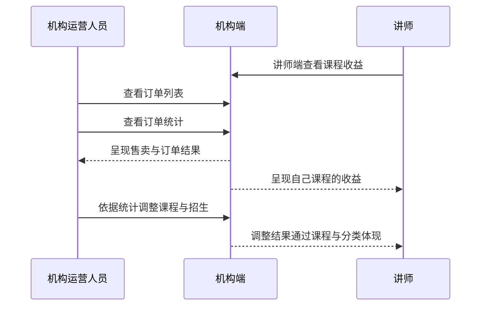

起点是订单在支付后汇入机构端；机构运营人员查看订单列表与统计，讲师在自己一端查看课程收益；机构依据统计复盘，调整课程范围、分类与招生节奏。结束于调整动作回到课程与分类——即回到闭环二的起点。全局性异常：讲师收益以课程成交为准，若订单发生取消或其他变化，收益随之变化（`待议`：退款与售后未纳入本期范围，见备忘）。

## 5. 核心业务对象

### 5.1 对象关系总览

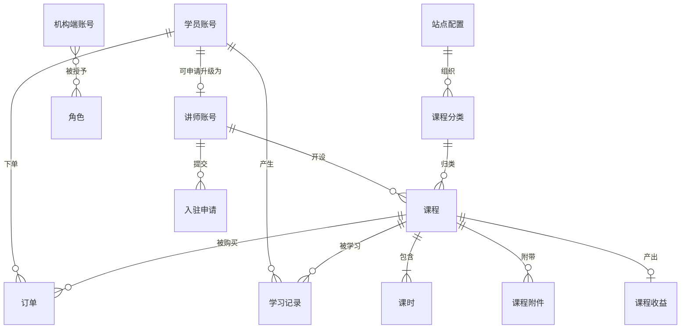

对象清单：学员账号、讲师账号、机构端账号、角色、入驻申请、站点配置、课程分类、课程、课时、课程附件、订单、学习记录、课程收益。

### 5.2 学员账号

**一句话定位**：学员在学员端的身份，承载其登录凭据、个人资料、订单与学习记录（主体身份类的自助管理对象，个人资料与登录凭据的维护入口都在这里）。

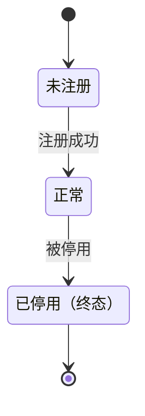

`待议`：注册与登录的具体方式（手机号／邮箱等）未明确，见备忘；停用由机构侧处置，属推断。

### 5.3 讲师账号

**一句话定位**：讲师在讲师端的身份，承载其登录凭据、讲师信息与被授权开设的课程；由学员账号通过入驻审核后产生。

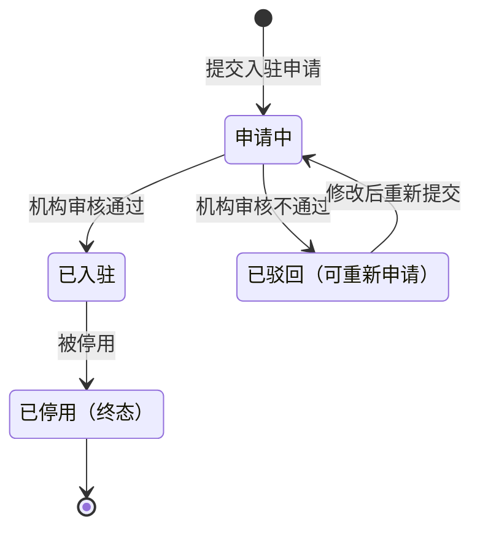

### 5.4 机构端账号

**一句话定位**：机构内部人员在机构端的身份，承载其登录凭据与所持角色；由机构管理员开通。

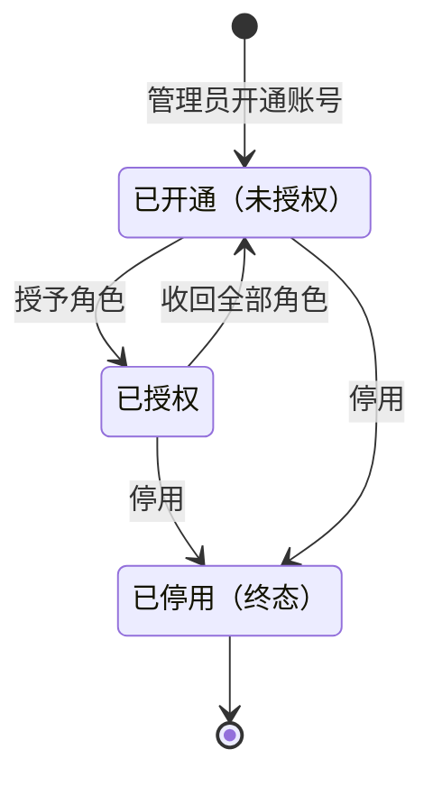

### 5.5 角色

**一句话定位**：机构端的能力授权单元，是职责模板而非某个人；一人可持多角色，账号通过角色获得能力。

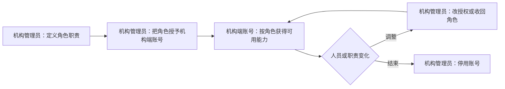

### 5.6 入驻申请

**一句话定位**：讲师提交的入驻请求及其审核结论，是讲师身份的来源凭据。

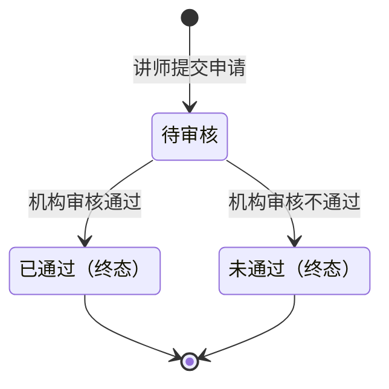

审核结论一经作出即为终态；未通过后如需再申请，属新的一次申请。

### 5.7 站点配置

**一句话定位**：机构对站点对外呈现与对接参数的设置集合，是学员端内容呈现与外部对接的依据。

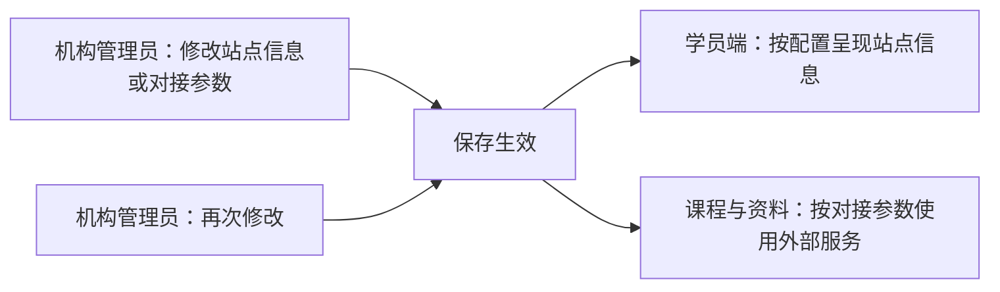

`待议`：首页推荐位等运营内容是否纳入本对象的维护范围，见备忘。

### 5.8 课程分类

**一句话定位**：课程的组织骨架，决定学员端按分类浏览的层级与课程归属。

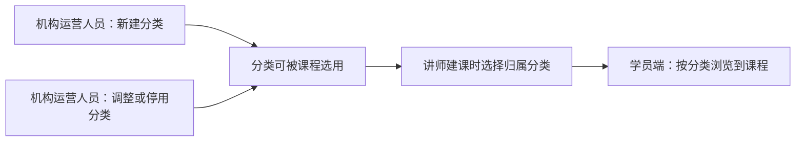

### 5.9 课程

**一句话定位**：可被购买与学习的教学单元，由讲师创建、机构审核后发布，是讲师、机构与学员三方衔接的核心对象。

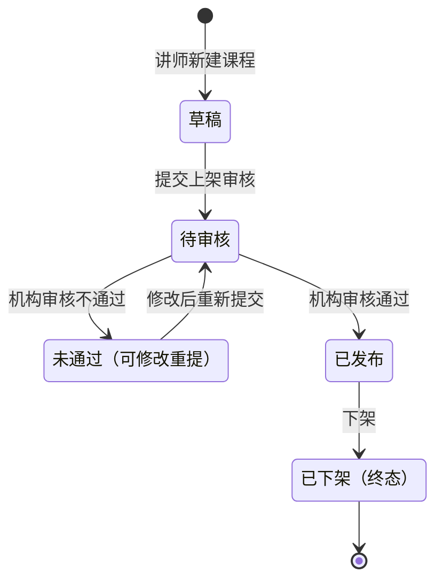

已发布课程可继续修改为新的草稿并再次送审（`待议`：已发布课程的修改是否需重新审核，见备忘）。

### 5.10 课时

**一句话定位**：课程内的学习单元（视频课时），学员按课时播放学习，是课程交付的主要内容载体。

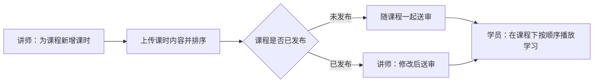

### 5.11 课程附件

**一句话定位**：课程配套的资料文件，学员在课程下查看或下载，与课时一起构成课程内容。

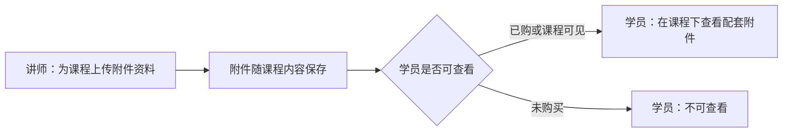

### 5.12 订单

**一句话定位**：学员购买课程的成交凭据，记录课程、学员与支付结果，是收益与统计的数据来源。

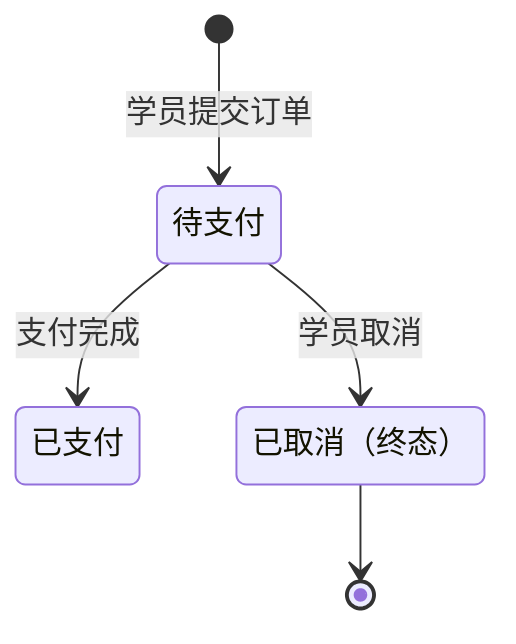

`待议`：退款与售后未纳入本期范围，见备忘；已支付订单的后续处置在版本级细化。

### 5.13 学习记录

**一句话定位**：学员与课程之间学习行为的记录，反映学习进度，供学员自查；无状态流转，随学习行为持续更新。

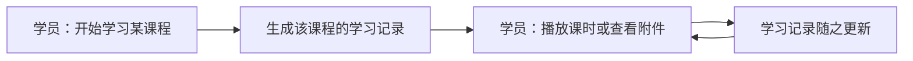

### 5.14 课程收益

**一句话定位**：某门课程带来的收益结果，由该课程的有效订单驱动，供讲师查看；无自身状态，随订单变动。

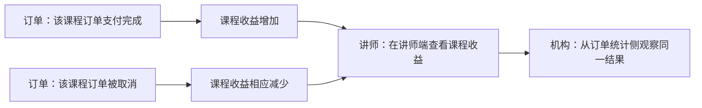

## 6. 关键设计决策

以下决策是跨版本有效的产品规则，各版本细化时必须遵守；冲突时以本节为准，各版本不重抄。

| 编号 | 决策 | 选择什么 | 为什么 |
|---|---|---|---|
| D1 | 产品形态 | 以网页交付三个端；学员端为门户网页（桌面为主、手机浏览器可用），讲师端为网页工作台，机构端为 PC 网页管理后台；不做原生 App 与小程序 | 与输入的端范围一致；三端同构为网页，覆盖主要使用场景的同时收敛形态，避免多端并行的成本与一致性问题 |
| D2 | 经营模式与租户边界 | 单机构自建自营，不做多租户 | 机构经营自己的课程与学员，不做平台化撮合；多租户会改变主体结构与权限模型，属本质范围变化 |
| D3 | 内容交付形态 | 以点播为核心：视频课时＋配套附件资料；不做直播课、在线考试与题库、任务打卡与积分证书、社区问答与博文 | 与输入的范围一致；点播可异步交付，不引入排课与实时资源 |
| D4 | 内容准入 | 讲师入驻与课程上架均「先审后发」，由机构审核把关 | 机构对经营结果与内容质量负责，审核是机构的责任落点；两条准入线保护平台内容 |
| D5 | 身份与账号 | 按端分账号：学员账号、讲师账号、机构端账号三套身份；讲师身份由学员账号提交入驻申请、经审核通过后产生 | 账号按所属端命名与授权，边界清晰；讲师与学员的职责与可见范围不同，分身份避免权限混淆，同时保留「同一个人先学后教」的路径 |
| D6 | 权限与登录控制 | 机构端按角色授权（账号→角色→能力），并限制同一账号同一时间仅在一处登录 | 机构内部按岗位分工，角色是职责模板、一人可多角色；登录控制降低账号共享风险 |
| D7 | 外部服务可替换 | 课程视频与资料支持对接多家服务商，机构可按需替换 | 避免资料与视频被单一服务商锁死，机构可随成本与稳定性要求更换 |
| D8 | 经营口径 | 订单与收益以订单支付时点为准；订单取消则相应收益不再计入 | 让机构与讲师看到同一套结果，避免各自口径不同导致对不上账 |

由 D4 确立的跨版本规则：任何课程在学员端可见之前，必须经过机构审核通过。由 D5 确立的跨版本规则：机构端账号不得在学员端或讲师端登录使用。由 D8 确立的跨版本规则：机构端统计与讲师端收益必须由订单数据同源推导，不得各算一套。

## 7. 备忘

以下为本文采用的推断、建议默认与待业务确认事项，供后续版本细化时优先澄清。

1. **站点运营位的维护范围（待议）**：输入的机构端能力只写了「站点与第三方参数配置」，未说明首页推荐位、轮播等内容由谁维护。本文按「在站点配置范围内维护」处理，属推断；若需独立运营位管理，机构端功能全景需增补。
2. **支付与收益结算方式（待议）**：输入要求下单支付、收益查看与订单统计，但未明确是否由系统直接对接支付渠道，也未明确讲师收益是自动结算还是线下结算。本文只保证「订单与收益各角色可见」；结算方式影响订单相关能力的边界。
3. **退款与售后（待议）**：输入未提及退款、售后与发票。本文的订单状态机只到「已支付」与「已取消」，未纳入退款；若业务需要，会影响订单对象的状态与机构端订单能力。
4. **学员注册与登录方式（待议）**：手机号、邮箱或第三方登录未明确。本文只按「需要账号承载订单与学习记录」处理。
5. **讲师与学员身份的关系（推断）**：本文按 D5 采用「学员账号提交入驻申请后获得讲师账号」。若业务上讲师不经过学员身份、由机构直接开设，则讲师账号的产生方式需改，影响闭环二与对象关系总览。
6. **角色可否合并（建议默认）**：机构只有一个运营岗位时，可由同一人同时持有机构管理员与机构运营人员两个角色；本文按两个角色描述能力，合并不影响功能全景的完整性。
7. **已发布课程的修改是否重新送审（待议）**：本文在课程对象中按「可修改后再次送审」描述；若已发布课程的修改无需审核，课程状态机需简化。
8. **量级与依赖假设**：本文不设容量与性能数值；系统对接的视频与存储服务商需机构自行具备账号与配置，属外部依赖。
