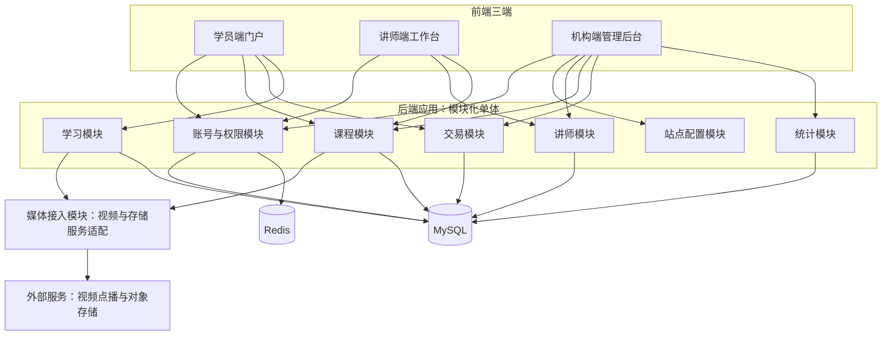
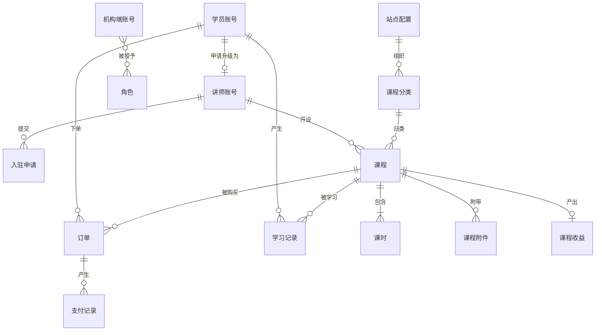

# 技术文档（项目）：领课教育

> 本文是「领课教育」的项目级技术基线：技术形态、技术栈、系统构成、概念数据模型与关键技术决策；定稿后各版本只细化不推翻。上游为模拟案例材料，模拟性质保留；无法从上游推出的技术前提按合理默认判断并就地标明，汇总于文末备忘。

## 1. 技术形态

| 项 | 选择 | 一句话理由 |
|---|---|---|
| 整体架构 | 前后端分离的**模块化单体** | 业务规模与团队规模都撑不起分布式方案，单体部署最简单，模块边界先划清，将来要拆也有依据 |
| 前端结构 | 三端三个前端应用：学员端门户、讲师端工作台、机构端管理后台，均为浏览器端单页应用 | 三端使用者与权限面各不相同，分开构建可让权限边界与发布节奏互不牵连 |
| 后端结构 | 一个后端应用，内部按业务域划分模块，模块间只经内部接口调用，不共用数据表 | 一个进程降低运维成本，模块纪律避免退化成"一张大泥球" |
| 数据访问 | 单库关系模型（一个数据库），模块各管自己的表 | 数据量级与一致性要求用不上分库分表，跨模块报表用查询而非多库拼装 |
| 外部服务 | 视频与文件存储经适配层接入，支持多家服务商 | PRD 要求视频与资料可替换服务商，适配层把替换成本限制在一处 |
| 部署形态 | 单机或单节点云服务器：后端应用＋数据库＋缓存＋对象存储（或服务商托管） | 与业务规模匹配，不引入容器编排与集群 |

前后端分离的理由：三端界面差异大，后端只出接口，前端各自迭代。不做微服务的理由：没有独立伸缩与多团队并行发布的实际需求，拆分会带来注册中心、配置中心、分布式事务等一整套运维负担。

## 2. 技术栈

| 分类 | 技术 | 一句话理由 |
|---|---|---|
| 后端语言与框架 | Java ＋ Spring Boot | 团队易招易接手，单体应用开发与部署最直接 |
| 数据访问 | MyBatis | 课程、订单、统计的查询形态以手写 SQL 为主，可控性优先 |
| 数据库 | MySQL | 关系模型承载账号、课程、订单与统计，成熟稳定 |
| 缓存与会话 | Redis | 承载登录会话与登录控制所需的会话占用标记，并缓解热点查询 |
| 前端框架 | Vue 3 ＋ TypeScript ＋ Vite | 三端界面同构，组件生态与学习成本可控 |
| 前端路由与状态 | Vue Router ＋ Pinia | 与 Vue 3 配套，够用 |
| 前端组件库 | Element Plus | 后台与工作台的表格、表单、审核类界面开箱可用，减少自研控件 |
| 接口风格 | REST ＋ JSON | 与三端分离结构匹配，无需引入额外协议 |
| 身份鉴权 | 基于令牌的登录态，机构端叠加角色校验 | 三端各自登录、按端隔离；机构端的能力由角色决定 |
| 文件与视频 | 对象存储 ＋ 视频点播服务，经适配层接入 | 视频不占应用服务器带宽与磁盘；适配层满足多家服务商可替换 |
| 部署与运行 | 应用打包为可执行服务，配单节点数据库与缓存 | 与部署形态一致，不引入编排平台 |

版本号不硬编：以团队当前稳定版本为准；版本冻结方式见开发规范（04A）第 2 节。

## 3. 系统构成

### 3.1 架构总览

### 3.2 模块划分

| 模块 | 一句话职责 |
|---|---|
| 账号与权限模块 | 三端账号的注册、登录、凭据维护与登录控制，以及机构端账号的角色授权 |
| 站点配置模块 | 站点对外信息与第三方对接参数的读取与修改 |
| 讲师模块 | 讲师入驻申请的提交与审核、讲师信息的维护 |
| 课程模块 | 课程分类、课程、课时与附件的维护，以及课程的提交审核、发布与下架 |
| 交易模块 | 下单、支付、订单状态与订单查询 |
| 学习模块 | 已购课程的取得、课时播放的鉴权与学习记录的更新 |
| 统计模块 | 面向机构的订单统计与面向讲师的课程收益呈现 |
| 媒体接入模块 | 把课时视频与课程附件对接到底层视频与存储服务，屏蔽服务商差异 |

模块边界说明：统计模块只读其他模块的数据并输出结果，不反过来驱动业务；媒体接入模块不含业务规则，只做服务商适配。

### 3.3 核心流程的数据流

学员下单：交易模块校验课程可售与学员身份，落订单为待支付；支付完成后订单转为已支付，并把成交结果写给课程模块与统计模块；学习模块据订单向学员开放该课程的学习资格，学员播放课时时由学习模块向媒体接入模块换取播放凭据，学习行为写回学习记录。讲师侧由统计模块按同一批订单数据计算课程收益，机构侧按同一批订单数据产出统计结果——两侧结果同源，避免对不上账。

## 4. 概念数据模型

| 实体 | 一句话定位 |
|---|---|
| 学员账号 | 学员端身份，承载凭据与个人资料 |
| 讲师账号 | 讲师端身份，承载凭据、讲师信息与所授课程 |
| 机构端账号 | 机构端身份，承载凭据与所持角色 |
| 角色 | 机构端能力授权单元，职责模板，一人可多角色 |
| 入驻申请 | 讲师入驻请求与审核结论 |
| 站点配置 | 站点对外信息与第三方参数的设置集合 |
| 课程分类 | 课程的组织骨架 |
| 课程 | 可被购买与学习的教学单元 |
| 课时 | 课程内的视频学习单元 |
| 课程附件 | 课程配套的资料文件 |
| 订单 | 课程购买的成交凭据 |
| 支付记录 | 订单支付过程与结果的记录（为对账与追溯所补的技术实体） |
| 学习记录 | 学员在某课程上的学习行为记录 |
| 课程收益 | 由课程有效订单驱动的收益结果；统计模块派生呈现，不单独建表（K7） |

## 5. 关键技术决策

1. **模块化单体，不用微服务**（K1）：选一个后端应用内划分模块——没有独立伸缩与多团队并行发布的需求；不选微服务，因为注册中心、配置中心与分布式事务的代价换不来本项目需要的收益。
2. **一个数据库、模块各管自己的表**（K2）：选单库关系模型——数据规模与一致性要求都在单库能力内；不选分库分表与多库拆分，因为没有数据量与隔离需求。
3. **三端三个前端应用**（K3）：选按端分应用——权限面与使用场景不同，分开构建使权限边界清晰、发布互不牵连；不选"一个应用按角色显示菜单"，因为学员端与机构端的使用场景差异过大，混在一起容易漏配权限。
4. **登录态放在服务端可控的会话存储**（K4）：选 Redis 承载会话与登录占用标记——机构端要求同一账号同一时间仅一处登录，需要服务端能主动使旧会话失效；不选纯前端令牌自持，因为做不到即时踢下线的登录控制。
5. **视频与资料经适配层接入外部服务商**（K5）：选适配层——PRD 要求可替换服务商，把差异收敛在一层；不选直接调用单一服务商 SDK，因为替换时会牵动课程与学习两条链路。
6. **机构端按角色授权**（K6）：选账号→角色→能力的授权模型——机构内部按岗位分工，角色可增可减；不选给账号逐个挂能力点，人多之后无法维护。
7. **统计与收益从订单同源推导**（K7）：选同一批订单数据出两侧结果；不选各自记账，因为会导致讲师与机构口径不一致。

**明确不采用的技术**

| 技术 | 一句话理由 |
|---|---|
| 微服务、注册中心与配置中心 | 无独立伸缩与多团队发布需求，运维成本不成比例 |
| 分布式事务框架 | 单库事务已能覆盖下单与支付的一致性要求 |
| 消息队列 | 当前无异步解耦与削峰场景，引入即增加排障面 |
| 多租户架构 | PRD 明确单机构自建自营，不做多租户 |
| 搜索引擎（如 Elasticsearch） | 课程量级下数据库检索足够，无全文检索需求 |
| 服务端渲染与静态站点生成 | PRD 未提出搜索引擎收录要求，单页应用足够 |
| 容器编排平台 | 单节点部署即可满足运行需要 |
| 直播、在线考试与题库相关组件 | PRD 明确不做，不得提前引入 |

## 6. PRD 决策的技术承接

| PRD 决策 | 技术对策 |
|---|---|
| D1 三端网页形态 | 三个浏览器端前端应用，后端只出 REST 接口；无原生客户端相关技术 |
| D2 单机构自建自营 | 数据结构中不含租户维度；单实例部署，一套配置 |
| D3 点播为主的内容交付 | 课时以视频形式对接点播服务；附件走对象存储；不引入直播推流与实时转码链路 |
| D4 讲师入驻与课程上架先审后发 | 讲师账号与课程均带状态机，未通过审核的状态不出现在学员端可见范围 |
| D5 三套身份、按端分账号 | 三类账号实体分表，登录态按端隔离；讲师账号由入驻申请通过后产生 |
| D6 机构端角色授权与登录控制 | 账号→角色→能力的授权模型；会话存于服务端可控存储，可即时失效旧会话 |
| D7 视频与资料可替换服务商 | 媒体接入模块以适配层封装服务商差异，业务模块只依赖适配接口 |
| D8 订单与收益以支付时点为准、两侧同源 | 支付结果落到订单与支付记录；统计与收益同以订单数据推导 |

## 7. 备忘

1. **团队技能假设（合理默认）**：按"熟悉 Java 与 Vue 的中小团队"选型；若团队实际以其他技术栈为主，第 2 节的框架选择需整体替换，模块划分与数据模型不受影响。
2. **部署环境假设（合理默认）**：按单节点云服务器或自有服务器部署，不假设已有容器平台与集群。
3. **规模量级假设（合理默认）**：按中小规模在线教育站点判断（课程与学员量级不构成数据库与检索瓶颈）；无真实依据的性能与容量数值不做规划。
4. **外部服务未定（待议）**：视频点播与对象存储的具体服务商未定，亲和性设计只做到适配层；机构需自行具备服务商账号与配置。
5. **支付渠道未定（待议）**：PRD 未明确支付渠道与结算方式，本文只保证支付结果在订单与支付记录中留痕，不设计结算逻辑。
6. **版本冻结**：技术栈不硬编版本号；具体版本以依赖锁文件为冻结处，冻结方式见开发规范（04A）第 2 节。
