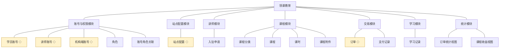
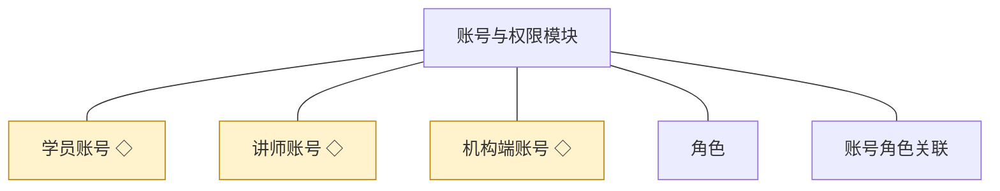
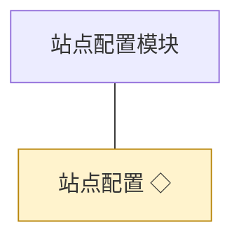
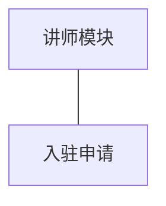
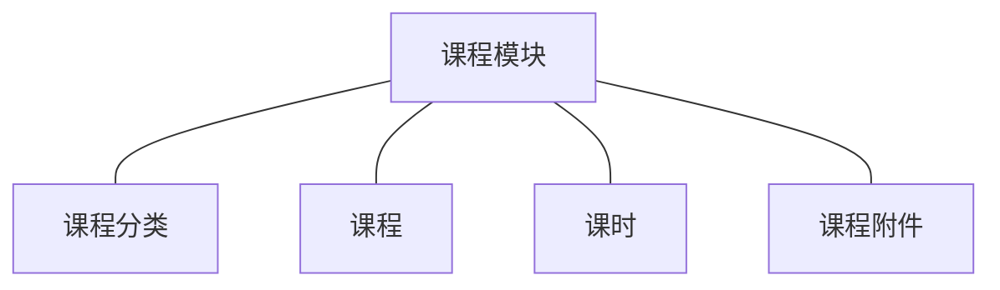
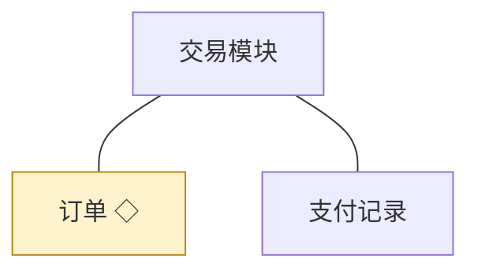
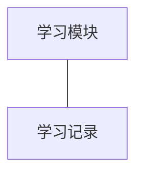
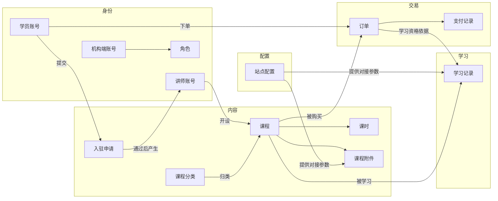

# 模块总览：领课教育

> 本文是「领课教育」的模块设计主文档：定模块划分、对象归属与跨模块关系，作为各模块详情文档的总纲（详细设计见 `04C-<模块名>.md`）。模拟案例评审稿：判断状态以规则句末括注表达，来源为关键设计决策 D 编号、开发规范或本轮拍板。

## 1. 项目结构（模块与对象）

### 1.1 项目结构

### 1.2 与技术文档分包的映射

| 技术文档模块 | 业务模块 | 说明 |
|---|---|---|
| 账号与权限模块 | 账号与权限模块 | 一一对应 |
| 站点配置模块 | 站点配置模块 | 一一对应 |
| 讲师模块 | 讲师模块 | 一一对应 |
| 课程模块 | 课程模块 | 一一对应 |
| 交易模块 | 交易模块 | 一一对应 |
| 学习模块 | 学习模块 | 一一对应 |
| 统计模块 | 统计模块 | 一一对应，按只读分析模块处理 |
| 媒体接入模块 | 未独立成业务模块 | 纯技术基建：只做视频与存储服务商的适配，无业务对象与业务规则；由课程模块与学习模块在其详情中作为对外依赖声明(D7) |

模块数量为七个：以「拥有独立对象群、独立规则群与独立使用方」为判据得出。课程视频与资料的存储、播放凭据换取属技术实现，不设业务模块；统计模块只派生查询视图，不建第二套业务对象。

## 2. 模块与对象

### 2.1 账号与权限模块

**职责**：管理三端账号的身份与登录——学员账号、讲师账号、机构端账号的注册或开通、登录与退出、凭据维护，机构端的角色定义与授权，以及登录控制；同时认领三类主体各自的**自助管理面**：学员与讲师的个人中心（资料与凭据），机构内部人员的个人设置（自身账号资料与凭据）与账号权限（开通、授权、停用）。

| 对象 | 业务含义与主要组成 | 关系及约束 |
|---|---|---|
| 学员账号 | 学员端身份：登录凭据、个人资料（含昵称等展示信息）、账号状态 | 订单、学习记录的归属主体；注册即产生；停用后不可登录 |
| 讲师账号 | 讲师端身份：登录凭据、讲师信息（对外展示的介绍）、账号状态 | 由入驻申请审核通过后产生；一人最多一个讲师账号；被课程引用 |
| 机构端账号 | 机构端身份：登录凭据、账号资料、账号状态 | 由机构管理员开通；通过账号角色关联获得能力；被各模块的操作留痕引用 |
| 角色 | 机构端的能力授权单元，职责模板：角色名、角色说明 | 与机构端账号多对多；一个账号可持多角色；角色被引用时不可删除 |
| 账号角色关联 | 机构端账号与角色的授予关系 | 账号与角色的唯一组合；解除授予即收回该角色的能力 |

**共享对象**

| 对象 | 共享方式 | 使用方 |
|---|---|---|
| 学员账号 | 标识引用 | 交易模块（订单归属）、学习模块（学习记录归属） |
| 讲师账号 | 标识引用 | 课程模块（课程归属）、统计模块（收益归属）、讲师模块（申请归属） |
| 机构端账号 | 标识引用 | 各模块的操作留痕与审核留痕 |

**功能列表**：学员注册、学员登录与退出、学员个人资料维护、学员密码修改；讲师登录与退出、讲师账号资料与凭据维护；机构端账号开通、机构端账号角色授权、机构端账号停用、机构端账号资料与凭据重置；登录鉴权与按端隔离校验、登录控制（同一账号同一时间仅一处登录）、能力点校验。

详细设计见 [04C-账号与权限.md](./04C-账号与权限.md)。

### 2.2 站点配置模块

**职责**：管理站点对外呈现的信息与第三方对接参数，供学员端展示与课程、学习两条链路在对接外部服务时取用；不做课程内容与账号相关的事。

| 对象 | 业务含义与主要组成 | 关系及约束 |
|---|---|---|
| 站点配置 | 站点对外信息（名称、标识、基础文案等）与第三方对接参数（视频、存储等外部服务的接入项） | 全站唯一一份；修改后对学员端与新发起的对接生效；被课程模块与学习模块引用 |

**共享对象**

| 对象 | 共享方式 | 使用方 |
|---|---|---|
| 站点配置 | 统一读取 | 课程模块（附件与课时的存储对接）、学习模块（播放凭据换取） |

**功能列表**：查看站点配置、修改站点信息、修改第三方对接参数。

详细设计见 [04C-站点配置.md](./04C-站点配置.md)。

### 2.3 讲师模块

**职责**：管理讲师的入驻申请与审核，以及讲师对外展示信息的维护；讲师账号的产生由本模块与账号与权限模块共同完成（本模块负责申请与审核，账号与权限模块负责账号本身）。

| 对象 | 业务含义与主要组成 | 关系及约束 |
|---|---|---|
| 入驻申请 | 讲师的入驻请求：申请信息、提交时间、审核结论（审核人、审核时间、审核意见） | 由学员账号提交；审核通过后产生讲师账号；结论一经作出即终态；同一账号可再次提交新申请 |

**功能列表**：提交入驻申请、查看自己的申请状态、机构审核入驻申请（通过／不通过）、讲师信息维护、讲师信息查看（供课程详情展示）。

详细设计见 [04C-讲师.md](./04C-讲师.md)。

### 2.4 课程模块

**职责**：管理课程的组织与内容——课程分类、课程、课时、课程附件，以及课程的提交审核、审核、发布与下架；并向前台输出课程列表、搜索与详情所需的数据。

| 对象 | 业务含义与主要组成 | 关系及约束 |
|---|---|---|
| 课程分类 | 课程的组织骨架：分类名、层级与排序 | 被课程引用；被引用时不可删除；由机构运营人员维护 |
| 课程 | 可被购买与学习的教学单元：课程基本信息、讲师、归属分类、价格、课程状态、审核结论 | 归属唯一讲师账号；发布前必须审核通过；被引用时不可删除 |
| 课时 | 课程内的视频学习单元：课时标题、内容引用、排序 | 属于唯一课程；课程送审时一并校验 |
| 课程附件 | 课程配套的资料文件：附件名、文件引用 | 属于唯一课程；与课时一起构成课程内容 |

**共享对象**

| 对象 | 共享方式 | 使用方 |
|---|---|---|
| 课程 | 标识引用 | 交易模块、学习模块、统计模块 |
| 课时 | 随课程内容清单只读共享 | 学习模块 |
| 课程附件 | 随课程内容清单只读共享 | 学习模块 |
| 课程分类 | 统一读取 | 学员端、机构端 |

**功能列表**：课程分类新增与修改、课程分类删除（软删除）、课程分类查看；课程新建、课程修改、课程删除（软删除）、课程查看（讲师侧与机构侧）；课时新增、课时修改、课时删除、课时排序；附件上传、附件删除、附件查看；提交上架审核、课程审核（通过／不通过）、课程下架；首页浏览（学员端）、分类浏览与搜索（学员端）、课程详情查看（学员端）。

详细设计见 [04C-课程.md](./04C-课程.md)。

### 2.5 交易模块

**职责**：管理课程购买的交易链路——下单、支付结果的接收与留痕、订单取消与订单查询，并向机构与讲师两侧输出订单数据来源（机构统计与讲师收益由统计模块基于本模块数据派生）。

| 对象 | 业务含义与主要组成 | 关系及约束 |
|---|---|---|
| 订单 | 课程购买的成交凭据：学员、课程、金额、状态、下单与支付时间 | 一个学员对同一课程同时只能有一笔有效订单（防重复购买）；支付完成才使学习资格生效；被学习模块与统计模块引用 |
| 支付记录 | 支付过程与结果的记录：外部单据号、支付渠道返回结果、支付时间 | 以外部单据号唯一，重复回调按幂等处理；只增不改 |

**共享对象**

| 对象 | 共享方式 | 使用方 |
|---|---|---|
| 订单 | 统一写入，标识引用 | 学习模块（学习资格依据）、统计模块（统计与收益来源） |

**功能列表**：下单、支付结果回写、订单取消、我的订单查看（学员）、订单列表与查询（机构）、订单详情查看。

详细设计见 [04C-交易.md](./04C-交易.md)。

### 2.6 学习模块

**职责**：管理已购课程的学习——学习资格的取得、课时播放凭据的换取、学习记录的更新与查看。

| 对象 | 业务含义与主要组成 | 关系及约束 |
|---|---|---|
| 学习记录 | 学员在某课程上的学习行为记录：最近学习的课时、学习进度、最近学习时间 | 学员与课程的唯一组合；随学习行为更新；只增不删（学员不可删除自己的学习记录） |

**共享对象**

| 对象 | 共享方式 | 使用方 |
|---|---|---|
| 学习记录 | 统一写入，只读共享 | 学员端 |

**功能列表**：我的课程查看、播放凭据获取、学习记录更新、学习记录查看。

详细设计见 [04C-学习.md](./04C-学习.md)。

### 2.7 统计模块

**职责**：只读分析：基于订单数据派生机构侧的订单统计与讲师侧的课程收益，不持有业务对象，不产生写操作。

| 查询视图 | 来源数据 | 说明 |
|---|---|---|
| 订单统计视图 | 订单、支付记录、课程、学员账号 | 按时间、课程等维度汇总订单与成交结果，供机构复盘 |
| 课程收益视图 | 订单、支付记录、课程、讲师账号 | 按课程与讲师汇总有效订单形成的收益，供讲师查看；与订单统计同源推导（D8） |

**功能列表**：查看订单统计（机构）、查看课程收益（讲师）。

不建业务对象的原因：两侧结果均由订单数据派生，无独立生命周期与状态，派生结果随订单变动(D8)。

详细设计见 [04C-统计.md](./04C-统计.md)。

## 3. 跨模块关系

### 3.1 对象关系图

### 3.2 对象关联表

| 关联对象 | 关系 | 数据归属 |
|---|---|---|
| 学员账号 — 入驻申请 | 学员账号提交入驻申请 | 入驻申请归讲师模块；学员账号只被引用 |
| 入驻申请 — 讲师账号 | 审核通过后产生讲师账号 | 讲师账号归账号与权限模块；入驻申请只被引用 |
| 讲师账号 — 课程 | 一个讲师开设多门课程 | 课程归课程模块；讲师账号只被引用 |
| 课程分类 — 课程 | 一个分类归类多门课程 | 均归课程模块 |
| 课程 — 课时／课程附件 | 一门课程包含多个课时与附件 | 均归课程模块 |
| 站点配置 — 课时／课程附件／学习记录 | 配置向对接外部服务的一方提供接入参数 | 站点配置归站点配置模块；使用方只读取 |
| 学员账号 — 订单 | 一个学员可有多笔订单 | 订单归交易模块；学员账号只被引用 |
| 课程 — 订单 | 一门课程可被多笔订单购买 | 订单归交易模块；课程只被引用 |
| 订单 — 支付记录 | 一笔订单产生支付记录 | 均归交易模块 |
| 订单 — 学习记录 | 订单作为学习资格的依据 | 学习记录归学习模块；订单只被引用 |
| 课程 — 学习记录 | 一门课程可产生多条学习记录 | 学习记录归学习模块；课程只被引用 |
| 机构端账号 — 各模块留痕 | 操作与审核留痕记录操作人 | 留痕随各业务对象保存；机构端账号只被引用 |

### 3.3 协作约束表

| 协作场景 | 必须共同成立的结果 | 详细设计 |
|---|---|---|
| 入驻申请审核通过 | 入驻申请结论落为已通过，并产生可用状态的讲师账号，两处同事务完成 | [04C-讲师.md](./04C-讲师.md) |
| 课程审核通过 | 课程状态与审核结论一致落库，未通过不得进入学员端可见范围 | [04C-课程.md](./04C-课程.md) |
| 支付结果回写 | 订单状态转为已支付、支付记录留痕、学习资格对学员生效，三者一致；重复回调结果不变 | [04C-交易.md](./04C-交易.md) |
| 播放凭据换取 | 校验学习资格后向媒体接入模块换取播放凭据，并把学习行为写入学习记录 | [04C-学习.md](./04C-学习.md) |
| 统计与收益呈现 | 机构侧订单统计与讲师侧课程收益由同一批订单数据推导，口径一致 | [04C-统计.md](./04C-统计.md) |
| 站点对接参数修改 | 参数变更后新发起的对接使用新参数，已发出的播放凭据不受影响 | [04C-站点配置.md](./04C-站点配置.md) |
