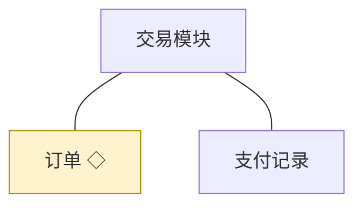
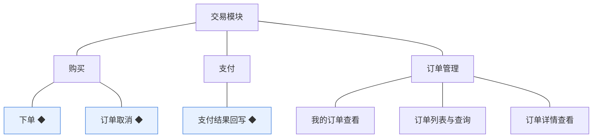
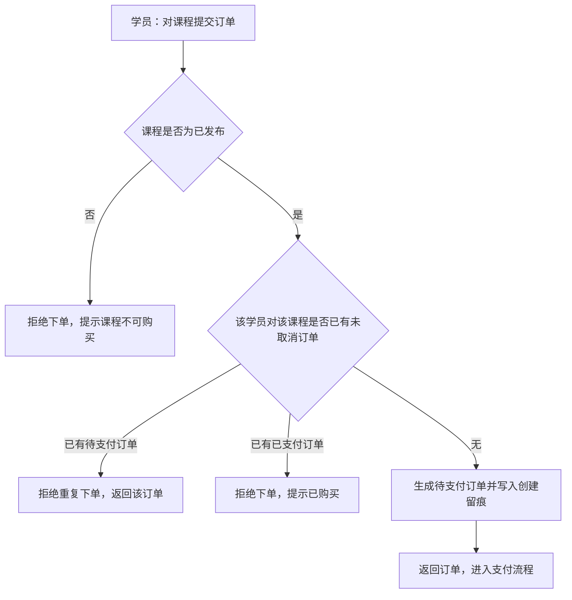
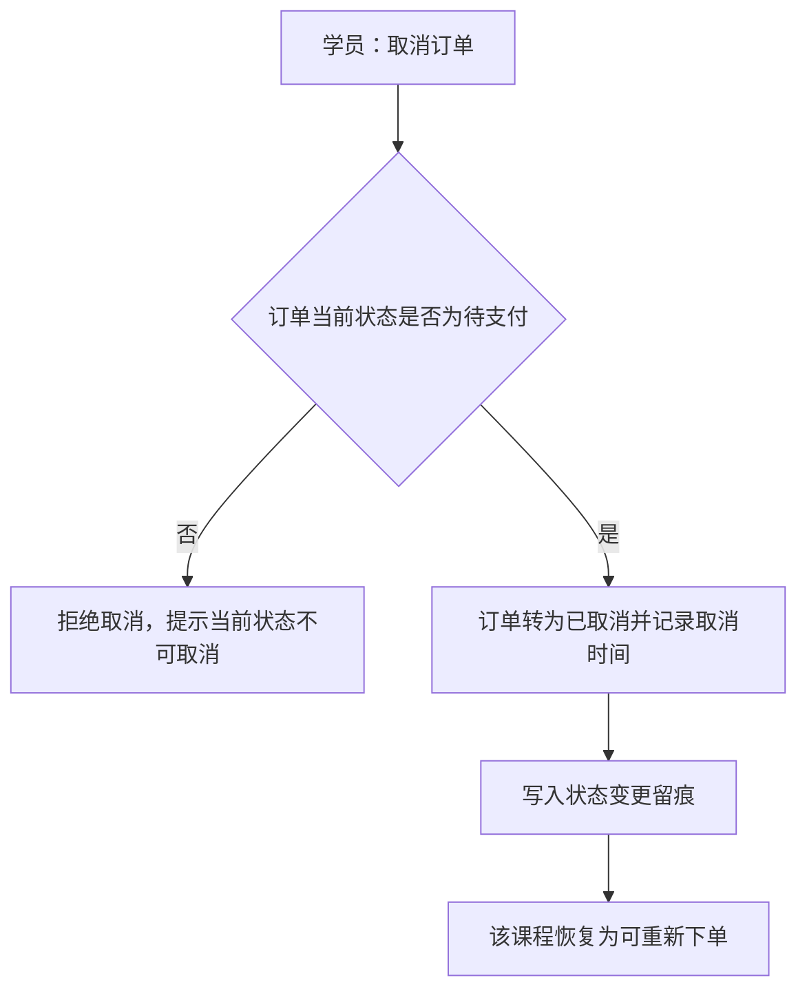
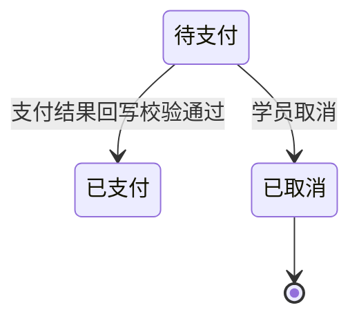

# 模块设计：交易

> 定位：对应技术文档分包「交易模块」，承接《模块总览》第 2.5 节；模拟案例评审稿，规则句末括注来源（D 编号＝项目 PRD 关键设计决策，括注「开发规范」者见《04A-开发规范（项目）》，括注「本轮建议」者为本次拍板）。

## 1. 职责与边界

**管**：课程购买的交易链路——下单、支付结果的接收与留痕、订单取消与订单查询；并向学习模块提供学习资格依据、向统计模块提供数据来源。

**不管**：
- 课程的价格与可售状态 → 课程模块
- 学习资格的使用、播放与学习记录 → 学习模块
- 统计口径与收益呈现 → 统计模块
- 支付渠道的对接实现 → 支付渠道（外部），本模块只接收与记录结果

**边界一句话**：本模块管「买没买成、钱有没有到」，不管「买完怎么学」。

## 2. 对象

### 2.1 对象结构

### 2.2 对象说明

**订单**

- 定位：学员购买课程的成交凭据，记录学员、课程、金额与支付结果，是收益与统计的数据来源（对应 PRD 业务对象「订单」）。
- 关键组成：订单编号、学员账号标识、课程标识、成交金额、订单状态、下单时间、支付完成时间、取消时间（本轮建议）。
- 关系与约束：一个学员对同一课程同时只能有一笔未取消的订单（防重复购买，本轮建议）；支付完成才使学习资格生效（本轮建议）；被学习模块与统计模块以标识引用；订单不可删除（软删除语义），状态变更必须留痕(开发规范)。

**支付记录**

- 定位：订单支付过程与结果的记录，为对账与追溯所设，与技术文档概念数据模型中的支付记录一致。
- 关键组成：订单标识、外部单据号、支付渠道返回结果、支付时间、记录状态。
- 关系与约束：以外部单据号唯一，重复回调按幂等处理(开发规范)；只增不改；一笔订单可对应多条支付记录（含失败记录）(本轮建议)。

### 2.3 共享对象

| 对象 | 共享方式 | 使用方 | 使用契约 |
|---|---|---|---|
| 订单 | 统一写入，标识引用 | 学习模块（学习资格依据）、统计模块（统计与收益来源） | 订单状态只由本模块写入；使用方只读不写，不得自建成交数据 |

## 3. 功能

### 3.1 功能结构

### 3.2 功能清单

| 功能 | 使用方 | 说明 |
|---|---|---|
| 下单 ◆ | 学员 | 对已发布课程提交订单，生成待支付订单 |
| 订单取消 ◆ | 学员 | 取消待支付订单；已支付订单不走本功能（退款未纳入本期） |
| 支付结果回写 ◆ | 支付渠道回调、机构端人工核对（本轮建议） | 接收支付结果并落订单与支付记录，重复回调结果不变 |
| 我的订单查看 | 学员 | 查看本人订单及状态；只对本人开放 |
| 订单列表与查询 | 机构运营人员 | 按时间、课程等条件查询订单 |
| 订单详情查看 | 学员、机构运营人员 | 学员看本人订单；机构看全部订单 |

### 3.3 ◆ 复杂功能：下单

**说明**：学员在学员端对已发布课程下单——校验课程可售与重复购买后生成待支付订单；校验不通过则不产生订单（D8，开发规范）。

规则：

1. 只有已发布课程可下单；课程下架后拒绝新订单(D4)。
2. 一个学员对同一课程同时只能有一笔未取消订单，重复下单返回既有待支付订单而非新建（本轮建议）。
3. 订单金额以生成时点的课程价格为准，课程改价不影响已生成的订单（本轮建议）。
4. 下单与库存无关（课程为可复制的数字内容），不设数量与扣减(本轮建议)。

### 3.4 ◆ 复杂功能：支付结果回写

**说明**：支付渠道把支付结果通知到本模块——以外部单据号幂等落库，订单转为已支付并写入支付记录；重复通知不改变结果，支付失败只记录不改订单状态(D8，开发规范)。

```mermaid
sequenceDiagram
    participant P as 支付渠道回调入口
    participant T as 交易模块
    participant S as 统计模块
    Note over P,T: 回调处理与本地写入在同一事务边界内完成
    P->>T: 提交支付结果（外部单据号、金额、结果）
    T->>T: 以外部单据号查重
    alt 已处理过
        T-->>P: 返回处理成功（幂等，不改数据）
    else 首次处理
        T->>T: 校验金额与订单一致
        alt 校验不通过
            T->>T: 记录异常支付记录，订单状态不变
            T-->>P: 返回已接收
        else 校验通过
            T->>T: 订单转为已支付并写入支付记录
            T->>T: 写入状态变更留痕
            T-->>S: 订单数据可被统计读取
            T-->>P: 返回处理成功
        end
    end
```

规则：

1. 支付结果一律以外部单据号幂等处理，重复回调返回相同结果且不改数据(开发规范)。
2. 回调金额与订单金额不一致时不得把订单转为已支付，只记录异常支付记录供人工核对（本轮建议）。
3. 订单状态变更与支付记录写入在同一事务内完成；事务内不得调用外部服务(开发规范)。
4. 支付完成时间以回调携带的支付时间为准，用于统计口径(D8)。
5. 学习资格不在此处写入，由学习模块按订单状态判定（本轮建议）。

### 3.5 ◆ 复杂功能：订单取消

**说明**：学员取消待支付订单——订单转为已取消并留痕；已支付订单不适用本功能（退款未纳入本期范围）。

规则：

1. 只有待支付订单可取消；已支付订单的处置见第 6 节(本轮建议)。
2. 取消后同一课程可重新下单，不占用「未取消订单」的唯一性（本轮建议）。
3. 取消必须留痕并记录时间(开发规范)。

## 4. 状态

**订单**

| 流转 | 触发条件 | 伴随动作与约束 |
|---|---|---|
| 待支付 → 已支付 | 支付结果回写且金额校验通过 | 写入支付记录与状态留痕；学习资格对学员生效 |
| 待支付 → 已取消 | 学员取消 | 记录取消时间与留痕；课程可重新下单 |

**支付记录**：无状态流转，每次结果都是一条新记录（无状态原因：以记录流水表达历史，回写结果不改旧记录）。

## 5. 对外契约

| 操作 | 语义 | 调用方 | 关键约束 |
|---|---|---|---|
| 查询学习资格依据 | 判断某学员对某课程是否存在已支付订单 | 学习模块 | 只读；以订单状态为唯一依据 |
| 读取订单数据 | 供统计与收益派生 | 统计模块 | 只读；不得回写 |
| 接收支付结果 | 接收渠道回调并落库 | 支付渠道（外部） | 幂等；金额校验不通过不得改订单状态 |
| 读取订单信息 | 供机构端订单管理与学员端订单查询 | 机构端、学员端 | 学员只能读本人订单 |

## 6. 待议与版本级事项

**本轮建议**：一个学员对同一课程同时只允许一笔未取消订单；支付失败只记录不改订单状态；订单取消由学员发起。

**待业务确认**：支付渠道与对接方式（影响回调入口与人工核对路径）；已支付订单的退款与售后是否纳入后续范围；订单是否支持超时自动关闭。

**留版本级**：订单的可查询条件与分页；支付的超时时间；支付渠道的类型清单；机构端订单列表的字段。

**明确不做**：不做退款与售后（本期）；不做发票与开票信息；不做优惠券、折扣与组合购买；不做购物车（课程按单课购买）；不做线下汇款与人工改价。

**关联评审**：学习资格的判定依据「已支付订单」需与学习模块确认口径一致；订单状态与课程下架的联动（下架后已支付订单的学习资格保留）需与课程模块、学习模块共同确认。
