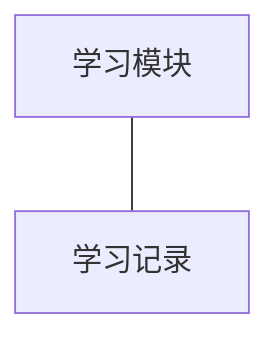
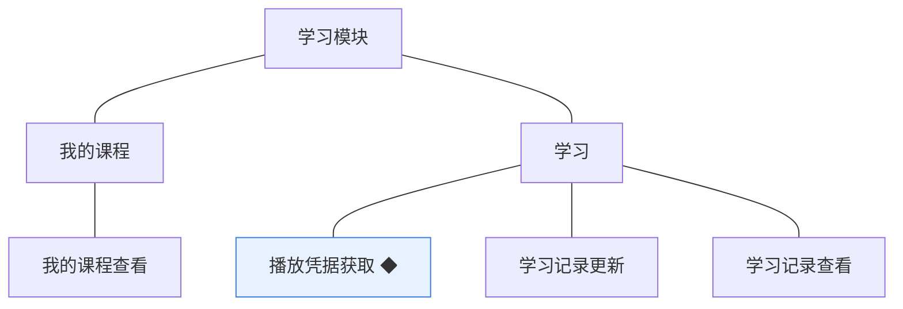
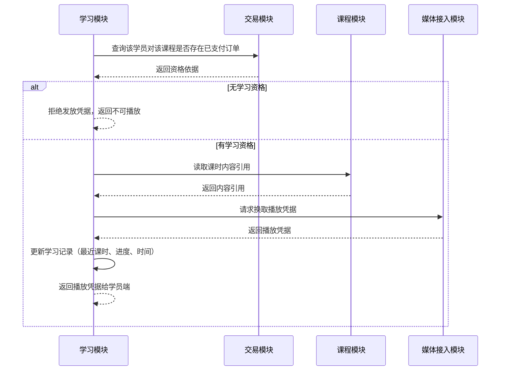

# 模块设计：学习

> 定位：对应技术文档分包「学习模块」，承接《模块总览》第 2.6 节；模拟案例评审稿，规则句末括注来源（D 编号＝项目 PRD 关键设计决策，括注「开发规范」者见《04A-开发规范（项目）》，括注「本轮建议」者为本次拍板）。

## 1. 职责与边界

**管**：已购课程的学习——学习资格的判定、课时播放凭据的换取、学习记录的更新与查看。

**不管**：
- 订单与支付 → 交易模块
- 课程内容、课时与附件的维护 → 课程模块
- 视频与存储服务的适配实现 → 媒体接入模块（技术基建，见《模块总览》1.2）
- 统计与收益 → 统计模块

**边界一句话**：本模块管「谁有资格学、学到哪了」，不管「怎么买的、视频存在哪」。

## 2. 对象

### 2.1 对象结构

### 2.2 对象说明

**学习记录**

- 定位：学员在某课程上的学习行为记录，反映学习进度，供学员自查（对应 PRD 业务对象「学习记录」）。
- 关键组成：学员账号标识、课程标识、最近学习的课时标识、学习进度、最近学习时间。
- 关系与约束：学员与课程的组合唯一（本轮建议）；随学习行为更新；学员不可删除自己的学习记录；不因课程下架而删除（本轮建议）。

### 2.3 共享对象

| 对象 | 共享方式 | 使用方 | 使用契约 |
|---|---|---|---|
| 学习记录 | 统一写入，只读共享 | 学员端 | 只返回本人记录；记录只由本模块写入，使用方不得改写（本轮建议） |

## 3. 功能

### 3.1 功能结构

### 3.2 功能清单

| 功能 | 使用方 | 说明 |
|---|---|---|
| 我的课程查看 | 学员 | 列出本人具备学习资格的课程；只对本人开放 |
| 播放凭据获取 ◆ | 学员 | 校验学习资格后换取播放凭据，并把学习行为写入学习记录 |
| 学习记录更新 | 本模块内部（由播放行为触发） | 更新最近学习的课时、进度与时间 |
| 学习记录查看 | 学员 | 查看本人各课程的学习记录；只对本人开放 |

### 3.3 ◆ 复杂功能：播放凭据获取

**说明**：学员播放课时时，本模块先向交易模块校验该学员对该课程是否具备学习资格，再向媒体接入模块换取播放凭据，并同步把学习行为写入学习记录；校验不通过则不发放凭据，只允许查看课程介绍（D7，开发规范）。

规则：

1. 学习资格以交易模块的订单状态为唯一依据，本模块不自建购买关系（本轮建议）。
2. 无学习资格时不得发放播放凭据；课程介绍与目录仍可查看（试看能力见第 6 节）(本轮建议)。
3. 播放凭据由媒体接入模块按站点配置模块提供的对接参数换取，本模块不直接调用服务商接口(D7)。
4. 换取凭据成功即更新学习记录，更新必须带幂等性，避免重复请求写乱进度(开发规范)。
5. 凭据换取失败不得影响学习记录的一致性，失败时按可重试处理（开发规范）。

## 4. 状态

**学习记录**：无状态流转（无状态原因：学习记录是对学习行为的持续累积，以字段更新表达进度，不需要生命周期状态）；历史不保留多版本，只保留最近进度（本轮建议）。

**学习资格**：非独立对象，由订单状态即时判定，不落库为独立状态（本轮建议）。

## 5. 对外契约

| 操作 | 语义 | 调用方 | 关键约束 |
|---|---|---|---|
| 查询学习资格 | 判断某学员对某课程是否可学 | 学员端、课程模块（附件可获取性参考） | 依据订单状态即时判定；不缓存过久 |
| 提供学习记录 | 供学员端展示进度 | 学员端 | 只返回本人记录 |
| 请求播放凭据 | 换取可播放的凭据 | 学员端 | 必须先通过资格校验 |
| 读取站点对接参数 | 换取凭据时的外部服务参数 | 本模块内部 | 由站点配置模块提供，不得硬编(开发规范) |

## 6. 待议与版本级事项

**本轮建议**：学习记录按学员与课程唯一；学习资格由订单状态即时判定；无资格可看课程介绍与目录。

**待业务确认**：是否需要试看（免费试看课时或时长）；学习进度的计算口径（按课时完成数或按时长）；学习记录是否需要展示给机构与讲师（涉及隐私与统计口径）。

**留版本级**：进度的计算与展示方式；最近学习时间的展示粒度；播放凭据的有效期与续期方式；是否记录每个课时的明细进度。

**明确不做**：不做学习计划与任务提醒；不做积分、证书与打卡；不做笔记、评论与问答（与本期不做社区内容一致）；不做防拖拽与防倍速等学习监管能力。

**关联评审**：学习资格口径需与交易模块一致（订单状态为准）；课程下架、讲师停用后学习资格的保留规则需与课程模块、讲师模块共同确认；试看若纳入，会改变课程详情与播放的界面约定，属版本级功能。
