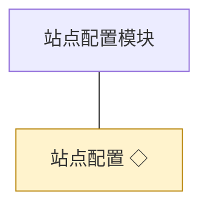
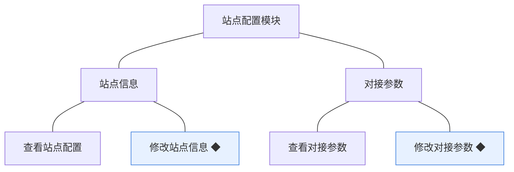
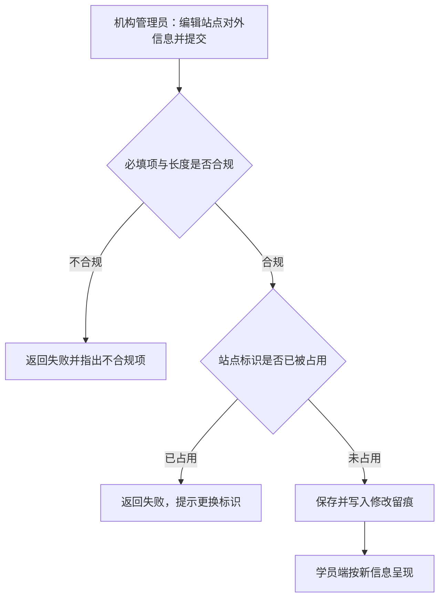
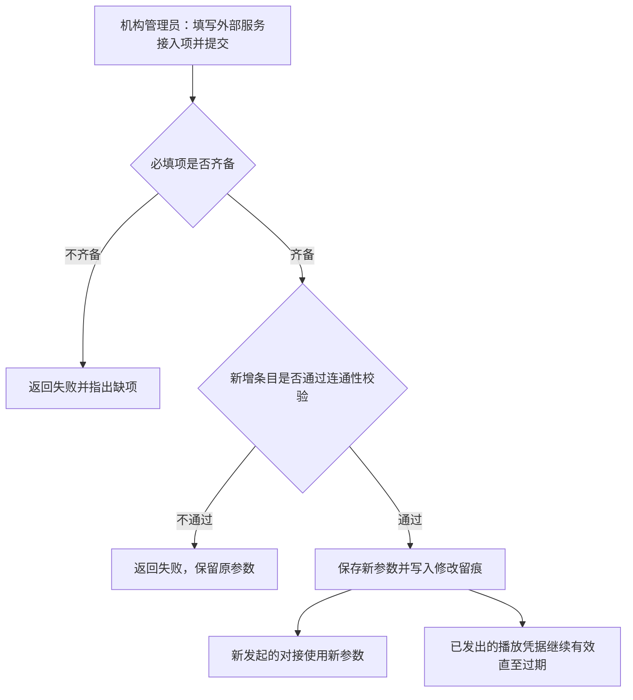

# 模块设计：站点配置

> 定位：对应技术文档分包「站点配置模块」，承接《模块总览》第 2.2 节；模拟案例评审稿，规则句末括注来源（D 编号＝项目 PRD 关键设计决策，括注「开发规范」者见《04A-开发规范（项目）》，括注「本轮建议」者为本次拍板）。

## 1. 职责与边界

**管**：站点对外呈现的信息与第三方对接参数——站点名称与标识、基础对外文案、外部服务（视频与存储）的接入项；对使用方提供统一读取。

**不管**：
- 课程内容的存储与播放本身 → 课程模块、学习模块
- 首页推荐位等运营内容的编排 → 本期未纳入，见第 6 节
- 账号与权限 → 账号与权限模块
- 机构自身经营数据 → 统计模块

**边界一句话**：本模块只管「站点以什么名义对外、对接外部服务用什么参数」，不承载业务流转。

## 2. 对象

### 2.1 对象结构

### 2.2 对象说明

**站点配置**

- 定位：站点对外信息与第三方对接参数的设置集合，全站唯一一份（对应 PRD 业务对象「站点配置」）。
- 关键组成：站点对外信息（名称、标识、基础文案）、第三方对接参数（视频服务接入项、存储服务接入项）、最后修改人。
- 关系与约束：全站唯一，不做多份与副本；修改后对学员端展示与新发起的对接生效，已发出的播放凭据不受影响（本轮建议）；被课程模块与学习模块以统一读取方式取用。

### 2.3 共享对象

| 对象 | 共享方式 | 使用方 | 使用契约 |
|---|---|---|---|
| 站点配置 | 统一读取 | 课程模块（附件与课时对接存储）、学习模块（换取播放凭据）、学员端（对外展示） | 使用方只读不写；参数的校验与变更归本模块 |

## 3. 功能

### 3.1 功能结构

### 3.2 功能清单

| 功能 | 使用方 | 说明 |
|---|---|---|
| 查看站点配置 | 机构管理员、机构运营人员 | 查看当前站点对外信息与对接参数；对接参数中的敏感项按脱敏展示（开发规范） |
| 修改站点信息 | 机构管理员 | 修改站点名称、标识与基础文案；校验必填与长度后保存并留痕 |
| 查看对接参数 | 机构管理员 | 查看外部服务接入项；不展示完整密钥 |
| 修改对接参数 | 机构管理员 | 修改视频与存储服务的接入项；校验通过后保存并留痕 |

### 3.3 ◆ 复杂功能：站点信息修改

**说明**：机构管理员在机构端修改站点对外信息——校验通过后保存并留痕，修改即时对外生效；站点标识被占用时不得保存（本轮建议）。

规则：

1. 站点标识全站唯一，被占用时不得保存（本轮建议）。
2. 修改必须留痕：操作人、时间、变更前后主要内容(开发规范)。
3. 对外信息变更即时生效，不设审核环节——站点信息属机构自身的对外名义（本轮建议）。

### 3.4 ◆ 复杂功能：对接参数修改

**说明**：机构管理员修改外部服务接入参数——校验完整性后保存并留痕；新参数对新发起的对接生效，已在播放中的凭据不受影响，避免正在学习的学员被中断（本轮建议，D7）。

规则：

1. 保存前必须做连通性校验，校验不通过时保持原参数不变，避免把可用配置改坏（本轮建议）。
2. 参数变更不得影响进行中的学习：只对新发起的对接生效（本轮建议）。
3. 密钥类参数不得回显完整值，只以脱敏形式展示(开发规范)。
4. 本模块只保存接入项，不实现服务商差异——差异由媒体接入模块封装(D7)。

## 4. 状态

**站点配置**：无状态流转。配置只有「当前值」一种形态，历史以修改留痕表达（无状态原因：配置是单例设置集合，不需要生命周期；历史变更靠留痕回溯）。

**角色与操作留痕**：本模块的写操作统一使用账号与权限模块提供的操作人身份（关联评审）。

## 5. 对外契约

| 操作 | 语义 | 调用方 | 关键约束 |
|---|---|---|---|
| 读取站点对外信息 | 取站点名称与标识等展示项 | 学员端、机构端 | 只读 |
| 读取对接参数 | 取视频与存储服务的接入项 | 课程模块、学习模块 | 只读；调用方不得缓存超过必要时长（本轮建议） |
| 校验参数可用性 | 保存前做连通性校验 | 本模块内部 | 校验失败不得覆盖原参数 |

## 6. 待议与版本级事项

**本轮建议**：站点配置全站唯一、不做副本；参数变更只对新发起的对接生效。

**待业务确认**：首页推荐位、轮播等运营内容由谁维护、是否纳入本模块——上游只写「站点与第三方参数配置」，未说明运营内容的维护入口；若纳入，本模块需增补运营位对象与功能。

**留版本级**：站点信息的字段清单与长度限制；对接参数的具体条目（依所选服务商而定）；是否支持参数的多套预设与切换。

**明确不做**：不做多站点／多域名支持（与单机构自建自营一致，D2）；不做页面级装修与模板编辑；不做参数变更的审批流程。

**关联评审**：对接参数变更与学习模块的播放凭据有效期需共同确认边界（凭据过期的处理）；站点标识的定义需与机构端对外品牌口径一致。
