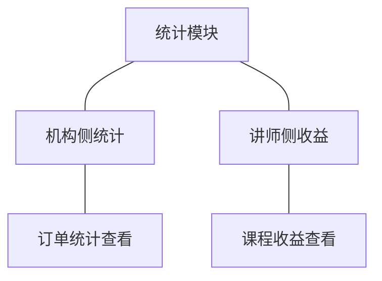

# 模块设计：统计

> 定位：对应技术文档分包「统计模块」，承接《模块总览》第 2.7 节；模拟案例评审稿，规则句末括注来源（D 编号＝项目 PRD 关键设计决策，K 编号见《技术文档（项目）》第 5 节，括注「开发规范」者见《04A-开发规范（项目）》，括注「本轮建议」者为本次拍板）。本模块为**只读分析类模块**：只派生查询视图，不建第二套业务对象。

## 1. 职责与边界

**管**：基于订单数据派生两类只读结果——面向机构端的订单统计、面向讲师端的课程收益；两者同源推导，口径一致(D8)。

**不管**：
- 订单与支付数据的产生与状态 → 交易模块
- 课程内容与讲师信息的维护 → 课程模块、讲师模块
- 学习行为与进度 → 学习模块
- 面向机构端的账号与权限 → 账号与权限模块
- 结算与对账 → 未纳入本期（结算方式未定，见第 6 节）

**边界一句话**：本模块只读不写，答案全部来自订单数据，不产生任何业务事实。

## 2. 对象

本模块不建业务对象：两侧结果均为订单数据的派生视图，无独立生命周期与状态，派生结果随订单变动而变化(D8)。以查询视图表代替对象结构图与共享对象表。

### 2.1 查询视图清单

| 查询视图 | 来源数据 | 说明 |
|---|---|---|
| 订单统计视图 | 订单、支付记录、课程、学员账号 | 按时间范围与课程维度汇总订单量、成交金额等结果，供机构复盘 |
| 课程收益视图 | 订单、支付记录、课程、讲师账号 | 按课程与讲师汇总有效订单形成的收益，供讲师查看本人课程与机构查看全局 |

### 2.2 视图维度与指标语义

| 视图 | 可用维度 | 指标（业务语义） | 口径约束 |
|---|---|---|---|
| 订单统计视图 | 时间范围（按支付完成时间归属）、课程、订单状态 | 订单量：落在区间内的订单笔数；成交金额：已支付且未取消订单的金额合计 | 取消订单不计入；待支付订单只计入订单量、不计入成交金额（本轮建议） |
| 课程收益视图 | 讲师、课程、时间范围 | 课程收益：该课程已支付且未取消订单对应的收益合计 | 与订单统计视图同源同口径，两侧金额必须一致(D8) |

### 2.3 派生口径

1. 只统计已支付且未取消的订单(D8)。
2. 以支付完成时间归属统计区间，而非下单时间(D8)。
3. 订单取消后，相应金额与收益从结果中扣除(D8)。
4. 口径调整只能改派生逻辑，不得回改订单数据(开发规范)。

### 2.4 口径的时间语义

- 时间一律以支付完成时间归属区间（订单在 3 月 31 日下单、4 月 1 日支付，计入 4 月）(D8)。
- 区间取「含起、不含止」的半开区间，避免相邻区间重复计入（本轮建议）。
- 查询与呈现按站点时区换算，存储仍为统一时区，避免跨时区口径漂移(开发规范)。

### 2.5 结果呈现边界

| 边界 | 约定 |
|---|---|
| 呈现粒度 | 只呈现聚合结果（订单量、成交金额、课程收益），不直接暴露订单明细全集（开发规范） |
| 空态 | 区间内无成交时呈现零值与空态说明，不呈现空白或错误（本轮建议） |
| 下钻 | 下钻到订单明细属交易模块的订单管理与查询能力，本模块只提供跳转依据（本轮建议） |
| 时效 | 结果按查询时点计算，不做预聚合缓存；如需缓存只允许用于加速，命中缓存与实时结果口径必须一致（本轮建议） |

## 3. 功能

### 3.1 功能结构

### 3.2 功能清单

| 功能 | 使用方 | 说明 |
|---|---|---|
| 订单统计查看 | 机构管理员、机构运营人员 | 按时间范围与课程维度查看订单统计结果；只返回聚合结果，不返回明细全集（开发规范） |
| 课程收益查看 | 讲师、机构管理员 | 讲师只看本人课程的收益；机构可看全部课程的收益(D6) |

本模块无复杂功能（◆）：全部功能为只读查询，不涉及多对象写入、失败分支与事务要求（本轮建议）。

### 3.3 查询规则

1. 统计与收益必须由同一批订单数据推导，不得各算一套(D8)。
2. 只统计已支付且未取消的订单；订单取消后从结果中扣除(D8)。
3. 讲师侧只返回本人课程的收益，越权请求一律拒绝(D6)。
4. 查询一律分页并限制时间跨度上限，避免全量扫描（开发规范）。
5. 本模块不得回写任何业务数据；统计口径变化时通过调整派生逻辑实现，不改订单数据（开发规范）。
6. 视图中不出现学员的个人资料与联系方式，只出现聚合结果与必要的业务标识（开发规范）。
7. 机构侧与讲师侧看到同一课程的收益金额必须一致，出现不一致以订单数据为准并修正派生逻辑(D8)。

### 3.4 与上游模块的数据关系

- **交易模块**：唯一数据来源；本模块只读订单与支付记录，不得写入，也不得自建成交数据（04C-交易 2.3）。
- **课程模块与讲师模块**：提供课程名称、归属讲师等展示用标识，只读。
- **账号与权限模块**：提供查询者的身份与角色，用于越权拦截(D6)。

## 4. 状态

本模块无状态对象（无状态原因：派生视图随源数据变化，不承载生命周期；口径与计算逻辑属实现细节，不下沉为业务状态）。

对应地，本模块也不承载任何订单侧的状态判断：订单是否计入统计只取决于订单当前状态，状态本身归交易模块（关联评审）。

## 5. 对外契约

| 操作 | 语义 | 调用方 | 关键约束 |
|---|---|---|---|
| 读取订单统计 | 取机构侧订单统计结果 | 机构端 | 只读；只返回聚合结果；按时间范围与课程维度可筛 |
| 读取课程收益 | 取讲师侧或机构侧的收益结果 | 讲师端、机构端 | 讲师只能取本人课程；机构可取全部；两侧金额口径一致 |
| 读取订单数据 | 派生统计结果的数据来源 | 本模块内部 | 由交易模块提供，只读不写 |
| 提供口径说明 | 向使用方说明指标的归属规则 | 机构端、讲师端 | 口径说明与派生逻辑同源，不得两处各写一套（本轮建议） |

## 6. 待议与版本级事项

**本轮建议**：只统计已支付且未取消订单；以支付完成时间归属统计区间；收益不区分结算状态（结算方式未定，见 PRD 备忘）。

**待业务确认**：统计结果的展示维度（按日／按周／按课程／按讲师）；是否需要导出；讲师收益是否需要展示结算状态与结算记录；待支付订单是否计入订单量。

**留版本级**：统计页面的筛选条件与默认时间范围；图表形态与刷新方式；导出格式与权限；时间区间的最大跨度。

**明确不做**：不做多机构对比与行业对标；不做经营预测与推荐；不做实时大屏；不做结算与对账流程（结算方式未定）；不做学员维度的行为分析（学习行为分析未纳入本期）。

**关联评审**：收益口径需与交易模块的订单状态定义、机构端的订单统计口径三处一致；若纳入结算，则本模块将从只读分析上升为持有结算对象的业务模块，属范围变化，需回到 PRD 层评审；学员与讲师信息进入视图的脱敏边界需与账号与权限模块共同确认。
