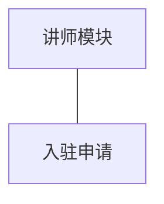
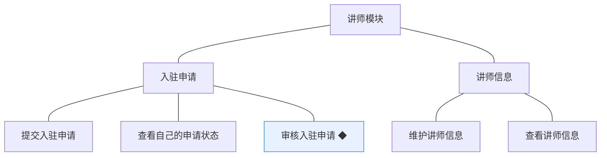
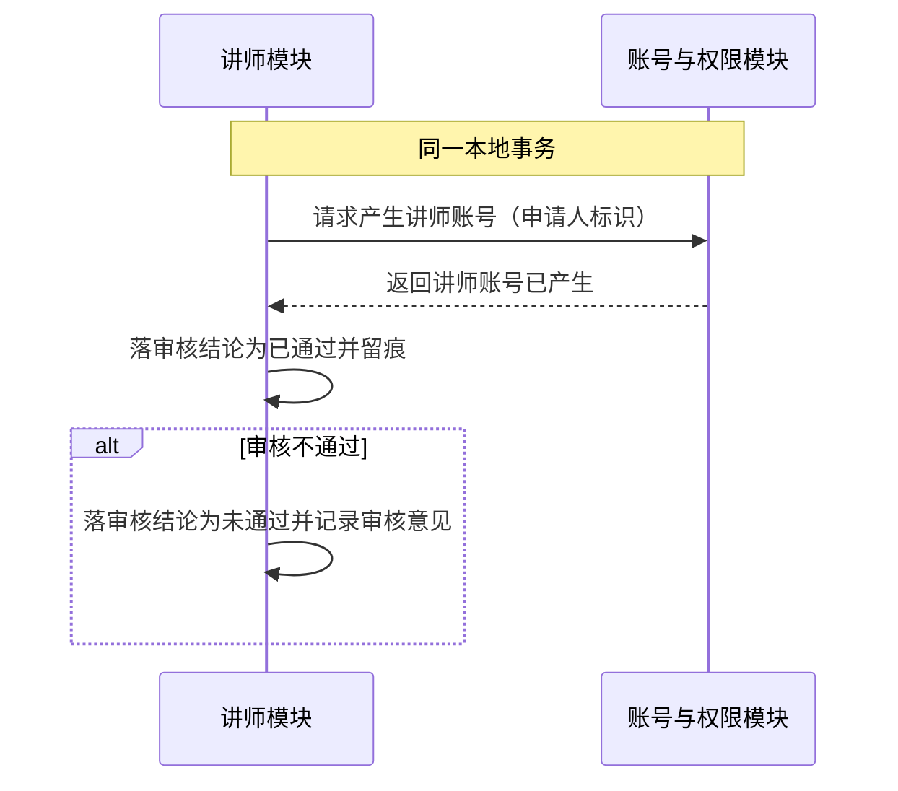
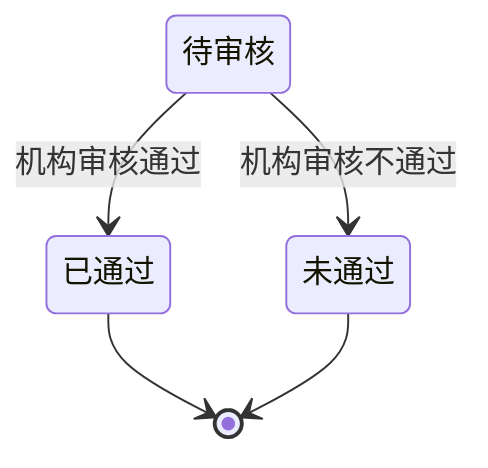

# 模块设计：讲师

> 定位：对应技术文档分包「讲师模块」，承接《模块总览》第 2.3 节；模拟案例评审稿，规则句末括注来源（D 编号＝项目 PRD 关键设计决策，括注「开发规范」者见《04A-开发规范（项目）》，括注「本轮建议」者为本次拍板）。

## 1. 职责与边界

**管**：讲师入驻申请的提交与审核（审核通过后请求产生讲师账号），以及讲师对外展示信息的维护与查看。

**不管**：
- 讲师账号本身的建立、凭据与状态 → 账号与权限模块
- 课程的新建、内容与审核 → 课程模块
- 讲师课程收益的计算与呈现 → 统计模块
- 学员的学习与订单 → 学习模块、交易模块

**边界一句话**：本模块管「谁可以成为讲师、讲师以什么形象对外」，不管讲师账号怎么存、课程怎么上。

## 2. 对象

### 2.1 对象结构

### 2.2 对象说明

**入驻申请**

- 定位：讲师的入驻请求与审核结论，是讲师身份的来源凭据（对应 PRD 业务对象「入驻申请」）。
- 关键组成：申请人（学员账号标识）、申请信息、提交时间、审核结论（审核人、审核时间、审核意见、结论状态）。
- 关系与约束：由学员账号提交；审核通过后触发产生讲师账号(D5)；结论一经作出即终态；未通过后再次申请属新的一次申请（本轮建议）；申请记录不可删除（被审核留痕引用，软删除语义）。

## 3. 功能

### 3.1 功能结构

### 3.2 功能清单

| 功能 | 使用方 | 说明 |
|---|---|---|
| 提交入驻申请 | 学员（申请成为讲师） | 以本人学员账号提交；存在待审核申请时不得重复提交（本轮建议） |
| 查看自己的申请状态 | 申请人 | 查看待审核／已通过／未通过与审核意见 |
| 审核入驻申请 ◆ | 机构运营人员 | 作出通过或不通过的结论；通过时同事务产生讲师账号 |
| 维护讲师信息 | 讲师 | 维护对外展示的介绍等信息；只对本人开放 |
| 查看讲师信息 | 学员端（课程详情）、机构端 | 只读；供课程详情展示讲师介绍 |

### 3.3 ◆ 复杂功能：审核入驻申请

**说明**：机构运营人员在机构端审阅入驻申请并作出结论——通过时在同一事务内落结论并请求账号与权限模块产生讲师账号；不通过时落结论并记录审核意见；两种结论都留痕且不可撤销（D4、D5，开发规范）。

规则：

1. 审核结论一经作出即为终态，不得改判；如需重新入驻，由申请人提交新申请（本轮建议）。
2. 审核通过必须与讲师账号的产生同事务完成，避免出现「已通过但无账号」的中间态(开发规范)。
3. 审核必须留痕：审核人、审核时间、审核意见(D4，开发规范)。
4. 同一申请只能被审核一次，重复提交审核请求时以先到者为准（本轮建议）。
5. 审核不通过必须填写审核意见，供申请人查看（本轮建议）。

## 4. 状态

**入驻申请**

| 流转 | 触发条件 | 伴随动作与约束 |
|---|---|---|
| 待审核 → 已通过 | 机构运营人员作出通过结论 | 同事务请求产生讲师账号；写入审核留痕 |
| 待审核 → 未通过 | 机构运营人员作出不通过结论 | 记录审核意见；申请人可再次提交新申请 |

**讲师账号**：其生命周期状态由账号与权限模块承载，本模块只在审核通过时触发「申请中 → 已入驻」这一流转，不重复定义（关联评审）。

## 5. 对外契约

| 操作 | 语义 | 调用方 | 关键约束 |
|---|---|---|---|
| 提交入驻申请 | 学员申请成为讲师 | 学员端 | 存在待审核申请时拒绝重复提交 |
| 审核入驻申请 | 机构作出结论并触发账号产生 | 机构端 | 结论终态不可改判；通过时同事务产生讲师账号 |
| 提供讲师信息 | 供课程详情与机构端展示 | 课程模块、学员端 | 只读；不得返回账号凭据与状态 |
| 写入讲师信息 | 维护讲师账号中的讲师信息部分 | 讲师；对象持有方为账号与权限模块 | 账号、凭据与状态归账号与权限模块，本模块只写讲师信息部分（本轮建议） |

## 6. 待议与版本级事项

**本轮建议**：同一学员账号最多一个待审核申请；未通过后再次提交视为新申请；审核不通过必填意见。

**待业务确认**：入驻申请的填写项（资质材料、联系方式等）由业务定，影响申请表单与审核依据；是否需要入驻的有效期或年审。

**留版本级**：申请的填写项与校验规则；审核操作的界面与批量审核能力；讲师信息的展示字段。

**明确不做**：不做讲师的分级与资质认证体系；不做机构直接开设讲师账号（讲师身份一律经入驻审核产生，D5）——如业务需要由机构直接开设，属改变 D5 的决策，需回到 PRD 层评审。

**关联评审**：讲师被停用后在售课程与已购学员的处置，需与课程模块、学习模块、交易模块共同确认；该规则会改变学员端可见范围与学习资格，属跨模块约定。
