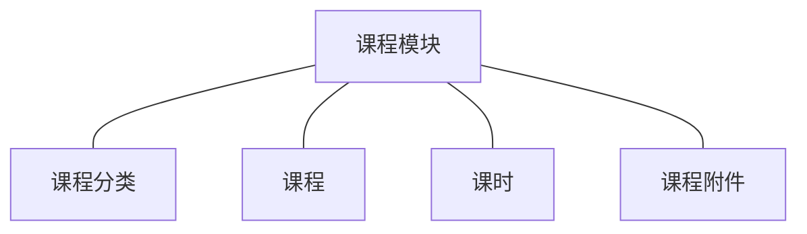
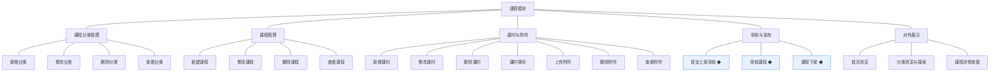
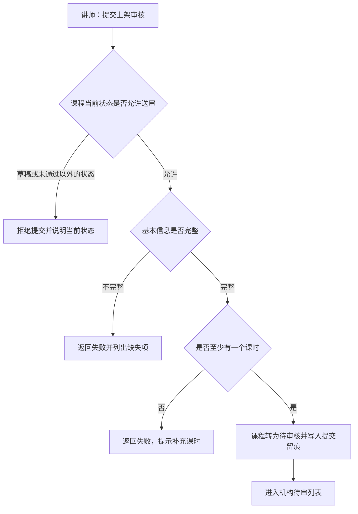
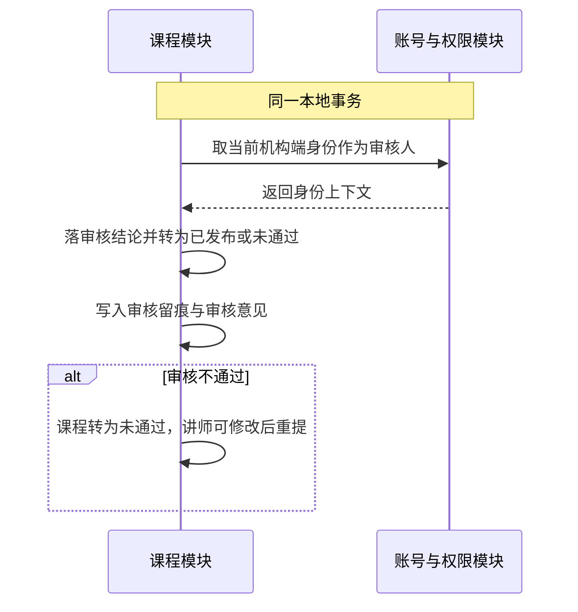
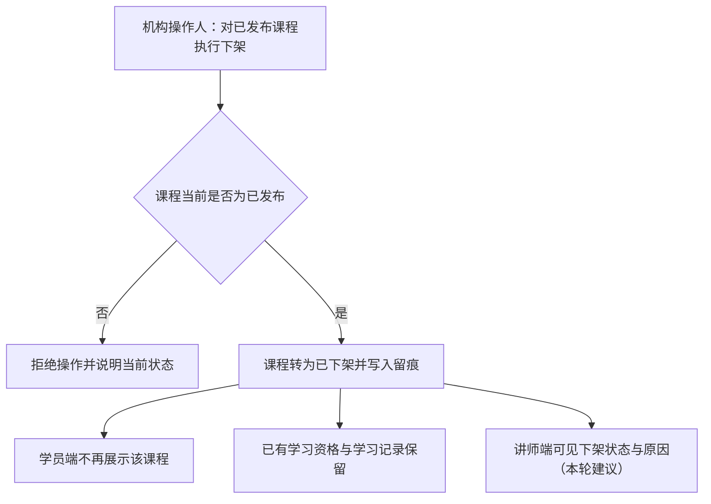
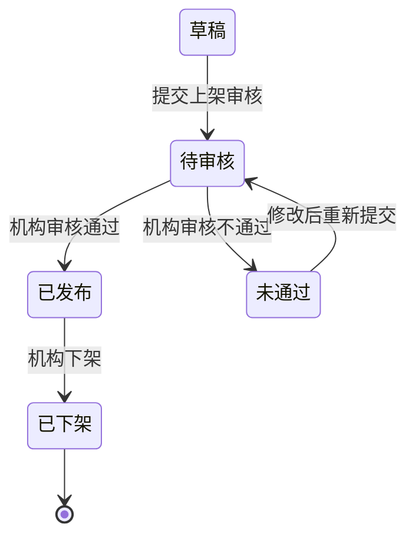

# 模块设计：课程

> 定位：对应技术文档分包「课程模块」，承接《模块总览》第 2.4 节；模拟案例评审稿，规则句末括注来源（D 编号＝项目 PRD 关键设计决策，括注「开发规范」者见《04A-开发规范（项目）》，括注「本轮建议」者为本次拍板）。

## 1. 职责与边界

**管**：课程的组织与内容——课程分类、课程、课时、课程附件的维护，课程的提交审核、审核、发布与下架，以及学员端课程列表、搜索与详情所需数据的输出。

**不管**：
- 讲师身份的建立与讲师信息 → 讲师模块、账号与权限模块
- 订单与购买资格 → 交易模块
- 学习资格判定、播放凭据与学习记录 → 学习模块
- 外部存储与视频服务的适配实现 → 媒体接入模块（技术基建，见《模块总览》1.2）

**边界一句话**：本模块管「课程是什么、内容有哪些、能否对外可见」，不管「谁买了、谁能学、视频怎么放」。

## 2. 对象

### 2.1 对象结构

### 2.2 对象说明

**课程分类**

- 定位：课程的组织骨架，决定学员端按分类浏览的层级与课程归属（对应 PRD 业务对象「课程分类」）。
- 关键组成：分类名、层级关系、排序、分类状态。
- 关系与约束：一个分类可归类多门课程；被课程引用时不可删除（软删除语义，本轮建议）；由机构运营人员维护(D4)。

**课程**

- 定位：可被购买与学习的教学单元，由讲师创建、机构审核后发布，是讲师、机构与学员三方衔接的核心对象（对应 PRD 业务对象「课程」）。
- 关键组成：课程基本信息、归属讲师账号、归属分类、价格、课程状态、审核结论（审核人、审核时间、审核意见）、课程编号。
- 关系与约束：归属唯一讲师账号；发布前必须审核通过(D4)；已发布课程的修改是否重新送审见第 6 节（关联评审）；被订单与学习记录引用时不可删除；下架后不再对学员端可见但已有学习资格保留（本轮建议）。

**课时**

- 定位：课程内的视频学习单元，学员按课时播放学习，是课程交付的主要内容载体（对应 PRD 业务对象「课时」）。
- 关键组成：课时标题、内容引用（外部存储中的视频）、排序、时长（本轮建议）。
- 关系与约束：属于唯一课程；随课程送审时一并校验；课程下架不删除课时。

**课程附件**

- 定位：课程配套的资料文件，学员在课程下查看或获取，与课时一起构成课程内容（对应 PRD 业务对象「课程附件」）。
- 关键组成：附件名、文件引用（外部存储中的文件）、排序（本轮建议）。
- 关系与约束：属于唯一课程；文件本体存外部存储，本模块只保存引用与元信息(开发规范)；随课程送审时一并校验。

### 2.3 共享对象

| 对象 | 共享方式 | 使用方 | 使用契约 |
|---|---|---|---|
| 课程 | 标识引用 | 交易模块、学习模块、统计模块 | 使用方只读课程标识、名称、归属讲师与可售状态，不得改写课程数据（本轮建议） |
| 课时 | 随课程内容清单只读共享 | 学习模块 | 只读课时清单与内容引用；播放凭据由媒体接入模块换取（本轮建议） |
| 课程附件 | 随课程内容清单只读共享 | 学习模块 | 只读附件清单与文件引用（本轮建议） |
| 课程分类 | 统一读取 | 学员端、机构端 | 学员端只读可用分类；分类数据只由本模块维护（本轮建议） |

## 3. 功能

### 3.1 功能结构

### 3.2 功能清单（课程分类管理）

| 功能 | 使用方 | 说明 |
|---|---|---|
| 新增分类 | 机构运营人员 | 建立分类并指定层级与排序 |
| 修改分类 | 机构运营人员 | 改名、调整层级与排序 |
| 删除分类 | 机构运营人员 | 软删除；被课程引用时不可删 |
| 查看分类 | 机构端、学员端 | 机构端看全量含未启用分类；学员端只看可用分类 |

### 3.3 功能清单（课程管理）

| 功能 | 使用方 | 说明 |
|---|---|---|
| 新建课程 | 讲师 | 建立课程草稿，归属本人讲师账号 |
| 修改课程 | 讲师 | 修改课程基本信息、价格与归属分类；已发布课程的修改规则见第 6 节 |
| 删除课程 | 讲师、机构管理员 | 软删除；被订单或学习记录引用时不可删 |
| 查看课程 | 讲师（本人课程）、机构端（全部） | 含审核意见与当前状态 |

### 3.4 功能清单（课时与附件）

| 功能 | 使用方 | 说明 |
|---|---|---|
| 新增课时 | 讲师 | 为本人课程新增课时并上传内容引用 |
| 修改课时 | 讲师 | 修改标题与内容引用 |
| 删除课时 | 讲师 | 软删除；课程已发布时按第 6 节规则处置 |
| 课时排序 | 讲师 | 调整课时学习顺序 |
| 上传附件 | 讲师 | 上传资料文件至外部存储并保存引用 |
| 删除附件 | 讲师 | 软删除并保留引用关系 |
| 查看附件 | 讲师、学员（有学习资格者） | 学员侧的可获取条件见学习模块 |

### 3.5 功能清单（审核与发布）

| 功能 | 使用方 | 说明 |
|---|---|---|
| 提交上架审核 ◆ | 讲师 | 课程从草稿或未通过状态提交审核 |
| 审核课程 ◆ | 机构运营人员 | 作出通过或不通过的结论；通过即发布 |
| 课程下架 ◆ | 机构管理员、机构运营人员 | 已发布课程下架，学员端不再可见 |

### 3.6 功能清单（对外展示）

| 功能 | 使用方 | 说明 |
|---|---|---|
| 首页浏览 | 学员端 | 只返回已发布课程构成的推荐内容与分类入口（人工推荐位配置未纳入，见《04C-站点配置》第 6 节） |
| 分类浏览与搜索 | 学员端 | 只返回已发布课程；支持按分类浏览与关键词检索 |
| 课程详情查看 | 学员端 | 返回课程介绍、讲师介绍、目录（课时与附件清单）与价格 |

### 3.7 ◆ 复杂功能：提交上架审核

**说明**：讲师把课程提交机构审核——校验课程内容完整性后进入待审核状态，校验不通过时不改变状态并返回缺失项（D4）。

规则：

1. 只有草稿与未通过状态的课程可以送审；待审核与已发布状态重复送审一律拒绝（本轮建议）。
2. 送审前必须校验基本信息完整且至少含一个课时，避免把空壳课程送进审核队列（本轮建议）。
3. 送审动作与状态变更同事务完成，并写入留痕（开发规范）。

### 3.8 ◆ 复杂功能：审核课程

**说明**：机构运营人员审核课程——做出结论并把结论与课程状态一致落库；通过即发布并可被学员端看到；不通过必须给出修改意见（D4）。

规则：

1. 审核人必须是具备课程审核能力的机构端身份，权限由账号与权限模块判定(D6)。
2. 审核结论与课程状态必须同事务落库，不允许出现结论与状态不一致(开发规范)。
3. 审核不通过必须填写修改意见，讲师端可见（本轮建议）。
4. 发布后课程即进入学员端可见范围，可见范围以状态为唯一依据（开发规范）。
5. 同一课程只能被审核一次，重复请求以先到者为准（本轮建议）。

### 3.9 ◆ 复杂功能：课程下架

**说明**：机构把已发布课程下架——课程不再对学员端可见，但已购学员的学习资格与学习记录保留，避免影响已完成交易（本轮建议）。

规则：

1. 只有已发布课程可下架；下架是状态终态，需重新上架时按新建或重新送审处理（关联评审）。
2. 下架不得影响已购学员的既有学习资格与学习记录（本轮建议）。
3. 下架必须留痕并记录原因（本轮建议）。

## 4. 状态

**课程**

| 流转 | 触发条件 | 伴随动作与约束 |
|---|---|---|
| 草稿 → 待审核 | 讲师提交且内容校验通过 | 写入提交留痕；进入机构待审列表 |
| 待审核 → 已发布 | 机构审核通过 | 课程进入学员端可见范围；写入审核留痕 |
| 待审核 → 未通过 | 机构审核不通过 | 记录修改意见；讲师可修改后重提 |
| 未通过 → 待审核 | 讲师修改后重新提交 | 同「草稿 → 待审核」 |
| 已发布 → 已下架 | 机构下架 | 学员端不再可见；不影响既有学习资格 |

**课程分类**：无状态流转，只有启用与停用两种使用形态（无状态原因：分类是组织骨架，历史以修改留痕表达）。
**课时与课程附件**：无状态流转，内容以引用是否有效表达（无状态原因：它们是课程内容的一部分，生命周期随课程）。

## 5. 对外契约

| 操作 | 语义 | 调用方 | 关键约束 |
|---|---|---|---|
| 查询课程可售状态 | 供下单前校验 | 交易模块 | 只读；只有已发布课程可售 |
| 读取课程信息 | 供订单与学习记录引用 | 交易模块、学习模块 | 只读；返回课程标识、名称与归属讲师 |
| 读取课程内容清单 | 供播放与附件获取 | 学习模块 | 只读；只返回已发布课程的课时与附件 |
| 读取分类列表 | 供学员端导航与课程归类 | 学员端、机构端 | 学员端只看可用分类 |
| 取存储对接参数 | 上传与读取文件时的外部服务参数 | 本模块内部 | 由站点配置模块提供，不得硬编(开发规范) |

## 6. 待议与版本级事项

**本轮建议**：已发布课程的修改不直接生效，修改后回到草稿并需重新送审（关联评审）；已下架为终态；课时与附件随课程送审一并校验。

**待业务确认**：课程价格的形式（一口价或含促销价）；课程是否允许免费与试看；分类层级深度与数量上限。

**留版本级**：课程的字段与校验规则；列表与搜索的筛选与排序方式；课件上传的大小与格式限制；已发布课程修改后是否强制重新审核。

**明确不做**：不做直播课与排课；不做考试、题库与作业；不做课程套餐与捆绑销售；不做优惠券与促销（课程优惠在版本级另有安排时再定）。

**关联评审**：已发布课程修改的送审规则影响课程状态机与讲师操作路径，需与讲师模块共同确认；课程下架与讲师停用的联动处置需与学习模块、交易模块共同确认；课时与附件的可获取条件需与学习模块的资格判定对齐。
