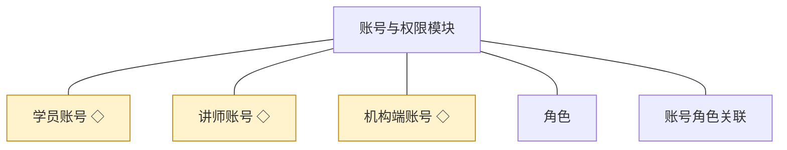
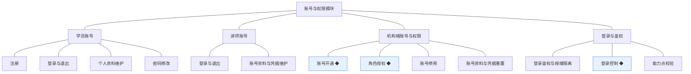
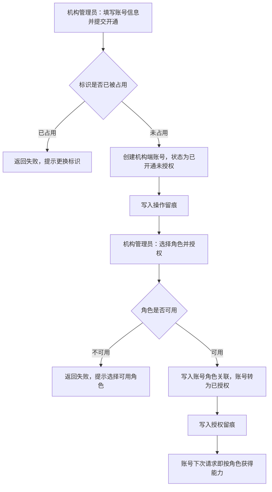
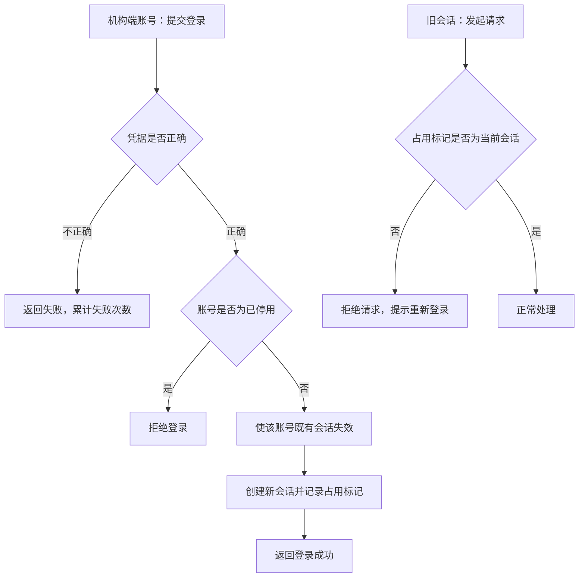
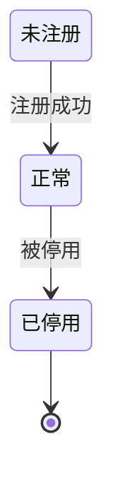
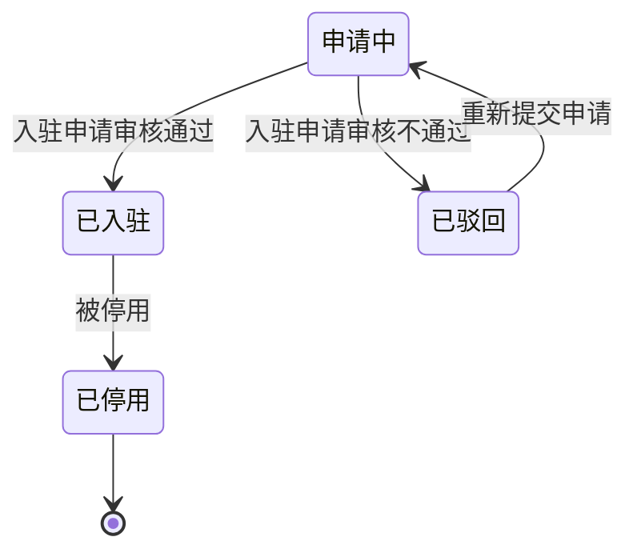
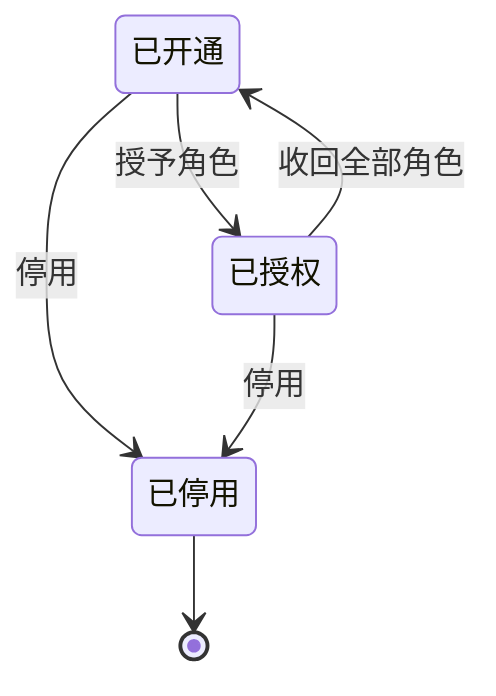

# 模块设计：账号与权限

> 定位：对应技术文档分包「账号与权限模块」，承接《模块总览》第 2.1 节；模拟案例评审稿，规则句末括注来源（D 编号＝项目 PRD 关键设计决策，K 编号见《技术文档（项目）》第 5 节，括注「开发规范」者见《04A-开发规范（项目）》，括注「本轮建议」者为本次拍板）。

## 1. 职责与边界

**管**：三端账号的身份与登录——学员账号、讲师账号、机构端账号的注册或开通、登录与退出、凭据维护；机构端的角色定义与授权；登录控制；并认领三类主体各自的**自助管理面**：学员与讲师的个人中心（自身资料与凭据），机构内部人员的个人设置（自身账号资料与凭据重置）与账号权限（开通、授权、停用）。

**不管**：
- 讲师入驻申请的提交与审核（含讲师账号的产生时机）→ 讲师模块
- 讲师对外展示信息的维护 → 讲师模块
- 课程的归属与内容 → 课程模块
- 订单、学习记录 → 交易模块、学习模块
- 站点对外信息与对接参数 → 站点配置模块

**边界一句话**：本模块只回答「你是谁、能否登录、能做什么」，不回答「你能操作什么业务」。

## 2. 对象

### 2.1 对象结构

### 2.2 对象说明

**学员账号**

- 定位：学员在学员端的身份，是订单与学习记录的归属主体（主体身份类对象，其自助管理面承载个人资料与凭据的维护）(D5)。
- 关键组成：登录凭据、个人资料、账号状态、学员编号。
- 关系与约束：注册即产生；一个有效标识只能对应一个账号；账号被停用后不可登录，但既有订单与学习记录保留；被交易模块与学习模块以标识引用。

**讲师账号**

- 定位：讲师在讲师端的身份，承载登录凭据、讲师信息与所授课程(D5)。
- 关键组成：登录凭据、讲师信息（对外展示的介绍）、账号状态、讲师编号。
- 关系与约束：由入驻申请审核通过后产生，本模块不判断是否可产生，只接受讲师模块的写请求；一人最多一个讲师账号；被课程模块与统计模块以标识引用（本轮建议）。

**机构端账号**

- 定位：机构内部人员在机构端的身份，通过角色获得能力(D6)。
- 关键组成：登录凭据、账号资料、账号状态、机构端账号编号。
- 关系与约束：由机构管理员开通；能力来自所持角色，不直接挂能力点；机构端账号不得在学员端或讲师端登录使用(D5)；被各模块以标识引用作留痕操作人。

**角色**

- 定位：机构端的能力授权单元，是职责模板而非某个人(D6)。
- 关键组成：角色名、角色说明、角色对应的能力点集合（本轮建议）。
- 关系与约束：与机构端账号多对多；一人可持多角色；被引用的角色不可删除；角色的能力点范围由本模块统一维护，其他模块只声明自己的能力点。

**账号角色关联**

- 定位：机构端账号与角色之间的授予关系。
- 关键组成：账号标识、角色标识、授予时间、操作人。
- 关系与约束：账号与角色的组合唯一；解除授予即收回该角色带来的能力；授权变更必须留痕（开发规范）。

### 2.3 共享对象

| 对象 | 共享方式 | 使用方 | 使用契约 |
|---|---|---|---|
| 学员账号 | 标识引用 | 交易模块、学习模块 | 使用方只引用账号标识与状态，不读写凭据与资料 |
| 讲师账号 | 标识引用 | 讲师模块、课程模块、统计模块 | 使用方向本模块请求产生讲师账号，不自建讲师身份 |
| 机构端账号 | 标识引用 | 全部业务模块 | 仅用于记录操作人与审核人，不用于业务判断 |
| 角色 | 统一读取 | 机构端前端与各模块的权限校验 | 各模块只声明能力点，授权数据只在账号与权限模块维护 |

## 3. 功能

### 3.1 功能结构

### 3.2 功能清单（学员账号）

| 功能 | 使用方 | 说明 |
|---|---|---|
| 注册 | 学员 | 以有效标识建立学员账号，注册成功即进入正常状态 |
| 登录与退出 | 学员 | 登录建立会话，退出结束会话 |
| 个人资料维护 | 学员 | 查改自己的账号资料；只对本人开放 |
| 密码修改 | 学员 | 校验原凭据后更新，更新后使既有会话失效（本轮建议） |

### 3.3 功能清单（讲师账号）

| 功能 | 使用方 | 说明 |
|---|---|---|
| 登录与退出 | 讲师 | 与学员账号相互独立，登录态不通用(D5) |
| 账号资料与凭据维护 | 讲师 | 属个人中心能力，只对本人开放 |

### 3.4 功能清单（机构端账号与权限）

| 功能 | 使用方 | 说明 |
|---|---|---|
| 账号开通 ◆ | 机构管理员 | 开设机构端账号，开通后处于已开通（未授权）状态 |
| 角色授权 ◆ | 机构管理员 | 给账号授予或收回角色，授权变更留痕 |
| 账号停用 | 机构管理员 | 停用后不可登录；账号不可删除（被留痕引用，软删除语义） |
| 账号资料与凭据重置 | 机构端全部人员 | 个人设置：维护自身账号资料与登录凭据；重置他人凭据限机构管理员 |
| 登录鉴权与按端隔离 | 三端 | 解析登录态、建立身份上下文；按端校验，跨端不可用(D5) |
| 登录控制 ◆ | 机构端 | 同一账号同一时间仅允许一处登录，新登录使旧会话失效(D6) |
| 能力点校验 | 机构端 | 校验当前身份是否具备该能力点；前端隐藏不作为安全边界（开发规范） |

### 3.5 ◆ 复杂功能：机构端账号开通与角色授权

**说明**：机构管理员在机构端开设账号并授予角色——账号落为已开通状态，授予角色后进入已授权状态并立即获得对应能力；两次动作均需留痕，且角色被引用后不可删除（D6，开发规范）。

规则：

1. 账号标识（登录名）全站唯一，重复时开通失败（本轮建议）。
2. 未授权账号可以存在，但除个人设置外无任何业务能力(D6)。
3. 授权与解除授权必须留痕：操作人、时间、角色变化(D6，开发规范)。
4. 被账号引用的角色不可删除，只能停用或调整能力点（本轮建议）。
5. 停用账号时必须同时解除其全部授权关系(D6)。

### 3.6 ◆ 复杂功能：登录控制（单会话占用）

**说明**：机构端要求同一账号同一时间仅在一处登录；新的登录成功后，旧会话立即失效，旧会话的请求被拒绝并提示需重新登录(D6)。

规则：

1. 会话占用标记存于服务端可控存储，使旧会话可被即时失效(K4)。
2. 登录成功、退出登录、修改凭据、被停用四种情况都必须更新占用标记（本轮建议）。
3. 学员端与讲师端的登录控制规则留版本级细化，本模块只保证机制可用（留版本级）。

## 4. 状态

**学员账号**

| 流转 | 触发条件 | 伴随动作与约束 |
|---|---|---|
| 未注册 → 正常 | 注册成功 | 生成学员编号；写入创建留痕 |
| 正常 → 已停用 | 机构侧处置（本轮建议） | 使既有会话失效；订单与学习记录保留 |

**讲师账号**

| 流转 | 触发条件 | 伴随动作与约束 |
|---|---|---|
| 申请中 → 已入驻 | 讲师模块的审核通过写请求 | 账号可用；讲师信息可维护 |
| 申请中 → 已驳回 | 审核不通过 | 账号不可用；可重新申请 |
| 已入驻 → 已停用 | 机构侧处置 | 使既有会话失效；课程按课程模块规则处置（关联评审） |

**机构端账号**

| 流转 | 触发条件 | 伴随动作与约束 |
|---|---|---|
| 已开通 → 已授权 | 至少授予一个角色 | 能力按角色生效；写入授权留痕 |
| 已授权 → 已开通 | 收回全部角色 | 能力即时失效；写入授权留痕 |
| 已开通／已授权 → 已停用 | 机构管理员停用 | 解除全部授权；使既有会话失效 |

**角色**：无生命周期状态，只有被授予关系的增删（本轮建议）；被引用时不可删除。

## 5. 对外契约

| 操作 | 语义 | 调用方 | 关键约束 |
|---|---|---|---|
| 产生讲师账号 | 入驻申请审核通过后建立讲师账号 | 讲师模块 | 同一学员账号最多产生一个讲师账号；同事务完成 |
| 查询账号状态 | 供业务模块判断账号是否可用 | 交易、学习、课程 | 只返回状态与标识，不返回凭据 |
| 校验能力点 | 判断当前机构端身份是否具备某能力 | 机构端各模块 | 前端隐藏不作为安全边界，服务端必须校验 |
| 提供身份上下文 | 供各模块取当前操作人与审核人 | 全部业务模块 | 身份必须来自登录态解析，业务层不得自行解析凭据 |

## 6. 待议与版本级事项

**本轮建议**：角色对应的能力点集合由本模块统一维护；讲师账号与学员账号建立一对一关联（同一人先学后教）(D5)；停用账号需同时解除授权。

**待业务确认**：学员注册与登录的具体方式（手机号／邮箱／第三方）未明确；机构是否需要多个管理员的细分角色；账号停用的处置人（机构管理员或运营人员）。

**留版本级**：学员端与讲师端的登录控制强度（是否同样单会话）；登录失败次数限制与锁定策略；会话有效期；机构端账号列表与查询的筛选条件。

**明确不做**：不做外部身份源对接（单点登录、企业目录）；不做学员的账号注销功能（本期以停用代替）；不做角色的自定义能力点编排界面。

**关联评审**：讲师账号被停用后其在售课程与已售学员的处置，需与课程模块、交易模块、学习模块共同确认；此规则会改变课程可见范围，属跨模块约定。
