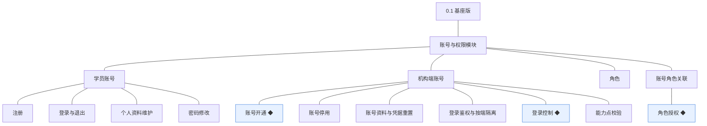
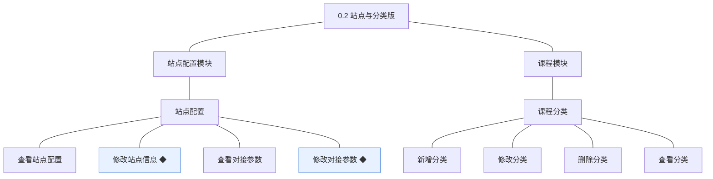
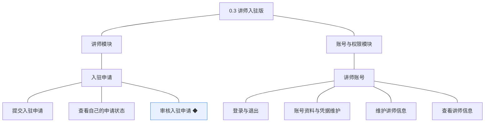
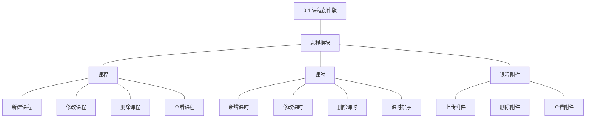
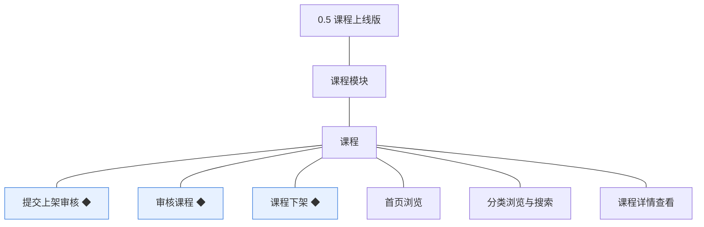
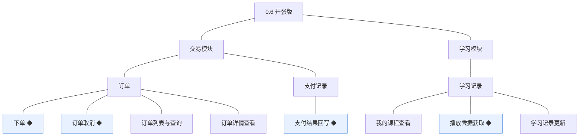
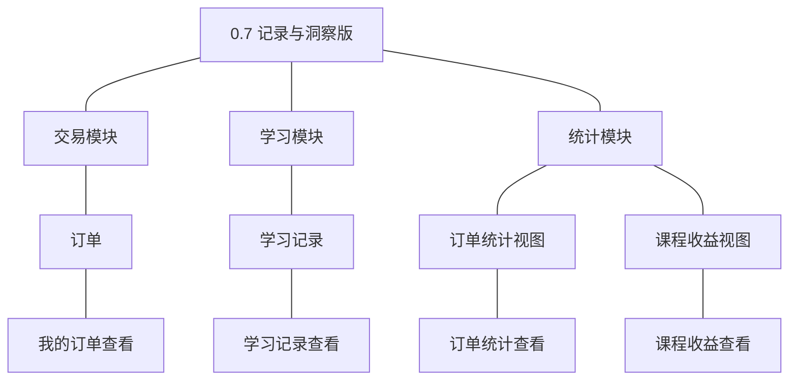

# 产品路线图（项目）：领课教育

> 定位：项目开发的步骤说明书＋大版本母版；本文是**活文档**（每个版本结束后复盘修订后续步骤）；承接《PRD（项目）》《技术文档（项目）》《模块总览》与各模块详细设计（04C）；规则与判断句末括注来源（D 编号＝项目 PRD 关键设计决策，模块名指 04C 分文档，括注「本轮拍板」者为本次判断）。模拟案例评审稿，模拟性质保留。

## 1. 拆分思路

按「先准备、后开张、再收口」推进：先把机构自己那一侧的准备能力分两个版本做出来（账号与权限；站点与分类），再沿内容供给链把讲师、课程创作、课程上线三版逐一点亮，然后用一个开张版把成交与交付同时打通（学员买得成、学得到），最后用一版收口把由成交与学习数据派生的记录与结果呈现给各角色。拆分纪律如下：

- **MVP 先行**：0.6 为开张版本，一次性交付最小可经营闭环（成交＋交付）；开张前的内部准备收敛为两个版本（0.1 账号与权限、0.2 站点与分类），各自交付可验证的内部可用价值（本轮拍板）。
- **每步一个主题**：0.1 身份与权限、0.2 站点与课程骨架、0.3 内容供给方、0.4 课程创作、0.5 课程对外可用、0.6 成交与交付、0.7 记录与结果呈现，均为纵向主题，不横向切功能层（本轮拍板）。
- **步幅均衡**：各版交付功能数在 4～11 之间；0.6 为最大单步（成交与交付必须同时到位才可开张，拆开则任一半都不构成可经营闭环）（本轮拍板）。
- **目的与归属**：每个功能唯一归属其主题被点亮的版本；学员购买记录与学习记录入口属非成交必需能力，归 0.7 收口版（本轮拍板）。
- **自助管理面完整交付**：机构端个人设置随基座版 0.1 一体交付；学员个人资料与凭据随 0.1 的学员账号交付；讲师账号的资料与凭据随其对象产生的 0.3 交付（本轮拍板）。
- **依赖定序**：内容（0.2 分类 → 0.4 课程 → 0.5 上线）先于交易（0.6），交易先于统计（0.7）；对象与模块就绪才算依赖（本轮拍板）。
- **风险前置**：支付渠道与商户开户、学员身份方式、视频与存储服务商的定案与启动分别前置到 0.1、0.2，见各版依赖行（本轮拍板）。

## 2. 版本序列

### 2.1 0.1 基座版

**功能清单**（承接各模块详细设计 04C，只列本版交付，按模块分列）

**账号与权限模块**
| 功能 | 使用方 | 说明 |
|---|---|---|
| 注册 | 学员 | 建立学员账号，注册成功即正常状态（D5） |
| 登录与退出 | 学员 | 建立与结束会话 |
| 个人资料维护 | 学员 | 自助管理自己的资料，只对本人开放（D5） |
| 密码修改 | 学员 | 自助更新凭据，更新后使既有会话失效（04C-账号与权限 3.2） |
| 账号开通 ◆ | 机构管理员 | 开通机构端账号，落为已开通（未授权）状态（D6） |
| 账号停用 | 机构管理员 | 停用后不可登录，账号软删除（04C-账号与权限 3.4） |
| 账号资料与凭据重置 | 机构端全部人员 | 个人设置：维护自身资料与凭据；重置他人凭据限机构管理员 |
| 登录鉴权与按端隔离 | 三端 | 解析登录态、建立身份上下文，跨端不可用（D5） |
| 登录控制 ◆ | 机构端 | 同一账号同一时间仅一处登录，新登录使旧会话失效（D6） |
| 能力点校验 | 机构端 | 服务端校验能力点，前端隐藏不作为安全边界（开发规范） |
| 角色授权 ◆ | 机构管理员 | 授予或收回角色，变更即时生效并留痕（D6） |

**核心流程说明**

- **机构端账号开通与角色授权**：填写账号信息 → 校验标识唯一 → 创建账号（已开通未授权） → 授予角色 → 写入关联与留痕 → 下次请求即按角色获得能力（04C-账号与权限 3.5）。
- **登录控制（单会话占用）**：提交登录 → 校验凭据与状态 → 使既有会话失效 → 创建新会话并记占用标记 → 旧会话请求被拒绝（04C-账号与权限 3.6）。
- **状态边界**：未授权账号可存在于系统，但除个人设置外无任何业务能力；停用账号必须同时解除全部授权关系（04C-账号与权限 3.5）。

- **目标**：机构能开通自己的后台账号并按岗位分工授权，学员能注册登录，全站的身份与权限底座可用（业务可感知：机构人员凭账号进入后台、学员凭账号进入门户）。
- **沿用**：无（首个版本）。
- **不做**：不做外部身份源对接与单点登录；不做学员账号注销；不做角色的自定义能力点编排界面（04C-账号与权限 第 6 节）。
- **依赖**：无前置版本；**待定决策**——学员注册与登录方式（手机号／邮箱／第三方）本版立项时定案，若定为验证码方式则短信服务随定案同步申请（长周期外部依赖，本版收口）；**待定决策**——支付渠道与商户开户本版立项时定案并启动开户（长周期外部流程，0.6 收口）；**待定决策**——机构是否设多个细分角色、账号停用的处置人，本版立项时定案；**留版本级细化项本版立项时定案**——学员端与讲师端的登录控制强度（是否同样单会话）、登录失败次数限制与锁定策略、会话有效期、机构端账号列表与查询的筛选条件（04C-账号与权限）。
- **完成标志**：机构管理员能开通账号并完成一次角色授权，被授权账号登录后能且仅能操作系统内的对应能力；同一账号在第二处登录后，第一处会话立即失效。
- **验证假设**：机构真的会按角色分工使用后台（判定方式：完成标志达成后，机构在一个运营周期内除管理员外至少有一个运营岗位账号被实际使用）。

### 2.2 0.2 站点与分类版

**功能清单**（承接各模块详细设计 04C，只列本版交付，按模块分列）

**站点配置模块**
| 功能 | 使用方 | 说明 |
|---|---|---|
| 查看站点配置 | 机构管理员、机构运营人员 | 查看站点对外信息与对接参数，敏感项脱敏展示（开发规范） |
| 修改站点信息 ◆ | 机构管理员 | 校验必填与标识唯一后保存并留痕（04C-站点配置 3.3） |
| 查看对接参数 | 机构管理员 | 查看外部服务接入项，不回显完整密钥 |
| 修改对接参数 ◆ | 机构管理员 | 保存前做连通性校验，只对新发起的对接生效（04C-站点配置 3.4，D7） |

**课程模块**
| 功能 | 使用方 | 说明 |
|---|---|---|
| 新增分类 | 机构运营人员 | 建立分类并指定层级与排序 |
| 修改分类 | 机构运营人员 | 改名与调整层级、排序 |
| 删除分类 | 机构运营人员 | 软删除；被课程引用时不可删（04C-课程 3.2） |
| 查看分类 | 机构端、学员端 | 机构端看全量，学员端只看可用分类 |

**核心流程说明**

- **站点信息修改**：编辑对外信息 → 校验必填与长度 → 校验站点标识唯一 → 保存并留痕 → 门户按新信息呈现（04C-站点配置 3.3）。
- **对接参数修改**：填写接入项 → 校验齐备 → 连通性校验 → 通过则保存并留痕、不通过保留原参数 → 新发起的对接用新参数、已发出的播放凭据不受影响（04C-站点配置 3.4）。

- **目标**：机构以自己的名义把站点配出来，并把课程分类骨架搭好，为内容进入做好准备（业务可感知：站点对外信息可配置、分类可作为课程归属）。
- **沿用**：0.1 交付的机构端账号开通与角色授权——进入后台与配置权限的前提。
- **不做**：不做多站点与多域名；不做页面装修与模板编辑；不做人工推荐位配置（见第 3 节暂缓清单）。
- **依赖**：0.1（机构端账号与角色授权就绪）；**待定决策**——视频与存储服务商本版立项时定案（本版交付其对接参数），服务商账号与配置随定案同步申请（外部依赖，0.4 与 0.6 消费）；**留版本级细化项本版立项时定案**——站点信息的字段清单与长度限制、对接参数的具体条目（依所选服务商而定）、是否支持参数的多套预设与切换（04C-站点配置）。
- **完成标志**：机构管理员完成一次站点信息修改与一次对接参数修改，修改后的参数通过连通性校验并落痕；机构运营人员建成至少一个分类，且该分类可被后续课程选用。
- **验证假设**：机构愿意以自助方式完成对外配置与课程骨架搭建，不需要人工代配（判定方式：完成标志达成后，分类与站点配置的后续修改均由机构自行完成）。

### 2.3 0.3 讲师入驻版

**功能清单**（承接各模块详细设计 04C，只列本版交付，按模块分列）

**讲师模块**
| 功能 | 使用方 | 说明 |
|---|---|---|
| 提交入驻申请 | 学员 | 以本人学员账号提交；存在待审核申请时不得重复提交（04C-讲师 3.2） |
| 查看自己的申请状态 | 申请人 | 查看待审核／已通过／未通过与审核意见 |
| 审核入驻申请 ◆ | 机构运营人员 | 通过时同事务产生讲师账号；结论终态不可改判（D4、D5） |
| 维护讲师信息 | 讲师 | 维护对外展示的介绍，只对本人开放 |
| 查看讲师信息 | 学员端、机构端 | 只读，供课程详情展示讲师介绍 |

**账号与权限模块**
| 功能 | 使用方 | 说明 |
|---|---|---|
| 登录与退出 | 讲师 | 登录态与学员端不通用（D5） |
| 账号资料与凭据维护 | 讲师 | 讲师端的个人中心，只对本人开放 |

**核心流程说明**

- **审核入驻申请**：机构运营人员审阅申请 → 通过则同事务产生讲师账号 → 落审核结论并留痕；不通过则落结论并记录意见、申请人可提交新申请（04C-讲师 3.3）。
- **状态边界**：入驻申请结论一经作出即为终态；讲师账号状态由账号与权限模块承载，本版只在审核通过时触发「申请中 → 已入驻」（04C-讲师 第 4 节）。

- **目标**：课程供给方进入系统——学员能申请成为讲师、机构能把住入驻关口、通过者能登录讲师端（业务可感知：平台有了可授课的讲师身份）。
- **沿用**：0.1 交付的学员账号与机构端权限——申请需学员身份、审核需运营人员权限。
- **不做**：不做讲师分级与资质认证；不做机构直接开设讲师账号（讲师身份一律经入驻审核产生，D5）。
- **依赖**：0.1（学员账号与机构端审核权限就绪）；**待定决策**——入驻申请的填写项（资质材料、联系方式）与是否需要有效期本版立项时定案，决定审核依据；**留版本级细化项本版立项时定案**——审核操作的界面与批量审核能力、讲师信息的展示字段（04C-讲师）。
- **完成标志**：一名学员提交入驻申请并被机构审核通过后，获得可用状态的讲师账号并能登录讲师端；另一名被审核不通过的申请人看到审核意见且可再次提交。
- **验证假设**：讲师愿意自助完成入驻申请，机构有能力在合理时限内完成审核（判定方式：完成标志达成后，首批申请中审核通过比例与审核耗时可由机构自行确认是否可接受）。

### 2.4 0.4 课程创作版

**功能清单**（承接各模块详细设计 04C，只列本版交付，按模块分列）

**课程模块**
| 功能 | 使用方 | 说明 |
|---|---|---|
| 新建课程 | 讲师 | 建立课程草稿，归属本人讲师账号 |
| 修改课程 | 讲师 | 修改基本信息、价格与归属分类（已发布课程的修改规则见 0.5 依赖行） |
| 删除课程 | 讲师、机构管理员 | 软删除；被订单或学习记录引用时不可删（04C-课程 3.3） |
| 查看课程 | 讲师（本人课程）、机构端（全部） | 含审核意见与当前状态 |
| 新增课时 | 讲师 | 为本人课程新增课时并上传内容引用 |
| 修改课时 | 讲师 | 修改标题与内容引用 |
| 删除课时 | 讲师 | 软删除（04C-课程 3.4） |
| 课时排序 | 讲师 | 调整课时学习顺序 |
| 上传附件 | 讲师 | 上传资料至外部存储并保存引用（D7） |
| 删除附件 | 讲师 | 软删除并保留引用关系 |
| 查看附件 | 讲师 | 查看本人课程下的附件清单 |

**核心流程说明**

- **课程内容成型**：新建课程草稿 → 归属本人讲师账号与既有分类 → 新增课时并上传内容引用 → 上传配套附件 → 调整课时顺序，形成可送审的课程内容（04C-课程 2.2）。
- **内容存储边界**：课时与附件的内容本体存外部存储，本模块只保存引用与元信息，接入参数取自站点配置模块（开发规范，D7）。

- **目标**：讲师能把自己的课在系统里做出来——课程、课时与配套资料齐备（业务可感知：草稿形态的课程内容已在系统内）。
- **沿用**：0.2 交付的课程分类与对接参数——课程归属分类、内容上传需外部服务参数；0.3 交付的讲师账号——课程归属前提。
- **不做**：不做直播与实时课堂；不做课件在线编辑；不做大文件断点续传以外的上传增强（留版本级）。
- **依赖**：0.3（讲师账号就绪，课程才有归属）；0.2（分类与对接参数就绪）；**外部依赖**——视频与存储服务商账号与配置已就绪（定案与申请见 0.2）；**留版本级细化项本版立项时定案**——课程字段与校验规则、课程价格形式、上传文件的大小与格式限制、分类层级深度。
- **完成标志**：讲师为本人账号建成一门含至少一个课时与一个附件的课程草稿，保存后再次进入可见全部内容与顺序；非本人账号无法看到该课程草稿。
- **验证假设**：讲师能独立完成课程内容制作，不需要机构代为录入（判定方式：完成标志达成后，首批课程中由讲师自助完成的比例）。

### 2.5 0.5 课程上线版

**功能清单**（承接各模块详细设计 04C，只列本版交付，按模块分列）

**课程模块**
| 功能 | 使用方 | 说明 |
|---|---|---|
| 提交上架审核 ◆ | 讲师 | 校验基本信息与至少一个课时后进入待审核（D4） |
| 审核课程 ◆ | 机构运营人员 | 通过即发布；不通过必须给出修改意见（D4） |
| 课程下架 ◆ | 机构管理员、机构运营人员 | 已发布课程下架，学员端不再可见，既有学习资格保留（04C-课程 3.9） |
| 首页浏览 | 学员端 | 展示由已发布课程构成的推荐内容与分类入口 |
| 分类浏览与搜索 | 学员端 | 只返回已发布课程，支持按分类浏览与关键词检索 |
| 课程详情查看 | 学员端 | 展示课程介绍、讲师介绍、目录与价格 |

**核心流程说明**

- **提交上架审核**：讲师提交 → 校验状态允许送审 → 校验基本信息完整与至少一个课时 → 转为待审核并留痕 → 进入机构待审列表（04C-课程 3.7）。
- **审核课程**：机构运营人员审阅 → 取身份上下文作为审核人 → 结论与课程状态同事务落库 → 通过即发布、不通过则记录意见退回讲师修改后重提（04C-课程 3.8）。
- **课程下架**：对已发布课程执行下架 → 校验状态 → 转为已下架并留痕 → 学员端不再展示、既有学习资格保留（04C-课程 3.9）。

- **目标**：课程从机构侧把关后对外可见——学员端能浏览、搜索与查看课程详情（业务可感知：门户上有可看的课程）。
- **沿用**：0.4 交付的课程与课时、附件内容；0.2 交付的分类。
- **不做**：不做人工推荐位配置（推荐取自动规则，留版本级）；不做课程评价与问答；不做试看。
- **依赖**：0.4（课程内容成型才能送审与展示）；**待定决策**——已发布课程的修改是否强制重新送审本版立项时定案（影响课程状态机与讲师操作路径）；**留版本级细化项本版立项时定案**——列表与详情的展示字段、学员端可见状态与空态处理。
- **完成标志**：一门课程经讲师送审、机构审核通过后出现在学员端首页、分类浏览与搜索结果中，且详情页可见讲师介绍、课程目录与价格；审核不通过的课程不出现在学员端任何入口。
- **验证假设**：先审后发的把关不会成为讲师上架的主要阻碍，且学员端可见课程的呈现足以支撑购买判断（判定方式：审核一次通过率与讲师平均送审轮次，由机构在首轮课程上线后确认是否可接受）。

### 2.6 0.6 开张版

**功能清单**（承接各模块详细设计 04C，只列本版交付，按模块分列）

**交易模块**
| 功能 | 使用方 | 说明 |
|---|---|---|
| 下单 ◆ | 学员 | 校验课程可售与重复购买后生成待支付订单（D8） |
| 订单取消 ◆ | 学员 | 仅待支付订单可取消；取消后课程可重新下单（04C-交易 3.5） |
| 支付结果回写 ◆ | 支付渠道回调、机构端人工核对 | 以外部单据号幂等；金额不一致不得改订单状态（D8） |
| 订单列表与查询 | 机构运营人员 | 按时间、课程等条件查询订单 |
| 订单详情查看 | 机构运营人员 | 查看订单明细与支付留痕 |

**学习模块**
| 功能 | 使用方 | 说明 |
|---|---|---|
| 我的课程查看 | 学员 | 列出本人具备学习资格的课程 |
| 播放凭据获取 ◆ | 学员 | 校验学习资格后换取播放凭据，并更新学习记录（D7） |
| 学习记录更新 | 本模块内部（由播放行为触发） | 更新最近学习的课时与时间，须幂等（开发规范） |

**核心流程说明**

- **下单**：学员提交订单 → 校验课程已发布 → 校验无未取消订单 → 生成待支付订单并留痕 → 进入支付（04C-交易 3.3）。
- **支付结果回写**：渠道回调 → 以外部单据号查重 → 首次则校验金额 → 通过则订单转已支付并写入支付记录、状态留痕，同事务完成；重复回调返回相同结果且不改数据（04C-交易 3.4）。
- **播放凭据获取**：学员请求播放 → 学习模块向交易模块查询是否存在已支付订单 → 无资格则拒绝发放（介绍与目录仍可看） → 有资格则读取课时内容引用 → 向媒体接入模块换取凭据 → 更新学习记录并返回凭据（04C-学习 3.3）。
- **状态边界**：学习资格不落库，以订单状态为唯一依据即时判定，避免两处状态不一致（04C-学习 第 4 节）。

- **目标**：系统可以真实开张——学员在门户买课并在线学习，机构能看到订单（业务可感知：完成第一笔真实成交并完成学习）。
- **沿用**：0.5 交付的已发布课程与对外展示；0.1 交付的学员账号与登录。
- **不做**：不做退款与售后、发票、优惠券与组合购买、购物车、人工推荐位；不做学员侧订单查询与学习记录查询入口（归 0.7）。能力真空期过渡：学员查订单回退人工——由机构用本版交付的「订单列表与查询」「订单详情查看」代查答复；学习入口以本版交付的「我的课程查看」为准；退款售后回退人工——机构凭本版交付的「订单详情查看」（含支付留痕）线下核实处理，不建售后对象、不走系统流程。
- **依赖**：0.5（课程先可售）与 0.4、0.2（课程内容与外部服务参数就绪）；**外部依赖**——支付渠道商户开户须已就绪（渠道定案与开户启动的唯一时点在 0.1，本版只消费不再定案；结算与对账不排期，见第 3 节暂缓清单）；**待定决策**——订单是否支持超时自动关闭、学习进度的计算口径、是否记录每个课时的明细进度、是否提供试看，本版立项时定案；**留版本级细化项本版立项时定案**——支付超时时间、订单的可查询条件与分页、支付渠道的类型清单、机构端订单列表字段、播放凭据有效期与续期方式（04C-交易、04C-学习）。
- **完成标志**：按灰度台阶全部通过——① 环境联调通过；② 内部全流程演练（内部账号走完下单→支付→播放→学习记录）；③ 小额真实单成功（真实支付完成、课程进入我的课程、可播放）；④ 全量开放。四台阶全部通过并留证后，本版视为完成。
- **验证假设**：学员真的会在线上完成买课与学习，机构能凭订单信息独立处理售后咨询（判定方式：小额真实单通过后，首笔由外部真实学员完成的成交及其学习记录可查；灰度未过期间只冻结全量开放，不阻塞 0.7 的开发立项）。

### 2.7 0.7 记录与洞察版

**功能清单**（承接各模块详细设计 04C，只列本版交付，按模块分列）

**交易模块**
| 功能 | 使用方 | 说明 |
|---|---|---|
| 我的订单查看 | 学员 | 查看本人订单及状态，只对本人开放（购买记录，归收口版） |

**学习模块**
| 功能 | 使用方 | 说明 |
|---|---|---|
| 学习记录查看 | 学员 | 查看本人各课程的学习记录与进度 |

**统计模块**
| 功能 | 使用方 | 说明 |
|---|---|---|
| 订单统计查看 | 机构管理员、机构运营人员 | 按时间范围与课程维度查看订单统计结果（D8） |
| 课程收益查看 | 讲师、机构管理员 | 讲师只看本人课程；机构可看全部（D8） |

**核心流程说明**

- **两侧结果同源**：机构侧订单统计与讲师侧课程收益均由交易模块的已支付且未取消订单派生，金额与区间口径一致；订单取消后从结果中扣除（04C-统计 3.3，D8）。
- **查询边界**：统计模块只读不写，回写业务数据属违规；讲师越权请求一律拒绝（04C-统计 3.3，D6）。

- **目标**：开张之后把数据用起来——学员能查自己的购买记录与学习记录，机构与讲师能看到经营与收益结果（业务可感知：三方各自的记录与结果入口就位）。
- **沿用**：0.6 交付的订单、支付记录与学习记录数据与页面（本版只补记录入口与结果呈现）。
- **不做**：不做多机构对比与行业对标；不做经营预测；不做结算与对账流程；不做统计导出（留版本级）。
- **依赖**：0.6（订单与学习数据对象就绪）；**留版本级细化项本版立项时定案**——统计的展示维度与默认时间范围、图表形态、导出格式与权限、时间区间的最大跨度（04C-统计）、学习进度的展示口径、最近学习时间的展示粒度（04C-学习）。
- **完成标志**：学员能在个人中心查到本人订单与学习记录；机构能按时间范围看到订单统计结果；讲师能看到本人课程的收益，且讲师请求他人课程收益被拒绝；同一批订单在机构统计与讲师收益中的金额口径一致。
- **验证假设**：机构与讲师会依据统计结果调整课程与招生（判定方式：开张后首个复盘周期内，机构依据统计结果做出的至少一次课程或招生调整有据可查）。

## 3. 节奏与调整

- **版本复盘与修订**：每个版本结束后做双复盘——**完成标志**是否达成、**验证假设**是否被证实或证伪；依据结论修订后续版本的顺序与范围（本文是活文档）。
- **立项门槛三层**：完成标志达成即可立项下一版；灰度冻结的只是全量开放与同一风险面上的对外发布，不阻塞后续版本的开发立项；数据积累类验证假设一律不阻塞立项，只影响复盘修订。
- **上游联动点**：D5（身份与账号）变更（如讲师账号改为机构直接开设）影响 0.3 与 0.6 的依赖与切片图；D7（外部服务可替换）、D8（经营口径）变更分别影响 0.2/0.4/0.6 的外部依赖与 0.7 的统计来源；技术文档第 7 节备忘的服务商与支付渠道结论落定后，回填 0.2、0.6 的依赖行。

**暂缓清单**

| 暂缓项 | 理由与去向 |
|---|---|
| 退款、售后与发票 | PRD 备忘待议项，本期明确不做（PRD 备忘 3）；如纳入，将新增订单状态与售后对象，需回到 PRD 层评审 |
| 人工推荐位与运营内容编排 | PRD 备忘待议项（站点运营位维护归属未定）；0.5 的首页推荐取自动规则，人工配置待业务确认后再决定是否增补 0.2 或新增版本 |
| 结算与对账 | PRD 备忘待议项（结算方式未定）；0.7 的收益只做呈现，不做结算 |
| 试看能力；导出与报表下载 | 均为版本级功能，待业务确认后再排：试看挂 0.6 依赖行（待定决策，本版立项时定案），导出挂 0.7 依赖行（留版本级细化项） |
| 讲师分级、资质认证 | 与本期不做项一致，未纳入 |
| 直播、考试与题库、任务打卡、社区问答，以及原生 App 与小程序 | PRD 明确不做（D1、D3）；引入属本质范围或端结构变化 |

**评审遗留**

- 本次生成时发现上游遗漏一处并已在 04C 就地修正：学员端「首页浏览」原未进入《04C-课程》的对外展示功能清单，已在《04C-课程》3.1 与 3.6 补入，本路线图据此在 0.5 引用（其余上游条目均已找到出处）；PRD 备忘第 1 项（首页推荐位维护归属）落于暂缓清单，若业务确认需要人工配置，0.2 与 0.5 需同步扩围。
- 复核修订（2026-09-20）：按路线图检查表第 7 条把各模块「留版本级」细化项逐项挂到唯一版本依赖行——0.1 补挂《04C-账号与权限》四项（登录控制强度、登录失败锁定策略、会话有效期、机构端账号列表筛选）、0.2 补挂《04C-站点配置》三项（站点字段清单与长度、对接参数具体条目、多套预设切换）、0.3 补挂《04C-讲师》两项（审核界面与批量审核、讲师信息展示字段）、0.6 补挂《04C-交易》两项（订单可查询条件与分页、支付渠道类型清单）并把《04C-学习》「是否记录每个课时的明细进度」挂入待定决策、0.7 补挂《04C-统计》「时间区间的最大跨度」与《04C-学习》「最近学习时间的展示粒度」；按检查表第 9 条把支付渠道决策链定案时点收敛为 0.1 唯一时点，0.6 依赖行删去重复的「支付渠道的对接与结算方式」待定决策（「结算方式」表述与暂缓清单「结算与对账」口径易混，一并去除，0.6 只消费已定案渠道并细化对接参数）。
