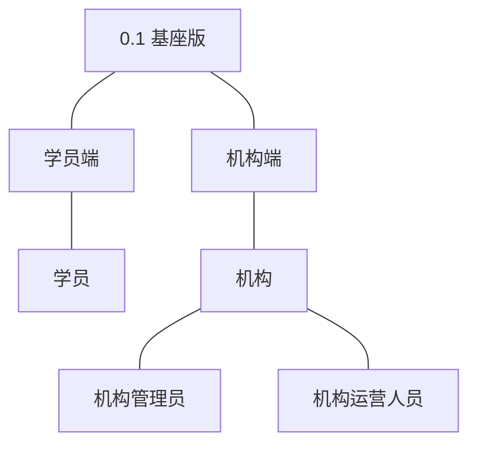
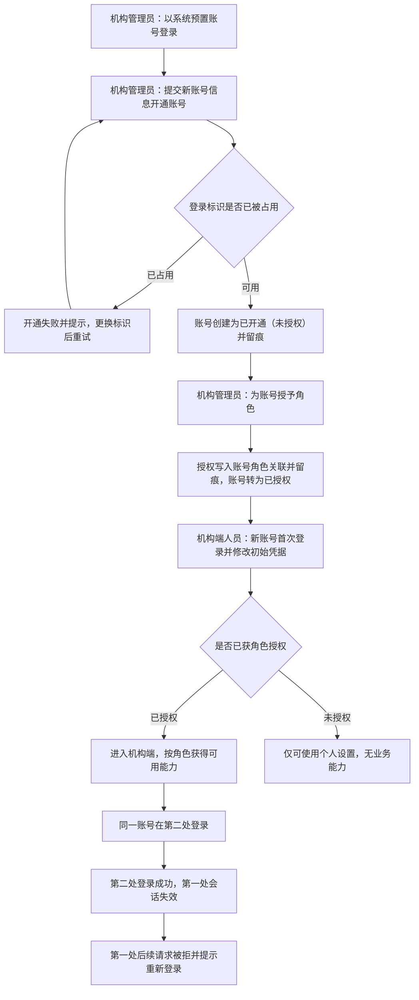
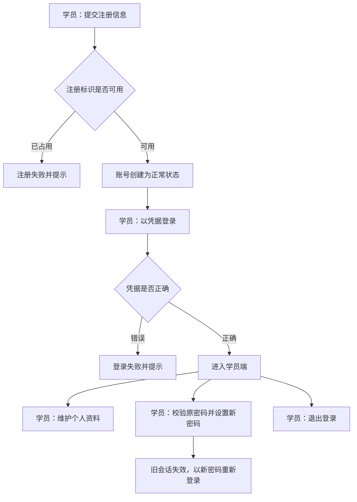
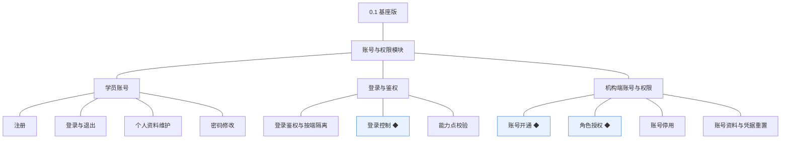
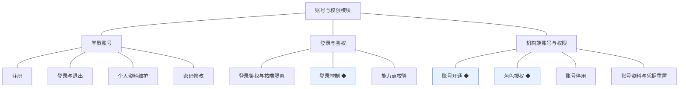
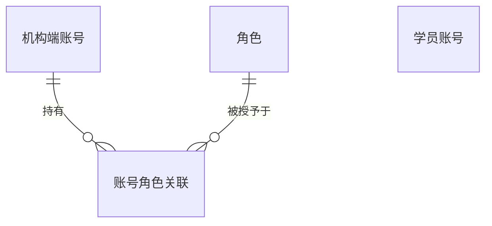
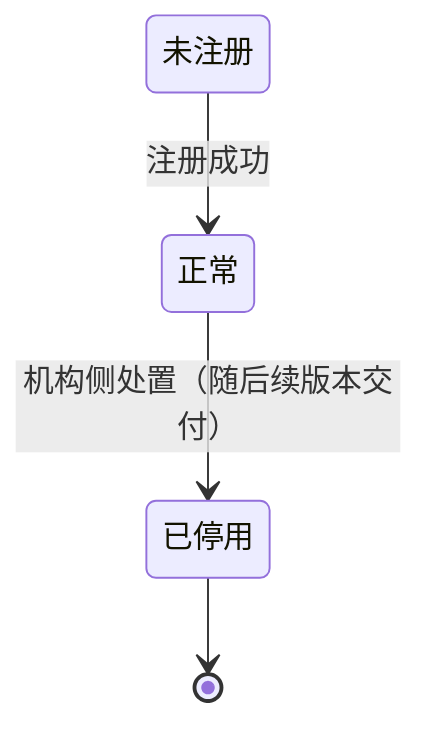
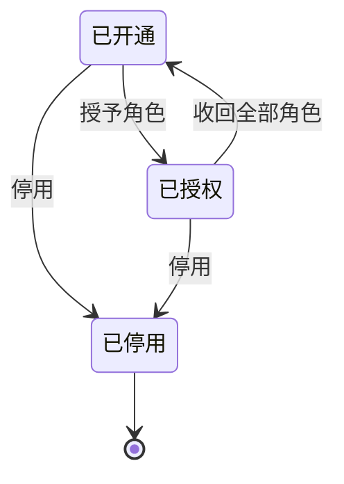

# PRD（大版本）：0.1 基座版

> 定位：本版立项说明书——承接《产品路线图（项目）》0.1 基座版条目与《PRD（项目）》的身份与权限基线，界定本版做什么、每个功能做到什么程度算完成，供需求拆解与小版本规划直接开工。上游为模拟案例材料，模拟性质保留；版本级默认值就地标注来源状态。

## 1. 版本概述

**承接与目标**：机构能开通自己的后台账号并按岗位分工授权，学员能注册登录，全站的身份与权限底座可用（路线图 0.1 目标）。本版只交付账号与权限模块的能力：学员侧的自助注册、登录与凭据资料维护；机构端的账号开通、角色授权、停用与凭据重置；以及贯穿三端的登录鉴权、按端隔离、登录控制与能力点校验。

**成功标准与量化口径**：① 机构管理员能完成一次「开通账号并授予角色」，被授权账号登录后能且仅能操作所授角色对应的能力（判定线 100%——本版机构端无越权豁免入口，任何越权或漏权均按权限链异常排查）；② 同一机构端账号在第二处登录后，第一处会话立即失效（判定线 100%——本版登录控制无豁免场景）；③ 学员注册、登录、资料与密码维护全程自助（判定线 100%——本版不存在任何人工开户入口，低于判定线按链路异常排查）。

**范围一句话**：做——三端身份底座（学员账号自助、机构端账号与角色授权、登录鉴权与按端隔离、登录控制、能力点校验、个人设置）；不做——讲师端与讲师账号（随 0.3 交付）、机构端业务功能（站点配置、审核、订单等随 0.2 起）、外部身份源对接与单点登录、学员账号注销、自定义能力点编排界面。本版为版本链首个版本，无已发生业务，无能力真空期；机构端账号本版开通后仅可使用个人设置，属**先行基座**（供 0.2 起的业务功能接入），非过渡支撑。

**沿用与前置**：无前置版本、无沿用对象；主体与角色、端名、账号状态枚举与编码（学员编号、机构端账号编号）逐字沿用《术语表（项目）》。

## 2. 主体与角色

| 主体／角色 | 端 | 怎么用系统 |
|---|---|---|
| 学员 | 学员端 | 自助注册与登录，维护个人资料与密码，退出登录 |
| 机构管理员 | 机构端 | 以系统预置的首个机构管理员账号登录，开通机构端账号、授予与收回角色、停用账号、重置他人凭据，维护自身账号资料与凭据 |
| 机构运营人员 | 机构端 | 本版仅以个人设置使用系统（维护自身账号资料与凭据）；其业务能力（分类、审核、订单）随 0.2 起交付 |

**裁剪说明**：讲师主体本版不上场（讲师账号与讲师端随 0.3 交付）；机构运营人员本版无业务能力，其角色先随授权体系预置；系统预置「机构管理员」「机构运营人员」两个角色及各自能力点集合（本轮拍板，角色名沿用术语表登记）。

## 3. 核心业务流程

### 3.1 旅程一：机构管理员为机构人员开通账号并授权使用

机构管理员是本版机构侧的起点：以系统预置账号登录后，先为机构内部人员开通账号（已开通未授权），再授予角色使其获得对应能力点；被授权人员首次登录时修改初始凭据，即可按角色使用机构端。未获授权的账号只能进入个人设置。登录控制贯穿其中：同一账号在第二处登录后，第一处会话立即失效。操作步骤：① 预置管理员登录 → ② 开通账号 → ③ 授予角色 → ④ 新账号首次登录并修改初始凭据 → ⑤ 按角色使用能力（未授权则仅个人设置）→ ⑥ 人员变动时收回角色或停用账号。

### 3.2 旅程二：学员自助注册与凭据维护

学员从注册开始自助完成身份建立：注册成功即账号为正常状态，随后凭据登录进入学员端；在使用中可维护个人资料、修改密码（修改后既有会话失效需重新登录），并可随时退出。操作步骤：① 提交注册 → ② 登录 → ③ 维护资料／修改密码 → ④ 退出登录。本旅程覆盖学员端自助主线；机构端账号停用与凭据重置属管理操作，由验收标准覆盖，不单列旅程。

## 4. 功能需求

### 4.1 账号与权限模块

**学员账号组**：学员在学员端的自助身份能力，注册建立的账号是后续订单与学习记录的归属前提。

| 功能 | 用途 | 验收标准 |
|---|---|---|
| 注册 | 建立学员账号，作为学员在学员端的身份，以及后续订单与学习记录的归属前提 | 学员提交注册信息后系统创建学员账号且状态为正常、可登录；注册标识已被占用时注册失败并给出提示 |
| 登录与退出 | 学员建立与结束会话，作为使用学员端功能的前提 | 学员以正确凭据登录成功进入学员端；凭据错误时登录失败并提示；退出后当前会话结束，再次访问学员端功能需重新登录 |
| 个人资料维护 | 学员自助查看与修改个人资料，只对本人开放 | 学员登录后能查看并修改自己的资料，保存后再次查看为更新后的内容；学员无法查看或修改其他学员的资料 |
| 密码修改 | 学员自助更新登录凭据 | 学员校验原密码后设置新密码成功；新密码生效后原密码无法登录，且修改前已建立的会话失效、需以新密码重新登录 |

**登录与鉴权组**：贯穿三端的登录态机制。版本级默认值：会话默认有效期 7 天，过期后需重新登录（行业惯例默认，本轮拍板）；连续登录失败 5 次锁定 15 分钟（行业惯例默认，本轮拍板）。

| 功能 | 用途 | 验收标准 |
|---|---|---|
| 登录鉴权与按端隔离 | 解析登录态并建立身份上下文，保证各端登录态互不通用 | 学员账号登录后获得学员端身份上下文；携带学员端登录态访问机构端接口时被拒绝并提示无权限 |
| 登录控制 ◆ | 同一机构端账号同一时间仅允许在一处登录，降低账号共享风险 | 同一机构端账号在第二处登录成功后，第一处的会话立即失效，其后续请求被拒绝并提示需重新登录 |
| 能力点校验 | 服务端按所持角色校验当前机构端身份的能力点，作为机构端操作的前提 | 未获授某能力点的机构端账号调用对应能力时被服务端拒绝并返回无权限提示，即使前端未展示该入口 |

**机构端账号与权限组**：机构管理员对机构端账号的生命周期管理。版本级默认值：系统初始化预置首个机构管理员账号，首次登录强制修改初始凭据（行业惯例默认，本轮拍板）。

| 功能 | 用途 | 验收标准 |
|---|---|---|
| 账号开通 ◆ | 机构管理员为机构内部人员开设机构端账号，作为进入机构端的前提 | 机构管理员提交新账号信息后系统创建状态为已开通（未授权）的机构端账号并留有开通留痕；登录标识已被占用时开通失败并提示 |
| 角色授权 ◆ | 机构管理员给机构端账号授予或收回角色，决定其可用能力 | 机构管理员为账号授予角色后，该账号的下一次操作即具备对应能力点；收回角色后对应能力点即时失效；每次授予与收回均留有留痕可查 |
| 账号停用 | 机构管理员停用离职或异常账号，收回后台访问能力 | 机构管理员对机构端账号执行停用后，该账号立即无法登录、既有会话失效；账号与其授权记录保留可查 |
| 账号资料与凭据重置 | 机构端人员自助维护自身账号资料与登录凭据，机构管理员可重置他人凭据 | 机构端人员登录后可修改自己的账号资料与登录凭据；机构管理员可对其他机构端账号重置凭据，重置后旧凭据失效、新凭据可登录 |

## 5. 业务对象

### 5.1 学员账号

定位：学员在学员端的身份，本版承载注册、登录与自助维护；后续版本的订单与学习记录以其为归属主体。

说明：本版账号停留于「正常」；「已停用」的处置流转随后续版本交付（对象机制见模块设计）。注册即建立账号并生成学员编号（编码沿用术语表）；个人资料与登录凭据由学员本版自助维护，密码修改使既有会话失效。

### 5.2 机构端账号

定位：机构内部人员在机构端的身份，通过所持角色获得能力；本版交付其完整生命周期（开通→授权→停用）。

说明：开通即「已开通（未授权）」，授予至少一个角色转为「已授权」，停用为终态且同时解除全部授权关系（机制见模块设计）。版本级默认值：系统初始化预置首个机构管理员账号、首次登录强制修改初始凭据；会话有效期与登录失败锁定默认值见 4.1 登录与鉴权组。机构端账号编号（`AD`＋6 位序号）沿用术语表编码契约。

### 5.3 角色

定位：机构端的能力授权单元，职责模板；本版预置「机构管理员」「机构运营人员」两个角色及各自能力点集合。

说明：角色无生命周期状态，被账号引用时不可删除，只能停用或调整能力点（机制见模块设计，本轮拍板）；本版不提供角色的自定义编排界面（范围围栏）。

### 5.4 账号角色关联

定位：机构端账号与角色之间的授予关系，授权与收回的落点。

说明：账号与角色的组合唯一；授予、收回、随停用解除均同事务留痕（机制见模块设计）；本版无新增沿用路径。
