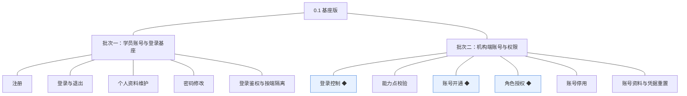
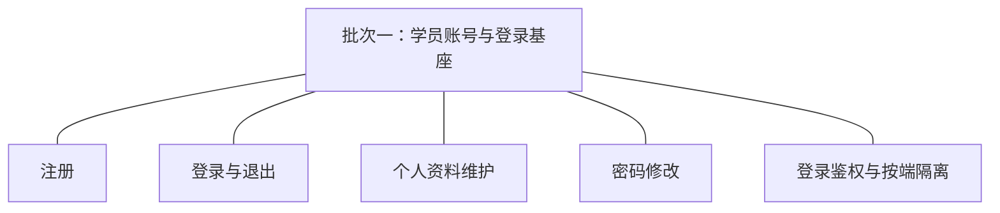
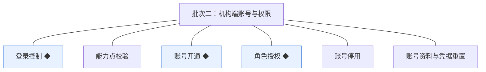

# 开发顺序与需求拆解（大版本）：0.1 基座版

> 定位：把《PRD（大版本）：0.1 基座版》转换为开发批次＋功能级需求条目；本文即该版本的完整需求清单，需求池据此直接入池、不另生成版本快照。上游为模拟案例材料，模拟性质保留。

## 1. 拆解说明

- **一一同构粒度口径**：一条需求（R 编号）＝一项 PRD 功能，需求名即 PRD 功能名；需求表的用途与验收标准**逐字引自 PRD 功能清单原文**，不压缩、不改写。按钮、字段、跳转级的原子拆解归小版本 PRD，不进本文。
- **本文即需求清单**：需求池批量入池直接读本文各批次需求表；池侧不生成版本快照，验收标准回溯本文（R 编号与 PRD 锚点随行可查）。
- **多入口口径**：本文是需求池的主入口但不是唯一入口——会议、沟通、临时反馈产生的需求从其他角度直接进入需求池（M01 起编号），不经本文；两类条目并存互不覆盖。
- **小版本规划的输入**＝本文开发顺序（批次建议，素材而非锁定）＋需求池实时状态，两者合并；唯一硬约束是本文声明的依赖与同事务契约不回退。

## 2. 开发顺序

**前置版本沿用面**：无（0.1 为首个版本）。系统预置项随批次二交付使用：首个机构管理员账号、预置角色（机构管理员、机构运营人员）及其能力点集合（PRD 4.1 版本级默认值）。

**顺序依据与同事务契约**：登录态解析与按端隔离（R5）先于一切依赖登录态的能力（服务端能力先行）；机构端账号链按「开通（R8）→授权（R9）→校验（R7）／停用（R10）」推进（模块设计 3.5 的依赖与留痕同事务契约）；登录控制（R6）依赖登录态与占用标记机制。本版无支付、视频等外部联调点，不设联调批次。

### 2.1 批次一：学员账号与登录基座

- **目标**：学员在学员端自助完成身份建立与凭据维护，全站登录态基座（解析、按端隔离）就绪。
- **依赖**：无（本版首批）。
- **可验收形态**：学员走完「注册→登录→维护资料→修改密码→退出」全流程；密码修改后旧会话失效；携带学员端登录态访问机构端接口被拒。
- **判断注记**：R5 归入本批而非批次二——按端隔离是登录态机制的组成部分，本批即可在接口层验收（学员端先行上线，机构端接口以拒绝行为验证）；学员四项与 R5 同批可一次演示学员侧完整主线，无需再拆。

条目与 PRD 4.1 功能清单一一同构，用途与验收标准逐字引自原文：

| 编号 | 需求名 | 用途 | 验收标准 |
|---|---|---|---|
| R1 | 注册 | 建立学员账号，作为学员在学员端的身份，以及后续订单与学习记录的归属前提 | 学员提交注册信息后系统创建学员账号且状态为正常、可登录；注册标识已被占用时注册失败并给出提示 |
| R2 | 登录与退出 | 学员建立与结束会话，作为使用学员端功能的前提 | 学员以正确凭据登录成功进入学员端；凭据错误时登录失败并提示；退出后当前会话结束，再次访问学员端功能需重新登录 |
| R3 | 个人资料维护 | 学员自助查看与修改个人资料，只对本人开放 | 学员登录后能查看并修改自己的资料，保存后再次查看为更新后的内容；学员无法查看或修改其他学员的资料 |
| R4 | 密码修改 | 学员自助更新登录凭据 | 学员校验原密码后设置新密码成功；新密码生效后原密码无法登录，且修改前已建立的会话失效、需以新密码重新登录 |
| R5 | 登录鉴权与按端隔离 | 解析登录态并建立身份上下文，保证各端登录态互不通用 | 学员账号登录后获得学员端身份上下文；携带学员端登录态访问机构端接口时被拒绝并提示无权限 |

### 2.2 批次二：机构端账号与权限

- **目标**：机构管理员能开通账号、按角色授权、停用账号与重置凭据；登录控制与能力点校验生效，机构端权限底座可用。
- **依赖**：批次一（登录态解析与按端隔离基座）；系统预置项（首个机构管理员账号、预置角色）随本批交付使用。
- **可验收形态**：预置管理员登录机构端→开通新账号→授予角色→该账号登录后仅能使用所授能力（越权调用被拒）→同一账号第二处登录后第一处下线→停用后无法登录；被授权人员可自助修改自身资料与凭据。
- **判断注记**：机构端六项并为一批——「开通→授权→使用→控制→停用」是一条可一次演示的完整链，无外部联调强制拆分；停用（R10）与凭据重置（R11）依赖开通与授权先成立，并入本批而非单列。

条目与 PRD 4.1 功能清单一一同构，用途与验收标准逐字引自原文：

| 编号 | 需求名 | 用途 | 验收标准 |
|---|---|---|---|
| R6 | 登录控制 ◆ | 同一机构端账号同一时间仅允许在一处登录，降低账号共享风险 | 同一机构端账号在第二处登录成功后，第一处的会话立即失效，其后续请求被拒绝并提示需重新登录 |
| R7 | 能力点校验 | 服务端按所持角色校验当前机构端身份的能力点，作为机构端操作的前提 | 未获授某能力点的机构端账号调用对应能力时被服务端拒绝并返回无权限提示，即使前端未展示该入口 |
| R8 | 账号开通 ◆ | 机构管理员为机构内部人员开设机构端账号，作为进入机构端的前提 | 机构管理员提交新账号信息后系统创建状态为已开通（未授权）的机构端账号并留有开通留痕；登录标识已被占用时开通失败并提示 |
| R9 | 角色授权 ◆ | 机构管理员给机构端账号授予或收回角色，决定其可用能力 | 机构管理员为账号授予角色后，该账号的下一次操作即具备对应能力点；收回角色后对应能力点即时失效；每次授予与收回均留有留痕可查 |
| R10 | 账号停用 | 机构管理员停用离职或异常账号，收回后台访问能力 | 机构管理员对机构端账号执行停用后，该账号立即无法登录、既有会话失效；账号与其授权记录保留可查 |
| R11 | 账号资料与凭据重置 | 机构端人员自助维护自身账号资料与登录凭据，机构管理员可重置他人凭据 | 机构端人员登录后可修改自己的账号资料与登录凭据；机构管理员可对其他机构端账号重置凭据，重置后旧凭据失效、新凭据可登录 |

**批次判断与边界取舍**：两批已是最少批次——学员侧与机构侧可各自独立验收故分两批；每批内部不再按功能拆分（能合并演示的不拆批，逐功能拆批属过度拆分）；R5 与 R6 同属「登录与鉴权」功能组但分属两批，因 R5 是批次一验收的前提而 R6 依赖机构端账号链，属依赖而非归并取舍。

**版本级验收安排**：按 PRD 1 的成功标准与量化口径验收（三条判定线均 100%）；灰度属上线安排不占开发批次——本版无资金流转与对外发布风险面，路线图 0.1 完成标志即验收锚。

## 3. 条目与 PRD 对应核对

- **一一同构声明**：条目数＝PRD 功能数＝11（R1～R11），逐行对应、无归并、无路径拆分、无 PRD 外内容。
- **批次构成**：批次一 5 条（学员账号组 4＋登录与鉴权组 1）；批次二 6 条（登录与鉴权组 2＋机构端账号与权限组 4）。
- **◆ 清点**：3 个——R6 登录控制、R8 账号开通、R9 角色授权，与 PRD 功能全景总图同标。
- **过渡支撑清点**：0 个——本版无过渡支撑能力；机构端个人设置属先行基座（供后续版本接入），非过渡支撑。

## 4. 与需求池和小版本规划的衔接

- **入池路径**：需求池按「批量入池」直读本文第 2 章各批次需求表，条目编号沿用 R1～R11、批次随本文继承。
- **多入口口径**：会议、沟通、临时反馈类需求不经本文，直接单条入池（M01 起编号），与本批条目并存互不覆盖。
- **小版本规划的合并输入**：批次是建议而非锁定——确认小版本时以本文开发顺序＋需求池实时状态合并定范围；本文声明的依赖与同事务契约（R5 先行、R8→R9→R7／R10 链）不回退。
- **认领与细化原则**：每条凭随行验收标准即可独立认领与验收；开发级细化（交互、字段、边界、用例）归小版本 PRD，本文任何位置不低于 PRD 功能级粒度。
