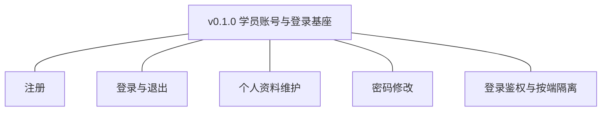
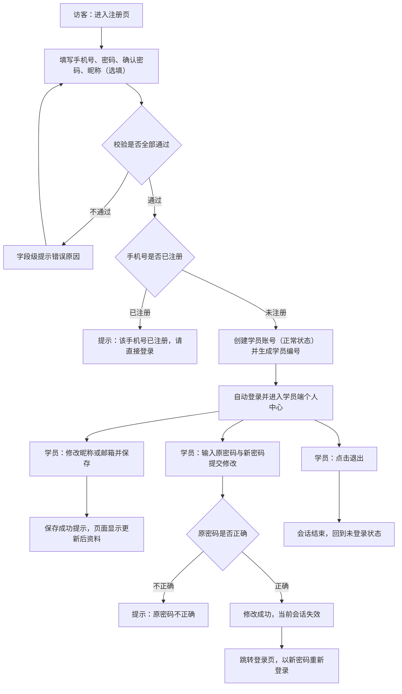
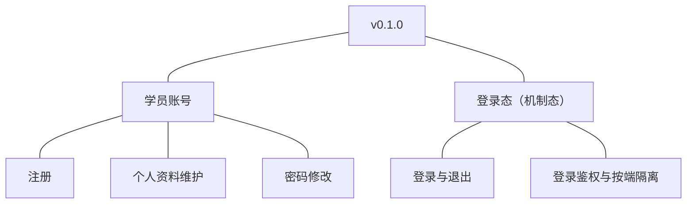
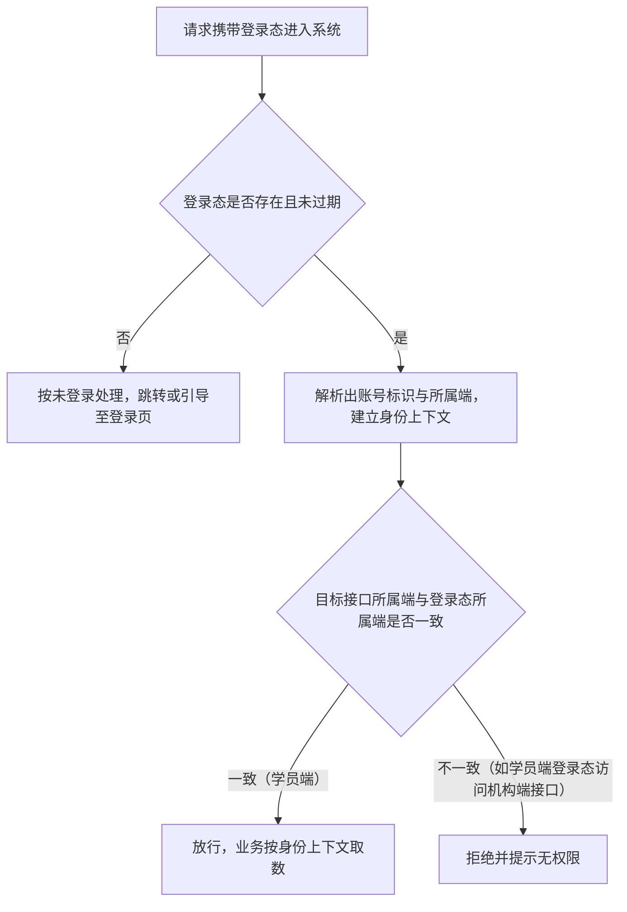

# PRD（小版本）：v0.1.0 学员账号与登录基座

> 定位：开发级需求说明书——承接《PRD（大版本）：0.1 基座版》与《0.1 开发顺序与需求拆解》批次一，认领自需求池（R1～R5）；把每条需求细化到开发与测试拿到即可开工的深度。上游为模拟案例材料，模拟性质保留；本版采用值中属推断／默认者就地标注并汇总于第 6 章。

## 1. 版本概述

**承接与目标**：认领来源＝0.1 大版本 02 批次一「学员账号与登录基座」整批（R1～R5）＋需求池实时状态（均为待规划，简单场景直接采纳整批）。本版可验收形态：学员在学员端走完「注册→登录→维护资料→修改密码→退出」全流程；密码修改后旧会话失效；携带学员端登录态访问机构端接口被拒。

**范围外声明**：R6～R11（机构端账号与权限）随 v0.1.1 交付，本版不含机构端任何界面与接口交付；讲师端与讲师账号随 0.3；学员账号停用、订单与学习相关能力均不在本版（围栏沿用 0.1 大版本 PRD）。

**条目内顺序与依赖**（沿用上游批内顺序依据）：R5 登录鉴权与按端隔离是登录态基座，与 R1 并行先行；R2 依赖 R1（有账号方可登录）与 R5（登录态机制）；R3、R4 依赖 R2（登录后方可自助维护）。

## 2. 需求范围与验收锚

| 编号 | 需求名 | 用途 | 验收标准 |
|---|---|---|---|
| R1 | 注册 | 建立学员账号，作为学员在学员端的身份，以及后续订单与学习记录的归属前提 | 学员提交注册信息后系统创建学员账号且状态为正常、可登录；注册标识已被占用时注册失败并给出提示 |
| R2 | 登录与退出 | 学员建立与结束会话，作为使用学员端功能的前提 | 学员以正确凭据登录成功进入学员端；凭据错误时登录失败并提示；退出后当前会话结束，再次访问学员端功能需重新登录 |
| R3 | 个人资料维护 | 学员自助查看与修改个人资料，只对本人开放 | 学员登录后能查看并修改自己的资料，保存后再次查看为更新后的内容；学员无法查看或修改其他学员的资料 |
| R4 | 密码修改 | 学员自助更新登录凭据 | 学员校验原密码后设置新密码成功；新密码生效后原密码无法登录，且修改前已建立的会话失效、需以新密码重新登录 |
| R5 | 登录鉴权与按端隔离 | 解析登录态并建立身份上下文，保证各端登录态互不通用 | 学员账号登录后获得学员端身份上下文；携带学员端登录态访问机构端接口时被拒绝并提示无权限 |

锚定说明：上表需求名、用途、验收标准逐字引自《0.1 开发顺序与需求拆解（大版本）》批次一需求表；本文后续各节只细化不改写，验收以本表为锚。

## 3. 核心用户旅程

旅程承接说明：本版认领段＝大版本 PRD 旅程二「学员自助注册与凭据维护」全链路（其各步均落在 R1～R4）；旅程一「机构管理员为机构人员开通账号并授权使用」不在本版认领段（R6～R11，随 v0.1.1），显式排除。

### 3.1 旅程：学员自助注册与凭据维护（开发级）

学员从未注册访客开始：注册成功即自动登录进入学员端个人中心（昵称未填时展示默认昵称）；此后可随时维护资料、修改密码（修改后须以新密码重新登录）、退出登录。操作步骤：① 进入注册页填写并提交 → ②（异常时按提示修正）→ ③ 自动登录进入个人中心 → ④ 维护资料并保存 → ⑤ 修改密码并重新登录 → ⑥ 退出登录。

## 4. 功能需求

### 4.1 功能总览

**对象增删改查矩阵**

| 对象 | 增 | 改 | 删 | 查 |
|---|---|---|---|---|
| 学员账号 | R1（注册创建） | R3（资料）、R4（密码） | 不做：学员账号注销本期明确不做、停用随后续版本交付（0.1 大版本 PRD 围栏；术语表状态枚举保留已停用） | R3（查看本人资料） |
| 登录态（机制态） | R2（登录建立会话） | 不做：会话存续期内无业务字段变更 | R2（退出结束会话）、R4（密码修改使会话失效） | R5（鉴权校验登录态） |

**主体使用面**

| 主体 | 使用条目 | 说明 |
|---|---|---|
| 学员 | R1、R2、R3、R4 | 学员端操作面：注册页、登录页、个人中心（资料与密码） |
| 机构端人员 | 无本版操作面 | 机构端能力随 v0.1.1（R6～R11） |
| （机制）三端请求入口 | R5 | 无人工触发面：每次携带登录态的请求自动经过，无界面（见 4.6） |

### 4.2 R1 注册

**功能说明**：学员在学员端建立自己的账号，作为身份与后续业务记录的归属前提。触发：未注册访客在学员端进入注册页并提交注册信息。

**交互与流程**：见图 3.1 注册段。操作步骤：① 进入注册页 → ② 填写手机号、密码、确认密码、昵称（选填）→ ③ 提交 → ④ 全部校验通过且手机号未占用时创建账号（正常状态）并自动登录进入个人中心；任一校验不通过时停留原页并逐项提示。

**字段与校验**

| 字段 | 必填 | 业务类型 | 约束与取值 | 失败反馈 |
|---|---|---|---|---|
| 手机号 | 是 | 注册标识 | 11 位手机号格式；全站唯一（学员账号唯一索引） | 「请输入正确的手机号」／「该手机号已注册，请直接登录」 |
| 密码 | 是 | 登录凭据 | 8～20 位，须同时包含字母和数字 | 「密码须为 8～20 位且同时包含字母和数字」 |
| 确认密码 | 是 | 凭据复核 | 须与密码一致 | 「两次输入的密码不一致」 |
| 昵称 | 否 | 展示资料 | ≤20 个字符；未填时生成默认昵称「学员」＋学员编号后 4 位（本版拍板，行业惯例默认） | 「昵称不能超过 20 个字符」 |

**规则与边界**：① 注册成功即账号状态为正常、生成学员编号（`ST`＋8 位序号，编码沿用术语表）并自动登录（本版拍板，行业惯例默认）；② 手机号唯一以数据库唯一索引兜底，应用层先查后插仅为前置提示（开发规范）；③ 密码以不可逆加密存储，任何界面与接口不回显（开发规范）；④ 注册不设图形验证码（本版拍板——单机构自建站点流量可控，防刷依赖手机号唯一与失败锁定）。

**异常与拦截**：手机号已注册→拦截提交并提示直接登录；格式或强度校验失败→字段级提示、不提交；昵称超长→字段级提示；同一手机号并发注册→以唯一索引冲突拦截，后到者提示已注册。

### 4.3 R2 登录与退出

**功能说明**：学员以注册凭据建立会话、使用学员端功能，并可随时结束会话。触发：学员在学员端进入登录页提交登录，或登录后点击退出。

**交互与流程**：操作步骤：① 进入登录页 → ② 输入手机号与密码 → ③ 提交：凭据正确则登录成功进入个人中心；不正确则提示并累计失败次数 → ④ 退出：登录后点击「退出」，会话结束回到未登录状态。

**字段与校验**

| 字段 | 必填 | 业务类型 | 约束与取值 | 失败反馈 |
|---|---|---|---|---|
| 手机号 | 是 | 登录标识 | 11 位手机号格式 | 「请输入正确的手机号」 |
| 密码 | 是 | 登录凭据 | 按注册规则 | 「手机号或密码错误」（不区分哪项错误，防账号探测；本版拍板，安全惯例） |

**规则与边界**：① 会话默认有效期 7 天，过期视为未登录（沿用 0.1 大版本 PRD 默认值）；② 同一账号连续登录失败 5 次锁定 15 分钟，锁定期间登录一律拒绝（沿用 0.1 大版本 PRD 默认值），锁定以账号维度计；③ 登录成功即重置该账号失败计数（本版拍板）；④ 登录时校验账号状态，仅正常状态可登录。

**异常与拦截**：凭据错误→统一提示并累计失败；达到 5 次→「尝试次数过多，请 15 分钟后再试」；账号已停用→「账号已停用，请联系机构」（状态拦截路径预留，停用处置随后续版本）；会话过期后访问功能→按未登录处理，引导至登录页。

### 4.4 R3 个人资料维护

**功能说明**：学员查看并维护自己的资料，只对本人开放。触发：学员登录后进入个人中心「个人资料」页。

**交互与流程**：操作步骤：① 登录后进入个人中心 → ② 打开个人资料页，查看当前资料（手机号只读展示） → ③ 修改昵称或邮箱 → ④ 保存：校验通过即生效并提示成功，页面显示更新后内容。

**字段与校验**

| 字段 | 必填 | 业务类型 | 约束与取值 | 失败反馈 |
|---|---|---|---|---|
| 手机号 | ——（只读） | 注册标识 | 注册时确定，本版不可修改（本版拍板——改绑手机号属敏感操作，随后续版本评估） | 无修改入口 |
| 昵称 | 是 | 展示资料 | ≤20 个字符；默认昵称可修改 | 「昵称不能超过 20 个字符」 |
| 邮箱 | 否 | 联系资料 | 邮箱格式校验 | 「请输入正确的邮箱地址」 |

**规则与边界**：① 资料查询与修改仅限本人（会话身份与账号一致），无查看他人资料的入口，接口按身份上下文取数（开发规范）；② 保存即时生效，无审核环节；③ 学员编号在资料页展示、不可修改。

**异常与拦截**：昵称为空或超长→字段级提示；邮箱格式错误→字段级提示；绕过界面直接请求他人账号资料→接口拒绝并返回无权限（R5 身份上下文校验）。

### 4.5 R4 密码修改

**功能说明**：学员校验原密码后自助更换登录凭据，修改后旧会话全部失效。触发：学员登录后进入个人中心「修改密码」页提交。

**交互与流程**：操作步骤：① 进入修改密码页 → ② 输入原密码、新密码、确认新密码 → ③ 提交：原密码正确且新密码合规则修改成功 → ④ 当前会话失效，跳转登录页 → ⑤ 以新密码重新登录。

**字段与校验**

| 字段 | 必填 | 业务类型 | 约束与取值 | 失败反馈 |
|---|---|---|---|---|
| 原密码 | 是 | 凭据复核 | 须与当前密码一致 | 「原密码不正确」 |
| 新密码 | 是 | 登录凭据 | 8～20 位，须同时包含字母和数字；不得与原密码相同（本版拍板） | 「密码须为 8～20 位且同时包含字母和数字」／「新密码不能与原密码相同」 |
| 确认新密码 | 是 | 凭据复核 | 须与新密码一致 | 「两次输入的密码不一致」 |

**规则与边界**：① 修改成功后该账号全部既有会话失效（锚：验收标准），须以新密码重新登录；② 原密码错误不累计登录失败次数（与 R2 锁定计数分离，本版拍板）；③ 新密码同样以不可逆加密存储（开发规范）。

**异常与拦截**：原密码不正确→提示且不修改；新密码与原密码相同→拦截；强度不足或不一致→字段级提示；会话过期时提交→按未登录处理并引导重新登录。

### 4.6 R5 登录鉴权与按端隔离（机制条目，无人工触发面）

**功能说明**：解析请求携带的登录态并建立身份上下文，保证学员端登录态不能用于其他端。触发：每次携带登录态的请求进入系统时自动执行，无界面、无人工操作入口。

**交互与流程**

操作步骤：① 请求进入 → ② 校验登录态存在且未过期 → ③ 建立身份上下文 → ④ 按端一致性校验 → ⑤ 放行或拒绝。

**字段与校验**：无用户可见信息项（机制条目）；会话的技术字段见第 5 章登录态对象。

**规则与边界**：① 登录态与账号、所属端绑定，学员端登录态不承载机构端身份（D5）；② 业务层不得自行解析凭据，身份一律取自身份上下文（开发规范）；③ 会话有效期 7 天、密码修改使会话失效（口径沿用 4.3、4.5）。

**异常与拦截**：登录态缺失或过期→视为未登录；跨端访问→拒绝并提示无权限（锚：验收标准）；无效或伪造登录态→视为未登录，不暴露具体原因。

## 5. 业务对象与数据字段

**数据主体清单**

| 业务对象 | 落库名 | 定位与关系 |
|---|---|---|
| 学员账号 | `student_account`（术语表已登记） | 学员端身份；本版承载注册、资料、凭据；后续订单与学习记录以其为归属主体 |
| 登录态（会话） | 机制态：存于服务端会话存储（Redis），不建关系表 | 承载登录会话与按端标识；实现形态由开发阶段定（K4）；过期或失效即不可用 |

**学员账号（`student_account`）字段表**

| 字段 | 必填 | 业务类型 | 落库字段名 | 约束与取值 |
|---|---|---|---|---|
| 学员编号 | 是 | 业务编码 | `no` | `ST`＋8 位序号，系统生成、唯一（编码沿用术语表） |
| 手机号 | 是 | 注册标识 | `mobile` | 11 位手机号格式；全站唯一（唯一索引） |
| 登录密码 | 是 | 登录凭据 | `password` | 8～20 位、字母＋数字；不可逆加密存储，不回显（开发规范） |
| 昵称 | 否 | 展示资料 | `nickname` | ≤20 个字符；未填生成默认昵称（本版拍板） |
| 邮箱 | 否 | 联系资料 | `email` | 邮箱格式；本版不做唯一性约束（本版拍板） |
| 账号状态 | 是 | 状态枚举 | `status` | 取值见术语表：未注册（`unregistered`）／正常（`normal`）／已停用（`disabled`）；注册成功即 `normal` |
| 创建时间／更新时间 | 是 | 审计字段 | `created_at`／`updated_at` | 术语表通用字段；资料与凭据变更更新 `updated_at` |

**登录态（会话，机制态）字段定义**（存储于会话存储，非关系表；实现形态由开发阶段定）

| 字段 | 必填 | 业务类型 | 落库字段名（会话键值） | 约束与取值 |
|---|---|---|---|---|
| 账号标识 | 是 | 关联 | `account_id` | 指向学员账号 `id` |
| 所属端 | 是 | 端标识 | `side` | 本版取值仅：学员端（`student`）；机构端取值随 v0.1.1（D5） |
| 过期时间 | 是 | 时效 | `expire_at` | 登录成功时间＋7 天（沿用 0.1 大版本 PRD 默认值） |

列类型、主键、索引与建表 DDL 归开发阶段（开发规范与技术文档）。

## 6. 待议与建议

**本版采用的推断与默认值汇总**

| 采用值 | 来源状态 | 影响与待确认 |
|---|---|---|
| 注册标识＝手机号＋密码（不做第三方登录） | 本版定案：0.1 围栏排除外部身份源，手机号为单机构站点行业惯例 | 无短信依赖（注册不验证码）；若业务要求手机号真实性核验，需引入短信服务，回池评估 |
| 密码 8～20 位、须含字母和数字 | 本版拍板（行业惯例默认） | 强度策略可在后续版本收紧 |
| 昵称未填生成「学员＋编号后 4 位」 | 本版拍板（行业惯例默认） | — |
| 注册成功自动登录 | 本版拍板（行业惯例默认） | — |
| 会话 7 天、失败 5 次锁 15 分钟 | 沿用 0.1 大版本 PRD 默认值 | — |
| 登录失败提示不区分手机号／密码错误 | 本版拍板（安全惯例） | — |
| 手机号注册后本版不可修改 | 本版拍板（改绑属敏感操作） | 改绑手机号随后续版本评估 |
| 邮箱不做唯一约束 | 本版拍板 | 邮箱用途（通知／找回）未定，随后续版本 |
| 原密码错误不累计登录锁定计数 | 本版拍板 | — |
| 注册不设图形验证码 | 本版拍板（单机构自建站点流量可控） | 若出现注册刷量，回池加验证码需求 |

**建议回池的新想法**：无。

**术语表待登记行（随文档回报，由主流程合入）**：学员账号新增落库字段 `mobile`（注册标识，唯一）、`password`（登录凭据，不可逆加密）、`nickname`（展示资料）、`email`（联系资料，选填）；登录态（机制态对象，存于会话存储）及其字段 `account_id`、`side`（本版取值 `student`）、`expire_at`。
