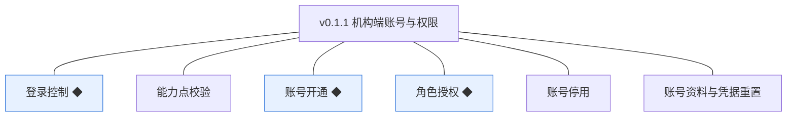
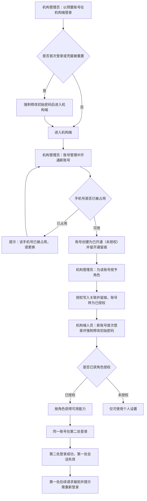
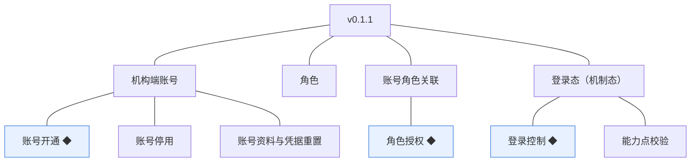
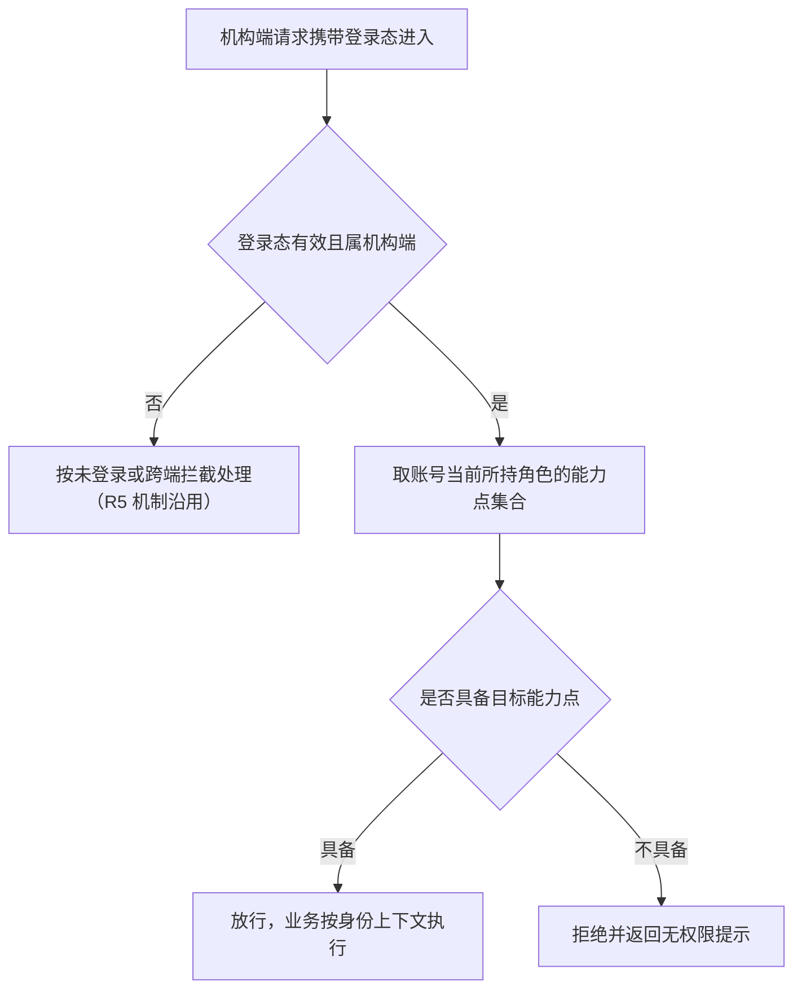

# PRD（小版本）：v0.1.1 机构端账号与权限

> 定位：开发级需求说明书——承接《PRD（大版本）：0.1 基座版》与《0.1 开发顺序与需求拆解》批次二，认领自需求池（R6～R11，v0.1.0 发布后批次二全部待规划，整批采纳）；把每条需求细化到开发与测试拿到即可开工的深度。上游为模拟案例材料，模拟性质保留；本版采用值中属推断／默认者就地标注并汇总于第 6 章。

## 1. 版本概述

**承接与目标**：认领来源＝0.1 大版本 02 批次二「机构端账号与权限」整批（R6～R11）＋需求池实时状态合并。本版可验收形态（沿用上游批次二）：预置管理员登录机构端→开通新账号→授予角色→该账号登录后仅能使用所授能力（越权调用被拒）→同一账号第二处登录后第一处下线→停用后无法登录；被授权人员可自助修改自身资料与凭据。

**范围外声明**：学员端能力已随 v0.1.0 发布，本版不改动其行为（登录态机制仅扩展机构端取值）；站点配置、讲师审核、课程、订单等业务能力随 0.2 及以后版本，本版机构端除账号权限与个人设置外无其他业务界面；讲师端随 0.3；角色的自定义编排界面、外部身份源对接、账号启用恢复（停用为终态）均不做（围栏沿用 0.1 大版本 PRD）。

**条目内顺序与依赖**（沿用上游批内顺序依据）：R8 账号开通→R9 角色授权→R7 能力点校验／R10 账号停用（依赖开通与授权链，04C 3.5）；R6 登录控制依赖登录态机制（R5 已随 v0.1.0 交付，本版扩展机构端取值与占用标记）；R11 依赖 R8（有账号方有个人设置）。系统预置项随本版交付使用：预置角色（机构管理员、机构运营人员）及其能力点集合、首个机构管理员账号（首登强制改密）。

## 2. 需求范围与验收锚

| 编号 | 需求名 | 用途 | 验收标准 |
|---|---|---|---|
| R6 | 登录控制 ◆ | 同一机构端账号同一时间仅允许在一处登录，降低账号共享风险 | 同一机构端账号在第二处登录成功后，第一处的会话立即失效，其后续请求被拒绝并提示需重新登录 |
| R7 | 能力点校验 | 服务端按所持角色校验当前机构端身份的能力点，作为机构端操作的前提 | 未获授某能力点的机构端账号调用对应能力时被服务端拒绝并返回无权限提示，即使前端未展示该入口 |
| R8 | 账号开通 ◆ | 机构管理员为机构内部人员开设机构端账号，作为进入机构端的前提 | 机构管理员提交新账号信息后系统创建状态为已开通（未授权）的机构端账号并留有开通留痕；登录标识已被占用时开通失败并提示 |
| R9 | 角色授权 ◆ | 机构管理员给机构端账号授予或收回角色，决定其可用能力 | 机构管理员为账号授予角色后，该账号的下一次操作即具备对应能力点；收回角色后对应能力点即时失效；每次授予与收回均留有留痕可查 |
| R10 | 账号停用 | 机构管理员停用离职或异常账号，收回后台访问能力 | 机构管理员对机构端账号执行停用后，该账号立即无法登录、既有会话失效；账号与其授权记录保留可查 |
| R11 | 账号资料与凭据重置 | 机构端人员自助维护自身账号资料与登录凭据，机构管理员可重置他人凭据 | 机构端人员登录后可修改自己的账号资料与登录凭据；机构管理员可对其他机构端账号重置凭据，重置后旧凭据失效、新凭据可登录 |

锚定说明：上表需求名（含 ◆）、用途、验收标准逐字引自《0.1 开发顺序与需求拆解（大版本）》批次二需求表；本文后续各节只细化不改写，验收以本表为锚。

## 3. 核心用户旅程

旅程承接说明：本版认领段＝大版本 PRD 旅程一「机构管理员为机构人员开通账号并授权使用」全链路（各步均落在 R6、R8、R9、R11）；旅程二「学员自助注册与凭据维护」已随 v0.1.0 发布，不在本版；R10 停用与 R7 校验为管理操作与机制，由验收标准覆盖、不单列旅程。

### 3.1 旅程：机构管理员为机构人员开通账号并授权使用（开发级）

机构管理员以预置账号登录（首登强制改密）后，在账号管理中为机构人员开通账号并授予角色；被授权人员首次登录强制修改初始密码后按角色使用机构端，未授权者仅可使用个人设置；同一账号在第二处登录后第一处立即失效。操作步骤：① 预置管理员登录（首登强制改密）→ ② 开通账号 → ③ 授予角色 → ④ 新账号首登强制改密 → ⑤ 按角色使用能力（未授权仅个人设置）→ ⑥ 第二处登录使第一处下线 → ⑦ 人员变动时收回角色或停用账号。

## 4. 功能需求

### 4.1 功能总览

注：R9 角色授权挂在首要承载对象「账号角色关联」下（授予与收回写关联）；其涉及的「角色」与「机构端账号」两对象随操作入图（对象层覆盖本版功能叶子涉及的全部对象）。

**对象增删改查矩阵**

| 对象 | 增 | 改 | 删 | 查 |
|---|---|---|---|---|
| 机构端账号 | R8（开通创建） | R11（资料与凭据，自助＋管理员重置） | R10（停用，软删除语义；启用恢复不做——停用为终态，0.1 围栏） | R8～R11 的操作界面呈现（账号管理列表为操作入口，本版不单列查询条目，本版拍板） |
| 角色 | 不做：本版不提供角色新增（预置两角色随初始化，自定义编排界面为 0.1 围栏外） | 不做：能力点集合本版不可编辑（预置固定） | 不做：被引用不可删除（04C） | R9（授权时可见可选角色） |
| 账号角色关联 | R9（授予写入） | 不做：关联仅有授予与解除两种形态 | R9（收回）、R10（停用随解除全部关联） | R9（账号当前所持角色可见） |
| 登录态（机制态） | 机构端登录（随 R6 交互流程，机制沿用 v0.1.0 的 R5） | 不做 | R6（第二处登录使第一处失效）、R10（停用使会话失效）、退出 | R7（鉴权与能力点校验） |

**主体使用面**

| 主体 | 使用条目 | 说明 |
|---|---|---|
| 机构管理员 | R8、R9、R10、R11（重置他人部分） | 机构端账号管理操作面：开通、授权／收回、停用、重置凭据；个人设置自助面同下 |
| 机构端人员（被授权账号） | R11（自助部分） | 机构端个人设置：姓名与登录凭据自助维护 |
| （机制）机构端请求入口 | R6、R7 | R7 无人工触发面（能力点显隐随各操作面呈现）；R6 的登录界面与被踢提示态有界面（见 4.3） |

### 4.2 R8 账号开通 ◆

**功能说明**：机构管理员为机构内部人员开设机构端账号，作为其进入机构端的前提。触发：机构管理员在机构端「账号管理」点击「开通账号」并提交表单。

**交互与流程**：操作步骤：① 打开账号管理 → ② 点击「开通账号」弹出表单 → ③ 填写姓名、手机号、初始密码 → ④ 提交：校验通过且手机号未被占用时创建账号（已开通（未授权））并在列表新增一行、记录开通留痕；任一校验不通过停留表单并逐项提示。

**字段与校验**

| 字段 | 必填 | 业务类型 | 约束与取值 | 失败反馈 |
|---|---|---|---|---|
| 姓名 | 是 | 账号资料 | 2～20 个字符 | 「请输入 2～20 个字符的姓名」 |
| 手机号 | 是 | 登录标识 | 11 位手机号格式；机构端账号内唯一（唯一索引） | 「请输入正确的手机号」／「该手机号已被占用，请更换」 |
| 初始密码 | 是 | 登录凭据 | 8～20 位，须同时包含字母和数字；由开通人设置，账号首次登录强制修改（本版拍板，与预置管理员同一机制） | 「密码须为 8～20 位且同时包含字母和数字」 |

**规则与边界**：① 开通即生成机构端账号编号（`AD`＋6 位序号，编码沿用术语表）、状态为已开通（未授权），除个人设置外无业务能力（D6）；② 开通留痕＝开通操作人（`opened_by`）与开通时间（`created_at`），同事务写入（04C 3.5）；③ 手机号唯一以数据库唯一索引兜底（开发规范）；④ 初始密码不可逆加密存储、界面不回显。

**异常与拦截**：手机号已被占用→拦截并提示更换；姓名或密码校验失败→字段级提示；同一手机号并发开通→唯一索引冲突拦截，后到者提示占用；非机构管理员身份调用开通接口→R7 拒绝并返回无权限。

### 4.3 R6 登录控制 ◆

**功能说明**：同一机构端账号同一时间仅允许在一处登录，新登录使旧会话即时失效。触发：机构端账号在机构端登录页提交登录（含第二处登录）；或既有会话被新登录挤下线后的下一次请求。

**交互与流程**：操作步骤：① 打开机构端登录页 → ② 输入手机号与密码提交 → ③ 凭据正确且账号可用：建立新会话并使该账号既有会话立即失效，进入机构端（首次登录或凭据被重置后强制修改密码）；④ 被挤下线的一处发起任何请求：提示「登录状态已失效，请重新登录」并回到登录页。

**字段与校验**

| 字段 | 必填 | 业务类型 | 约束与取值 | 失败反馈 |
|---|---|---|---|---|
| 手机号 | 是 | 登录标识 | 11 位手机号格式 | 「请输入正确的手机号」 |
| 密码 | 是 | 登录凭据 | 按开通／重置规则 | 「手机号或密码错误」（不区分哪项错误，沿用 v0.1.0 安全惯例） |

**规则与边界**：① 会话占用标记按「账号＋端」维度保存当前有效会话标识，登录、退出、修改凭据、被停用四种情况更新占用标记（04C 3.6）；② 会话有效期 7 天、连续失败 5 次锁定 15 分钟（沿用 0.1 大版本 PRD 默认值，锁定按账号维度计、成功登录清零）；③ 仅正常可用状态（已授权或已开通）可登录，已停用拒绝登录；④ 机构端登录态与学员端登录态互不通用（D5，机制沿用 R5）。

**异常与拦截**：凭据错误→统一提示并累计失败；锁定→「尝试次数过多，请 15 分钟后再试」；已停用→「账号已停用，请联系机构管理员」；被挤下线后请求→「登录状态已失效，请重新登录」；首次登录或重置后未改密→强制进入修改密码页，改密前不可访问其他功能。

### 4.4 R9 角色授权 ◆

**功能说明**：机构管理员给机构端账号授予或收回角色，账号能力随所持角色即时变化。触发：机构管理员在账号管理列表选择账号，执行「授权」或「收回角色」。

**交互与流程**：操作步骤：① 账号管理列表选中目标账号 → ② 点击「授权」打开角色选择（展示预置角色及当前授予态） → ③ 勾选或取消勾选角色并确认 → ④ 授予：写入账号角色关联并留痕，账号状态转为已授权、能力即时生效；收回：删除关联并留痕，对应能力点即时失效；收回至零个角色时账号退回已开通（未授权）。

**字段与校验**

| 字段 | 必填 | 业务类型 | 约束与取值 | 失败反馈 |
|---|---|---|---|---|
| 角色 | 是（至少一项，授予场景） | 授权对象 | 仅可从预置角色选择：机构管理员、机构运营人员（术语表登记名）；本版机构管理员能力点＝账号开通、角色授权、账号停用、凭据重置，机构运营人员能力点集合为空（0.2 起填充，本版拍板） | 「请至少选择一个角色」（确认收回全部时弹二次确认：「收回全部角色后该账号将仅剩个人设置，确认？」） |

**规则与边界**：① 授予与收回即时生效，账号下一次操作即按新角色判定能力（锚）；② 每次授予与收回写入留痕（操作人 `granted_by`、时间 `granted_at`，随关联同事务，04C 3.5）；③ 停用账号不可再授权（提示「账号已停用」）；④ 个人设置为所有机构端账号默认可用，不属角色能力点（04C）。

**异常与拦截**：对已停用账号授权或收回→拒绝并提示；非机构管理员调用授权接口→R7 拒绝；同一角色重复授予→幂等处理（关联已存在则不重复写入、不产生新留痕）。

### 4.5 R10 账号停用

**功能说明**：机构管理员停用离职或异常账号，收回后台访问能力；停用后不可登录且为终态。触发：机构管理员在账号管理列表对目标账号点击「停用」并确认。

**交互与流程**：操作步骤：① 列表选中目标账号 → ② 点击「停用」弹出二次确认 → ③ 确认：账号状态转为已停用、同事务解除其全部角色关联（留痕）、既有会话立即失效 → ④ 列表该行状态更新为已停用，账号与授权记录仍可查。

**字段与校验**

| 字段 | 必填 | 业务类型 | 约束与取值 | 失败反馈 |
|---|---|---|---|---|
| 停用确认 | 是 | 操作确认 | 二次确认文案：「停用后该账号立即无法登录且不可恢复，确认停用？」 | 取消则不执行 |

**规则与边界**：① 停用后该账号立即无法登录、既有会话失效（锚）；② 账号与其授权记录保留可查（软删除语义），解除的关联留痕可查；③ 机构管理员不可停用自己的账号（本版拍板——防止最后一个管理员自锁）；④ 停用为终态，本版无启用恢复（围栏）。

**异常与拦截**：对已停用账号再次停用→拒绝并提示「账号已停用」；停用自己→拒绝并提示「不能停用当前登录账号」；非机构管理员调用停用接口→R7 拒绝。

### 4.6 R11 账号资料与凭据重置

**功能说明**：机构端人员自助维护自身账号资料与登录凭据；机构管理员可对其他机构端账号重置凭据。触发：机构端人员在「个人设置」提交资料或密码修改；或机构管理员在账号管理对他人账号执行「重置凭据」。

**交互与流程**：自助路径：① 登录后进入个人设置 → ② 修改姓名或密码（原密码＋新密码＋确认新密码）→ ③ 保存成功；修改密码后当前会话失效、跳转登录页以新密码重新登录（机制与学员端一致）。重置路径：① 管理员在列表选择他人账号 → ② 点击「重置凭据」设置新初始密码 → ③ 旧凭据立即失效，目标账号下次以新密码登录并被强制修改密码（本版拍板，统一首登强制改密机制）。

**字段与校验**

| 字段 | 必填 | 业务类型 | 约束与取值 | 失败反馈 |
|---|---|---|---|---|
| 姓名（自助） | 是 | 账号资料 | 2～20 个字符 | 「请输入 2～20 个字符的姓名」 |
| 手机号 | ——（只读） | 登录标识 | 开通时确定，本版不可修改 | 无修改入口 |
| 原密码（自助改密） | 是 | 凭据复核 | 须与当前密码一致 | 「原密码不正确」 |
| 新密码 | 是 | 登录凭据 | 8～20 位，须同时包含字母和数字；不得与原密码相同（沿用 v0.1.0 规则） | 「密码须为 8～20 位且同时包含字母和数字」／「新密码不能与原密码相同」 |
| 确认新密码 | 是 | 凭据复核 | 须与新密码一致 | 「两次输入的密码不一致」 |
| 新初始密码（管理员重置） | 是 | 登录凭据 | 同密码规则 | 同上 |

**规则与边界**：① 自助仅限本人（身份上下文取数，无他人资料入口）；② 管理员重置仅限机构管理员角色且不可重置自己（自己走自助改密，本版拍板）；③ 自助改密与重置均使目标账号既有会话失效（登录控制占用标记更新，04C 3.6）；④ 凭据不可逆加密、不回显。

**异常与拦截**：原密码错误→提示且不累计登录锁定（沿用 v0.1.0 口径）；新密码等于原密码→拦截；对已停用账号重置→拒绝；非机构管理员调用重置接口→R7 拒绝；会话过期→按未登录处理。

### 4.7 R7 能力点校验（机制条目，无人工触发面）

**功能说明**：服务端按当前机构端身份所持角色校验能力点，未获授的能力一律拒绝。触发：机构端每个业务请求进入时自动执行（在 v0.1.0 已交付的 R5 鉴权过滤器之后），无界面、无人工操作入口；前端导航与操作按钮按能力点显隐是其可见表现。

**交互与流程**

操作步骤：① 请求进入 → ② R5 鉴权（沿用）→ ③ 取所持角色能力点集合 → ④ 校验目标能力点 → ⑤ 放行或拒绝。

**字段与校验**：无用户可见信息项（机制条目）；能力点集合为预置角色的固定数据（见 4.4），本版不可编辑。

**规则与边界**：① 能力判定以服务端为准，前端隐藏不作为安全边界（开发规范）；② 授权变更后下一次请求即按新角色判定（锚，即时生效）；③ 个人设置不属能力点、所有机构端账号可用；④ 未授权账号（已开通）仅个人设置可用（D6）。

**异常与拦截**：未获授能力→拒绝并返回无权限提示（锚）；能力点集合为空的角色（机构运营人员本版）→除个人设置外全部业务能力被拒；已停用账号→会话已失效，按未登录处理。

## 5. 业务对象与数据字段

**数据主体清单**

| 业务对象 | 落库名 | 定位与关系 |
|---|---|---|
| 机构端账号 | `admin_account`（术语表已登记） | 机构端身份；本版交付开通→授权→停用全生命周期；角色经账号角色关联多对多 |
| 角色 | `admin_role`（术语表已登记） | 机构端能力授权单元；本版仅系统预置两个角色，能力点集合固定 |
| 账号角色关联 | `admin_account_role`（术语表已登记，关系表） | 机构端账号与角色的授予关系；授予／收回／随停用解除均留痕 |
| 登录态（会话） | 沿用 v0.1.0 机制态（服务端会话存储，不建关系表） | 本版扩展：`side` 增加 `admin` 取值；新增会话占用标记（登录控制，K4） |

**机构端账号（`admin_account`）字段表**

| 字段 | 必填 | 业务类型 | 落库字段名 | 约束与取值 |
|---|---|---|---|---|
| 机构端账号编号 | 是 | 业务编码 | `no` | `AD`＋6 位序号，系统生成、唯一（编码沿用术语表） |
| 手机号 | 是 | 登录标识 | `mobile` | 11 位手机号格式；机构端账号内唯一（唯一索引） |
| 登录密码 | 是 | 登录凭据 | `password` | 8～20 位、字母＋数字；不可逆加密存储、不回显 |
| 姓名 | 是 | 账号资料 | `name` | 2～20 个字符 |
| 账号状态 | 是 | 状态枚举 | `status` | 取值见术语表：已开通（未授权）（`opened`）／已授权（`authorized`）／已停用（`disabled`） |
| 开通操作人／开通时间 | 是 | 开通留痕 | `opened_by`／`created_at` | 开通时同事务写入（04C 3.5） |
| 停用操作人／停用时间 | 停用时必填 | 停用留痕 | `disabled_by`／`disabled_at` | 停用时同事务写入 |
| 创建时间／更新时间 | 是 | 审计字段 | `created_at`／`updated_at` | 术语表通用字段 |

**角色（`admin_role`）字段表**

| 字段 | 必填 | 业务类型 | 落库字段名 | 约束与取值 |
|---|---|---|---|---|
| 角色名 | 是 | 角色标识 | `name` | 预置两行：机构管理员、机构运营人员（术语表登记名，逐字） |
| 角色说明 | 是 | 职责说明 | `description` | 预置固定文案；本版不可编辑 |
| 能力点集合 | 是 | 授权数据 | `capabilities` | 预置：机构管理员＝账号开通／角色授权／账号停用／凭据重置；机构运营人员＝空（0.2 起填充）；实现形态由开发阶段定（本版拍板） |
| 创建时间／更新时间 | 是 | 审计字段 | `created_at`／`updated_at` | 术语表通用字段 |

**账号角色关联（`admin_account_role`）字段表**

| 字段 | 必填 | 业务类型 | 落库字段名 | 约束与取值 |
|---|---|---|---|---|
| 机构端账号 | 是 | 关联 | `admin_account_id` | 指向 `admin_account.id` |
| 角色 | 是 | 关联 | `admin_role_id` | 指向 `admin_role.id`；账号＋角色组合唯一 |
| 授予操作人／授予时间 | 是 | 授权留痕 | `granted_by`／`granted_at` | 授予与收回均写入（收回以关联删除＋留痕表达，04C 3.5） |

**登录态（会话，机制态）本版扩展**（存于服务端会话存储，非关系表）

| 字段 | 必填 | 业务类型 | 落库字段名（会话键值） | 约束与取值 |
|---|---|---|---|---|
| 所属端 | 是 | 端标识 | `side` | 本版取值扩展：学员端（`student`，v0.1.0）＋机构端（`admin`，本版）（D5） |
| 会话占用标记 | 机构端必填 | 登录控制 | `session_occupation` | 当前有效会话标识；仅机构端启用（登录、退出、改密、停用四处更新；K4） |
| 账号标识／过期时间 | 是 | 沿用 | `account_id`／`expire_at` | 沿用 v0.1.0；机构端会话有效期同 7 天 |

列类型、主键、索引与建表 DDL 归开发阶段（开发规范与技术文档）。

## 6. 待议与建议

**本版采用的推断与默认值汇总**

| 采用值 | 来源状态 | 影响与待确认 |
|---|---|---|
| 机构端登录标识＝手机号＋密码；开通时由管理员设置初始密码 | 本版拍板（与学员端一致、单机构站点惯例） | — |
| 开通、预置、重置三类新设凭据均在下次登录强制修改 | 本版拍板（统一首登强制改密机制；预置管理员沿用 0.1 大版本 PRD） | — |
| 预置角色能力点：机构管理员＝账号开通／角色授权／账号停用／凭据重置；机构运营人员＝空 | 本版拍板（0.1 功能清单内能力） | 机构运营人员能力点随 0.2 立项填充（站点配置等），届时回本表登记 |
| 账号管理列表为操作入口、不单列查询条目 | 本版拍板（0.1 功能清单未单列） | 列表筛选与分页留开发级细化 |
| 机构管理员不可停用自己、不可重置自己凭据 | 本版拍板（防自锁；自助改密路径可用） | — |
| 收回全部角色须二次确认 | 本版拍板 | — |
| 手机号开通后本版不可修改 | 本版拍板（沿用 v0.1.0 学员端口径） | 改绑随后续版本评估 |

**建议回池的新想法**：无。

**术语表待登记行（随文档回报，由主流程合入术语表）**：机构端账号（admin_account）新增字段 `name`（姓名）、`opened_by`／`disabled_by`／`disabled_at`（开通与停用留痕），`mobile`／`password` 适用对象扩展至机构端账号；角色（admin_role）新增字段 `name`／`description`／`capabilities`；账号角色关联（admin_account_role）新增字段 `admin_account_id`／`admin_role_id`／`granted_by`／`granted_at`；登录态（会话）`side` 取值扩展 `admin`、新增 `session_occupation`（会话占用标记，仅机构端启用）。
