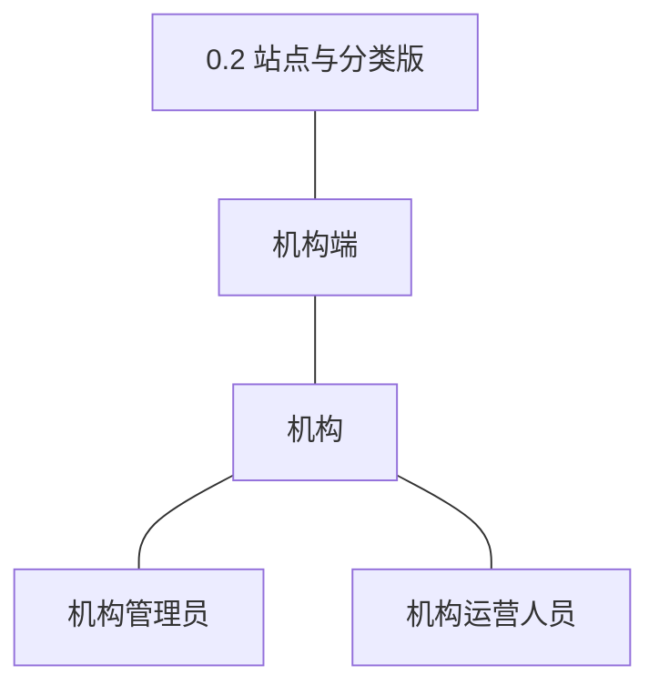
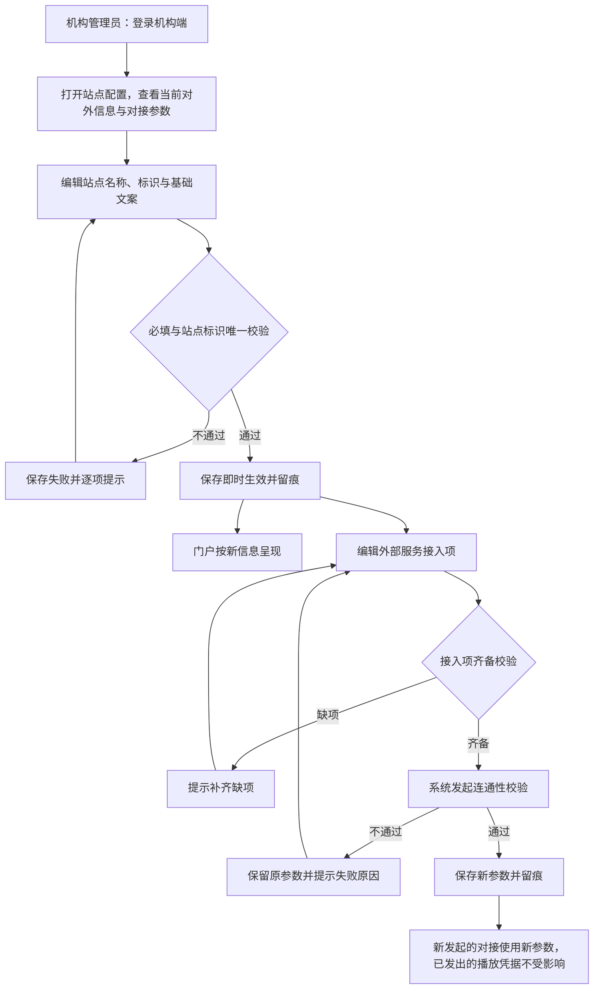
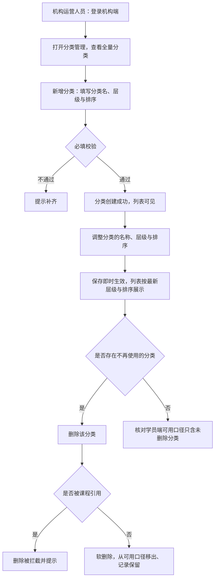
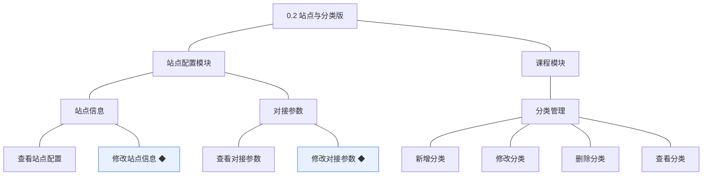
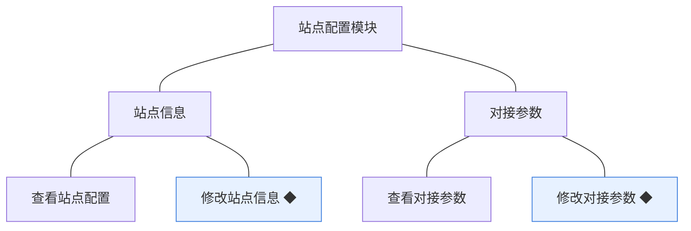
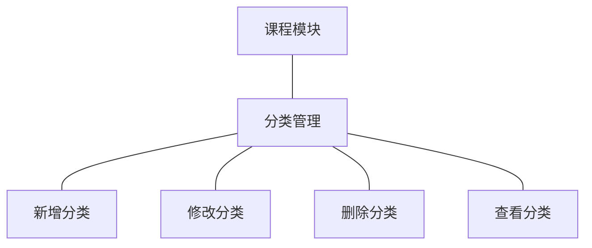
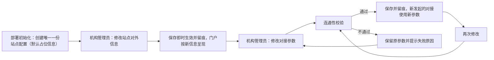

# PRD（大版本）：0.2 站点与分类版

> 定位：本版立项说明书——承接《产品路线图（项目）》0.2 站点与分类版条目与项目级基线，界定本版做什么、每个功能做到什么程度算完成，供需求拆解与小版本规划直接开工。上游为模拟案例材料，模拟性质保留；版本级默认值就地标注来源状态。

## 1. 版本概述

**承接与目标**：机构以自己的名义把站点配出来，并把课程分类骨架搭好，为内容进入做好准备（路线图 0.2 目标）。本版交付两个模块的能力：站点配置模块（站点对外信息与外部服务对接参数的查看与维护）与课程模块的分类管理（新增、修改、删除、查看）。

**成功标准与量化口径**：① 机构管理员能完成一次站点信息修改与一次对接参数修改，修改后的参数通过连通性校验且两处均有留痕（判定线 100%——本版站点配置即时生效、无审核环节，任何未落痕或校验未过即按配置链路异常排查）；② 机构运营人员能建成至少一个课程分类，该分类在机构端全量列表可见、在学员端可用分类口径内（0.2 无课程与学员端界面，可用口径以数据与接口判定，界面呈现随 0.5）；③ 分类骨架的后续维护由机构自助完成（判定方式：完成标志达成后，站点配置与分类的后续修改均由机构自行操作，无人工代配）。

**范围一句话**：做——站点配置（查看、修改站点信息◆、查看与修改对接参数◆）与课程分类管理（新增、修改、删除、查看）；不做——多站点与多域名、页面装修与模板编辑、人工推荐位配置（路线图 0.2 不做行）；无能力真空期过渡（本版为准备性版本，未开张、无已发生业务）。学员端可用分类口径属**先行基座**（数据与接口就绪，供 0.5 首页与分类浏览接入），非过渡支撑。

**沿用与前置**：前置＝0.1 基座版（机构端账号、角色授权、登录控制、能力点校验——进入后台与操作权限的前提）；沿用对象无新增路径（机构端账号仅以既有身份使用本版能力）。主体与角色、对象、状态枚举与落库名逐字沿用《术语表（项目）》。外部依赖：视频与存储服务商的选型与开户随本版立项定案（路线图 0.2 依赖行），本版功能行为与具体供应商无关（差异由媒体接入模块封装，D7、K5），对接参数在 0.4 与 0.6 被消费。

## 2. 主体与角色

| 主体／角色 | 端 | 怎么用系统 |
|---|---|---|
| 机构管理员 | 机构端 | 查看站点配置与对接参数，修改站点对外信息与外部服务接入参数 |
| 机构运营人员 | 机构端 | 查看站点配置（含脱敏后的对接参数），搭建与维护课程分类骨架（新增、修改、删除、查看） |

**裁剪说明**：讲师主体不上场（随 0.3）；学员主体本版无界面——「查看分类」的学员端口径为数据与接口先行（界面呈现随 0.5 首页与分类浏览交付）；机构运营人员自本版起获得首个业务能力组（分类管理），其能力点集合随本版填充（0.1 预置为空的口径在本版立项时落定）。

## 3. 核心业务流程

### 3.1 旅程一：机构管理员配置站点

机构管理员先查看现状再动手：站点对外信息改完即生效留痕、门户随之呈现；对接参数改前必过连通性校验，不通过保留原参数，避免把可用配置改坏。操作步骤：① 查看站点配置 → ② 修改站点信息并保存 → ③ 编辑对接参数 → ④ 连通性校验 → ⑤ 通过保存留痕／不通过修正重试。

### 3.2 旅程二：机构运营人员搭建课程分类骨架

机构运营人员按机构的课程规划搭骨架：先建分类、再调整层级与排序、清理不再使用的分类（软删除、被引用拦截），最终形成可供课程选用的分类树。操作步骤：① 查看全量分类 → ② 新增分类 → ③ 调整层级与排序 → ④ 删除不再使用的分类 → ⑤ 核对可用口径。

## 4. 功能需求

### 4.1 站点配置模块

**站点信息组**：站点对外呈现的唯一信息源；修改即时生效、不留审核环节（站点信息属机构自身对外名义，04C-站点配置 3.3）。

| 功能 | 用途 | 验收标准 |
|---|---|---|
| 查看站点配置 | 机构管理员与机构运营人员查看站点对外信息与对接参数的当前值，作为配置与排查的前提 | 机构管理员与机构运营人员进入站点配置可查看当前站点名称、标识、基础文案及对接参数条目；对接参数中的密钥类条目以脱敏形式展示，不显示完整值 |
| 修改站点信息 ◆ | 机构管理员维护站点对外信息，使门户以机构自己的名义对外呈现 | 机构管理员修改站点名称、标识或基础文案并保存后修改即时生效、留有修改留痕；必填缺失或站点标识被占用时保存失败并提示 |

**对接参数组**：外部服务（视频与存储）接入项的唯一配置面；行为与具体供应商无关（D7、K5）。

| 功能 | 用途 | 验收标准 |
|---|---|---|
| 查看对接参数 | 机构管理员查看各外部服务的接入项，作为修改与排查的前提 | 机构管理员可查看各外部服务接入项列表与最近修改留痕；密钥类条目不回显完整值 |
| 修改对接参数 ◆ | 机构管理员维护视频与存储服务的接入参数，供课程内容与学习链路对接外部服务 | 机构管理员修改接入项后系统先做连通性校验：校验通过则保存生效并留痕，不通过则保持原参数并提示失败原因；新发起的对接使用新参数，已发出的播放凭据不受影响 |

### 4.2 课程模块（分类管理）

**分类管理组**：课程的组织骨架；本版只建骨架，课程归属随 0.4 交付。

| 功能 | 用途 | 验收标准 |
|---|---|---|
| 新增分类 | 机构运营人员建立课程分类并指定层级与排序，作为课程的组织骨架 | 机构运营人员提交分类名、层级与排序后分类创建成功并在机构端分类列表可见；必填缺失时创建失败并提示 |
| 修改分类 | 机构运营人员调整分类的名称、层级与排序，保持骨架与机构经营一致 | 机构运营人员修改分类后保存即时生效，机构端分类列表按最新层级与排序展示 |
| 删除分类 | 机构运营人员清理不再使用的分类，保持骨架整洁 | 机构运营人员删除未被引用的分类后该分类从可用口径移出、记录保留（软删除）；被课程引用的分类删除被拦截并提示 |
| 查看分类 | 机构端查看全量分类骨架，学员端按可用口径读取分类，作为后续课程浏览的组织依据 | 机构端可查看全量分类（含已删除标记）；学员端可用分类口径只包含未删除分类，本版以接口口径验收（学员端界面呈现随 0.5 交付） |

## 5. 业务对象

### 5.1 站点配置

定位：站点对外信息与第三方对接参数的设置集合，全站唯一一份，是门户呈现与外部服务对接的依据（沿用术语表登记对象与落库名 `site_config`）。

说明：本版无状态流转（配置只有当前值一种形态，历史以修改留痕表达，04C-站点配置）。版本级默认值：部署初始化创建唯一一份站点配置，站点名默认占位「领课教育」、对接参数默认为空，由机构首次配置时修改（本版拍板，行业惯例默认）；密钥类条目全程脱敏、不回显完整值（开发规范）；参数变更只对新发起的对接生效，已发出的播放凭据不受影响（D7）。

### 5.2 课程分类

定位：课程的组织骨架，决定学员端按分类浏览的层级与课程归属；本版只建骨架，课程归属随 0.4（沿用术语表登记对象与落库名 `course_category`）。

说明：本版无状态流转，可用与否以是否软删除表达（「启用／停用」切换功能随后续版本按需提供，本版拍板）；被课程引用时不可删除的规则本版就绪（引用关系随 0.4 产生，0.2 内删除恒可用路径为「未被引用」）；层级深度与数量上限留版本级细化（小版本定值）。
