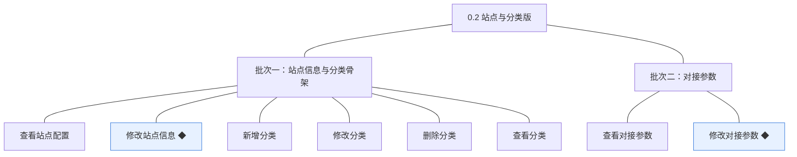
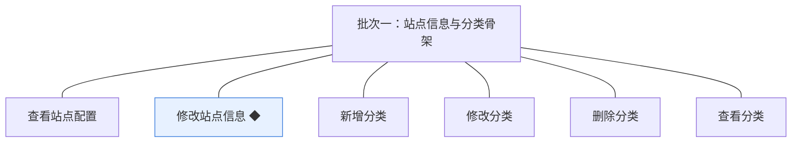
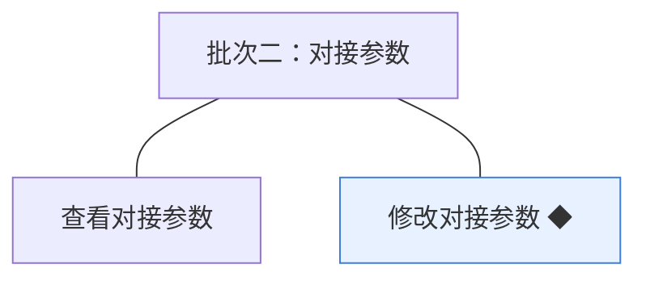

# 开发顺序与需求拆解（大版本）：0.2 站点与分类版

> 定位：把《PRD（大版本）：0.2 站点与分类版》转换为开发批次＋功能级需求条目；本文即该版本的完整需求清单，需求池据此直接入池、不另生成版本快照。上游为模拟案例材料，模拟性质保留。

## 1. 拆解说明

- **一一同构粒度口径**：一条需求（R 编号）＝一项 PRD 功能，需求名即 PRD 功能名（含 ◆）；需求表的用途与验收标准**逐字引自 PRD 功能清单原文**，不压缩、不改写。按钮、字段、跳转级的原子拆解归小版本 PRD，不进本文。
- **本文即需求清单**：需求池批量入池直接读本文各批次需求表；池侧不生成版本快照，验收标准回溯本文（R 编号与 PRD 锚点随行可查）。
- **多入口口径**：本文是需求池的主入口但不是唯一入口——会议、沟通、临时反馈产生的需求从其他角度直接进入需求池（M01 起编号），不经本文；两类条目并存互不覆盖。
- **小版本规划的输入**＝本文开发顺序（批次建议，素材而非锁定）＋需求池实时状态，两者合并；唯一硬约束是本文声明的依赖与同事务契约不回退。

## 2. 开发顺序

**前置版本沿用面**：0.1 基座版全部能力（机构端账号与角色授权、登录控制、能力点校验、登录鉴权与按端隔离）——本版两个模块的每个功能都以其为权限与入口前提；机构运营人员角色的能力点集合自本版起填充（分类管理能力，0.1 预置为空口径的落定）。外部依赖：视频与存储服务商随本版立项定案并同步申请账号（外部流程，批次二收口消费）。

**顺序依据与同事务契约**：站点信息修改与分类增删改均无跨模块依赖，可同批并行开发、一次演示（站点配置查看→修改、分类搭建全链）；对接参数修改依赖外部服务连通性校验（外部联调点），单独成批并在本批收口服务商依赖（04C-站点配置 3.4）；同事务契约——站点信息修改、对接参数保存、分类软删除各自与留痕同事务完成（04C-站点配置 3.3／3.4、04C-课程，开发规范）。

### 2.1 批次一：站点信息与分类骨架

- **目标**：机构管理员能查看并修改站点对外信息，机构运营人员能搭建完整分类骨架（增改删查），学员端可用口径数据就绪。
- **依赖**：0.1 基座版（机构端账号与能力点校验——配置与分类操作分别限机构管理员与机构运营人员）。
- **可验收形态**：机构管理员登录→查看站点配置→修改站点名称／标识／文案（即时生效留痕，占用与缺项被拦截）；机构运营人员登录→新增多个分类→调整层级与排序→删除一个未引用分类（软删除）→机构端全量可见、学员端口径只含未删除分类。
- **判断注记**：站点信息与分类两组并批——两者互不依赖但同属「机构侧准备」、可一次演示完整准备链，拆开无独立验收收益；对接参数不并入本批因其连通性校验依赖外部服务商（见批次二）。

条目与 PRD 4.1／4.2 功能清单一一同构，用途与验收标准逐字引自原文：

| 编号 | 需求名 | 用途 | 验收标准 |
|---|---|---|---|
| R12 | 查看站点配置 | 机构管理员与机构运营人员查看站点对外信息与对接参数的当前值，作为配置与排查的前提 | 机构管理员与机构运营人员进入站点配置可查看当前站点名称、标识、基础文案及对接参数条目；对接参数中的密钥类条目以脱敏形式展示，不显示完整值 |
| R13 | 修改站点信息 ◆ | 机构管理员维护站点对外信息，使门户以机构自己的名义对外呈现 | 机构管理员修改站点名称、标识或基础文案并保存后修改即时生效、留有修改留痕；必填缺失或站点标识被占用时保存失败并提示 |
| R14 | 新增分类 | 机构运营人员建立课程分类并指定层级与排序，作为课程的组织骨架 | 机构运营人员提交分类名、层级与排序后分类创建成功并在机构端分类列表可见；必填缺失时创建失败并提示 |
| R15 | 修改分类 | 机构运营人员调整分类的名称、层级与排序，保持骨架与机构经营一致 | 机构运营人员修改分类后保存即时生效，机构端分类列表按最新层级与排序展示 |
| R16 | 删除分类 | 机构运营人员清理不再使用的分类，保持骨架整洁 | 机构运营人员删除未被引用的分类后该分类从可用口径移出、记录保留（软删除）；被课程引用的分类删除被拦截并提示 |
| R17 | 查看分类 | 机构端查看全量分类骨架，学员端按可用口径读取分类，作为后续课程浏览的组织依据 | 机构端可查看全量分类（含已删除标记）；学员端可用分类口径只包含未删除分类，本版以接口口径验收（学员端界面呈现随 0.5 交付） |

### 2.2 批次二：对接参数

- **目标**：机构管理员能查看并维护视频与存储服务接入参数，参数经连通性校验后生效留痕。
- **依赖**：批次一（站点配置对象与查看面就绪）；**外部联调点**——视频与存储服务商已定案且测试接入项可用（随本版立项定案并申请，本批收口）。
- **可验收形态**：机构管理员查看各服务接入项（密钥脱敏）→修改接入项→系统连通性校验通过后保存留痕→以错误参数重试被保留原参数并提示失败原因；新发起的对接使用新参数。
- **判断注记**：对接参数单独成批——连通性校验需真实外部服务配合（联调点强制），与批次一的纯内部能力分离以免外部依赖阻塞整批验收；查看（R18）与修改（R19）同批成对交付，不单拆。

条目与 PRD 4.1 功能清单一一同构，用途与验收标准逐字引自原文：

| 编号 | 需求名 | 用途 | 验收标准 |
|---|---|---|---|
| R18 | 查看对接参数 | 机构管理员查看各外部服务的接入项，作为修改与排查的前提 | 机构管理员可查看各外部服务接入项列表与最近修改留痕；密钥类条目不回显完整值 |
| R19 | 修改对接参数 ◆ | 机构管理员维护视频与存储服务的接入参数，供课程内容与学习链路对接外部服务 | 机构管理员修改接入项后系统先做连通性校验：校验通过则保存生效并留痕，不通过则保持原参数并提示失败原因；新发起的对接使用新参数，已发出的播放凭据不受影响 |

**批次判断与边界取舍**：两批已是最少批次——批次一内站点与分类并批（一次演示准备链）、批次二因外部联调点强制单列；8 条不逐功能拆批；R12 与 R18 同为查看类但分属两批（R18 与修改成对、随联调批交付）。

**版本级验收安排**：按 PRD 1 的成功标准与量化口径验收（三条判定线）；灰度属上线安排不占开发批次——本版无资金流转与对外发布风险面（学员端口径为数据先行），路线图 0.2 完成标志即验收锚。

## 3. 条目与 PRD 对应核对

- **一一同构声明**：条目数＝PRD 功能数＝8（R12～R19），逐行对应、无归并、无路径拆分、无 PRD 外内容。
- **批次构成**：批次一 6 条（站点信息组 2＋分类管理组 4）；批次二 2 条（对接参数组 2）。
- **◆ 清点**：2 个——R13 修改站点信息、R19 修改对接参数，与 PRD 功能全景总图同标。
- **过渡支撑清点**：0 个——学员端可用分类口径为先行基座（数据与接口就绪，供 0.5 接入），非过渡支撑。

## 4. 与需求池和小版本规划的衔接

- **入池路径**：需求池按「批量入池」直读本文第 2 章各批次需求表，条目编号沿用 R12～R19、批次随本文继承。
- **多入口口径**：会议、沟通、临时反馈类需求不经本文，直接单条入池（M01 起编号），与本批条目并存互不覆盖。
- **小版本规划的合并输入**：批次是建议而非锁定——确认小版本时以本文开发顺序＋需求池实时状态合并定范围；本文声明的依赖与同事务契约（0.1 前置、批次二外部联调点、留痕同事务）不回退。
- **认领与细化原则**：每条凭随行验收标准即可独立认领与验收；开发级细化（交互、字段、边界、用例）归小版本 PRD，本文任何位置不低于 PRD 功能级粒度。
