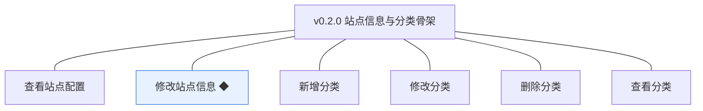
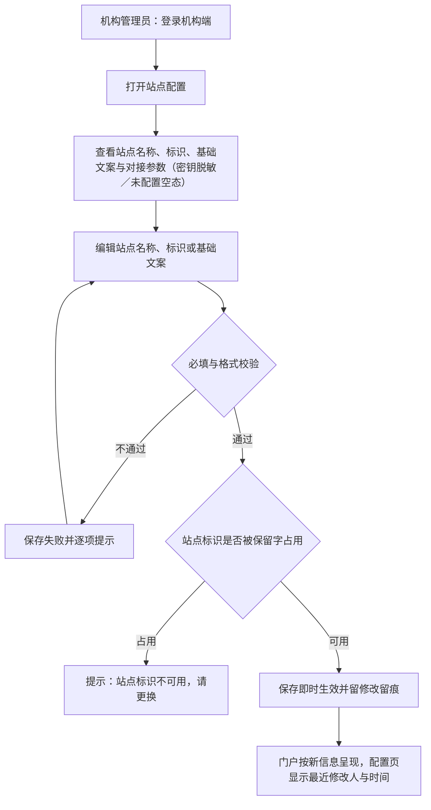
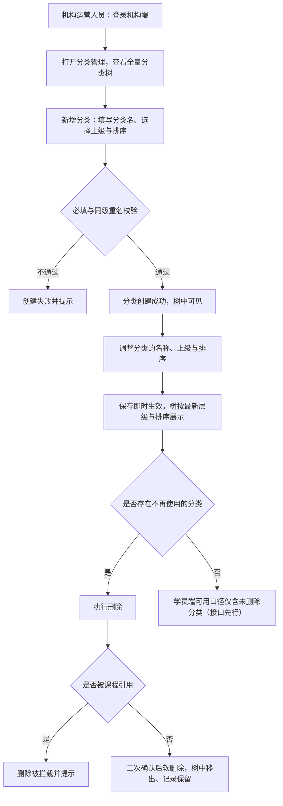
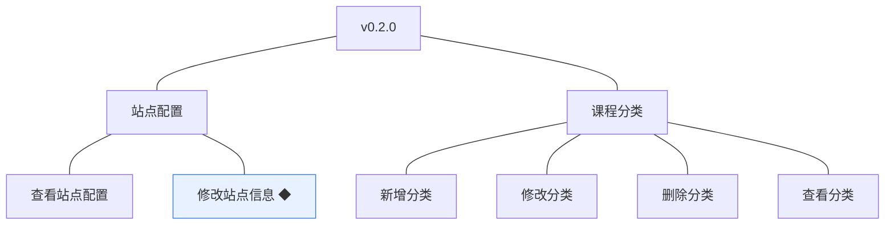

# PRD（小版本）：v0.2.0 站点信息与分类骨架

> 定位：开发级需求说明书——承接《PRD（大版本）：0.2 站点与分类版》与《0.2 开发顺序与需求拆解》批次一，认领自需求池（R12～R17）；把每条需求细化到开发与测试拿到即可开工的深度。上游为模拟案例材料，模拟性质保留；本版采用值中属推断／默认者就地标注并汇总于第 6 章。

## 1. 版本概述

**承接与目标**：认领来源＝0.2 大版本 02 批次一「站点信息与分类骨架」整批（R12～R17）＋需求池实时状态合并（批次一全部待规划，简单场景直接采纳整批）。本版可验收形态（沿用上游批次一）：机构管理员登录→查看站点配置→修改站点名称／标识／文案（即时生效留痕，占用与缺项被拦截）；机构运营人员登录→新增多个分类→调整层级与排序→删除一个未引用分类（软删除）→机构端全量可见、学员端口径只含未删除分类。

**范围外声明**：R18～R19（对接参数的查看与修改）随 v0.2.1 交付，本版对接参数只随 R12 脱敏只读展示、无维护入口；课程及其归属（0.4）、门户学员端界面（0.5）、人工推荐位与页面装修（围栏）均不在本版；站点配置多站点／多域名不做。

**条目内顺序与依赖**（沿用上游批内顺序依据）：R12 查看先行为 R13 修改的前提；分类侧 R14 新增→R15 修改／R16 删除→R17 查看贯穿全链；站点侧与分类侧互不依赖可并行。权限前提：站点信息修改限机构管理员，分类管理限机构运营人员（0.1 能力点校验）。

## 2. 需求范围与验收锚

| 编号 | 需求名 | 用途 | 验收标准 |
|---|---|---|---|
| R12 | 查看站点配置 | 机构管理员与机构运营人员查看站点对外信息与对接参数的当前值，作为配置与排查的前提 | 机构管理员与机构运营人员进入站点配置可查看当前站点名称、标识、基础文案及对接参数条目；对接参数中的密钥类条目以脱敏形式展示，不显示完整值 |
| R13 | 修改站点信息 ◆ | 机构管理员维护站点对外信息，使门户以机构自己的名义对外呈现 | 机构管理员修改站点名称、标识或基础文案并保存后修改即时生效、留有修改留痕；必填缺失或站点标识被占用时保存失败并提示 |
| R14 | 新增分类 | 机构运营人员建立课程分类并指定层级与排序，作为课程的组织骨架 | 机构运营人员提交分类名、层级与排序后分类创建成功并在机构端分类列表可见；必填缺失时创建失败并提示 |
| R15 | 修改分类 | 机构运营人员调整分类的名称、层级与排序，保持骨架与机构经营一致 | 机构运营人员修改分类后保存即时生效，机构端分类列表按最新层级与排序展示 |
| R16 | 删除分类 | 机构运营人员清理不再使用的分类，保持骨架整洁 | 机构运营人员删除未被引用的分类后该分类从可用口径移出、记录保留（软删除）；被课程引用的分类删除被拦截并提示 |
| R17 | 查看分类 | 机构端查看全量分类骨架，学员端按可用口径读取分类，作为后续课程浏览的组织依据 | 机构端可查看全量分类（含已删除标记）；学员端可用分类口径只包含未删除分类，本版以接口口径验收（学员端界面呈现随 0.5 交付） |

锚定说明：上表需求名（含 ◆）、用途、验收标准逐字引自《0.2 开发顺序与需求拆解（大版本）》批次一需求表；本文后续各节只细化不改写，验收以本表为锚。

## 3. 核心用户旅程

旅程承接说明：本版认领段＝大版本 PRD 旅程一「机构管理员配置站点」的站点信息段（查看→修改→生效留痕）与旅程二「机构运营人员搭建课程分类骨架」全链路；旅程一的对接参数段显式排除（R18～R19，随 v0.2.1）。

### 3.1 旅程：机构管理员配置站点信息（开发级）

机构管理员先看现状再改：站点信息保存即时生效并留痕，门户随之按新信息呈现；对接参数本版只读（脱敏或未配置空态）。操作步骤：① 打开站点配置查看 → ② 编辑站点信息 → ③ 保存（异常按提示修正）→ ④ 核对生效与留痕。

### 3.2 旅程：机构运营人员搭建课程分类骨架（开发级）

机构运营人员按课程规划搭骨架：建分类、调层级与排序、清理不再使用的分类（软删除、被引用拦截）。操作步骤：① 查看全量分类树 → ② 新增分类 → ③ 调整层级与排序 → ④ 删除不再使用的分类 → ⑤ 核对可用口径。

## 4. 功能需求

### 4.1 功能总览

**对象增删改查矩阵**

| 对象 | 增 | 改 | 删 | 查 |
|---|---|---|---|---|
| 站点配置 | 不做：部署初始化创建唯一一份（0.2 大版本 PRD 默认值） | R13（站点信息；对接参数随 v0.2.1） | 不做：配置不可删除 | R12（含对接参数脱敏只读） |
| 课程分类 | R14（新增） | R15（名称、上级、排序） | R16（软删除；被课程引用拦截——引用随 0.4 产生） | R17（机构端全量＋学员端可用口径接口） |

**主体使用面**

| 主体 | 使用条目 | 说明 |
|---|---|---|
| 机构管理员 | R12、R13 | 机构端站点配置页（查看＋修改站点信息）；对接参数维护入口本版不出现（随 v0.2.1） |
| 机构运营人员 | R12（只读查看）、R14、R15、R16、R17 | 机构端分类管理页（骨架维护全链）＋站点配置只读 |
| （先行基座）学员端接口 | R17（学员端口径） | 无界面：可用分类接口只含未删除分类，界面呈现随 0.5 |

### 4.2 R12 查看站点配置

**功能说明**：机构管理员与机构运营人员查看站点对外信息与对接参数的当前值，作为配置与排查的前提。触发：机构端用户进入「站点配置」页。

**交互与流程**：操作步骤：① 进入站点配置页 → ② 查看站点名称、标识、基础文案 → ③ 查看对接参数区（已配置：条目名＋脱敏值；未配置：显示「未配置」空态） → ④ 查看最近修改留痕（最近修改人与时间）。

**字段与校验**

| 展示项 | 类型 | 展示规则 | 失败反馈 |
|---|---|---|---|
| 站点名称／站点标识／基础文案 | 只读展示（本页） | 当前值原样展示；基础文案为空时显示「未填写」 | 无 |
| 对接参数条目 | 只读展示 | 已配置条目显示条目名与脱敏值（密钥类仅显示末 4 位，如 `****abcd`）；未配置显示「未配置」 | 无 |
| 最近修改留痕 | 只读展示 | 最近修改人（姓名）与时间 | 无 |

**规则与边界**：① 页面对机构管理员与机构运营人员均可见（能力点：站点配置查看，本版填充至两角色，本版拍板）；② 密钥类条目任何情况不回显完整值（开发规范）；③ 修改入口仅机构管理员可见（R13 能力点），机构运营人员本页只读。

**异常与拦截**：非上述两角色调用查看接口→能力点校验拒绝；会话过期→按未登录处理。

### 4.3 R13 修改站点信息 ◆

**功能说明**：机构管理员维护站点对外信息，使门户以机构自己的名义对外呈现。触发：机构管理员在站点配置页编辑站点信息并保存。

**交互与流程**：见图 3.1。操作步骤：① 编辑站点名称／站点标识／基础文案 → ② 保存 → ③ 校验通过：即时生效、写修改留痕、门户按新信息呈现；不通过：停留并逐项提示。

**字段与校验**

| 字段 | 必填 | 业务类型 | 约束与取值 | 失败反馈 |
|---|---|---|---|---|
| 站点名称 | 是 | 对外信息 | 2～20 个字符 | 「请输入 2～20 个字符的站点名称」 |
| 站点标识 | 是 | 对外标识 | 3～20 位小写字母／数字／连字符，不以连字符开头或结尾；不得使用系统保留标识（`admin`、`api`、`www`，本版拍板） | 「站点标识须为 3～20 位小写字母、数字或连字符」／「该站点标识不可用，请更换」 |
| 基础文案 | 否 | 对外信息 | ≤200 个字符 | 「基础文案不能超过 200 个字符」 |

**规则与边界**：① 保存即时生效、不设审核环节（站点信息属机构自身对外名义，04C-站点配置 3.3）；② 每次修改写留痕：操作人、时间、变更项与前后值（04C-站点配置 3.3，开发规范）；③ 对接参数不在本功能范围（随 v0.2.1）；④ 站点标识保留字清单随部署配置（本版内置三值）。

**异常与拦截**：必填缺失或格式不符→字段级提示；站点标识占用保留字→拦截并提示更换；非机构管理员调用保存接口→能力点校验拒绝；会话过期→按未登录处理。

### 4.4 R14 新增分类

**功能说明**：机构运营人员建立课程分类并指定层级与排序，作为课程的组织骨架。触发：机构运营人员在分类管理点击「新增分类」并提交。

**交互与流程**：操作步骤：① 分类管理点击「新增分类」 → ② 填写分类名、选择上级分类（可空＝顶级）、填写排序号 → ③ 提交：校验通过创建成功并在树中可见；不通过停留并提示。

**字段与校验**

| 字段 | 必填 | 业务类型 | 约束与取值 | 失败反馈 |
|---|---|---|---|---|
| 分类名 | 是 | 分类标识 | 2～20 个字符；同一上级下不重名（本版拍板，行业惯例默认） | 「请输入 2～20 个字符的分类名」／「同级已存在同名分类」 |
| 上级分类 | 否 | 层级归属 | 从既有未删除分类中选择；为空即顶级；层级深度上限 2 级（顶级＋子级，本版拍板，行业惯例默认） | 「层级最多为 2 级」 |
| 排序号 | 是 | 展示顺序 | 正整数 1～999；同层级内小者在前 | 「排序号须为 1～999 的整数」 |

**规则与边界**：① 创建成功即在机构端全量列表可见；② 层级上限 2 级（选择上级时若其已是子级则拦截）；③ 上级分类必须为未删除分类。

**异常与拦截**：必填缺失／格式不符→字段级提示；同级重名→拦截；层级超限→拦截；上级已删除→拦截并提示「上级分类不存在或已删除」；非机构运营人员角色调用→能力点校验拒绝。

### 4.5 R15 修改分类

**功能说明**：机构运营人员调整分类的名称、层级与排序，保持骨架与机构经营一致。触发：机构运营人员在分类树中选择分类执行「编辑」并保存。

**交互与流程**：操作步骤：① 树中选择分类点击「编辑」 → ② 修改分类名／上级／排序号 → ③ 保存：即时生效，树按最新层级与排序展示。

**字段与校验**：同 R14 三字段（分类名、上级分类、排序号），约束一致；另：上级不可选择自己或自己的子级（防环，本版拍板）——失败反馈「上级分类不能选择自己或其子级」。

**规则与边界**：① 修改即时生效（无审核）；② 已删除分类不可编辑（提示「分类已删除」）；③ 子分类随上级移动整体保持从属关系。

**异常与拦截**：同级重名（改名后与他者冲突）→拦截；层级超限（拖入子级下）→拦截；选自己或子级为上级→拦截；编辑已删除分类→拦截；非机构运营人员调用→拒绝。

### 4.6 R16 删除分类

**功能说明**：机构运营人员清理不再使用的分类，保持骨架整洁；删除为软删除、记录保留。触发：机构运营人员在分类树中选择分类执行「删除」并确认。

**交互与流程**：操作步骤：① 树中选择分类点击「删除」 → ② 二次确认「删除后该分类将从可用口径移出、记录保留，确认删除？」 → ③ 确认：未被引用即软删除（树中移出）；被引用则拦截。

**字段与校验**

| 字段 | 必填 | 业务类型 | 约束与取值 | 失败反馈 |
|---|---|---|---|---|
| 删除确认 | 是 | 操作确认 | 二次确认文案（如上） | 取消则不执行 |

**规则与边界**：① 删除为软删除：记录保留、机构端全量列表仍可见（带已删除标记）、学员端可用口径移出；② 被课程引用的分类删除拦截（引用关系随 0.4 产生，本版内该拦截恒为未引用路径，规则就绪）；③ 存在未删除子分类时不允许删除（先处理子级，本版拍板）——提示「请先删除或移出其子分类」。

**异常与拦截**：被课程引用→「该分类已被课程引用，无法删除」（本版场景不会触发，规则就绪）；存在未删除子级→拦截；重复删除已删除分类→「分类已删除」；非机构运营人员调用→拒绝。

### 4.7 R17 查看分类

**功能说明**：机构端查看全量分类骨架（含已删除标记），学员端按可用口径读取分类。触发：机构端用户进入「分类管理」；或系统调用学员端可用分类接口。

**交互与流程**：操作步骤：① 机构端进入分类管理 → ② 按层级与排序查看全量分类树（已删除分类带标记、默认折叠或筛除可选） → ③ 学员端可用分类接口返回未删除分类（本版接口先行，无界面）。

**字段与校验**

| 展示项 | 类型 | 展示规则 | 失败反馈 |
|---|---|---|---|
| 分类树 | 机构端列表 | 全量分类按层级与排序展示；已删除分类带「已删除」标记 | 无 |
| 可用分类接口 | 学员端接口 | 仅返回未删除分类，按层级与排序 | 无 |

**规则与边界**：① 机构端全量口径含已删除（管理视角），学员端口径仅未删除（先行基座，界面随 0.5）；② 接口按层级与排序返回；③ 查看对机构管理员与机构运营人员开放（分类管理页入口，能力点：分类管理，本版填充至机构运营人员，查看面向两角色，本版拍板）。

**异常与拦截**：无特殊异常路径（查询类）；无权限角色调用管理接口→拒绝；会话过期→按未登录处理。

## 5. 业务对象与数据字段

**数据主体清单**

| 业务对象 | 落库名 | 定位与关系 |
|---|---|---|
| 站点配置 | `site_config`（术语表已登记） | 全站唯一一份；本版承载站点信息字段，对接参数以存储字段随对象保存（本版只读展示，维护随 v0.2.1） |
| 课程分类 | `course_category`（术语表已登记） | 课程的组织骨架；层级自关联（上级分类），可用与否以软删除表达 |

**站点配置（`site_config`）字段表**

| 字段 | 必填 | 业务类型 | 落库字段名 | 约束与取值 |
|---|---|---|---|---|
| 站点名称 | 是 | 对外信息 | `site_name` | 2～20 个字符；部署初始化默认占位「领课教育」 |
| 站点标识 | 是 | 对外标识 | `site_key` | 3～20 位小写字母／数字／连字符；不与保留字冲突（admin／api／www） |
| 基础文案 | 否 | 对外信息 | `site_desc` | ≤200 个字符 |
| 对接参数 | 是（结构，值可空） | 外部服务配置 | `media_config` | 视频与存储服务接入项集合；本版只随 R12 脱敏只读展示，维护随 v0.2.1（本版拍板） |
| 最近修改人／时间 | 是 | 修改留痕 | `updated_by`／`updated_at` | 每次保存同事务更新；完整变更历史由统一留痕组件记录（机制态，04C-站点配置 3.3） |

**课程分类（`course_category`）字段表**

| 字段 | 必填 | 业务类型 | 落库字段名 | 约束与取值 |
|---|---|---|---|---|
| 分类名 | 是 | 分类标识 | `name` | 2～20 个字符；同一上级下唯一 |
| 上级分类 | 否 | 层级归属 | `parent_id` | 指向本表 `id`，为空即顶级；层级深度上限 2 级 |
| 排序号 | 是 | 展示顺序 | `sort_order` | 1～999 正整数，同层级内小者在前 |
| 删除时间 | 否 | 软删除标记 | `deleted_at` | 为空＝未删除；软删除即写入，学员端可用口径据此过滤 |
| 创建时间／更新时间 | 是 | 审计字段 | `created_at`／`updated_at` | 术语表通用字段 |

列类型、主键、索引与建表 DDL 归开发阶段（开发规范与技术文档）。

## 6. 待议与建议

**本版采用的推断与默认值汇总**

| 采用值 | 来源状态 | 影响与待确认 |
|---|---|---|
| 站点标识格式与保留字（admin／api／www） | 本版拍板（行业惯例默认） | 保留字清单如需扩展随部署配置 |
| 基础文案选填、≤200 字符 | 本版拍板 | 文案条目数与富文本能力随后续版本评估 |
| 分类同级不重名；层级上限 2 级；排序 1～999 | 本版拍板（行业惯例默认） | 层级深度如需 3 级以上随业务确认后调整 |
| 删除须先处理未删除子分类 | 本版拍板 | 子分类整体删除（级联）随后续版本评估 |
| 站点配置查看与分类查看面向机构管理员＋机构运营人员，修改与增删限各自管理角色 | 本版拍板（能力点填充：0.1 预置为空口径的落定） | 能力点编码清单随开发阶段定 |
| 对接参数以 `media_config` 存储字段随站点配置保存 | 本版拍板 | 字段结构（分服务条目）随 v0.2.1 维护功能定 |

**建议回池的新想法**：无。

**术语表待登记行（随文档回报，由主流程合入术语表）**：站点配置（site_config）新增字段 `site_name`（站点名称）、`site_key`（站点标识，保留字校验）、`site_desc`（基础文案）、`media_config`（对接参数存储字段，本版只读）、`updated_by`（最近修改人）；课程分类（course_category）新增字段 `name`（分类名，同级唯一）、`parent_id`（上级分类自关联，层级上限 2 级）、`sort_order`（排序号 1～999）、`deleted_at`（软删除时间，空＝未删除）。
