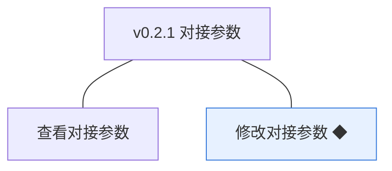
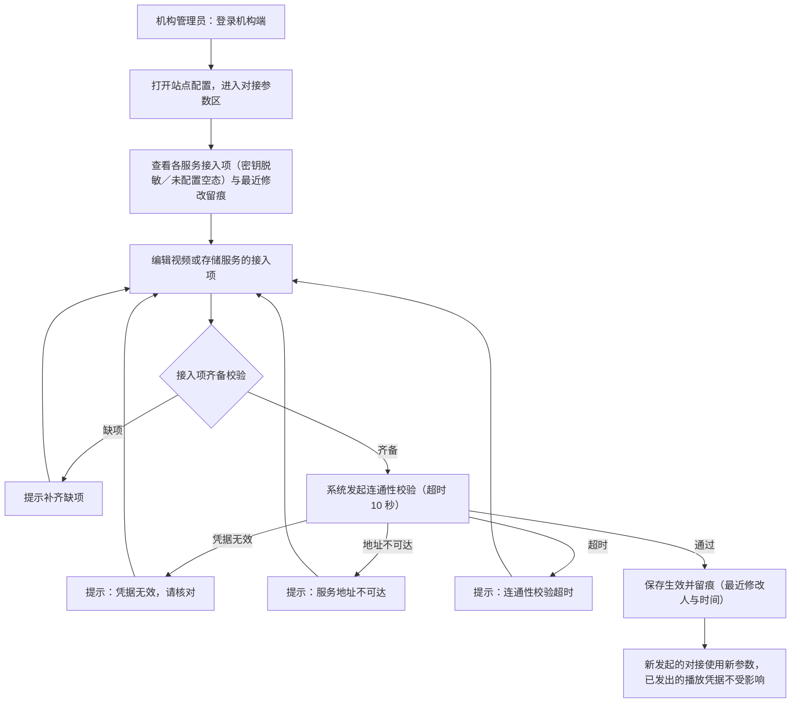
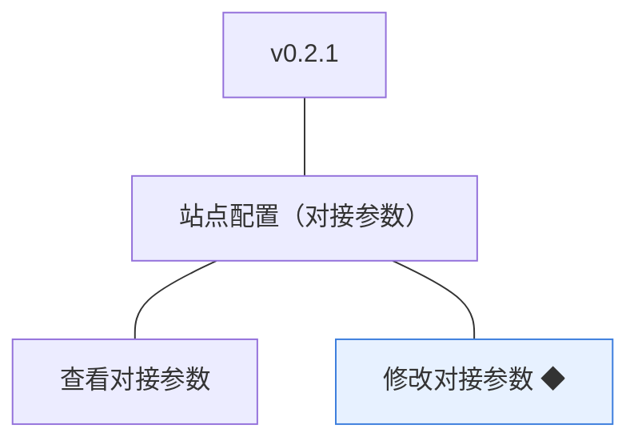

# PRD（小版本）：v0.2.1 对接参数

> 定位：开发级需求说明书——承接《PRD（大版本）：0.2 站点与分类版》与《0.2 开发顺序与需求拆解》批次二，认领自需求池（R18～R19，v0.2.0 发布后批次二全部待规划，整批采纳）；把每条需求细化到开发与测试拿到即可开工的深度。上游为模拟案例材料，模拟性质保留；本版采用值中属推断／默认者就地标注并汇总于第 6 章。

## 1. 版本概述

**承接与目标**：认领来源＝0.2 大版本 02 批次二「对接参数」整批（R18～R19）＋需求池实时状态合并。本版可验收形态（沿用上游批次二）：机构管理员查看各服务接入项（密钥脱敏）→修改接入项→系统连通性校验通过后保存留痕→以错误参数重试被保留原参数并提示失败原因；新发起的对接使用新参数。

**范围外声明**：站点信息与分类管理已随 v0.2.0 发布，本版不改动；课程内容上传与播放（0.4／0.6）不在本版，本版只交付参数配置面与连通性校验；「新发起的对接使用新参数、已发出的播放凭据不受影响」为规则就绪（0.2 无播放行为，实际消费随 0.4 与 0.6）。外部联调点：视频与存储服务商的测试接入项随本版收口（选型与开户属部署配置，定案信息不写入文档，04C-站点配置、D7、K5）。

**条目内顺序与依赖**（沿用上游批内顺序依据）：R18 查看先行为 R19 修改的前提；R19 依赖批次一交付的站点配置对象与查看面（`media_config` 存储字段随 v0.2.0 登记）。权限前提：对接参数查看与修改均限机构管理员（0.1 能力点校验）；v0.2.0 站点配置页的对接参数概览展示（R12，两角色可见）保持不变，本版新增管理员专项维护面。

## 2. 需求范围与验收锚

| 编号 | 需求名 | 用途 | 验收标准 |
|---|---|---|---|
| R18 | 查看对接参数 | 机构管理员查看各外部服务的接入项，作为修改与排查的前提 | 机构管理员可查看各外部服务接入项列表与最近修改留痕；密钥类条目不回显完整值 |
| R19 | 修改对接参数 ◆ | 机构管理员维护视频与存储服务的接入参数，供课程内容与学习链路对接外部服务 | 机构管理员修改接入项后系统先做连通性校验：校验通过则保存生效并留痕，不通过则保持原参数并提示失败原因；新发起的对接使用新参数，已发出的播放凭据不受影响 |

锚定说明：上表需求名（含 ◆）、用途、验收标准逐字引自《0.2 开发顺序与需求拆解（大版本）》批次二需求表；本文后续各节只细化不改写，验收以本表为锚。

## 3. 核心用户旅程

旅程承接说明：本版认领段＝大版本 PRD 旅程一「机构管理员配置站点」的对接参数段（v0.2.0 已交付站点信息段并显式排除本段）；站点信息段与分类骨架旅程已随 v0.2.0 交付，不在本版。

### 3.1 旅程：机构管理员维护对接参数（开发级）

机构管理员先看现状（脱敏值与留痕）再改：接入项齐备后系统自动做连通性校验，任何失败原因都保留原参数、提示修正重试；只有通过才落库留痕。操作步骤：① 查看接入项与留痕 → ② 编辑接入项 → ③ 提交触发连通性校验 → ④ 通过保存留痕／失败按原因修正重试 → ⑤ 后续对接按新参数发起。

## 4. 功能需求

### 4.1 功能总览

**对象增删改查矩阵**

| 对象 | 增 | 改 | 删 | 查 |
|---|---|---|---|---|
| 站点配置（对接参数 `media_config`） | 不做：两组服务条目随部署初始化存在（值可空） | R19（经连通性校验后保存，留痕） | 不做：服务条目不可删除 | R18（接入项列表＋最近修改留痕，密钥脱敏） |

**主体使用面**

| 主体 | 使用条目 | 说明 |
|---|---|---|
| 机构管理员 | R18、R19 | 机构端站点配置页·对接参数区（专项维护面：查看＋修改＋校验） |
| 机构运营人员 | 无本版操作面 | 站点配置页的对接参数概览（v0.2.0 之 R12）保持只读脱敏，不含本版维护入口 |
| （机制）媒体接入模块 | 连通性校验与后续对接 | 无界面：校验由保存动作触发；「新发起对接用新参数、已发出的播放凭据不受影响」为服务端规则（D7、K5） |

### 4.2 R18 查看对接参数

**功能说明**：机构管理员查看各外部服务的接入项与最近修改留痕，作为修改与排查的前提。触发：机构管理员进入站点配置页「对接参数」区。

**交互与流程**：操作步骤：① 进入对接参数区 → ② 按服务类型查看两组接入项（视频点播服务、对象存储服务；未配置显示「未配置」空态） → ③ 查看每组最近修改留痕（最近修改人与时间）。

**字段与校验**

| 展示项 | 类型 | 展示规则 | 失败反馈 |
|---|---|---|---|
| 服务商 | 只读展示 | 部署配置的服务商标识（本版各服务一家，文档以服务类型泛称，定案信息不写入文档） | 无 |
| 接入地址 | 只读展示 | 当前值原样展示；未配置显示「未配置」 | 无 |
| 访问凭据／加密凭据 | 只读展示 | 脱敏展示：仅显示末 4 位（如 `****a1b2`）；未配置显示「未配置」 | 无 |
| 最近修改留痕 | 只读展示 | 每组服务显示最近修改人（姓名）与时间；从未修改显示「未修改」 | 无 |

**规则与边界**：① 本区仅机构管理员可进入（能力点：对接参数维护，本版填充，本版拍板）；② 密钥类条目任何情况不回显完整值（开发规范）；③ v0.2.0 站点配置页的对接参数概览（两角色可见）保持不变，本区为其管理员专项明细（含留痕）。

**异常与拦截**：非机构管理员调用查看接口→能力点校验拒绝；会话过期→按未登录处理。

### 4.3 R19 修改对接参数 ◆

**功能说明**：机构管理员维护视频与存储服务的接入参数，经连通性校验通过后保存生效。触发：机构管理员在对接参数区编辑某服务接入项并提交。

**交互与流程**：见图 3.1。操作步骤：① 选择服务（视频点播／对象存储）编辑接入项 → ② 提交 → ③ 齐备校验：缺项提示补齐 → ④ 连通性校验（经媒体接入模块向所选服务商发起轻量探测，超时 10 秒）：通过则保存生效并留痕；失败则保留原参数并按原因提示（凭据无效／地址不可达／超时）。

**字段与校验**

| 字段 | 必填 | 业务类型 | 约束与取值 | 失败反馈 |
|---|---|---|---|---|
| 服务商 | 是（本版固定） | 服务选择 | 本版各服务一家（部署配置），界面只读展示不可改 | 无修改入口 |
| 接入地址 | 是 | 服务接入 | `https://` 或 `http://` 开头的合法地址，≤200 字符 | 「请输入合法的服务地址」 |
| 访问凭据 | 是 | 服务凭据 | 4～64 位字母／数字；保存后脱敏展示 | 「访问凭据须为 4～64 位字母或数字」 |
| 加密凭据 | 是 | 服务凭据 | 4～64 位字母／数字；不可逆加密存储、仅末 4 位展示 | 「加密凭据须为 4～64 位字母或数字」 |

**规则与边界**：① 保存前必须过连通性校验，校验不通过保持原参数不变，避免把可用配置改坏（04C-站点配置 3.4）；② 校验与保存留痕同链路：保存即更新 `media_config` 与最近修改留痕（`updated_by`／`updated_at`＋统一留痕组件，04C-站点配置 3.4）；③ 参数变更只对新发起的对接生效，已发出的播放凭据不受影响（D7；本版无播放行为，规则就绪、实际消费随 0.4 与 0.6）；④ 凭据不可逆加密存储、任何界面与接口不回显完整值（开发规范）；⑤ 校验超时 10 秒（本版拍板，行业惯例默认）。

**异常与拦截**：接入项缺项→提示补齐、不发起校验；凭据无效／地址不可达／超时→保留原参数并按原因提示；非机构管理员调用保存接口→能力点校验拒绝；会话过期→按未登录处理；探测请求本身异常→按超时口径提示并保留原参数。

## 5. 业务对象与数据字段

**数据主体清单**

| 业务对象 | 落库名 | 定位与关系 |
|---|---|---|
| 站点配置（对接参数部分） | `site_config.media_config`（术语表已登记） | 视频与存储服务接入项集合，全站唯一一份；本版交付维护面（查看＋经校验修改） |
| （机制态）连通性校验 | 无落库：探测行为经媒体接入模块发起，结果随保存动作反馈 | 保存链路的组成部分（K5）；失败原因不入库、随提示呈现，成功以留痕表达 |

**对接参数（`media_config`）字段结构**

| 字段（内嵌键） | 必填 | 业务类型 | 落库字段名 | 约束与取值 |
|---|---|---|---|---|
| 服务商 | 是 | 服务标识 | `provider` | 部署配置固定（本版各服务一家）；视频组与存储组各一 |
| 接入地址 | 是 | 服务接入 | `endpoint` | 合法 URL，≤200 字符 |
| 访问凭据 | 是 | 服务凭据 | `access_key` | 4～64 位字母／数字；脱敏展示（仅末 4 位） |
| 加密凭据 | 是 | 服务凭据 | `secret_key` | 4～64 位字母／数字；不可逆加密存储、仅末 4 位展示 |

（两组服务条目——视频点播 `video`／对象存储 `storage`——为 `media_config` 的固定分组键，本版拍板；列类型与存储形态归开发阶段。）

**沿用对象**：站点配置（`site_config`）整体、`updated_by`／`updated_at` 留痕字段与统一留痕组件沿用 v0.2.0 登记，本版无新增沿用路径。

## 6. 待议与建议

**本版采用的推断与默认值汇总**

| 采用值 | 来源状态 | 影响与待确认 |
|---|---|---|
| 连通性校验超时 10 秒；失败原因三类（凭据无效／地址不可达／超时） | 本版拍板（行业惯例默认） | 失败原因分类如需细化（如权限不足单独提示）随后续版本评估 |
| 对接参数按两组服务条目组织（video／storage），服务商本版各一家且界面只读 | 本版拍板（部署配置，定案信息不写入文档） | 多服务商选择界面随后续版本评估（D7 适配层已支持替换） |
| 凭据格式 4～64 位字母／数字 | 本版拍板 | 个别服务商凭据含特殊字符时放宽规则 |
| 能力点「对接参数维护」填充至机构管理员 | 本版拍板（0.1 预置为空口径的落定续） | — |

**建议回池的新想法**：无。

**术语表待登记行（随文档回报，由主流程合入术语表）**：`media_config` 内嵌键登记——分组键 `video`（视频点播服务）／`storage`（对象存储服务），每组字段 `provider`（服务商，部署配置固定）、`endpoint`（接入地址，合法 URL ≤200）、`access_key`（访问凭据，脱敏展示仅末 4 位）、`secret_key`（加密凭据，不可逆加密存储）；能力点命名「对接参数维护」。
