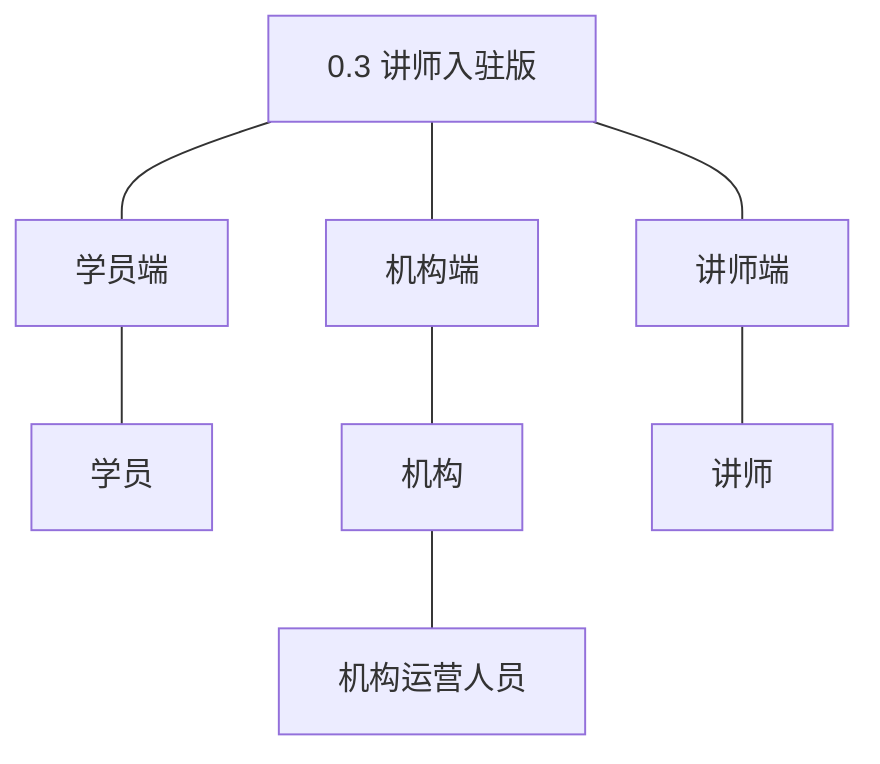
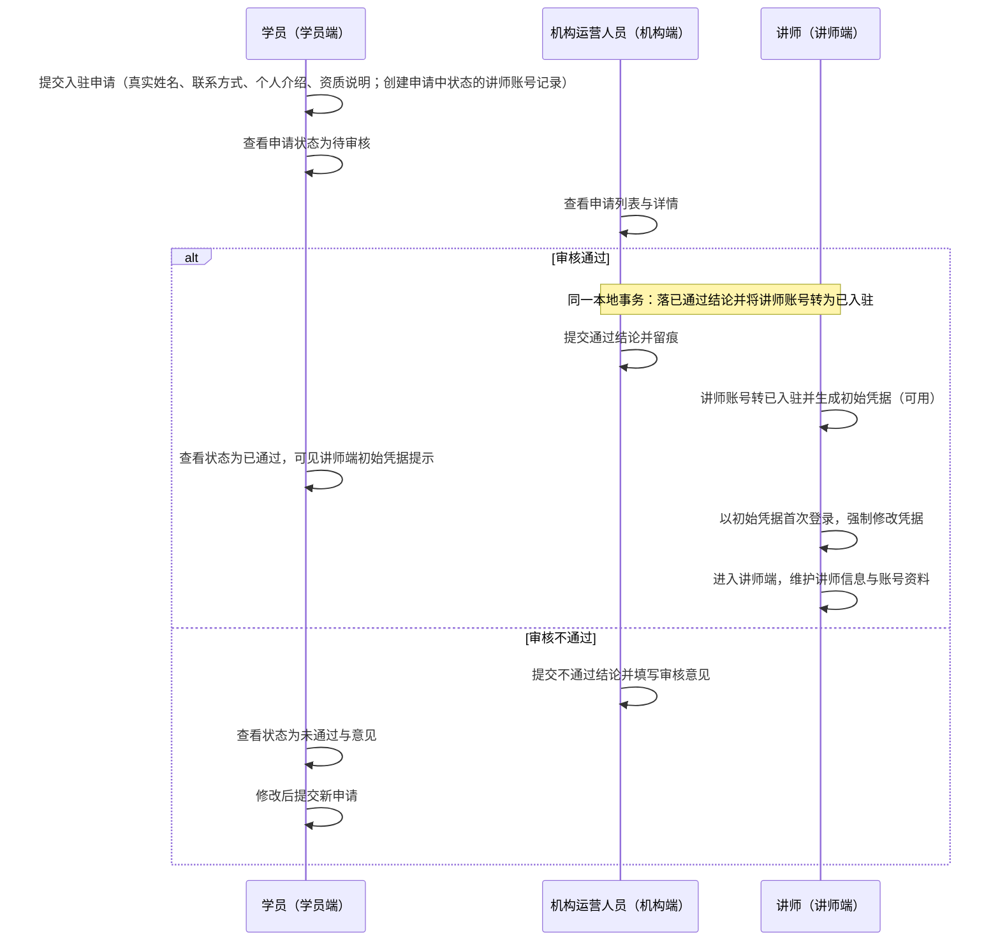
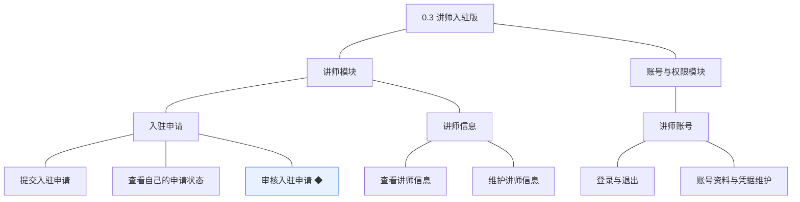
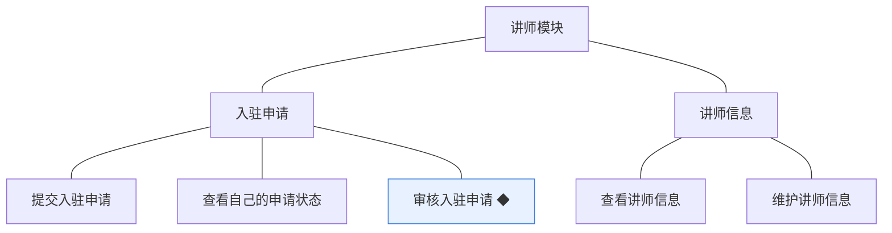
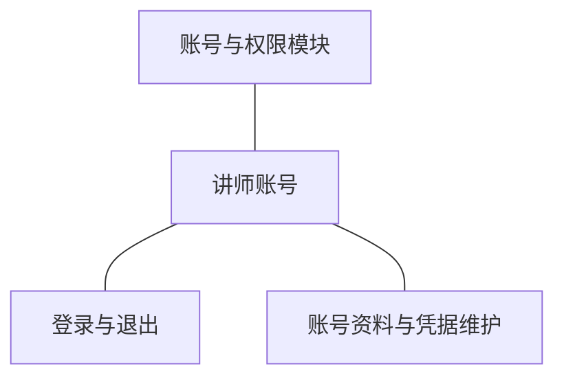
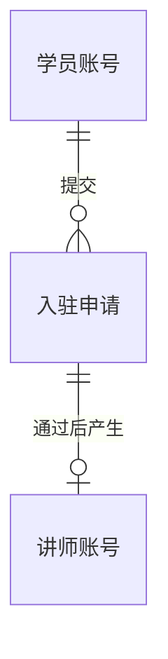
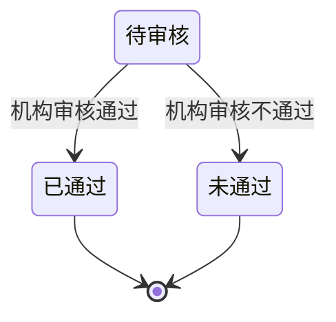
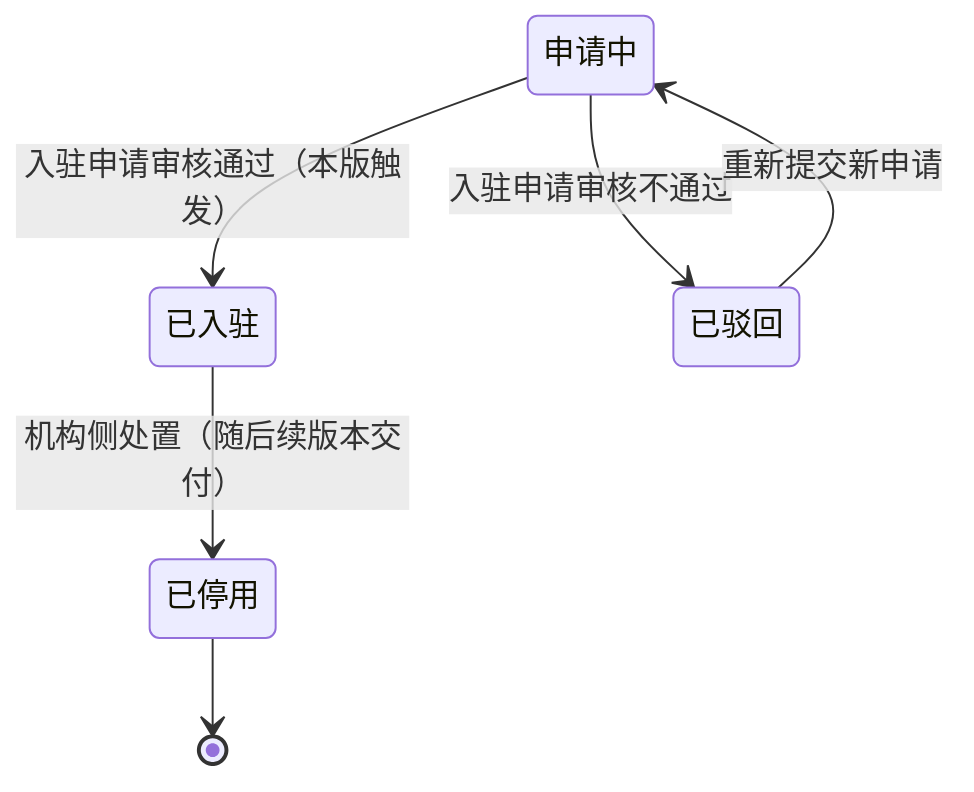

# PRD（大版本）：0.3 讲师入驻版

> 定位：本版立项说明书——承接《产品路线图（项目）》0.3 讲师入驻版条目与项目级基线，界定本版做什么、每个功能做到什么程度算完成，供需求拆解与小版本规划直接开工。上游为模拟案例材料，模拟性质保留；版本级默认值就地标注来源状态。

## 1. 版本概述

**承接与目标**：课程供给方进入系统——学员能申请成为讲师、机构能把住入驻关口、通过者能登录讲师端（路线图 0.3 目标）。本版交付讲师模块（入驻申请的提交、查看与审核，讲师信息的维护与查看）与账号与权限模块的讲师侧（讲师端登录与退出、账号资料与凭据维护）。

**成功标准与量化口径**：① 入驻链路全程线上自助（申请、审核、账号产生、首登，本版无人工线下开户环节，自助完成判定线 100%，低于按链路异常排查）；② 审核结论与讲师账号状态流转同事务一致（通过→已入驻且凭据就绪、不通过→已驳回）、结论一经作出不可改判（判定线 100%——出现「已通过但账号未就绪」或结论改判即按审核链路异常排查）；③ 不通过路径可闭环（判定方式：一名被拒申请人能在界面上看到审核意见并成功提交新申请）。

**范围一句话**：做——入驻申请链（提交、查看状态、审核◆）＋讲师信息（维护、查看）＋讲师端账号（登录与退出、资料与凭据维护）；不做——讲师分级与资质认证、机构直接开设讲师账号（讲师身份一律经入驻审核产生，D5）、资质附件上传（申请以文字说明，附件上传能力随 0.4 交付后另行回池评估）、入驻有效期（本版入驻长期有效）。无能力真空期过渡（课程创作随 0.4、尚无已发生业务）；讲师端本版仅个人中心与讲师信息维护，属先行基座；学员端讲师信息展示为接口先行（课程详情中的呈现随 0.5）。

**沿用与前置**：前置＝0.1 基座版（学员账号——申请的发起身份；机构端角色与能力点校验——审核的权限前提；登录鉴权与按端隔离——讲师端登录态隔离的机制基础）。沿用对象无新增路径（学员账号、机构端账号仅以既有身份使用本版能力）。**待定决策落定（路线图 0.3 依赖行）**：入驻申请填写项定案为真实姓名、联系方式、个人介绍、资质说明（全文字项）；不设入驻有效期（重新申请仅发生于新申请场景）。

## 2. 主体与角色

| 主体／角色 | 端 | 怎么用系统 |
|---|---|---|
| 学员（申请人） | 学员端 | 以本人学员账号提交入驻申请、查看申请状态与审核意见；通过后获取讲师端初始凭据 |
| 机构运营人员 | 机构端 | 审阅入驻申请并作出通过／不通过结论（含查看申请人与讲师信息） |
| 讲师 | 讲师端 | 首登强制修改初始凭据后登录讲师端，维护对外讲师信息与自身账号资料 |

**裁剪说明**：讲师主体自本版上场（讲师端首个可用形态＝个人中心＋讲师信息维护，课程能力随 0.4）；机构管理员本版无新增直接功能（账号与授权沿用 0.1）；讲师分级等角色细分不做（围栏）。

## 3. 核心业务流程

### 3.1 旅程：从学员申请到讲师登台（跨学员端、机构端、讲师端）

学员以本人身份发起申请（同时创建申请中状态的讲师账号记录，尚不可登录），机构运营人员在机构端把关：通过则同事务将账号转为已入驻并生成初始凭据（即可用的讲师账号），申请人在学员端看到通过结论与讲师端初始凭据提示，凭初始凭据首登（强制改密）进入讲师端；不通过则账号转已驳回、意见可见，可再次申请（账号随新申请回到申请中）。操作步骤：① 学员提交申请 → ② 运营人员查看详情 → ③ 作出结论（通过：账号同事务产生／不通过：填写意见）→ ④ 学员查看状态 → ⑤ 通过者首登改密并维护信息／不通过者修改后重新申请。

## 4. 功能需求

### 4.1 讲师模块

**入驻申请组**：讲师身份的唯一入口（D5——机构不直接开设讲师账号）；结论终态、不可改判（D4）。

| 功能 | 用途 | 验收标准 |
|---|---|---|
| 提交入驻申请 | 学员以本人学员账号申请成为平台讲师，进入机构审核 | 学员登录后提交入驻申请（真实姓名、联系方式、个人介绍、资质说明），提交成功后申请状态为待审核；存在待审核申请时重复提交被拒绝并提示 |
| 查看自己的申请状态 | 申请人随时查看入驻申请的审核进展与结论 | 申请人可查看本人申请的状态（待审核／已通过／未通过）与审核意见，无法查看他人申请；已通过状态可见讲师端初始凭据提示 |
| 审核入驻申请 ◆ | 机构运营人员审阅入驻申请并作出结论，把住入驻关口 | 机构运营人员对申请作出通过或不通过结论：通过时同事务产生可用状态的讲师账号；不通过时必须填写审核意见；结论一经作出不可改判 |

**讲师信息组**：讲师对外形象的唯一维护面；学员端展示为接口先行。

| 功能 | 用途 | 验收标准 |
|---|---|---|
| 查看讲师信息 | 供机构端只读查看讲师（含申请人）的对外介绍，学员端口径接口先行 | 机构端在审核详情与讲师信息中可只读查看对外介绍（不含账号凭据与状态）；学员端以讲师信息接口先行（课程详情中的展示随 0.5 交付） |
| 维护讲师信息 | 讲师维护对外展示的介绍信息，只对本人开放 | 讲师登录后可修改自己的对外介绍信息，保存后再次查看为更新后内容；无法查看或修改其他讲师的信息 |

### 4.2 账号与权限模块（讲师侧）

**讲师账号组**：讲师端身份的自助面；登录态与学员端、机构端互不通用（D5）。

| 功能 | 用途 | 验收标准 |
|---|---|---|
| 登录与退出 | 讲师建立与结束讲师端会话，作为使用讲师端功能的前提 | 讲师以讲师账号凭据登录讲师端成功进入；凭据错误登录失败并提示；退出后会话结束；讲师登录态与学员端、机构端互不通用 |
| 账号资料与凭据维护 | 讲师端的个人中心，维护自身账号资料与登录凭据 | 讲师登录后可修改自己的账号资料与登录凭据；修改凭据后既有会话失效、需以新凭据重新登录；无法访问他人资料 |

## 5. 业务对象

### 5.1 入驻申请

定位：讲师入驻请求与审核结论，讲师身份的来源凭据（落库名沿用术语表 `teacher_apply`）。

说明：申请由学员账号提交（填写项：真实姓名、联系方式、个人介绍、资质说明——全文字项，本版立项定案）；结论一经作出即为终态、不可改判（D4），不通过后再次申请属新的一次申请；审核留痕（审核人、时间、意见）随结论同事务写入（04C-讲师 3.3）；不设入驻有效期（本版立项定案）。

### 5.2 讲师账号

定位：讲师在讲师端的身份，承载凭据与对外讲师信息（落库名沿用术语表 `teacher_account`，状态枚举沿用术语表）；账号记录随申请提交创建，审核结论使其流转（见说明）。

说明：账号记录随申请提交创建，状态为申请中——此时尚无有效凭据、不可登录讲师端；审核结论同事务流转账号状态：通过转已入驻并生成初始凭据（即锚文所称「产生可用状态的讲师账号」——可用＝已入驻、可登录），不通过转已驳回（记录保留，与术语表登记的账号状态机一致）；已驳回的申请人重新提交新申请后，其账号随新申请回到申请中；凭据独立于学员账号（初始凭据随通过生成、首登强制修改，机制沿用 0.1 统一口径，本版拍板）；「申请中 → 已入驻」由审核通过触发（04C-讲师 第 4 节），「已停用」的机构侧处置随后续版本交付；讲师编号（`TC`＋8 位序号）在账号记录创建时生成、沿用术语表编码契约。
