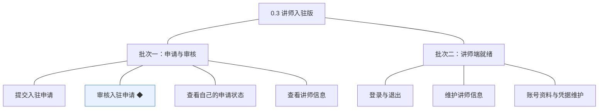
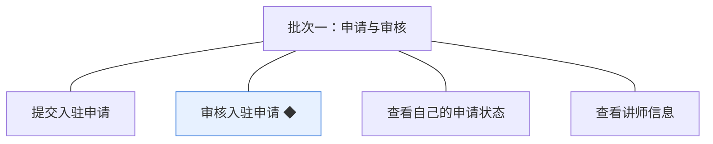
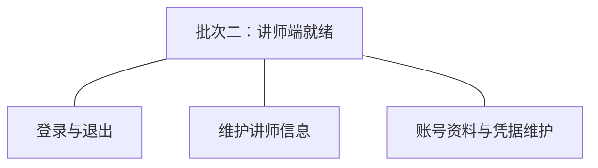

# 开发顺序与需求拆解（大版本）：0.3 讲师入驻版

> 定位：把《PRD（大版本）：0.3 讲师入驻版》转换为开发批次＋功能级需求条目；本文即该版本的完整需求清单，需求池据此直接入池、不另生成版本快照。上游为模拟案例材料，模拟性质保留。

## 1. 拆解说明

- **一一同构粒度口径**：一条需求（R 编号）＝一项 PRD 功能，需求名即 PRD 功能名（含 ◆）；需求表的用途与验收标准**逐字引自 PRD 功能清单原文**，不压缩、不改写。按钮、字段、跳转级的原子拆解归小版本 PRD，不进本文。
- **本文即需求清单**：需求池批量入池直接读本文各批次需求表；池侧不生成版本快照，验收标准回溯本文（R 编号与 PRD 锚点随行可查）。
- **多入口口径**：本文是需求池的主入口但不是唯一入口——会议、沟通、临时反馈产生的需求从其他角度直接进入需求池（M01 起编号），不经本文；两类条目并存互不覆盖。
- **小版本规划的输入**＝本文开发顺序（批次建议，素材而非锁定）＋需求池实时状态，两者合并；唯一硬约束是本文声明的依赖与同事务契约不回退。

## 2. 开发顺序

**前置版本沿用面**：0.1 基座版（学员账号与登录——申请的发起身份；机构端角色与能力点校验——审核的权限前提；登录鉴权与按端隔离——讲师端登录态隔离与初始凭据强制修改机制）；0.2 无本版直接依赖（讲师申请不含附件上传，全文字项）。

**顺序依据与同事务契约**：申请先于审核（R20→R22）、审核结论先于讲师端使用（R22→R24～R26）；R21/R23 随申请与审核数据就绪归入批次一；同事务契约——审核通过与讲师账号产生（含结论落库与留痕）同一本地事务（04C-讲师 3.3）；无外部联调点（本版全文字项、无附件上传）。

### 2.1 批次一：申请与审核

- **目标**：学员能提交申请并自助查看状态，机构能审阅并作出终态结论；通过时讲师账号同事务产生。
- **依赖**：0.1 基座版（学员身份与机构端审核权限）。
- **可验收形态**：学员提交申请（重复提交被拒）→ 机构运营人员在审核列表查看详情（含对外介绍）→ 一条通过（库中产生可用讲师账号、留痕齐全）＋一条不通过（意见必填、申请人可见并可再提交新申请）。
- **判断注记**：R21 与 R23 随批次一交付——状态查看依赖申请数据、讲师信息查看依赖申请与通过记录（学员端展示为接口先行）；讲师端登录面不在本批（账号以数据就绪验收，登录随批次二），故完成标志的「能登录讲师端」在批次二闭环。

条目与 PRD 4.1／4.2 功能清单一一同构，用途与验收标准逐字引自原文：

| 编号 | 需求名 | 用途 | 验收标准 |
|---|---|---|---|
| R20 | 提交入驻申请 | 学员以本人学员账号申请成为平台讲师，进入机构审核 | 学员登录后提交入驻申请（真实姓名、联系方式、个人介绍、资质说明），提交成功后申请状态为待审核；存在待审核申请时重复提交被拒绝并提示 |
| R22 | 审核入驻申请 ◆ | 机构运营人员审阅入驻申请并作出结论，把住入驻关口 | 机构运营人员对申请作出通过或不通过结论：通过时同事务产生可用状态的讲师账号；不通过时必须填写审核意见；结论一经作出不可改判 |
| R21 | 查看自己的申请状态 | 申请人随时查看入驻申请的审核进展与结论 | 申请人可查看本人申请的状态（待审核／已通过／未通过）与审核意见，无法查看他人申请；已通过状态可见讲师端初始凭据提示 |
| R23 | 查看讲师信息 | 供机构端只读查看讲师（含申请人）的对外介绍，学员端口径接口先行 | 机构端在审核详情与讲师信息中可只读查看对外介绍（不含账号凭据与状态）；学员端以讲师信息接口先行（课程详情中的展示随 0.5 交付） |

### 2.2 批次二：讲师端就绪

- **目标**：通过审核的讲师能以独立凭据登录讲师端并完成首登改密与自助维护，讲师端首个可用形态就绪。
- **依赖**：批次一（通过结论产生的讲师账号与初始凭据）；0.1 的登录鉴权与按端隔离机制（讲师端取值扩展）。
- **可验收形态**：通过者以初始凭据首登（强制修改）→ 进入讲师端 → 维护对外介绍与账号资料 → 修改凭据后重新登录；讲师登录态访问学员端／机构端接口被拒。
- **判断注记**：讲师端三项并为一批——「首登改密→维护信息→自助资料」是一条可一次演示的完整自助链，无外部联调强制拆分；R23 的学员端接口已在批次一先行，本批不重复。

条目与 PRD 4.1／4.2 功能清单一一同构，用途与验收标准逐字引自原文：

| 编号 | 需求名 | 用途 | 验收标准 |
|---|---|---|---|
| R24 | 登录与退出 | 讲师建立与结束讲师端会话，作为使用讲师端功能的前提 | 讲师以讲师账号凭据登录讲师端成功进入；凭据错误登录失败并提示；退出后会话结束；讲师登录态与学员端、机构端互不通用 |
| R26 | 维护讲师信息 | 讲师维护对外展示的介绍信息，只对本人开放 | 讲师登录后可修改自己的对外介绍信息，保存后再次查看为更新后内容；无法查看或修改其他讲师的信息 |
| R25 | 账号资料与凭据维护 | 讲师端的个人中心，维护自身账号资料与登录凭据 | 讲师登录后可修改自己的账号资料与登录凭据；修改凭据后既有会话失效、需以新凭据重新登录；无法访问他人资料 |

**批次判断与边界取舍**：两批已是最少批次——批次一交付把关闭环（申请→审核→账号产生，跨学员端与机构端可一次演示）、批次二交付讲师端自助链（依赖批次一产生的账号与初始凭据，端内成形后联调）；7 条不逐功能拆批；R23 学员端接口随批次一先行属数据先行，不计入批次二。

**版本级验收安排**：按 PRD 1 的成功标准与量化口径验收（三条判定线）；灰度属上线安排不占开发批次——本版无资金流转与对外发布风险面（讲师端为内部对供给方的端），路线图 0.3 完成标志即验收锚（含不通过申请人可见意见并再次提交的双路径）。

## 3. 条目与 PRD 对应核对

- **一一同构声明**：条目数＝PRD 功能数＝7（R20～R26），逐行对应、无归并、无路径拆分、无 PRD 外内容。
- **批次构成**：批次一 4 条（入驻申请组 3＋讲师信息组 1）；批次二 3 条（讲师信息组 1＋讲师账号组 2）。
- **◆ 清点**：1 个——R22 审核入驻申请，与 PRD 功能全景总图同标。
- **过渡支撑清点**：0 个——讲师端个人中心为先行基座（供 0.4 课程能力接入），学员端讲师信息接口为先行基座（供 0.5 课程详情接入），均非过渡支撑。

## 4. 与需求池和小版本规划的衔接

- **入池路径**：需求池按「批量入池」直读本文第 2 章各批次需求表，条目编号沿用 R20～R26、批次随本文继承。
- **多入口口径**：会议、沟通、临时反馈类需求不经本文，直接单条入池（M01 起编号），与本批条目并存互不覆盖。
- **小版本规划的合并输入**：批次是建议而非锁定——确认小版本时以本文开发顺序＋需求池实时状态合并定范围；本文声明的依赖与同事务契约（0.1 前置、审核与账号产生同事务、批次二依赖批次一账号）不回退。
- **认领与细化原则**：每条凭随行验收标准即可独立认领与验收；开发级细化（交互、字段、边界、用例）归小版本 PRD，本文任何位置不低于 PRD 功能级粒度。
